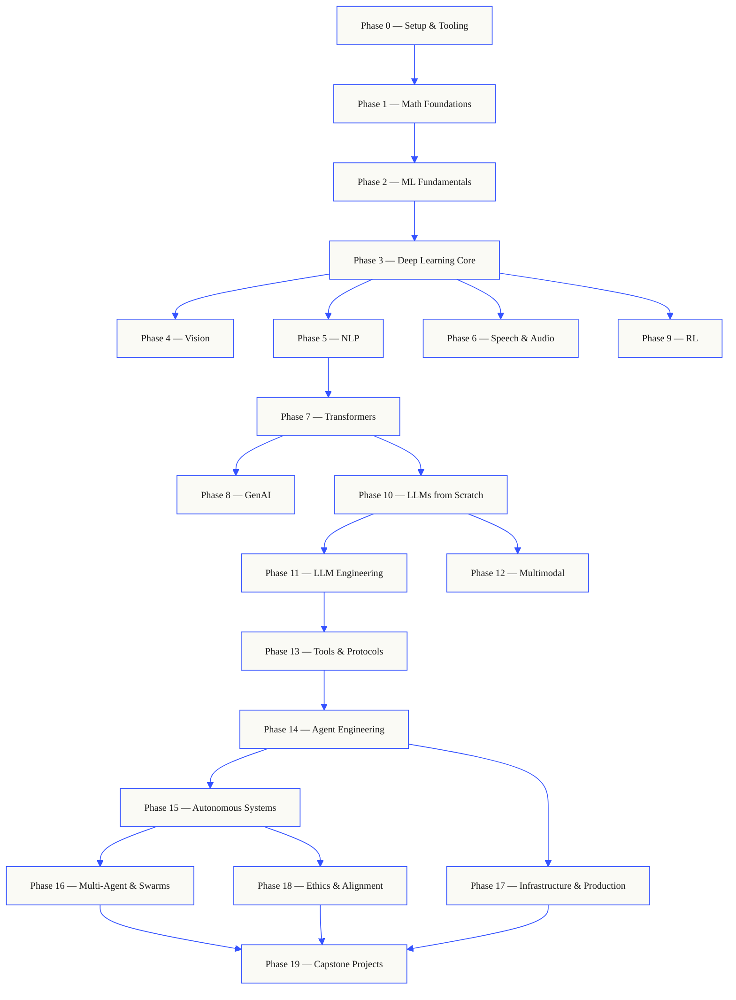
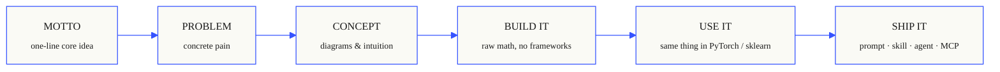

<p align="center">
  <a href="README.md">English</a> · <b>한국어</b>
</p>

<p align="center">
  
</p>

<p align="center">
  <a href="LICENSE"></a>
  <a href="ROADMAP.md"></a>
  <a href="#contents"></a>
  <a href="https://github.com/rohitg00/ai-engineering-from-scratch/stargazers"></a>
  <a href="https://aiengineeringfromscratch.com"></a>
</p>

```
░░░▒▒▒░░░▒▒▒░░░▒▒▒░░░▒▒▒░░░▒▒▒░░░▒▒▒░░░▒▒▒░░░▒▒▒░░░▒▒▒░░░▒▒▒░░░▒▒▒░░░▒▒▒░░░▒▒▒░░░▒▒▒░░░▒▒▒
```

> **학생의 84%가 이미 AI 도구를 사용한다. 그러나 그것을 전문적으로 사용할
> 준비가 되었다고 느끼는 비율은 18%에 불과하다.** 이 커리큘럼은 그 격차를 메운다.
>
> 503개 레슨. 20개 페이즈(phase). 약 320시간. Python, TypeScript, Rust, Julia. 모든 레슨은
> 재사용 가능한 산출물을 만들어낸다. 프롬프트(prompt), 스킬(skill), 에이전트(agent), MCP 서버. 무료, 오픈 소스, MIT.
>
> 당신은 AI를 배우기만 하는 것이 아니다. AI를 직접 만든다. 처음부터 끝까지. 손으로.

## 이 커리큘럼이 작동하는 방식 (How this works)

대부분의 AI 자료는 흩어진 조각으로 가르친다. 여기에 논문 하나, 저기에 파인튜닝(fine-tuning) 글 하나,
또 다른 어딘가에 화려한 에이전트 데모 하나. 그 조각들은 좀처럼 들어맞지 않는다. 챗봇을 출시하지만
그 손실(loss) 곡선을 설명하지 못한다. 에이전트에 함수를 연결하지만, 그것을 호출하는 모델 내부에서
어텐션(attention)이 무엇을 하는지 말하지 못한다.

이 커리큘럼은 그 척추(spine)다. 20개 페이즈, 503개 레슨, 네 가지 언어: Python, TypeScript,
Rust, Julia. 한쪽 끝에는 선형대수(linear algebra), 다른 쪽 끝에는 자율 군집(autonomous swarm). 모든 알고리즘은
먼저 날것의 수학에서부터 만들어진다. 역전파(backprop). 토크나이저(tokenizer). 어텐션. 에이전트 루프(agent loop). PyTorch가
등장할 즈음이면, 당신은 이미 그것이 내부에서 무엇을 하는지 알게 된다.

각 레슨은 동일한 루프를 따른다. 문제를 읽고, 수학을 유도하고, 코드를 작성하고, 테스트를 실행하고,
산출물을 보관한다. 5분짜리 영상도, 복사-붙여넣기 배포도, 떠먹여 주는 안내도 없다.
무료, 오픈 소스이며, 당신 자신의 노트북에서 실행되도록 만들어졌다.

```
░░░▒▒▒░░░▒▒▒░░░▒▒▒░░░▒▒▒░░░▒▒▒░░░▒▒▒░░░▒▒▒░░░▒▒▒░░░▒▒▒░░░▒▒▒░░░▒▒▒░░░▒▒▒░░░▒▒▒░░░▒▒▒░░░▒▒▒
```

## 커리큘럼의 형태 (The shape of the curriculum)

스무 개의 페이즈가 서로의 위에 쌓인다. 수학이 바닥이다. 에이전트와 프로덕션(production)이 지붕이다.
아래 계층을 이미 안다면 건너뛰어도 좋다. 하지만 건너뛴 다음, 위쪽의 무언가가 왜 망가지는지
의아해하지는 말라.



```
░░░▒▒▒░░░▒▒▒░░░▒▒▒░░░▒▒▒░░░▒▒▒░░░▒▒▒░░░▒▒▒░░░▒▒▒░░░▒▒▒░░░▒▒▒░░░▒▒▒░░░▒▒▒░░░▒▒▒░░░▒▒▒░░░▒▒▒
```

## 레슨의 형태 (The shape of a lesson)

각 레슨은 자신만의 폴더에 들어 있으며, 커리큘럼 전체에 걸쳐 동일한 구조를 가진다:

```
phases/<NN>-<phase-name>/<NN>-<lesson-name>/
├── code/      runnable implementations (Python, TypeScript, Rust, Julia)
├── docs/
│   └── en.md  lesson narrative
└── outputs/   prompts, skills, agents, or MCP servers this lesson produces
```

모든 레슨은 여섯 박자(beat)를 따른다. *Build It / Use It* 분할이 척추다 — 먼저 알고리즘을
처음부터 직접 구현하고, 그다음 똑같은 것을 프로덕션 라이브러리를 통해 실행한다. 더 작은 버전을 직접
작성했기 때문에 프레임워크가 무엇을 하고 있는지 이해하게 된다.



## 시작하기 (Getting started)

들어가는 방법은 세 가지다. 하나를 고른다.

**옵션 A — 읽기.** [aiengineeringfromscratch.com](https://aiengineeringfromscratch.com)에서
완성된 레슨을 아무거나 열거나, [Contents](#contents)에서 페이즈를 펼친다. 설정도, 클론도 필요 없다.

**옵션 B — 클론하고 실행하기.**

```bash
git clone https://github.com/rohitg00/ai-engineering-from-scratch.git
cd ai-engineering-from-scratch
python phases/01-math-foundations/01-linear-algebra-intuition/code/vectors.py
```

**옵션 C — 당신의 레벨 찾기 *(권장)*.** 똑똑하게 건너뛴다. 커리큘럼 스킬이 설치된 Claude, Cursor, Codex, OpenClaw, Hermes, 혹은 임의의 에이전트 안에서:

```bash
/find-your-level
```

열 개의 질문. 당신의 지식을 시작 페이즈에 매핑하고, 시간 추정치와 함께 개인화된 경로를 만든다. 각
페이즈 이후:

```bash
/check-understanding 3        # quiz yourself on phase 3
ls phases/03-deep-learning-core/05-loss-functions/outputs/
# ├── prompt-loss-function-selector.md
# └── prompt-loss-debugger.md
```

### 사전 요구 사항 (Prerequisites)

- 코드를 작성할 수 있다(어떤 언어든; Python이면 도움이 된다).
- API를 호출하는 것을 넘어, AI가 **실제로 어떻게 작동하는지** 이해하고 싶다.

### 내장 에이전트 스킬 (Built-in agent skills) (Claude, Cursor, Codex, OpenClaw, Hermes)

| 스킬 | 하는 일 |
|---|---|
| [`/find-your-level`](.claude/skills/find-your-level/SKILL.md) | 열 개 질문의 배치(placement) 퀴즈. 당신의 지식을 시작 페이즈에 매핑하고 시간 추정치와 함께 개인화된 경로를 만든다. |
| [`/check-understanding <phase>`](.claude/skills/check-understanding/SKILL.md) | 페이즈별 퀴즈, 여덟 개 질문, 피드백과 복습할 구체적 레슨 제시. |

```
░░░▒▒▒░░░▒▒▒░░░▒▒▒░░░▒▒▒░░░▒▒▒░░░▒▒▒░░░▒▒▒░░░▒▒▒░░░▒▒▒░░░▒▒▒░░░▒▒▒░░░▒▒▒░░░▒▒▒░░░▒▒▒░░░▒▒▒
```

## 모든 레슨은 무언가를 만들어낸다 (Every lesson ships something)

다른 커리큘럼은 *"축하합니다, X를 배웠습니다."*로 끝난다. 여기서는 각 레슨이 당신의 일상 워크플로에
설치하거나 붙여넣을 수 있는 **재사용 가능한 도구**로 끝난다.

<table>
<tr>
<th align="left" width="25%"><br/><sub>FIG_001 · A</sub><br/><b>PROMPTS</b></th>
<th align="left" width="25%"><br/><sub>FIG_001 · B</sub><br/><b>SKILLS</b></th>
<th align="left" width="25%"><br/><sub>FIG_001 · C</sub><br/><b>AGENTS</b></th>
<th align="left" width="25%"><br/><sub>FIG_001 · D</sub><br/><b>MCP SERVERS</b></th>
</tr>
<tr>
<td valign="top">좁은 작업에 대한 전문가 수준의 도움을 받기 위해 임의의 AI 어시스턴트에 붙여넣는다.</td>
<td valign="top">Claude, Cursor, Codex, OpenClaw, Hermes, 혹은 <code>SKILL.md</code>를 읽는 임의의 에이전트에 넣는다.</td>
<td valign="top">자율 작업자로 배포한다 — 그 루프는 Phase 14에서 당신이 직접 작성했다.</td>
<td valign="top">임의의 MCP 호환 클라이언트에 연결한다. Phase 13에서 처음부터 끝까지 만들었다.</td>
</tr>
</table>

> `python3 scripts/install_skills.py`로 전체를 설치한다. 숙제가 아니라 진짜 도구다.
> 커리큘럼이 끝날 무렵, 당신은 직접 만들었기에 실제로 이해하는 503개의 산출물 포트폴리오를
> 갖게 된다.

### FIG_002 · 작동하는 예제 (A worked sample)

Phase 14, 레슨 1: 에이전트 루프. 순수 Python 약 120줄, 의존성 없음.

<table>
<tr>
<td valign="top" width="50%">

**`code/agent_loop.py`** &nbsp; <sub><i>build it</i></sub>

```python
def run(query, tools):
    history = [user(query)]
    for step in range(MAX_STEPS):
        msg = llm(history)
        if msg.tool_calls:
            for call in msg.tool_calls:
                result = tools[call.name](**call.args)
                history.append(tool_result(call.id, result))
            continue
        return msg.content
    raise StepLimitExceeded
```

</td>
<td valign="top" width="50%">

**`outputs/skill-agent-loop.md`** &nbsp; <sub><i>ship it</i></sub>

```markdown
---
name: agent-loop
description: ReAct-style loop for any tool list
phase: 14
lesson: 01
---

Implement a minimal agent loop that...
```

**`outputs/prompt-debug-agent.md`**

```markdown
You are an agent debugger. Given the trace
of an agent run, identify the step where
the agent went wrong and explain why...
```

</td>
</tr>
</table>

```
░░░▒▒▒░░░▒▒▒░░░▒▒▒░░░▒▒▒░░░▒▒▒░░░▒▒▒░░░▒▒▒░░░▒▒▒░░░▒▒▒░░░▒▒▒░░░▒▒▒░░░▒▒▒░░░▒▒▒░░░▒▒▒░░░▒▒▒
```

<a id="contents"></a>

## 목차 (Contents)

스무 개의 페이즈. 페이즈를 클릭하면 레슨 목록이 펼쳐진다.

<a id="phase-0"></a>
### Phase 0: Setup & Tooling `12 lessons`
> 이어질 모든 것을 위해 환경을 준비한다.

| # | 레슨 | 유형 | 언어 |
|:---:|--------|:----:|------|
| 01 | [개발 환경](phases/00-setup-and-tooling/01-dev-environment/) | Build | Python |
| 02 | [Git과 협업](phases/00-setup-and-tooling/02-git-and-collaboration/) | Learn | — |
| 03 | [GPU 설정과 클라우드](phases/00-setup-and-tooling/03-gpu-setup-and-cloud/) | Build | Python |
| 04 | [API와 키](phases/00-setup-and-tooling/04-apis-and-keys/) | Build | Python |
| 05 | [Jupyter 노트북](phases/00-setup-and-tooling/05-jupyter-notebooks/) | Build | Python |
| 06 | [Python 환경](phases/00-setup-and-tooling/06-python-environments/) | Build | Shell |
| 07 | [AI를 위한 Docker](phases/00-setup-and-tooling/07-docker-for-ai/) | Build | Docker |
| 08 | [에디터 설정](phases/00-setup-and-tooling/08-editor-setup/) | Build | — |
| 09 | [데이터 관리](phases/00-setup-and-tooling/09-data-management/) | Build | Python |
| 10 | [터미널과 셸](phases/00-setup-and-tooling/10-terminal-and-shell/) | Learn | — |
| 11 | [AI를 위한 Linux](phases/00-setup-and-tooling/11-linux-for-ai/) | Learn | — |
| 12 | [디버깅과 프로파일링](phases/00-setup-and-tooling/12-debugging-and-profiling/) | Build | Python |

<details id="phase-1">
<summary><b>Phase 1 — Math Foundations</b> &nbsp;<code>22개 레슨</code>&nbsp; <em>모든 AI 알고리즘 뒤에 있는 직관을 코드로.</em></summary>
<br/>

| # | 레슨 | 유형 | 언어 |
|:---:|--------|:----:|------|
| 01 | [선형대수 직관](phases/01-math-foundations/01-linear-algebra-intuition/) | Learn | Python, Julia |
| 02 | [벡터, 행렬과 연산](phases/01-math-foundations/02-vectors-matrices-operations/) | Build | Python, Julia |
| 03 | [행렬 변환과 고윳값](phases/01-math-foundations/03-matrix-transformations/) | Build | Python, Julia |
| 04 | [ML을 위한 미적분: 도함수와 그래디언트](phases/01-math-foundations/04-calculus-for-ml/) | Learn | Python |
| 05 | [연쇄 법칙과 자동 미분](phases/01-math-foundations/05-chain-rule-and-autodiff/) | Build | Python |
| 06 | [확률과 분포](phases/01-math-foundations/06-probability-and-distributions/) | Learn | Python |
| 07 | [베이즈 정리와 통계적 사고](phases/01-math-foundations/07-bayes-theorem/) | Build | Python |
| 08 | [최적화: 경사 하강법 계열](phases/01-math-foundations/08-optimization/) | Build | Python |
| 09 | [정보 이론: 엔트로피, KL 발산](phases/01-math-foundations/09-information-theory/) | Learn | Python |
| 10 | [차원 축소: PCA, t-SNE, UMAP](phases/01-math-foundations/10-dimensionality-reduction/) | Build | Python |
| 11 | [특잇값 분해](phases/01-math-foundations/11-singular-value-decomposition/) | Build | Python, Julia |
| 12 | [텐서 연산](phases/01-math-foundations/12-tensor-operations/) | Build | Python |
| 13 | [수치 안정성](phases/01-math-foundations/13-numerical-stability/) | Build | Python |
| 14 | [노름과 거리](phases/01-math-foundations/14-norms-and-distances/) | Build | Python |
| 15 | [ML을 위한 통계](phases/01-math-foundations/15-statistics-for-ml/) | Build | Python |
| 16 | [샘플링 기법](phases/01-math-foundations/16-sampling-methods/) | Build | Python |
| 17 | [선형 연립방정식](phases/01-math-foundations/17-linear-systems/) | Build | Python |
| 18 | [볼록 최적화](phases/01-math-foundations/18-convex-optimization/) | Build | Python |
| 19 | [AI를 위한 복소수](phases/01-math-foundations/19-complex-numbers/) | Learn | Python |
| 20 | [푸리에 변환](phases/01-math-foundations/20-fourier-transform/) | Build | Python |
| 21 | [ML을 위한 그래프 이론](phases/01-math-foundations/21-graph-theory/) | Build | Python |
| 22 | [확률 과정](phases/01-math-foundations/22-stochastic-processes/) | Learn | Python |

</details>

<details id="phase-2">
<summary><b>Phase 2 — ML Fundamentals</b> &nbsp;<code>18개 레슨</code>&nbsp; <em>고전 ML — 여전히 대부분의 프로덕션 AI의 근간.</em></summary>
<br/>

| # | 레슨 | 유형 | 언어 |
|:---:|--------|:----:|------|
| 01 | [머신러닝이란 무엇인가](phases/02-ml-fundamentals/01-what-is-machine-learning/) | Learn | Python |
| 02 | [선형 회귀 직접 만들기](phases/02-ml-fundamentals/02-linear-regression/) | Build | Python |
| 03 | [로지스틱 회귀와 분류](phases/02-ml-fundamentals/03-logistic-regression/) | Build | Python |
| 04 | [결정 트리와 랜덤 포레스트](phases/02-ml-fundamentals/04-decision-trees/) | Build | Python |
| 05 | [서포트 벡터 머신](phases/02-ml-fundamentals/05-support-vector-machines/) | Build | Python |
| 06 | [KNN과 거리 측정](phases/02-ml-fundamentals/06-knn-and-distances/) | Build | Python |
| 07 | [비지도 학습: K-Means, DBSCAN](phases/02-ml-fundamentals/07-unsupervised-learning/) | Build | Python |
| 08 | [특성 공학과 선택](phases/02-ml-fundamentals/08-feature-engineering/) | Build | Python |
| 09 | [모델 평가: 지표, 교차 검증](phases/02-ml-fundamentals/09-model-evaluation/) | Build | Python |
| 10 | [편향, 분산과 학습 곡선](phases/02-ml-fundamentals/10-bias-variance/) | Learn | Python |
| 11 | [앙상블 기법: 부스팅, 배깅, 스태킹](phases/02-ml-fundamentals/11-ensemble-methods/) | Build | Python |
| 12 | [하이퍼파라미터 튜닝](phases/02-ml-fundamentals/12-hyperparameter-tuning/) | Build | Python |
| 13 | [ML 파이프라인과 실험 추적](phases/02-ml-fundamentals/13-ml-pipelines/) | Build | Python |
| 14 | [나이브 베이즈](phases/02-ml-fundamentals/14-naive-bayes/) | Build | Python |
| 15 | [시계열 기초](phases/02-ml-fundamentals/15-time-series/) | Build | Python |
| 16 | [이상 탐지](phases/02-ml-fundamentals/16-anomaly-detection/) | Build | Python |
| 17 | [불균형 데이터 다루기](phases/02-ml-fundamentals/17-imbalanced-data/) | Build | Python |
| 18 | [특성 선택](phases/02-ml-fundamentals/18-feature-selection/) | Build | Python |

</details>

<details id="phase-3">
<summary><b>Phase 3 — Deep Learning Core</b> &nbsp;<code>13개 레슨</code>&nbsp; <em>제1원리로부터 신경망. 하나를 만들기 전까지는 프레임워크 없음.</em></summary>
<br/>

| # | 레슨 | 유형 | 언어 |
|:---:|--------|:----:|------|
| 01 | [퍼셉트론: 모든 것이 시작된 곳](phases/03-deep-learning-core/01-the-perceptron/) | Build | Python |
| 02 | [다층 네트워크와 순방향 패스](phases/03-deep-learning-core/02-multi-layer-networks/) | Build | Python |
| 03 | [역전파 직접 만들기](phases/03-deep-learning-core/03-backpropagation/) | Build | Python |
| 04 | [활성화 함수: ReLU, Sigmoid, GELU와 그 이유](phases/03-deep-learning-core/04-activation-functions/) | Build | Python |
| 05 | [손실 함수: MSE, 교차 엔트로피, 대조 손실](phases/03-deep-learning-core/05-loss-functions/) | Build | Python |
| 06 | [옵티마이저: SGD, Momentum, Adam, AdamW](phases/03-deep-learning-core/06-optimizers/) | Build | Python |
| 07 | [정규화: Dropout, Weight Decay, BatchNorm](phases/03-deep-learning-core/07-regularization/) | Build | Python |
| 08 | [가중치 초기화와 학습 안정성](phases/03-deep-learning-core/08-weight-initialization/) | Build | Python |
| 09 | [학습률 스케줄과 워밍업](phases/03-deep-learning-core/09-learning-rate-schedules/) | Build | Python |
| 10 | [나만의 미니 프레임워크 만들기](phases/03-deep-learning-core/10-mini-framework/) | Build | Python |
| 11 | [PyTorch 소개](phases/03-deep-learning-core/11-intro-to-pytorch/) | Build | Python |
| 12 | [JAX 소개](phases/03-deep-learning-core/12-intro-to-jax/) | Build | Python |
| 13 | [신경망 디버깅](phases/03-deep-learning-core/13-debugging-neural-networks/) | Build | Python |

</details>

<details id="phase-4">
<summary><b>Phase 4 — Computer Vision</b> &nbsp;<code>28개 레슨</code>&nbsp; <em>픽셀에서 이해로 — 이미지, 비디오, 3D, VLM, 그리고 월드 모델.</em></summary>
<br/>

| # | 레슨 | 유형 | 언어 |
|:---:|--------|:----:|------|
| 01 | [이미지 기초: 픽셀, 채널, 색 공간](phases/04-computer-vision/01-image-fundamentals/) | Learn | Python |
| 02 | [합성곱 직접 만들기](phases/04-computer-vision/02-convolutions-from-scratch/) | Build | Python |
| 03 | [CNN: LeNet에서 ResNet까지](phases/04-computer-vision/03-cnns-lenet-to-resnet/) | Build | Python |
| 04 | [이미지 분류](phases/04-computer-vision/04-image-classification/) | Build | Python |
| 05 | [전이 학습과 파인튜닝](phases/04-computer-vision/05-transfer-learning/) | Build | Python |
| 06 | [객체 탐지 — YOLO 직접 만들기](phases/04-computer-vision/06-object-detection-yolo/) | Build | Python |
| 07 | [시맨틱 분할 — U-Net](phases/04-computer-vision/07-semantic-segmentation-unet/) | Build | Python |
| 08 | [인스턴스 분할 — Mask R-CNN](phases/04-computer-vision/08-instance-segmentation-mask-rcnn/) | Build | Python |
| 09 | [이미지 생성 — GAN](phases/04-computer-vision/09-image-generation-gans/) | Build | Python |
| 10 | [이미지 생성 — 확산 모델](phases/04-computer-vision/10-image-generation-diffusion/) | Build | Python |
| 11 | [Stable Diffusion — 아키텍처와 파인튜닝](phases/04-computer-vision/11-stable-diffusion/) | Build | Python |
| 12 | [비디오 이해 — 시간적 모델링](phases/04-computer-vision/12-video-understanding/) | Build | Python |
| 13 | [3D 비전: 포인트 클라우드, NeRF](phases/04-computer-vision/13-3d-vision-nerf/) | Build | Python |
| 14 | [비전 트랜스포머 (ViT)](phases/04-computer-vision/14-vision-transformers/) | Build | Python |
| 15 | [실시간 비전: 엣지 배포](phases/04-computer-vision/15-real-time-edge/) | Build | Python |
| 16 | [완전한 비전 파이프라인 만들기](phases/04-computer-vision/16-vision-pipeline-capstone/) | Build | Python |
| 17 | [자기지도 비전 — SimCLR, DINO, MAE](phases/04-computer-vision/17-self-supervised-vision/) | Build | Python |
| 18 | [개방형 어휘 비전 — CLIP](phases/04-computer-vision/18-open-vocab-clip/) | Build | Python |
| 19 | [OCR과 문서 이해](phases/04-computer-vision/19-ocr-document-understanding/) | Build | Python |
| 20 | [이미지 검색과 메트릭 학습](phases/04-computer-vision/20-image-retrieval-metric/) | Build | Python |
| 21 | [키포인트 탐지와 자세 추정](phases/04-computer-vision/21-keypoint-pose/) | Build | Python |
| 22 | [3D Gaussian Splatting 직접 만들기](phases/04-computer-vision/22-3d-gaussian-splatting/) | Build | Python |
| 23 | [확산 트랜스포머와 Rectified Flow](phases/04-computer-vision/23-diffusion-transformers-rectified-flow/) | Build | Python |
| 24 | [SAM 3과 개방형 어휘 분할](phases/04-computer-vision/24-sam3-open-vocab-segmentation/) | Build | Python |
| 25 | [비전-언어 모델 (ViT-MLP-LLM)](phases/04-computer-vision/25-vision-language-models/) | Build | Python |
| 26 | [단안 깊이 및 기하 추정](phases/04-computer-vision/26-monocular-depth/) | Build | Python |
| 27 | [다중 객체 추적과 비디오 메모리](phases/04-computer-vision/27-multi-object-tracking/) | Build | Python |
| 28 | [월드 모델과 비디오 확산](phases/04-computer-vision/28-world-models-video-diffusion/) | Build | Python |

</details>

<details id="phase-5">
<summary><b>Phase 5 — NLP: Foundations to Advanced</b> &nbsp;<code>29개 레슨</code>&nbsp; <em>언어는 지능으로 향하는 인터페이스다.</em></summary>
<br/>

| # | 레슨 | 유형 | 언어 |
|:---:|--------|:----:|------|
| 01 | [텍스트 처리: 토큰화, 어간 추출, 표제어 추출](phases/05-nlp-foundations-to-advanced/01-text-processing/) | Build | Python |
| 02 | [Bag of Words, TF-IDF와 텍스트 표현](phases/05-nlp-foundations-to-advanced/02-bag-of-words-tfidf/) | Build | Python |
| 03 | [단어 임베딩: Word2Vec 직접 만들기](phases/05-nlp-foundations-to-advanced/03-word-embeddings-word2vec/) | Build | Python |
| 04 | [GloVe, FastText와 서브워드 임베딩](phases/05-nlp-foundations-to-advanced/04-glove-fasttext-subword/) | Build | Python |
| 05 | [감성 분석](phases/05-nlp-foundations-to-advanced/05-sentiment-analysis/) | Build | Python |
| 06 | [개체명 인식 (NER)](phases/05-nlp-foundations-to-advanced/06-named-entity-recognition/) | Build | Python |
| 07 | [품사 태깅과 구문 분석](phases/05-nlp-foundations-to-advanced/07-pos-tagging-parsing/) | Build | Python |
| 08 | [텍스트 분류 — 텍스트를 위한 CNN과 RNN](phases/05-nlp-foundations-to-advanced/08-cnns-rnns-for-text/) | Build | Python |
| 09 | [시퀀스-투-시퀀스 모델](phases/05-nlp-foundations-to-advanced/09-sequence-to-sequence/) | Build | Python |
| 10 | [어텐션 메커니즘 — 돌파구](phases/05-nlp-foundations-to-advanced/10-attention-mechanism/) | Build | Python |
| 11 | [기계 번역](phases/05-nlp-foundations-to-advanced/11-machine-translation/) | Build | Python |
| 12 | [텍스트 요약](phases/05-nlp-foundations-to-advanced/12-text-summarization/) | Build | Python |
| 13 | [질의응답 시스템](phases/05-nlp-foundations-to-advanced/13-question-answering/) | Build | Python |
| 14 | [정보 검색과 탐색](phases/05-nlp-foundations-to-advanced/14-information-retrieval-search/) | Build | Python |
| 15 | [토픽 모델링: LDA, BERTopic](phases/05-nlp-foundations-to-advanced/15-topic-modeling/) | Build | Python |
| 16 | [텍스트 생성](phases/05-nlp-foundations-to-advanced/16-text-generation-pre-transformer/) | Build | Python |
| 17 | [챗봇: 규칙 기반에서 신경망까지](phases/05-nlp-foundations-to-advanced/17-chatbots-rule-to-neural/) | Build | Python |
| 18 | [다국어 NLP](phases/05-nlp-foundations-to-advanced/18-multilingual-nlp/) | Build | Python |
| 19 | [서브워드 토큰화: BPE, WordPiece, Unigram, SentencePiece](phases/05-nlp-foundations-to-advanced/19-subword-tokenization/) | Learn | Python |
| 20 | [구조화된 출력과 제약 디코딩](phases/05-nlp-foundations-to-advanced/20-structured-outputs-constrained-decoding/) | Build | Python |
| 21 | [NLI와 텍스트 함의](phases/05-nlp-foundations-to-advanced/21-nli-textual-entailment/) | Learn | Python |
| 22 | [임베딩 모델 심층 탐구](phases/05-nlp-foundations-to-advanced/22-embedding-models-deep-dive/) | Learn | Python |
| 23 | [RAG를 위한 청킹 전략](phases/05-nlp-foundations-to-advanced/23-chunking-strategies-rag/) | Build | Python |
| 24 | [상호참조 해소](phases/05-nlp-foundations-to-advanced/24-coreference-resolution/) | Learn | Python |
| 25 | [개체 연결과 중의성 해소](phases/05-nlp-foundations-to-advanced/25-entity-linking/) | Build | Python |
| 26 | [관계 추출과 지식 그래프 구축](phases/05-nlp-foundations-to-advanced/26-relation-extraction-kg/) | Build | Python |
| 27 | [LLM 평가: RAGAS, DeepEval, G-Eval](phases/05-nlp-foundations-to-advanced/27-llm-evaluation-frameworks/) | Build | Python |
| 28 | [긴 컨텍스트 평가: NIAH, RULER, LongBench, MRCR](phases/05-nlp-foundations-to-advanced/28-long-context-evaluation/) | Learn | Python |
| 29 | [대화 상태 추적](phases/05-nlp-foundations-to-advanced/29-dialogue-state-tracking/) | Build | Python |

</details>

<details id="phase-6">
<summary><b>Phase 6 — Speech & Audio</b> &nbsp;<code>17개 레슨</code>&nbsp; <em>듣고, 이해하고, 말한다.</em></summary>
<br/>

| # | 레슨 | 유형 | 언어 |
|:---:|--------|:----:|------|
| 01 | [오디오 기초: 파형, 샘플링, FFT](phases/06-speech-and-audio/01-audio-fundamentals) | Learn | Python |
| 02 | [스펙트로그램, 멜 스케일과 오디오 특성](phases/06-speech-and-audio/02-spectrograms-mel-features) | Build | Python |
| 03 | [오디오 분류](phases/06-speech-and-audio/03-audio-classification) | Build | Python |
| 04 | [음성 인식 (ASR)](phases/06-speech-and-audio/04-speech-recognition-asr) | Build | Python |
| 05 | [Whisper: 아키텍처와 파인튜닝](phases/06-speech-and-audio/05-whisper-architecture-finetuning) | Build | Python |
| 06 | [화자 인식과 검증](phases/06-speech-and-audio/06-speaker-recognition-verification) | Build | Python |
| 07 | [음성 합성 (TTS)](phases/06-speech-and-audio/07-text-to-speech) | Build | Python |
| 08 | [음성 복제와 음성 변환](phases/06-speech-and-audio/08-voice-cloning-conversion) | Build | Python |
| 09 | [음악 생성](phases/06-speech-and-audio/09-music-generation) | Build | Python |
| 10 | [오디오-언어 모델](phases/06-speech-and-audio/10-audio-language-models) | Build | Python |
| 11 | [실시간 오디오 처리](phases/06-speech-and-audio/11-real-time-audio-processing) | Build | Python |
| 12 | [음성 어시스턴트 파이프라인 만들기](phases/06-speech-and-audio/12-voice-assistant-pipeline) | Build | Python |
| 13 | [신경망 오디오 코덱 — EnCodec, SNAC, Mimi, DAC](phases/06-speech-and-audio/13-neural-audio-codecs) | Learn | Python |
| 14 | [음성 활동 탐지와 발화 차례 전환](phases/06-speech-and-audio/14-voice-activity-detection-turn-taking) | Build | Python |
| 15 | [스트리밍 음성-투-음성 — Moshi, Hibiki](phases/06-speech-and-audio/15-streaming-speech-to-speech-moshi-hibiki) | Learn | Python |
| 16 | [음성 위변조 방지와 오디오 워터마킹](phases/06-speech-and-audio/16-anti-spoofing-audio-watermarking) | Build | Python |
| 17 | [오디오 평가 — WER, MOS, MMAU, 리더보드](phases/06-speech-and-audio/17-audio-evaluation-metrics) | Learn | Python |

</details>

<details id="phase-7">
<summary><b>Phase 7 — Transformers Deep Dive</b> &nbsp;<code>16개 레슨</code>&nbsp; <em>모든 것을 바꾼 아키텍처.</em></summary>
<br/>

| # | 레슨 | 유형 | 언어 |
|:---:|--------|:----:|------|
| 01 | [왜 트랜스포머인가: RNN의 문제들](phases/07-transformers-deep-dive/01-why-transformers/) | Learn | Python |
| 02 | [셀프 어텐션 직접 만들기](phases/07-transformers-deep-dive/02-self-attention-from-scratch/) | Build | Python |
| 03 | [멀티헤드 어텐션](phases/07-transformers-deep-dive/03-multi-head-attention/) | Build | Python |
| 04 | [위치 인코딩: Sinusoidal, RoPE, ALiBi](phases/07-transformers-deep-dive/04-positional-encoding/) | Build | Python |
| 05 | [완전한 트랜스포머: 인코더 + 디코더](phases/07-transformers-deep-dive/05-full-transformer/) | Build | Python |
| 06 | [BERT — 마스킹된 언어 모델링](phases/07-transformers-deep-dive/06-bert-masked-language-modeling/) | Build | Python |
| 07 | [GPT — 인과적 언어 모델링](phases/07-transformers-deep-dive/07-gpt-causal-language-modeling/) | Build | Python |
| 08 | [T5, BART — 인코더-디코더 모델](phases/07-transformers-deep-dive/08-t5-bart-encoder-decoder/) | Learn | Python |
| 09 | [비전 트랜스포머 (ViT)](phases/07-transformers-deep-dive/09-vision-transformers/) | Build | Python |
| 10 | [오디오 트랜스포머 — Whisper 아키텍처](phases/07-transformers-deep-dive/10-audio-transformers-whisper/) | Learn | Python |
| 11 | [전문가 혼합 (MoE)](phases/07-transformers-deep-dive/11-mixture-of-experts/) | Build | Python |
| 12 | [KV 캐시, Flash Attention과 추론 최적화](phases/07-transformers-deep-dive/12-kv-cache-flash-attention/) | Build | Python |
| 13 | [스케일링 법칙](phases/07-transformers-deep-dive/13-scaling-laws/) | Learn | Python |
| 14 | [트랜스포머 직접 만들기](phases/07-transformers-deep-dive/14-build-a-transformer-capstone/) | Build | Python |
| 15 | [어텐션 변형: Sliding Window, Sparse, Differential](phases/07-transformers-deep-dive/15-attention-variants/) | Build | Python |
| 16 | [추측 디코딩 — Draft, Verify, Repeat](phases/07-transformers-deep-dive/16-speculative-decoding/) | Build | Python |

</details>

<details id="phase-8">
<summary><b>Phase 8 — Generative AI</b> &nbsp;<code>15개 레슨</code>&nbsp; <em>이미지, 비디오, 오디오, 3D, 그리고 그 이상을 만든다.</em></summary>
<br/>

| # | 레슨 | 유형 | 언어 |
|:---:|--------|:----:|------|
| 01 | [생성 모델: 분류 체계와 역사](phases/08-generative-ai/01-generative-models-taxonomy-history/) | Learn | Python |
| 02 | [오토인코더와 VAE](phases/08-generative-ai/02-autoencoders-vae/) | Build | Python |
| 03 | [GAN: 생성자 vs 판별자](phases/08-generative-ai/03-gans-generator-discriminator/) | Build | Python |
| 04 | [조건부 GAN과 Pix2Pix](phases/08-generative-ai/04-conditional-gans-pix2pix/) | Build | Python |
| 05 | [StyleGAN](phases/08-generative-ai/05-stylegan/) | Build | Python |
| 06 | [확산 모델 — DDPM 직접 만들기](phases/08-generative-ai/06-diffusion-ddpm-from-scratch/) | Build | Python |
| 07 | [잠재 확산과 Stable Diffusion](phases/08-generative-ai/07-latent-diffusion-stable-diffusion/) | Build | Python |
| 08 | [ControlNet, LoRA와 조건화](phases/08-generative-ai/08-controlnet-lora-conditioning/) | Build | Python |
| 09 | [인페인팅, 아웃페인팅과 편집](phases/08-generative-ai/09-inpainting-outpainting-editing/) | Build | Python |
| 10 | [비디오 생성](phases/08-generative-ai/10-video-generation/) | Build | Python |
| 11 | [오디오 생성](phases/08-generative-ai/11-audio-generation/) | Build | Python |
| 12 | [3D 생성](phases/08-generative-ai/12-3d-generation/) | Build | Python |
| 13 | [Flow Matching과 Rectified Flow](phases/08-generative-ai/13-flow-matching-rectified-flows/) | Build | Python |
| 14 | [평가: FID, CLIP Score](phases/08-generative-ai/14-evaluation-fid-clip-score/) | Build | Python |
| 19 | [시각 자기회귀 모델링 (VAR)](phases/08-generative-ai/19-visual-autoregressive-var/) | Build | Python |

</details>

<details id="phase-9">
<summary><b>Phase 9 — Reinforcement Learning</b> &nbsp;<code>12개 레슨</code>&nbsp; <em>RLHF와 게임 플레이 AI의 기반.</em></summary>
<br/>

| # | 레슨 | 유형 | 언어 |
|:---:|--------|:----:|------|
| 01 | [MDP, 상태, 행동과 보상](phases/09-reinforcement-learning/01-mdps-states-actions-rewards/) | Learn | Python |
| 02 | [동적 계획법](phases/09-reinforcement-learning/02-dynamic-programming/) | Build | Python |
| 03 | [몬테카를로 방법](phases/09-reinforcement-learning/03-monte-carlo-methods/) | Build | Python |
| 04 | [Q-러닝, SARSA](phases/09-reinforcement-learning/04-q-learning-sarsa/) | Build | Python |
| 05 | [심층 Q-네트워크 (DQN)](phases/09-reinforcement-learning/05-dqn/) | Build | Python |
| 06 | [정책 경사 — REINFORCE](phases/09-reinforcement-learning/06-policy-gradients-reinforce/) | Build | Python |
| 07 | [액터-크리틱 — A2C, A3C](phases/09-reinforcement-learning/07-actor-critic-a2c-a3c/) | Build | Python |
| 08 | [PPO](phases/09-reinforcement-learning/08-ppo/) | Build | Python |
| 09 | [보상 모델링과 RLHF](phases/09-reinforcement-learning/09-reward-modeling-rlhf/) | Build | Python |
| 10 | [다중 에이전트 RL](phases/09-reinforcement-learning/10-multi-agent-rl/) | Build | Python |
| 11 | [Sim-to-Real 전이](phases/09-reinforcement-learning/11-sim-to-real-transfer/) | Build | Python |
| 12 | [게임을 위한 RL](phases/09-reinforcement-learning/12-rl-for-games/) | Build | Python |

</details>

<details id="phase-10">
<summary><b>Phase 10 — LLMs from Scratch</b> &nbsp;<code>24개 레슨</code>&nbsp; <em>대규모 언어 모델을 만들고, 학습시키고, 이해한다.</em></summary>
<br/>

| # | 레슨 | 유형 | 언어 |
|:---:|--------|:----:|------|
| 01 | [토크나이저: BPE, WordPiece, SentencePiece](phases/10-llms-from-scratch/01-tokenizers/) | Build | Python, Rust |
| 02 | [토크나이저 직접 만들기](phases/10-llms-from-scratch/02-building-a-tokenizer/) | Build | Python |
| 03 | [사전 학습을 위한 데이터 파이프라인](phases/10-llms-from-scratch/03-data-pipelines/) | Build | Python |
| 04 | [미니 GPT 사전 학습 (124M)](phases/10-llms-from-scratch/04-pre-training-mini-gpt/) | Build | Python |
| 05 | [분산 학습, FSDP, DeepSpeed](phases/10-llms-from-scratch/05-scaling-distributed/) | Build | Python |
| 06 | [인스트럭션 튜닝 — SFT](phases/10-llms-from-scratch/06-instruction-tuning-sft/) | Build | Python |
| 07 | [RLHF — 보상 모델 + PPO](phases/10-llms-from-scratch/07-rlhf/) | Build | Python |
| 08 | [DPO — 직접 선호 최적화](phases/10-llms-from-scratch/08-dpo/) | Build | Python |
| 09 | [Constitutional AI와 자기 개선](phases/10-llms-from-scratch/09-constitutional-ai-self-improvement/) | Build | Python |
| 10 | [평가 — 벤치마크, Eval](phases/10-llms-from-scratch/10-evaluation/) | Build | Python |
| 11 | [양자화: INT8, GPTQ, AWQ, GGUF](phases/10-llms-from-scratch/11-quantization/) | Build | Python |
| 12 | [추론 최적화](phases/10-llms-from-scratch/12-inference-optimization/) | Build | Python |
| 13 | [완전한 LLM 파이프라인 만들기](phases/10-llms-from-scratch/13-building-complete-llm-pipeline/) | Build | Python |
| 14 | [오픈 모델: 아키텍처 둘러보기](phases/10-llms-from-scratch/14-open-models-architecture-walkthroughs/) | Learn | Python |
| 15 | [추측 디코딩과 EAGLE-3](phases/10-llms-from-scratch/15-speculative-decoding-eagle3/) | Build | Python |
| 16 | [차분 어텐션 (V2)](phases/10-llms-from-scratch/16-differential-attention-v2/) | Build | Python |
| 17 | [네이티브 희소 어텐션 (DeepSeek NSA)](phases/10-llms-from-scratch/17-native-sparse-attention/) | Build | Python |
| 18 | [다중 토큰 예측 (MTP)](phases/10-llms-from-scratch/18-multi-token-prediction/) | Build | Python |
| 19 | [DualPipe 병렬화](phases/10-llms-from-scratch/19-dualpipe-parallelism/) | Learn | Python |
| 20 | [DeepSeek-V3 아키텍처 둘러보기](phases/10-llms-from-scratch/20-deepseek-v3-walkthrough/) | Learn | Python |
| 21 | [Jamba — 하이브리드 SSM-트랜스포머](phases/10-llms-from-scratch/21-jamba-hybrid-ssm-transformer/) | Learn | Python |
| 22 | [Async와 Hogwild! 추론](phases/10-llms-from-scratch/22-async-hogwild-inference/) | Build | Python |
| 25 | [추측 디코딩과 EAGLE](phases/10-llms-from-scratch/25-speculative-decoding/) | Build | Python |
| 34 | [그래디언트 체크포인팅과 활성값 재계산](phases/10-llms-from-scratch/34-gradient-checkpointing/) | Build | Python |

</details>

<details id="phase-11">
<summary><b>Phase 11 — LLM Engineering</b> &nbsp;<code>17개 레슨</code>&nbsp; <em>LLM을 프로덕션에서 일하게 만든다.</em></summary>
<br/>

| # | 레슨 | 유형 | 언어 |
|:---:|--------|:----:|------|
| 01 | [프롬프트 엔지니어링: 기법과 패턴](phases/11-llm-engineering/01-prompt-engineering/) | Build | Python |
| 02 | [Few-Shot, CoT, Tree-of-Thought](phases/11-llm-engineering/02-few-shot-cot/) | Build | Python |
| 03 | [구조화된 출력](phases/11-llm-engineering/03-structured-outputs/) | Build | Python |
| 04 | [임베딩과 벡터 표현](phases/11-llm-engineering/04-embeddings/) | Build | Python |
| 05 | [컨텍스트 엔지니어링](phases/11-llm-engineering/05-context-engineering/) | Build | Python |
| 06 | [RAG: 검색 증강 생성](phases/11-llm-engineering/06-rag/) | Build | Python |
| 07 | [고급 RAG: 청킹, 리랭킹](phases/11-llm-engineering/07-advanced-rag/) | Build | Python |
| 08 | [LoRA와 QLoRA로 파인튜닝](phases/11-llm-engineering/08-fine-tuning-lora/) | Build | Python |
| 09 | [함수 호출과 도구 사용](phases/11-llm-engineering/09-function-calling/) | Build | Python |
| 10 | [평가와 테스트](phases/11-llm-engineering/10-evaluation/) | Build | Python |
| 11 | [캐싱, 속도 제한과 비용](phases/11-llm-engineering/11-caching-cost/) | Build | Python |
| 12 | [가드레일과 안전](phases/11-llm-engineering/12-guardrails/) | Build | Python |
| 13 | [프로덕션 LLM 앱 만들기](phases/11-llm-engineering/13-production-app/) | Build | Python |
| 14 | [Model Context Protocol (MCP)](phases/11-llm-engineering/14-model-context-protocol/) | Build | Python |
| 15 | [프롬프트 캐싱과 컨텍스트 캐싱](phases/11-llm-engineering/15-prompt-caching/) | Build | Python |
| 16 | [LangGraph: 에이전트를 위한 상태 기계](phases/11-llm-engineering/16-langgraph-state-machines/) | Build | Python |
| 17 | [에이전트 프레임워크 트레이드오프](phases/11-llm-engineering/17-agent-framework-tradeoffs/) | Learn | Python |

</details>

<details id="phase-12">
<summary><b>Phase 12 — Multimodal AI</b> &nbsp;<code>25개 레슨</code>&nbsp; <em>여러 모달리티에 걸쳐 보고, 듣고, 읽고, 추론한다 — ViT 패치에서 컴퓨터 사용 에이전트까지.</em></summary>
<br/>

| # | 레슨 | 유형 | 언어 |
|:---:|--------|:----:|------|
| 01 | [비전 트랜스포머와 패치-토큰 프리미티브](phases/12-multimodal-ai/01-vision-transformer-patch-tokens/) | Learn | Python |
| 02 | [CLIP과 대조적 비전-언어 사전 학습](phases/12-multimodal-ai/02-clip-contrastive-pretraining/) | Build | Python |
| 03 | [모달리티 브리지로서의 BLIP-2 Q-Former](phases/12-multimodal-ai/03-blip2-qformer-bridge/) | Build | Python |
| 04 | [Flamingo와 게이트된 교차 어텐션](phases/12-multimodal-ai/04-flamingo-gated-cross-attention/) | Learn | Python |
| 05 | [LLaVA와 시각적 인스트럭션 튜닝](phases/12-multimodal-ai/05-llava-visual-instruction-tuning/) | Build | Python |
| 06 | [임의 해상도 비전 — Patch-n'-Pack과 NaFlex](phases/12-multimodal-ai/06-any-resolution-patch-n-pack/) | Build | Python |
| 07 | [공개 가중치 VLM 레시피: 실제로 중요한 것](phases/12-multimodal-ai/07-open-weight-vlm-recipes/) | Learn | Python |
| 08 | [LLaVA-OneVision: 단일, 다중, 비디오](phases/12-multimodal-ai/08-llava-onevision-single-multi-video/) | Build | Python |
| 09 | [Qwen-VL 계열과 동적 FPS 비디오](phases/12-multimodal-ai/09-qwen-vl-family-dynamic-fps/) | Learn | Python |
| 10 | [InternVL3 네이티브 멀티모달 사전 학습](phases/12-multimodal-ai/10-internvl3-native-multimodal/) | Learn | Python |
| 11 | [Chameleon 초기 융합 토큰 전용](phases/12-multimodal-ai/11-chameleon-early-fusion-tokens/) | Build | Python |
| 12 | [생성을 위한 Emu3 다음 토큰 예측](phases/12-multimodal-ai/12-emu3-next-token-for-generation/) | Learn | Python |
| 13 | [Transfusion 자기회귀 + 확산](phases/12-multimodal-ai/13-transfusion-autoregressive-diffusion/) | Build | Python |
| 14 | [Show-o 이산 확산 통합](phases/12-multimodal-ai/14-show-o-discrete-diffusion-unified/) | Learn | Python |
| 15 | [Janus-Pro 분리된 인코더](phases/12-multimodal-ai/15-janus-pro-decoupled-encoders/) | Build | Python |
| 16 | [MIO Any-to-Any 스트리밍](phases/12-multimodal-ai/16-mio-any-to-any-streaming/) | Learn | Python |
| 17 | [비디오-언어 시간적 그라운딩](phases/12-multimodal-ai/17-video-language-temporal-grounding/) | Build | Python |
| 18 | [백만 토큰 컨텍스트의 긴 비디오](phases/12-multimodal-ai/18-long-video-million-token/) | Build | Python |
| 19 | [오디오-언어 모델: Whisper에서 AF3까지](phases/12-multimodal-ai/19-audio-language-whisper-to-af3/) | Build | Python |
| 20 | [Omni 모델: Thinker-Talker 스트리밍](phases/12-multimodal-ai/20-omni-models-thinker-talker/) | Build | Python |
| 21 | [체화된 VLA: RT-2, OpenVLA, π0, GR00T](phases/12-multimodal-ai/21-embodied-vlas-openvla-pi0-groot/) | Learn | Python |
| 22 | [문서와 다이어그램 이해](phases/12-multimodal-ai/22-document-diagram-understanding/) | Build | Python |
| 23 | [ColPali 비전 네이티브 문서 RAG](phases/12-multimodal-ai/23-colpali-vision-native-rag/) | Build | Python |
| 24 | [멀티모달 RAG와 교차 모달 검색](phases/12-multimodal-ai/24-multimodal-rag-cross-modal/) | Build | Python |
| 25 | [멀티모달 에이전트와 컴퓨터 사용 (캡스톤)](phases/12-multimodal-ai/25-multimodal-agents-computer-use/) | Build | Python |

</details>

<details id="phase-13">
<summary><b>Phase 13 — Tools & Protocols</b> &nbsp;<code>23개 레슨</code>&nbsp; <em>AI와 현실 세계 사이의 인터페이스.</em></summary>
<br/>

| # | 레슨 | 유형 | 언어 |
|:---:|--------|:----:|------|
| 01 | [도구 인터페이스](phases/13-tools-and-protocols/01-the-tool-interface/) | Learn | Python |
| 02 | [함수 호출 심층 탐구](phases/13-tools-and-protocols/02-function-calling-deep-dive/) | Build | Python |
| 03 | [병렬 및 스트리밍 도구 호출](phases/13-tools-and-protocols/03-parallel-and-streaming-tool-calls/) | Build | Python |
| 04 | [구조화된 출력](phases/13-tools-and-protocols/04-structured-output/) | Build | Python |
| 05 | [도구 스키마 설계](phases/13-tools-and-protocols/05-tool-schema-design/) | Learn | Python |
| 06 | [MCP 기초](phases/13-tools-and-protocols/06-mcp-fundamentals/) | Learn | Python |
| 07 | [MCP 서버 만들기](phases/13-tools-and-protocols/07-building-an-mcp-server/) | Build | Python |
| 08 | [MCP 클라이언트 만들기](phases/13-tools-and-protocols/08-building-an-mcp-client/) | Build | Python |
| 09 | [MCP 전송](phases/13-tools-and-protocols/09-mcp-transports/) | Learn | Python |
| 10 | [MCP 리소스와 프롬프트](phases/13-tools-and-protocols/10-mcp-resources-and-prompts/) | Build | Python |
| 11 | [MCP 샘플링](phases/13-tools-and-protocols/11-mcp-sampling/) | Build | Python |
| 12 | [MCP Roots와 Elicitation](phases/13-tools-and-protocols/12-mcp-roots-and-elicitation/) | Build | Python |
| 13 | [MCP 비동기 작업](phases/13-tools-and-protocols/13-mcp-async-tasks/) | Build | Python |
| 14 | [MCP 앱](phases/13-tools-and-protocols/14-mcp-apps/) | Build | Python |
| 15 | [MCP 보안 I — 도구 오염](phases/13-tools-and-protocols/15-mcp-security-tool-poisoning/) | Learn | Python |
| 16 | [MCP 보안 II — OAuth 2.1](phases/13-tools-and-protocols/16-mcp-security-oauth-2-1/) | Build | Python |
| 17 | [MCP 게이트웨이와 레지스트리](phases/13-tools-and-protocols/17-mcp-gateways-and-registries/) | Learn | Python |
| 18 | [프로덕션에서의 MCP 인증 — iii 위의 DCR + JWKS](phases/13-tools-and-protocols/18-mcp-auth-production/) | Build | Python |
| 19 | [A2A 프로토콜](phases/13-tools-and-protocols/19-a2a-protocol/) | Build | Python |
| 20 | [OpenTelemetry GenAI](phases/13-tools-and-protocols/20-opentelemetry-genai/) | Build | Python |
| 21 | [LLM 라우팅 계층](phases/13-tools-and-protocols/21-llm-routing-layer/) | Learn | Python |
| 22 | [스킬과 에이전트 SDK](phases/13-tools-and-protocols/22-skills-and-agent-sdks/) | Learn | Python |
| 23 | [캡스톤 — 도구 생태계](phases/13-tools-and-protocols/23-capstone-tool-ecosystem/) | Build | Python |

</details>

<details id="phase-14">
<summary><b>Phase 14 — Agent Engineering</b> &nbsp;<code>42개 레슨</code>&nbsp; <em>제1원리로부터 에이전트를 만든다 — 루프, 메모리, 계획, 프레임워크, 벤치마크, 프로덕션, 워크벤치.</em></summary>
<br/>

| # | 레슨 | 유형 | 언어 |
|:---:|--------|:----:|------|
| 01 | [에이전트 루프](phases/14-agent-engineering/01-the-agent-loop/) | Build | Python |
| 02 | [ReWOO와 Plan-and-Execute](phases/14-agent-engineering/02-rewoo-plan-and-execute/) | Build | Python |
| 03 | [Reflexion과 언어적 강화 학습](phases/14-agent-engineering/03-reflexion-verbal-rl/) | Build | Python |
| 04 | [Tree of Thoughts와 LATS](phases/14-agent-engineering/04-tree-of-thoughts-lats/) | Build | Python |
| 05 | [Self-Refine와 CRITIC](phases/14-agent-engineering/05-self-refine-and-critic/) | Build | Python |
| 06 | [도구 사용과 함수 호출](phases/14-agent-engineering/06-tool-use-and-function-calling/) | Build | Python |
| 07 | [메모리 — 가상 컨텍스트와 MemGPT](phases/14-agent-engineering/07-memory-virtual-context-memgpt/) | Build | Python |
| 08 | [메모리 블록과 Sleep-Time Compute](phases/14-agent-engineering/08-memory-blocks-sleep-time-compute/) | Build | Python |
| 09 | [하이브리드 메모리 — Mem0 벡터 + 그래프 + KV](phases/14-agent-engineering/09-hybrid-memory-mem0/) | Build | Python |
| 10 | [스킬 라이브러리와 평생 학습 — Voyager](phases/14-agent-engineering/10-skill-libraries-voyager/) | Build | Python |
| 11 | [HTN과 진화 탐색을 활용한 계획](phases/14-agent-engineering/11-planning-htn-and-evolutionary/) | Build | Python |
| 12 | [Anthropic의 워크플로 패턴](phases/14-agent-engineering/12-anthropic-workflow-patterns/) | Build | Python |
| 13 | [LangGraph — 상태 기반 그래프와 지속적 실행](phases/14-agent-engineering/13-langgraph-stateful-graphs/) | Build | Python |
| 14 | [AutoGen v0.4 — 액터 모델](phases/14-agent-engineering/14-autogen-actor-model/) | Build | Python |
| 15 | [CrewAI — 역할 기반 크루와 플로우](phases/14-agent-engineering/15-crewai-role-based-crews/) | Build | Python |
| 16 | [OpenAI Agents SDK — 핸드오프, 가드레일, 트레이싱](phases/14-agent-engineering/16-openai-agents-sdk/) | Build | Python |
| 17 | [Claude Agent SDK — 서브에이전트와 세션 스토어](phases/14-agent-engineering/17-claude-agent-sdk/) | Build | Python |
| 18 | [Agno와 Mastra — 프로덕션 런타임](phases/14-agent-engineering/18-agno-and-mastra-runtimes/) | Learn | Python |
| 19 | [벤치마크 — SWE-bench, GAIA, AgentBench](phases/14-agent-engineering/19-benchmarks-swebench-gaia/) | Learn | Python |
| 20 | [벤치마크 — WebArena와 OSWorld](phases/14-agent-engineering/20-benchmarks-webarena-osworld/) | Learn | Python |
| 21 | [컴퓨터 사용 — Claude, OpenAI CUA, Gemini](phases/14-agent-engineering/21-computer-use-agents/) | Build | Python |
| 22 | [음성 에이전트 — Pipecat과 LiveKit](phases/14-agent-engineering/22-voice-agents-pipecat-livekit/) | Build | Python |
| 23 | [OpenTelemetry GenAI 시맨틱 컨벤션](phases/14-agent-engineering/23-otel-genai-conventions/) | Build | Python |
| 24 | [에이전트 관측성 — Langfuse, Phoenix, Opik](phases/14-agent-engineering/24-agent-observability-platforms/) | Learn | Python |
| 25 | [다중 에이전트 토론과 협업](phases/14-agent-engineering/25-multi-agent-debate/) | Build | Python |
| 26 | [실패 모드 — 에이전트는 왜 망가지는가](phases/14-agent-engineering/26-failure-modes-agentic/) | Build | Python |
| 27 | [프롬프트 인젝션과 PVE 방어](phases/14-agent-engineering/27-prompt-injection-defense/) | Build | Python |
| 28 | [오케스트레이션 패턴 — Supervisor, Swarm, Hierarchical](phases/14-agent-engineering/28-orchestration-patterns/) | Build | Python |
| 29 | [프로덕션 런타임 — Queue, Event, Cron](phases/14-agent-engineering/29-production-runtimes/) | Learn | Python |
| 30 | [Eval 주도 에이전트 개발](phases/14-agent-engineering/30-eval-driven-agent-development/) | Build | Python |
| 31 | [에이전트 워크벤치: 유능한 모델이 여전히 실패하는 이유](phases/14-agent-engineering/31-agent-workbench-why-models-fail/) | Learn | Python |
| 32 | [최소 에이전트 워크벤치](phases/14-agent-engineering/32-minimal-agent-workbench/) | Build | Python |
| 33 | [실행 가능한 제약으로서의 에이전트 지시](phases/14-agent-engineering/33-instructions-as-executable-constraints/) | Build | Python |
| 34 | [리포 메모리와 지속적 상태](phases/14-agent-engineering/34-repo-memory-and-state/) | Build | Python |
| 35 | [에이전트를 위한 초기화 스크립트](phases/14-agent-engineering/35-initialization-scripts/) | Build | Python |
| 36 | [범위 계약과 작업 경계](phases/14-agent-engineering/36-scope-contracts/) | Build | Python |
| 37 | [런타임 피드백 루프](phases/14-agent-engineering/37-runtime-feedback-loops/) | Build | Python |
| 38 | [검증 게이트](phases/14-agent-engineering/38-verification-gates/) | Build | Python |
| 39 | [리뷰어 에이전트: 빌더와 채점자 분리](phases/14-agent-engineering/39-reviewer-agent/) | Build | Python |
| 40 | [다중 세션 핸드오프](phases/14-agent-engineering/40-multi-session-handoff/) | Build | Python |
| 41 | [실제 리포에서의 워크벤치](phases/14-agent-engineering/41-workbench-for-real-repos/) | Build | Python |
| 42 | [캡스톤: 재사용 가능한 에이전트 워크벤치 팩 출시](phases/14-agent-engineering/42-agent-workbench-capstone/) | Build | Python |

각 Phase 14 워크벤치 레슨(31-42)은 에이전트가 전체 레슨 문서를 열기 전에 브리핑하는 `mission.md`를 만들어낸다.

</details>

<details id="phase-15">
<summary><b>Phase 15 — Autonomous Systems</b> &nbsp;<code>22개 레슨</code>&nbsp; <em>장기 지평선 에이전트, 자기 개선, 그리고 2026 안전 스택.</em></summary>
<br/>

| # | 레슨 | 유형 | 언어 |
|:---:|--------|:----:|------|
| 01 | [챗봇에서 장기 지평선 에이전트로 (METR)](phases/15-autonomous-systems/01-long-horizon-agents/) | Learn | Python |
| 02 | [STaR, V-STaR, Quiet-STaR: 자기 학습 추론](phases/15-autonomous-systems/02-star-family-reasoning/) | Learn | Python |
| 03 | [AlphaEvolve: 진화적 코딩 에이전트](phases/15-autonomous-systems/03-alphaevolve-evolutionary-coding/) | Learn | Python |
| 04 | [Darwin Gödel Machine: 자기 수정 에이전트](phases/15-autonomous-systems/04-darwin-godel-machine/) | Learn | Python |
| 05 | [AI Scientist v2: 워크숍 수준 연구](phases/15-autonomous-systems/05-ai-scientist-v2/) | Learn | Python |
| 06 | [자동화된 정렬 연구 (Anthropic AAR)](phases/15-autonomous-systems/06-automated-alignment-research/) | Learn | Python |
| 07 | [재귀적 자기 개선: 능력 vs 정렬](phases/15-autonomous-systems/07-recursive-self-improvement/) | Learn | Python |
| 08 | [제한된 자기 개선 설계](phases/15-autonomous-systems/08-bounded-self-improvement/) | Learn | Python |
| 09 | [자율 코딩 에이전트 지형도 (SWE-bench, CodeAct)](phases/15-autonomous-systems/09-coding-agent-landscape/) | Learn | Python |
| 10 | [Claude Code 권한 모드와 Auto Mode](phases/15-autonomous-systems/10-claude-code-permission-modes/) | Learn | Python |
| 11 | [브라우저 에이전트와 간접 프롬프트 인젝션](phases/15-autonomous-systems/11-browser-agents/) | Learn | Python |
| 12 | [장시간 실행 에이전트를 위한 지속적 실행](phases/15-autonomous-systems/12-durable-execution/) | Learn | Python |
| 13 | [행동 예산, 반복 상한, 비용 거버너](phases/15-autonomous-systems/13-cost-governors/) | Learn | Python |
| 14 | [킬 스위치, 서킷 브레이커, 카나리 토큰](phases/15-autonomous-systems/14-kill-switches-canaries/) | Learn | Python |
| 15 | [HITL: Propose-Then-Commit](phases/15-autonomous-systems/15-propose-then-commit/) | Learn | Python |
| 16 | [체크포인트와 롤백](phases/15-autonomous-systems/16-checkpoints-rollback/) | Learn | Python |
| 17 | [Constitutional AI와 규칙 재정의](phases/15-autonomous-systems/17-constitutional-ai/) | Learn | Python |
| 18 | [Llama Guard와 입출력 분류](phases/15-autonomous-systems/18-llama-guard/) | Learn | Python |
| 19 | [Anthropic Responsible Scaling Policy v3.0](phases/15-autonomous-systems/19-anthropic-rsp/) | Learn | Python |
| 20 | [OpenAI Preparedness Framework와 DeepMind FSF](phases/15-autonomous-systems/20-openai-preparedness-deepmind-fsf/) | Learn | Python |
| 21 | [METR 시간 지평선과 외부 평가](phases/15-autonomous-systems/21-metr-external-evaluation/) | Learn | Python |
| 22 | [CAIS, CAISI, 그리고 사회적 규모의 위험](phases/15-autonomous-systems/22-cais-caisi-societal-risk/) | Learn | Python |

</details>

<details id="phase-16">
<summary><b>Phase 16 — Multi-Agent & Swarms</b> &nbsp;<code>25개 레슨</code>&nbsp; <em>조율, 창발, 그리고 집단 지능.</em></summary>
<br/>

| # | 레슨 | 유형 | 언어 |
|:---:|--------|:----:|------|
| 01 | [왜 다중 에이전트인가](phases/16-multi-agent-and-swarms/01-why-multi-agent/) | Learn | TypeScript |
| 02 | [FIPA-ACL 유산과 화행](phases/16-multi-agent-and-swarms/02-fipa-acl-heritage/) | Learn | Python |
| 03 | [통신 프로토콜](phases/16-multi-agent-and-swarms/03-communication-protocols/) | Build | TypeScript |
| 04 | [다중 에이전트 프리미티브 모델](phases/16-multi-agent-and-swarms/04-primitive-model/) | Learn | Python |
| 05 | [Supervisor / Orchestrator-Worker 패턴](phases/16-multi-agent-and-swarms/05-supervisor-orchestrator-pattern/) | Build | Python |
| 06 | [계층적 아키텍처와 분해 드리프트](phases/16-multi-agent-and-swarms/06-hierarchical-architecture/) | Learn | Python |
| 07 | [Society of Mind과 다중 에이전트 토론](phases/16-multi-agent-and-swarms/07-society-of-mind-debate/) | Build | Python |
| 08 | [역할 특화 — Planner / Critic / Executor / Verifier](phases/16-multi-agent-and-swarms/08-role-specialization/) | Build | Python |
| 09 | [병렬 군집과 네트워크 아키텍처](phases/16-multi-agent-and-swarms/09-parallel-swarm-networks/) | Build | Python |
| 10 | [그룹 채팅과 발화자 선택](phases/16-multi-agent-and-swarms/10-group-chat-speaker-selection/) | Build | Python |
| 11 | [핸드오프와 루틴 (무상태 오케스트레이션)](phases/16-multi-agent-and-swarms/11-handoffs-and-routines/) | Build | Python |
| 12 | [A2A — 에이전트 간 프로토콜](phases/16-multi-agent-and-swarms/12-a2a-protocol/) | Build | Python |
| 13 | [공유 메모리와 블랙보드 패턴](phases/16-multi-agent-and-swarms/13-shared-memory-blackboard/) | Build | Python |
| 14 | [합의와 비잔틴 장애 허용](phases/16-multi-agent-and-swarms/14-consensus-and-bft/) | Build | Python |
| 15 | [투표, 자기 일관성, 토론 토폴로지](phases/16-multi-agent-and-swarms/15-voting-debate-topology/) | Build | Python |
| 16 | [협상과 흥정](phases/16-multi-agent-and-swarms/16-negotiation-bargaining/) | Build | Python |
| 17 | [생성 에이전트와 창발적 시뮬레이션](phases/16-multi-agent-and-swarms/17-generative-agents-simulation/) | Build | Python |
| 18 | [마음 이론과 창발적 조율](phases/16-multi-agent-and-swarms/18-theory-of-mind-coordination/) | Build | Python |
| 19 | [군집 최적화 (PSO, ACO)](phases/16-multi-agent-and-swarms/19-swarm-optimization-pso-aco/) | Build | Python |
| 20 | [MARL — MADDPG, QMIX, MAPPO](phases/16-multi-agent-and-swarms/20-marl-maddpg-qmix-mappo/) | Learn | Python |
| 21 | [에이전트 경제, 토큰 인센티브, 평판](phases/16-multi-agent-and-swarms/21-agent-economies/) | Learn | Python |
| 22 | [프로덕션 스케일링 — 큐, 체크포인트, 지속성](phases/16-multi-agent-and-swarms/22-production-scaling-queues-checkpoints/) | Build | Python |
| 23 | [실패 모드 — MAST, 집단사고, 단일문화](phases/16-multi-agent-and-swarms/23-failure-modes-mast-groupthink/) | Learn | Python |
| 24 | [평가와 조율 벤치마크](phases/16-multi-agent-and-swarms/24-evaluation-coordination-benchmarks/) | Learn | Python |
| 25 | [사례 연구와 2026 최신 기술](phases/16-multi-agent-and-swarms/25-case-studies-2026-sota/) | Learn | Python |

</details>

<details id="phase-17">
<summary><b>Phase 17 — Infrastructure & Production</b> &nbsp;<code>28개 레슨</code>&nbsp; <em>AI를 현실 세계에 출시한다.</em></summary>
<br/>

| # | 레슨 | 유형 | 언어 |
|:---:|--------|:----:|------|
| 01 | [관리형 LLM 플랫폼 — Bedrock, Azure OpenAI, Vertex AI](phases/17-infrastructure-and-production/01-managed-llm-platforms/) | Learn | Python |
| 02 | [추론 플랫폼 경제학 — Fireworks, Together, Baseten, Modal](phases/17-infrastructure-and-production/02-inference-platform-economics/) | Learn | Python |
| 03 | [Kubernetes에서의 GPU 오토스케일링 — Karpenter, KAI Scheduler](phases/17-infrastructure-and-production/03-gpu-autoscaling-kubernetes/) | Learn | Python |
| 04 | [vLLM 서빙 내부 — PagedAttention, 연속 배칭, 청크드 프리필](phases/17-infrastructure-and-production/04-vllm-serving-internals/) | Learn | Python |
| 05 | [프로덕션에서의 EAGLE-3 추측 디코딩](phases/17-infrastructure-and-production/05-eagle3-speculative-decoding/) | Learn | Python |
| 06 | [프리픽스 중심 워크로드를 위한 SGLang과 RadixAttention](phases/17-infrastructure-and-production/06-sglang-radixattention/) | Learn | Python |
| 07 | [FP8과 NVFP4를 사용한 Blackwell에서의 TensorRT-LLM](phases/17-infrastructure-and-production/07-tensorrt-llm-blackwell/) | Learn | Python |
| 08 | [추론 지표 — TTFT, TPOT, ITL, Goodput, P99](phases/17-infrastructure-and-production/08-inference-metrics-goodput/) | Learn | Python |
| 09 | [프로덕션 양자화 — AWQ, GPTQ, GGUF, FP8, NVFP4](phases/17-infrastructure-and-production/09-production-quantization/) | Learn | Python |
| 10 | [서버리스 LLM을 위한 콜드 스타트 완화](phases/17-infrastructure-and-production/10-cold-start-mitigation/) | Learn | Python |
| 11 | [다중 리전 LLM 서빙과 KV 캐시 지역성](phases/17-infrastructure-and-production/11-multi-region-kv-locality/) | Learn | Python |
| 12 | [엣지 추론 — ANE, Hexagon, WebGPU, Jetson](phases/17-infrastructure-and-production/12-edge-inference/) | Learn | Python |
| 13 | [LLM 관측성 스택 선택](phases/17-infrastructure-and-production/13-llm-observability/) | Learn | Python |
| 14 | [프롬프트 캐싱과 시맨틱 캐싱 경제학](phases/17-infrastructure-and-production/14-prompt-semantic-caching/) | Learn | Python |
| 15 | [Batch API — 업계 표준으로서의 50% 할인](phases/17-infrastructure-and-production/15-batch-apis/) | Learn | Python |
| 16 | [비용 절감 프리미티브로서의 모델 라우팅](phases/17-infrastructure-and-production/16-model-routing/) | Learn | Python |
| 17 | [분리된 프리필/디코드 — NVIDIA Dynamo와 llm-d](phases/17-infrastructure-and-production/17-disaggregated-prefill-decode/) | Learn | Python |
| 18 | [LMCache KV 오프로딩을 사용한 vLLM 프로덕션 스택](phases/17-infrastructure-and-production/18-vllm-production-stack-lmcache/) | Learn | Python |
| 19 | [AI 게이트웨이 — LiteLLM, Portkey, Kong, Bifrost](phases/17-infrastructure-and-production/19-ai-gateways/) | Learn | Python |
| 20 | [Shadow, Canary, 점진적 배포](phases/17-infrastructure-and-production/20-shadow-canary-progressive/) | Learn | Python |
| 21 | [LLM 기능 A/B 테스트 — GrowthBook과 Statsig](phases/17-infrastructure-and-production/21-ab-testing-llm-features/) | Learn | Python |
| 22 | [LLM API 부하 테스트 — k6, LLMPerf, GenAI-Perf](phases/17-infrastructure-and-production/22-load-testing-llm-apis/) | Build | Python |
| 23 | [AI를 위한 SRE — 다중 에이전트 인시던트 대응](phases/17-infrastructure-and-production/23-sre-for-ai/) | Learn | Python |
| 24 | [LLM 프로덕션을 위한 카오스 엔지니어링](phases/17-infrastructure-and-production/24-chaos-engineering-llm/) | Learn | Python |
| 25 | [보안 — 시크릿, PII 스크러빙, 감사 로그](phases/17-infrastructure-and-production/25-security-secrets-audit/) | Learn | Python |
| 26 | [컴플라이언스 — SOC 2, HIPAA, GDPR, EU AI Act, ISO 42001](phases/17-infrastructure-and-production/26-compliance-frameworks/) | Learn | Python |
| 27 | [LLM을 위한 FinOps — 단위 경제학과 멀티테넌트 귀속](phases/17-infrastructure-and-production/27-finops-llms/) | Learn | Python |
| 28 | [자체 호스팅 서빙 선택 — llama.cpp, Ollama, TGI, vLLM, SGLang](phases/17-infrastructure-and-production/28-self-hosted-serving-selection/) | Learn | Python |

</details>

<details id="phase-18">
<summary><b>Phase 18 — Ethics, Safety & Alignment</b> &nbsp;<code>30개 레슨</code>&nbsp; <em>인류를 돕는 AI를 만든다. 선택 사항이 아니다.</em></summary>
<br/>

| # | 레슨 | 유형 | 언어 |
|:---:|--------|:----:|------|
| 01 | [정렬 신호로서의 인스트럭션 따르기](phases/18-ethics-safety-alignment/01-instruction-following-alignment-signal/) | Learn | Python |
| 02 | [보상 해킹과 굿하트의 법칙](phases/18-ethics-safety-alignment/02-reward-hacking-goodhart/) | Learn | Python |
| 03 | [직접 선호 최적화 계열](phases/18-ethics-safety-alignment/03-direct-preference-optimization-family/) | Learn | Python |
| 04 | [RLHF 증폭으로서의 아첨](phases/18-ethics-safety-alignment/04-sycophancy-rlhf-amplification/) | Learn | Python |
| 05 | [Constitutional AI와 RLAIF](phases/18-ethics-safety-alignment/05-constitutional-ai-rlaif/) | Learn | Python |
| 06 | [메사 최적화와 기만적 정렬](phases/18-ethics-safety-alignment/06-mesa-optimization-deceptive-alignment/) | Learn | Python |
| 07 | [Sleeper Agents — 지속적 기만](phases/18-ethics-safety-alignment/07-sleeper-agents-persistent-deception/) | Learn | Python |
| 08 | [프런티어 모델의 인컨텍스트 책략](phases/18-ethics-safety-alignment/08-in-context-scheming-frontier-models/) | Learn | Python |
| 09 | [정렬 위장](phases/18-ethics-safety-alignment/09-alignment-faking/) | Learn | Python |
| 10 | [AI Control — 전복에도 불구하고 유지되는 안전](phases/18-ethics-safety-alignment/10-ai-control-subversion/) | Learn | Python |
| 11 | [확장 가능한 감독과 Weak-to-Strong](phases/18-ethics-safety-alignment/11-scalable-oversight-weak-to-strong/) | Learn | Python |
| 12 | [레드티밍: PAIR와 자동화된 공격](phases/18-ethics-safety-alignment/12-red-teaming-pair-automated-attacks/) | Build | Python |
| 13 | [Many-Shot 탈옥](phases/18-ethics-safety-alignment/13-many-shot-jailbreaking/) | Learn | Python |
| 14 | [ASCII 아트와 시각적 탈옥](phases/18-ethics-safety-alignment/14-ascii-art-visual-jailbreaks/) | Build | Python |
| 15 | [간접 프롬프트 인젝션](phases/18-ethics-safety-alignment/15-indirect-prompt-injection/) | Build | Python |
| 16 | [레드팀 도구: Garak, Llama Guard, PyRIT](phases/18-ethics-safety-alignment/16-red-team-tooling-garak-llamaguard-pyrit/) | Build | Python |
| 17 | [WMDP와 이중 용도 능력 평가](phases/18-ethics-safety-alignment/17-wmdp-dual-use-evaluation/) | Learn | Python |
| 18 | [프런티어 안전 프레임워크 — RSP, PF, FSF](phases/18-ethics-safety-alignment/18-frontier-safety-frameworks-rsp-pf-fsf/) | Learn | Python |
| 19 | [모델 복지 연구](phases/18-ethics-safety-alignment/19-model-welfare-research/) | Learn | Python |
| 20 | [편향과 표현적 해악](phases/18-ethics-safety-alignment/20-bias-representational-harm/) | Build | Python |
| 21 | [공정성 기준: 집단, 개인, 반사실](phases/18-ethics-safety-alignment/21-fairness-criteria-group-individual-counterfactual/) | Learn | Python |
| 22 | [LLM을 위한 차분 프라이버시](phases/18-ethics-safety-alignment/22-differential-privacy-for-llms/) | Build | Python |
| 23 | [워터마킹: SynthID, Stable Signature, C2PA](phases/18-ethics-safety-alignment/23-watermarking-synthid-stable-signature-c2pa/) | Build | Python |
| 24 | [규제 프레임워크: EU, US, UK, Korea](phases/18-ethics-safety-alignment/24-regulatory-frameworks-eu-us-uk-korea/) | Learn | Python |
| 25 | [EchoLeak와 AI를 위한 CVE](phases/18-ethics-safety-alignment/25-echoleak-cves-for-ai/) | Learn | Python |
| 26 | [모델, 시스템, 데이터셋 카드](phases/18-ethics-safety-alignment/26-model-system-dataset-cards/) | Build | Python |
| 27 | [데이터 출처와 학습 데이터 거버넌스](phases/18-ethics-safety-alignment/27-data-provenance-training-governance/) | Learn | Python |
| 28 | [정렬 연구 생태계: MATS, Redwood, Apollo, METR](phases/18-ethics-safety-alignment/28-alignment-research-ecosystem/) | Learn | Python |
| 29 | [모더레이션 시스템: OpenAI, Perspective, Llama Guard](phases/18-ethics-safety-alignment/29-moderation-systems-openai-perspective-llamaguard/) | Build | Python |
| 30 | [이중 용도 위험: 사이버, 바이오, 화학, 핵](phases/18-ethics-safety-alignment/30-dual-use-risk-cyber-bio-chem-nuclear/) | Learn | Python |

</details>

<details id="phase-19">
<summary><b>Phase 19 — Capstone Projects</b> &nbsp;<code>85개 레슨</code>&nbsp; <em>17개의 엔드투엔드 제품 + 9개의 심층 빌드 트랙. 프로젝트당 20-40시간; 트랙당 4-12개 레슨.</em></summary>
<br/>

| # | 프로젝트 | 결합 | 언어 |
|:---:|---------|----------|------|
| 01 | [터미널 네이티브 코딩 에이전트](phases/19-capstone-projects/01-terminal-native-coding-agent/) | P0 P5 P7 P10 P11 P13 P14 P15 P17 P18 | Python |
| 02 | [코드베이스 RAG (교차 리포 시맨틱 검색)](phases/19-capstone-projects/02-rag-over-codebase/) | P5 P7 P11 P13 P17 | Python |
| 03 | [실시간 음성 어시스턴트 (ASR → LLM → TTS)](phases/19-capstone-projects/03-realtime-voice-assistant/) | P6 P7 P11 P13 P14 P17 | Python |
| 04 | [멀티모달 문서 QA (비전 우선)](phases/19-capstone-projects/04-multimodal-document-qa/) | P4 P5 P7 P11 P12 P17 | Python |
| 05 | [자율 연구 에이전트 (AI-Scientist 급)](phases/19-capstone-projects/05-autonomous-research-agent/) | P0 P2 P3 P7 P10 P14 P15 P16 P18 | Python |
| 06 | [Kubernetes를 위한 DevOps 트러블슈팅 에이전트](phases/19-capstone-projects/06-devops-troubleshooting-agent/) | P11 P13 P14 P15 P17 P18 | Python |
| 07 | [엔드투엔드 파인튜닝 파이프라인](phases/19-capstone-projects/07-end-to-end-fine-tuning-pipeline/) | P2 P3 P7 P10 P11 P17 P18 | Python |
| 08 | [프로덕션 RAG 챗봇 (규제 산업)](phases/19-capstone-projects/08-production-rag-chatbot/) | P5 P7 P11 P12 P17 P18 | Python |
| 09 | [코드 마이그레이션 에이전트 (리포 수준 업그레이드)](phases/19-capstone-projects/09-code-migration-agent/) | P5 P7 P11 P13 P14 P15 P17 | Python |
| 10 | [다중 에이전트 소프트웨어 엔지니어링 팀](phases/19-capstone-projects/10-multi-agent-software-team/) | P11 P13 P14 P15 P16 P17 | Python |
| 11 | [LLM 관측성 및 Eval 대시보드](phases/19-capstone-projects/11-llm-observability-dashboard/) | P11 P13 P17 P18 | Python |
| 12 | [비디오 이해 파이프라인 (장면 → QA)](phases/19-capstone-projects/12-video-understanding-pipeline/) | P4 P6 P7 P11 P12 P17 | Python |
| 13 | [레지스트리와 거버넌스를 갖춘 MCP 서버](phases/19-capstone-projects/13-mcp-server-with-registry/) | P11 P13 P14 P17 P18 | Python |
| 14 | [추측 디코딩 추론 서버](phases/19-capstone-projects/14-speculative-decoding-server/) | P3 P7 P10 P17 | Python |
| 15 | [Constitutional 안전 하니스 + 레드팀 사격장](phases/19-capstone-projects/15-constitutional-safety-harness/) | P10 P11 P13 P14 P18 | Python |
| 16 | [GitHub 이슈-투-PR 자율 에이전트](phases/19-capstone-projects/16-github-issue-to-pr-agent/) | P11 P13 P14 P15 P17 | Python |
| 17 | [개인 AI 튜터 (적응형, 멀티모달)](phases/19-capstone-projects/17-personal-ai-tutor/) | P5 P6 P11 P12 P14 P17 P18 | Python |

**심층 빌드 트랙** — 완전한 서브시스템을 처음부터 만드는 다중 레슨 시리즈.

| # | 프로젝트 | 결합 | 언어 |
|:---:|---------|----------|------|
| 20 | [에이전트 하니스 루프 계약](phases/19-capstone-projects/20-agent-harness-loop-contract/) | A. Agent harness | Python |
| 21 | [스키마 검증을 갖춘 도구 레지스트리](phases/19-capstone-projects/21-tool-registry-schema-validation/) | A. Agent harness | Python |
| 22 | [개행 구분 Stdio 위의 JSON-RPC 2.0](phases/19-capstone-projects/22-jsonrpc-stdio-transport/) | A. Agent harness | Python |
| 23 | [함수 호출 디스패처](phases/19-capstone-projects/23-function-call-dispatcher/) | A. Agent harness | Python |
| 24 | [Plan-Execute 제어 흐름](phases/19-capstone-projects/24-plan-execute-control-flow/) | A. Agent harness | Python |
| 25 | [검증 게이트와 관찰 예산](phases/19-capstone-projects/25-verification-gates-observation-budget/) | A. Agent harness | Python |
| 26 | [Denylist와 Path Jail을 갖춘 샌드박스 러너](phases/19-capstone-projects/26-sandbox-runner-denylist/) | A. Agent harness | Python |
| 27 | [픽스처 작업을 갖춘 Eval 하니스](phases/19-capstone-projects/27-eval-harness-fixture-tasks/) | A. Agent harness | Python |
| 28 | [OTel GenAI 스팬과 Prometheus 지표를 갖춘 관측성](phases/19-capstone-projects/28-observability-otel-traces/) | A. Agent harness | Python |
| 29 | [하니스 위의 엔드투엔드 코딩 에이전트](phases/19-capstone-projects/29-end-to-end-coding-task-demo/) | A. Agent harness | Python |
| 30 | [BPE 토크나이저 직접 만들기](phases/19-capstone-projects/30-bpe-tokenizer-from-scratch/) | B. NLP LLM | Python |
| 31 | [슬라이딩 윈도우를 갖춘 토큰화 데이터셋](phases/19-capstone-projects/31-tokenized-dataset-sliding-window/) | B. NLP LLM | Python |
| 32 | [토큰과 위치 임베딩](phases/19-capstone-projects/32-token-positional-embeddings/) | B. NLP LLM | Python |
| 33 | [멀티헤드 셀프 어텐션](phases/19-capstone-projects/33-multihead-self-attention/) | B. NLP LLM | Python |
| 34 | [트랜스포머 블록 직접 만들기](phases/19-capstone-projects/34-transformer-block/) | B. NLP LLM | Python |
| 35 | [GPT 모델 조립](phases/19-capstone-projects/35-gpt-model-assembly/) | B. NLP LLM | Python |
| 36 | [학습 루프와 평가](phases/19-capstone-projects/36-training-loop-eval/) | B. NLP LLM | Python |
| 37 | [사전 학습된 가중치 불러오기](phases/19-capstone-projects/37-loading-pretrained-weights/) | B. NLP LLM | Python |
| 38 | [헤드 교체를 통한 분류기 파인튜닝](phases/19-capstone-projects/38-classifier-finetuning/) | B. NLP LLM | Python |
| 39 | [지도 파인튜닝을 통한 인스트럭션 튜닝](phases/19-capstone-projects/39-instruction-tuning-sft/) | B. NLP LLM | Python |
| 40 | [직접 선호 최적화 직접 만들기](phases/19-capstone-projects/40-dpo-from-scratch/) | B. NLP LLM | Python |
| 41 | [완전한 평가 파이프라인](phases/19-capstone-projects/41-eval-pipeline/) | B. NLP LLM | Python |
| 42 | [대규모 코퍼스 다운로더](phases/19-capstone-projects/42-large-corpus-downloader/) | C. Train end-to-end | Python |
| 43 | [HDF5 토큰화 코퍼스](phases/19-capstone-projects/43-hdf5-tokenized-corpus/) | C. Train end-to-end | Python |
| 44 | [선형 워밍업을 갖춘 코사인 LR](phases/19-capstone-projects/44-cosine-lr-warmup/) | C. Train end-to-end | Python |
| 45 | [그래디언트 클리핑과 혼합 정밀도](phases/19-capstone-projects/45-gradient-clipping-amp/) | C. Train end-to-end | Python |
| 46 | [그래디언트 누적](phases/19-capstone-projects/46-gradient-accumulation/) | C. Train end-to-end | Python |
| 47 | [체크포인트 저장과 재개](phases/19-capstone-projects/47-checkpoint-save-resume/) | C. Train end-to-end | Python |
| 48 | [분산 데이터 병렬과 FSDP 직접 만들기](phases/19-capstone-projects/48-distributed-fsdp-ddp/) | C. Train end-to-end | Python |
| 49 | [언어 모델 평가 하니스](phases/19-capstone-projects/49-lm-eval-harness/) | C. Train end-to-end | Python |
| 50 | [가설 생성기](phases/19-capstone-projects/50-hypothesis-generator/) | D. Auto research | Python |
| 51 | [문헌 검색](phases/19-capstone-projects/51-literature-retrieval/) | D. Auto research | Python |
| 52 | [실험 러너](phases/19-capstone-projects/52-experiment-runner/) | D. Auto research | Python |
| 53 | [결과 평가기](phases/19-capstone-projects/53-result-evaluator/) | D. Auto research | Python |
| 54 | [논문 작성기](phases/19-capstone-projects/54-paper-writer/) | D. Auto research | Python |
| 55 | [Critic 루프](phases/19-capstone-projects/55-critic-loop/) | D. Auto research | Python |
| 56 | [반복 스케줄러](phases/19-capstone-projects/56-iteration-scheduler/) | D. Auto research | Python |
| 57 | [엔드투엔드 연구 데모](phases/19-capstone-projects/57-end-to-end-research-demo/) | D. Auto research | Python |
| 58 | [Vision Encoder Patches](phases/19-capstone-projects/58-vision-encoder-patches/) | E. Multimodal VLM | Python |
| 59 | [Vision Transformer Encoder](phases/19-capstone-projects/59-vit-transformer/) | E. Multimodal VLM | Python |
| 60 | [Projection Layer for Modality Alignment](phases/19-capstone-projects/60-projection-layer-modality-align/) | E. Multimodal VLM | Python |
| 61 | [Cross-Attention Fusion](phases/19-capstone-projects/61-cross-attention-fusion/) | E. Multimodal VLM | Python |
| 62 | [Vision-Language Pretraining](phases/19-capstone-projects/62-vision-language-pretraining/) | E. Multimodal VLM | Python |
| 63 | [Multimodal Evaluation](phases/19-capstone-projects/63-multimodal-eval/) | E. Multimodal VLM | Python |
| 64 | [Chunking Strategies, Compared](phases/19-capstone-projects/64-chunking-strategies-advanced/) | F. Advanced RAG | Python |
| 65 | [Hybrid Retrieval with BM25 and Dense Embeddings](phases/19-capstone-projects/65-hybrid-retrieval-bm25-dense/) | F. Advanced RAG | Python |
| 66 | [Cross-Encoder Reranker](phases/19-capstone-projects/66-reranker-cross-encoder/) | F. Advanced RAG | Python |
| 67 | [Query Rewriting: HyDE, Multi-Query, and Decomposition](phases/19-capstone-projects/67-query-rewriting-hyde/) | F. Advanced RAG | Python |
| 68 | [RAG Evaluation: Precision, Recall, MRR, nDCG, Faithfulness, Answer Relevance](phases/19-capstone-projects/68-rag-eval-precision-recall/) | F. Advanced RAG | Python |
| 69 | [End-to-End RAG System](phases/19-capstone-projects/69-end-to-end-rag-system/) | F. Advanced RAG | Python |
| 70 | [Task Spec Format](phases/19-capstone-projects/70-task-spec-format/) | G. Eval framework | Python |
| 71 | [Classical Metrics](phases/19-capstone-projects/71-classical-metrics/) | G. Eval framework | Python |
| 72 | [Code Exec Metric](phases/19-capstone-projects/72-code-exec-metric/) | G. Eval framework | Python |
| 73 | [Perplexity and Calibration](phases/19-capstone-projects/73-perplexity-calibration/) | G. Eval framework | Python |
| 74 | [Leaderboard Aggregation](phases/19-capstone-projects/74-leaderboard-aggregation/) | G. Eval framework | Python |
| 75 | [End-to-End Eval Runner](phases/19-capstone-projects/75-end-to-end-eval-runner/) | G. Eval framework | Python |
| 76 | [Collective Ops From Scratch](phases/19-capstone-projects/76-collective-ops-from-scratch/) | H. Distributed train | Python |
| 77 | [Data Parallel DDP From Scratch](phases/19-capstone-projects/77-data-parallel-ddp/) | H. Distributed train | Python |
| 78 | [ZeRO Optimizer State Sharding](phases/19-capstone-projects/78-zero-parameter-sharding/) | H. Distributed train | Python |
| 79 | [Pipeline Parallel and Bubble Analysis](phases/19-capstone-projects/79-pipeline-parallel/) | H. Distributed train | Python |
| 80 | [Sharded Checkpoint and Atomic Resume](phases/19-capstone-projects/80-checkpoint-sharded-resume/) | H. Distributed train | Python |
| 81 | [End-to-End Distributed Training](phases/19-capstone-projects/81-end-to-end-distributed-train/) | H. Distributed train | Python |
| 82 | [Jailbreak Taxonomy](phases/19-capstone-projects/82-jailbreak-taxonomy/) | I. Safety harness | Python |
| 83 | [Prompt Injection Detector](phases/19-capstone-projects/83-prompt-injection-detector/) | I. Safety harness | Python |
| 84 | [Refusal Evaluation](phases/19-capstone-projects/84-refusal-evaluation/) | I. Safety harness | Python |
| 85 | [Content Classifier Integration](phases/19-capstone-projects/85-content-classifier-integration/) | I. Safety harness | Python |
| 86 | [Constitutional Rules Engine](phases/19-capstone-projects/86-constitutional-rules-engine/) | I. Safety harness | Python, YAML |
| 87 | [End-to-End Safety Gate](phases/19-capstone-projects/87-end-to-end-safety-gate/) | I. Safety harness | Python |

</details>

```
░░░▒▒▒░░░▒▒▒░░░▒▒▒░░░▒▒▒░░░▒▒▒░░░▒▒▒░░░▒▒▒░░░▒▒▒░░░▒▒▒░░░▒▒▒░░░▒▒▒░░░▒▒▒░░░▒▒▒░░░▒▒▒░░░▒▒▒
```

## 툴킷 (The toolkit)

모든 레슨은 재사용 가능한 산출물을 만들어낸다. 끝날 무렵 당신은 다음을 갖게 된다:

```
outputs/
├── prompts/      prompt templates for every AI task
└── skills/       SKILL.md files for AI coding agents
```

`npx skills add`로 설치한다. Claude, Cursor, Codex, OpenClaw, Hermes, 혹은 SKILL.md /
AGENTS.md 디렉터리를 읽는 임의의 에이전트에 연결한다. 숙제가 아니라 진짜 도구다.

### 모든 코스 스킬을 당신의 에이전트에 설치하기

이 리포는 `phases/**/outputs/` 아래에 382개의 스킬과 99개의 프롬프트를 제공한다.

**권장: [skills.sh](https://skills.sh)를 통해 설치.** 클론 없이, Python 없이,
당신의 에이전트의 스킬 디렉터리를 자동으로 감지한다:

```bash
npx skills add rohitg00/ai-engineering-from-scratch                       # every skill
npx skills add rohitg00/ai-engineering-from-scratch --skill agent-loop    # one skill
npx skills add rohitg00/ai-engineering-from-scratch --phase 14            # one phase
```

`skills`는 당신의 에이전트가 인식하는 디렉터리 어디에든 기록한다: `.claude/skills/`,
`.cursor/skills/`, `.codex/skills/`, OpenClaw의 스킬 폴더, Hermes의 번들
경로, 혹은 임의의 SKILL.md 인식 도구. 하나의 명령으로, 모든 에이전트에.

**고급: `scripts/install_skills.py`를 통한 오프라인 / 커스텀 레이아웃.** 리포
클론이 필요하다. 태그 필터, 드라이런, 혹은 비기본 레이아웃이 필요할 때 유용하다:

```bash
python3 scripts/install_skills.py <target>                                 # every skill, default --layout skills (nested)
python3 scripts/install_skills.py <target> --layout skills                 # same as above, explicit
python3 scripts/install_skills.py <target> --type all                      # skills + prompts + agents
python3 scripts/install_skills.py <target> --phase 14                      # one phase only
python3 scripts/install_skills.py <target> --tag rag                       # filter by tag
python3 scripts/install_skills.py <target> --layout flat                   # flat files
python3 scripts/install_skills.py <target> --dry-run                       # preview without writing
python3 scripts/install_skills.py <target> --force                         # overwrite existing files
```

`<target>`은 당신의 에이전트를 위한 스킬 디렉터리다(예:
`~/.claude/skills/`, `~/.cursor/skills/`, `~/.config/openclaw/skills/`,
`.skills/`, 혹은 당신의 에이전트가 읽는 임의의 경로).

기본적으로 스크립트는 기존 대상을 덮어쓰기를 거부하며, 모든 충돌 경로를 나열한 뒤
코드 1로 종료한다. `--dry-run`으로 충돌을 미리 보거나 `--force`로 덮어쓴다. 모든
비드라이런 실행은 유형과 페이즈별로 그룹화된 전체 인벤토리를 담은 `manifest.json`을
대상에 기록한다. 당신의 에이전트가 읽는 레이아웃을 고른다:

| `--layout`  | 기록되는 경로 |
|---|---|
| `skills`    | `<target>/<name>/SKILL.md` (중첩 컨벤션, Claude / Cursor / Codex / OpenClaw / Hermes가 지원) |
| `by-phase`  | `<target>/phase-NN/<name>.md` |
| `flat`      | `<target>/<name>.md` |

### 에이전트 워크벤치를 당신의 리포에 넣기

Phase 14 캡스톤은 재사용 가능한 에이전트 워크벤치 팩(AGENTS.md, 스키마,
init / verify / handoff 스크립트)을 제공한다. 다음으로 임의의 리포에 스캐폴딩한다:

```bash
python3 scripts/scaffold_workbench.py path/to/your-repo            # full pack + seeds
python3 scripts/scaffold_workbench.py path/to/your-repo --minimal  # skip docs/
python3 scripts/scaffold_workbench.py path/to/your-repo --dry-run  # preview only
python3 scripts/scaffold_workbench.py path/to/your-repo --force    # overwrite
```

연결된 일곱 개의 워크벤치 표면, 시작용 `task_board.json`,
그리고 `schema_version: 1`의 새로운 `agent_state.json`을 얻게 된다. 거기서부터: 작업을
편집하고, `AGENTS.md`를 편집하고, `scripts/init_agent.py`를 실행하고, 계약을
당신의 에이전트에 넘긴다. 팩 소스는 다음에 있다:
`phases/14-agent-engineering/42-agent-workbench-capstone/outputs/agent-workbench-pack/`.

### 전체 코스를 JSON으로 탐색하기

`scripts/build_catalog.py`는 디스크 위의 모든 페이즈, 모든 레슨, 모든 산출물을 순회하여
리포 루트에 `catalog.json`을 기록한다. 하나의 파일, 모든 코스의 진실.

```bash
python3 scripts/build_catalog.py               # writes <repo>/catalog.json
python3 scripts/build_catalog.py --stdout      # to stdout, do not touch repo
python3 scripts/build_catalog.py --out path/to/file.json
```

카탈로그는 README가 아니라 파일시스템에서 유도되므로, 카운트는 항상 실제로 디스크에
있는 것과 일치한다. 사이트 빌드, 다운스트림 도구, 혹은 README 카운트가 어긋나지
않았는지 검증하는 데 사용한다. 스키마는 스크립트 상단에 문서화되어 있다.

GitHub Action(`.github/workflows/curriculum.yml`)은 모든 PR에서 `catalog.json`을
다시 빌드하고, 커밋된 파일이 오래되었으면 빌드를 실패시킨다. 임의의 레슨을 편집한
후에는 `python3 scripts/build_catalog.py`를 실행하고 결과를 커밋하라. 그렇지 않으면
CI가 PR을 거부한다. 같은 워크플로는 `audit_lessons.py`를
warn-only 모드로 실행한다(기존 드리프트가 기여자를 막지 않도록).

### 모든 레슨의 Python 코드 스모크 체크하기

`scripts/lesson_run.py`는 각 레슨의 `code/` 디렉터리 아래 모든 `.py` 파일을
바이트 컴파일한다. 기본 모드는 구문 검사만 한다 — 실행 없음, API
키 없음, 무거운 ML 의존성 불필요. 기여자가 가장 자주
도입하는 회귀(잘못된 들여쓰기, 깨진 f-string, 빗나간 편집)를 잡아낸다.

```bash
python3 scripts/lesson_run.py                  # syntax-check the whole curriculum
python3 scripts/lesson_run.py --phase 14       # one phase only
python3 scripts/lesson_run.py --json           # JSON report on stdout
python3 scripts/lesson_run.py --strict         # exit 1 if any lesson fails
python3 scripts/lesson_run.py --execute        # actually run, 10s timeout per lesson
```

`--execute`는 각 레슨의 `code/main.py`(혹은 첫 번째 `.py` 파일)를
10초 타임아웃으로 실행한다. 진입 파일이 비표준 라이브러리 의존성을 나열하는 `# requires: pkg1,
pkg2` 주석으로 시작하는 레슨은 `needs <deps>` 사유로 건너뛴다. 스크립트는
옵트인이며 CI에 연결되어 있지 않다.

표준 라이브러리만 사용, Python 3.10+. `LINK_CHECK_SKIP=domain1,domain2`를 설정해
기본 스킵 목록(`twitter.com`, `x.com`, `linkedin.com`,
`instagram.com`, `medium.com` — 자동화된 HEAD/GET를 공격적으로 차단하는 도메인)을
재정의한다.

## 어디서 시작할까 (Where to start)

| 배경 | 시작 지점 | 예상 시간 |
|---|---|---|
| 프로그래밍과 AI가 처음 | Phase 0 — Setup | ~306시간 |
| Python은 알지만 ML이 처음 | Phase 1 — Math Foundations | ~270시간 |
| ML은 알지만 딥러닝이 처음 | Phase 3 — Deep Learning Core | ~200시간 |
| 딥러닝은 알고 LLM과 에이전트를 원함 | Phase 10 — LLMs from Scratch | ~100시간 |
| 시니어 엔지니어, 에이전트 엔지니어링만 원함 | Phase 14 — Agent Engineering | ~60시간 |

```
░░░▒▒▒░░░▒▒▒░░░▒▒▒░░░▒▒▒░░░▒▒▒░░░▒▒▒░░░▒▒▒░░░▒▒▒░░░▒▒▒░░░▒▒▒░░░▒▒▒░░░▒▒▒░░░▒▒▒░░░▒▒▒░░░▒▒▒
```

## 지금 이것이 중요한 이유 (Why this matters now)

<table>
<tr>
<th align="left" width="50%"><sub>FIG_003 · A</sub><br/><b>THE INDUSTRY SIGNAL</b></th>
<th align="left" width="50%"><sub>FIG_003 · B</sub><br/><b>FOUNDATIONAL PAPERS COVERED</b></th>
</tr>
<tr>
<td valign="top">

> *"가장 뜨거운 새 프로그래밍 언어는 영어다."*<br/>
> — **Andrej Karpathy** ([tweet](https://x.com/karpathy/status/1617979122625712128))

> *"소프트웨어 엔지니어링이 우리 눈앞에서 다시 만들어지고 있다."*<br/>
> — **Boris Cherny**, Claude Code 창시자

> *"모델은 계속 더 좋아질 것이다. 복리로 쌓이는 기술은 **무엇을 만들지 아는 것**이다."*<br/>
> — 업계 컨센서스, 2026

</td>
<td valign="top">

- *Attention Is All You Need* — Vaswani et al., 2017 → [Phase 7](#phase-7)
- *Language Models are Few-Shot Learners* (GPT-3) → [Phase 10](#phase-10)
- *Denoising Diffusion Probabilistic Models* → [Phase 8](#phase-8)
- *InstructGPT / RLHF* → [Phase 10](#phase-10)
- *Direct Preference Optimization* → [Phase 10](#phase-10)
- *Chain-of-Thought Prompting* → [Phase 11](#phase-11)
- *ReAct: Reasoning + Acting in LLMs* → [Phase 14](#phase-14)
- *Model Context Protocol* — Anthropic → [Phase 13](#phase-13)

</td>
</tr>
</table>

```
░░░▒▒▒░░░▒▒▒░░░▒▒▒░░░▒▒▒░░░▒▒▒░░░▒▒▒░░░▒▒▒░░░▒▒▒░░░▒▒▒░░░▒▒▒░░░▒▒▒░░░▒▒▒░░░▒▒▒░░░▒▒▒░░░▒▒▒
```

## 기여하기 (Contributing)

| 목표 | 읽을 문서 |
|---|---|
| 레슨이나 수정 기여 | [CONTRIBUTING.md](CONTRIBUTING.md) |
| 팀이나 학교를 위해 포크 | [FORKING.md](FORKING.md) |
| 레슨 템플릿 | [LESSON_TEMPLATE.md](LESSON_TEMPLATE.md) |
| 진행 상황 추적 | [ROADMAP.md](ROADMAP.md) |
| 용어집 | [glossary/terms.md](glossary/terms.md) |
| 행동 강령 | [CODE_OF_CONDUCT.md](CODE_OF_CONDUCT.md) |

레슨을 제출하기 전에, 불변성 검사를 실행한다:

```bash
python3 scripts/audit_lessons.py           # full curriculum
python3 scripts/audit_lessons.py --phase 14  # single phase
python3 scripts/audit_lessons.py --json    # CI-friendly output
```

규칙 중 하나라도 실패하면 종료 코드가 0이 아니다. 규칙(L001–L010)은 디렉터리
형태, `docs/en.md` 존재 + H1, `code/` 비어 있지 않음, `quiz.json` 스키마
(이슈 #102를 야기한 레거시 `q/choices/answer` 키 거부), 그리고
레슨 문서 내 상대 링크를 검증한다.

```
░░░▒▒▒░░░▒▒▒░░░▒▒▒░░░▒▒▒░░░▒▒▒░░░▒▒▒░░░▒▒▒░░░▒▒▒░░░▒▒▒░░░▒▒▒░░░▒▒▒░░░▒▒▒░░░▒▒▒░░░▒▒▒░░░▒▒▒
```

## 작업을 후원하기 (Sponsor the work)

무료, MIT 라이선스, 503개 레슨. 이 커리큘럼은 오직 후원만으로 유지된다. 현금만 받는다.

**도달 범위(2026-05-14 검증):** 월 방문자 55,593명 · 페이지 뷰 90,709회 · 7.5K 스타 ·
Twitter/X가 1위 유입 채널.

**현재 후원사:** [CodeRabbit](https://coderabbit.link/rohit-ghumare) · [iii](https://iii.dev?utm_source=ai-engineering-from-scratch&utm_medium=readme&utm_campaign=sponsor)

| 등급 | $/월 | 받는 혜택 |
|------|------|---|
| Backer | $25 | BACKERS.md에 이름 |
| Bronze | $250 | README 후원 블록에 텍스트 전용 행 + 출시일 트윗 |
| Silver | $750 | README에 작은 로고 + API 레슨에서 지원 제공사 중 하나로 등재 |
| Gold | $2,000 | README에 중간 로고 + 후원 페이지 + 분기별 X / LinkedIn 공동 피처 |
| Platinum | $5,000 | 스크롤 없이 보이는 영역 위 히어로 로고 + 전용 통합 레슨 하나, 최대 파트너 1곳 |

전체 요율표, 엄격한 규칙, 가격 기준점, 도달 범위 데이터: [SPONSORS.md](SPONSORS.md).
[GitHub Sponsors](https://github.com/sponsors/rohitg00)를 통해 가입하라.

```
░░░▒▒▒░░░▒▒▒░░░▒▒▒░░░▒▒▒░░░▒▒▒░░░▒▒▒░░░▒▒▒░░░▒▒▒░░░▒▒▒░░░▒▒▒░░░▒▒▒░░░▒▒▒░░░▒▒▒░░░▒▒▒░░░▒▒▒
```

## 스타 히스토리 (Star history)

<a href="https://star-history.com/#rohitg00/ai-engineering-from-scratch&Date">
  <picture>
    <source media="(prefers-color-scheme: dark)" srcset="https://api.star-history.com/svg?repos=rohitg00/ai-engineering-from-scratch&type=Date&theme=dark">
    
  </picture>
</a>

이 매뉴얼이 당신에게 도움이 되었다면, 리포에 스타를 눌러라. 그것이 프로젝트를 살아있게 한다.

## 라이선스 (License)

MIT. 원하는 대로 사용하라 — 포크하고, 가르치고, 팔고, 출시하라. 출처 표기는 감사하지만,
필수는 아니다.

[Rohit Ghumare](https://github.com/rohitg00)와 커뮤니티가 유지 관리한다.

<sub>
  <a href="https://x.com/ghumare64">@ghumare64</a> &nbsp;·&nbsp;
  <a href="https://aiengineeringfromscratch.com">aiengineeringfromscratch.com</a> &nbsp;·&nbsp;
  <a href="https://github.com/rohitg00/ai-engineering-from-scratch/issues/new/choose">Report / Suggest</a>
</sub>
