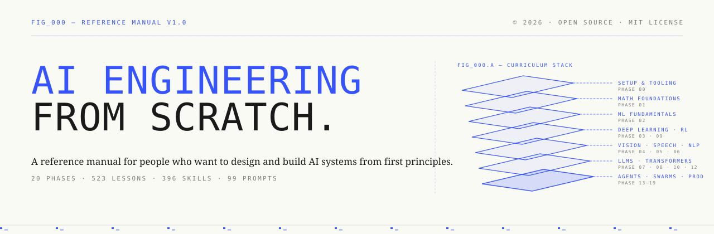
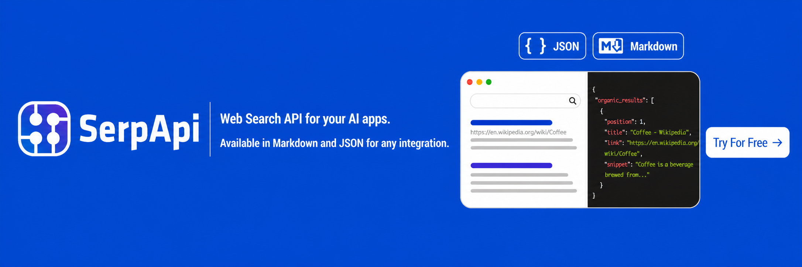
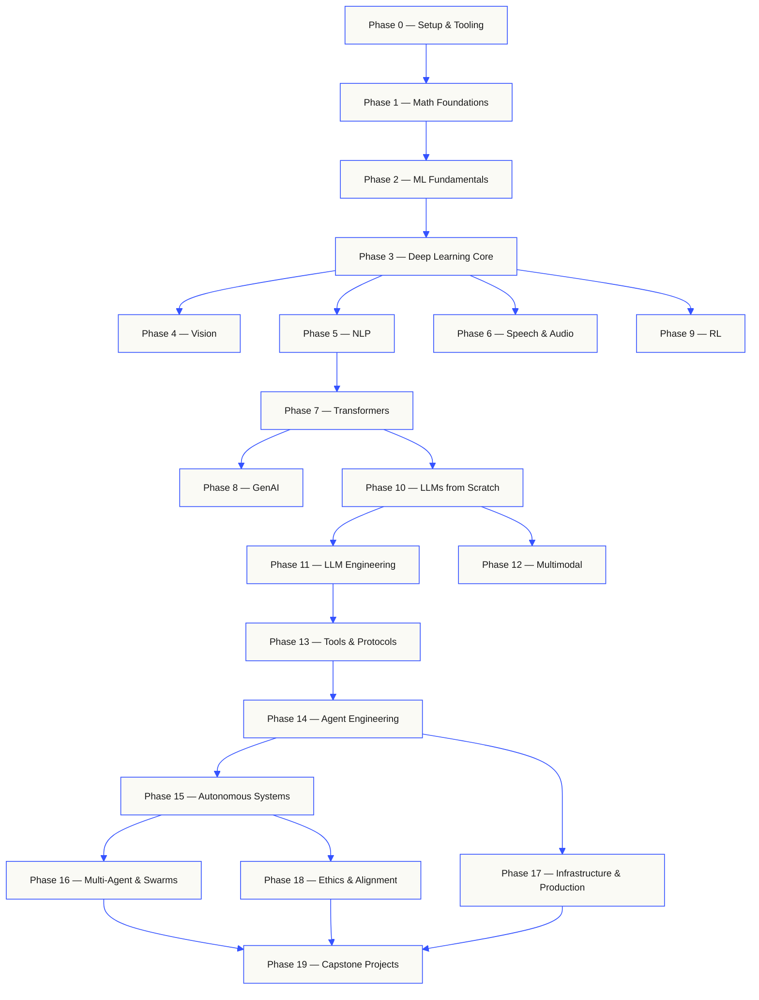
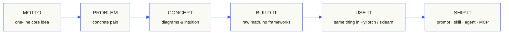

<p align="center"><sub>커뮤니티 번역입니다. 정본은 <a href="../../README.md">영어판</a>입니다 · <a href="https://aiengineeringfromscratch.com">aiengineeringfromscratch.com</a></sub></p>
<p align="center">
  
</p>

<p align="center">
  <b>Read in your language:</b>
  <a href="../../i18n/es/README.md">Español</a> ·
  <a href="../../i18n/fr/README.md">Français</a> ·
  <a href="../../i18n/pt/README.md">Português</a> ·
  <a href="../../i18n/de/README.md">Deutsch</a> ·
  <a href="../../i18n/it/README.md">Italiano</a> ·
  <a href="../../i18n/zh/README.md">简体中文</a> ·
  <a href="../../i18n/ja/README.md">日本語</a> ·
  <a href="../../i18n/ko/README.md">한국어</a> ·
  <a href="../../i18n/hi/README.md">हिन्दी</a> ·
  <a href="../../i18n/ar/README.md">العربية</a> ·
  <a href="../../i18n/ru/README.md">Русский</a> ·
  <a href="../../i18n/tr/README.md">Türkçe</a>
  <br><sub>Translated landing pages, committed to the repo. English is canonical; lesson pages are machine-translated on the <code>translations</code> branch. See <a href="../../docs/i18n.md">docs/i18n.md</a>.</sub>
</p>

<p align="center">
  <a href="../../LICENSE"></a>
  <a href="../../ROADMAP.md"></a>
  <a href="#contents"></a>
  <a href="https://github.com/rohitg00/ai-engineering-from-scratch/stargazers"></a>
  <a href="https://aiengineeringfromscratch.com"></a>
</p>

## [Agent Memory - 지속 메모리 1위 ⭐](https://github.com/rohitg00/agentmemory) <a href="https://github.com/rohitg00/agentmemory/stargazers"></a> 를 만든 사람이 이 커리큘럼도 만들었습니다. Agent Memory는 어떤 에이전트나 챗 어시스턴트와도 그대로 연동됩니다.

```text
░░░▒▒▒░░░▒▒▒░░░▒▒▒░░░▒▒▒░░░▒▒▒░░░▒▒▒░░░▒▒▒░░░▒▒▒░░░▒▒▒░░░▒▒▒░░░▒▒▒░░░▒▒▒░░░▒▒▒░░░▒▒▒░░░▒▒▒
```

> **학생의 84%는 이미 AI 도구를 사용하지만, 이를 전문적으로 다룰 준비가 되었다고 느끼는 사람은 18%뿐입니다.** 이 커리큘럼이 그 간극을 메웁니다.
>
> 523개 레슨. 20개 단계. 약 342시간. Python, TypeScript, Rust, Julia. 모든 레슨은 재사용 가능한 결과물을 남깁니다. 프롬프트, 스킬, 에이전트, MCP 서버. 무료, 오픈소스, MIT.
>
> AI를 배우기만 하는 것이 아닙니다. 직접 만듭니다. 처음부터 끝까지, 손으로.

<!-- STATS:START (generated from site/stats.json by build.js — do not edit by hand) -->
<p align="center"><sub><b>114,584</b> readers &nbsp;·&nbsp; <b>181,995</b> page views in the last 30 days &nbsp;·&nbsp; as of 2026-08-29</sub></p>
<!-- STATS:END -->

## 여기에서 시작하십시오. 무엇을 만들지 먼저 고르십시오

시작하기 전에 523개 레슨을 전부 훑어볼 필요는 없습니다. 목표를 하나만 고르십시오. 아래의 각 링크는 GitHub이나 웹사이트에서 동일한 커리큘럼을 열어 주며, 두 판본은 같은 레슨 코드를 사용합니다.

| Your goal | Learn on GitHub | Learn on the website |
|---|---|---|
| I am new and want the complete foundation | [Phase 0: Setup and Tooling](../../phases/00-setup-and-tooling/) | [Dev Environment](https://aiengineeringfromscratch.com/lesson?path=phases/00-setup-and-tooling/01-dev-environment) |
| I know Python and want math plus ML foundations | [Phase 1: Math Foundations](../../phases/01-math-foundations/) | [Linear Algebra Intuition](https://aiengineeringfromscratch.com/lesson?path=phases/01-math-foundations/01-linear-algebra-intuition) |
| I want to build production LLM applications | [Phase 11: LLM Engineering](../../phases/11-llm-engineering/) | [Prompt Engineering](https://aiengineeringfromscratch.com/lesson?path=phases/11-llm-engineering/01-prompt-engineering) |
| I want to build agents | [Phase 14: Agent Engineering](../../phases/14-agent-engineering/) | [The Agent Loop](https://aiengineeringfromscratch.com/lesson?path=phases/14-agent-engineering/01-the-agent-loop) |
| I want to use coding agents on real repositories | [Agent-Assisted Engineering path](../../learning-paths/using-coding-agents.json) | [Agent-Assisted Engineering](https://aiengineeringfromscratch.com/lesson?path=phases/14-agent-engineering/31-agent-workbench-why-models-fail&learningPath=using-coding-agents) |
| I want to shape the right build before implementation | [Product Judgment and Delivery path](../../learning-paths/shaping-the-build.json) | [Product Judgment and Delivery](https://aiengineeringfromscratch.com/lesson?path=phases/14-agent-engineering/47-outcomes-before-output&learningPath=shaping-the-build) |
| I want to build with Model Context Protocol (MCP) | [Model Context Protocol (MCP) route](../../phases/13-tools-and-protocols/README.md#model-context-protocol-mcp-path) | [Model Context Protocol (MCP) path](https://aiengineeringfromscratch.com/lesson?path=phases/13-tools-and-protocols/06-mcp-fundamentals&learningPath=model-context-protocol) |
| I want to write and ship Agent Skills | [Focused Agent Skills route](../../phases/13-tools-and-protocols/README.md#agent-skills-fast-path) | [Agent Skills path](https://aiengineeringfromscratch.com/lesson?path=phases/13-tools-and-protocols/22-skills-and-agent-sdks&learningPath=agent-skills) |
| I want to prepare for a Claude certification | [Certification onboarding](../../certifications/claude/GETTING_STARTED.md) | [Certification Academy](https://aiengineeringfromscratch.com/certifications.html) |

자신이 어디에서 시작해야 할지 판단하기 어렵다면, [`start-learning` 배치 진단 튜터](../../skills/start-learning/SKILL.md)를 사용하거나 [웹사이트의 선행 조건 안내](https://aiengineeringfromscratch.com/prereqs.html)를 참고하십시오.

네 개의 핵심 분야와 여섯 개의 커리어 경로를 [AI Engineering 학습 경로](https://aiengineeringfromscratch.com/learning-paths.html)에서 비교해 보십시오.

### 후원사

<a href="https://serpapi.com/ai-engineering-from-scratch">
  
</a>

<p><br><b>후원사 여러분께 감사드립니다.</b></p>
<p>여러분의 후원으로 모든 레슨을 무료 오픈소스로 유지할 수 있습니다.</p>
<p>
  <a href="#supporters">모든 후원자 보기</a><br>
  <a href="../../SPONSORS.md">Become a sponsor</a>
  <br clear="all">
</p>

### 모든 레슨은 같은 방식으로 사용합니다

1. **Read** `docs/en.md` and explain the core idea in your own words.
2. **Type and build** the important code instead of treating the code block as decoration.
3. **Run** the lesson command from the repository root, the directory containing `README.md` and `phases/`.
4. **Keep evidence**: the command, working directory, exit code, meaningful output, and the artifact you changed or produced.
5. **Continue** only when you can explain the output and make one small change without guessing.

레슨 문서에 나오는 명령은, 레슨이 디렉터리를 옮기라고 명시하지 않는 한 저장소 최상위 디렉터리를 기준으로 삼은 경로입니다. 한 레슨이 여러 언어로 구현을 제공한다면, 여러분이 학습하고 있는 언어의 구현을 실행하십시오.

### 저장소를 클론해서 첫 번째 결과를 직접 만들어 보십시오

```bash
git clone https://github.com/rohitg00/ai-engineering-from-scratch.git
cd ai-engineering-from-scratch
python3 phases/00-setup-and-tooling/01-dev-environment/code/verify.py --route beginner
python3 phases/01-math-foundations/01-linear-algebra-intuition/code/vectors.py
```

사전 점검 스크립트는 지금 당장 필요한 요구 사항과 나중에 필요한 도구를 구분해서 알려 줍니다. 필수 항목이 하나라도 실패하면, 실패를 일으킨 원인과 그것을 바로잡는 명령을 함께 출력합니다. 두 번째 명령은 외부 의존성이 전혀 없는 레슨을 실행하며, 행렬과 벡터의 곱이 곧 신경망 레이어 내부에서 일어나는 연산이라는 사실을 보여 주면서 끝납니다. 그 터미널 출력을 첫 번째 학습 결과로 저장해 두십시오.

## AI 튜터를 30초 만에 추가하기

Node.js와 `npx`, 그리고 스킬을 지원하는 코딩 에이전트가 이미 설치되어 있다면, 명령 두 줄만으로 그 코딩 에이전트를 학습 튜터로 바꿀 수 있습니다. 튜터를 설치하거나 읽는 데에는 저장소를 클론할 필요가 없습니다. 실행 가능한 집중 경로 실습에는 `python3`이 필요합니다. Agent Skills 호스트 실습에는 호스트를 하나 선택해야 하고, 쓰기가 가능한 사용자 스킬 범위나 프로젝트 스킬 범위도 있어야 합니다.

먼저 로컬 환경이 요구 사항을 충족하는지 확인하십시오.

```bash
node --version
npx --version
python3 --version
```

그다음 커리큘럼 스킬을 설치하고, 설치 프로그램이 물어볼 때 사용하려는 호스트와 범위를 선택하십시오.

```bash
npx skills add rohitg00/ai-engineering-from-scratch
```

스킬을 호출하는 문법은 이식 가능한 `SKILL.md` 형식이 아니라 각 호스트가 정합니다.

| Host | Start the course | Start Model Context Protocol (MCP) | Start Agent Skills | Run a phase quiz |
|---|---|---|---|---|
| Codex | `start-learning`, or choose it from `/skills` | `learn-mcp`, or choose it from `/skills` | `learn-agent-skills`, or choose it from `/skills` | `check-understanding 13`, or choose it from `/skills` |
| Claude Code | `/start-learning` | `/learn-mcp` | `/learn-agent-skills` | `/check-understanding 13` |
| Other compatible hosts | `Use start-learning to begin the course.` | `Use learn-mcp to start the Model Context Protocol (MCP) path.` | `Use learn-agent-skills to start the Agent Skills Engineering path.` | `Use check-understanding to quiz me on Phase 13.` |

열 문항짜리 배치 진단 퀴즈가 여러분이 이미 알고 있는 내용을 파악해서 시작할 페이즈를 정해 주고, 개인별 학습 계획을 `LEARNING.md`에 저장합니다. 그다음부터는 `learn` 스킬이 한 세션에 한 레슨씩 가르칩니다. 개념을 설명하고, 수학을 유도하고, 코드를 작성하고, 퀴즈를 냅니다. 이 스킬은 레슨을 이 저장소에서 바로 가져오며, 막히는 내용이 생기면 `course-guide` 스킬이 그 내용을 다루는 레슨으로 곧바로 데려다줍니다. Codex에서는 `learn`과 `course-guide`라고 입력해서 호출하고, Claude Code에서는 `/learn`과 `/course-guide`를 사용하며, 다른 호환 호스트에서는 스킬 이름을 말해서 사용을 요청하십시오.

Model Context Protocol(MCP)만 배우고 싶다면, 사용하는 호스트에 맞는 MCP 호출 방법을 쓰십시오. 그러면 `MCP-LEARNING.md` 파일이 만들어지고, 17개 레슨으로 이루어진 하나의 경로를 따라가게 됩니다. 이 경로는 상태를 유지하지 않는 요청에서 출발해 전송 계층, 양방향 통신, 보안, 신뢰성, 레지스트리 거버넌스, 적합성 증거까지 이어집니다. 정확한 순서와 점검 지점은 [Model Context Protocol(MCP) 매니페스트](../../learning-paths/model-context-protocol.json)에 적혀 있습니다.

Agent Skills만 배우고 싶다면, 사용하는 호스트에 맞는 Agent Skills 호출 방법을 쓰십시오. 그러면 `AGENT-SKILLS-LEARNING.md` 파일이 만들어지고, 서로 이어지는 다섯 개 레슨을 차례로 학습하게 됩니다. 스킬 패키지의 계약을 정의하고, 스킬을 발견하게 만들고, 실제로 호출하고, 샌드박스 경계를 정하고, 마지막으로 배포 전 평가와 실제 호스트 사이의 이식성을 다룹니다. 웹에서는 [Agent Skills 경로](https://aiengineeringfromscratch.com/lesson?path=phases/13-tools-and-protocols/22-skills-and-agent-sdks&learningPath=agent-skills)에서 시작할 수 있습니다.

설치 프로그램은 설정할 수 있는 호스트 목록을 보여 주고 어디에 설치할지 묻습니다. Node.js나 `npx`, `python3`, 지원되는 호스트, 쓰기 가능한 범위 가운데 아직 갖추지 못한 것이 있다면, 웹사이트를 이용하거나 `docs/en.md`를 직접 읽으십시오. 그렇게 해도 개념은 배울 수 있지만, 실제 호스트에서 스킬이 발견되고 호출되고 스크립트가 실행되고 제거되는 과정을 증거로 남기는 일은 사전 점검을 통과한 뒤로 미뤄집니다. 레슨은 [aiengineeringfromscratch.com](https://aiengineeringfromscratch.com)에서 읽을 수 있습니다.

## 동작 방식

AI를 다루는 자료는 대부분 흩어진 조각으로 가르칩니다. 여기에는 논문이 하나 있고, 저기에는 파인튜닝을 설명하는 글이 하나 있으며, 또 다른 곳에는 화려한 에이전트 데모가 하나 있습니다. 그 조각들은 서로 좀처럼 맞물리지 않습니다. 그래서 챗봇을 출시하고도 그 손실 곡선이 왜 그렇게 움직이는지 설명하지 못합니다. 에이전트에 함수를 연결해 놓고도, 그 함수를 호출하는 모델 내부에서 어텐션이 무슨 일을 하는지 말하지 못합니다.

이 커리큘럼은 그 조각들을 하나로 잇는 중심 구조입니다. 20개 페이즈, 523개 레슨, 그리고 Python, TypeScript, Rust, Julia까지 네 가지 언어를 사용합니다. 한쪽 끝에는 선형대수가 있고, 반대쪽 끝에는 자율 군집이 있습니다. 모든 알고리즘은 날것의 수학에서부터 먼저 구현합니다. 역전파를 구현하고, 토크나이저를 구현하고, 어텐션을 구현하고, 에이전트 루프를 구현합니다. PyTorch가 등장할 무렵이면, 여러분은 이미 PyTorch가 내부에서 무엇을 수행하는지 알고 있게 됩니다.

모든 레슨은 동일한 절차를 따릅니다. 문제를 읽고, 수학을 유도하고, 코드를 작성하고, 테스트를 실행하고, 그 결과물을 보관합니다. 5분짜리 영상도 없고, 복사해서 붙여넣는 배포도 없으며, 하나하나 떠먹여 주는 안내도 없습니다. 이 커리큘럼은 무료이고 오픈 소스이며, 여러분의 노트북에서 그대로 실행되도록 만들었습니다.

```text
░░░▒▒▒░░░▒▒▒░░░▒▒▒░░░▒▒▒░░░▒▒▒░░░▒▒▒░░░▒▒▒░░░▒▒▒░░░▒▒▒░░░▒▒▒░░░▒▒▒░░░▒▒▒░░░▒▒▒░░░▒▒▒░░░▒▒▒
```

## 커리큘럼의 구조

20개 페이즈는 아래에서 위로 차곡차곡 쌓여 있습니다. 가장 아래층은 수학이고, 가장 위층은 에이전트와 프로덕션 운영입니다. 아래층을 이미 알고 있다면 건너뛰어도 됩니다. 다만 건너뛴 다음에 위층에서 무언가 깨졌을 때 그 원인을 의아해하는 일은 없어야 합니다.



```text
░░░▒▒▒░░░▒▒▒░░░▒▒▒░░░▒▒▒░░░▒▒▒░░░▒▒▒░░░▒▒▒░░░▒▒▒░░░▒▒▒░░░▒▒▒░░░▒▒▒░░░▒▒▒░░░▒▒▒░░░▒▒▒░░░▒▒▒
```

## 레슨의 구조

모든 레슨은 각자의 폴더에 들어 있으며, 커리큘럼 전체가 동일한 구조를 따릅니다.

```text
phases/<NN>-<phase-name>/<NN>-<lesson-name>/
├── code/      runnable implementations (Python, TypeScript, Rust, Julia)
├── docs/
│   └── en.md  lesson narrative
└── outputs/   prompts, skills, agents, or MCP servers this lesson produces
```

모든 레슨은 여섯 단계로 진행됩니다. 그중 *Build It / Use It* 구분이 핵심입니다. 먼저 알고리즘을 맨바닥에서 직접 구현하고, 그다음에 똑같은 동작을 실제 프로덕션 라이브러리로 실행해 봅니다. 작은 판본을 직접 작성해 봤기 때문에, 프레임워크가 무슨 일을 하는지 이해하게 됩니다.



## 시작하기

시작하는 방법은 세 가지. 하나를 고르세요.

**선택지 A: 터미널에서 학습하기 *(권장)*.** 위에서 설명한 Node.js와 `npx`, 호스트, 설치 범위 사전 점검을 마쳤다면, 학습 스킬을 호환되는 에이전트에 설치하고 커리큘럼이 스스로 진행되도록 맡기십시오.

```bash
npx skills add rohitg00/ai-engineering-from-scratch
```

위에 있는 호스트별 호출 방법 표를 참고하십시오. 설치된 스킬은 `start-learning`, `learn`, `course-guide`와 함께 집중 경로인 `learn-mcp`, `learn-agent-skills`를 제공합니다. 레슨 본문은 저장소를 클론하지 않아도 이 저장소에서 바로 받아 올 수 있습니다. 다만 저장소의 코드를 그대로 복사해 실행하는 명령과, MCP나 Agent Skills의 실행형 실습에는 로컬 클론이 필요합니다. 진행 상황은 프로젝트 안의 `LEARNING.md`나 `MCP-LEARNING.md`, `AGENT-SKILLS-LEARNING.md`에 저장되므로, 다음 세션에서 그대로 이어서 학습할 수 있습니다.

**선택지 B: 읽기.** 완성된 레슨은 [aiengineeringfromscratch.com](https://aiengineeringfromscratch.com)에서 아무거나 열어 보거나, [목차](#contents)에서 원하는 페이즈를 펼쳐 보십시오. 설치할 것도 없고 클론할 것도 없습니다.

**선택지 C: 클론해서 직접 실행하기.**

```bash
git clone https://github.com/rohitg00/ai-engineering-from-scratch.git
cd ai-engineering-from-scratch
python3 phases/01-math-foundations/01-linear-algebra-intuition/code/vectors.py
```

저장소를 클론하면 Claude Code에서 학습 스킬이 자동으로 로드되고, `learn` 튜터가 모든 레슨의 코드를 직접 실행할 수 있게 됩니다. 눈으로 따라 읽기만 하는 것과는 다릅니다.

### 사전 요구 사항

- You can write code (any language; Python helps).
- You want to understand how AI **actually works**, not just call APIs.

### Claude 자격 시험 준비하기

[Claude Certification Academy](../../certifications/claude/README.md)는 공식 Claude 자격 과정 네 가지를 모두 준비할 수 있는 무료 오픈 소스 프로그램입니다. 네 과정은 Associate Foundations, Developer Foundations, Architect Foundations, Architect Professional입니다. 각 경로는 시험 출제 범위에 대응시킨 레슨, 실행 가능한 실습, 진단 평가, 캡스톤 과제, 그리고 자체 제작한 전체 분량 모의고사로 구성되어 있습니다.

[AI 환경에 맞춘 GitHub 온보딩 안내](../../certifications/claude/GETTING_STARTED.md)를 Claude Code, Codex, ChatGPT, Cursor를 비롯한 에이전트와 함께 사용하십시오. Codex에서는 `claude-certification`을 입력하고, Claude Code에서는 `/claude-certification`을 입력하며, 다른 호스트에서는 `claude-certification`을 사용해 달라고 요청하면 됩니다. 그러면 준비할 과정을 고르고, `CLAUDE-CERTIFICATION.md`에 학습 경로를 저장한 뒤, 한 단계씩 가르치고, 실제 실습을 실행하고, 여러분이 만든 결과물을 근거로 피드백을 줍니다. 같은 커리큘럼을 [자격 과정 웹사이트](https://aiengineeringfromscratch.com/certifications.html)에서도 볼 수 있습니다.

이 학습 과정은 공개된 시험 목표를 근거로 만든 독립적인 학습 자료입니다. Anthropic과는 아무 관계가 없고, 실제 시험 문제를 그대로 싣지 않으며, 합격을 보장하지도 않습니다.

### 학습 스킬

| Skill | What it does |
|---|---|
| [`start-learning`](../../skills/start-learning/SKILL.md) | One-time onboarding: why you're learning, placement quiz, personalized plan saved to `LEARNING.md`. |
| [`learn`](../../skills/learn/SKILL.md) | The tutor loop. Warm-up recall, then the next lesson taught interactively, then its quiz; records progress and a review queue. |
| [`course-guide`](../../skills/course-guide/SKILL.md) | Topic router. "Where do I learn attention?" or "my loss is NaN" → the exact lessons, with links. |
| [`learn-mcp`](../../skills/learn-mcp/SKILL.md) | Focused Model Context Protocol (MCP) tutor. Creates `MCP-LEARNING.md`, follows the 17-lesson manifest, and records wire, security, reliability, and conformance evidence. |
| [`learn-agent-skills`](../../skills/learn-agent-skills/SKILL.md) | Focused Agent Skills tutor. Creates `AGENT-SKILLS-LEARNING.md`, teaches lessons 22, 24, 25, 26, and 27, and records real-host evidence. |
| [`claude-certification`](../../skills/claude-certification/SKILL.md) | Certification tutor. Chooses CCAO-F, CCDV-F, CCAR-F, or CCAR-P; teaches each lesson; runs labs; reviews artifacts; administers diagnostics and mocks; saves progress. |
| [`find-your-level`](../../skills/find-your-level/SKILL.md) | Ten-question placement quiz. Maps your knowledge to a starting phase and produces a personalized path with hour estimates. |
| [`check-understanding <phase>`](../../skills/check-understanding/SKILL.md) | Per-phase quiz, eight questions, with feedback and specific lessons to review. Use the Codex, Claude Code, or natural-language form in the invocation table above. |

```text
░░░▒▒▒░░░▒▒▒░░░▒▒▒░░░▒▒▒░░░▒▒▒░░░▒▒▒░░░▒▒▒░░░▒▒▒░░░▒▒▒░░░▒▒▒░░░▒▒▒░░░▒▒▒░░░▒▒▒░░░▒▒▒░░░▒▒▒
```

## 핵심 커리큘럼을 책으로 읽기

`phases/` 아래에 있는 20개 페이즈 핵심 커리큘럼은 여섯 권짜리 책으로 묶여 나옵니다. EPUB 판본과 PDF 판본은 CI가 같은 레슨 원본에서 만들어 [GitHub 릴리스](https://github.com/rohitg00/ai-engineering-from-scratch/releases)마다 첨부하며, 아래 링크는 언제나 가장 최신 릴리스를 가리킵니다. 권 번호는 판본 번호가 아니라 책의 순서를 가리킵니다. 각 파일에는 발행 날짜가 찍혀 있고, 예전 판본도 해당 릴리스에서 계속 내려받을 수 있습니다.

자격 과정 커리큘럼은 의도적으로 책에 포함하지 않았습니다. 자격 과정은 AI 튜터가 관리하는 학습 상태, 실행 가능한 실습, 상호작용하는 그림, 진단 평가, 시간 제한이 있는 모의고사를 그대로 살려야 하고, 이 요소들은 GitHub과 웹사이트에서만 온전히 동작하기 때문입니다.

| Vol | Title | Phases | Download |
|-----|-------|--------|----------|
| 1 | Foundations · Math, Tooling, and Classical Machine Learning | 00-02 | [EPUB](https://github.com/rohitg00/ai-engineering-from-scratch/releases/latest/download/aiefs-vol1-foundations.epub) · [PDF](https://github.com/rohitg00/ai-engineering-from-scratch/releases/latest/download/aiefs-vol1-foundations.pdf) |
| 2 | Deep Learning · Networks, Vision, and Speech | 03, 04, 06 | [EPUB](https://github.com/rohitg00/ai-engineering-from-scratch/releases/latest/download/aiefs-vol2-deep-learning.epub) · [PDF](https://github.com/rohitg00/ai-engineering-from-scratch/releases/latest/download/aiefs-vol2-deep-learning.pdf) |
| 3 | Language · NLP Foundations and the Transformer | 05, 07 | [EPUB](https://github.com/rohitg00/ai-engineering-from-scratch/releases/latest/download/aiefs-vol3-language.epub) · [PDF](https://github.com/rohitg00/ai-engineering-from-scratch/releases/latest/download/aiefs-vol3-language.pdf) |
| 4 | Large Language Models · Generation, Reinforcement, Pretraining, and Engineering | 08-11 | [EPUB](https://github.com/rohitg00/ai-engineering-from-scratch/releases/latest/download/aiefs-vol4-llms.epub) · [PDF](https://github.com/rohitg00/ai-engineering-from-scratch/releases/latest/download/aiefs-vol4-llms.pdf) |
| 5 | Agents · Multimodality, Protocols, Autonomy, and Swarms | 12-16 | [EPUB](https://github.com/rohitg00/ai-engineering-from-scratch/releases/latest/download/aiefs-vol5-agents.epub) · [PDF](https://github.com/rohitg00/ai-engineering-from-scratch/releases/latest/download/aiefs-vol5-agents.pdf) |
| 6 | Production · Infrastructure, Safety, and Capstones | 17-19 | [EPUB](https://github.com/rohitg00/ai-engineering-from-scratch/releases/latest/download/aiefs-vol6-production.epub) · [PDF](https://github.com/rohitg00/ai-engineering-from-scratch/releases/latest/download/aiefs-vol6-production.pdf) |

책은 한 시점을 찍어 둔 판본이고, 이 저장소는 계속 갱신되는 판본입니다. 모든 장의 끝에는 해당 레슨의 애니메이션 그림과 퀴즈, 실행 가능한 코드로 돌아가는 링크가 붙어 있습니다. 직접 만들어 보려면 `python3 scripts/build_book.py`를 실행하십시오. pandoc이 설치되어 있어야 합니다. 빌드 과정의 자세한 내용은 [book/README.md](../../book/README.md)에 있습니다.

```text
░░░▒▒▒░░░▒▒▒░░░▒▒▒░░░▒▒▒░░░▒▒▒░░░▒▒▒░░░▒▒▒░░░▒▒▒░░░▒▒▒░░░▒▒▒░░░▒▒▒░░░▒▒▒░░░▒▒▒░░░▒▒▒░░░▒▒▒
```

## 모든 레슨은 결과물을 남깁니다

다른 커리큘럼은 *"축하합니다, X를 배웠습니다"* 라는 말로 끝납니다. 이 커리큘럼의 모든 레슨은 **다시 쓸 수 있는 도구**를 남기며, 그 도구는 여러분의 평소 작업에 바로 설치하거나 붙여넣을 수 있습니다.

<table>
<tr>
<th align="left" width="25%"><br/><sub>FIG_001 · A</sub><br/><b>PROMPTS</b></th>
<th align="left" width="25%"><br/><sub>FIG_001 · B</sub><br/><b>SKILLS</b></th>
<th align="left" width="25%"><br/><sub>FIG_001 · C</sub><br/><b>AGENTS</b></th>
<th align="left" width="25%"><br/><sub>FIG_001 · D</sub><br/><b>MCP SERVERS</b></th>
</tr>
<tr>
<td valign="top">Paste into any AI assistant for expert-level help on a narrow task.</td>
<td valign="top">Drop into Claude, Cursor, Codex, OpenClaw, Hermes, or any agent that reads <code>SKILL.md</code>.</td>
<td valign="top">Deploy as autonomous workers — you wrote the loop yourself in Phase 14.</td>
<td valign="top">Plug into any MCP-compatible client. Built end-to-end in Phase 13.</td>
</tr>
</table>

> `python3 scripts/install_skills.py <target>` 명령으로 전부 설치할 수 있습니다. 숙제가 아니라 실제로 쓰는 도구입니다. 커리큘럼을 끝낼 즈음이면 결과물 523개가 모인 포트폴리오가 생기고, 전부 직접 만든 것이므로 하나하나 무엇인지 설명할 수 있습니다.

### FIG_002 · 실제 예제 하나

페이즈 14의 첫 번째 레슨은 에이전트 루프를 다룹니다. 외부 의존성 없이 순수 Python으로 약 120줄입니다.

<table>
<tr>
<td valign="top" width="50%">

**`code/agent_loop.py`** &nbsp; <sub><i>직접 만든다</i></sub>

```python
def run(query, tools):
    history = [user(query)]
    for step in range(MAX_STEPS):
        msg = llm(history)
        if msg.tool_calls:
            for call in msg.tool_calls:
                result = tools[call.name](**call.args)
                history.append(tool_result(call.id, result))
            continue
        return msg.content
    raise StepLimitExceeded
```

</td>
<td valign="top" width="50%">

**`outputs/skill-agent-loop.md`** &nbsp; <sub><i>결과물로 남긴다</i></sub>

```markdown
---
name: agent-loop
description: ReAct-style loop for any tool list
phase: 14
lesson: 01
---

Implement a minimal agent loop that...
```

**`outputs/prompt-debug-agent.md`**

```markdown
You are an agent debugger. Given the trace
of an agent run, identify the step where
the agent went wrong and explain why...
```

</td>
</tr>
</table>

```text
░░░▒▒▒░░░▒▒▒░░░▒▒▒░░░▒▒▒░░░▒▒▒░░░▒▒▒░░░▒▒▒░░░▒▒▒░░░▒▒▒░░░▒▒▒░░░▒▒▒░░░▒▒▒░░░▒▒▒░░░▒▒▒░░░▒▒▒
```

<a id="contents"></a>

## 목차

20개 페이즈입니다. 페이즈를 누르면 그 안의 레슨 목록이 펼쳐집니다.

<a id="phase-0"></a>
### 페이즈 0: 환경 구성과 도구 `12개 레슨`
> 이후에 이어지는 모든 내용을 실행할 수 있도록 개발 환경을 갖춥니다.

| # | Lesson | Type | Lang |
|:---:|--------|:----:|------|
| 01 | [Dev Environment](../../phases/00-setup-and-tooling/01-dev-environment/) | Build | Python |
| 02 | [Git & Collaboration](../../phases/00-setup-and-tooling/02-git-and-collaboration/) | Learn | — |
| 03 | [GPU Setup & Cloud](../../phases/00-setup-and-tooling/03-gpu-setup-and-cloud/) | Build | Python |
| 04 | [APIs & Keys](../../phases/00-setup-and-tooling/04-apis-and-keys/) | Build | Python |
| 05 | [Jupyter Notebooks](../../phases/00-setup-and-tooling/05-jupyter-notebooks/) | Build | Python |
| 06 | [Python Environments](../../phases/00-setup-and-tooling/06-python-environments/) | Build | Shell |
| 07 | [Docker for AI](../../phases/00-setup-and-tooling/07-docker-for-ai/) | Build | Docker |
| 08 | [Editor Setup](../../phases/00-setup-and-tooling/08-editor-setup/) | Build | — |
| 09 | [Data Management](../../phases/00-setup-and-tooling/09-data-management/) | Build | Python |
| 10 | [Terminal & Shell](../../phases/00-setup-and-tooling/10-terminal-and-shell/) | Learn | — |
| 11 | [Linux for AI](../../phases/00-setup-and-tooling/11-linux-for-ai/) | Learn | — |
| 12 | [Debugging & Profiling](../../phases/00-setup-and-tooling/12-debugging-and-profiling/) | Build | Python |

<details id="phase-1">
<summary><b>Phase 1 — Math Foundations</b> &nbsp;<code>22 lessons</code>&nbsp; <em>The intuition behind every AI algorithm, through code.</em></summary>
<br/>

| # | Lesson | Type | Lang |
|:---:|--------|:----:|------|
| 01 | [Linear Algebra Intuition](../../phases/01-math-foundations/01-linear-algebra-intuition/) | Learn | Python, Julia |
| 02 | [Vectors, Matrices & Operations](../../phases/01-math-foundations/02-vectors-matrices-operations/) | Build | Python, Julia |
| 03 | [Matrix Transformations & Eigenvalues](../../phases/01-math-foundations/03-matrix-transformations/) | Build | Python, Julia |
| 04 | [Calculus for ML: Derivatives & Gradients](../../phases/01-math-foundations/04-calculus-for-ml/) | Learn | Python |
| 05 | [Chain Rule & Automatic Differentiation](../../phases/01-math-foundations/05-chain-rule-and-autodiff/) | Build | Python |
| 06 | [Probability & Distributions](../../phases/01-math-foundations/06-probability-and-distributions/) | Learn | Python |
| 07 | [Bayes' Theorem & Statistical Thinking](../../phases/01-math-foundations/07-bayes-theorem/) | Build | Python |
| 08 | [Optimization: Gradient Descent Family](../../phases/01-math-foundations/08-optimization/) | Build | Python |
| 09 | [Information Theory: Entropy, KL Divergence](../../phases/01-math-foundations/09-information-theory/) | Learn | Python |
| 10 | [Dimensionality Reduction: PCA, t-SNE, UMAP](../../phases/01-math-foundations/10-dimensionality-reduction/) | Build | Python |
| 11 | [Singular Value Decomposition](../../phases/01-math-foundations/11-singular-value-decomposition/) | Build | Python, Julia |
| 12 | [Tensor Operations](../../phases/01-math-foundations/12-tensor-operations/) | Build | Python |
| 13 | [Numerical Stability](../../phases/01-math-foundations/13-numerical-stability/) | Build | Python |
| 14 | [Norms & Distances](../../phases/01-math-foundations/14-norms-and-distances/) | Build | Python |
| 15 | [Statistics for ML](../../phases/01-math-foundations/15-statistics-for-ml/) | Build | Python |
| 16 | [Sampling Methods](../../phases/01-math-foundations/16-sampling-methods/) | Build | Python |
| 17 | [Linear Systems](../../phases/01-math-foundations/17-linear-systems/) | Build | Python |
| 18 | [Convex Optimization](../../phases/01-math-foundations/18-convex-optimization/) | Build | Python |
| 19 | [Complex Numbers for AI](../../phases/01-math-foundations/19-complex-numbers/) | Learn | Python |
| 20 | [The Fourier Transform](../../phases/01-math-foundations/20-fourier-transform/) | Build | Python |
| 21 | [Graph Theory for ML](../../phases/01-math-foundations/21-graph-theory/) | Build | Python |
| 22 | [Stochastic Processes](../../phases/01-math-foundations/22-stochastic-processes/) | Learn | Python |

</details>

<details id="phase-2">
<summary><b>Phase 2 — ML Fundamentals</b> &nbsp;<code>18 lessons</code>&nbsp; <em>Classical ML — still the backbone of most production AI.</em></summary>
<br/>

| # | Lesson | Type | Lang |
|:---:|--------|:----:|------|
| 01 | [What Is Machine Learning](../../phases/02-ml-fundamentals/01-what-is-machine-learning/) | Learn | Python |
| 02 | [Linear Regression from Scratch](../../phases/02-ml-fundamentals/02-linear-regression/) | Build | Python |
| 03 | [Logistic Regression & Classification](../../phases/02-ml-fundamentals/03-logistic-regression/) | Build | Python |
| 04 | [Decision Trees & Random Forests](../../phases/02-ml-fundamentals/04-decision-trees/) | Build | Python |
| 05 | [Support Vector Machines](../../phases/02-ml-fundamentals/05-support-vector-machines/) | Build | Python |
| 06 | [KNN & Distance Metrics](../../phases/02-ml-fundamentals/06-knn-and-distances/) | Build | Python |
| 07 | [Unsupervised Learning: K-Means, DBSCAN](../../phases/02-ml-fundamentals/07-unsupervised-learning/) | Build | Python |
| 08 | [Feature Engineering & Selection](../../phases/02-ml-fundamentals/08-feature-engineering/) | Build | Python |
| 09 | [Model Evaluation: Metrics, Cross-Validation](../../phases/02-ml-fundamentals/09-model-evaluation/) | Build | Python |
| 10 | [Bias, Variance & the Learning Curve](../../phases/02-ml-fundamentals/10-bias-variance/) | Learn | Python |
| 11 | [Ensemble Methods: Boosting, Bagging, Stacking](../../phases/02-ml-fundamentals/11-ensemble-methods/) | Build | Python |
| 12 | [Hyperparameter Tuning](../../phases/02-ml-fundamentals/12-hyperparameter-tuning/) | Build | Python |
| 13 | [ML Pipelines & Experiment Tracking](../../phases/02-ml-fundamentals/13-ml-pipelines/) | Build | Python |
| 14 | [Naive Bayes](../../phases/02-ml-fundamentals/14-naive-bayes/) | Build | Python |
| 15 | [Time Series Fundamentals](../../phases/02-ml-fundamentals/15-time-series/) | Build | Python |
| 16 | [Anomaly Detection](../../phases/02-ml-fundamentals/16-anomaly-detection/) | Build | Python |
| 17 | [Handling Imbalanced Data](../../phases/02-ml-fundamentals/17-imbalanced-data/) | Build | Python |
| 18 | [Feature Selection](../../phases/02-ml-fundamentals/18-feature-selection/) | Build | Python |

</details>

<details id="phase-3">
<summary><b>Phase 3 — Deep Learning Core</b> &nbsp;<code>13 lessons</code>&nbsp; <em>Neural networks from first principles. No frameworks until you build one.</em></summary>
<br/>

| # | Lesson | Type | Lang |
|:---:|--------|:----:|------|
| 01 | [The Perceptron: Where It All Started](../../phases/03-deep-learning-core/01-the-perceptron/) | Build | Python |
| 02 | [Multi-Layer Networks & Forward Pass](../../phases/03-deep-learning-core/02-multi-layer-networks/) | Build | Python |
| 03 | [Backpropagation from Scratch](../../phases/03-deep-learning-core/03-backpropagation/) | Build | Python |
| 04 | [Activation Functions: ReLU, Sigmoid, GELU & Why](../../phases/03-deep-learning-core/04-activation-functions/) | Build | Python |
| 05 | [Loss Functions: MSE, Cross-Entropy, Contrastive](../../phases/03-deep-learning-core/05-loss-functions/) | Build | Python |
| 06 | [Optimizers: SGD, Momentum, Adam, AdamW](../../phases/03-deep-learning-core/06-optimizers/) | Build | Python |
| 07 | [Regularization: Dropout, Weight Decay, BatchNorm](../../phases/03-deep-learning-core/07-regularization/) | Build | Python |
| 08 | [Weight Initialization & Training Stability](../../phases/03-deep-learning-core/08-weight-initialization/) | Build | Python |
| 09 | [Learning Rate Schedules & Warmup](../../phases/03-deep-learning-core/09-learning-rate-schedules/) | Build | Python |
| 10 | [Build Your Own Mini Framework](../../phases/03-deep-learning-core/10-mini-framework/) | Build | Python |
| 11 | [Introduction to PyTorch](../../phases/03-deep-learning-core/11-intro-to-pytorch/) | Build | Python |
| 12 | [Introduction to JAX](../../phases/03-deep-learning-core/12-intro-to-jax/) | Build | Python |
| 13 | [Debugging Neural Networks](../../phases/03-deep-learning-core/13-debugging-neural-networks/) | Build | Python |

</details>

<details id="phase-4">
<summary><b>Phase 4 — Computer Vision</b> &nbsp;<code>28 lessons</code>&nbsp; <em>From pixels to understanding — image, video, 3D, VLMs, and world models.</em></summary>
<br/>

| # | Lesson | Type | Lang |
|:---:|--------|:----:|------|
| 01 | [Image Fundamentals: Pixels, Channels, Color Spaces](../../phases/04-computer-vision/01-image-fundamentals/) | Learn | Python |
| 02 | [Convolutions from Scratch](../../phases/04-computer-vision/02-convolutions-from-scratch/) | Build | Python |
| 03 | [CNNs: LeNet to ResNet](../../phases/04-computer-vision/03-cnns-lenet-to-resnet/) | Build | Python |
| 04 | [Image Classification](../../phases/04-computer-vision/04-image-classification/) | Build | Python |
| 05 | [Transfer Learning & Fine-Tuning](../../phases/04-computer-vision/05-transfer-learning/) | Build | Python |
| 06 | [Object Detection — YOLO from Scratch](../../phases/04-computer-vision/06-object-detection-yolo/) | Build | Python |
| 07 | [Semantic Segmentation — U-Net](../../phases/04-computer-vision/07-semantic-segmentation-unet/) | Build | Python |
| 08 | [Instance Segmentation — Mask R-CNN](../../phases/04-computer-vision/08-instance-segmentation-mask-rcnn/) | Build | Python |
| 09 | [Image Generation — GANs](../../phases/04-computer-vision/09-image-generation-gans/) | Build | Python |
| 10 | [Image Generation — Diffusion Models](../../phases/04-computer-vision/10-image-generation-diffusion/) | Build | Python |
| 11 | [Stable Diffusion — Architecture & Fine-Tuning](../../phases/04-computer-vision/11-stable-diffusion/) | Build | Python |
| 12 | [Video Understanding — Temporal Modeling](../../phases/04-computer-vision/12-video-understanding/) | Build | Python |
| 13 | [3D Vision: Point Clouds, NeRFs](../../phases/04-computer-vision/13-3d-vision-nerf/) | Build | Python |
| 14 | [Vision Transformers (ViT)](../../phases/04-computer-vision/14-vision-transformers/) | Build | Python |
| 15 | [Real-Time Vision: Edge Deployment](../../phases/04-computer-vision/15-real-time-edge/) | Build | Python |
| 16 | [Build a Complete Vision Pipeline](../../phases/04-computer-vision/16-vision-pipeline-capstone/) | Build | Python |
| 17 | [Self-Supervised Vision — SimCLR, DINO, MAE](../../phases/04-computer-vision/17-self-supervised-vision/) | Build | Python |
| 18 | [Open-Vocabulary Vision — CLIP](../../phases/04-computer-vision/18-open-vocab-clip/) | Build | Python |
| 19 | [OCR & Document Understanding](../../phases/04-computer-vision/19-ocr-document-understanding/) | Build | Python |
| 20 | [Image Retrieval & Metric Learning](../../phases/04-computer-vision/20-image-retrieval-metric/) | Build | Python |
| 21 | [Keypoint Detection & Pose Estimation](../../phases/04-computer-vision/21-keypoint-pose/) | Build | Python |
| 22 | [3D Gaussian Splatting from Scratch](../../phases/04-computer-vision/22-3d-gaussian-splatting/) | Build | Python |
| 23 | [Diffusion Transformers & Rectified Flow](../../phases/04-computer-vision/23-diffusion-transformers-rectified-flow/) | Build | Python |
| 24 | [SAM 3 & Open-Vocabulary Segmentation](../../phases/04-computer-vision/24-sam3-open-vocab-segmentation/) | Build | Python |
| 25 | [Vision-Language Models (ViT-MLP-LLM)](../../phases/04-computer-vision/25-vision-language-models/) | Build | Python |
| 26 | [Monocular Depth & Geometry Estimation](../../phases/04-computer-vision/26-monocular-depth/) | Build | Python |
| 27 | [Multi-Object Tracking & Video Memory](../../phases/04-computer-vision/27-multi-object-tracking/) | Build | Python |
| 28 | [World Models & Video Diffusion](../../phases/04-computer-vision/28-world-models-video-diffusion/) | Build | Python |

</details>

<details id="phase-5">
<summary><b>Phase 5 — NLP: Foundations to Advanced</b> &nbsp;<code>29 lessons</code>&nbsp; <em>Language is the interface to intelligence.</em></summary>
<br/>

| # | Lesson | Type | Lang |
|:---:|--------|:----:|------|
| 01 | [Text Processing: Tokenization, Stemming, Lemmatization](../../phases/05-nlp-foundations-to-advanced/01-text-processing/) | Build | Python |
| 02 | [Bag of Words, TF-IDF & Text Representation](../../phases/05-nlp-foundations-to-advanced/02-bag-of-words-tfidf/) | Build | Python |
| 03 | [Word Embeddings: Word2Vec from Scratch](../../phases/05-nlp-foundations-to-advanced/03-word-embeddings-word2vec/) | Build | Python |
| 04 | [GloVe, FastText & Subword Embeddings](../../phases/05-nlp-foundations-to-advanced/04-glove-fasttext-subword/) | Build | Python |
| 05 | [Sentiment Analysis](../../phases/05-nlp-foundations-to-advanced/05-sentiment-analysis/) | Build | Python |
| 06 | [Named Entity Recognition (NER)](../../phases/05-nlp-foundations-to-advanced/06-named-entity-recognition/) | Build | Python |
| 07 | [POS Tagging & Syntactic Parsing](../../phases/05-nlp-foundations-to-advanced/07-pos-tagging-parsing/) | Build | Python |
| 08 | [Text Classification — CNNs & RNNs for Text](../../phases/05-nlp-foundations-to-advanced/08-cnns-rnns-for-text/) | Build | Python |
| 09 | [Sequence-to-Sequence Models](../../phases/05-nlp-foundations-to-advanced/09-sequence-to-sequence/) | Build | Python |
| 10 | [Attention Mechanism — The Breakthrough](../../phases/05-nlp-foundations-to-advanced/10-attention-mechanism/) | Build | Python |
| 11 | [Machine Translation](../../phases/05-nlp-foundations-to-advanced/11-machine-translation/) | Build | Python |
| 12 | [Text Summarization](../../phases/05-nlp-foundations-to-advanced/12-text-summarization/) | Build | Python |
| 13 | [Question Answering Systems](../../phases/05-nlp-foundations-to-advanced/13-question-answering/) | Build | Python |
| 14 | [Information Retrieval & Search](../../phases/05-nlp-foundations-to-advanced/14-information-retrieval-search/) | Build | Python |
| 15 | [Topic Modeling: LDA, BERTopic](../../phases/05-nlp-foundations-to-advanced/15-topic-modeling/) | Build | Python |
| 16 | [Text Generation](../../phases/05-nlp-foundations-to-advanced/16-text-generation-pre-transformer/) | Build | Python |
| 17 | [Chatbots: Rule-Based to Neural](../../phases/05-nlp-foundations-to-advanced/17-chatbots-rule-to-neural/) | Build | Python |
| 18 | [Multilingual NLP](../../phases/05-nlp-foundations-to-advanced/18-multilingual-nlp/) | Build | Python |
| 19 | [Subword Tokenization: BPE, WordPiece, Unigram, SentencePiece](../../phases/05-nlp-foundations-to-advanced/19-subword-tokenization/) | Learn | Python |
| 20 | [Structured Outputs & Constrained Decoding](../../phases/05-nlp-foundations-to-advanced/20-structured-outputs-constrained-decoding/) | Build | Python |
| 21 | [NLI & Textual Entailment](../../phases/05-nlp-foundations-to-advanced/21-nli-textual-entailment/) | Learn | Python |
| 22 | [Embedding Models Deep Dive](../../phases/05-nlp-foundations-to-advanced/22-embedding-models-deep-dive/) | Learn | Python |
| 23 | [Chunking Strategies for RAG](../../phases/05-nlp-foundations-to-advanced/23-chunking-strategies-rag/) | Build | Python |
| 24 | [Coreference Resolution](../../phases/05-nlp-foundations-to-advanced/24-coreference-resolution/) | Learn | Python |
| 25 | [Entity Linking & Disambiguation](../../phases/05-nlp-foundations-to-advanced/25-entity-linking/) | Build | Python |
| 26 | [Relation Extraction & Knowledge Graph Construction](../../phases/05-nlp-foundations-to-advanced/26-relation-extraction-kg/) | Build | Python |
| 27 | [LLM Evaluation: RAGAS, DeepEval, G-Eval](../../phases/05-nlp-foundations-to-advanced/27-llm-evaluation-frameworks/) | Build | Python |
| 28 | [Long-Context Evaluation: NIAH, RULER, LongBench, MRCR](../../phases/05-nlp-foundations-to-advanced/28-long-context-evaluation/) | Learn | Python |
| 29 | [Dialogue State Tracking](../../phases/05-nlp-foundations-to-advanced/29-dialogue-state-tracking/) | Build | Python |

</details>

<details id="phase-6">
<summary><b>Phase 6 — Speech & Audio</b> &nbsp;<code>17 lessons</code>&nbsp; <em>Hear, understand, speak.</em></summary>
<br/>

| # | Lesson | Type | Lang |
|:---:|--------|:----:|------|
| 01 | [Audio Fundamentals: Waveforms, Sampling, FFT](../../phases/06-speech-and-audio/01-audio-fundamentals) | Learn | Python |
| 02 | [Spectrograms, Mel Scale & Audio Features](../../phases/06-speech-and-audio/02-spectrograms-mel-features) | Build | Python |
| 03 | [Audio Classification](../../phases/06-speech-and-audio/03-audio-classification) | Build | Python |
| 04 | [Speech Recognition (ASR)](../../phases/06-speech-and-audio/04-speech-recognition-asr) | Build | Python |
| 05 | [Whisper: Architecture & Fine-Tuning](../../phases/06-speech-and-audio/05-whisper-architecture-finetuning) | Build | Python |
| 06 | [Speaker Recognition & Verification](../../phases/06-speech-and-audio/06-speaker-recognition-verification) | Build | Python |
| 07 | [Text-to-Speech (TTS)](../../phases/06-speech-and-audio/07-text-to-speech) | Build | Python |
| 08 | [Voice Cloning & Voice Conversion](../../phases/06-speech-and-audio/08-voice-cloning-conversion) | Build | Python |
| 09 | [Music Generation](../../phases/06-speech-and-audio/09-music-generation) | Build | Python |
| 10 | [Audio-Language Models](../../phases/06-speech-and-audio/10-audio-language-models) | Build | Python |
| 11 | [Real-Time Audio Processing](../../phases/06-speech-and-audio/11-real-time-audio-processing) | Build | Python |
| 12 | [Build a Voice Assistant Pipeline](../../phases/06-speech-and-audio/12-voice-assistant-pipeline) | Build | Python |
| 13 | [Neural Audio Codecs — EnCodec, SNAC, Mimi, DAC](../../phases/06-speech-and-audio/13-neural-audio-codecs) | Learn | Python |
| 14 | [Voice Activity Detection & Turn-Taking](../../phases/06-speech-and-audio/14-voice-activity-detection-turn-taking) | Build | Python |
| 15 | [Streaming Speech-to-Speech — Moshi, Hibiki](../../phases/06-speech-and-audio/15-streaming-speech-to-speech-moshi-hibiki) | Learn | Python |
| 16 | [Voice Anti-Spoofing & Audio Watermarking](../../phases/06-speech-and-audio/16-anti-spoofing-audio-watermarking) | Build | Python |
| 17 | [Audio Evaluation — WER, MOS, MMAU, Leaderboards](../../phases/06-speech-and-audio/17-audio-evaluation-metrics) | Learn | Python |

</details>

<details id="phase-7">
<summary><b>Phase 7 — Transformers Deep Dive</b> &nbsp;<code>16 lessons</code>&nbsp; <em>The architecture that changed everything.</em></summary>
<br/>

| # | Lesson | Type | Lang |
|:---:|--------|:----:|------|
| 01 | [Why Transformers: The Problems with RNNs](../../phases/07-transformers-deep-dive/01-why-transformers/) | Learn | Python |
| 02 | [Self-Attention from Scratch](../../phases/07-transformers-deep-dive/02-self-attention-from-scratch/) | Build | Python |
| 03 | [Multi-Head Attention](../../phases/07-transformers-deep-dive/03-multi-head-attention/) | Build | Python |
| 04 | [Positional Encoding: Sinusoidal, RoPE, ALiBi](../../phases/07-transformers-deep-dive/04-positional-encoding/) | Build | Python |
| 05 | [The Full Transformer: Encoder + Decoder](../../phases/07-transformers-deep-dive/05-full-transformer/) | Build | Python |
| 06 | [BERT — Masked Language Modeling](../../phases/07-transformers-deep-dive/06-bert-masked-language-modeling/) | Build | Python |
| 07 | [GPT — Causal Language Modeling](../../phases/07-transformers-deep-dive/07-gpt-causal-language-modeling/) | Build | Python |
| 08 | [T5, BART — Encoder-Decoder Models](../../phases/07-transformers-deep-dive/08-t5-bart-encoder-decoder/) | Learn | Python |
| 09 | [Vision Transformers (ViT)](../../phases/07-transformers-deep-dive/09-vision-transformers/) | Build | Python |
| 10 | [Audio Transformers — Whisper Architecture](../../phases/07-transformers-deep-dive/10-audio-transformers-whisper/) | Learn | Python |
| 11 | [Mixture of Experts (MoE)](../../phases/07-transformers-deep-dive/11-mixture-of-experts/) | Build | Python |
| 12 | [KV Cache, Flash Attention & Inference Optimization](../../phases/07-transformers-deep-dive/12-kv-cache-flash-attention/) | Build | Python |
| 13 | [Scaling Laws](../../phases/07-transformers-deep-dive/13-scaling-laws/) | Learn | Python |
| 14 | [Build a Transformer from Scratch](../../phases/07-transformers-deep-dive/14-build-a-transformer-capstone/) | Build | Python |
| 15 | [Attention Variants — Sliding Window, Sparse, Differential](../../phases/07-transformers-deep-dive/15-attention-variants/) | Build | Python |
| 16 | [Speculative Decoding — Draft, Verify, Repeat](../../phases/07-transformers-deep-dive/16-speculative-decoding/) | Build | Python |

</details>

<details id="phase-8">
<summary><b>Phase 8 — Generative AI</b> &nbsp;<code>15 lessons</code>&nbsp; <em>Create images, video, audio, 3D, and more.</em></summary>
<br/>

| # | Lesson | Type | Lang |
|:---:|--------|:----:|------|
| 01 | [Generative Models: Taxonomy & History](../../phases/08-generative-ai/01-generative-models-taxonomy-history/) | Learn | Python |
| 02 | [Autoencoders & VAE](../../phases/08-generative-ai/02-autoencoders-vae/) | Build | Python |
| 03 | [GANs: Generator vs Discriminator](../../phases/08-generative-ai/03-gans-generator-discriminator/) | Build | Python |
| 04 | [Conditional GANs & Pix2Pix](../../phases/08-generative-ai/04-conditional-gans-pix2pix/) | Build | Python |
| 05 | [StyleGAN](../../phases/08-generative-ai/05-stylegan/) | Build | Python |
| 06 | [Diffusion Models — DDPM from Scratch](../../phases/08-generative-ai/06-diffusion-ddpm-from-scratch/) | Build | Python |
| 07 | [Latent Diffusion & Stable Diffusion](../../phases/08-generative-ai/07-latent-diffusion-stable-diffusion/) | Build | Python |
| 08 | [ControlNet, LoRA & Conditioning](../../phases/08-generative-ai/08-controlnet-lora-conditioning/) | Build | Python |
| 09 | [Inpainting, Outpainting & Editing](../../phases/08-generative-ai/09-inpainting-outpainting-editing/) | Build | Python |
| 10 | [Video Generation](../../phases/08-generative-ai/10-video-generation/) | Build | Python |
| 11 | [Audio Generation](../../phases/08-generative-ai/11-audio-generation/) | Build | Python |
| 12 | [3D Generation](../../phases/08-generative-ai/12-3d-generation/) | Build | Python |
| 13 | [Flow Matching & Rectified Flows](../../phases/08-generative-ai/13-flow-matching-rectified-flows/) | Build | Python |
| 14 | [Evaluation: FID, CLIP Score](../../phases/08-generative-ai/14-evaluation-fid-clip-score/) | Build | Python |
| 19 | [Visual Autoregressive Modeling (VAR): Next-Scale Prediction](../../phases/08-generative-ai/19-visual-autoregressive-var/) | Build | Python |

</details>

<details id="phase-9">
<summary><b>Phase 9 — Reinforcement Learning</b> &nbsp;<code>12 lessons</code>&nbsp; <em>The foundation of RLHF and game-playing AI.</em></summary>
<br/>

| # | Lesson | Type | Lang |
|:---:|--------|:----:|------|
| 01 | [MDPs, States, Actions & Rewards](../../phases/09-reinforcement-learning/01-mdps-states-actions-rewards/) | Learn | Python |
| 02 | [Dynamic Programming](../../phases/09-reinforcement-learning/02-dynamic-programming/) | Build | Python |
| 03 | [Monte Carlo Methods](../../phases/09-reinforcement-learning/03-monte-carlo-methods/) | Build | Python |
| 04 | [Q-Learning, SARSA](../../phases/09-reinforcement-learning/04-q-learning-sarsa/) | Build | Python |
| 05 | [Deep Q-Networks (DQN)](../../phases/09-reinforcement-learning/05-dqn/) | Build | Python |
| 06 | [Policy Gradients — REINFORCE](../../phases/09-reinforcement-learning/06-policy-gradients-reinforce/) | Build | Python |
| 07 | [Actor-Critic — A2C, A3C](../../phases/09-reinforcement-learning/07-actor-critic-a2c-a3c/) | Build | Python |
| 08 | [PPO](../../phases/09-reinforcement-learning/08-ppo/) | Build | Python |
| 09 | [Reward Modeling & RLHF](../../phases/09-reinforcement-learning/09-reward-modeling-rlhf/) | Build | Python |
| 10 | [Multi-Agent RL](../../phases/09-reinforcement-learning/10-multi-agent-rl/) | Build | Python |
| 11 | [Sim-to-Real Transfer](../../phases/09-reinforcement-learning/11-sim-to-real-transfer/) | Build | Python |
| 12 | [RL for Games](../../phases/09-reinforcement-learning/12-rl-for-games/) | Build | Python |

</details>

<details id="phase-10">
<summary><b>Phase 10 — LLMs from Scratch</b> &nbsp;<code>24 lessons</code>&nbsp; <em>Build, train, and understand large language models.</em></summary>
<br/>

| # | Lesson | Type | Lang |
|:---:|--------|:----:|------|
| 01 | [Tokenizers: BPE, WordPiece, SentencePiece](../../phases/10-llms-from-scratch/01-tokenizers/) | Build | Python, Rust |
| 02 | [Building a Tokenizer from Scratch](../../phases/10-llms-from-scratch/02-building-a-tokenizer/) | Build | Python |
| 03 | [Data Pipelines for Pre-Training](../../phases/10-llms-from-scratch/03-data-pipelines/) | Build | Python |
| 04 | [Pre-Training a Mini GPT (124M)](../../phases/10-llms-from-scratch/04-pre-training-mini-gpt/) | Build | Python |
| 05 | [Distributed Training, FSDP, DeepSpeed](../../phases/10-llms-from-scratch/05-scaling-distributed/) | Build | Python |
| 06 | [Instruction Tuning — SFT](../../phases/10-llms-from-scratch/06-instruction-tuning-sft/) | Build | Python |
| 07 | [RLHF — Reward Model + PPO](../../phases/10-llms-from-scratch/07-rlhf/) | Build | Python |
| 08 | [DPO — Direct Preference Optimization](../../phases/10-llms-from-scratch/08-dpo/) | Build | Python |
| 09 | [Constitutional AI & Self-Improvement](../../phases/10-llms-from-scratch/09-constitutional-ai-self-improvement/) | Build | Python |
| 10 | [Evaluation — Benchmarks, Evals](../../phases/10-llms-from-scratch/10-evaluation/) | Build | Python |
| 11 | [Quantization: INT8, GPTQ, AWQ, GGUF](../../phases/10-llms-from-scratch/11-quantization/) | Build | Python |
| 12 | [Inference Optimization](../../phases/10-llms-from-scratch/12-inference-optimization/) | Build | Python |
| 13 | [Building a Complete LLM Pipeline](../../phases/10-llms-from-scratch/13-building-complete-llm-pipeline/) | Build | Python |
| 14 | [Open Models: Architecture Walkthroughs](../../phases/10-llms-from-scratch/14-open-models-architecture-walkthroughs/) | Learn | Python |
| 15 | [Speculative Decoding and EAGLE-3](../../phases/10-llms-from-scratch/15-speculative-decoding-eagle3/) | Build | Python |
| 16 | [Differential Attention (V2)](../../phases/10-llms-from-scratch/16-differential-attention-v2/) | Build | Python |
| 17 | [Native Sparse Attention (DeepSeek NSA)](../../phases/10-llms-from-scratch/17-native-sparse-attention/) | Build | Python |
| 18 | [Multi-Token Prediction (MTP)](../../phases/10-llms-from-scratch/18-multi-token-prediction/) | Build | Python |
| 19 | [DualPipe Parallelism](../../phases/10-llms-from-scratch/19-dualpipe-parallelism/) | Learn | Python |
| 20 | [DeepSeek-V3 Architecture Walkthrough](../../phases/10-llms-from-scratch/20-deepseek-v3-walkthrough/) | Learn | Python |
| 21 | [Jamba — Hybrid SSM-Transformer](../../phases/10-llms-from-scratch/21-jamba-hybrid-ssm-transformer/) | Learn | Python |
| 22 | [Async and Hogwild! Inference](../../phases/10-llms-from-scratch/22-async-hogwild-inference/) | Build | Python |
| 25 | [Speculative Decoding and EAGLE](../../phases/10-llms-from-scratch/25-speculative-decoding/) | Build | Python |
| 34 | [Gradient Checkpointing and Activation Recomputation](../../phases/10-llms-from-scratch/34-gradient-checkpointing/) | Build | Python |

</details>

<details id="phase-11">
<summary><b>Phase 11 — LLM Engineering</b> &nbsp;<code>17 lessons</code>&nbsp; <em>Put LLMs to work in production.</em></summary>
<br/>

| # | Lesson | Type | Lang |
|:---:|--------|:----:|------|
| 01 | [Prompt Engineering: Techniques & Patterns](../../phases/11-llm-engineering/01-prompt-engineering/) | Build | Python |
| 02 | [Few-Shot, CoT, Tree-of-Thought](../../phases/11-llm-engineering/02-few-shot-cot/) | Build | Python |
| 03 | [Structured Outputs](../../phases/11-llm-engineering/03-structured-outputs/) | Build | Python |
| 04 | [Embeddings & Vector Representations](../../phases/11-llm-engineering/04-embeddings/) | Build | Python |
| 05 | [Context Engineering](../../phases/11-llm-engineering/05-context-engineering/) | Build | Python |
| 06 | [RAG: Retrieval-Augmented Generation](../../phases/11-llm-engineering/06-rag/) | Build | Python |
| 07 | [Advanced RAG: Chunking, Reranking](../../phases/11-llm-engineering/07-advanced-rag/) | Build | Python |
| 08 | [Fine-Tuning with LoRA & QLoRA](../../phases/11-llm-engineering/08-fine-tuning-lora/) | Build | Python |
| 09 | [Function Calling & Tool Use](../../phases/11-llm-engineering/09-function-calling/) | Build | Python |
| 10 | [Evaluation & Testing](../../phases/11-llm-engineering/10-evaluation/) | Build | Python |
| 11 | [Caching, Rate Limiting & Cost](../../phases/11-llm-engineering/11-caching-cost/) | Build | Python |
| 12 | [Guardrails & Safety](../../phases/11-llm-engineering/12-guardrails/) | Build | Python |
| 13 | [Building a Production LLM App](../../phases/11-llm-engineering/13-production-app/) | Build | Python |
| 14 | [Model Context Protocol (MCP)](../../phases/11-llm-engineering/14-model-context-protocol/) | Build | Python |
| 15 | [Prompt Caching & Context Caching](../../phases/11-llm-engineering/15-prompt-caching/) | Build | Python |
| 16 | [Agent State Machines — Graphs, Nodes, Checkpoints](../../phases/11-llm-engineering/16-langgraph-state-machines/) | Build | Python |
| 17 | [Agent Framework Tradeoffs](../../phases/11-llm-engineering/17-agent-framework-tradeoffs/) | Learn | Python |

</details>

<details id="phase-12">
<summary><b>Phase 12 — Multimodal AI</b> &nbsp;<code>25 lessons</code>&nbsp; <em>See, hear, read, and reason across modalities — from ViT patches to computer-use agents.</em></summary>
<br/>

| # | Lesson | Type | Lang |
|:---:|--------|:----:|------|
| 01 | [Vision Transformers and the Patch-Token Primitive](../../phases/12-multimodal-ai/01-vision-transformer-patch-tokens/) | Learn | Python |
| 02 | [CLIP and Contrastive Vision-Language Pretraining](../../phases/12-multimodal-ai/02-clip-contrastive-pretraining/) | Build | Python |
| 03 | [BLIP-2 Q-Former as Modality Bridge](../../phases/12-multimodal-ai/03-blip2-qformer-bridge/) | Build | Python |
| 04 | [Flamingo and Gated Cross-Attention](../../phases/12-multimodal-ai/04-flamingo-gated-cross-attention/) | Learn | Python |
| 05 | [LLaVA and Visual Instruction Tuning](../../phases/12-multimodal-ai/05-llava-visual-instruction-tuning/) | Build | Python |
| 06 | [Any-Resolution Vision — Patch-n'-Pack and NaFlex](../../phases/12-multimodal-ai/06-any-resolution-patch-n-pack/) | Build | Python |
| 07 | [Open-Weight VLM Recipes: What Actually Matters](../../phases/12-multimodal-ai/07-open-weight-vlm-recipes/) | Learn | Python |
| 08 | [LLaVA-OneVision: Single, Multi, Video](../../phases/12-multimodal-ai/08-llava-onevision-single-multi-video/) | Build | Python |
| 09 | [Qwen-VL Family and Dynamic-FPS Video](../../phases/12-multimodal-ai/09-qwen-vl-family-dynamic-fps/) | Learn | Python |
| 10 | [InternVL3 Native Multimodal Pretraining](../../phases/12-multimodal-ai/10-internvl3-native-multimodal/) | Learn | Python |
| 11 | [Chameleon Early-Fusion Token-Only](../../phases/12-multimodal-ai/11-chameleon-early-fusion-tokens/) | Build | Python |
| 12 | [Emu3 Next-Token Prediction for Generation](../../phases/12-multimodal-ai/12-emu3-next-token-for-generation/) | Learn | Python |
| 13 | [Transfusion Autoregressive + Diffusion](../../phases/12-multimodal-ai/13-transfusion-autoregressive-diffusion/) | Build | Python |
| 14 | [Show-o Discrete-Diffusion Unified](../../phases/12-multimodal-ai/14-show-o-discrete-diffusion-unified/) | Learn | Python |
| 15 | [Janus-Pro Decoupled Encoders](../../phases/12-multimodal-ai/15-janus-pro-decoupled-encoders/) | Build | Python |
| 16 | [MIO Any-to-Any Streaming](../../phases/12-multimodal-ai/16-mio-any-to-any-streaming/) | Learn | Python |
| 17 | [Video-Language Temporal Grounding](../../phases/12-multimodal-ai/17-video-language-temporal-grounding/) | Build | Python |
| 18 | [Long-Video at Million-Token Context](../../phases/12-multimodal-ai/18-long-video-million-token/) | Build | Python |
| 19 | [Audio-Language Models: Whisper to AF3](../../phases/12-multimodal-ai/19-audio-language-whisper-to-af3/) | Build | Python |
| 20 | [Omni Models: Thinker-Talker Streaming](../../phases/12-multimodal-ai/20-omni-models-thinker-talker/) | Build | Python |
| 21 | [Embodied VLAs: RT-2, OpenVLA, π0, GR00T](../../phases/12-multimodal-ai/21-embodied-vlas-openvla-pi0-groot/) | Learn | Python |
| 22 | [Document and Diagram Understanding](../../phases/12-multimodal-ai/22-document-diagram-understanding/) | Build | Python |
| 23 | [ColPali Vision-Native Document RAG](../../phases/12-multimodal-ai/23-colpali-vision-native-rag/) | Build | Python |
| 24 | [Multimodal RAG and Cross-Modal Retrieval](../../phases/12-multimodal-ai/24-multimodal-rag-cross-modal/) | Build | Python |
| 25 | [Multimodal Agents and Computer-Use (Capstone)](../../phases/12-multimodal-ai/25-multimodal-agents-computer-use/) | Build | Python |

</details>

<details id="phase-13">
<summary><b>Phase 13 — Tools & Protocols</b> &nbsp;<code>31 lessons</code>&nbsp; <em>The interfaces between AI and the real world.</em></summary>
<br/>

| # | Lesson | Type | Lang |
|:---:|--------|:----:|------|
| 01 | [The Tool Interface](../../phases/13-tools-and-protocols/01-the-tool-interface/) | Learn | Python |
| 02 | [Function Calling Deep Dive](../../phases/13-tools-and-protocols/02-function-calling-deep-dive/) | Build | Python |
| 03 | [Parallel and Streaming Tool Calls](../../phases/13-tools-and-protocols/03-parallel-and-streaming-tool-calls/) | Build | Python |
| 04 | [Structured Output](../../phases/13-tools-and-protocols/04-structured-output/) | Build | Python |
| 05 | [Tool Schema Design](../../phases/13-tools-and-protocols/05-tool-schema-design/) | Learn | Python |
| 06 | [MCP Fundamentals: Stateless Requests and JSON-RPC](../../phases/13-tools-and-protocols/06-mcp-fundamentals/) | Learn | Python |
| 07 | [Building an MCP Server: Stateless Python and TypeScript](../../phases/13-tools-and-protocols/07-building-an-mcp-server/) | Build | Python, TypeScript |
| 08 | [Building an MCP Client: Discovery, Routing, and Dual-Era Fallback](../../phases/13-tools-and-protocols/08-building-an-mcp-client/) | Build | Python |
| 09 | [MCP Transports: stdio and Stateless Streamable HTTP](../../phases/13-tools-and-protocols/09-mcp-transports/) | Learn | Python |
| 10 | [MCP Resources and Prompts: Addressable Context for Stateless Servers](../../phases/13-tools-and-protocols/10-mcp-resources-and-prompts/) | Build | Python |
| 11 | [MCP Model Input: Sampling Migration and Stateless MRTR](../../phases/13-tools-and-protocols/11-mcp-sampling/) | Build | Python |
| 12 | [Explicit Scope and Stateless Elicitation](../../phases/13-tools-and-protocols/12-mcp-roots-and-elicitation/) | Build | Python |
| 13 | [MCP Tasks Extension: Durable Work on a Stateless Core](../../phases/13-tools-and-protocols/13-mcp-async-tasks/) | Build | Python |
| 14 | [MCP Apps on the Stateless Protocol](../../phases/13-tools-and-protocols/14-mcp-apps/) | Build | Python |
| 15 | [MCP Security: Poisoned Metadata, Routing, and MRTR State](../../phases/13-tools-and-protocols/15-mcp-security-tool-poisoning/) | Learn | Python |
| 16 | [MCP Authorization: CIMD, Issuer Binding, PKCE, and Step-Up](../../phases/13-tools-and-protocols/16-mcp-security-oauth-2-1/) | Build | Python |
| 17 | [Stateless MCP Gateways and Registry Admission](../../phases/13-tools-and-protocols/17-mcp-gateways-and-registries/) | Learn | Python |
| 18 | [MCP Auth in Production: Issuer-Bound Enrollment and Tokens](../../phases/13-tools-and-protocols/18-mcp-auth-production/) | Build | Python |
| 19 | [A2A Protocol](../../phases/13-tools-and-protocols/19-a2a-protocol/) | Build | Python |
| 20 | [OpenTelemetry GenAI](../../phases/13-tools-and-protocols/20-opentelemetry-genai/) | Build | Python |
| 21 | [LLM Routing Layer](../../phases/13-tools-and-protocols/21-llm-routing-layer/) | Learn | Python |
| 22 | [Agent Skills: Portable Contract and Runtime Boundary](../../phases/13-tools-and-protocols/22-skills-and-agent-sdks/) | Build | Python |
| 23 | [Capstone: Stateless Tool Ecosystem](../../phases/13-tools-and-protocols/23-capstone-tool-ecosystem/) | Build | Python |
| 24 | [Skill Discovery and Progressive Disclosure](../../phases/13-tools-and-protocols/24-skill-discovery-and-progressive-disclosure/) | Build | Python |
| 25 | [Skill Invocation and Routing](../../phases/13-tools-and-protocols/25-skill-invocation-and-routing/) | Build | Python |
| 26 | [Skill Permissions, Sandboxes, and Trust](../../phases/13-tools-and-protocols/26-skill-permissions-sandboxes-and-trust/) | Build | Python |
| 27 | [Skill Evals, Packaging, and Portability](../../phases/13-tools-and-protocols/27-skill-evals-packaging-and-portability/) | Build | Python |
| 28 | [MCP Tool Contracts and Content](../../phases/13-tools-and-protocols/28-mcp-tool-contracts-and-content/) | Build | Python |
| 29 | [MCP Reliability, Cancellation, and Flow Control](../../phases/13-tools-and-protocols/29-mcp-reliability-cancellation-and-flow-control/) | Build | Python |
| 30 | [MCP Registry Supply Chain: Admission, Drift, and Rollback](../../phases/13-tools-and-protocols/30-mcp-registry-supply-chain-and-drift/) | Build | Python |
| 31 | [MCP Conformance Engineering: Versioning, Evidence, and Operations](../../phases/13-tools-and-protocols/31-mcp-conformance-versioning-and-operations/) | Build | Python |

06번부터 18번까지, 그리고 28번부터 31번까지의 레슨이 집중 경로인 [Model Context Protocol(MCP) 경로](../../learning-paths/model-context-protocol.json)를 이룹니다. 매니페스트가 정한 순서는 06, 07, 08, 09, 10, 11, 12, 13, 14, 15, 16, 18, 17, 28, 29, 30, 31입니다. 위에서 설명한 호스트별 `learn-mcp` 호출 방법으로 시작하십시오. 23번 레슨은 이 경로의 유일한 선택 캡스톤이며, 19번과 20번 레슨도 함께 마쳐야 합니다.

22번 레슨과 24번부터 27번까지의 레슨이 집중 경로인 [Agent Skills 학습 경로](../../learning-paths/agent-skills.json)를 이룹니다. 이 경로는 패키지 계약을 정의하는 일에서 출발해 실제 호스트에 배포하기 전의 검증 관문까지 이어집니다. 위에 나온 호스트별 `learn-agent-skills` 호출 방법으로 시작하십시오. 번호 순서를 따라 22번에서 23번으로 넘어가서는 안 됩니다.

</details>

<details id="phase-14">
<summary><b>Phase 14 — Agent Engineering</b> &nbsp;<code>54 lessons</code>&nbsp; <em>Build agents from first principles, use coding agents reliably, and shape the work before implementation.</em></summary>
<br/>

| # | Lesson | Type | Lang |
|:---:|--------|:----:|------|
| 01 | [The Agent Loop](../../phases/14-agent-engineering/01-the-agent-loop/) | Build | Python |
| 02 | [ReWOO and Plan-and-Execute](../../phases/14-agent-engineering/02-rewoo-plan-and-execute/) | Build | Python |
| 03 | [Reflexion and Verbal Reinforcement Learning](../../phases/14-agent-engineering/03-reflexion-verbal-rl/) | Build | Python |
| 04 | [Tree of Thoughts and LATS](../../phases/14-agent-engineering/04-tree-of-thoughts-lats/) | Build | Python |
| 05 | [Self-Refine and CRITIC](../../phases/14-agent-engineering/05-self-refine-and-critic/) | Build | Python |
| 06 | [Tool Use and Function Calling](../../phases/14-agent-engineering/06-tool-use-and-function-calling/) | Build | Python |
| 07 | [Agent Memory — Virtual Context and Memory Paging](../../phases/14-agent-engineering/07-memory-virtual-context-memgpt/) | Build | Python |
| 08 | [Memory Blocks and Sleep-Time Compute](../../phases/14-agent-engineering/08-memory-blocks-sleep-time-compute/) | Build | Python |
| 09 | [Hybrid Memory — Vector + Graph + KV](../../phases/14-agent-engineering/09-hybrid-memory-mem0/) | Build | Python |
| 10 | [Skill Libraries and Lifelong Learning (Voyager)](../../phases/14-agent-engineering/10-skill-libraries-voyager/) | Build | Python |
| 11 | [Planning with HTN and Evolutionary Search](../../phases/14-agent-engineering/11-planning-htn-and-evolutionary/) | Build | Python |
| 12 | [Anthropic's Workflow Patterns](../../phases/14-agent-engineering/12-anthropic-workflow-patterns/) | Build | Python |
| 13 | [Stateful Graph Orchestration — Durable Execution and Checkpoints](../../phases/14-agent-engineering/13-langgraph-stateful-graphs/) | Build | Python |
| 14 | [The Actor Model for Agents](../../phases/14-agent-engineering/14-autogen-actor-model/) | Build | Python |
| 15 | [Role-Based Agent Teams — Roles, Tasks, Processes](../../phases/14-agent-engineering/15-crewai-role-based-crews/) | Build | Python |
| 16 | [OpenAI Agents SDK — Handoffs, Guardrails, Tracing](../../phases/14-agent-engineering/16-openai-agents-sdk/) | Build | Python |
| 17 | [The Harness as a Library — Subagents and Session Store](../../phases/14-agent-engineering/17-claude-agent-sdk/) | Build | Python |
| 18 | [Production Agent Runtimes](../../phases/14-agent-engineering/18-agno-and-mastra-runtimes/) | Learn | Python |
| 19 | [Benchmarks — SWE-bench, GAIA, AgentBench](../../phases/14-agent-engineering/19-benchmarks-swebench-gaia/) | Learn | Python |
| 20 | [Benchmarks — WebArena and OSWorld](../../phases/14-agent-engineering/20-benchmarks-webarena-osworld/) | Learn | Python |
| 21 | [Computer Use — Claude, OpenAI CUA, Gemini](../../phases/14-agent-engineering/21-computer-use-agents/) | Build | Python |
| 22 | [Voice Agents — Pipecat and LiveKit](../../phases/14-agent-engineering/22-voice-agents-pipecat-livekit/) | Build | Python |
| 23 | [OpenTelemetry GenAI Semantic Conventions](../../phases/14-agent-engineering/23-otel-genai-conventions/) | Build | Python |
| 24 | [Agent Observability — Langfuse, Phoenix, Opik](../../phases/14-agent-engineering/24-agent-observability-platforms/) | Learn | Python |
| 25 | [Multi-Agent Debate and Collaboration](../../phases/14-agent-engineering/25-multi-agent-debate/) | Build | Python |
| 26 | [Failure Modes — Why Agents Break](../../phases/14-agent-engineering/26-failure-modes-agentic/) | Build | Python |
| 27 | [Prompt Injection and the PVE Defense](../../phases/14-agent-engineering/27-prompt-injection-defense/) | Build | Python |
| 28 | [Orchestration Patterns — Supervisor, Swarm, Hierarchical](../../phases/14-agent-engineering/28-orchestration-patterns/) | Build | Python |
| 29 | [Production Runtimes — Queue, Event, Cron](../../phases/14-agent-engineering/29-production-runtimes/) | Learn | Python |
| 30 | [Eval-Driven Agent Development](../../phases/14-agent-engineering/30-eval-driven-agent-development/) | Build | Python |
| 31 | [Agent Workbench: Why Capable Models Still Fail](../../phases/14-agent-engineering/31-agent-workbench-why-models-fail/) | Learn | Python |
| 32 | [The Minimal Agent Workbench](../../phases/14-agent-engineering/32-minimal-agent-workbench/) | Build | Python |
| 33 | [Agent Instructions as Executable Constraints](../../phases/14-agent-engineering/33-instructions-as-executable-constraints/) | Build | Python |
| 34 | [Repo Memory and Durable State](../../phases/14-agent-engineering/34-repo-memory-and-state/) | Build | Python |
| 35 | [Initialization Scripts for Agents](../../phases/14-agent-engineering/35-initialization-scripts/) | Build | Python |
| 36 | [Scope Contracts and Task Boundaries](../../phases/14-agent-engineering/36-scope-contracts/) | Build | Python |
| 37 | [Runtime Feedback Loops](../../phases/14-agent-engineering/37-runtime-feedback-loops/) | Build | Python |
| 38 | [Verification Gates](../../phases/14-agent-engineering/38-verification-gates/) | Build | Python |
| 39 | [Reviewer Agent: Separate Builder from Marker](../../phases/14-agent-engineering/39-reviewer-agent/) | Build | Python |
| 40 | [Multi-Session Handoff](../../phases/14-agent-engineering/40-multi-session-handoff/) | Build | Python |
| 41 | [The Workbench on a Real Repo](../../phases/14-agent-engineering/41-workbench-for-real-repos/) | Build | Python |
| 42 | [Capstone: Ship a Reusable Agent Workbench Pack](../../phases/14-agent-engineering/42-agent-workbench-capstone/) | Build | Python |
| 43 | [Frame the Task Before the Agent Writes Code](../../phases/14-agent-engineering/43-frame-the-task-before-code/) | Build | Python |
| 44 | [Build an Evidence-Backed Execution Plan](../../phases/14-agent-engineering/44-plan-from-evidence/) | Build | Python |
| 45 | [Delegate Agent Work with Isolation and Merge Contracts](../../phases/14-agent-engineering/45-delegate-with-isolation/) | Build | Python |
| 46 | [Turn Every Agent Correction into a System Improvement](../../phases/14-agent-engineering/46-turn-feedback-into-system/) | Build | Python |
| 47 | [Define the Outcome Before You Choose the Output](../../phases/14-agent-engineering/47-outcomes-before-output/) | Build | Python |
| 48 | [Discover the Workflow People Actually Perform](../../phases/14-agent-engineering/48-discover-the-real-workflow/) | Build | Python |
| 49 | [Map Assumptions and Resolve the Riskiest One First](../../phases/14-agent-engineering/49-map-assumptions-and-risk/) | Build | Python |
| 50 | [Choose the Smallest Slice That Can Change the Decision](../../phases/14-agent-engineering/50-choose-the-smallest-testable-slice/) | Build | Python |
| 51 | [Write Specifications That Preserve Judgment](../../phases/14-agent-engineering/51-write-specifications-that-preserve-judgment/) | Build | Python |
| 52 | [Design Success Metrics Before the Result Exists](../../phases/14-agent-engineering/52-design-success-metrics/) | Build | Python |
| 53 | [Choose Prototype, Pilot, or Production Deliberately](../../phases/14-agent-engineering/53-prototype-pilot-or-production/) | Build | Python |
| 54 | [Build a Feedback Ratchet with Ownership and Retirement](../../phases/14-agent-engineering/54-build-the-feedback-ratchet/) | Build | Python |

페이즈 14의 워크벤치 레슨(31번부터 42번까지)에는 각각 `mission.md`가 들어 있습니다. 에이전트는 레슨 문서 전체를 열기 전에 이 파일을 먼저 읽고 과제를 파악합니다.

31번부터 46번까지의 레슨이 [에이전트 협업 엔지니어링 경로](../../learning-paths/using-coding-agents.json)를 이룹니다. 이 경로의 매니페스트 순서는 워크벤치 기초 위에 과제 정의, 계획 수립, 작업 위임, 지속적인 피드백을 차례로 얹습니다. 47번부터 54번까지의 레슨은 [제품 판단과 전달 경로](../../learning-paths/shaping-the-build.json)를 이루며, 성과를 정의하는 일에서 출발해 근거 수집, 위험 파악, 범위 결정, 측정, 단계적 출시, 피드백 책임까지 이어집니다.

</details>

<details id="phase-15">
<summary><b>Phase 15 — Autonomous Systems</b> &nbsp;<code>22 lessons</code>&nbsp; <em>Long-horizon agents, self-improvement, and the 2026 safety stack.</em></summary>
<br/>

| # | Lesson | Type | Lang |
|:---:|--------|:----:|------|
| 01 | [From Chatbots to Long-Horizon Agents (METR)](../../phases/15-autonomous-systems/01-long-horizon-agents/) | Learn | Python |
| 02 | [STaR, V-STaR, Quiet-STaR: Self-Taught Reasoning](../../phases/15-autonomous-systems/02-star-family-reasoning/) | Learn | Python |
| 03 | [AlphaEvolve: Evolutionary Coding Agents](../../phases/15-autonomous-systems/03-alphaevolve-evolutionary-coding/) | Learn | Python |
| 04 | [Darwin Gödel Machine: Self-Modifying Agents](../../phases/15-autonomous-systems/04-darwin-godel-machine/) | Learn | Python |
| 05 | [AI Scientist v2: Workshop-Level Research](../../phases/15-autonomous-systems/05-ai-scientist-v2/) | Learn | Python |
| 06 | [Automated Alignment Research (Anthropic AAR)](../../phases/15-autonomous-systems/06-automated-alignment-research/) | Learn | Python |
| 07 | [Recursive Self-Improvement: Capability vs Alignment](../../phases/15-autonomous-systems/07-recursive-self-improvement/) | Learn | Python |
| 08 | [Bounded Self-Improvement Designs](../../phases/15-autonomous-systems/08-bounded-self-improvement/) | Learn | Python |
| 09 | [Autonomous Coding Agent Landscape (SWE-bench, CodeAct)](../../phases/15-autonomous-systems/09-coding-agent-landscape/) | Learn | Python |
| 10 | [Permission Modes for Autonomous Agents](../../phases/15-autonomous-systems/10-claude-code-permission-modes/) | Learn | Python |
| 11 | [Browser Agents and Indirect Prompt Injection](../../phases/15-autonomous-systems/11-browser-agents/) | Learn | Python |
| 12 | [Durable Execution for Long-Running Agents](../../phases/15-autonomous-systems/12-durable-execution/) | Learn | Python |
| 13 | [Action Budgets, Iteration Caps, Cost Governors](../../phases/15-autonomous-systems/13-cost-governors/) | Learn | Python |
| 14 | [Kill Switches, Circuit Breakers, Canary Tokens](../../phases/15-autonomous-systems/14-kill-switches-canaries/) | Learn | Python |
| 15 | [HITL: Propose-Then-Commit](../../phases/15-autonomous-systems/15-propose-then-commit/) | Learn | Python |
| 16 | [Checkpoints and Rollback](../../phases/15-autonomous-systems/16-checkpoints-rollback/) | Learn | Python |
| 17 | [Constitutional AI and Rule Overrides](../../phases/15-autonomous-systems/17-constitutional-ai/) | Learn | Python |
| 18 | [Llama Guard and Input/Output Classification](../../phases/15-autonomous-systems/18-llama-guard/) | Learn | Python |
| 19 | [Anthropic Responsible Scaling Policy v3.0](../../phases/15-autonomous-systems/19-anthropic-rsp/) | Learn | Python |
| 20 | [OpenAI Preparedness Framework and DeepMind FSF](../../phases/15-autonomous-systems/20-openai-preparedness-deepmind-fsf/) | Learn | Python |
| 21 | [METR Time Horizons and External Evaluation](../../phases/15-autonomous-systems/21-metr-external-evaluation/) | Learn | Python |
| 22 | [CAIS, CAISI, and Societal-Scale Risk](../../phases/15-autonomous-systems/22-cais-caisi-societal-risk/) | Learn | Python |

</details>

<details id="phase-16">
<summary><b>Phase 16 — Multi-Agent & Swarms</b> &nbsp;<code>25 lessons</code>&nbsp; <em>Coordination, emergence, and collective intelligence.</em></summary>
<br/>

| # | Lesson | Type | Lang |
|:---:|--------|:----:|------|
| 01 | [Why Multi-Agent](../../phases/16-multi-agent-and-swarms/01-why-multi-agent/) | Learn | TypeScript |
| 02 | [FIPA-ACL Heritage and Speech Acts](../../phases/16-multi-agent-and-swarms/02-fipa-acl-heritage/) | Learn | Python |
| 03 | [Communication Protocols](../../phases/16-multi-agent-and-swarms/03-communication-protocols/) | Build | TypeScript |
| 04 | [The Multi-Agent Primitive Model](../../phases/16-multi-agent-and-swarms/04-primitive-model/) | Learn | Python |
| 05 | [Supervisor / Orchestrator-Worker Pattern](../../phases/16-multi-agent-and-swarms/05-supervisor-orchestrator-pattern/) | Build | Python |
| 06 | [Hierarchical Architecture and Decomposition Drift](../../phases/16-multi-agent-and-swarms/06-hierarchical-architecture/) | Learn | Python |
| 07 | [Society of Mind and Multi-Agent Debate](../../phases/16-multi-agent-and-swarms/07-society-of-mind-debate/) | Build | Python |
| 08 | [Role Specialization — Planner / Critic / Executor / Verifier](../../phases/16-multi-agent-and-swarms/08-role-specialization/) | Build | Python |
| 09 | [Parallel Swarm and Networked Architectures](../../phases/16-multi-agent-and-swarms/09-parallel-swarm-networks/) | Build | Python |
| 10 | [Group Chat and Speaker Selection](../../phases/16-multi-agent-and-swarms/10-group-chat-speaker-selection/) | Build | Python |
| 11 | [Handoffs and Routines (Stateless Orchestration)](../../phases/16-multi-agent-and-swarms/11-handoffs-and-routines/) | Build | Python |
| 12 | [A2A — The Agent-to-Agent Protocol](../../phases/16-multi-agent-and-swarms/12-a2a-protocol/) | Build | Python |
| 13 | [Shared Memory and Blackboard Patterns](../../phases/16-multi-agent-and-swarms/13-shared-memory-blackboard/) | Build | Python |
| 14 | [Consensus and Byzantine Fault Tolerance](../../phases/16-multi-agent-and-swarms/14-consensus-and-bft/) | Build | Python |
| 15 | [Voting, Self-Consistency, and Debate Topology](../../phases/16-multi-agent-and-swarms/15-voting-debate-topology/) | Build | Python |
| 16 | [Negotiation and Bargaining](../../phases/16-multi-agent-and-swarms/16-negotiation-bargaining/) | Build | Python |
| 17 | [Generative Agents and Emergent Simulation](../../phases/16-multi-agent-and-swarms/17-generative-agents-simulation/) | Build | Python |
| 18 | [Theory of Mind and Emergent Coordination](../../phases/16-multi-agent-and-swarms/18-theory-of-mind-coordination/) | Build | Python |
| 19 | [Swarm Optimization (PSO, ACO)](../../phases/16-multi-agent-and-swarms/19-swarm-optimization-pso-aco/) | Build | Python |
| 20 | [MARL — MADDPG, QMIX, MAPPO](../../phases/16-multi-agent-and-swarms/20-marl-maddpg-qmix-mappo/) | Learn | Python |
| 21 | [Agent Economies, Token Incentives, Reputation](../../phases/16-multi-agent-and-swarms/21-agent-economies/) | Learn | Python |
| 22 | [Production Scaling — Queues, Checkpoints, Durability](../../phases/16-multi-agent-and-swarms/22-production-scaling-queues-checkpoints/) | Build | Python |
| 23 | [Failure Modes — MAST, Groupthink, Monoculture](../../phases/16-multi-agent-and-swarms/23-failure-modes-mast-groupthink/) | Learn | Python |
| 24 | [Evaluation and Coordination Benchmarks](../../phases/16-multi-agent-and-swarms/24-evaluation-coordination-benchmarks/) | Learn | Python |
| 25 | [Case Studies and 2026 State of the Art](../../phases/16-multi-agent-and-swarms/25-case-studies-2026-sota/) | Learn | Python |

</details>

<details id="phase-17">
<summary><b>Phase 17 — Infrastructure & Production</b> &nbsp;<code>28 lessons</code>&nbsp; <em>Ship AI to the real world.</em></summary>
<br/>

| # | Lesson | Type | Lang |
|:---:|--------|:----:|------|
| 01 | [Managed LLM Platforms — Bedrock, Azure OpenAI, Vertex AI](../../phases/17-infrastructure-and-production/01-managed-llm-platforms/) | Learn | Python |
| 02 | [Inference Platform Economics — Fireworks, Together, Baseten, Modal](../../phases/17-infrastructure-and-production/02-inference-platform-economics/) | Learn | Python |
| 03 | [GPU Autoscaling on Kubernetes — Karpenter, KAI Scheduler](../../phases/17-infrastructure-and-production/03-gpu-autoscaling-kubernetes/) | Learn | Python |
| 04 | [Serving Engine Internals — PagedAttention, Continuous Batching, Chunked Prefill](../../phases/17-infrastructure-and-production/04-vllm-serving-internals/) | Learn | Python |
| 05 | [EAGLE-3 Speculative Decoding in Production](../../phases/17-infrastructure-and-production/05-eagle3-speculative-decoding/) | Learn | Python |
| 06 | [Prefix-Cache Serving — RadixAttention and KV Reuse](../../phases/17-infrastructure-and-production/06-sglang-radixattention/) | Learn | Python |
| 07 | [Hardware-Specialized Inference Compilation — FP8 and NVFP4 on Blackwell](../../phases/17-infrastructure-and-production/07-tensorrt-llm-blackwell/) | Learn | Python |
| 08 | [Inference Metrics — TTFT, TPOT, ITL, Goodput, P99](../../phases/17-infrastructure-and-production/08-inference-metrics-goodput/) | Learn | Python |
| 09 | [Production Quantization — AWQ, GPTQ, GGUF, FP8, NVFP4](../../phases/17-infrastructure-and-production/09-production-quantization/) | Learn | Python |
| 10 | [Cold Start Mitigation for Serverless LLMs](../../phases/17-infrastructure-and-production/10-cold-start-mitigation/) | Learn | Python |
| 11 | [Multi-Region LLM Serving and KV Cache Locality](../../phases/17-infrastructure-and-production/11-multi-region-kv-locality/) | Learn | Python |
| 12 | [Edge Inference — ANE, Hexagon, WebGPU, Jetson](../../phases/17-infrastructure-and-production/12-edge-inference/) | Learn | Python |
| 13 | [LLM Observability Stack Selection](../../phases/17-infrastructure-and-production/13-llm-observability/) | Learn | Python |
| 14 | [Prompt Caching and Semantic Caching Economics](../../phases/17-infrastructure-and-production/14-prompt-semantic-caching/) | Learn | Python |
| 15 | [Batch APIs — the 50% Discount as Industry Standard](../../phases/17-infrastructure-and-production/15-batch-apis/) | Learn | Python |
| 16 | [Model Routing as a Cost-Reduction Primitive](../../phases/17-infrastructure-and-production/16-model-routing/) | Learn | Python |
| 17 | [Disaggregated Prefill/Decode — NVIDIA Dynamo and llm-d](../../phases/17-infrastructure-and-production/17-disaggregated-prefill-decode/) | Learn | Python |
| 18 | [Production Serving Stack — KV Offloading and Cache-Aware Routing](../../phases/17-infrastructure-and-production/18-vllm-production-stack-lmcache/) | Learn | Python |
| 19 | [AI Gateways — LiteLLM, Portkey, Kong, Bifrost](../../phases/17-infrastructure-and-production/19-ai-gateways/) | Learn | Python |
| 20 | [Shadow, Canary, and Progressive Deployment](../../phases/17-infrastructure-and-production/20-shadow-canary-progressive/) | Learn | Python |
| 21 | [A/B Testing LLM Features — GrowthBook and Statsig](../../phases/17-infrastructure-and-production/21-ab-testing-llm-features/) | Learn | Python |
| 22 | [Load Testing LLM APIs — k6, LLMPerf, GenAI-Perf](../../phases/17-infrastructure-and-production/22-load-testing-llm-apis/) | Build | Python |
| 23 | [SRE for AI — Multi-Agent Incident Response](../../phases/17-infrastructure-and-production/23-sre-for-ai/) | Learn | Python |
| 24 | [Chaos Engineering for LLM Production](../../phases/17-infrastructure-and-production/24-chaos-engineering-llm/) | Learn | Python |
| 25 | [Security — Secrets, PII Scrubbing, Audit Logs](../../phases/17-infrastructure-and-production/25-security-secrets-audit/) | Learn | Python |
| 26 | [Compliance — SOC 2, HIPAA, GDPR, EU AI Act, ISO 42001](../../phases/17-infrastructure-and-production/26-compliance-frameworks/) | Learn | Python |
| 27 | [FinOps for LLMs — Unit Economics and Multi-Tenant Attribution](../../phases/17-infrastructure-and-production/27-finops-llms/) | Learn | Python |
| 28 | [Self-Hosted Serving Selection — Matching Engine to Hardware and Scale](../../phases/17-infrastructure-and-production/28-self-hosted-serving-selection/) | Learn | Python |

</details>

<details id="phase-18">
<summary><b>Phase 18 — Ethics, Safety & Alignment</b> &nbsp;<code>30 lessons</code>&nbsp; <em>Build AI that helps humanity. Not optional.</em></summary>
<br/>

| # | Lesson | Type | Lang |
|:---:|--------|:----:|------|
| 01 | [Instruction-Following as Alignment Signal](../../phases/18-ethics-safety-alignment/01-instruction-following-alignment-signal/) | Learn | Python |
| 02 | [Reward Hacking & Goodhart's Law](../../phases/18-ethics-safety-alignment/02-reward-hacking-goodhart/) | Learn | Python |
| 03 | [Direct Preference Optimization Family](../../phases/18-ethics-safety-alignment/03-direct-preference-optimization-family/) | Learn | Python |
| 04 | [Sycophancy as RLHF Amplification](../../phases/18-ethics-safety-alignment/04-sycophancy-rlhf-amplification/) | Learn | Python |
| 05 | [Constitutional AI & RLAIF](../../phases/18-ethics-safety-alignment/05-constitutional-ai-rlaif/) | Learn | Python |
| 06 | [Mesa-Optimization & Deceptive Alignment](../../phases/18-ethics-safety-alignment/06-mesa-optimization-deceptive-alignment/) | Learn | Python |
| 07 | [Sleeper Agents — Persistent Deception](../../phases/18-ethics-safety-alignment/07-sleeper-agents-persistent-deception/) | Learn | Python |
| 08 | [In-Context Scheming in Frontier Models](../../phases/18-ethics-safety-alignment/08-in-context-scheming-frontier-models/) | Learn | Python |
| 09 | [Alignment Faking](../../phases/18-ethics-safety-alignment/09-alignment-faking/) | Learn | Python |
| 10 | [AI Control — Safety Despite Subversion](../../phases/18-ethics-safety-alignment/10-ai-control-subversion/) | Learn | Python |
| 11 | [Scalable Oversight & Weak-to-Strong](../../phases/18-ethics-safety-alignment/11-scalable-oversight-weak-to-strong/) | Learn | Python |
| 12 | [Red-Teaming: PAIR & Automated Attacks](../../phases/18-ethics-safety-alignment/12-red-teaming-pair-automated-attacks/) | Build | Python |
| 13 | [Many-Shot Jailbreaking](../../phases/18-ethics-safety-alignment/13-many-shot-jailbreaking/) | Learn | Python |
| 14 | [ASCII Art & Visual Jailbreaks](../../phases/18-ethics-safety-alignment/14-ascii-art-visual-jailbreaks/) | Build | Python |
| 15 | [Indirect Prompt Injection](../../phases/18-ethics-safety-alignment/15-indirect-prompt-injection/) | Build | Python |
| 16 | [Red-Team Tooling: Garak, Llama Guard, PyRIT](../../phases/18-ethics-safety-alignment/16-red-team-tooling-garak-llamaguard-pyrit/) | Build | Python |
| 17 | [WMDP & Dual-Use Capability Evaluation](../../phases/18-ethics-safety-alignment/17-wmdp-dual-use-evaluation/) | Learn | Python |
| 18 | [Frontier Safety Frameworks — RSP, PF, FSF](../../phases/18-ethics-safety-alignment/18-frontier-safety-frameworks-rsp-pf-fsf/) | Learn | Python |
| 19 | [Model Welfare Research](../../phases/18-ethics-safety-alignment/19-model-welfare-research/) | Learn | Python |
| 20 | [Bias & Representational Harm](../../phases/18-ethics-safety-alignment/20-bias-representational-harm/) | Build | Python |
| 21 | [Fairness Criteria: Group, Individual, Counterfactual](../../phases/18-ethics-safety-alignment/21-fairness-criteria-group-individual-counterfactual/) | Learn | Python |
| 22 | [Differential Privacy for LLMs](../../phases/18-ethics-safety-alignment/22-differential-privacy-for-llms/) | Build | Python |
| 23 | [Watermarking: SynthID, Stable Signature, C2PA](../../phases/18-ethics-safety-alignment/23-watermarking-synthid-stable-signature-c2pa/) | Build | Python |
| 24 | [Regulatory Frameworks: EU, US, UK, Korea](../../phases/18-ethics-safety-alignment/24-regulatory-frameworks-eu-us-uk-korea/) | Learn | Python |
| 25 | [EchoLeak & CVEs for AI](../../phases/18-ethics-safety-alignment/25-echoleak-cves-for-ai/) | Learn | Python |
| 26 | [Model, System & Dataset Cards](../../phases/18-ethics-safety-alignment/26-model-system-dataset-cards/) | Build | Python |
| 27 | [Data Provenance & Training-Data Governance](../../phases/18-ethics-safety-alignment/27-data-provenance-training-governance/) | Learn | Python |
| 28 | [Alignment Research Ecosystem: MATS, Redwood, Apollo, METR](../../phases/18-ethics-safety-alignment/28-alignment-research-ecosystem/) | Learn | Python |
| 29 | [Moderation Systems: OpenAI, Perspective, Llama Guard](../../phases/18-ethics-safety-alignment/29-moderation-systems-openai-perspective-llamaguard/) | Build | Python |
| 30 | [Dual-Use Risk: Cyber, Bio, Chem, Nuclear](../../phases/18-ethics-safety-alignment/30-dual-use-risk-cyber-bio-chem-nuclear/) | Learn | Python |

</details>

<details id="phase-19">
<summary><b>Phase 19 — Capstone Projects</b> &nbsp;<code>85 lessons</code>&nbsp; <em>17 end-to-end products + 9 deep-build tracks. 20-40 hours per project; 4-12 lessons per track.</em></summary>
<br/>

| # | Project | Combines | Lang |
|:---:|---------|----------|------|
| 01 | [Terminal-Native Coding Agent](../../phases/19-capstone-projects/01-terminal-native-coding-agent/) | P0 P5 P7 P10 P11 P13 P14 P15 P17 P18 | Python |
| 02 | [RAG over Codebase (Cross-Repo Semantic Search)](../../phases/19-capstone-projects/02-rag-over-codebase/) | P5 P7 P11 P13 P17 | Python |
| 03 | [Real-Time Voice Assistant (ASR → LLM → TTS)](../../phases/19-capstone-projects/03-realtime-voice-assistant/) | P6 P7 P11 P13 P14 P17 | Python |
| 04 | [Multimodal Document QA (Vision-First)](../../phases/19-capstone-projects/04-multimodal-document-qa/) | P4 P5 P7 P11 P12 P17 | Python |
| 05 | [Autonomous Research Agent (AI-Scientist Class)](../../phases/19-capstone-projects/05-autonomous-research-agent/) | P0 P2 P3 P7 P10 P14 P15 P16 P18 | Python |
| 06 | [DevOps Troubleshooting Agent for Kubernetes](../../phases/19-capstone-projects/06-devops-troubleshooting-agent/) | P11 P13 P14 P15 P17 P18 | Python |
| 07 | [End-to-End Fine-Tuning Pipeline](../../phases/19-capstone-projects/07-end-to-end-fine-tuning-pipeline/) | P2 P3 P7 P10 P11 P17 P18 | Python |
| 08 | [Production RAG Chatbot (Regulated Vertical)](../../phases/19-capstone-projects/08-production-rag-chatbot/) | P5 P7 P11 P12 P17 P18 | Python |
| 09 | [Code Migration Agent (Repo-Level Upgrade)](../../phases/19-capstone-projects/09-code-migration-agent/) | P5 P7 P11 P13 P14 P15 P17 | Python |
| 10 | [Multi-Agent Software Engineering Team](../../phases/19-capstone-projects/10-multi-agent-software-team/) | P11 P13 P14 P15 P16 P17 | Python |
| 11 | [LLM Observability & Eval Dashboard](../../phases/19-capstone-projects/11-llm-observability-dashboard/) | P11 P13 P17 P18 | Python |
| 12 | [Video Understanding Pipeline (Scene → QA)](../../phases/19-capstone-projects/12-video-understanding-pipeline/) | P4 P6 P7 P11 P12 P17 | Python |
| 13 | [Stateless MCP Server with Registry and Governance](../../phases/19-capstone-projects/13-mcp-server-with-registry/) | P11 P13 P14 P17 P18 | Python |
| 14 | [Speculative-Decoding Inference Server](../../phases/19-capstone-projects/14-speculative-decoding-server/) | P3 P7 P10 P17 | Python |
| 15 | [Constitutional Safety Harness + Red-Team Range](../../phases/19-capstone-projects/15-constitutional-safety-harness/) | P10 P11 P13 P14 P18 | Python |
| 16 | [GitHub Issue-to-PR Autonomous Agent](../../phases/19-capstone-projects/16-github-issue-to-pr-agent/) | P11 P13 P14 P15 P17 | Python |
| 17 | [Personal AI Tutor (Adaptive, Multimodal)](../../phases/19-capstone-projects/17-personal-ai-tutor/) | P5 P6 P11 P12 P14 P17 P18 | Python |

**심화 구현 트랙**: 여러 레슨에 걸쳐 하나의 완결된 서브시스템을 맨바닥에서 만들어 내는 연속 과정입니다.

| # | Project | Combines | Lang |
|:---:|---------|----------|------|
| 20 | [Agent Harness Loop Contract](../../phases/19-capstone-projects/20-agent-harness-loop-contract/) | A. Agent harness | Python |
| 21 | [Tool Registry with Schema Validation](../../phases/19-capstone-projects/21-tool-registry-schema-validation/) | A. Agent harness | Python |
| 22 | [JSON-RPC 2.0 Over Newline-Delimited Stdio](../../phases/19-capstone-projects/22-jsonrpc-stdio-transport/) | A. Agent harness | Python |
| 23 | [Function Call Dispatcher](../../phases/19-capstone-projects/23-function-call-dispatcher/) | A. Agent harness | Python |
| 24 | [Plan-Execute Control Flow](../../phases/19-capstone-projects/24-plan-execute-control-flow/) | A. Agent harness | Python |
| 25 | [Verification Gates and Observation Budget](../../phases/19-capstone-projects/25-verification-gates-observation-budget/) | A. Agent harness | Python |
| 26 | [Sandbox Runner with Denylist and Path Jail](../../phases/19-capstone-projects/26-sandbox-runner-denylist/) | A. Agent harness | Python |
| 27 | [Eval Harness with Fixture Tasks](../../phases/19-capstone-projects/27-eval-harness-fixture-tasks/) | A. Agent harness | Python |
| 28 | [Observability with OTel GenAI Spans and Prometheus Metrics](../../phases/19-capstone-projects/28-observability-otel-traces/) | A. Agent harness | Python |
| 29 | [End-to-End Coding Agent on the Harness](../../phases/19-capstone-projects/29-end-to-end-coding-task-demo/) | A. Agent harness | Python |
| 30 | [BPE Tokenizer From Scratch](../../phases/19-capstone-projects/30-bpe-tokenizer-from-scratch/) | B. NLP LLM | Python |
| 31 | [Tokenized Dataset with Sliding Window](../../phases/19-capstone-projects/31-tokenized-dataset-sliding-window/) | B. NLP LLM | Python |
| 32 | [Token and Positional Embeddings](../../phases/19-capstone-projects/32-token-positional-embeddings/) | B. NLP LLM | Python |
| 33 | [Multi-Head Self-Attention](../../phases/19-capstone-projects/33-multihead-self-attention/) | B. NLP LLM | Python |
| 34 | [Transformer Block from Scratch](../../phases/19-capstone-projects/34-transformer-block/) | B. NLP LLM | Python |
| 35 | [GPT Model Assembly](../../phases/19-capstone-projects/35-gpt-model-assembly/) | B. NLP LLM | Python |
| 36 | [Training Loop and Evaluation](../../phases/19-capstone-projects/36-training-loop-eval/) | B. NLP LLM | Python |
| 37 | [Loading Pretrained Weights](../../phases/19-capstone-projects/37-loading-pretrained-weights/) | B. NLP LLM | Python |
| 38 | [Classifier Fine-Tuning by Head Swap](../../phases/19-capstone-projects/38-classifier-finetuning/) | B. NLP LLM | Python |
| 39 | [Instruction Tuning by Supervised Fine-Tuning](../../phases/19-capstone-projects/39-instruction-tuning-sft/) | B. NLP LLM | Python |
| 40 | [Direct Preference Optimization from Scratch](../../phases/19-capstone-projects/40-dpo-from-scratch/) | B. NLP LLM | Python |
| 41 | [Full Evaluation Pipeline](../../phases/19-capstone-projects/41-eval-pipeline/) | B. NLP LLM | Python |
| 42 | [Large Corpus Downloader](../../phases/19-capstone-projects/42-large-corpus-downloader/) | C. Train end-to-end | Python |
| 43 | [HDF5 Tokenized Corpus](../../phases/19-capstone-projects/43-hdf5-tokenized-corpus/) | C. Train end-to-end | Python |
| 44 | [Cosine LR with Linear Warmup](../../phases/19-capstone-projects/44-cosine-lr-warmup/) | C. Train end-to-end | Python |
| 45 | [Gradient Clipping and Mixed Precision](../../phases/19-capstone-projects/45-gradient-clipping-amp/) | C. Train end-to-end | Python |
| 46 | [Gradient Accumulation](../../phases/19-capstone-projects/46-gradient-accumulation/) | C. Train end-to-end | Python |
| 47 | [Checkpoint Save and Resume](../../phases/19-capstone-projects/47-checkpoint-save-resume/) | C. Train end-to-end | Python |
| 48 | [Distributed Data Parallel and FSDP from Scratch](../../phases/19-capstone-projects/48-distributed-fsdp-ddp/) | C. Train end-to-end | Python |
| 49 | [Language Model Evaluation Harness](../../phases/19-capstone-projects/49-lm-eval-harness/) | C. Train end-to-end | Python |
| 50 | [Hypothesis Generator](../../phases/19-capstone-projects/50-hypothesis-generator/) | D. Auto research | Python |
| 51 | [Literature Retrieval](../../phases/19-capstone-projects/51-literature-retrieval/) | D. Auto research | Python |
| 52 | [Experiment Runner](../../phases/19-capstone-projects/52-experiment-runner/) | D. Auto research | Python |
| 53 | [Result Evaluator](../../phases/19-capstone-projects/53-result-evaluator/) | D. Auto research | Python |
| 54 | [Paper Writer](../../phases/19-capstone-projects/54-paper-writer/) | D. Auto research | Python |
| 55 | [Critic Loop](../../phases/19-capstone-projects/55-critic-loop/) | D. Auto research | Python |
| 56 | [Iteration Scheduler](../../phases/19-capstone-projects/56-iteration-scheduler/) | D. Auto research | Python |
| 57 | [End-to-End Research Demo](../../phases/19-capstone-projects/57-end-to-end-research-demo/) | D. Auto research | Python |
| 58 | [Vision Encoder Patches](../../phases/19-capstone-projects/58-vision-encoder-patches/) | E. Multimodal VLM | Python |
| 59 | [Vision Transformer Encoder](../../phases/19-capstone-projects/59-vit-transformer/) | E. Multimodal VLM | Python |
| 60 | [Projection Layer for Modality Alignment](../../phases/19-capstone-projects/60-projection-layer-modality-align/) | E. Multimodal VLM | Python |
| 61 | [Cross-Attention Fusion](../../phases/19-capstone-projects/61-cross-attention-fusion/) | E. Multimodal VLM | Python |
| 62 | [Vision-Language Pretraining](../../phases/19-capstone-projects/62-vision-language-pretraining/) | E. Multimodal VLM | Python |
| 63 | [Multimodal Evaluation](../../phases/19-capstone-projects/63-multimodal-eval/) | E. Multimodal VLM | Python |
| 64 | [Chunking Strategies, Compared](../../phases/19-capstone-projects/64-chunking-strategies-advanced/) | F. Advanced RAG | Python |
| 65 | [Hybrid Retrieval with BM25 and Dense Embeddings](../../phases/19-capstone-projects/65-hybrid-retrieval-bm25-dense/) | F. Advanced RAG | Python |
| 66 | [Cross-Encoder Reranker](../../phases/19-capstone-projects/66-reranker-cross-encoder/) | F. Advanced RAG | Python |
| 67 | [Query Rewriting: HyDE, Multi-Query, and Decomposition](../../phases/19-capstone-projects/67-query-rewriting-hyde/) | F. Advanced RAG | Python |
| 68 | [RAG Evaluation: Precision, Recall, MRR, nDCG, Faithfulness, Answer Relevance](../../phases/19-capstone-projects/68-rag-eval-precision-recall/) | F. Advanced RAG | Python |
| 69 | [End-to-End RAG System](../../phases/19-capstone-projects/69-end-to-end-rag-system/) | F. Advanced RAG | Python |
| 70 | [Task Spec Format](../../phases/19-capstone-projects/70-task-spec-format/) | G. Eval framework | Python |
| 71 | [Classical Metrics](../../phases/19-capstone-projects/71-classical-metrics/) | G. Eval framework | Python |
| 72 | [Code Exec Metric](../../phases/19-capstone-projects/72-code-exec-metric/) | G. Eval framework | Python |
| 73 | [Perplexity and Calibration](../../phases/19-capstone-projects/73-perplexity-calibration/) | G. Eval framework | Python |
| 74 | [Leaderboard Aggregation](../../phases/19-capstone-projects/74-leaderboard-aggregation/) | G. Eval framework | Python |
| 75 | [End-to-End Eval Runner](../../phases/19-capstone-projects/75-end-to-end-eval-runner/) | G. Eval framework | Python |
| 76 | [Collective Ops From Scratch](../../phases/19-capstone-projects/76-collective-ops-from-scratch/) | H. Distributed train | Python |
| 77 | [Data Parallel DDP From Scratch](../../phases/19-capstone-projects/77-data-parallel-ddp/) | H. Distributed train | Python |
| 78 | [ZeRO Optimizer State Sharding](../../phases/19-capstone-projects/78-zero-parameter-sharding/) | H. Distributed train | Python |
| 79 | [Pipeline Parallel and Bubble Analysis](../../phases/19-capstone-projects/79-pipeline-parallel/) | H. Distributed train | Python |
| 80 | [Sharded Checkpoint and Atomic Resume](../../phases/19-capstone-projects/80-checkpoint-sharded-resume/) | H. Distributed train | Python |
| 81 | [End-to-End Distributed Training](../../phases/19-capstone-projects/81-end-to-end-distributed-train/) | H. Distributed train | Python |
| 82 | [Jailbreak Taxonomy](../../phases/19-capstone-projects/82-jailbreak-taxonomy/) | I. Safety harness | Python |
| 83 | [Prompt Injection Detector](../../phases/19-capstone-projects/83-prompt-injection-detector/) | I. Safety harness | Python |
| 84 | [Refusal Evaluation](../../phases/19-capstone-projects/84-refusal-evaluation/) | I. Safety harness | Python |
| 85 | [Content Classifier Integration](../../phases/19-capstone-projects/85-content-classifier-integration/) | I. Safety harness | Python |
| 86 | [Constitutional Rules Engine](../../phases/19-capstone-projects/86-constitutional-rules-engine/) | I. Safety harness | Python, YAML |
| 87 | [End-to-End Safety Gate](../../phases/19-capstone-projects/87-end-to-end-safety-gate/) | I. Safety harness | Python |

</details>

```text
░░░▒▒▒░░░▒▒▒░░░▒▒▒░░░▒▒▒░░░▒▒▒░░░▒▒▒░░░▒▒▒░░░▒▒▒░░░▒▒▒░░░▒▒▒░░░▒▒▒░░░▒▒▒░░░▒▒▒░░░▒▒▒░░░▒▒▒
```

## 툴킷

모든 레슨은 다시 쓸 수 있는 결과물을 하나씩 만들어 냅니다. 커리큘럼을 끝내면 다음을 갖게 됩니다.

```text
outputs/
├── prompts/      prompt templates for every AI task
└── skills/       SKILL.md files for AI coding agents
```

이 결과물들은 Claude, Cursor, Codex, OpenClaw, Hermes를 비롯해 SKILL.md나 AGENTS.md 디렉터리를 읽는 어떤 에이전트에도 그대로 연결할 수 있습니다. 숙제가 아니라 실제로 쓰는 도구입니다.

### 커리큘럼 스킬을 에이전트에 설치하기

스킬 묶음이 두 가지이고, 설치 방법도 두 가지입니다.

**학습 스킬**(`start-learning`, `learn`, `course-guide`, `learn-mcp`, `learn-agent-skills`, `claude-certification`, `find-your-level`, `check-understanding`)은 [`skills/`](../../skills/) 아래에 있으며, 스킬을 지원하는 호스트에 명령 한 줄로 설치됩니다. 설치에는 Node.js와 `npx`가 필요하지만, 저장소 클론이나 Python은 필요하지 않습니다.

```bash
npx skills add rohitg00/ai-engineering-from-scratch
```

`skills` 명령은 설치할 때 선택한 호스트와 범위에 파일을 씁니다. 예를 들면 `.claude/skills/`나 `.cursor/skills/`, `.codex/skills/`, 또는 지원되는 다른 스킬 폴더입니다. 선택한 호스트가 바로 그 경로를 실제로 인식하는지 확인하십시오.

**레슨 결과물.** 이 저장소는 `phases/**/outputs/` 아래에 스킬 396개와 프롬프트 99개를 담고 있으며, `scripts/install_skills.py`로 설치합니다. 이 방법은 저장소를 클론해야 합니다. 태그로 걸러 내기, 실제로 쓰지 않고 미리 확인하기, 에이전트별 디렉터리 구조로 배치하기를 지원합니다.

```bash
python3 scripts/install_skills.py <target>                                 # every skill, default --layout skills (nested)
python3 scripts/install_skills.py <target> --layout skills                 # same as above, explicit
python3 scripts/install_skills.py <target> --type all                      # skills + prompts + agents
python3 scripts/install_skills.py <target> --phase 14                      # one phase only
python3 scripts/install_skills.py <target> --tag rag                       # filter by tag
python3 scripts/install_skills.py <target> --layout flat                   # flat files
python3 scripts/install_skills.py <target> --dry-run                       # preview without writing
python3 scripts/install_skills.py <target> --force                         # overwrite existing files
```

`<target>`에는 사용하는 에이전트의 스킬 디렉터리를 적습니다. 예를 들면 `~/.claude/skills/`, `~/.cursor/skills/`, `~/.config/openclaw/skills/`, `.skills/` 같은 경로이며, 에이전트가 읽는 경로라면 무엇이든 됩니다.

이 스크립트는 기본적으로 이미 있는 대상 파일을 덮어쓰지 않으며, 충돌하는 경로를 모두 출력한 뒤 종료 코드 1로 끝납니다. 충돌을 미리 확인하려면 `--dry-run`을 쓰고, 덮어쓰려면 `--force`를 쓰십시오. 미리 확인하는 경우가 아니라면 실행할 때마다 대상 디렉터리에 `manifest.json`을 남기며, 이 파일에는 설치된 항목 전체가 유형별과 페이즈별로 정리되어 있습니다. 사용하는 에이전트가 읽는 디렉터리 구조를 고르십시오.

| `--layout`  | Path written |
|---|---|
| `skills`    | `<target>/<name>/SKILL.md` (nested convention, supported by Claude / Cursor / Codex / OpenClaw / Hermes) |
| `by-phase`  | `<target>/phase-NN/<name>.md` |
| `flat`      | `<target>/<name>.md` |

### 에이전트 워크벤치를 여러분의 저장소에 설치하기

페이즈 14의 캡스톤은 다시 쓸 수 있는 Agent Workbench 묶음을 제공합니다. 여기에는 AGENTS.md와 스키마, 그리고 초기화·검증·인계 스크립트가 들어 있습니다. 아래 명령으로 어떤 저장소에든 설치할 수 있습니다.

```bash
python3 scripts/scaffold_workbench.py path/to/your-repo            # full pack + seeds
python3 scripts/scaffold_workbench.py path/to/your-repo --minimal  # skip docs/
python3 scripts/scaffold_workbench.py path/to/your-repo --dry-run  # preview only
python3 scripts/scaffold_workbench.py path/to/your-repo --force    # overwrite
```

설치하면 워크벤치를 이루는 일곱 개 요소가 서로 연결된 상태로 생기고, 시작용 `task_board.json`과 `schema_version: 1`인 새 `agent_state.json`도 함께 만들어집니다. 그다음에는 과제 내용을 수정하고, `AGENTS.md`를 수정하고, `scripts/init_agent.py`를 실행한 뒤, 완성된 계약을 에이전트에 넘기면 됩니다. 이 묶음의 원본은 `phases/14-agent-engineering/42-agent-workbench-capstone/outputs/agent-workbench-pack/`에 있습니다.

### 커리큘럼 전체를 JSON으로 살펴보기

`scripts/build_catalog.py`는 디스크에 있는 모든 페이즈와 모든 레슨, 모든 결과물을 훑어서 저장소 최상위에 `catalog.json`을 씁니다. 커리큘럼의 모든 사실이 이 파일 하나에 담깁니다.

```bash
python3 scripts/build_catalog.py               # writes <repo>/catalog.json
python3 scripts/build_catalog.py --stdout      # to stdout, do not touch repo
python3 scripts/build_catalog.py --out path/to/file.json
```

이 카탈로그는 README가 아니라 파일 시스템에서 만들어지므로, 집계된 개수가 언제나 디스크에 실제로 있는 내용과 일치합니다. 사이트를 빌드하거나 후속 도구를 만들 때, 또는 README에 적힌 개수가 어긋나지 않았는지 확인할 때 사용하십시오. 스키마는 스크립트 맨 위에 설명되어 있습니다.

GitHub Action(`.github/workflows/curriculum.yml`)이 모든 풀 리퀘스트에서 `catalog.json`을 다시 만들며, 커밋된 파일이 최신 상태가 아니면 빌드를 실패시킵니다. 레슨을 수정했다면 `python3 scripts/build_catalog.py`를 실행하고 그 결과를 커밋하십시오. 그렇게 하지 않으면 CI가 풀 리퀘스트를 거부합니다. 같은 워크플로가 `audit_lessons.py`도 실행하지만, 경고만 출력하는 모드로 실행하므로 이미 존재하는 불일치가 기여자를 막지는 않습니다.

### 모든 레슨의 Python 코드를 빠르게 점검하기

`scripts/lesson_run.py`는 각 레슨의 `code/` 디렉터리에 있는 모든 `.py` 파일을 바이트코드로 컴파일해 봅니다. 기본 모드는 문법 검사만 수행합니다. 코드를 실행하지 않고, API 키도 필요 없으며, 무거운 머신러닝 의존성도 설치할 필요가 없습니다. 기여자가 가장 자주 일으키는 문제인 들여쓰기 오류, 깨진 f-string, 실수로 남은 수정 자국을 잡아냅니다.

```bash
python3 scripts/lesson_run.py                  # syntax-check the whole curriculum
python3 scripts/lesson_run.py --phase 14       # one phase only
python3 scripts/lesson_run.py --json           # JSON report on stdout
python3 scripts/lesson_run.py --strict         # exit 1 if any lesson fails
python3 scripts/lesson_run.py --execute        # actually run, 10s timeout per lesson
```

`--execute` 옵션을 주면 각 레슨의 `code/main.py`를, 그 파일이 없으면 첫 번째 `.py` 파일을 10초 제한을 두고 실행합니다. 진입 파일 첫 줄에 표준 라이브러리 밖의 의존성을 적은 `# requires: pkg1, pkg2` 주석이 있으면, 그 레슨은 `needs <deps>`라는 이유와 함께 건너뜁니다. 이 옵션은 직접 지정해야 동작하며 CI에는 연결되어 있지 않습니다.

표준 라이브러리만 사용하며, Python 3.10 이상이 필요합니다. 기본 제외 목록을 바꾸려면 `LINK_CHECK_SKIP=domain1,domain2`를 설정하십시오. 기본값으로 제외되는 도메인은 `twitter.com`, `x.com`, `linkedin.com`, `instagram.com`, `medium.com`이며, 모두 자동화된 HEAD 요청과 GET 요청을 강하게 차단하는 곳입니다.

## 어디서 시작할까

| Background | Start at | Estimated time |
|---|---|---|
| New to programming and AI | Phase 0 — Setup | ~306 hours |
| Know Python, new to ML | Phase 1 — Math Foundations | ~270 hours |
| Know ML, new to deep learning | Phase 3 — Deep Learning Core | ~200 hours |
| Know deep learning, want LLMs and agents | Phase 10 — LLMs from Scratch | ~100 hours |
| Senior engineer, only want agent engineering | Phase 14 — Agent Engineering | ~60 hours |
| Only want to build production MCP systems | [Model Context Protocol (MCP) path](../../learning-paths/model-context-protocol.json) | ~23 hours 15 min |
| Only want to build production Agent Skills | [Agent Skills Engineering path](../../learning-paths/agent-skills.json) | ~9.5 hours |

```text
░░░▒▒▒░░░▒▒▒░░░▒▒▒░░░▒▒▒░░░▒▒▒░░░▒▒▒░░░▒▒▒░░░▒▒▒░░░▒▒▒░░░▒▒▒░░░▒▒▒░░░▒▒▒░░░▒▒▒░░░▒▒▒░░░▒▒▒
```

## 왜 지금 중요한가

<table>
<tr>
<th align="left" width="50%"><sub>FIG_003 · A</sub><br/><b>THE INDUSTRY SIGNAL</b></th>
<th align="left" width="50%"><sub>FIG_003 · B</sub><br/><b>FOUNDATIONAL PAPERS COVERED</b></th>
</tr>
<tr>
<td valign="top">

> *"요즘 가장 뜨거운 새 프로그래밍 언어는 영어다."*<br/> — **Andrej Karpathy** ([트윗](https://x.com/karpathy/status/1617979122625712128))
>
> *"소프트웨어 엔지니어링이 우리 눈앞에서 새로 만들어지고 있다."*<br/> — **Boris Cherny**, Claude Code를 만든 사람
>
> *"모델은 앞으로도 계속 좋아진다. 쌓이는 실력은 **무엇을 만들지 아는 능력**이다."*<br/> — 2026년 업계의 공통된 견해

</td>
<td valign="top">

- *Attention Is All You Need* — Vaswani et al., 2017 → [Phase 7](#phase-7)
- *Language Models are Few-Shot Learners* (GPT-3) → [Phase 10](#phase-10)
- *Denoising Diffusion Probabilistic Models* → [Phase 8](#phase-8)
- *InstructGPT / RLHF* → [Phase 10](#phase-10)
- *Direct Preference Optimization* → [Phase 10](#phase-10)
- *Chain-of-Thought Prompting* → [Phase 11](#phase-11)
- *ReAct: Reasoning + Acting in LLMs* → [Phase 14](#phase-14)
- *Model Context Protocol* — Anthropic → [Phase 13](#phase-13)

</td>
</tr>
</table>

```text
░░░▒▒▒░░░▒▒▒░░░▒▒▒░░░▒▒▒░░░▒▒▒░░░▒▒▒░░░▒▒▒░░░▒▒▒░░░▒▒▒░░░▒▒▒░░░▒▒▒░░░▒▒▒░░░▒▒▒░░░▒▒▒░░░▒▒▒
```

## 기여하기

| Goal | Read |
|---|---|
| Contribute a lesson or fix | [CONTRIBUTING.md](../../CONTRIBUTING.md) |
| Fork for your team or school | [FORKING.md](../../FORKING.md) |
| Lesson template | [LESSON_TEMPLATE.md](../../LESSON_TEMPLATE.md) |
| Track progress | [ROADMAP.md](../../ROADMAP.md) |
| Glossary | [glossary/terms.md](../../glossary/terms.md) |
| Code of conduct | [CODE_OF_CONDUCT.md](../../CODE_OF_CONDUCT.md) |

레슨을 제출하기 전에 규칙 검사를 실행하십시오.

```bash
python3 scripts/audit_lessons.py           # full curriculum
python3 scripts/audit_lessons.py --phase 14  # single phase
python3 scripts/audit_lessons.py --json    # CI-friendly output
python3 scripts/check_readme_lesson_links.py # README rows match lessons
```

규칙 가운데 하나라도 실패하면 종료 코드가 0이 아닌 값이 됩니다. L001번부터 L010번까지의 규칙은 디렉터리 구조, `docs/en.md`의 존재 여부와 H1 제목, `code/` 디렉터리가 비어 있지 않은지, `quiz.json`의 스키마, 그리고 레슨 문서 안의 상대 경로 링크를 검사합니다. `quiz.json` 검사는 이슈 #102를 일으켰던 옛 `q`/`choices`/`answer` 키를 거부합니다.

```text
░░░▒▒▒░░░▒▒▒░░░▒▒▒░░░▒▒▒░░░▒▒▒░░░▒▒▒░░░▒▒▒░░░▒▒▒░░░▒▒▒░░░▒▒▒░░░▒▒▒░░░▒▒▒░░░▒▒▒░░░▒▒▒░░░▒▒▒
```

<a id="supporters"></a>

## 프로젝트 후원하기

무료, MIT 라이선스, 523개 레슨. 이 작업을 가능하게 해 주는 후원사와 후원자 여러분께 감사드립니다. [모든 후원사와 후원자 보기](../../BACKERS.md).

이 작업을 지원하려면 [후원 옵션](../../SPONSORS.md)과 [하드웨어 후원](../../SPONSORS.md#hardware-lab-partner)을 확인하거나 [GitHub에서 후원](https://github.com/sponsors/rohitg00)하세요.

```text
░░░▒▒▒░░░▒▒▒░░░▒▒▒░░░▒▒▒░░░▒▒▒░░░▒▒▒░░░▒▒▒░░░▒▒▒░░░▒▒▒░░░▒▒▒░░░▒▒▒░░░▒▒▒░░░▒▒▒░░░▒▒▒░░░▒▒▒
```

이 교재가 도움이 되었다면 저장소에 스타를 눌러 주십시오. 그것이 이 프로젝트를 계속 살아 있게 합니다.

## 라이선스

MIT. 원하는 대로 쓰세요. 포크하고, 가르치고, 팔고, 배포하세요. 출처 표기는 환영하지만 필수는 아닙니다.

[Rohit Ghumare](https://github.com/rohitg00) 와 커뮤니티가 관리합니다.

<sub>
  <a href="https://x.com/ghumare64">@ghumare64</a> &nbsp;·&nbsp;
  <a href="https://aiengineeringfromscratch.com">aiengineeringfromscratch.com</a> &nbsp;·&nbsp;
  <a href="https://github.com/rohitg00/ai-engineering-from-scratch/issues/new/choose">Report / Suggest</a>
</sub>
