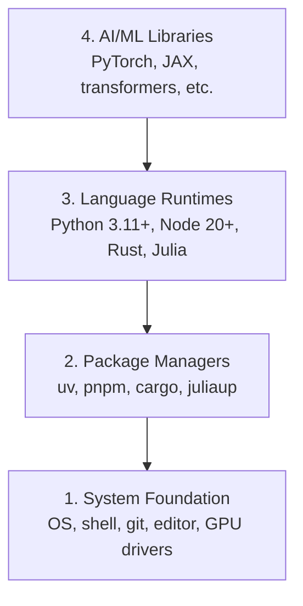

# 개발 환경 (Dev Environment)

> 쓰는 도구가 사고방식을 결정한다. 한 번 제대로 세팅해 두자.

**Type:** Build
**Languages:** Python, Node.js, Rust
**Prerequisites:** None
**Time:** ~45분

## 학습 목표 (Learning Objectives)

- Python 3.11+, Node.js 20+, Rust 툴체인(toolchain)을 밑바닥부터 세팅하기
- 재현 가능한 빌드를 위해 가상 환경(virtual environment)과 패키지 매니저(package manager) 구성하기
- CUDA/MPS로 GPU 접근을 검증하고 테스트용 텐서(tensor) 연산 실행하기
- 시스템, 패키지, 런타임, AI 라이브러리로 이루어진 네 개 층(layer) 스택 이해하기

## 문제 (The Problem)

이제 Python, TypeScript, Rust, Julia로 200개가 넘는 레슨에 걸쳐 AI 엔지니어링을 배운다. 환경이 망가져 있으면, 모든 레슨이 학습이 아니라 도구와 싸우는 일이 되어 버린다.

대부분의 사람들은 환경 설정을 건너뛴다. 그러고는 임포트(import) 오류, 버전 충돌, 빠진 CUDA 드라이버를 디버깅하느라 몇 시간을 쓴다. 우리는 이걸 한 번에 제대로 해 둔다.

## 개념 (The Concept)

AI 엔지니어링 환경은 네 개의 층(layer)으로 이루어진다.



우리는 아래에서 위로(bottom-up) 설치한다. 각 층은 그 아래 층에 의존한다.

## 직접 만들기 (Build It)

### 1단계: 시스템 기반 (System Foundation)

시스템을 확인하고 기본 도구를 설치한다.

```bash
# macOS
xcode-select --install
brew install git curl wget

# Ubuntu/Debian
sudo apt update && sudo apt install -y build-essential git curl wget

# Windows (use WSL2)
wsl --install -d Ubuntu-24.04
```

### 2단계: uv로 설치하는 Python

우리는 `uv`를 사용한다. pip보다 10~100배 빠르고 가상 환경을 자동으로 관리한다.

```bash
curl -LsSf https://astral.sh/uv/install.sh | sh

uv python install 3.12

uv venv
source .venv/bin/activate  # or .venv\Scripts\activate on Windows

uv pip install numpy matplotlib jupyter
```

검증하기:

```python
import sys
print(f"Python {sys.version}")

import numpy as np
print(f"NumPy {np.__version__}")
a = np.array([1, 2, 3])
print(f"Vector: {a}, dot product with itself: {np.dot(a, a)}")
```

### 3단계: pnpm으로 설치하는 Node.js

TypeScript 레슨(에이전트, MCP 서버, 웹 앱)을 위한 것이다.

```bash
curl -fsSL https://fnm.vercel.app/install | bash
fnm install 22
fnm use 22

npm install -g pnpm

node -e "console.log('Node', process.version)"
```

### 4단계: Rust

성능이 중요한 레슨(추론(inference), 시스템)을 위한 것이다.

```bash
curl --proto '=https' --tlsv1.2 -sSf https://sh.rustup.rs | sh

rustc --version
cargo --version
```

### 5단계: Julia (선택)

Julia가 빛을 발하는, 수학 비중이 큰 레슨을 위한 것이다.

```bash
curl -fsSL https://install.julialang.org | sh

julia -e 'println("Julia ", VERSION)'
```

### 6단계: GPU 설정 (있는 경우)

```bash
# NVIDIA
nvidia-smi

# Install PyTorch with CUDA
uv pip install torch torchvision torchaudio --index-url https://download.pytorch.org/whl/cu124
```

```python
import torch
print(f"CUDA available: {torch.cuda.is_available()}")
if torch.cuda.is_available():
    print(f"GPU: {torch.cuda.get_device_name(0)}")
```

GPU가 없다고? 괜찮다. 대부분의 레슨은 CPU에서 돌아간다. 학습 비중이 큰 레슨의 경우 Google Colab이나 클라우드 GPU를 사용하면 된다.

### 7단계: 전부 검증하기

검증 스크립트를 실행한다.

```bash
python phases/00-setup-and-tooling/01-dev-environment/code/verify.py
```

## 라이브러리로 써보기 (Use It)

이제 환경은 이 강의의 모든 레슨에 쓸 준비가 됐다. 어디에서 무엇을 쓰게 되는지 정리하면 다음과 같다.

| Language | Used In | Package Manager |
|----------|---------|-----------------|
| Python | Phases 1-12 (ML, DL, NLP, Vision, Audio, LLMs) | uv |
| TypeScript | Phases 13-17 (Tools, Agents, Swarms, Infra) | pnpm |
| Rust | Phases 12, 15-17 (Performance-critical systems) | cargo |
| Julia | Phase 1 (Math foundations) | Pkg |

## 산출물 (Ship It)

이 레슨은 누구나 실행해서 자신의 설정을 점검할 수 있는 검증 스크립트를 만들어 낸다.

AI 어시스턴트가 환경 문제를 진단하도록 돕는 프롬프트(prompt)는 `outputs/prompt-env-check.md`를 참고하라.

## 연습 문제 (Exercises)

1. 검증 스크립트를 실행하고 실패하는 부분을 모두 고쳐라
2. 이 강의를 위한 Python 가상 환경을 만들고 PyTorch를 설치하라
3. 네 개 언어 전부로 "hello world"를 작성하고 각각 실행하라
