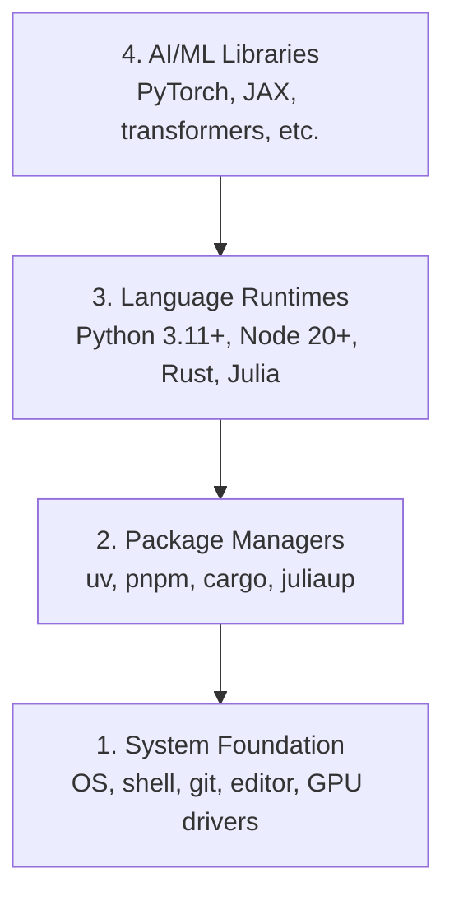

# 개발 환경 (Dev Environment)

> 쓰는 도구가 사고방식을 결정한다. 한 번 제대로 세팅해 두자.

**Type:** Build
**Languages:** Python, Node.js, Rust
**Prerequisites:** None
**Time:** ~45분

## 학습 목표 (Learning Objectives)

- Python 3.11+, Node.js 20+, Rust 툴체인(toolchain)을 밑바닥부터 세팅하기
- 재현 가능한 빌드를 위해 가상 환경(virtual environment)과 패키지 매니저(package manager) 구성하기
- CUDA/MPS로 GPU 접근을 검증하고 테스트용 텐서(tensor) 연산 실행하기
- 시스템, 패키지, 런타임, AI 라이브러리로 이루어진 네 개 층(layer) 스택 이해하기

## 문제 (The Problem)

이제 Python, TypeScript, Rust, Julia로 200개가 넘는 레슨에 걸쳐 AI 엔지니어링을 배운다. 환경이 망가져 있으면, 모든 레슨이 학습이 아니라 도구와 싸우는 일이 되어 버린다.

대부분의 사람들은 환경 설정을 건너뛴다. 그러고는 임포트(import) 오류, 버전 충돌, 빠진 CUDA 드라이버를 디버깅하느라 몇 시간을 쓴다. 우리는 이걸 한 번에 제대로 해 둔다.

## 개념 (The Concept)

AI 엔지니어링 환경은 네 개의 층(layer)으로 이루어진다.


```mermaid
graph TD
    A["4. AI/ML Libraries\nPyTorch, JAX, transformers, etc."] --> B["3. Language Runtimes\nPython 3.11+, Node 20+, Rust, Julia"]
    B --> C["2. Package Managers\nuv, pnpm, cargo, juliaup"]
    C --> D["1. System Foundation\nOS, shell, git, editor, GPU drivers"]
```

우리는 아래에서 위로(bottom-up) 설치한다. 각 층은 그 아래 층에 의존한다.

```figure
s0-env-stack
```

## 직접 만들기 (Build It)

### 1단계: 시스템 기반 (System Foundation)

시스템을 확인하고 기본 도구를 설치한다.

```bash
# macOS
xcode-select --install
brew install git curl wget

# Ubuntu/Debian
sudo apt update && sudo apt install -y build-essential git curl wget

# Windows (use WSL2)
wsl --install -d Ubuntu-24.04
```

### 2단계: uv로 설치하는 Python

우리는 `uv`를 사용한다. pip보다 10~100배 빠르고 가상 환경을 자동으로 관리한다.

```bash
curl -LsSf https://astral.sh/uv/install.sh | sh

uv python install 3.12

uv venv
source .venv/bin/activate  # or .venv\Scripts\activate on Windows

uv pip install numpy matplotlib jupyter
```

검증하기:

```python
import sys
print(f"Python {sys.version}")

import numpy as np
print(f"NumPy {np.__version__}")
a = np.array([1, 2, 3])
print(f"Vector: {a}, dot product with itself: {np.dot(a, a)}")
```

### 3단계: pnpm으로 설치하는 Node.js

TypeScript 레슨(에이전트, MCP 서버, 웹 앱)을 위한 것이다.

```bash
curl -fsSL https://fnm.vercel.app/install | bash
fnm install 22
fnm use 22

npm install -g pnpm

node -e "console.log('Node', process.version)"
```

**macOS / Apple Silicon (M1/M2/M3/M4):** 설치 프로그램이 `Error: Cannot install under Rosetta 2 in ARM default prefix (/opt/homebrew)`로 멈춘다면, Homebrew는 네이티브 arm64 빌드인데 터미널이 Rosetta 2 아래에서 돌고 있는 것이다(`arch`가 `i386`을 찍는다). arm64를 강제해 fnm을 설치하고 셸에 연결한 다음, 위의 `fnm install 22`부터 다시 실행하라.

```bash
arch -arm64 brew install fnm
echo 'eval "$(fnm env --use-on-cd)"' >> ~/.zshrc
source ~/.zshrc
```

### 4단계: Rust

성능이 중요한 레슨(추론(inference), 시스템)을 위한 것이다.

```bash
curl --proto '=https' --tlsv1.2 -sSf https://sh.rustup.rs | sh

rustc --version
cargo --version
```

### 5단계: Julia (선택)

Julia가 빛을 발하는, 수학 비중이 큰 레슨을 위한 것이다.

```bash
curl -fsSL https://install.julialang.org | sh

julia -e 'println("Julia ", VERSION)'
```

### 6단계: GPU 설정 (있는 경우)

**NVIDIA (Linux / Windows):**

```bash
nvidia-smi

# Install PyTorch with CUDA
uv pip install torch torchvision torchaudio --index-url https://download.pytorch.org/whl/cu124
```

**macOS / Apple Silicon (M1/M2/M3/M4):** 맥에는 CUDA가 없다. 실패가 아니라 원래 그렇다. `--index-url .../cuXXX`를 **넘기지 마라**(그 휠은 리눅스와 윈도우 전용이라 설치가 깨진다). 애플의 MPS(Metal) GPU 백엔드가 들어 있는 평범한 빌드를 설치하라.

```bash
uv pip install torch torchvision torchaudio
```

확인하기(어느 플랫폼에서나 된다):

```python
import torch
print(f"CUDA available: {torch.cuda.is_available()}")           # False on macOS — expected
print(f"MPS available:  {torch.backends.mps.is_available()}")   # True on Apple Silicon
if torch.cuda.is_available():
    print(f"GPU: {torch.cuda.get_device_name(0)}")
```

GPU가 없다고? 괜찮다. 대부분의 레슨은 CPU에서 돌아간다. 학습 비중이 큰 레슨의 경우 Google Colab이나 클라우드 GPU를 사용하면 된다.

### 7단계: 시작하려는 경로를 검증하기

이 레슨의 모든 명령은 저장소 루트, 즉 `README.md`와 `phases/`가 들어 있는
디렉터리에서 실행하라. 사전 점검은 고른 경로를 시작하는 데 필요한 것만
확인한다. 처음 배우는 사람이 경고 더미 대신 분명한 답 하나를 보도록,
뒤에 나오는 도구는 기본적으로 건너뛴다.

초심자 전체 과정을 시작한다면 이렇게 한다.

```bash
python3 phases/00-setup-and-tooling/01-dev-environment/code/verify.py --route beginner
```

원하는 경로만 확인하려면 이렇게 한다.

```bash
python3 phases/00-setup-and-tooling/01-dev-environment/code/verify.py --route ml-foundations
python3 phases/00-setup-and-tooling/01-dev-environment/code/verify.py --route llm-engineering
python3 phases/00-setup-and-tooling/01-dev-environment/code/verify.py --route agents
python3 phases/00-setup-and-tooling/01-dev-environment/code/verify.py --route mcp
python3 phases/00-setup-and-tooling/01-dev-environment/code/verify.py --route agent-skills
python3 phases/00-setup-and-tooling/01-dev-environment/code/verify.py --route certification
```

같은 사전 점검으로 뒤의 레슨이 쓰는 선택적 도구와 의존성까지 살펴보고
싶다면 `--show-later`를 붙이라. 뒤에 나오는 도구가 빠져 있어도 고른
경로를 막지는 않는다.

필수 점검이 실패할 때마다 찾아낸 경로나 임포트 오류와 함께 정확한 해결
명령이 따라온다. Agent Skills 경로와 인증 경로는 손으로 확인할 항목도
보여 준다. AI 호스트가 스킬을 찾아냈는지, 여러분이 고른 스킬 범위에 쓸 수
있는지는 파이썬 스크립트가 증명할 수 없기 때문이다.

초심자 사전 점검을 통과하면 가장 먼저 실행할 레슨을 정확히 찍어 준다.

```text
Ready to start Beginner course.
Next: python3 phases/01-math-foundations/01-linear-algebra-intuition/code/vectors.py
```

## 라이브러리로 써보기 (Use It)

이제 환경은 여러분이 점검한 경로를 시작할 준비가 됐다. 뒤에 나오는 도구는
스택 전체를 갖추느라 첫 레슨을 막지 말고, 레슨이 요구할 때 설치하라.
이 과정 전반에서 무엇을 쓰게 되는지 정리하면 다음과 같다.

| Language | Used In | Package Manager |
|----------|---------|-----------------|
| Python | Phases 1-12 (ML, DL, NLP, Vision, Audio, LLMs) | uv |
| TypeScript | Phases 13-17 (Tools, Agents, Swarms, Infra) | pnpm |
| Rust | Phases 12, 15-17 (Performance-critical systems) | cargo |
| Julia | Phase 1 (Math foundations) | Pkg |

## 산출물 (Ship It)

이 레슨은 누구나 실행해서 자신의 설정을 점검할 수 있는 검증 스크립트를 만들어 낸다.

AI 어시스턴트가 환경 문제를 진단하도록 돕는 프롬프트(prompt)는 `outputs/prompt-env-check.md`를 참고하라.

## 연습 문제 (Exercises)

1. 검증 스크립트를 실행하고 실패하는 부분을 모두 고쳐라
2. 이 강의를 위한 Python 가상 환경을 만들고 PyTorch를 설치하라
3. 네 개 언어 전부로 "hello world"를 작성하고 각각 실행하라
