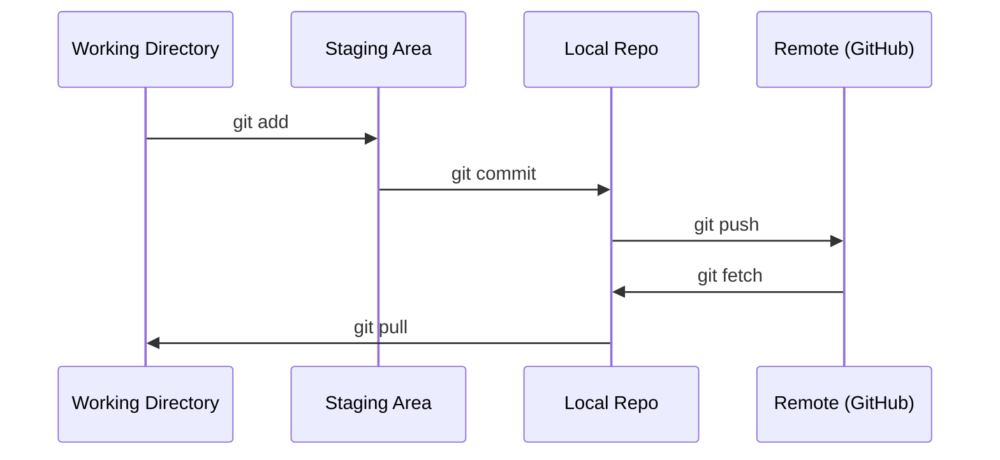

# Git과 협업 (Git & Collaboration)

> 버전 관리(version control)는 선택이 아니다. 여기서 만드는 모든 실험, 모든 모델, 모든 레슨이 추적된다.

**Type:** Learn
**Languages:** --
**Prerequisites:** Phase 0, Lesson 01
**Time:** ~30분

## 학습 목표 (Learning Objectives)

- git 신원(identity)을 구성하고 add, commit, push로 이어지는 일상 워크플로 사용하기
- main을 망가뜨리지 않고 격리된 실험을 위해 브랜치(branch)를 만들고 병합(merge)하기
- 모델 체크포인트(checkpoint)와 대용량 바이너리 파일을 제외하는 `.gitignore` 작성하기
- `git log`로 커밋 히스토리를 탐색하며 프로젝트의 진화 이해하기

## 문제 (The Problem)

당신은 이제 20개 단계(phase)에 걸쳐 수백 개의 코드 파일을 작성하게 된다. 버전 관리가 없다면 작업물을 잃어버리고, 되돌릴 수 없는 방식으로 무언가를 망가뜨리며, 다른 사람과 협업할 방법도 없게 된다.

Git은 그 도구다. GitHub은 코드가 사는 곳이다. 이 레슨은 이 강의에 필요한 것만 다루고, 그 이상은 다루지 않는다.

## 개념 (The Concept)



기억할 것은 세 가지다.
1. 자주 저장한다 (`git commit`)
2. 원격(remote)에 푸시한다 (`git push`)
3. 실험을 위해 브랜치를 딴다 (`git checkout -b experiment`)

## 직접 만들기 (Build It)

### 1단계: git 구성하기

```bash
git config --global user.name "Your Name"
git config --global user.email "you@example.com"
```

### 2단계: 일상 워크플로

```bash
git status
git add file.py
git commit -m "Add perceptron implementation"
git push origin main
```

### 3단계: 실험을 위한 브랜치

```bash
git checkout -b experiment/new-optimizer

# ... make changes, commit ...

git checkout main
git merge experiment/new-optimizer
```

### 4단계: 이 강의 저장소로 작업하기

```bash
git clone https://github.com/rohitg00/ai-engineering-from-scratch.git
cd ai-engineering-from-scratch

git checkout -b my-progress
# work through lessons, commit your code
git push origin my-progress
```

## 라이브러리로 써보기 (Use It)

이 강의에서 당신에게 필요한 명령어는 정확히 다음과 같다.

| 명령어 | 언제 |
|---------|------|
| `git clone` | 강의 저장소 받기 |
| `git add` + `git commit` | 작업물 저장하기 |
| `git push` | GitHub에 백업하기 |
| `git checkout -b` | main을 망가뜨리지 않고 무언가 시도하기 |
| `git log --oneline` | 지금까지 한 일 확인하기 |

이게 전부다. 이 강의에는 rebase, cherry-pick, 서브모듈(submodule)이 필요 없다.

## 연습 문제 (Exercises)

1. 이 저장소를 클론하고, `my-progress`라는 브랜치를 만들고, 파일을 하나 만들어 커밋한 뒤 푸시하라
2. 모델 체크포인트 파일(`.pt`, `.pth`, `.safetensors`)을 제외하는 `.gitignore`를 작성하라
3. `git log --oneline`으로 이 저장소의 커밋 히스토리를 살펴보고 레슨들이 어떻게 추가되었는지 읽어 보라

## 핵심 용어 (Key Terms)

| 용어 | 흔히 하는 말 | 실제 의미 |
|------|----------------|----------------------|
| 커밋(Commit) | "저장하기" | 특정 시점의 프로젝트 전체에 대한 스냅샷(snapshot) |
| 브랜치(Branch) | "복사본" | 작업이 진행되면서 앞으로 이동하는, 커밋을 가리키는 포인터(pointer) |
| 병합(Merge) | "코드 합치기" | 한 브랜치의 변경 사항을 다른 브랜치에 가져와 적용하는 것 |
| 리모트(Remote) | "클라우드" | 다른 어딘가(GitHub, GitLab)에 호스팅된 저장소의 복사본 |
