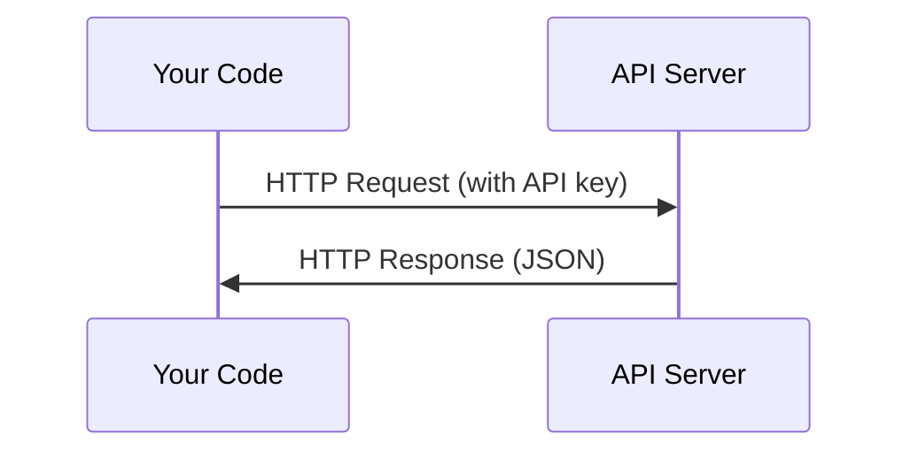

# API와 키 (APIs & Keys)

> 모든 AI API는 같은 방식으로 작동한다. 요청을 보내고, 응답을 받는다. 세부 사항은 바뀌어도 패턴은 바뀌지 않는다.

**Type:** Build
**Languages:** Python, TypeScript
**Prerequisites:** Phase 0, Lesson 01
**Time:** ~30분

## 학습 목표 (Learning Objectives)

- 환경 변수(environment variable)와 `.env` 파일을 사용해 API 키를 안전하게 저장하기
- Anthropic Python SDK와 원시 HTTP(raw HTTP) 양쪽으로 LLM API 호출하기
- 디버깅을 위해 SDK 기반과 원시 HTTP의 요청/응답 형식 비교하기
- 인증(authentication) 및 속도 제한(rate limit)을 포함한 흔한 API 오류를 식별하고 처리하기

## 문제 (The Problem)

Phase 11부터는 LLM API(Anthropic, OpenAI, Google)를 호출한다. Phase 13~16에서는 이 API들을 루프(loop) 안에서 사용하는 에이전트(agent)를 만든다. API 키가 어떻게 작동하는지, 어떻게 안전하게 저장하는지, 첫 API 호출은 어떻게 하는지 알아야 한다.

## 개념 (The Concept)



모든 API 호출에는 다음이 있다.
1. 엔드포인트(endpoint)(URL)
2. API 키(인증)
3. 요청 본문(request body)(원하는 것)
4. 응답 본문(response body)(받는 것)

## 직접 만들기 (Build It)

### 1단계: API 키를 안전하게 저장하기

API 키를 절대 코드에 넣지 마라. 환경 변수를 사용하라.

```bash
export ANTHROPIC_API_KEY="sk-ant-..."
export OPENAI_API_KEY="sk-..."
```

또는 `.env` 파일을 사용하라(`.gitignore`에 추가할 것):

```
ANTHROPIC_API_KEY=sk-ant-...
OPENAI_API_KEY=sk-...
```

### 2단계: 첫 API 호출 (Python)

```python
import anthropic

client = anthropic.Anthropic()

response = client.messages.create(
    model="claude-sonnet-4-20250514",
    max_tokens=256,
    messages=[{"role": "user", "content": "What is a neural network in one sentence?"}]
)

print(response.content[0].text)
```

### 3단계: 첫 API 호출 (TypeScript)

```typescript
import Anthropic from "@anthropic-ai/sdk";

const client = new Anthropic();

const response = await client.messages.create({
  model: "claude-sonnet-4-20250514",
  max_tokens: 256,
  messages: [{ role: "user", content: "What is a neural network in one sentence?" }],
});

console.log(response.content[0].text);
```

### 4단계: 원시 HTTP (SDK 없이)

```python
import os
import urllib.request
import json

url = "https://api.anthropic.com/v1/messages"
headers = {
    "Content-Type": "application/json",
    "x-api-key": os.environ["ANTHROPIC_API_KEY"],
    "anthropic-version": "2023-06-01",
}
body = json.dumps({
    "model": "claude-sonnet-4-20250514",
    "max_tokens": 256,
    "messages": [{"role": "user", "content": "What is a neural network in one sentence?"}],
}).encode()

req = urllib.request.Request(url, data=body, headers=headers, method="POST")
with urllib.request.urlopen(req) as resp:
    result = json.loads(resp.read())
    print(result["content"][0]["text"])
```

SDK가 내부적으로 하는 일이 바로 이것이다. 원시 HTTP 호출을 이해하면 디버깅할 때 도움이 된다.

## 라이브러리로 써보기 (Use It)

이 강의에서:

| API | 언제 필요한가 | 무료 티어 |
|-----|-----------------|-----------|
| Anthropic (Claude) | Phase 11-16 (에이전트, 도구) | 가입 시 $5 크레딧 |
| OpenAI | Phase 11 (비교) | 가입 시 $5 크레딧 |
| Hugging Face | Phase 4-10 (모델, 데이터셋) | 무료 |

지금 당장 전부 필요한 것은 아니다. 레슨에서 요구할 때 설정하라.

## 산출물 (Ship It)

이 레슨은 다음을 만들어 낸다.
- `outputs/prompt-api-troubleshooter.md` - 흔한 API 오류 진단하기

## 연습 문제 (Exercises)

1. Anthropic API 키를 발급받고 첫 API 호출을 하라
2. 원시 HTTP 버전을 시도하고 응답 형식을 SDK 버전과 비교하라
3. 일부러 잘못된 API 키를 사용해 보고 오류 메시지를 읽어 보라

## 핵심 용어 (Key Terms)

| 용어 | 흔히 하는 말 | 실제 의미 |
|------|----------------|----------------------|
| API 키(API key) | "API용 비밀번호" | 계정을 식별하고 요청을 인가하는 고유 문자열 |
| 요청 제한(Rate limit) | "스로틀링당하고 있어" | 남용을 막고 공정한 사용을 보장하기 위한 분/시간당 최대 요청 수 |
| 토큰(Token) | "단어" (API 맥락에서) | 과금 단위. 입력 토큰과 출력 토큰이 따로 집계되고 따로 청구된다 |
| 스트리밍(Streaming) | "실시간 응답" | 전체 응답을 기다리지 않고 단어 단위로 응답을 받는 것 |
