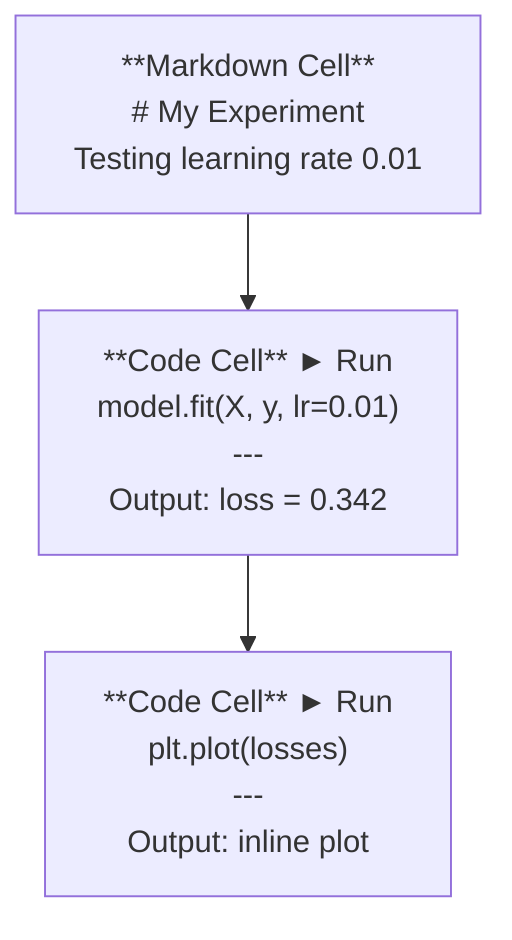
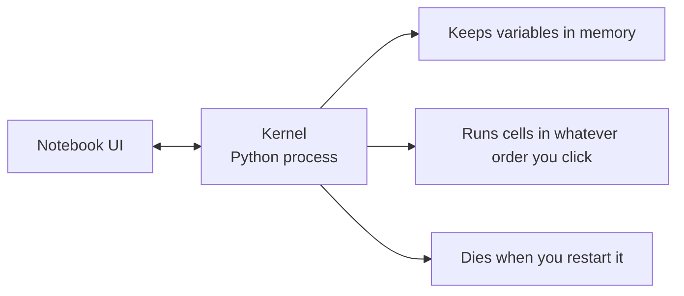

# 주피터 노트북 (Jupyter Notebooks)

> 노트북은 AI 엔지니어링의 실험대다. 여기서 프로토타입을 만들고, 잘 되는 것을 프로덕션(production)으로 옮긴다.

**Type:** Build
**Languages:** Python
**Prerequisites:** Phase 0, Lesson 01
**Time:** ~30분

## 학습 목표 (Learning Objectives)

- JupyterLab, Jupyter Notebook, 또는 Jupyter 확장이 설치된 VS Code를 설치하고 실행하기
- 매직 커맨드(magic command)(`%timeit`, `%%time`, `%matplotlib inline`)로 벤치마크하고 인라인으로 시각화하기
- 노트북과 스크립트를 언제 써야 하는지 구분하고 "노트북에서 탐색하고, 스크립트로 출시한다" 워크플로 적용하기
- 흔한 노트북 함정(순서가 뒤바뀐 실행, 숨은 상태, 메모리 누수)을 식별하고 피하기

## 문제 (The Problem)

모든 AI 논문, 튜토리얼, Kaggle 대회가 주피터 노트북을 사용한다. 노트북을 쓰면 코드를 조각 단위로 실행하고, 출력을 인라인으로 보고, 코드와 설명을 섞고, 빠르게 반복할 수 있다. 노트북 없이 AI를 배우려는 것은 연습장 없이 수학 숙제를 하는 것과 같다.

하지만 노트북에는 진짜 함정들이 있다. 사람들은 노트북이 형편없는 일까지 포함해 모든 일에 노트북을 쓴다. 언제 노트북을 쓰고 언제 스크립트를 써야 하는지 아는 것이 나중에 디버깅 악몽에서 당신을 구해 줄 것이다.

## 개념 (The Concept)

노트북은 셀(cell)의 목록이다. 각 셀은 코드 아니면 텍스트다.



커널(kernel)은 백그라운드에서 돌아가는 Python 프로세스다. 셀을 실행하면 코드를 커널로 보내고, 커널이 그것을 실행한 뒤 결과를 돌려준다. 모든 셀이 같은 커널을 공유하므로 변수가 셀 사이에서 유지된다.



"클릭하는 순서가 무엇이든"이라는 그 부분이 초능력이자 동시에 발등 찍는 도끼다.

## 직접 만들기 (Build It)

### 1단계: 인터페이스 고르기

세 가지 선택지, 하나의 포맷:

| 인터페이스 | 설치 | 적합한 용도 |
|-----------|---------|----------|
| JupyterLab | `pip install jupyterlab` 후 `jupyter lab` | 완전한 IDE 경험, 여러 탭, 파일 브라우저, 터미널 |
| Jupyter Notebook | `pip install notebook` 후 `jupyter notebook` | 단순하고 가볍게, 한 번에 노트북 하나 |
| VS Code | "Jupyter" 확장 설치 | 이미 쓰는 에디터 안에서, git 통합, 디버깅 |

세 가지 모두 같은 `.ipynb` 파일을 읽고 쓴다. 마음에 드는 것을 고르면 된다. AI 작업에서는 JupyterLab이 가장 흔하다.

```bash
pip install jupyterlab
jupyter lab
```

### 2단계: 중요한 키보드 단축키

당신은 두 가지 모드에서 작업한다. `Escape`를 누르면 커맨드 모드(왼쪽에 파란 막대), `Enter`를 누르면 편집 모드(초록 막대)다.

**커맨드 모드(가장 많이 씀):**

| 키 | 동작 |
|-----|--------|
| `Shift+Enter` | 셀 실행 후 다음으로 이동 |
| `A` | 위에 셀 삽입 |
| `B` | 아래에 셀 삽입 |
| `DD` | 셀 삭제 |
| `M` | 마크다운으로 변환 |
| `Y` | 코드로 변환 |
| `Z` | 셀 작업 되돌리기 |
| `Ctrl+Shift+H` | 모든 단축키 보기 |

**편집 모드:**

| 키 | 동작 |
|-----|--------|
| `Tab` | 자동 완성 |
| `Shift+Tab` | 함수 시그니처(signature) 보기 |
| `Ctrl+/` | 주석 토글 |

`Shift+Enter`는 하루에 천 번씩 쓰게 될 단축키다. 가장 먼저 익혀라.

### 3단계: 셀 타입

**코드 셀(Code cell)**은 Python을 실행하고 출력을 보여 준다.

```python
import numpy as np
data = np.random.randn(1000)
data.mean(), data.std()
```

출력: `(0.0032, 0.9987)`

**마크다운 셀(Markdown cell)**은 서식이 적용된 텍스트를 렌더링한다. 무엇을 왜 하고 있는지 문서화하는 데 사용하라. 헤더, 굵게, 기울임, LaTeX 수식(`$E = mc^2$`), 표, 이미지를 지원한다.

### 4단계: 매직 커맨드

이것들은 Python이 아니다. `%`(라인 매직(line magic))나 `%%`(셀 매직(cell magic))로 시작하는 Jupyter 전용 명령어다.

**코드 시간 재기:**

```python
%timeit np.random.randn(10000)
```

출력: `45.2 us +/- 1.3 us per loop`

```python
%%time
model.fit(X_train, y_train, epochs=10)
```

출력: `Wall time: 2.34 s`

`%timeit`은 코드를 여러 번 실행해 평균을 낸다. `%%time`은 한 번만 실행한다. 마이크로벤치마크에는 `%timeit`을, 훈련 실행에는 `%%time`을 사용하라.

**인라인 플롯 활성화:**

```python
%matplotlib inline
```

이제 모든 `plt.plot()`이나 `plt.show()`가 노트북 안에 바로 렌더링된다.

**노트북을 벗어나지 않고 패키지 설치:**

```python
!pip install scikit-learn
```

`!` 접두사는 어떤 셸 명령어든 실행한다.

**환경 변수 확인:**

```python
%env CUDA_VISIBLE_DEVICES
```

### 5단계: 리치 출력을 인라인으로 표시하기

노트북은 셀의 마지막 표현식을 자동으로 표시한다. 하지만 이를 제어할 수도 있다.

```python
import pandas as pd

df = pd.DataFrame({
    "model": ["Linear", "Random Forest", "Neural Net"],
    "accuracy": [0.72, 0.89, 0.94],
    "training_time": [0.1, 2.3, 45.6]
})
df
```

이것은 텍스트 덤프가 아니라 서식이 적용된 HTML 표를 렌더링한다. 플롯도 마찬가지다.

```python
import matplotlib.pyplot as plt

plt.figure(figsize=(8, 4))
plt.plot([1, 2, 3, 4], [1, 4, 2, 3])
plt.title("Inline Plot")
plt.show()
```

플롯이 셀 바로 아래에 나타난다. 이것이 노트북이 AI 작업을 지배하는 이유다. 데이터, 플롯, 코드를 함께 본다.

이미지의 경우:

```python
from IPython.display import Image, display
display(Image(filename="architecture.png"))
```

### 6단계: Google Colab

Colab은 클라우드에 있는 무료 주피터 노트북이다. GPU, 미리 설치된 라이브러리, Google Drive 통합을 제공한다. 별도 설정이 필요 없다.

1. [colab.research.google.com](https://colab.research.google.com)으로 이동한다
2. 이 강의의 어떤 `.ipynb` 파일이든 업로드한다
3. Runtime > Change runtime type > T4 GPU (free)

로컬 Jupyter와 Colab의 차이점:
- 파일이 세션 간에 유지되지 않는다(Drive에 저장하거나 다운로드할 것)
- 미리 설치됨: numpy, pandas, matplotlib, torch, tensorflow, sklearn
- 파일을 업로드/다운로드하려면 `from google.colab import files`
- 영구 저장소를 위해서는 `from google.colab import drive; drive.mount('/content/drive')`
- 비활성 상태 90분 후 세션이 만료된다(무료 등급)

## 라이브러리로 써보기 (Use It)

### 노트북 vs 스크립트: 언제 무엇을 쓸까

| 노트북을 쓸 때 | 스크립트를 쓸 때 |
|-------------------|-----------------|
| 데이터셋 탐색 | 훈련 파이프라인 |
| 모델 프로토타이핑 | 재사용 가능한 유틸리티 |
| 결과 시각화 | `if __name__`이 들어가는 모든 것 |
| 작업 설명 | 스케줄에 따라 실행되는 코드 |
| 빠른 실험 | 프로덕션 코드 |
| 강의 연습 문제 | 패키지와 라이브러리 |

규칙은 이렇다. **노트북에서 탐색하고, 스크립트로 출시한다.**

AI에서 흔한 워크플로:
1. 노트북에서 데이터를 탐색한다
2. 노트북에서 모델을 프로토타이핑한다
3. 잘 작동하면 코드를 `.py` 파일로 옮긴다
4. 그 `.py` 파일들을 다시 노트북에 임포트해 추가 실험을 한다

### 흔한 함정

**순서가 뒤바뀐 실행.** 셀 5를 실행하고, 그다음 셀 2, 그다음 셀 7을 실행한다. 노트북이 당신 컴퓨터에서는 돌아가지만 다른 사람이 위에서 아래로 실행하면 망가진다. 해결책: 공유하기 전에 Kernel > Restart & Run All.

**숨은 상태.** 셀을 삭제했지만 그것이 만든 변수가 여전히 메모리에 남아 있다. 노트북은 깨끗해 보이지만 유령 셀에 의존하고 있다. 해결책: 커널을 정기적으로 재시작하라.

**메모리 누수.** 4GB 데이터셋을 로드하고, 모델을 훈련하고, 또 다른 데이터셋을 로드한다. 아무것도 해제되지 않는다. 해결책: `del variable_name`과 `gc.collect()`, 또는 커널 재시작.

## 산출물 (Ship It)

이 레슨은 다음을 만들어 낸다.
- 노트북 문제 디버깅을 위한 `outputs/prompt-notebook-helper.md`

## 연습 문제 (Exercises)

1. JupyterLab을 열어 노트북을 만들고, `%timeit`으로 10만 개의 난수 배열을 만들 때 리스트 컴프리헨션(list comprehension)과 numpy를 비교하라
2. CSV를 로드하고, 데이터프레임(dataframe)을 표시하고, 차트를 그리는 마크다운 셀과 코드 셀이 모두 있는 노트북을 만들어라. 그런 다음 Kernel > Restart & Run All을 실행해 위에서 아래로 작동하는지 검증하라
3. `code/notebook_tips.py`의 코드를 가져와 Colab 노트북에 붙여 넣고 무료 GPU로 실행하라

## 핵심 용어 (Key Terms)

| 용어 | 흔히 하는 말 | 실제 의미 |
|------|----------------|----------------------|
| 커널(Kernel) | "내 코드를 돌리는 것" | 셀을 실행하고 변수를 메모리에 유지하는 별도의 Python 프로세스 |
| 셀(Cell) | "코드 블록" | 노트북에서 독립적으로 실행 가능한 단위. 코드 아니면 마크다운 |
| 매직 커맨드(Magic command) | "Jupyter 꼼수" | `%`나 `%%`가 접두사로 붙어 노트북 환경을 제어하는 특수 명령어 |
| `.ipynb` | "노트북 파일" | 셀, 출력, 메타데이터를 담은 JSON 파일. IPython Notebook의 약자 |

## 더 읽을거리 (Further Reading)

- 전체 기능을 보려면 [JupyterLab Docs](https://jupyterlab.readthedocs.io/)
- Colab 고유의 제한과 기능은 [Google Colab FAQ](https://research.google.com/colaboratory/faq.html)
- 파워 유저 단축키는 [28 Jupyter Notebook Tips](https://www.dataquest.io/blog/jupyter-notebook-tips-tricks-shortcuts/)
