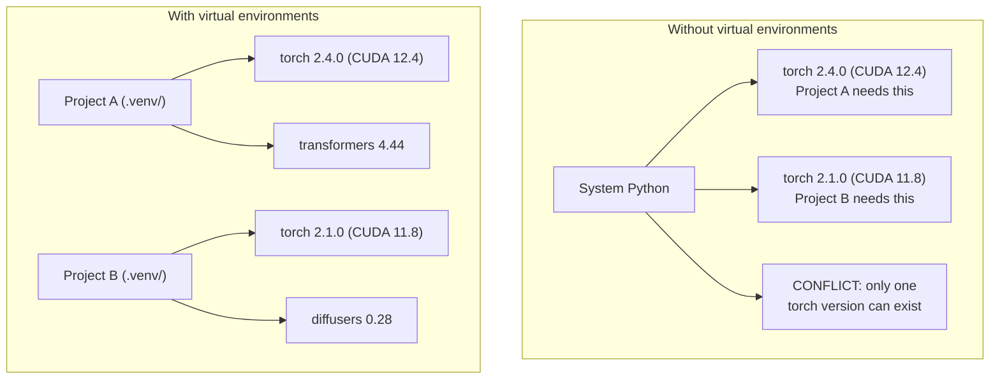

# Python 환경 (Python Environments)

> 의존성 지옥(dependency hell)은 실재한다. 가상 환경(virtual environment)이 그 치료제다.

**Type:** Build
**Languages:** Shell
**Prerequisites:** Phase 0, Lesson 01
**Time:** ~30분

## 학습 목표 (Learning Objectives)

- `uv`, `venv`, 또는 `conda`를 사용해 격리된 가상 환경 만들기
- 선택적 의존성 그룹이 포함된 `pyproject.toml`을 작성하고 재현성을 위한 락파일(lockfile) 생성하기
- 흔한 함정(전역 설치, pip/conda 혼용, CUDA 버전 불일치)을 진단하고 해결하기
- 의존성이 충돌하는 프로젝트를 위해 단계(phase)별 환경 전략 구현하기

## 문제 (The Problem)

당신은 파인튜닝(fine-tuning) 프로젝트를 위해 PyTorch 2.4를 설치한다. 다음 주에 또 다른 프로젝트가 CUDA 빌드가 고정되어 있어 PyTorch 2.1을 필요로 한다. 전역으로 업그레이드하면 첫 번째 프로젝트가 망가진다. 다운그레이드하면 두 번째 것이 망가진다.

이것이 의존성 지옥이다. AI/ML 작업에서는 다음 이유로 끊임없이 발생한다.

- PyTorch, JAX, TensorFlow가 각각 자체 CUDA 바인딩을 함께 배포한다
- 모델 라이브러리들이 특정 프레임워크 버전을 고정한다
- 전역 `pip install`은 이전에 있던 것을 덮어쓴다
- CUDA 11.8 빌드는 CUDA 12.x 드라이버와 작동하지 않는다(그 반대도 마찬가지)

해결책: 모든 프로젝트가 자체 패키지를 가진 자체 격리 환경을 갖는다.

## 개념 (The Concept)



## 직접 만들기 (Build It)

### 옵션 1: uv venv (권장)

`uv`는 가장 빠른 Python 패키지 매니저(package manager)다(pip보다 10~100배 빠름). 가상 환경, Python 버전, 의존성 해결을 하나의 도구로 처리한다.

```bash
curl -LsSf https://astral.sh/uv/install.sh | sh

uv python install 3.12

cd your-project
uv venv
source .venv/bin/activate
```

패키지 설치:

```bash
uv pip install torch numpy
```

`pyproject.toml`이 포함된 프로젝트를 한 번에 만들기:

```bash
uv init my-ai-project
cd my-ai-project
uv add torch numpy matplotlib
```

### 옵션 2: venv (내장)

`uv`를 설치할 수 없다면, Python에는 `venv`가 함께 들어 있다.

```bash
python3 -m venv .venv
source .venv/bin/activate  # Linux/macOS
.venv\Scripts\activate     # Windows

pip install torch numpy
```

`uv`보다 느리지만 Python이 설치된 곳이라면 어디서든 작동한다.

### 옵션 3: conda (필요할 때)

Conda는 CUDA 툴킷, cuDNN, C 라이브러리 같은 비(非)Python 의존성을 관리한다. 다음 경우에 사용하라.

- 시스템 전역으로 설치하지 않고 특정 CUDA 툴킷 버전이 필요할 때
- 시스템 패키지를 설치할 수 없는 공유 클러스터에 있을 때
- 라이브러리의 설치 안내가 "conda를 사용하라"고 할 때

```bash
# Install miniconda (not the full Anaconda)
curl -LsSf https://repo.anaconda.com/miniconda/Miniconda3-latest-Linux-x86_64.sh -o miniconda.sh
bash miniconda.sh -b

conda create -n myproject python=3.12
conda activate myproject

conda install pytorch torchvision torchaudio pytorch-cuda=12.4 -c pytorch -c nvidia
```

한 가지 규칙: 어떤 환경에 conda를 사용한다면, 그 환경의 모든 패키지에 conda를 사용하라. conda 환경에 `pip install`을 섞으면 디버깅하기 고통스러운 의존성 충돌이 발생한다.

### 이 강의를 위한 전략: 단계별 전략

강의 전체를 위해 환경 하나를 만들 수도 있다. 그러지 마라. 단계마다 (때로는 충돌하는) 서로 다른 의존성이 필요하다.

전략:

```
ai-engineering-from-scratch/
├── .venv/                    <-- shared lightweight env for phases 0-3
├── phases/
│   ├── 04-neural-networks/
│   │   └── .venv/            <-- PyTorch env
│   ├── 05-cnns/
│   │   └── .venv/            <-- same PyTorch env (symlink or shared)
│   ├── 08-transformers/
│   │   └── .venv/            <-- might need different transformer versions
│   └── 11-llm-apis/
│       └── .venv/            <-- API SDKs, no torch needed
```

`code/env_setup.sh`의 스크립트가 이 강의를 위한 기본(base) 환경을 만든다.

## pyproject.toml 기본 (pyproject.toml Basics)

모든 Python 프로젝트에는 `pyproject.toml`이 있어야 한다. 이것은 `setup.py`, `setup.cfg`, `requirements.txt`를 하나의 파일로 대체한다.

```toml
[project]
name = "ai-engineering-from-scratch"
version = "0.1.0"
requires-python = ">=3.11"
dependencies = [
    "numpy>=1.26",
    "matplotlib>=3.8",
    "jupyter>=1.0",
    "scikit-learn>=1.4",
]

[project.optional-dependencies]
torch = ["torch>=2.3", "torchvision>=0.18"]
llm = ["anthropic>=0.39", "openai>=1.50"]
```

그런 다음 설치:

```bash
uv pip install -e ".[torch]"    # base + PyTorch
uv pip install -e ".[llm]"     # base + LLM SDKs
uv pip install -e ".[torch,llm]" # everything
```

## 락파일 (Lockfiles)

락파일은 모든 의존성(전이 의존성(transitive dependency) 포함)을 정확한 버전으로 고정한다. 이는 재현성을 보장한다. 락파일로 설치하는 사람은 누구나 정확히 같은 패키지를 받는다.

```bash
# uv generates uv.lock automatically when using uv add
uv add numpy

# pip-tools approach
uv pip compile pyproject.toml -o requirements.lock
uv pip install -r requirements.lock
```

락파일을 git에 커밋하라. 누군가 저장소를 클론하면 락파일로 설치해 동일한 버전을 받는다.

## 흔한 실수 (Common Mistakes)

### 1. 전역으로 설치하기

```bash
pip install torch  # BAD: installs to system Python

source .venv/bin/activate
pip install torch  # GOOD: installs to virtual environment
```

패키지가 어디로 가는지 확인하라.

```bash
which python       # should show .venv/bin/python, not /usr/bin/python
which pip           # should show .venv/bin/pip
```

### 2. pip와 conda 섞기

```bash
conda create -n myenv python=3.12
conda activate myenv
conda install pytorch -c pytorch
pip install some-other-package   # BAD: can break conda's dependency tracking
conda install some-other-package # GOOD: let conda manage everything
```

conda 안에서 pip를 꼭 써야 한다면(일부 패키지는 pip 전용이다), 모든 conda 패키지를 먼저 설치하고 pip 패키지를 가장 마지막에 설치하라.

### 3. 활성화를 잊기

```bash
python train.py           # uses system Python, missing packages
source .venv/bin/activate
python train.py           # uses project Python, packages found
```

셸 프롬프트에 환경 이름이 표시되어야 한다.

```
(.venv) $ python train.py
```

### 4. .venv를 git에 커밋하기

```bash
echo ".venv/" >> .gitignore
```

가상 환경은 200MB~2GB다. 로컬에 있는 것이며 머신 간에 이식 가능하지 않다. 대신 `pyproject.toml`과 락파일을 커밋하라.

### 5. CUDA 버전 불일치

```bash
nvidia-smi                # shows driver CUDA version (e.g., 12.4)
python -c "import torch; print(torch.version.cuda)"  # shows PyTorch CUDA version

# These must be compatible.
# PyTorch CUDA version must be <= driver CUDA version.
```

## 라이브러리로 써보기 (Use It)

설정 스크립트를 실행해 강의 환경을 만든다.

```bash
bash phases/00-setup-and-tooling/06-python-environments/code/env_setup.sh
```

이것은 핵심 의존성이 설치되고 검증된 `.venv`를 저장소 루트에 만든다.

## 연습 문제 (Exercises)

1. `env_setup.sh`를 실행하고 모든 점검이 통과하는지 검증하라
2. 두 번째 가상 환경을 만들어 그 안에 다른 버전의 numpy를 설치하고, 두 환경이 격리되어 있음을 확인하라
3. PyTorch와 Anthropic SDK가 모두 필요한 프로젝트를 위한 `pyproject.toml`을 작성하라
4. 일부러 (venv를 활성화하지 않고) 패키지를 전역으로 설치해 그것이 어디로 가는지 확인한 뒤 제거하라

## 핵심 용어 (Key Terms)

| 용어 | 흔히 하는 말 | 실제 의미 |
|------|----------------|----------------------|
| 가상 환경(Virtual environment) | "venv" | Python 인터프리터와 패키지를 담은, 시스템 Python과 분리된 격리 디렉터리 |
| 락파일(Lockfile) | "고정된 의존성" | 모든 패키지와 그 정확한 버전을 나열해 머신 간 동일한 설치를 보장하는 파일 |
| pyproject.toml | "새로운 setup.py" | setup.py/setup.cfg/requirements.txt를 대체하는 표준 Python 프로젝트 구성 파일 |
| 전이 의존성(Transitive dependency) | "의존성의 의존성" | 패키지 B가 C에 의존할 때, B에 의존하는 A를 설치하면 C는 A의 전이 의존성이다 |
| CUDA 불일치(CUDA mismatch) | "내 GPU가 안 돼" | PyTorch가 GPU 드라이버가 지원하는 것과 다른 CUDA 버전으로 컴파일됨 |
