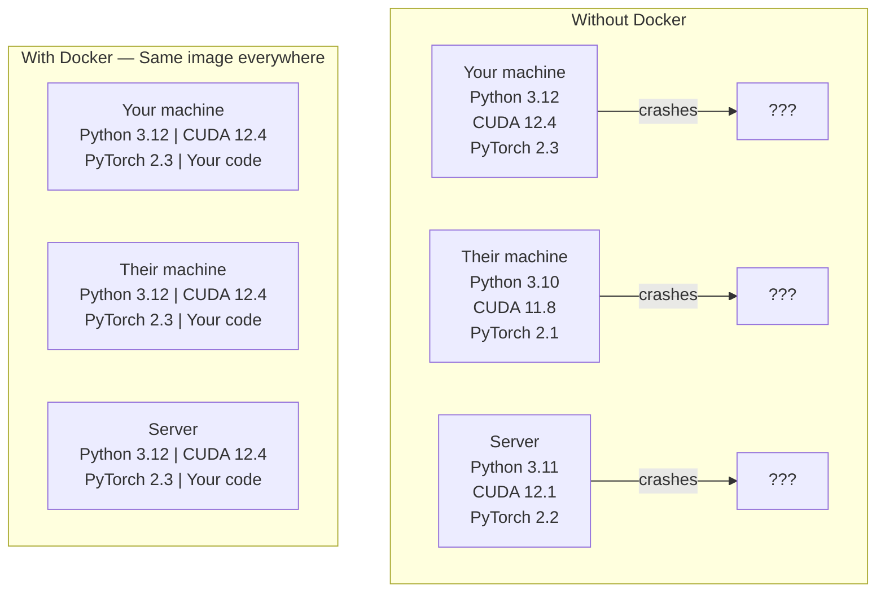

# AI를 위한 Docker (Docker for AI)

> 컨테이너(container)는 "내 컴퓨터에서는 되는데"를 과거의 일로 만든다.

**Type:** Build
**Languages:** Docker
**Prerequisites:** Phase 0, Lessons 01 and 03
**Time:** ~60분

## 학습 목표 (Learning Objectives)

- Dockerfile로부터 CUDA, PyTorch, AI 라이브러리가 포함된 GPU 지원 Docker 이미지(image) 빌드하기
- 컨테이너 재빌드 사이에 모델, 데이터셋(dataset), 코드를 유지하기 위해 호스트 디렉터리를 볼륨(volume)으로 마운트하기
- 컨테이너 안에서 GPU를 노출하도록 NVIDIA Container Toolkit 구성하기
- Docker Compose를 사용해 다중 서비스 AI 애플리케이션(추론(inference) 서버 + 벡터 데이터베이스) 오케스트레이션하기

## 문제 (The Problem)

PyTorch 2.3, CUDA 12.4, Python 3.12로 노트북에서 모델을 훈련했다고 하자. 동료는 PyTorch 2.1, CUDA 11.8, Python 3.10을 쓴다. 내 모델이 그의 머신에서 죽는다. 하지만 Dockerfile은 양쪽에서 작동한다.

AI 프로젝트는 의존성 악몽이다. 전형적인 스택에는 Python, PyTorch, CUDA 드라이버, cuDNN, 시스템 수준 C 라이브러리, 그리고 정확한 컴파일러 버전이 필요한 flash-attn 같은 특수 패키지가 들어간다. Docker는 이 모든 것을 어디서나 동일하게 실행되는 단일 이미지로 묶는다.

## 개념 (The Concept)

Docker는 코드, 런타임, 라이브러리, 시스템 도구를 컨테이너라는 격리된 단위로 감싼다. 가벼운 가상 머신이라고 생각하면 되는데, 자체 커널을 실행하는 대신 호스트 OS 커널을 공유하므로 몇 분이 아니라 몇 초 만에 시작한다는 점이 다르다.



### AI 프로젝트가 대부분의 다른 것보다 Docker를 더 필요로 하는 이유

1. **GPU 드라이버는 취약하다.** CUDA 12.4 코드는 CUDA 11.8에서 돌아가지 않는다. Docker는 NVIDIA Container Toolkit을 통해 호스트 GPU 드라이버를 공유하면서 CUDA 툴킷은 컨테이너 안에 격리한다.

2. **모델 가중치(weight)는 크다.** 7B 파라미터(parameter) 모델은 fp16으로 14GB다. 재빌드할 때마다 다시 다운로드하고 싶지는 않다. Docker 볼륨을 쓰면 호스트의 모델 디렉터리를 마운트할 수 있다.

3. **다중 서비스 아키텍처가 흔하다.** 진짜 AI 애플리케이션은 그저 Python 스크립트가 아니다. 추론 서버, RAG를 위한 벡터 데이터베이스, 어쩌면 웹 프론트엔드까지다. Docker Compose는 이 모두를 명령어 하나로 오케스트레이션한다.

### 핵심 어휘

| 용어 | 의미 |
|------|---------------|
| 이미지(Image) | 읽기 전용 템플릿. 레시피에 해당한다. Dockerfile로부터 빌드된다. |
| 컨테이너(Container) | 이미지의 실행 인스턴스. 레시피로 차린 주방에 해당한다. |
| Dockerfile | 이미지를 빌드하는 명령. 층(layer) 단위로. |
| 볼륨(Volume) | 컨테이너 재시작에도 살아남는 영구 저장소. |
| docker-compose | 다중 컨테이너 애플리케이션을 YAML로 정의하는 도구. |

### AI에서 흔한 컨테이너 패턴

```
Dev Container
  Full toolkit. Editor support. Jupyter. Debugging tools.
  Used during development and experimentation.

Training Container
  Minimal. Just the training script and dependencies.
  Runs on GPU clusters. No editor, no Jupyter.

Inference Container
  Optimized for serving. Small image. Fast cold start.
  Runs behind a load balancer in production.
```

## 직접 만들기 (Build It)

### 1단계: Docker 설치하기

```bash
# macOS
brew install --cask docker
open /Applications/Docker.app

# Ubuntu
curl -fsSL https://get.docker.com | sh
sudo usermod -aG docker $USER
# Log out and back in for group change to take effect
```

검증하기:

```bash
docker --version
docker run hello-world
```

### 2단계: NVIDIA Container Toolkit 설치하기 (NVIDIA GPU가 있는 Linux)

이것은 Docker 컨테이너가 GPU에 접근하게 해 준다. macOS와 Windows(WSL2) 사용자는 건너뛰어도 된다. Docker Desktop이 이 플랫폼들에서는 GPU 패스스루(passthrough)를 다르게 처리한다.

```bash
distribution=$(. /etc/os-release;echo $ID$VERSION_ID)
curl -fsSL https://nvidia.github.io/libnvidia-container/gpgkey | sudo gpg --dearmor -o /usr/share/keyrings/nvidia-container-toolkit-keyring.gpg
curl -s -L https://nvidia.github.io/libnvidia-container/$distribution/libnvidia-container.list | \
    sed 's#deb https://#deb [signed-by=/usr/share/keyrings/nvidia-container-toolkit-keyring.gpg] https://#g' | \
    sudo tee /etc/apt/sources.list.d/nvidia-container-toolkit.list

sudo apt-get update
sudo apt-get install -y nvidia-container-toolkit
sudo nvidia-ctk runtime configure --runtime=docker
sudo systemctl restart docker
```

컨테이너 안에서 GPU 접근을 테스트하라.

```bash
docker run --rm --gpus all nvidia/cuda:12.4.1-base-ubuntu22.04 nvidia-smi
```

GPU 정보가 보이면 툴킷이 작동하는 것이다.

### 3단계: 베이스 이미지 이해하기

올바른 베이스 이미지(base image)를 고르면 디버깅 시간을 몇 시간 아낄 수 있다.

```
nvidia/cuda:12.4.1-devel-ubuntu22.04
  Full CUDA toolkit. Compilers included.
  Use for: building packages that need nvcc (flash-attn, bitsandbytes)
  Size: ~4 GB

nvidia/cuda:12.4.1-runtime-ubuntu22.04
  CUDA runtime only. No compilers.
  Use for: running pre-built code
  Size: ~1.5 GB

pytorch/pytorch:2.3.1-cuda12.4-cudnn9-runtime
  PyTorch pre-installed on top of CUDA.
  Use for: skipping the PyTorch install step
  Size: ~6 GB

python:3.12-slim
  No CUDA. CPU only.
  Use for: inference on CPU, lightweight tools
  Size: ~150 MB
```

### 4단계: AI 개발용 Dockerfile 작성하기

`code/Dockerfile`에 있는 Dockerfile이다. 하나씩 살펴보자.

```dockerfile
FROM nvidia/cuda:12.4.1-devel-ubuntu22.04

ENV DEBIAN_FRONTEND=noninteractive
ENV PYTHONUNBUFFERED=1

RUN apt-get update && apt-get install -y --no-install-recommends \
    python3.12 \
    python3.12-venv \
    python3.12-dev \
    python3-pip \
    git \
    curl \
    build-essential \
    && rm -rf /var/lib/apt/lists/*

RUN update-alternatives --install /usr/bin/python python /usr/bin/python3.12 1

RUN python -m pip install --no-cache-dir --upgrade pip setuptools wheel

RUN python -m pip install --no-cache-dir \
    torch==2.3.1 \
    torchvision==0.18.1 \
    torchaudio==2.3.1 \
    --index-url https://download.pytorch.org/whl/cu124

RUN python -m pip install --no-cache-dir \
    numpy \
    pandas \
    scikit-learn \
    matplotlib \
    jupyter \
    transformers \
    datasets \
    accelerate \
    safetensors

WORKDIR /workspace

VOLUME ["/workspace", "/models"]

EXPOSE 8888

CMD ["python"]
```

빌드하기:

```bash
docker build -t ai-dev -f phases/00-setup-and-tooling/07-docker-for-ai/code/Dockerfile .
```

처음에는 시간이 좀 걸린다(CUDA 베이스 이미지 + PyTorch 다운로드). 이후 빌드는 캐시된 층(layer)을 사용한다.

실행하기:

```bash
docker run --rm -it --gpus all \
    -v $(pwd):/workspace \
    -v ~/models:/models \
    ai-dev python -c "import torch; print(f'PyTorch {torch.__version__}, CUDA: {torch.cuda.is_available()}')"
```

컨테이너 안에서 Jupyter 실행하기:

```bash
docker run --rm -it --gpus all \
    -v $(pwd):/workspace \
    -v ~/models:/models \
    -p 8888:8888 \
    ai-dev jupyter notebook --ip=0.0.0.0 --port=8888 --no-browser --allow-root
```

### 5단계: 데이터와 모델을 위한 볼륨 마운트

볼륨 마운트(volume mount)는 AI 작업에 결정적이다. 이것이 없으면 14GB짜리 모델 다운로드가 컨테이너가 멈출 때 사라진다.

```bash
# Mount your code
-v $(pwd):/workspace

# Mount a shared models directory
-v ~/models:/models

# Mount datasets
-v ~/datasets:/data
```

훈련 스크립트 안에서 마운트된 경로로부터 로드하라.

```python
from transformers import AutoModel

model = AutoModel.from_pretrained("/models/llama-7b")
```

모델은 호스트 파일시스템에 있다. 다시 다운로드하지 않고도 컨테이너를 원하는 만큼 재빌드할 수 있다.

### 6단계: 다중 서비스 AI 앱을 위한 Docker Compose

진짜 RAG 애플리케이션에는 추론 서버와 벡터 데이터베이스가 필요하다. Docker Compose는 둘 다 명령어 하나로 실행한다.

`code/docker-compose.yml`을 보라.

```yaml
services:
  ai-dev:
    build:
      context: .
      dockerfile: Dockerfile
    deploy:
      resources:
        reservations:
          devices:
            - driver: nvidia
              count: all
              capabilities: [gpu]
    volumes:
      - ../../../:/workspace
      - ~/models:/models
      - ~/datasets:/data
    ports:
      - "8888:8888"
    stdin_open: true
    tty: true
    command: jupyter notebook --ip=0.0.0.0 --port=8888 --no-browser --allow-root

  qdrant:
    image: qdrant/qdrant:v1.12.5
    ports:
      - "6333:6333"
      - "6334:6334"
    volumes:
      - qdrant_data:/qdrant/storage

volumes:
  qdrant_data:
```

전부 시작하기:

```bash
cd phases/00-setup-and-tooling/07-docker-for-ai/code
docker compose up -d
```

이제 AI 개발 컨테이너가 서비스 이름으로 `http://qdrant:6333`에서 벡터 데이터베이스에 닿을 수 있다. Docker Compose가 공유 네트워크를 자동으로 만든다.

AI 컨테이너 안에서 연결을 테스트하라.

```python
from qdrant_client import QdrantClient

client = QdrantClient(host="qdrant", port=6333)
print(client.get_collections())
```

전부 멈추기:

```bash
docker compose down
```

qdrant 볼륨까지 삭제하려면 `-v`를 추가하라.

```bash
docker compose down -v
```

### 7단계: AI 작업에 유용한 Docker 명령어

```bash
# List running containers
docker ps

# List all images and their sizes
docker images

# Remove unused images (reclaim disk space)
docker system prune -a

# Check GPU usage inside a running container
docker exec -it <container_id> nvidia-smi

# Copy a file from container to host
docker cp <container_id>:/workspace/results.csv ./results.csv

# View container logs
docker logs -f <container_id>
```

## 라이브러리로 써보기 (Use It)

이제 재현 가능한 AI 개발 환경을 갖췄다. 이 강의의 나머지에서:

- `docker compose up`을 사용해 개발 환경과 벡터 데이터베이스를 함께 시작하라
- 코드, 모델, 데이터를 볼륨으로 마운트해 재빌드 사이에 아무것도 잃지 않게 하라
- 레슨이 새 Python 패키지를 요구하면 Dockerfile에 추가하고 재빌드하라
- Dockerfile을 팀원과 공유하라. 그러면 모두 정확히 같은 환경을 얻는다.

### GPU가 없다고?

`--gpus all` 플래그와 NVIDIA deploy 블록을 제거하라. 컨테이너는 여전히 CPU 기반 레슨에서 작동한다. PyTorch가 CUDA의 부재를 감지하고 자동으로 CPU로 폴백(fallback)한다.

## 연습 문제 (Exercises)

1. Dockerfile을 빌드하고 컨테이너 안에서 `python -c "import torch; print(torch.__version__)"`를 실행하라
2. docker-compose 스택을 시작하고 AI 컨테이너에서 `http://qdrant:6333/collections`로 Qdrant에 접근 가능한지 검증하라
3. Dockerfile에 `flask`를 추가하고 재빌드한 뒤 포트 5000에서 간단한 API 서버를 실행하라. `-p 5000:5000`으로 포트를 매핑하라
4. `docker images`로 이미지 크기를 측정하라. 베이스 이미지를 `devel`에서 `runtime`으로 바꿔 보고 크기를 비교하라

## 핵심 용어 (Key Terms)

| 용어 | 흔히 하는 말 | 실제 의미 |
|------|----------------|----------------------|
| 컨테이너(Container) | "가벼운 VM" | 호스트 커널을 사용하면서 자체 파일시스템과 네트워크를 가진 격리된 프로세스 |
| 이미지 레이어(Image layer) | "캐시된 단계" | 각 Dockerfile 명령이 하나의 층을 만든다. 바뀌지 않은 층은 캐시되어 재빌드가 빠르다. |
| NVIDIA Container Toolkit | "Docker 안의 GPU" | `--gpus` 플래그를 통해 호스트 GPU를 컨테이너에 노출하는 런타임 훅 |
| 볼륨 마운트(Volume mount) | "공유 폴더" | 컨테이너 안에 매핑된 호스트의 디렉터리. 변경 사항이 컨테이너가 멈춘 뒤에도 유지된다. |
| 베이스 이미지(Base image) | "시작점" | Dockerfile이 그 위에 빌드하는 `FROM` 이미지. 무엇이 미리 설치되는지를 결정한다. |
