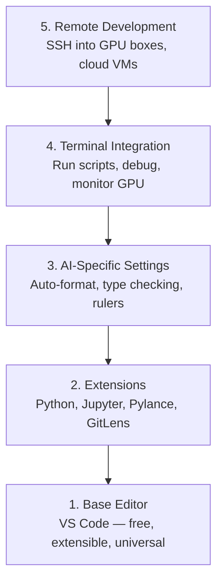

# 에디터 설정 (Editor Setup)

> 에디터는 당신의 코파일럿이다. 한 번 구성해서 거슬리지 않으면서 제 몫을 하게 만들어라.

**Type:** Build
**Languages:** --
**Prerequisites:** Phase 0, Lesson 01
**Time:** ~20분

## 학습 목표 (Learning Objectives)

- Python, Jupyter, 린팅(linting), 원격 SSH를 위한 핵심 확장(extension)이 포함된 VS Code 설치하기
- AI 워크플로를 위해 저장 시 포맷팅(format-on-save), 타입 검사(type checking), 노트북 출력 스크롤 구성하기
- 원격 GPU 머신의 코드를 마치 로컬인 것처럼 편집하고 디버깅하도록 Remote SSH 설정하기
- 에디터 대안(Cursor, Windsurf, Neovim)과 AI 작업에서의 트레이드오프(trade-off) 평가하기

## 문제 (The Problem)

당신은 에디터 안에서 Python을 작성하고, 노트북을 실행하고, 훈련 루프(training loop)를 디버깅하고, GPU 박스에 SSH로 접속하며 수천 시간을 보내게 된다. 잘못 구성된 에디터는 모든 세션을 마찰로 바꾼다. 자동 완성도, 타입 힌트(type hint)도, 인라인 오류도 없고, 수동 포맷팅에 어설픈 터미널 워크플로뿐이다.

올바른 설정에는 20분이 걸린다. 그걸 건너뛰면 매일 20분이 든다.

## 개념 (The Concept)

AI 엔지니어링 에디터 설정에는 다섯 가지가 필요하다.



## 직접 만들기 (Build It)

### 1단계: VS Code 설치하기

VS Code가 권장 에디터다. 무료이고, 모든 OS에서 돌아가며, 일급 Jupyter 노트북 지원을 갖췄고, 확장 생태계가 AI 작업에 필요한 모든 것을 포괄한다.

[code.visualstudio.com](https://code.visualstudio.com/)에서 다운로드하라.

터미널에서 검증하라.

```bash
code --version
```

macOS에서 `code`를 찾을 수 없으면, VS Code를 열고 `Cmd+Shift+P`를 눌러 "Shell Command"를 입력한 뒤 "Install 'code' command in PATH"를 선택하라.

### 2단계: 핵심 확장 설치하기

VS Code의 통합 터미널을 열고(`Ctrl+`` ` 또는 `` Cmd+` ``) AI 작업에 중요한 확장을 설치하라.

```bash
code --install-extension ms-python.python
code --install-extension ms-python.vscode-pylance
code --install-extension ms-toolsai.jupyter
code --install-extension eamodio.gitlens
code --install-extension ms-vscode-remote.remote-ssh
code --install-extension ms-python.debugpy
code --install-extension ms-python.black-formatter
code --install-extension charliermarsh.ruff
```

각각이 하는 일:

| 확장 | 이유 |
|-----------|-----|
| Python | 언어 지원, 가상 환경 감지, 실행/디버그 |
| Pylance | 빠른 타입 검사, 자동 완성, 임포트 해결 |
| Jupyter | VS Code 안에서 노트북 실행, 변수 탐색기 |
| GitLens | 누가 무엇을 바꿨는지 확인, 인라인 git blame |
| Remote SSH | 원격 GPU 박스의 폴더를 마치 로컬인 것처럼 열기 |
| Debugpy | Python의 단계별(step-through) 디버깅 |
| Black Formatter | 저장 시 자동 포맷팅, 일관된 스타일 |
| Ruff | 빠른 린팅, 흔한 실수 잡기 |

이 레슨의 `code/.vscode/extensions.json` 파일에 전체 권장 목록이 들어 있다. 프로젝트 폴더를 열면 VS Code가 설치하라고 안내한다.

### 3단계: 설정 구성하기

이 레슨의 `code/.vscode/settings.json`에서 설정을 복사하거나, `Settings > Open Settings (JSON)`을 통해 수동으로 적용하라.

AI 작업을 위한 핵심 설정:

```jsonc
{
    "python.analysis.typeCheckingMode": "basic",
    "editor.formatOnSave": true,
    "editor.rulers": [88, 120],
    "notebook.output.scrolling": true,
    "files.autoSave": "afterDelay"
}
```

이것들이 중요한 이유:

- **타입 검사를 basic으로**: 실행 전에 잘못된 인자 타입을 잡는다. 텐서(tensor) 형태 불일치와 잘못된 API 파라미터로 인한 디버깅 시간을 아낀다.
- **저장 시 포맷팅**: 다시는 포맷팅을 신경 쓰지 않아도 된다. Black이 처리한다.
- **88과 120 위치의 ruler**: Black은 88에서 줄을 바꾼다. 120 표시는 독스트링과 주석이 너무 길어질 때를 보여 준다.
- **노트북 출력 스크롤**: 훈련 루프는 수천 줄을 출력한다. 스크롤이 없으면 출력 패널이 폭발한다.
- **자동 저장**: 당신은 저장을 잊어버릴 것이다. 훈련 스크립트가 오래된 코드를 실행하게 된다. 자동 저장이 이를 막는다.

### 4단계: 터미널 통합

VS Code의 통합 터미널은 훈련 스크립트를 실행하고, GPU를 모니터링하고, 환경을 관리하는 곳이다.

제대로 설정하라.

```jsonc
{
    "terminal.integrated.defaultProfile.osx": "zsh",
    "terminal.integrated.defaultProfile.linux": "bash",
    "terminal.integrated.fontSize": 13,
    "terminal.integrated.scrollback": 10000
}
```

유용한 단축키:

| 동작 | macOS | Linux/Windows |
|--------|-------|---------------|
| 터미널 토글 | `` Ctrl+` `` | `` Ctrl+` `` |
| 새 터미널 | `Ctrl+Shift+`` ` | `Ctrl+Shift+`` ` |
| 터미널 분할 | `Cmd+\` | `Ctrl+\` |

분할 터미널이 유용하다. 하나는 스크립트 실행용, 다른 하나는 `nvidia-smi -l 1`이나 `watch -n 1 nvidia-smi`로 GPU 모니터링용이다.

### 5단계: 원격 개발 (GPU 박스에 SSH 접속)

이것이 AI 작업에서 가장 중요한 확장이다. 당신은 원격 머신(클라우드 VM, 연구실 서버, Lambda, Vast.ai)에서 훈련을 실행하게 된다. Remote SSH는 원격 파일시스템을 열고, 파일을 편집하고, 터미널을 실행하고, 마치 모든 것이 로컬인 것처럼 디버깅하게 해 준다.

설정:

1. Remote SSH 확장을 설치한다(2단계에서 완료).
2. `Ctrl+Shift+P`(또는 `Cmd+Shift+P`)를 눌러 "Remote-SSH: Connect to Host"를 입력한다.
3. `user@your-gpu-box-ip`를 입력한다.
4. VS Code가 원격 머신에 서버 컴포넌트를 자동으로 설치한다.

비밀번호 없는 접근을 위해 SSH 키를 설정하라.

```bash
ssh-keygen -t ed25519 -C "your-email@example.com"
ssh-copy-id user@your-gpu-box-ip
```

편의를 위해 호스트를 `~/.ssh/config`에 추가하라.

```
Host gpu-box
    HostName 203.0.113.50
    User ubuntu
    IdentityFile ~/.ssh/id_ed25519
    ForwardAgent yes
```

이제 `Remote-SSH: Connect to Host > gpu-box`로 즉시 연결된다.

## 대안 (Alternatives)

### Cursor

[cursor.com](https://cursor.com)은 AI 코드 생성이 내장된 VS Code 포크(fork)다. 같은 확장 생태계와 설정 형식을 사용한다. Cursor를 쓴다면 이 레슨의 모든 내용이 그대로 적용된다. 같은 `settings.json`과 `extensions.json`을 가져오면 된다.

### Windsurf

[windsurf.com](https://windsurf.com)은 또 다른 AI 우선 VS Code 포크다. 같은 이야기다. 같은 확장, 같은 설정 형식, 같은 Remote SSH 지원.

### Vim/Neovim

이미 Vim이나 Neovim을 쓰고 생산적이라면 그대로 머물러라. AI Python 작업을 위한 최소 설정:

- 타입 검사를 위한 **pyright** 또는 **pylsp**(Mason 또는 수동 설치)
- 언어 서버 통합을 위한 **nvim-lspconfig**
- 노트북 같은 실행을 위한 **jupyter-vim** 또는 **molten-nvim**
- 파일/심볼 검색을 위한 **telescope.nvim**
- 포맷팅/린팅을 위해 black과 ruff가 포함된 **none-ls.nvim**

아직 Vim을 쓰지 않는다면 지금 시작하지 마라. 학습 곡선이 AI 엔지니어링 학습과 경쟁하게 된다. VS Code를 쓰라.

## 라이브러리로 써보기 (Use It)

이 설정으로 당신의 일상 워크플로는 이렇게 된다.

1. VS Code에서 프로젝트 폴더를 연다(또는 Remote SSH로 GPU 박스에 연결한다).
2. 자동 완성, 타입 힌트, 인라인 오류와 함께 에디터에서 Python을 작성한다.
3. Jupyter 확장으로 Jupyter 노트북을 인라인으로 실행한다.
4. 훈련 스크립트, `uv pip install`, GPU 모니터링에 통합 터미널을 사용한다.
5. 커밋하기 전에 GitLens로 변경 사항을 검토한다.

## 연습 문제 (Exercises)

1. VS Code와 2단계에 나열된 모든 확장을 설치하라
2. 이 레슨의 `settings.json`을 당신의 VS Code 구성에 복사하라
3. Python 파일을 열어 Pylance가 타입 힌트를 보여 주고 Black이 저장 시 포맷팅하는지 검증하라
4. 원격 머신에 접근할 수 있다면 Remote SSH를 설정하고 그 위의 폴더를 열어라

## 핵심 용어 (Key Terms)

| 용어 | 흔히 하는 말 | 실제 의미 |
|------|----------------|----------------------|
| LSP | "자동 완성 엔진" | Language Server Protocol. 에디터가 언어별 서버로부터 타입 정보, 완성, 진단을 받기 위한 표준 |
| Pylance | "Python 플러그인" | 타입 검사와 IntelliSense를 위해 Pyright를 사용하는 Microsoft의 Python 언어 서버 |
| Remote SSH | "서버에서 작업하기" | 원격 머신에서 경량 서버를 실행하고 UI를 로컬 에디터로 스트리밍하는 VS Code 확장 |
| 저장 시 포맷팅(Format on save) | "자동 prettier" | 저장할 때마다 에디터가 포맷터(Black, Ruff)를 실행해 코드 스타일이 항상 일관되게 유지된다 |
