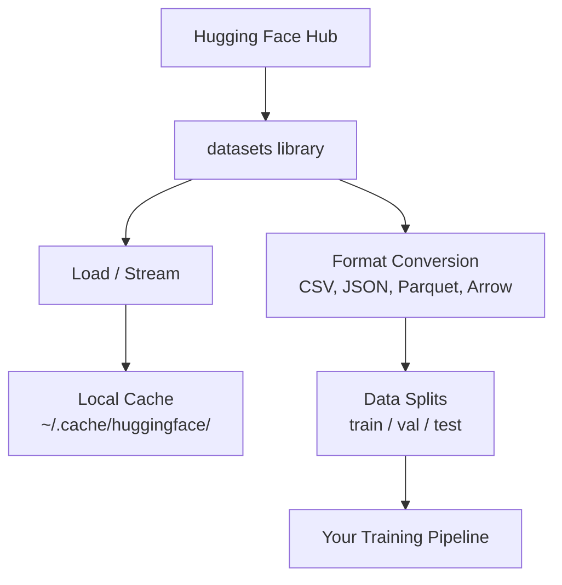

# 데이터 관리 (Data Management)

> 데이터는 연료다. 데이터를 어떻게 관리하느냐가 얼마나 빨리 나아가는지를 결정한다.

**Type:** Build
**Language:** Python
**Prerequisites:** Phase 0, Lesson 01
**Time:** ~45분

## 학습 목표 (Learning Objectives)

- Hugging Face `datasets` 라이브러리를 사용해 데이터셋(dataset)을 로드하고, 스트리밍하고, 캐시(cache)하기
- CSV, JSON, Parquet, Arrow 형식 간에 변환하고 그 트레이드오프(trade-off) 설명하기
- 고정된 난수 시드(seed)로 재현 가능한 학습/검증/테스트 분할 만들기
- `.gitignore`, Git LFS, 또는 DVC를 사용해 대용량 모델 및 데이터셋 파일 관리하기

## 문제 (The Problem)

모든 AI 프로젝트는 데이터에서 시작한다. 데이터셋을 찾고, 다운로드하고, 형식 간에 변환하고, 학습(training)과 평가를 위해 분할하고, 실험이 재현 가능하도록 버전 관리해야 한다. 매번 이걸 수동으로 하면 느리고 오류가 나기 쉽다. 그래서 반복 가능한 워크플로가 필요하다.

## 개념 (The Concept)



Hugging Face `datasets` 라이브러리는 AI 작업을 위해 데이터를 로드하는 표준 방식이다. 다운로드, 캐싱, 형식 변환, 스트리밍을 별도 설정 없이 처리한다.

## 직접 만들기 (Build It)

### 1단계: datasets 라이브러리 설치하기

```bash
pip install datasets huggingface_hub
```

### 2단계: 데이터셋 로드하기

```python
from datasets import load_dataset

dataset = load_dataset("imdb")
print(dataset)
print(dataset["train"][0])
```

이 코드는 IMDB 영화 리뷰 데이터셋을 다운로드한다. 첫 다운로드 이후에는 `~/.cache/huggingface/datasets/`의 캐시에서 로드한다.

### 3단계: 대용량 데이터셋 스트리밍하기

일부 데이터셋은 너무 커서 디스크에 들어가지 않는다. 스트리밍은 전체를 다운로드하지 않고 행(row) 단위로 로드한다.

```python
dataset = load_dataset("wikimedia/wikipedia", "20220301.en", split="train", streaming=True)

for i, example in enumerate(dataset):
    print(example["title"])
    if i >= 4:
        break
```

스트리밍은 `IterableDataset`을 준다. 행이 도착하는 대로 처리하므로, 데이터셋 크기와 무관하게 메모리 사용량이 일정하게 유지된다.

### 4단계: 데이터셋 형식

`datasets` 라이브러리는 내부적으로 Apache Arrow를 사용한다. 파이프라인이 필요로 하는 것에 따라 다른 형식으로 변환할 수 있다.

```python
dataset = load_dataset("imdb", split="train")

dataset.to_csv("imdb_train.csv")
dataset.to_json("imdb_train.json")
dataset.to_parquet("imdb_train.parquet")
```

형식 비교:

| 형식 | 크기 | 읽기 속도 | 적합한 용도 |
|--------|------|-----------|----------|
| CSV | 큼 | 느림 | 사람이 읽기, 스프레드시트 |
| JSON | 큼 | 느림 | API, 중첩 데이터 |
| Parquet | 작음 | 빠름 | 분석, 컬럼 기반 쿼리 |
| Arrow | 작음 | 가장 빠름 | 인메모리 처리(`datasets`가 내부적으로 사용하는 것) |

AI 작업에서는 Parquet이 최고의 저장 형식이다. Arrow는 메모리에서 다루는 형식이고, CSV와 JSON은 교환용이다.

### 5단계: 데이터 분할

모든 ML 프로젝트에는 세 가지 분할이 필요하다.

- **Train(학습)**: 모델이 여기서 배운다(보통 80%)
- **Validation(검증)**: 학습 중 진행 상황을 점검한다(보통 10%)
- **Test(테스트)**: 학습이 끝난 뒤 최종 평가(보통 10%)

일부 데이터셋은 미리 분할되어 온다. 그렇지 않을 때는 직접 분할하라.

```python
dataset = load_dataset("imdb", split="train")

split = dataset.train_test_split(test_size=0.2, seed=42)
train_val = split["train"].train_test_split(test_size=0.125, seed=42)

train_ds = train_val["train"]
val_ds = train_val["test"]
test_ds = split["test"]

print(f"Train: {len(train_ds)}, Val: {len(val_ds)}, Test: {len(test_ds)}")
```

재현성을 위해 항상 시드를 설정하라. 같은 시드는 매번 같은 분할을 만든다.

### 6단계: 모델 다운로드 및 캐시

모델은 대용량 파일이다. `huggingface_hub` 라이브러리가 다운로드와 캐싱을 처리한다.

```python
from huggingface_hub import hf_hub_download, snapshot_download

model_path = hf_hub_download(
    repo_id="sentence-transformers/all-MiniLM-L6-v2",
    filename="config.json"
)
print(f"Cached at: {model_path}")

model_dir = snapshot_download("sentence-transformers/all-MiniLM-L6-v2")
print(f"Full model at: {model_dir}")
```

모델은 `~/.cache/huggingface/hub/`에 캐시된다. 한 번 다운로드하면 이후 실행에서 즉시 로드된다.

### 7단계: 대용량 파일 다루기

모델 가중치(weight)와 대용량 데이터셋은 git에 들어가면 안 된다. 세 가지 선택지가 있다.

**옵션 A: .gitignore (가장 단순)**

```
*.bin
*.safetensors
*.pt
*.onnx
data/*.parquet
data/*.csv
models/
```

**옵션 B: Git LFS (git에서 대용량 파일 추적)**

```bash
git lfs install
git lfs track "*.bin"
git lfs track "*.safetensors"
git add .gitattributes
```

Git LFS는 저장소에 포인터를 저장하고 실제 파일은 별도의 서버에 저장한다. GitHub은 1GB를 무료로 제공한다.

**옵션 C: DVC (data version control)**

```bash
pip install dvc
dvc init
dvc add data/training_set.parquet
git add data/training_set.parquet.dvc data/.gitignore
git commit -m "Track training data with DVC"
```

DVC는 데이터를 가리키는 작은 `.dvc` 파일을 만든다. 데이터 자체는 S3, GCS, 또는 다른 원격 저장소 백엔드에 있다.

| 접근법 | 복잡도 | 적합한 용도 |
|----------|-----------|----------|
| .gitignore | 낮음 | 개인 프로젝트, 다시 받을 수 있는 다운로드 데이터 |
| Git LFS | 중간 | git을 통해 모델 가중치를 공유하는 팀 |
| DVC | 높음 | 재현 가능한 실험, 대용량 데이터셋, 팀 |

이 강의에서는 `.gitignore`로 충분하다. 머신 간에 정확한 실험을 재현해야 할 때 DVC를 사용하라.

### 8단계: 저장 패턴

**로컬 저장소**는 약 10GB 미만의 데이터셋에 적합하다. HF 캐시가 이를 자동으로 처리한다.

**클라우드 저장소**는 그보다 크거나 머신 간에 공유하는 모든 것에 쓴다.

```python
import os

local_path = os.path.expanduser("~/.cache/huggingface/datasets/")

# s3_path = "s3://my-bucket/datasets/"
# gcs_path = "gs://my-bucket/datasets/"
```

DVC는 S3와 GCS와 직접 통합된다.

```bash
dvc remote add -d myremote s3://my-bucket/dvc-store
dvc push
```

이 강의에서는 로컬 저장소로 충분하다. 원격 GPU 인스턴스에서 파인튜닝(fine-tuning)할 때 비로소 클라우드 저장소가 필요해진다.

## 이 강의에서 사용하는 데이터셋 (Datasets Used in This Course)

| 데이터셋 | 레슨 | 크기 | 가르치는 것 |
|---------|---------|------|----------------|
| IMDB | 토큰화, 분류 | 84 MB | 텍스트 분류 기초 |
| WikiText | 언어 모델링 | 181 MB | 다음 토큰 예측 |
| SQuAD | QA 시스템 | 35 MB | 질의응답, 스팬(span) |
| Common Crawl (부분집합) | 임베딩 | 가변 | 대규모 텍스트 처리 |
| MNIST | 비전 기초 | 21 MB | 이미지 분류 기초 |
| COCO (부분집합) | 멀티모달 | 가변 | 이미지-텍스트 쌍 |

지금 이것들을 전부 다운로드할 필요는 없다. 각 레슨이 필요한 것을 명시한다.

## 라이브러리로 써보기 (Use It)

유틸리티 스크립트를 실행해 모든 것이 작동하는지 검증하라.

```bash
python code/data_utils.py
```

이 스크립트는 작은 데이터셋을 다운로드하고, 변환하고, 분할한 뒤 요약을 출력한다.

## 산출물 (Ship It)

이 레슨은 다음을 만들어 낸다.
- `code/data_utils.py` - 재사용 가능한 데이터 로딩 및 캐싱 유틸리티
- `outputs/prompt-data-helper.md` - 어떤 작업에 맞는 데이터셋을 찾기 위한 프롬프트(prompt)

## 연습 문제 (Exercises)

1. `mrpc` 구성으로 `glue` 데이터셋을 로드하고 처음 5개 예시를 살펴보라
2. `c4` 데이터셋을 스트리밍하고 10초 동안 몇 개의 예시를 처리할 수 있는지 세어 보라
3. 데이터셋을 Parquet으로 변환하고 파일 크기를 CSV와 비교하라
4. 고정된 시드로 70/15/15 학습/검증/테스트 분할을 만들고 크기를 검증하라

## 핵심 용어 (Key Terms)

| 용어 | 흔히 하는 말 | 실제 의미 |
|------|----------------|----------------------|
| 데이터셋 분할(Dataset split) | "학습 데이터" | ML 생애주기의 서로 다른 단계에서 사용되는 이름 붙은 부분집합(train/val/test) |
| 스트리밍(Streaming) | "지연 로딩" | 전체 데이터셋을 다운로드하지 않고 원격 소스에서 행 단위로 데이터를 처리하는 것 |
| Parquet | "압축된 CSV" | 분석 쿼리와 저장 효율성에 최적화된 컬럼 기반 파일 형식 |
| Arrow | "빠른 데이터프레임" | datasets 라이브러리가 내부적으로 무복사(zero-copy) 읽기에 사용하는 인메모리 컬럼 기반 형식 |
| Git LFS | "큰 파일용 Git" | 버전 관리에 포인터를 유지하면서 대용량 파일을 git 저장소 밖에 저장하는 확장 |
| DVC | "데이터용 Git" | 클라우드 저장소와 통합되는, 데이터셋과 모델을 위한 버전 관리 시스템 |
| 캐시(Cache) | "이미 다운로드됨" | 이전에 가져온 데이터의 로컬 복사본. 기본적으로 ~/.cache/huggingface/에 저장된다 |
