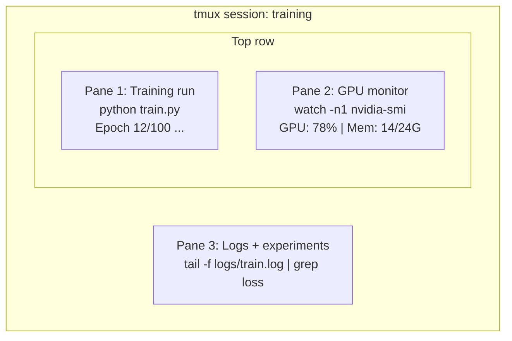

# 터미널과 셸 (Terminal & Shell)

> 터미널은 AI 엔지니어가 사는 곳이다. 여기서 편안해져라.

**Type:** Learn
**Languages:** --
**Prerequisites:** Phase 0, Lesson 01
**Time:** ~35분

## 학습 목표 (Learning Objectives)

- 파이핑(piping), 리다이렉트(redirect), `grep`을 사용해 명령줄에서 훈련 로그를 필터링하고 처리하기
- 동시 훈련과 GPU 모니터링을 위해 여러 페인(pane)을 가진 지속적인 tmux 세션 만들기
- `htop`, `nvtop`, `nvidia-smi`로 시스템 및 GPU 자원 모니터링하기
- SSH, `scp`, `rsync`를 사용해 로컬과 원격 머신 간에 파일 전송하기

## 문제 (The Problem)

어떤 에디터보다 터미널에서 보내는 시간이 더 많다. 훈련 실행, GPU 모니터링, 로그 추적, 원격 SSH 세션, 환경 관리. 모든 AI 워크플로가 셸을 거친다. 여기서 느리면 어디서나 느리다.

이 레슨은 AI 작업에 중요한 터미널 기술을 다룬다. Unix의 역사도, Bash 스크립팅 심화도 없다. 필요한 것만 다룬다.

## 개념 (The Concept)



세 가지가 동시에 돌아간다. 터미널 하나로. 분리(detach)했다가 집에 가고, 다시 SSH로 접속해 붙일(reattach) 수 있다. 훈련은 계속 돌아간다.

## 직접 만들기 (Build It)

### 1단계: 자신의 셸 알기

어떤 셸을 쓰고 있는지 확인하라.

```bash
echo $SHELL
```

대부분의 시스템은 `bash`나 `zsh`를 쓴다. 둘 다 문제없이 작동한다. 이 강의의 명령어는 어느 쪽에서든 작동한다.

알아야 할 핵심:

```bash
# Move around
cd ~/projects/ai-engineering-from-scratch
pwd
ls -la

# History search (most useful shortcut you'll learn)
# Ctrl+R then type part of a previous command
# Press Ctrl+R again to cycle through matches

# Clear terminal
clear   # or Ctrl+L

# Cancel a running command
# Ctrl+C

# Suspend a running command (resume with fg)
# Ctrl+Z
```

### 2단계: 파이핑과 리다이렉트

파이핑은 명령어들을 서로 연결한다. 로그를 처리하고 출력을 필터링하며 도구를 연쇄하는 방식이 이것이다. 끊임없이 사용하게 된다.

```bash
# Count how many times "loss" appears in a log
cat train.log | grep "loss" | wc -l

# Extract just the loss values from training output
grep "loss:" train.log | awk '{print $NF}' > losses.txt

# Watch a log file update in real time, filtering for errors
tail -f train.log | grep --line-buffered "ERROR"

# Sort experiments by final accuracy
grep "final_accuracy" results/*.log | sort -t= -k2 -n -r

# Redirect stdout and stderr to separate files
python train.py > output.log 2> errors.log

# Redirect both to the same file
python train.py > train_full.log 2>&1
```

필요한 세 가지 리다이렉트:

| 기호 | 하는 일 |
|--------|-------------|
| `>` | stdout을 파일에 쓰기(덮어쓰기) |
| `>>` | stdout을 파일에 추가하기 |
| `2>` | stderr을 파일에 쓰기 |
| `2>&1` | stderr을 stdout과 같은 곳으로 보내기 |
| `\|` | 한 명령의 stdout을 다음 명령의 stdin으로 보내기 |

### 3단계: 백그라운드 프로세스

훈련 실행은 몇 시간씩 걸린다. 그 내내 터미널을 열어 두고 싶지는 않을 것이다.

```bash
# Run in background (output still goes to terminal)
python train.py &

# Run in background, immune to hangup (closing terminal won't kill it)
nohup python train.py > train.log 2>&1 &

# Check what's running in background
jobs
ps aux | grep train.py

# Bring a background job to foreground
fg %1

# Kill a background process
kill %1
# or find its PID and kill that
kill $(pgrep -f "train.py")
```

`&`, `nohup`, `screen`/`tmux`의 차이:

| 방법 | 터미널을 닫아도 유지되는가? | 재연결 가능한가? |
|--------|-------------------------|---------------|
| `command &` | 아니오 | 아니오 |
| `nohup command &` | 예 | 아니오 (로그 파일 확인) |
| `screen` / `tmux` | 예 | 예 |

몇 분보다 긴 것이라면 tmux를 사용하라.

### 4단계: tmux

tmux는 여러 페인을 가진 지속적인 터미널 세션을 만들게 해 준다. 훈련 실행을 관리하는 데 가장 유용한 단일 도구다.

```bash
# Install
# macOS
brew install tmux
# Ubuntu
sudo apt install tmux

# Start a named session
tmux new -s training

# Split horizontally
# Ctrl+B then "

# Split vertically
# Ctrl+B then %

# Navigate between panes
# Ctrl+B then arrow keys

# Detach (session keeps running)
# Ctrl+B then d

# Reattach
tmux attach -t training

# List sessions
tmux ls

# Kill a session
tmux kill-session -t training
```

전형적인 AI 워크플로 세션:

```bash
tmux new -s train

# Pane 1: start training
python train.py --epochs 100 --lr 1e-4

# Ctrl+B, " to split, then run GPU monitor
watch -n1 nvidia-smi

# Ctrl+B, % to split vertically, tail the logs
tail -f logs/experiment.log

# Now detach with Ctrl+B, d
# SSH out, go get coffee, come back
# tmux attach -t train
```

### 5단계: htop과 nvtop으로 모니터링하기

```bash
# System processes (better than top)
htop

# GPU processes (if you have NVIDIA GPU)
# Install: sudo apt install nvtop (Ubuntu) or brew install nvtop (macOS)
nvtop

# Quick GPU check without nvtop
nvidia-smi

# Watch GPU usage update every second
watch -n1 nvidia-smi

# See which processes are using the GPU
nvidia-smi --query-compute-apps=pid,name,used_memory --format=csv
```

자주 쓰게 될 `htop` 키 바인딩:
- 열로 정렬하려면 `F6` 또는 `>`(메모리로 정렬해 메모리 누수 찾기)
- 트리 뷰를 토글하려면 `F5`(자식 프로세스 보기)
- 프로세스를 종료하려면 `F9`
- 프로세스 이름을 검색하려면 `/`

### 6단계: 원격 GPU 박스를 위한 SSH

클라우드 GPU(Lambda, RunPod, Vast.ai)를 빌리면 SSH로 연결한다.

```bash
# Basic connection
ssh user@gpu-box-ip

# With a specific key
ssh -i ~/.ssh/my_gpu_key user@gpu-box-ip

# Copy files to remote
scp model.pt user@gpu-box-ip:~/models/

# Copy files from remote
scp user@gpu-box-ip:~/results/metrics.json ./

# Sync a whole directory (faster for many files)
rsync -avz ./data/ user@gpu-box-ip:~/data/

# Port forward (access remote Jupyter/TensorBoard locally)
ssh -L 8888:localhost:8888 user@gpu-box-ip
# Now open localhost:8888 in your browser

# SSH config for convenience
# Add to ~/.ssh/config:
# Host gpu
#     HostName 192.168.1.100
#     User ubuntu
#     IdentityFile ~/.ssh/gpu_key
#
# Then just:
# ssh gpu
```

### 7단계: AI 작업에 유용한 별칭(alias)

이것들을 `~/.bashrc`나 `~/.zshrc`에 추가하라.

```bash
source phases/00-setup-and-tooling/10-terminal-and-shell/code/shell_aliases.sh
```

또는 원하는 것만 복사하라. 핵심 별칭:

```bash
# GPU status at a glance
alias gpu='nvidia-smi --query-gpu=index,name,utilization.gpu,memory.used,memory.total,temperature.gpu --format=csv,noheader'

# Kill all Python training processes
alias killtraining='pkill -f "python.*train"'

# Quick virtual environment activate
alias ae='source .venv/bin/activate'

# Watch training loss
alias watchloss='tail -f logs/*.log | grep --line-buffered "loss"'
```

전체 세트는 `code/shell_aliases.sh`를 보라.

### 8단계: 흔한 AI 터미널 패턴

이것들은 실무에서 반복적으로 등장한다.

```bash
# Run training, log everything, notify when done
python train.py 2>&1 | tee train.log; echo "DONE" | mail -s "Training complete" you@email.com

# Compare two experiment logs side by side
diff <(grep "accuracy" exp1.log) <(grep "accuracy" exp2.log)

# Find the largest model files (clean up disk space)
find . -name "*.pt" -o -name "*.safetensors" | xargs du -h | sort -rh | head -20

# Download a model from Hugging Face
wget https://huggingface.co/model/resolve/main/model.safetensors

# Untar a dataset
tar xzf dataset.tar.gz -C ./data/

# Count lines in all Python files (see how big your project is)
find . -name "*.py" | xargs wc -l | tail -1

# Check disk space (training data fills disks fast)
df -h
du -sh ./data/*

# Environment variable check before training
env | grep -i cuda
env | grep -i torch
```

## 라이브러리로 써보기 (Use It)

이 강의 동안 각 도구가 언제 등장하는지 정리하면 다음과 같다.

| 도구 | 언제 쓰는가 |
|------|----------------|
| tmux | 모든 훈련 실행(Phases 3+) |
| `tail -f` + `grep` | 훈련 로그 모니터링 |
| `nohup` / `&` | 빠른 백그라운드 작업 |
| `htop` / `nvtop` | 느린 훈련, OOM 오류 디버깅 |
| SSH + `rsync` | 클라우드 GPU에서 작업 |
| 파이핑 + 리다이렉트 | 실험 결과 처리 |
| 별칭(alias) | 반복 명령어에서 시간 절약 |

## 연습 문제 (Exercises)

1. tmux를 설치하고, 세 개의 페인을 가진 세션을 만들어, 하나에서는 `htop`을, 다른 하나에서는 `watch -n1 date`를, 세 번째에서는 Python 스크립트를 실행하라. 분리했다가 다시 붙여라.
2. `code/shell_aliases.sh`의 별칭을 셸 구성에 추가하고 `source ~/.zshrc`(또는 `~/.bashrc`)로 다시 로드하라.
3. `for i in $(seq 1 100); do echo "epoch $i loss: $(echo "scale=4; 1/$i" | bc)"; sleep 0.1; done > fake_train.log`로 가짜 훈련 로그를 만든 뒤 `grep`, `tail`, `awk`를 사용해 손실(loss) 값만 추출하라.
4. 접근 권한이 있는 서버에 대한 SSH config 항목을 설정하라(또는 문법을 연습하려면 `localhost`를 사용하라).

## 핵심 용어 (Key Terms)

| 용어 | 흔히 하는 말 | 실제 의미 |
|------|----------------|----------------------|
| 셸(Shell) | "터미널" | 사용자의 명령을 해석하는 프로그램(bash, zsh, fish) |
| tmux | "터미널 멀티플렉서" | 한 창 안에서 여러 터미널 세션을 실행하고 분리/재연결하게 해 주는 프로그램 |
| 파이프(Pipe) | "막대 기호" | 한 명령의 출력을 다른 명령의 입력으로 보내는 `\|` 연산자 |
| PID | "프로세스 ID" | 모든 실행 중인 프로세스에 부여되는 고유 번호. 모니터링하거나 종료하는 데 사용된다 |
| nohup | "no hangup" | hangup 신호에 영향받지 않게 명령을 실행해, 터미널을 닫아도 종료되지 않게 한다 |
| SSH | "서버에 접속하기" | Secure Shell. 원격 머신에서 명령을 실행하기 위한 암호화 프로토콜 |
