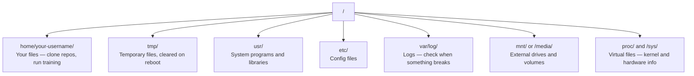

# AI를 위한 Linux (Linux for AI)

> 대부분의 AI는 Linux에서 돌아간다. 막히지 않을 만큼은 알아야 한다.

**Type:** Learn
**Languages:** --
**Prerequisites:** Phase 0, Lesson 01
**Time:** ~30분

## 학습 목표 (Learning Objectives)

- Linux 파일 시스템을 탐색하고 명령줄에서 필수 파일 작업 수행하기
- "Permission denied" 오류를 해결하기 위해 `chmod`와 `chown`으로 파일 권한 관리하기
- `apt`로 시스템 패키지를 설치하고 AI 작업을 위해 새 GPU 박스 세팅하기
- 원격 머신에서 작업하는 개발자가 흔히 걸려 넘어지는 macOS-to-Linux 차이점 식별하기

## 문제 (The Problem)

당신은 macOS나 Windows에서 개발한다. 하지만 클라우드 GPU 박스에 SSH로 접속하거나, Lambda 인스턴스를 빌리거나, EC2 머신을 띄우는 순간 Ubuntu에 떨어진다. 터미널이 유일한 인터페이스다. Finder도, Explorer도, GUI도 없다. 파일 시스템을 탐색하고, 패키지를 설치하고, 명령줄에서 프로세스를 관리하지 못하면, "Linux에서 파일 압축 푸는 법"을 검색하는 동안 놀고 있는 GPU 시간에 돈을 내며 발이 묶이게 된다.

이것은 생존 가이드다. AI 작업을 위해 원격 Linux 머신에서 작동하는 데 정확히 필요한 것만 다룬다. 그 이상은 없다.

## 파일 시스템 레이아웃 (File System Layout)

Linux는 모든 것을 단일 루트 `/` 아래에 조직한다. `C:\`도 `/Volumes`도 없다. 당신이 실제로 다룰 디렉터리는 다음과 같다.



당신의 홈 디렉터리는 `~` 또는 `/home/your-username`이다. 당신이 하는 거의 모든 일이 여기서 일어난다.

## 필수 명령어 (Essential Commands)

이것이 원격 GPU 박스에서 할 일의 95%를 커버하는 15개 명령어다.

### 이동하기

```bash
pwd                         # Where am I?
ls                          # What's here?
ls -la                      # What's here, including hidden files with details?
cd /path/to/dir             # Go there
cd ~                        # Go home
cd ..                       # Go up one level
```

### 파일과 디렉터리

```bash
mkdir my-project            # Create a directory
mkdir -p a/b/c              # Create nested directories in one shot

cp file.txt backup.txt      # Copy a file
cp -r src/ src-backup/      # Copy a directory (recursive)

mv old.txt new.txt          # Rename a file
mv file.txt /tmp/           # Move a file

rm file.txt                 # Delete a file (no trash, it's gone)
rm -rf my-dir/              # Delete a directory and everything inside
```

`rm -rf`는 영구적이다. 되돌리기가 없다. Enter를 누르기 전에 경로를 두 번 확인하라.

### 파일 읽기

```bash
cat file.txt                # Print entire file
head -20 file.txt           # First 20 lines
tail -20 file.txt           # Last 20 lines
tail -f log.txt             # Follow a log file in real time (Ctrl+C to stop)
less file.txt               # Scroll through a file (q to quit)
```

### 검색하기

```bash
grep "error" training.log           # Find lines containing "error"
grep -r "learning_rate" .           # Search all files in current directory
grep -i "cuda" config.yaml          # Case-insensitive search

find . -name "*.py"                 # Find all Python files under current dir
find . -name "*.ckpt" -size +1G     # Find checkpoint files larger than 1GB
```

## 권한 (Permissions)

Linux의 모든 파일에는 소유자와 권한 비트가 있다. 스크립트가 실행되지 않거나 디렉터리에 쓸 수 없을 때 이 문제에 부딪힌다.

```bash
ls -l train.py
# -rwxr-xr-- 1 user group 2048 Mar 19 10:00 train.py
#  ^^^             owner permissions: read, write, execute
#     ^^^          group permissions: read, execute
#        ^^        everyone else: read only
```

흔한 해결책:

```bash
chmod +x train.sh           # Make a script executable
chmod 755 deploy.sh         # Owner: full, others: read+execute
chmod 644 config.yaml       # Owner: read+write, others: read only

chown user:group file.txt   # Change who owns a file (needs sudo)
```

무언가 "Permission denied"라고 하면 거의 항상 권한 문제다. `chmod +x`나 `sudo`가 대부분의 경우를 해결한다.

## 패키지 관리 (apt) (Package Management (apt))

Ubuntu는 `apt`를 쓴다. 이것이 시스템 수준 소프트웨어를 설치하는 방법이다.

```bash
sudo apt update             # Refresh the package list (always do this first)
sudo apt install -y htop    # Install a package (-y skips confirmation)
sudo apt install -y build-essential  # C compiler, make, etc. Needed by many Python packages
sudo apt install -y tmux    # Terminal multiplexer (keep sessions alive after disconnect)

apt list --installed        # What's installed?
sudo apt remove htop        # Uninstall
```

새 GPU 박스에서 설치하게 될 흔한 패키지:

```bash
sudo apt update && sudo apt install -y \
    build-essential \
    git \
    curl \
    wget \
    tmux \
    htop \
    unzip \
    python3-venv
```

## 사용자와 sudo (Users and sudo)

당신은 보통 일반 사용자로 로그인한다. 일부 작업은 root(관리자) 접근이 필요하다.

```bash
whoami                      # What user am I?
sudo command                # Run a single command as root
sudo su                     # Become root (exit to go back, use sparingly)
```

클라우드 GPU 인스턴스에서는 보통 당신이 유일한 사용자이고 이미 sudo 접근 권한을 가진다. 모든 것을 root로 실행하지 마라. 필요할 때만 sudo를 쓰라.

## 프로세스와 systemd (Processes and systemd)

훈련이 멈추거나 무엇이 돌아가는지 확인해야 할 때:

```bash
htop                        # Interactive process viewer (q to quit)
ps aux | grep python        # Find running Python processes
kill 12345                  # Gracefully stop process with PID 12345
kill -9 12345               # Force kill (use when graceful doesn't work)
nvidia-smi                  # GPU processes and memory usage
```

systemd는 서비스(백그라운드 데몬)를 관리한다. 추론(inference) 서버를 실행한다면 쓰게 된다.

```bash
sudo systemctl start nginx          # Start a service
sudo systemctl stop nginx           # Stop it
sudo systemctl restart nginx        # Restart it
sudo systemctl status nginx         # Check if it's running
sudo systemctl enable nginx         # Start automatically on boot
```

## 디스크 공간 (Disk Space)

GPU 박스는 종종 디스크 공간이 제한되어 있다. 모델과 데이터셋이 그것을 빠르게 채운다.

```bash
df -h                       # Disk usage for all mounted drives
df -h /home                 # Disk usage for /home specifically

du -sh *                    # Size of each item in current directory
du -sh ~/.cache             # Size of your cache (pip, huggingface models land here)
du -sh /data/checkpoints/   # Check how big your checkpoints are

# Find the biggest space hogs
du -h --max-depth=1 / 2>/dev/null | sort -hr | head -20
```

흔한 공간 절약 방법:

```bash
# Clear pip cache
pip cache purge

# Clear apt cache
sudo apt clean

# Remove old checkpoints you don't need
rm -rf checkpoints/epoch_01/ checkpoints/epoch_02/
```

## 네트워킹 (Networking)

당신은 명령줄에서 모델을 다운로드하고, 파일을 전송하고, API를 호출하게 된다.

```bash
# Download files
wget https://example.com/model.bin                   # Download a file
curl -O https://example.com/data.tar.gz              # Same thing with curl
curl -s https://api.example.com/health | python3 -m json.tool  # Hit an API, pretty-print JSON

# Transfer files between machines
scp model.bin user@remote:/data/                     # Copy file to remote machine
scp user@remote:/data/results.csv .                  # Copy file from remote to local
scp -r user@remote:/data/checkpoints/ ./local-dir/   # Copy directory

# Sync directories (faster than scp for large transfers, resumes on failure)
rsync -avz --progress ./data/ user@remote:/data/
rsync -avz --progress user@remote:/results/ ./results/
```

큰 것은 무엇이든 `scp`보다 `rsync`를 쓰라. 변경된 바이트만 전송하고 중단된 연결을 처리한다.

## tmux: 세션을 살려 두기 (tmux: Keep Sessions Alive)

원격 박스에 SSH로 접속했을 때, 노트북을 닫으면 훈련 실행이 죽는다. tmux가 이를 막는다.

```bash
tmux new -s train           # Start a new session named "train"
# ... start your training, then:
# Ctrl+B, then D            # Detach (training keeps running)

tmux ls                     # List sessions
tmux attach -t train        # Reattach to session

# Inside tmux:
# Ctrl+B, then %            # Split pane vertically
# Ctrl+B, then "            # Split pane horizontally
# Ctrl+B, then arrow keys   # Switch between panes
```

긴 훈련 작업은 항상 tmux 안에서 실행하라. 항상.

## Windows 사용자를 위한 WSL2 (WSL2 for Windows Users)

Windows를 쓴다면, WSL2가 듀얼 부팅 없이 진짜 Linux 환경을 준다.

```bash
# In PowerShell (admin)
wsl --install -d Ubuntu-24.04

# After restart, open Ubuntu from Start menu
sudo apt update && sudo apt upgrade -y
```

WSL2는 진짜 Linux 커널을 실행한다. 이 레슨의 모든 것이 그 안에서 작동한다. WSL 안에서 당신의 Windows 파일은 `/mnt/c/Users/YourName/`에 있다.

GPU 패스스루(passthrough)는 Windows 쪽에 NVIDIA 드라이버가 설치되면 작동한다. Windows용 NVIDIA 드라이버를(Linux용이 아니라) 설치하면 WSL2 안에서 CUDA를 사용할 수 있다.

## 함정: macOS에서 Linux로 (Gotchas: macOS to Linux)

macOS에서 넘어온다면 걸려 넘어질 만한 것들:

| macOS | Linux | Notes |
|-------|-------|-------|
| `brew install` | `sudo apt install` | 때때로 패키지 이름이 다르다. `brew install htop` vs `sudo apt install htop`은 똑같이 작동하지만, `brew install readline` vs `sudo apt install libreadline-dev`는 그렇지 않다. |
| `open file.txt` | `xdg-open file.txt` | 하지만 원격 박스에는 GUI가 없다. `cat`이나 `less`를 쓰라. |
| `pbcopy` / `pbpaste` | 없음 | SSH 너머로는 클립보드로/에서 파이핑이 존재하지 않는다. |
| `~/.zshrc` | `~/.bashrc` | macOS는 zsh가 기본이다. 대부분의 Linux 서버는 bash를 쓴다. |
| `/opt/homebrew/` | `/usr/bin/`, `/usr/local/bin/` | 바이너리가 다른 곳에 있다. |
| `sed -i '' 's/a/b/' file` | `sed -i 's/a/b/' file` | macOS sed는 `-i` 뒤에 빈 문자열이 필요하다. Linux는 그렇지 않다. |
| 대소문자 구분 안 하는 파일시스템 | 대소문자 구분하는 파일시스템 | Linux에서는 `Model.py`와 `model.py`가 서로 다른 두 파일이다. |
| 줄바꿈 `\n` | 줄바꿈 `\n` | 같다. 하지만 Windows는 `\r\n`을 쓰는데, 이것이 bash 스크립트를 망가뜨린다. `dos2unix`를 실행해 고쳐라. |

## 빠른 참조 카드 (Quick Reference Card)

```
Navigation:     pwd, ls, cd, find
Files:          cp, mv, rm, mkdir, cat, head, tail, less
Search:         grep, find
Permissions:    chmod, chown, sudo
Packages:       apt update, apt install
Processes:      htop, ps, kill, nvidia-smi
Services:       systemctl start/stop/restart/status
Disk:           df -h, du -sh
Network:        curl, wget, scp, rsync
Sessions:       tmux new/attach/detach
```

## 연습 문제 (Exercises)

1. 아무 Linux 머신에 SSH로 접속하거나(또는 WSL2를 열어) 홈 디렉터리로 이동하라. 프로젝트 폴더를 만들고, 그 안에 `touch`로 빈 파일 세 개를 만든 뒤, `ls -la`로 나열하라.
2. apt로 `htop`을 설치하고, 실행하고, 어떤 프로세스가 메모리를 가장 많이 쓰는지 식별하라.
3. tmux 세션을 시작하고, 그 안에서 `sleep 300`을 실행하고, 분리하고, 세션을 나열하고, 다시 붙여라.
4. `df -h`로 사용 가능한 디스크 공간을 확인한 뒤, `du -sh ~/.cache/*`로 캐시에서 공간을 차지하는 것이 무엇인지 찾아라.
5. `scp`를 사용해 로컬 머신에서 원격 머신으로 파일을 전송한 뒤, 같은 전송을 `rsync`로 해 보고 경험을 비교하라.
