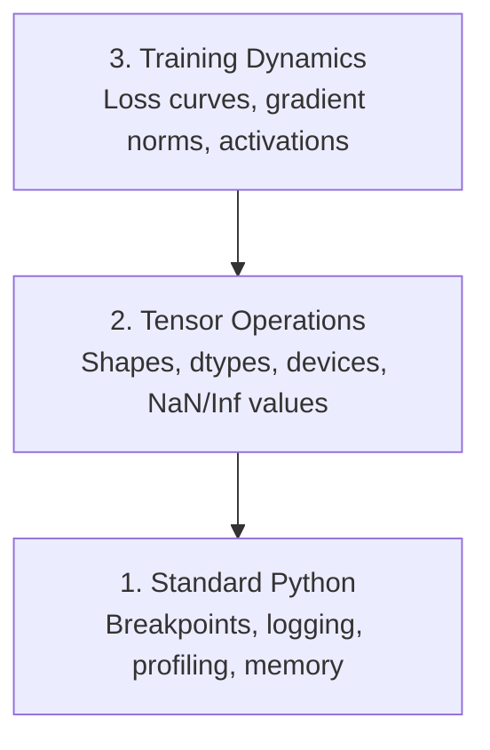

# 디버깅과 프로파일링 (Debugging and Profiling)

> 최악의 AI 버그는 크래시를 내지 않는다. 쓰레기 데이터로 조용히 학습하면서 아름다운 손실(loss) 곡선을 보고한다.

**Type:** Build
**Language:** Python
**Prerequisites:** Lesson 1 (Dev Environment), basic PyTorch familiarity
**Time:** ~60분

## 학습 목표 (Learning Objectives)

- 조건부 `breakpoint()`와 `debug_print`를 사용해 학습(training) 도중 텐서(tensor) 형태, dtype, NaN 값 검사하기
- `cProfile`, `line_profiler`, `tracemalloc`으로 훈련 루프를 프로파일링해 병목 찾기
- 흔한 AI 버그를 탐지하기: 형태 불일치, NaN 손실, 데이터 누수(data leakage), 잘못된 디바이스의 텐서
- 손실 곡선, 가중치(weight) 히스토그램, 그래디언트(gradient) 분포를 시각화하도록 TensorBoard 설정하기

## 문제 (The Problem)

AI 코드는 일반 코드와는 다르게 실패한다. 웹 앱은 스택 트레이스(stack trace)와 함께 크래시를 낸다. 잘못 구성된 훈련 루프는 8시간 동안 돌아가며 $200어치 GPU 시간을 태우고는, 모든 입력의 평균을 예측하는 모델을 만들어 낸다. 코드는 한 번도 오류를 내지 않았다. 버그는 잘못된 디바이스에 있던 텐서, 잊어버린 `.detach()`, 또는 특성(feature)으로 새어 들어간 레이블(label)이었다.

이런 조용한 실패가 시간과 연산을 낭비하기 전에 잡아내는 디버깅 도구가 필요하다.

## 개념 (The Concept)

AI 디버깅은 세 가지 수준에서 작동한다.



대부분의 사람들은 곧장 수준 3(TensorBoard를 응시하기)으로 뛰어든다. 하지만 AI 버그의 80%는 수준 1과 2에 산다.

## 직접 만들기 (Build It)

### 1부: 출력 디버깅 (그렇다, 효과가 있다)

출력 디버깅은 무시당한다. 그래선 안 된다. 텐서 코드의 경우, 표적화된 print 문이 디버거로 한 단계씩 진행하는 것보다 낫다. 형태, dtype, 값 범위를 한꺼번에 봐야 하기 때문이다.

```python
def debug_print(name, tensor):
    print(f"{name}: shape={tensor.shape}, dtype={tensor.dtype}, "
          f"device={tensor.device}, "
          f"min={tensor.min().item():.4f}, max={tensor.max().item():.4f}, "
          f"mean={tensor.mean().item():.4f}, "
          f"has_nan={tensor.isnan().any().item()}")
```

의심스러운 연산마다 이것을 호출하라. 버그를 찾으면 print를 제거한다. 간단하다.

### 2부: Python 디버거 (pdb와 breakpoint)

내장 디버거는 AI 작업에서 과소평가된다. 훈련 루프에 `breakpoint()`를 넣고 텐서를 대화식으로 검사하라.

```python
def training_step(model, batch, criterion, optimizer):
    inputs, labels = batch
    outputs = model(inputs)
    loss = criterion(outputs, labels)

    if loss.item() > 100 or torch.isnan(loss):
        breakpoint()

    loss.backward()
    optimizer.step()
```

디버거가 당신을 멈춰 세웠을 때 유용한 명령어:

- 형태를 확인하려면 `p outputs.shape`
- 손실 값을 보려면 `p loss.item()`
- NaN을 세려면 `p torch.isnan(outputs).sum()`
- 그래디언트를 확인하려면 `p model.fc1.weight.grad`
- 계속하려면 `c`, 나가려면 `q`

이것이 조건부 디버깅이다. 무언가 잘못 보일 때만 멈춘다. 1만 스텝짜리 훈련 실행에서는 이것이 중요하다.

### 3부: Python 로깅

디버깅이 빠른 확인을 넘어설 때 print 문을 로깅으로 교체하라.

```python
import logging

logging.basicConfig(
    level=logging.INFO,
    format="%(asctime)s [%(levelname)s] %(message)s",
    handlers=[
        logging.FileHandler("training.log"),
        logging.StreamHandler()
    ]
)
logger = logging.getLogger(__name__)

logger.info("Starting training: lr=%.4f, batch_size=%d", lr, batch_size)
logger.warning("Loss spike detected: %.4f at step %d", loss.item(), step)
logger.error("NaN loss at step %d, stopping", step)
```

로깅은 타임스탬프, 심각도 수준, 파일 출력을 준다. 훈련 실행이 새벽 3시에 실패하면, 화면 밖으로 스크롤되어 사라진 터미널 출력이 아니라 로그 파일을 원하게 된다.

### 4부: 코드 구간 시간 재기

시간이 어디로 가는지 아는 것이 최적화의 첫걸음이다.

```python
import time

class Timer:
    def __init__(self, name=""):
        self.name = name

    def __enter__(self):
        self.start = time.perf_counter()
        return self

    def __exit__(self, *args):
        elapsed = time.perf_counter() - self.start
        print(f"[{self.name}] {elapsed:.4f}s")

with Timer("data loading"):
    batch = next(dataloader_iter)

with Timer("forward pass"):
    outputs = model(batch)

with Timer("backward pass"):
    loss.backward()
```

흔한 발견: 데이터 로딩이 훈련 시간의 60%를 차지한다. 해결책은 더 빠른 GPU가 아니라 DataLoader의 `num_workers > 0`다.

### 5부: cProfile과 line_profiler

수동 타이머 이상의 것이 필요할 때:

```bash
python -m cProfile -s cumtime train.py
```

이것은 모든 함수 호출을 누적 시간으로 정렬해 보여 준다. 줄 단위 프로파일링을 위해서는:

```bash
pip install line_profiler
```

```python
@profile
def train_step(model, data, target):
    output = model(data)
    loss = F.cross_entropy(output, target)
    loss.backward()
    return loss

# Run with: kernprof -l -v train.py
```

### 6부: 메모리 프로파일링

#### tracemalloc로 CPU 메모리

```python
import tracemalloc

tracemalloc.start()

# your code here
model = build_model()
data = load_dataset()

snapshot = tracemalloc.take_snapshot()
top_stats = snapshot.statistics("lineno")
for stat in top_stats[:10]:
    print(stat)
```

#### memory_profiler로 CPU 메모리

```bash
pip install memory_profiler
```

```python
from memory_profiler import profile

@profile
def load_data():
    raw = read_csv("data.csv")       # watch memory jump here
    processed = preprocess(raw)       # and here
    return processed
```

줄 단위 메모리 사용량을 보려면 `python -m memory_profiler your_script.py`로 실행하라.

#### PyTorch로 GPU 메모리

```python
import torch

if torch.cuda.is_available():
    print(torch.cuda.memory_summary())

    print(f"Allocated: {torch.cuda.memory_allocated() / 1e9:.2f} GB")
    print(f"Cached: {torch.cuda.memory_reserved() / 1e9:.2f} GB")
```

OOM(Out of Memory, 메모리 부족)에 부딪혔을 때:

1. 배치(batch) 크기를 줄인다(항상 가장 먼저 시도할 것)
2. 캐시된 메모리를 해제하려면 `torch.cuda.empty_cache()`를 쓴다
3. 큰 중간 텐서에는 `del tensor` 다음에 `torch.cuda.empty_cache()`를 쓴다
4. 메모리 사용량을 절반으로 줄이려면 혼합 정밀도(`torch.cuda.amp`)를 쓴다
5. 매우 깊은 모델에는 그래디언트 체크포인팅(gradient checkpointing)을 쓴다

### 7부: 흔한 AI 버그와 잡는 법

#### 형태 불일치 (Shape Mismatch)

가장 빈번한 버그다. 모델이 `[batch, channels, height, width]`를 기대하는데 텐서가 `[batch, features]` 형태를 가진다.

```python
def check_shapes(model, sample_input):
    print(f"Input: {sample_input.shape}")
    hooks = []

    def make_hook(name):
        def hook(module, inp, out):
            in_shape = inp[0].shape if isinstance(inp, tuple) else inp.shape
            out_shape = out.shape if hasattr(out, "shape") else type(out)
            print(f"  {name}: {in_shape} -> {out_shape}")
        return hook

    for name, module in model.named_modules():
        hooks.append(module.register_forward_hook(make_hook(name)))

    with torch.no_grad():
        model(sample_input)

    for h in hooks:
        h.remove()
```

샘플 배치로 이것을 한 번 실행하라. 모델 안의 모든 형태 변환을 매핑해 준다.

#### NaN 손실 (NaN Loss)

NaN 손실은 무언가 폭발했다는 뜻이다. 흔한 원인:

- 학습률(learning rate)이 너무 높음
- 커스텀 손실에서 0으로 나눔
- 0이나 음수의 로그
- RNN에서의 그래디언트 폭발(exploding gradient)

```python
def detect_nan(model, loss, step):
    if torch.isnan(loss):
        print(f"NaN loss at step {step}")
        for name, param in model.named_parameters():
            if param.grad is not None:
                if torch.isnan(param.grad).any():
                    print(f"  NaN gradient in {name}")
                if torch.isinf(param.grad).any():
                    print(f"  Inf gradient in {name}")
        return True
    return False
```

#### 데이터 누수 (Data Leakage)

모델이 테스트 셋에서 99% 정확도를 얻는다. 멋지게 들린다. 이건 버그다.

```python
def check_data_leakage(train_set, test_set, id_column="id"):
    train_ids = set(train_set[id_column].tolist())
    test_ids = set(test_set[id_column].tolist())
    overlap = train_ids & test_ids
    if overlap:
        print(f"DATA LEAKAGE: {len(overlap)} samples in both train and test")
        return True
    return False
```

시간적 누수도 확인하라. 미래 데이터를 사용해 과거를 예측하는 것이다. 분할하기 전에 타임스탬프로 정렬하라.

#### 잘못된 디바이스 (Wrong Device)

서로 다른 디바이스(CPU vs GPU)에 있는 텐서는 런타임 오류를 일으킨다. 하지만 때로는 다른 모든 것이 GPU에 있는데 텐서 하나가 조용히 CPU에 머물러, 훈련이 그냥 느리게 돌아가기도 한다.

```python
def check_devices(model, *tensors):
    model_device = next(model.parameters()).device
    print(f"Model device: {model_device}")
    for i, t in enumerate(tensors):
        if t.device != model_device:
            print(f"  WARNING: tensor {i} on {t.device}, model on {model_device}")
```

### 8부: TensorBoard 기초

TensorBoard는 시간에 따라 훈련 내부에서 무슨 일이 일어나는지 보여 준다.

```bash
pip install tensorboard
```

```python
from torch.utils.tensorboard import SummaryWriter

writer = SummaryWriter("runs/experiment_1")

for step in range(num_steps):
    loss = train_step(model, batch)

    writer.add_scalar("loss/train", loss.item(), step)
    writer.add_scalar("lr", optimizer.param_groups[0]["lr"], step)

    if step % 100 == 0:
        for name, param in model.named_parameters():
            writer.add_histogram(f"weights/{name}", param, step)
            if param.grad is not None:
                writer.add_histogram(f"grads/{name}", param.grad, step)

writer.close()
```

실행하기:

```bash
tensorboard --logdir=runs
```

무엇을 봐야 하는가:

- **손실이 감소하지 않음**: 학습률이 너무 낮거나, 모델 아키텍처 문제
- **손실이 격렬하게 진동함**: 학습률이 너무 높음
- **손실이 NaN으로 감**: 수치적 불안정성(위 NaN 섹션 참고)
- **학습 손실은 감소하는데 검증 손실은 증가**: 과적합(overfitting)
- **가중치 히스토그램이 0으로 붕괴함**: 기울기 소실(vanishing gradient)
- **그래디언트 히스토그램이 폭발함**: 그래디언트 클리핑(gradient clipping)이 필요함

### 9부: VS Code 디버거

대화식 디버깅을 위해 `launch.json`으로 VS Code를 구성하라.

```json
{
    "version": "0.2.0",
    "configurations": [
        {
            "name": "Debug Training",
            "type": "debugpy",
            "request": "launch",
            "program": "${file}",
            "console": "integratedTerminal",
            "justMyCode": false
        }
    ]
}
```

여백(gutter)을 클릭해 중단점(breakpoint)을 설정하라. Variables 패널로 텐서 속성을 검사하라. Debug Console에서는 실행 중간에 임의의 Python 표현식을 실행할 수 있다.

각 변환을 보고 싶은 데이터 전처리 파이프라인을 한 단계씩 진행할 때 유용하다.

## 라이브러리로 써보기 (Use It)

대부분의 AI 버그를 잡는 디버깅 워크플로는 다음과 같다.

1. **훈련 전**: 샘플 배치로 `check_shapes`를 실행하라. 입력과 출력 차원이 기대와 일치하는지 검증하라.
2. **첫 10 스텝**: 손실, 출력, 그래디언트에 `debug_print`를 사용하라. 아무것도 NaN이 아니고 값이 합리적인 범위에 있는지 확인하라.
3. **훈련 중**: 손실, 학습률, 그래디언트 노름(norm)을 로깅하라. 시각화에 TensorBoard를 사용하라.
4. **무언가 망가졌을 때**: 실패 지점에 `breakpoint()`를 넣어라. 텐서를 대화식으로 검사하라.
5. **성능을 위해**: 데이터 로딩 vs 순방향 vs 역방향 패스의 시간을 재라. OOM에 가까우면 메모리를 프로파일링하라.

## 산출물 (Ship It)

디버깅 툴킷 스크립트를 실행하라.

```bash
python phases/00-setup-and-tooling/12-debugging-and-profiling/code/debug_tools.py
```

AI 고유의 버그를 진단하도록 돕는 프롬프트(prompt)는 `outputs/prompt-debug-ai-code.md`를 보라.

## 연습 문제 (Exercises)

1. `debug_tools.py`를 실행하고 각 섹션의 출력을 읽어 보라. 더미 모델을 수정해 NaN을 도입하고(힌트: 순방향 패스에서 0으로 나누기) 탐지기가 그것을 잡는 것을 지켜보라.
2. `cProfile`로 훈련 루프를 프로파일링하고 가장 느린 함수를 식별하라.
3. `tracemalloc`을 사용해 데이터 로딩 파이프라인에서 어느 줄이 메모리를 가장 많이 할당하는지 찾아라.
4. 간단한 훈련 실행에 TensorBoard를 설정하고 모델이 과적합되는지 식별하라.
5. 훈련 루프 안에서 `breakpoint()`를 사용하라. 디버거 프롬프트에서 텐서 형태, 디바이스, 그래디언트 값을 검사하는 것을 연습하라.
