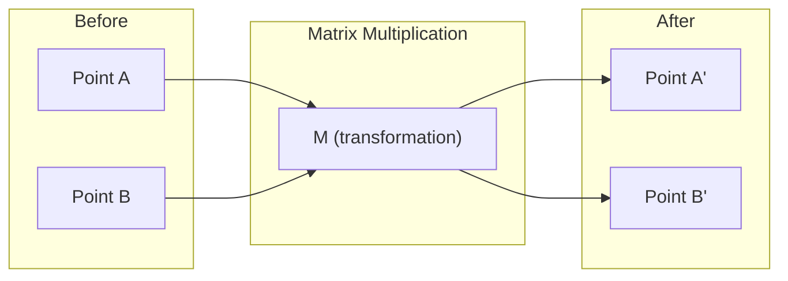
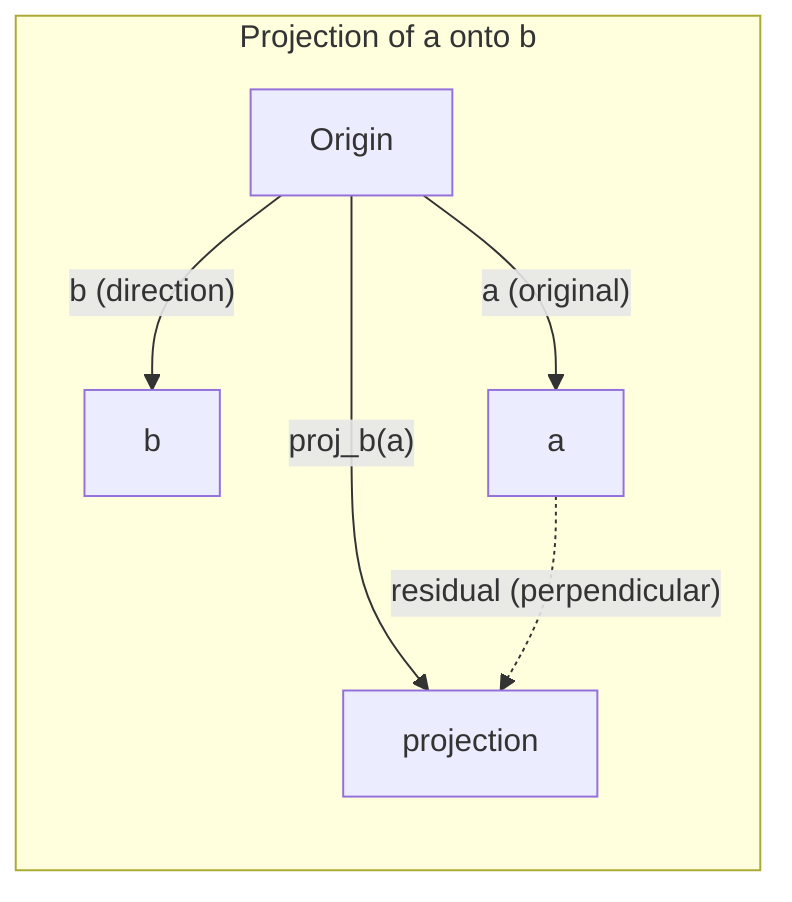

# 선형대수 직관(Linear Algebra Intuition)

> 모든 AI 모델은 그저 화려한 모자를 쓴 행렬 수학일 뿐이다.

**Type:** Learn
**Languages:** Python, Julia
**Prerequisites:** Phase 0
**Time:** ~60분

## 학습 목표 (Learning Objectives)

- 벡터(vector)와 행렬(matrix) 연산(덧셈, 내적(dot product), 행렬 곱)을 Python에서 밑바닥부터 구현하기
- 내적, 사영(projection), 그람-슈미트(Gram-Schmidt) 과정이 기하학적으로 무엇을 하는지 설명하기
- 행 축약(row reduction)을 사용해 벡터 집합의 선형 독립(linear independence), 랭크(rank), 기저(basis)를 판별하기
- 선형대수 개념을 그것의 AI 응용(임베딩(embedding), 어텐션 점수(attention score), LoRA)과 연결하기

## 문제 (The Problem)

아무 ML 논문이나 펼쳐 보라. 첫 페이지 안에 벡터, 행렬, 내적, 변환이 등장한다. 선형대수 직관이 없으면 이것들은 그저 기호일 뿐이다. 직관이 있으면 신경망(neural network)이 실제로 무엇을 하는지 보인다. 공간 안에서 점들을 이리저리 옮기는 일이다.

수학자가 될 필요는 없다. 이 연산들이 기하학적으로 무엇을 뜻하는지 보고, 그다음 직접 코드로 작성하면 된다.

## 개념 (The Concept)

### 벡터는 점이다 (그리고 방향이다)

벡터는 그저 숫자의 목록일 뿐이다. 하지만 그 숫자들은 무언가를 의미한다. 공간 안의 좌표다.

**2D 벡터 [3, 2]:**

| x | y | 점 |
|---|---|-------|
| 3 | 2 | 이 벡터는 원점 (0,0)에서 평면 위의 점 (3, 2)를 향한다 |

이 벡터는 크기 sqrt(3^2 + 2^2) = sqrt(13)이고 위쪽 오른쪽을 향한다.

AI에서 벡터는 모든 것을 표현한다:
- 단어 → 768개 숫자로 된 벡터 (임베딩 공간에서의 그 "의미")
- 이미지 → 수백만 개 픽셀 값으로 된 벡터
- 사용자 → 선호도로 된 벡터

### 행렬은 변환이다

행렬은 한 벡터를 다른 벡터로 변환한다. 회전, 스케일링, 늘이기, 사영을 한다.



AI에서 행렬은 곧 모델 그 자체다:
- 신경망 가중치(weight) → 입력을 출력으로 변환하는 행렬
- 어텐션 점수 → 무엇에 집중할지 결정하는 행렬
- 임베딩 → 단어를 벡터로 매핑하는 행렬

### 내적은 유사도를 측정한다

두 벡터의 내적은 둘이 얼마나 유사한지를 알려준다.

```
a · b = a₁×b₁ + a₂×b₂ + ... + aₙ×bₙ

Same direction:      a · b > 0  (similar)
Perpendicular:       a · b = 0  (unrelated)
Opposite direction:  a · b < 0  (dissimilar)
```

검색 엔진, 추천 시스템, RAG가 동작하는 방식이 말 그대로 이것이다. 내적이 큰 벡터를 찾는다.

### 선형 독립 (Linear Independence)

어떤 벡터 집합에서 그 어떤 벡터도 나머지 벡터들의 조합으로 쓸 수 없으면 그 벡터들은 선형 독립(linearly independent)이다. v1, v2, v3가 독립이면 이들은 3차원 공간을 생성(span)한다. 만약 하나가 나머지의 조합이라면 이들은 평면만 생성한다.

이것이 AI에서 중요한 이유는 이렇다. 특성 행렬(feature matrix)의 열들은 선형 독립이어야 한다. 두 특성(feature)이 완벽하게 상관되어 있다면(선형 종속), 모델은 그 둘의 효과를 구별하지 못한다. 이것이 회귀(regression)에서 다중공선성(multicollinearity)을 일으킨다. 가중치 행렬이 불안정해지고, 작은 입력 변화가 거친 출력 변동을 만든다.

**구체적 예시:**

```
v1 = [1, 0, 0]
v2 = [0, 1, 0]
v3 = [2, 1, 0]   # v3 = 2*v1 + v2
```

v1과 v2는 독립이다. 어느 것도 다른 것의 스칼라 배수나 조합이 아니다. 하지만 v3 = 2*v1 + v2이므로 {v1, v2, v3}는 종속 집합이다. 이 세 벡터는 모두 xy-평면 위에 놓인다. 이들을 어떻게 조합하든 [0, 0, 1]에 도달하지 못한다. 벡터는 셋이지만 자유도는 두 차원뿐이다.

데이터셋(dataset)에서: 만약 feature_3 = 2*feature_1 + feature_2라면, feature_3을 추가해도 모델에 새로운 정보가 전혀 주어지지 않는다. 더 나쁘게는, 정규방정식(normal equations)을 특이(singular)하게 만든다. 가중치에 대한 유일한 해가 존재하지 않는다.

### 기저와 랭크 (Basis and Rank)

기저(basis)는 전체 공간을 생성하는 선형 독립 벡터들의 최소 집합이다. 기저 벡터의 개수가 곧 그 공간의 차원이다.

3차원 공간의 표준 기저는 {[1,0,0], [0,1,0], [0,0,1]}이다. 하지만 3차원에서 독립인 임의의 세 벡터라면 유효한 기저를 이룬다. 기저의 선택은 곧 좌표계의 선택이다.

행렬의 랭크(rank) = 선형 독립인 열의 개수 = 선형 독립인 행의 개수. 만약 rank < min(rows, cols)이면 그 행렬은 랭크 결핍(rank-deficient)이다. 이것이 의미하는 바는:
- 시스템이 무한히 많은 해를 갖거나(또는 해가 없다)
- 변환에서 정보가 손실된다
- 행렬을 역으로 만들 수 없다

| 상황 | 랭크 | ML에서의 의미 |
|-----------|------|---------------------|
| 풀 랭크 (rank = min(m, n)) | 가능한 최대 | 유일한 최소제곱 해가 존재한다. 모델이 잘 조건화(well-conditioned)되어 있다. |
| 랭크 결핍 (rank < min(m, n)) | 최대 미만 | 특성들이 중복된다. 무한히 많은 가중치 해가 존재한다. 규제(regularization)가 필요하다. |
| 랭크 1 | 1 | 모든 열이 하나의 벡터를 스케일링한 복사본이다. 모든 데이터가 직선 위에 놓인다. |
| 랭크 결핍에 가까움 (작은 특이값) | 수치적으로 낮음 | 행렬이 잘못 조건화(ill-conditioned)되어 있다. 미세한 입력 잡음이 큰 출력 변화를 일으킨다. SVD 절단이나 릿지 회귀(ridge regression)를 사용하라. |

### 사영 (Projection)

벡터 **a**를 벡터 **b** 위로 사영(projection)하면 **b** 방향에 대한 **a**의 성분을 얻는다:

```
proj_b(a) = (a dot b / b dot b) * b
```

잔차(residual) (a - proj_b(a))는 b에 수직이다. 이 직교 분해(orthogonal decomposition)가 최소제곱 적합(least-squares fitting)의 토대다.

사영은 ML 어디에나 있다:
- 선형 회귀는 관측값에서 열공간(column space)까지의 거리를 최소화하며, 그 해가 곧 사영이다
- PCA는 데이터를 최대 분산 방향으로 사영한다
- 트랜스포머(transformer)의 어텐션(attention)은 쿼리(query)를 키(key) 위로 사영한 것을 계산한다



**예시:** a = [3, 4], b = [1, 0]

proj_b(a) = (3*1 + 4*0) / (1*1 + 0*0) * [1, 0] = 3 * [1, 0] = [3, 0]

사영은 y-성분을 버린다. 이것이 가장 단순한 형태의 차원 축소(dimensionality reduction)다. 관심 없는 방향은 버린다.

### 그람-슈미트 과정 (Gram-Schmidt Process)

임의의 독립 벡터 집합을 정규직교 기저(orthonormal basis)로 변환하는 것이다. 정규직교(orthonormal)란 모든 벡터의 길이가 1이고 모든 쌍이 서로 수직임을 뜻한다.

알고리즘:
1. 첫 번째 벡터를 가져와 정규화한다
2. 두 번째 벡터를 가져와 첫 번째 벡터 위로의 사영을 빼고, 정규화한다
3. 세 번째 벡터를 가져와 이전 모든 벡터 위로의 사영들을 빼고, 정규화한다
4. 나머지 벡터들에 대해 반복한다

```
Input:  v1, v2, v3, ... (linearly independent)

u1 = v1 / |v1|

w2 = v2 - (v2 dot u1) * u1
u2 = w2 / |w2|

w3 = v3 - (v3 dot u1) * u1 - (v3 dot u2) * u2
u3 = w3 / |w3|

Output: u1, u2, u3, ... (orthonormal basis)
```

이것이 QR 분해(QR decomposition)가 내부적으로 동작하는 방식이다. Q는 정규직교 기저이고, R은 사영 계수들을 담는다. QR 분해는 다음에 사용된다:
- 선형 시스템 풀기 (가우스 소거법(Gaussian elimination)보다 더 안정적)
- 고윳값(eigenvalue) 계산 (QR 알고리즘)
- 최소제곱 회귀 (표준적인 수치 해법)

## 직접 만들기 (Build It)

### 1단계: 밑바닥부터 만드는 벡터 (Python)

```python
class Vector:
    def __init__(self, components):
        self.components = list(components)
        self.dim = len(self.components)

    def __add__(self, other):
        return Vector([a + b for a, b in zip(self.components, other.components)])

    def __sub__(self, other):
        return Vector([a - b for a, b in zip(self.components, other.components)])

    def dot(self, other):
        return sum(a * b for a, b in zip(self.components, other.components))

    def magnitude(self):
        return sum(x**2 for x in self.components) ** 0.5

    def normalize(self):
        mag = self.magnitude()
        return Vector([x / mag for x in self.components])

    def cosine_similarity(self, other):
        return self.dot(other) / (self.magnitude() * other.magnitude())

    def __repr__(self):
        return f"Vector({self.components})"


a = Vector([1, 2, 3])
b = Vector([4, 5, 6])

print(f"a + b = {a + b}")
print(f"a · b = {a.dot(b)}")
print(f"|a| = {a.magnitude():.4f}")
print(f"cosine similarity = {a.cosine_similarity(b):.4f}")
```

### 2단계: 밑바닥부터 만드는 행렬 (Python)

```python
class Matrix:
    def __init__(self, rows):
        self.rows = [list(row) for row in rows]
        self.shape = (len(self.rows), len(self.rows[0]))

    def __matmul__(self, other):
        if isinstance(other, Vector):
            return Vector([
                sum(self.rows[i][j] * other.components[j] for j in range(self.shape[1]))
                for i in range(self.shape[0])
            ])
        rows = []
        for i in range(self.shape[0]):
            row = []
            for j in range(other.shape[1]):
                row.append(sum(
                    self.rows[i][k] * other.rows[k][j]
                    for k in range(self.shape[1])
                ))
            rows.append(row)
        return Matrix(rows)

    def transpose(self):
        return Matrix([
            [self.rows[j][i] for j in range(self.shape[0])]
            for i in range(self.shape[1])
        ])

    def __repr__(self):
        return f"Matrix({self.rows})"


rotation_90 = Matrix([[0, -1], [1, 0]])
point = Vector([3, 1])

rotated = rotation_90 @ point
print(f"Original: {point}")
print(f"Rotated 90°: {rotated}")
```

### 3단계: 이것이 AI에서 중요한 이유

```python
import random

random.seed(42)
weights = Matrix([[random.gauss(0, 0.1) for _ in range(3)] for _ in range(2)])
input_vector = Vector([1.0, 0.5, -0.3])

output = weights @ input_vector
print(f"Input (3D): {input_vector}")
print(f"Output (2D): {output}")
print("This is what a neural network layer does -- matrix multiplication.")
```

### 4단계: Julia 버전

```julia
a = [1.0, 2.0, 3.0]
b = [4.0, 5.0, 6.0]

println("a + b = ", a + b)
println("a · b = ", a ⋅ b)       # Julia supports unicode operators
println("|a| = ", √(a ⋅ a))
println("cosine = ", (a ⋅ b) / (√(a ⋅ a) * √(b ⋅ b)))

# Matrix-vector multiplication
W = [0.1 -0.2 0.3; 0.4 0.5 -0.1]
x = [1.0, 0.5, -0.3]
println("Wx = ", W * x)
println("This is a neural network layer.")
```

### 5단계: 밑바닥부터 만드는 선형 독립과 사영 (Python)

```python
def is_linearly_independent(vectors):
    n = len(vectors)
    dim = len(vectors[0].components)
    mat = Matrix([v.components[:] for v in vectors])
    rows = [row[:] for row in mat.rows]
    rank = 0
    for col in range(dim):
        pivot = None
        for row in range(rank, len(rows)):
            if abs(rows[row][col]) > 1e-10:
                pivot = row
                break
        if pivot is None:
            continue
        rows[rank], rows[pivot] = rows[pivot], rows[rank]
        scale = rows[rank][col]
        rows[rank] = [x / scale for x in rows[rank]]
        for row in range(len(rows)):
            if row != rank and abs(rows[row][col]) > 1e-10:
                factor = rows[row][col]
                rows[row] = [rows[row][j] - factor * rows[rank][j] for j in range(dim)]
        rank += 1
    return rank == n


def project(a, b):
    scalar = a.dot(b) / b.dot(b)
    return Vector([scalar * x for x in b.components])


def gram_schmidt(vectors):
    orthonormal = []
    for v in vectors:
        w = v
        for u in orthonormal:
            proj = project(w, u)
            w = w - proj
        if w.magnitude() < 1e-10:
            continue
        orthonormal.append(w.normalize())
    return orthonormal


v1 = Vector([1, 0, 0])
v2 = Vector([1, 1, 0])
v3 = Vector([1, 1, 1])
basis = gram_schmidt([v1, v2, v3])
for i, u in enumerate(basis):
    print(f"u{i+1} = {u}")
    print(f"  |u{i+1}| = {u.magnitude():.6f}")

print(f"u1 · u2 = {basis[0].dot(basis[1]):.6f}")
print(f"u1 · u3 = {basis[0].dot(basis[2]):.6f}")
print(f"u2 · u3 = {basis[1].dot(basis[2]):.6f}")
```

## 라이브러리로 써보기 (Use It)

이제 같은 것을 NumPy로 해본다. 실무에서 실제로 쓰게 될 방식이다:

```python
import numpy as np

a = np.array([1, 2, 3], dtype=float)
b = np.array([4, 5, 6], dtype=float)

print(f"a + b = {a + b}")
print(f"a · b = {np.dot(a, b)}")
print(f"|a| = {np.linalg.norm(a):.4f}")
print(f"cosine = {np.dot(a, b) / (np.linalg.norm(a) * np.linalg.norm(b)):.4f}")

W = np.random.randn(2, 3) * 0.1
x = np.array([1.0, 0.5, -0.3])
print(f"Wx = {W @ x}")
```

### NumPy로 하는 랭크, 사영, QR

```python
import numpy as np

A = np.array([[1, 2], [2, 4]])
print(f"Rank: {np.linalg.matrix_rank(A)}")

a = np.array([3, 4])
b = np.array([1, 0])
proj = (np.dot(a, b) / np.dot(b, b)) * b
print(f"Projection of {a} onto {b}: {proj}")

Q, R = np.linalg.qr(np.random.randn(3, 3))
print(f"Q is orthogonal: {np.allclose(Q @ Q.T, np.eye(3))}")
print(f"R is upper triangular: {np.allclose(R, np.triu(R))}")
```

### PyTorch — 텐서는 자동 미분이 달린 벡터다

```python
import torch

x = torch.randn(3, requires_grad=True)
y = torch.tensor([1.0, 0.0, 0.0])

similarity = torch.dot(x, y)
similarity.backward()

print(f"x = {x.data}")
print(f"y = {y.data}")
print(f"dot product = {similarity.item():.4f}")
print(f"d(dot)/dx = {x.grad}")
```

x에 대한 내적의 그래디언트(gradient)는 그냥 y다. PyTorch가 이를 자동으로 계산했다. 신경망의 모든 연산은 이런 연산들, 곧 행렬 곱, 내적, 사영으로 만들어지며, 자동 미분(autodiff)이 이 모든 것을 통과하는 그래디언트를 추적한다.

방금 NumPy가 한 줄로 하는 것을 밑바닥부터 만들었다. 이제 내부에서 무슨 일이 일어나는지 알게 되었다.

## 산출물 (Ship It)

이 레슨이 만들어내는 것:
- `outputs/prompt-linear-algebra-tutor.md` — 기하학적 직관을 통해 선형대수를 가르치는 AI 어시스턴트용 프롬프트(prompt)

## 연결 (Connections)

이 레슨의 모든 것은 현대 AI의 특정 부분들과 연결된다:

| 개념 | 어디에 나타나는가 |
|---------|------------------|
| 내적 (Dot product) | 트랜스포머의 어텐션 점수, RAG의 코사인 유사도 |
| 행렬 곱 (Matrix multiply) | 모든 신경망 층, 모든 선형 변환 |
| 선형 독립 (Linear independence) | 특성 선택, 다중공선성 회피 |
| 랭크 (Rank) | 시스템이 풀 수 있는지 판별, LoRA(저랭크 적응, low-rank adaptation) |
| 사영 (Projection) | 선형 회귀(열공간으로의 사영), PCA |
| Gram-Schmidt / QR | 수치 해법, 고윳값 계산 |
| Orthonormal basis | 안정적인 수치 계산, 화이트닝 변환(whitening transform) |

LoRA는 특별히 언급할 가치가 있다. 가중치 갱신을 저랭크 행렬로 분해함으로써 대형 언어 모델(LLM)을 파인튜닝(fine-tuning)한다. 4096x4096 가중치 행렬(1600만 파라미터)을 갱신하는 대신, LoRA는 크기 4096x16과 16x4096인 두 행렬(13만 1천 파라미터)을 갱신한다. 랭크-16 제약은 LoRA가 가중치 갱신이 전체 4096차원 공간의 16차원 부분공간에 존재한다고 가정함을 뜻한다. 이것이 바로 선형대수가 실제로 일을 하는 모습이다.

## 연습 문제 (Exercises)

1. 두 벡터 사이의 각도를 도(degree) 단위로 반환하는 `Vector.angle_between(other)`를 구현하라
2. x-좌표를 두 배, y-좌표를 세 배로 만드는 2D 스케일링 행렬을 만들고, 이를 벡터 [1, 1]에 적용하라
3. 5개의 무작위 단어 같은 벡터(차원 50)가 주어졌을 때, 코사인 유사도를 사용해 가장 유사한 두 개를 찾아라
4. 그람-슈미트 출력이 진정으로 정규직교인지 검증하라: 모든 쌍의 내적이 0이고 모든 벡터의 크기가 1인지 확인하라
5. 랭크 2인 3x3 행렬을 만들어라. `rank()` 메서드를 사용해 검증하라. 그다음 그 열들이 어떤 기하학적 대상을 생성하는지 설명하라.
6. 벡터 [1, 2, 3]을 [1, 1, 1] 위로 사영하라. 그 결과는 기하학적으로 무엇을 나타내는가?

## 핵심 용어 (Key Terms)

| 용어 | 흔히 하는 말 | 실제 의미 |
|------|----------------|----------------------|
| 벡터 (Vector) | "화살표" | n차원 공간에서 점이나 방향을 나타내는 숫자의 목록 |
| 행렬 (Matrix) | "숫자의 표" | 벡터를 한 공간에서 다른 공간으로 매핑하는 변환 |
| 내적 (Dot product) | "곱하고 더한다" | 두 벡터가 얼마나 정렬되어 있는지를 재는 척도 — 유사도 검색의 핵심 |
| 임베딩 (Embedding) | "어떤 AI 마법" | 무언가(단어, 이미지, 사용자)의 의미를 나타내는 벡터 |
| 선형 독립 (Linear independence) | "서로 겹치지 않는다" | 집합 안의 어떤 벡터도 나머지의 조합으로 쓸 수 없다 |
| 랭크 (Rank) | "차원이 몇 개인가" | 행렬에서 선형 독립인 열(또는 행)의 개수 |
| 사영 (Projection) | "그림자" | 한 벡터의 다른 벡터 방향 성분 |
| 기저 (Basis) | "좌표축" | 공간을 생성하는 독립 벡터들의 최소 집합 |
| 정규직교 (Orthonormal) | "수직인 단위 벡터들" | 서로 수직이고 각각 길이가 1인 벡터들 |
