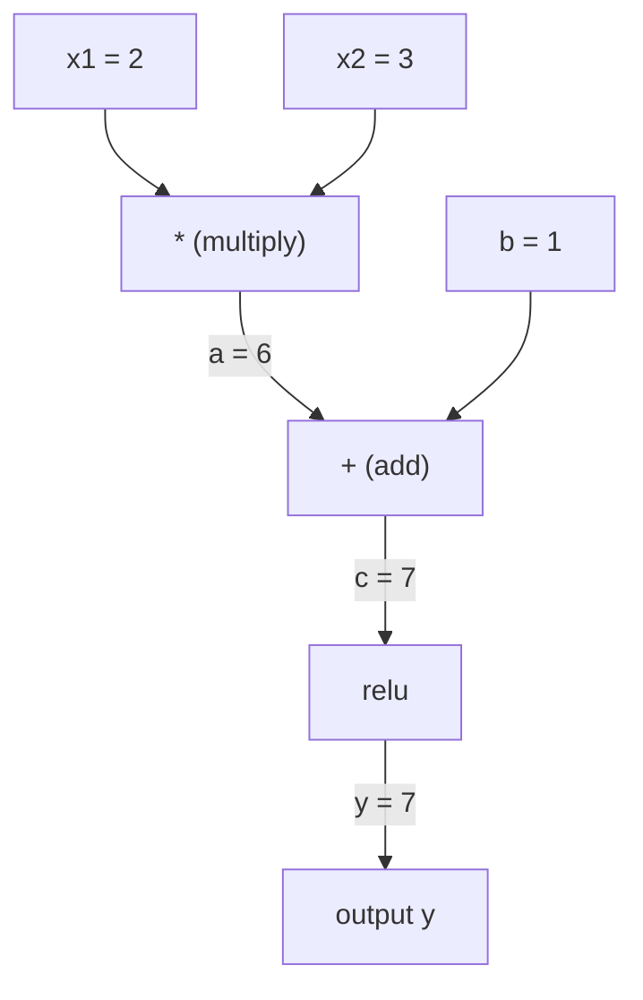
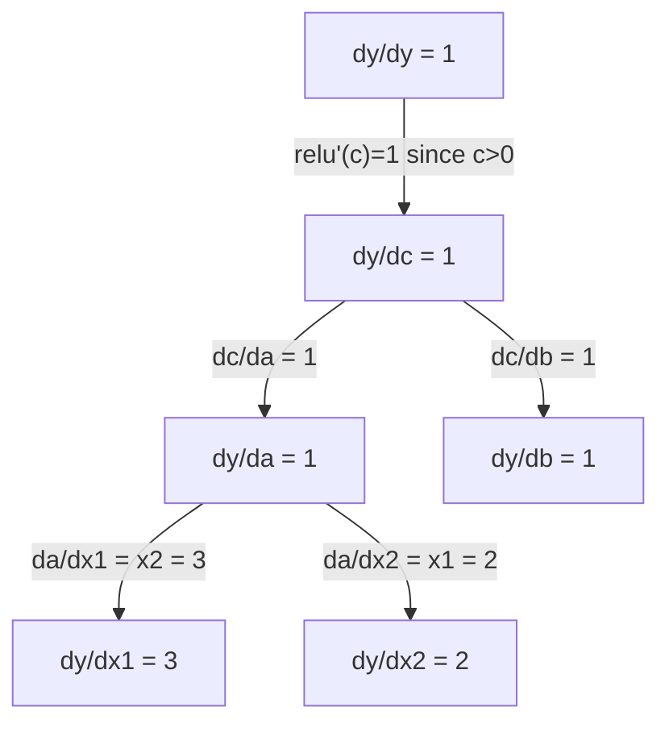

# 연쇄 법칙 & 자동 미분 (Chain Rule & Automatic Differentiation)

> 연쇄 법칙(chain rule)은 학습하는 모든 신경망(neural network) 뒤에 있는 엔진이다.

**Type:** Build
**Language:** Python
**Prerequisites:** Phase 1, Lesson 04 (Derivatives & Gradients)
**Time:** ~90분

## 학습 목표 (Learning Objectives)

- 연산을 기록하고 역방향 모드 자동 미분(reverse-mode autodiff)으로 그래디언트(gradient)를 계산하는 최소 자동 미분(autograd) 엔진(Value 클래스) 만들기
- 위상 정렬(topological sort)을 사용해 계산 그래프(computation graph)를 통과하는 순방향·역방향 패스 구현하기
- 밑바닥부터 만든 자동 미분 엔진만으로 XOR에 대해 다층 퍼셉트론(multi-layer perceptron) 구성하고 학습시키기
- 수치적 유한 차분(finite difference)에 대한 그래디언트 체킹(gradient checking)으로 자동 미분의 정확성 검증하기

## 문제 (The Problem)

간단한 함수의 도함수(derivative)는 계산할 수 있다. 하지만 신경망은 간단한 함수가 아니다. 수백 개의 함수가 합성된 것이다: 행렬 곱, 편향 더하기, 활성화 적용, 다시 행렬 곱, 소프트맥스(softmax), 교차 엔트로피(cross-entropy) 손실. 출력은 함수의 함수의 함수다.

신경망을 학습시키려면 모든 가중치(weight) 하나하나에 대한 손실의 그래디언트가 필요하다. 이를 수백만 개 파라미터(parameter)에 대해 손으로 하는 것은 불가능하다. 수치적으로(유한 차분으로) 하는 것은 너무 느리다.

연쇄 법칙은 수학을 준다. 자동 미분은 알고리즘을 준다. 둘이 함께라면 임의의 함수 합성을 통과하는 정확한 그래디언트를, 단 한 번의 순방향 패스(forward pass)에 비례하는 시간 안에 계산할 수 있다.

이것이 PyTorch, TensorFlow, JAX가 동작하는 방식이다. 당신은 그 축소판을 밑바닥부터 만들 것이다.

## 개념 (The Concept)

### 연쇄 법칙 (The Chain Rule)

`y = f(g(x))`이면, `x`에 대한 `y`의 도함수는:

```
dy/dx = dy/dg * dg/dx = f'(g(x)) * g'(x)
```

연쇄(chain)를 따라 도함수를 곱한다. 각 고리는 자신의 국소 도함수(local derivative)를 기여한다.

예시: `y = sin(x^2)`

```
g(x) = x^2       g'(x) = 2x
f(g) = sin(g)     f'(g) = cos(g)

dy/dx = cos(x^2) * 2x
```

더 깊은 합성의 경우, 연쇄가 확장된다:

```
y = f(g(h(x)))

dy/dx = f'(g(h(x))) * g'(h(x)) * h'(x)
```

신경망의 모든 층(layer)은 이 연쇄의 한 고리다.

### 계산 그래프 (Computational Graphs)

계산 그래프는 연쇄 법칙을 시각화한다. 모든 연산이 노드(node)가 된다. 데이터는 그래프를 통해 순방향으로 흐른다. 그래디언트는 역방향으로 흐른다.

**순방향 패스 (값 계산):**



**역방향 패스 (그래디언트 계산):**



역방향 패스는 모든 노드에서 연쇄 법칙을 적용하여, 출력에서 입력으로 그래디언트를 전파한다.

### 순방향 모드 vs 역방향 모드

그래프를 통해 연쇄 법칙을 적용하는 두 가지 방법이 있다.

**순방향 모드(Forward mode)**는 입력에서 시작해 도함수를 앞으로 밀어낸다. `dx/dx = 1`을 계산하고 각 연산을 통해 전파한다. 입력이 적고 출력이 많을 때 좋다.

```
Forward mode: seed dx/dx = 1, propagate forward

  x = 2       (dx/dx = 1)
  a = x^2     (da/dx = 2x = 4)
  y = sin(a)  (dy/dx = cos(a) * da/dx = cos(4) * 4 = -2.615)
```

**역방향 모드(Reverse mode)**는 출력에서 시작해 그래디언트를 뒤로 끌어당긴다. `dy/dy = 1`을 계산하고 각 연산을 역순으로 통과하며 전파한다. 입력이 많고 출력이 적을 때 좋다.

```
Reverse mode: seed dy/dy = 1, propagate backward

  y = sin(a)  (dy/dy = 1)
  a = x^2     (dy/da = cos(a) = cos(4) = -0.654)
  x = 2       (dy/dx = dy/da * da/dx = -0.654 * 4 = -2.615)
```

신경망은 수백만 개의 입력(가중치)과 하나의 출력(손실)을 갖는다. 역방향 모드는 모든 그래디언트를 한 번의 역방향 패스로 계산한다. 이것이 역전파(backpropagation)가 역방향 모드를 사용하는 이유다.

| 모드 | 시드 | 방향 | 적합한 경우 |
|------|------|-----------|-----------|
| 순방향 | `dx_i/dx_i = 1` | 입력에서 출력으로 | 입력이 적고 출력이 많을 때 |
| 역방향 | `dy/dy = 1` | 출력에서 입력으로 | 입력이 많고 출력이 적을 때 (신경망) |

### 순방향 모드를 위한 이중수 (Dual Numbers for Forward Mode)

순방향 모드는 이중수(dual number)로 우아하게 구현할 수 있다. 이중수는 `epsilon^2 = 0`인 `a + b*epsilon` 형태를 갖는다.

```
Dual number: (value, derivative)

(2, 1) means: value is 2, derivative w.r.t. x is 1

Arithmetic rules:
  (a, a') + (b, b') = (a+b, a'+b')
  (a, a') * (b, b') = (a*b, a'*b + a*b')
  sin(a, a')         = (sin(a), cos(a)*a')
```

입력 변수를 도함수 1로 씨앗(seed)을 준다. 도함수가 모든 연산을 통해 자동으로 전파된다.

### 자동 미분 엔진 만들기

자동 미분 엔진에는 세 가지가 필요하다:

1. **값 래핑(Value wrapping).** 모든 숫자를 자신의 값과 그래디언트를 저장하는 객체로 감싼다.
2. **그래프 기록(Graph recording).** 모든 연산이 자신의 입력과 국소 그래디언트 함수를 기록한다.
3. **역방향 패스(Backward pass).** 그래프를 위상 정렬한 뒤, 역순으로 따라가며 각 노드에서 연쇄 법칙을 적용한다.

이것이 정확히 PyTorch의 `autograd`가 하는 일이다. `torch.Tensor` 클래스는 값을 감싸고, `requires_grad=True`일 때 연산을 기록하며, `.backward()`를 호출하면 그래디언트를 계산한다.

### PyTorch 자동 미분이 내부에서 동작하는 방식

다음 PyTorch 코드를 작성할 때:

```python
x = torch.tensor(2.0, requires_grad=True)
y = x ** 2 + 3 * x + 1
y.backward()
print(x.grad)  # 7.0 = 2*x + 3 = 2*2 + 3
```

PyTorch는 내부적으로:

1. `requires_grad=True`인 `x`에 대한 `Tensor` 노드를 만든다
2. 모든 연산(`**`, `*`, `+`)이 새 노드를 만들고 역방향 함수를 기록한다
3. `y.backward()`가 기록된 그래프를 통해 역방향 모드 자동 미분을 촉발한다
4. 각 노드의 `grad_fn`이 국소 그래디언트를 계산해 부모 노드로 전달한다
5. 그래디언트가 (교체가 아니라) 덧셈을 통해 `.grad` 속성에 누적된다

그래프는 동적(define-by-run)이다. 순방향 패스마다 새 그래프가 만들어진다. 이것이 PyTorch가 모델 내부에서 제어 흐름(if/else, 루프)을 지원하는 이유다.

## 직접 만들기 (Build It)

### 1단계: Value 클래스

```python
class Value:
    def __init__(self, data, children=(), op=''):
        self.data = data
        self.grad = 0.0
        self._backward = lambda: None
        self._prev = set(children)
        self._op = op

    def __repr__(self):
        return f"Value(data={self.data:.4f}, grad={self.grad:.4f})"
```

모든 `Value`는 자신의 수치 데이터, 그래디언트(초기에는 0), 역방향 함수, 그리고 자신을 생성한 자식 노드들에 대한 포인터를 저장한다.

### 2단계: 그래디언트 추적이 있는 산술 연산

```python
    def __add__(self, other):
        other = other if isinstance(other, Value) else Value(other)
        out = Value(self.data + other.data, (self, other), '+')
        def _backward():
            self.grad += out.grad
            other.grad += out.grad
        out._backward = _backward
        return out

    def __mul__(self, other):
        other = other if isinstance(other, Value) else Value(other)
        out = Value(self.data * other.data, (self, other), '*')
        def _backward():
            self.grad += other.data * out.grad
            other.grad += self.data * out.grad
        out._backward = _backward
        return out

    def relu(self):
        out = Value(max(0, self.data), (self,), 'relu')
        def _backward():
            self.grad += (1.0 if out.data > 0 else 0.0) * out.grad
        out._backward = _backward
        return out
```

각 연산은 국소 그래디언트를 계산하고 상류 그래디언트(`out.grad`)를 곱하는 법을 아는 클로저(closure)를 만든다. `+=`는 어떤 값이 여러 연산에서 쓰이는 경우를 처리한다.

### 3단계: 역방향 패스

```python
    def backward(self):
        topo = []
        visited = set()
        def build_topo(v):
            if v not in visited:
                visited.add(v)
                for child in v._prev:
                    build_topo(child)
                topo.append(v)
        build_topo(self)

        self.grad = 1.0
        for v in reversed(topo):
            v._backward()
```

위상 정렬은 어떤 노드의 그래디언트가 완전히 계산된 뒤에야 그것이 자식들에게 전파되도록 보장한다. 씨앗 그래디언트는 1.0이다(dy/dy = 1).

### 4단계: 완전한 엔진을 위한 더 많은 연산

기본 Value 클래스는 덧셈, 곱셈, relu를 처리한다. 실제 자동 미분 엔진에는 더 많은 것이 필요하다. 다음은 신경망을 만드는 데 필요한 연산들이다:

```python
    def __neg__(self):
        return self * -1

    def __sub__(self, other):
        return self + (-other)

    def __radd__(self, other):
        return self + other

    def __rmul__(self, other):
        return self * other

    def __rsub__(self, other):
        return other + (-self)

    def __pow__(self, n):
        out = Value(self.data ** n, (self,), f'**{n}')
        def _backward():
            self.grad += n * (self.data ** (n - 1)) * out.grad
        out._backward = _backward
        return out

    def __truediv__(self, other):
        return self * (other ** -1) if isinstance(other, Value) else self * (Value(other) ** -1)

    def exp(self):
        import math
        e = math.exp(self.data)
        out = Value(e, (self,), 'exp')
        def _backward():
            self.grad += e * out.grad
        out._backward = _backward
        return out

    def log(self):
        import math
        out = Value(math.log(self.data), (self,), 'log')
        def _backward():
            self.grad += (1.0 / self.data) * out.grad
        out._backward = _backward
        return out

    def tanh(self):
        import math
        t = math.tanh(self.data)
        out = Value(t, (self,), 'tanh')
        def _backward():
            self.grad += (1 - t ** 2) * out.grad
        out._backward = _backward
        return out
```

**각 연산이 중요한 이유:**

| 연산 | 역방향 규칙 | 사용처 |
|-----------|--------------|---------|
| `__sub__` | add + neg 재사용 | 손실 계산 (pred - target) |
| `__pow__` | n * x^(n-1) | 다항 활성화, MSE (error^2) |
| `__truediv__` | mul + pow(-1) 재사용 | 정규화, 학습률 스케일링 |
| `exp` | exp(x) * upstream | 소프트맥스, 로그 우도 |
| `log` | (1/x) * upstream | 교차 엔트로피 손실, 로그 확률 |
| `tanh` | (1 - tanh^2) * upstream | 고전적인 활성화 함수 |

영리한 부분: `__sub__`와 `__truediv__`는 기존 연산들로 정의된다. 연쇄 법칙이 밑에 깔린 add/mul/pow 연산을 통해 합성되기 때문에, 이들은 공짜로 올바른 그래디언트를 얻는다.

### 5단계: 밑바닥부터 만드는 미니 MLP

완전한 Value 클래스가 있으면 신경망을 만들 수 있다. PyTorch도, NumPy도 없다. 오직 Value와 연쇄 법칙뿐이다.

```python
import random

class Neuron:
    def __init__(self, n_inputs):
        self.w = [Value(random.uniform(-1, 1)) for _ in range(n_inputs)]
        self.b = Value(0.0)

    def __call__(self, x):
        act = sum((wi * xi for wi, xi in zip(self.w, x)), self.b)
        return act.tanh()

    def parameters(self):
        return self.w + [self.b]

class Layer:
    def __init__(self, n_inputs, n_outputs):
        self.neurons = [Neuron(n_inputs) for _ in range(n_outputs)]

    def __call__(self, x):
        return [n(x) for n in self.neurons]

    def parameters(self):
        return [p for n in self.neurons for p in n.parameters()]

class MLP:
    def __init__(self, sizes):
        self.layers = [Layer(sizes[i], sizes[i+1]) for i in range(len(sizes)-1)]

    def __call__(self, x):
        for layer in self.layers:
            x = layer(x)
        return x[0] if len(x) == 1 else x

    def parameters(self):
        return [p for layer in self.layers for p in layer.parameters()]
```

`Neuron`은 `tanh(w1*x1 + w2*x2 + ... + b)`를 계산한다. `Layer`는 뉴런들의 리스트다. `MLP`는 층들을 쌓는다. 모든 가중치는 `Value`이므로, `loss.backward()`를 호출하면 그래디언트가 모든 파라미터로 전파된다.

**XOR 학습:**

```python
random.seed(42)
model = MLP([2, 4, 1])  # 2 inputs, 4 hidden neurons, 1 output

xs = [[0, 0], [0, 1], [1, 0], [1, 1]]
ys = [-1, 1, 1, -1]  # XOR pattern (using -1/1 for tanh)

for step in range(100):
    preds = [model(x) for x in xs]
    loss = sum((p - y) ** 2 for p, y in zip(preds, ys))

    for p in model.parameters():
        p.grad = 0.0
    loss.backward()

    lr = 0.05
    for p in model.parameters():
        p.data -= lr * p.grad

    if step % 20 == 0:
        print(f"step {step:3d}  loss = {loss.data:.4f}")

print("\nPredictions after training:")
for x, y in zip(xs, ys):
    print(f"  input={x}  target={y:2d}  pred={model(x).data:6.3f}")
```

이것이 micrograd다. 자동 미분을 갖춘 순수 Python으로 된 완전한 신경망 학습 루프. 모든 상용 딥러닝 프레임워크는 거대한 규모로 같은 일을 한다.

### 6단계: 그래디언트 체킹

자동 미분이 올바른지 어떻게 아는가? 수치 도함수와 비교한다. 이것이 그래디언트 체킹(gradient checking)이다.

```python
def gradient_check(build_expr, x_val, h=1e-7):
    x = Value(x_val)
    y = build_expr(x)
    y.backward()
    autodiff_grad = x.grad

    y_plus = build_expr(Value(x_val + h)).data
    y_minus = build_expr(Value(x_val - h)).data
    numerical_grad = (y_plus - y_minus) / (2 * h)

    diff = abs(autodiff_grad - numerical_grad)
    return autodiff_grad, numerical_grad, diff
```

복잡한 식에서 테스트한다:

```python
def expr(x):
    return (x ** 3 + x * 2 + 1).tanh()

ad, num, diff = gradient_check(expr, 0.5)
print(f"Autodiff:  {ad:.8f}")
print(f"Numerical: {num:.8f}")
print(f"Difference: {diff:.2e}")
# Difference should be < 1e-5
```

그래디언트 체킹은 새 연산을 구현할 때 필수다. 역방향 패스에 버그가 있으면 수치 검사가 그것을 잡아낸다. 진지한 딥러닝 구현은 모두 개발 중에 그래디언트 체크를 실행한다.

**그래디언트 체킹을 언제 사용하는가:**

| 상황 | 그래디언트 체킹을 하는가? |
|-----------|-------------------|
| 자동 미분에 새 연산 추가 | 예, 항상 |
| 수렴하지 않는 학습 루프 디버깅 | 예, 그래디언트부터 확인 |
| 프로덕션 학습 | 아니오, 너무 느림 (파라미터당 순방향 패스 2회) |
| 자동 미분 코드의 단위 테스트 | 예, 자동화하라 |

### 7단계: 손계산과 비교 검증

```python
x1 = Value(2.0)
x2 = Value(3.0)
a = x1 * x2          # a = 6.0
b = a + Value(1.0)    # b = 7.0
y = b.relu()          # y = 7.0

y.backward()

print(f"y = {y.data}")          # 7.0
print(f"dy/dx1 = {x1.grad}")   # 3.0 (= x2)
print(f"dy/dx2 = {x2.grad}")   # 2.0 (= x1)
```

손계산 검증: `y = relu(x1*x2 + 1)`. `x1*x2 + 1 = 7 > 0`이므로 relu는 항등함수다.
`dy/dx1 = x2 = 3`. `dy/dx2 = x1 = 2`. 엔진이 일치한다.

## 라이브러리로 써보기 (Use It)

### PyTorch와 비교 검증

```python
import torch

x1 = torch.tensor(2.0, requires_grad=True)
x2 = torch.tensor(3.0, requires_grad=True)
a = x1 * x2
b = a + 1.0
y = torch.relu(b)
y.backward()

print(f"PyTorch dy/dx1 = {x1.grad.item()}")  # 3.0
print(f"PyTorch dy/dx2 = {x2.grad.item()}")  # 2.0
```

같은 그래디언트다. 당신의 엔진은 PyTorch와 같은 결과를 계산한다. 수학이 같기 때문이다: 연쇄 법칙을 통한 역방향 모드 자동 미분.

### 더 복잡한 식

```python
a = Value(2.0)
b = Value(-3.0)
c = Value(10.0)
f = (a * b + c).relu()  # relu(2*(-3) + 10) = relu(4) = 4

f.backward()
print(f"df/da = {a.grad}")  # -3.0 (= b)
print(f"df/db = {b.grad}")  #  2.0 (= a)
print(f"df/dc = {c.grad}")  #  1.0
```

## 산출물 (Ship It)

이 레슨이 만들어내는 것:
- `outputs/skill-autodiff.md` -- 자동 미분 시스템을 만들고 디버깅하는 스킬
- `code/autodiff.py` -- 확장 가능한 최소 자동 미분 엔진

여기서 만든 Value 클래스는 Phase 3의 신경망 학습 루프의 토대다.

## 연습 문제 (Exercises)

1. `x ** n`을 계산할 수 있도록 Value 클래스에 `__pow__`를 추가하라. `x=2`에서 `d/dx(x^3)`가 `12.0`임을 검증하라.

2. 활성화 함수로 `tanh`를 추가하라. `tanh'(0) = 1`이고 `tanh'(2) = 0.0707`(근사)임을 검증하라.

3. 단일 뉴런에 대한 계산 그래프를 만들어라: `y = relu(w1*x1 + w2*x2 + b)`. 다섯 개의 그래디언트를 모두 계산하고 PyTorch와 비교 검증하라.

4. 이중수를 사용해 순방향 모드 자동 미분을 구현하라. `Dual` 클래스를 만들고 그것이 역방향 모드 엔진과 같은 도함수를 주는지 검증하라.

## 핵심 용어 (Key Terms)

| 용어 | 흔히 하는 말 | 실제 의미 |
|------|----------------|----------------------|
| 연쇄 법칙 (Chain rule) | "도함수를 곱한다" | 합성 함수의 도함수는 각 함수의 국소 도함수를 올바른 점에서 평가한 값들의 곱과 같다 |
| 계산 그래프 (Computational graph) | "신경망 다이어그램" | 노드는 연산이고 간선은 값(순방향)이나 그래디언트(역방향)를 운반하는 방향성 비순환 그래프 |
| 순방향 모드 (Forward mode) | "도함수를 앞으로 민다" | 도함수를 입력에서 출력으로 전파하는 자동 미분. 입력 변수당 한 번의 패스. |
| 역방향 모드 (Reverse mode) | "역전파" | 그래디언트를 출력에서 입력으로 전파하는 자동 미분. 출력 변수당 한 번의 패스. |
| 자동 미분 (Autograd) | "자동 그래디언트" | 값에 대한 연산을 기록하고, 그래프를 만들고, 연쇄 법칙으로 정확한 그래디언트를 계산하는 시스템 |
| 이중수 (Dual numbers) | "값 더하기 도함수" | 산술을 통해 도함수 정보를 운반하는 a + b*epsilon (epsilon^2 = 0) 형태의 수 |
| 위상 정렬 (Topological sort) | "의존성 순서" | 모든 노드가 자신의 의존성들 뒤에 오도록 그래프 노드를 정렬하는 것. 올바른 그래디언트 전파에 필요하다. |
| 그래디언트 누적 (Gradient accumulation) | "교체하지 말고 더한다" | 어떤 값이 여러 연산에 들어갈 때, 그 그래디언트는 들어오는 모든 그래디언트 기여분의 합이다 |
| 동적 그래프 (Dynamic graph) | "실행하며 정의" | 순방향 패스마다 다시 만들어지는 계산 그래프로, 모델 내부에서 Python 제어 흐름을 허용한다(PyTorch 방식) |
| 그래디언트 검사 (Gradient checking) | "수치적 검증" | 정확성을 검증하기 위해 자동 미분 그래디언트를 수치적 유한 차분 그래디언트와 비교하는 것. 디버깅에 필수. |
| MLP (다층 퍼셉트론) | "다층 퍼셉트론" | 하나 이상의 뉴런 은닉층(hidden layer)을 가진 신경망. 각 뉴런은 가중합 더하기 편향을 계산한 뒤 활성화 함수를 적용한다. |
| 뉴런 (Neuron) | "가중합 + 활성화" | 기본 단위: output = activation(w1*x1 + w2*x2 + ... + b). 가중치와 편향은 학습 가능한 파라미터다. |

## 더 읽을거리 (Further Reading)

- [3Blue1Brown: Backpropagation calculus](https://www.youtube.com/watch?v=tIeHLnjs5U8) -- 신경망에서의 연쇄 법칙에 대한 시각적 설명
- [PyTorch Autograd mechanics](https://pytorch.org/docs/stable/notes/autograd.html) -- 실제 시스템이 동작하는 방식
- [Baydin et al., Automatic Differentiation in Machine Learning: a Survey](https://arxiv.org/abs/1502.05767) -- 포괄적인 레퍼런스
