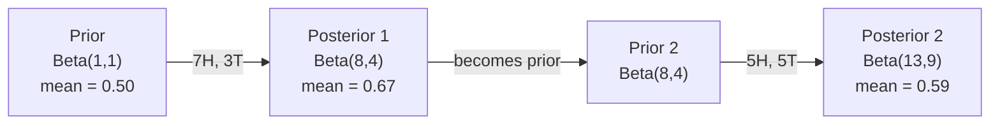

# 베이즈 정리 (Bayes' Theorem)

> 확률(probability)은 당신이 무엇을 기대하는지에 관한 것이다. 베이즈 정리(Bayes' theorem)는 당신이 무엇을 배우는지에 관한 것이다.

**Type:** Build
**Language:** Python
**Prerequisites:** Phase 1, Lesson 06 (Probability Fundamentals)
**Time:** ~75분

## 학습 목표 (Learning Objectives)

- 사전 확률(prior), 우도(likelihood), 증거(evidence)로부터 사후 확률(posterior)을 계산하기 위해 베이즈 정리 적용하기
- 라플라스 평활화(Laplace smoothing)와 로그 공간 계산을 갖춘 나이브 베이즈(Naive Bayes) 텍스트 분류기를 밑바닥부터 만들기
- MLE와 MAP 추정을 비교하고 MAP가 L2 정규화(regularization)에 어떻게 대응하는지 설명하기
- A/B 테스트를 위해 베타-이항(Beta-Binomial) 켤레 사전 분포(conjugate prior)를 사용한 순차적 베이지안 갱신 구현하기

## 문제 (The Problem)

어떤 의료 검사가 99% 정확하다. 당신은 양성 판정을 받았다. 실제로 그 병에 걸렸을 확률은 얼마인가?

대부분의 사람들은 99%라고 답한다. 진짜 답은 그 병이 얼마나 희귀한지에 달려 있다. 만약 10,000명 중 1명이 걸린다면, 양성 결과는 당신이 아플 확률을 약 1%밖에 주지 않는다. 양성 결과의 나머지 99%는 건강한 사람들에게서 나온 거짓 경보다.

이것은 함정 질문이 아니다. 이것이 베이즈 정리다. 모든 스팸 필터, 모든 의료 진단, 불확실성을 정량화하는 모든 머신러닝 모델은 정확히 이 추론을 사용한다. 믿음에서 시작한다. 증거를 본다. 갱신한다.

이를 이해하지 못한 채 ML 시스템을 만들면, 모델 출력을 잘못 해석하고, 나쁜 임계값을 설정하며, 과신하는 예측을 배포하게 될 것이다.

## 개념 (The Concept)

### 결합 확률에서 베이즈로

Lesson 06에서 조건부 확률(conditional probability)이 다음과 같음을 이미 안다:

```
P(A|B) = P(A and B) / P(B)
```

그리고 대칭적으로:

```
P(B|A) = P(A and B) / P(A)
```

두 식은 같은 분자 P(A and B)를 공유한다. 둘을 같게 놓고 정리하면:

```
P(A and B) = P(A|B) * P(B) = P(B|A) * P(A)

Therefore:

P(A|B) = P(B|A) * P(A) / P(B)
```

그것이 베이즈 정리다. 네 가지 양, 하나의 방정식.

### 네 부분

| 부분 | 이름 | 의미 |
|------|------|---------------|
| P(A\|B) | 사후 확률 (Posterior) | 증거 B를 본 후 A에 대한 당신의 갱신된 믿음 |
| P(B\|A) | 우도 (Likelihood) | A가 참이라면 증거 B가 얼마나 가능한가 |
| P(A) | 사전 확률 (Prior) | 어떤 증거를 보기 전 A에 대한 당신의 믿음 |
| P(B) | 증거 (Evidence) | 모든 가능성하에서 B를 볼 전체 확률 |

증거 항 P(B)는 정규화 역할을 한다. 전확률의 법칙(law of total probability)을 사용해 전개할 수 있다:

```
P(B) = P(B|A) * P(A) + P(B|not A) * P(not A)
```

### 의료 검사 예시

어떤 병이 10,000명 중 1명에게 영향을 준다. 검사는 99% 정확하다(아픈 사람의 99%를 잡아내고, 1%의 경우 거짓 양성을 준다).

```
P(sick)          = 0.0001     (prior: disease is rare)
P(positive|sick) = 0.99       (likelihood: test catches it)
P(positive|healthy) = 0.01    (false positive rate)

P(positive) = P(positive|sick) * P(sick) + P(positive|healthy) * P(healthy)
            = 0.99 * 0.0001 + 0.01 * 0.9999
            = 0.000099 + 0.009999
            = 0.010098

P(sick|positive) = P(positive|sick) * P(sick) / P(positive)
                 = 0.99 * 0.0001 / 0.010098
                 = 0.0098
                 = 0.98%
```

1% 미만이다. 사전 확률이 지배한다. 어떤 조건이 희귀할 때는 정확한 검사라도 대부분 거짓 양성을 만든다. 이것이 의사들이 확인 검사를 지시하는 이유다.

### 스팸 필터 예시

"lottery"라는 단어가 포함된 이메일을 받았다. 스팸인가?

```
P(spam)                = 0.3      (30% of email is spam)
P("lottery"|spam)      = 0.05     (5% of spam emails contain "lottery")
P("lottery"|not spam)  = 0.001    (0.1% of legitimate emails contain "lottery")

P("lottery") = 0.05 * 0.3 + 0.001 * 0.7
             = 0.015 + 0.0007
             = 0.0157

P(spam|"lottery") = 0.05 * 0.3 / 0.0157
                  = 0.955
                  = 95.5%
```

단어 하나가 확률을 30%에서 95.5%로 옮긴다. 실제 스팸 필터는 수백 개의 단어에 걸쳐 베이즈를 동시에 적용한다.

### 나이브 베이즈: 독립 가정

나이브 베이즈는 모든 특성(feature)이 클래스가 주어졌을 때 조건부 독립이라고 가정함으로써 이를 다중 특성으로 확장한다:

```
P(class | feature_1, feature_2, ..., feature_n)
  = P(class) * P(feature_1|class) * P(feature_2|class) * ... * P(feature_n|class)
    / P(feature_1, feature_2, ..., feature_n)
```

"나이브(naive, 순진한)"한 부분이 독립 가정이다. 텍스트에서 단어 출현은 독립이 아니다("New"와 "York"은 상관되어 있다). 하지만 이 가정은 실무에서 놀랄 만큼 잘 동작한다. 분류기가 보정된 확률을 만들 필요 없이 클래스 순위만 매기면 되기 때문이다.

분모는 모든 클래스에 대해 같으므로, 이를 건너뛰고 분자만 비교할 수 있다:

```
score(class) = P(class) * product of P(feature_i | class)
```

가장 높은 점수의 클래스를 고른다.

### 최대 우도 추정 (MLE)

학습 데이터에서 P(feature|class)를 어떻게 얻는가? 센다.

```
P("free"|spam) = (number of spam emails containing "free") / (total spam emails)
```

이것이 MLE(maximum likelihood estimation)다: 관측된 데이터를 가장 가능성 있게 만드는 파라미터 값을 고른다. 우도 함수를 최대화하는 것인데, 이산 카운트의 경우 상대 빈도로 환원된다.

문제: 어떤 단어가 학습 중에 스팸에 한 번도 나타나지 않으면, MLE는 그것에 확률 0을 준다. 본 적 없는 단어 하나가 전체 곱을 죽인다. 라플라스 평활화로 이를 고친다:

```
P(word|class) = (count(word, class) + 1) / (total_words_in_class + vocabulary_size)
```

모든 카운트에 1을 더하면 어떤 확률도 결코 0이 되지 않는다.

### 최대 사후 추정 (MAP)

MLE는 묻는다: 어떤 파라미터가 P(data|parameters)를 최대화하는가?

MAP는 묻는다: 어떤 파라미터가 P(parameters|data)를 최대화하는가?

베이즈 정리에 의해:

```
P(parameters|data) proportional to P(data|parameters) * P(parameters)
```

MAP(maximum a posteriori)는 파라미터 자체에 대한 사전 분포를 추가한다. 파라미터가 작아야 한다고 믿으면, 이를 큰 값에 페널티를 주는 사전 분포로 인코딩한다. 이는 ML의 L2 정규화와 동일하다. 릿지 회귀(ridge regression)의 "릿지" 페널티는 말 그대로 가중치(weight)에 대한 가우시안 사전 분포다.

| 추정 | 최적화 대상 | ML에서의 대응 |
|------------|-----------|---------------|
| MLE | P(data\|params) | 비정규화 학습 |
| MAP | P(data\|params) * P(params) | L2 / L1 정규화 |

### 베이지안 vs 빈도주의: 실용적 차이

빈도주의자(frequentist)는 파라미터를 고정된 미지수로 다룬다. 그들은 묻는다: "이 실험을 여러 번 반복하면 무슨 일이 일어날까?"

베이지안(Bayesian)은 파라미터를 분포로 다룬다. 그들은 묻는다: "내가 관측한 것을 고려할 때, 파라미터에 대해 무엇을 믿는가?"

ML 시스템을 만들 때의 실용적 차이는:

| 측면 | 빈도주의 | 베이지안 |
|--------|-------------|----------|
| 출력 | 점 추정값 | 값들에 대한 분포 |
| 불확실성 | 신뢰 구간 (절차에 대한) | 신용 구간 (파라미터에 대한) |
| 작은 데이터 | 과적합할 수 있음 | 사전 분포가 정규화 역할을 함 |
| 계산 | 보통 더 빠름 | 흔히 샘플링(MCMC)이 필요함 |

대부분의 프로덕션(production) ML은 빈도주의적이다(SGD, 점 추정). 베이지안 방법은 보정된 불확실성이 필요할 때(의료 결정, 안전 필수 시스템)나 데이터가 부족할 때(퓨샷 학습(few-shot learning), 콜드 스타트) 빛을 발한다.

### 베이지안 사고가 ML에서 중요한 이유

그 연결은 비유 이상으로 깊다:

**사전 분포는 정규화다.** 가중치에 대한 가우시안 사전 분포는 L2 정규화다. 라플라스 사전 분포는 L1이다. 정규화 항을 추가할 때마다, 당신은 어떤 파라미터 값을 기대하는지에 대한 베이지안 진술을 하는 것이다.

**사후 분포는 불확실성이다.** 단 하나의 예측 확률은 모델이 그 추정에 얼마나 확신하는지에 대해 아무것도 알려주지 않는다. 베이지안 방법은 분포를 준다: "P(spam)이 0.8과 0.95 사이라고 생각한다."

**베이즈 갱신은 온라인 학습이다.** 오늘의 사후 분포가 내일의 사전 분포가 된다. 모델이 새 데이터를 볼 때, 밑바닥부터 재학습하는 대신 점진적으로 믿음을 갱신한다.

**모델 비교는 베이지안이다.** 베이지안 정보 기준(BIC), 주변 우도(marginal likelihood), 베이즈 인자(Bayes factor)는 모두 과적합(overfitting) 없이 모델 사이를 선택하기 위해 베이지안 추론을 사용한다.

## 직접 만들기 (Build It)

### 1단계: 베이즈 정리 함수

```python
def bayes(prior, likelihood, false_positive_rate):
    evidence = likelihood * prior + false_positive_rate * (1 - prior)
    posterior = likelihood * prior / evidence
    return posterior

result = bayes(prior=0.0001, likelihood=0.99, false_positive_rate=0.01)
print(f"P(sick|positive) = {result:.4f}")
```

### 2단계: 나이브 베이즈 분류기

```python
import math
from collections import defaultdict

class NaiveBayes:
    def __init__(self, smoothing=1.0):
        self.smoothing = smoothing
        self.class_counts = defaultdict(int)
        self.word_counts = defaultdict(lambda: defaultdict(int))
        self.class_word_totals = defaultdict(int)
        self.vocab = set()

    def train(self, documents, labels):
        for doc, label in zip(documents, labels):
            self.class_counts[label] += 1
            words = doc.lower().split()
            for word in words:
                self.word_counts[label][word] += 1
                self.class_word_totals[label] += 1
                self.vocab.add(word)

    def predict(self, document):
        words = document.lower().split()
        total_docs = sum(self.class_counts.values())
        vocab_size = len(self.vocab)
        best_class = None
        best_score = float("-inf")
        for cls in self.class_counts:
            score = math.log(self.class_counts[cls] / total_docs)
            for word in words:
                count = self.word_counts[cls].get(word, 0)
                total = self.class_word_totals[cls]
                score += math.log((count + self.smoothing) / (total + self.smoothing * vocab_size))
            if score > best_score:
                best_score = score
                best_class = cls
        return best_class
```

로그 확률은 언더플로(underflow)를 막는다. 작은 확률을 여럿 곱하면 부동소수점이 표현하기에 너무 작은 숫자가 나온다. 로그 확률을 더하는 것은 수치적으로 안정적이며 수학적으로 동등하다.

### 3단계: 스팸 데이터로 학습

```python
train_docs = [
    "win free money now",
    "free lottery ticket winner",
    "claim your prize today free",
    "urgent offer free cash",
    "congratulations you won free",
    "meeting tomorrow at noon",
    "project update attached",
    "can we schedule a call",
    "quarterly report review",
    "lunch on thursday sounds good",
    "team standup notes attached",
    "please review the pull request",
]

train_labels = [
    "spam", "spam", "spam", "spam", "spam",
    "ham", "ham", "ham", "ham", "ham", "ham", "ham",
]

classifier = NaiveBayes()
classifier.train(train_docs, train_labels)

test_messages = [
    "free money waiting for you",
    "meeting rescheduled to friday",
    "you won a free prize",
    "please review the attached report",
]

for msg in test_messages:
    print(f"  '{msg}' -> {classifier.predict(msg)}")
```

### 4단계: 학습된 확률 들여다보기

```python
def show_top_words(classifier, cls, n=5):
    vocab_size = len(classifier.vocab)
    total = classifier.class_word_totals[cls]
    probs = {}
    for word in classifier.vocab:
        count = classifier.word_counts[cls].get(word, 0)
        probs[word] = (count + classifier.smoothing) / (total + classifier.smoothing * vocab_size)
    sorted_words = sorted(probs.items(), key=lambda x: x[1], reverse=True)
    for word, prob in sorted_words[:n]:
        print(f"    {word}: {prob:.4f}")

print("\nTop spam words:")
show_top_words(classifier, "spam")
print("\nTop ham words:")
show_top_words(classifier, "ham")
```

## 라이브러리로 써보기 (Use It)

Scikit-learn은 프로덕션에 바로 쓸 수 있는 나이브 베이즈 구현을 제공한다:

```python
from sklearn.feature_extraction.text import CountVectorizer
from sklearn.naive_bayes import MultinomialNB
from sklearn.metrics import classification_report

vectorizer = CountVectorizer()
X_train = vectorizer.fit_transform(train_docs)
clf = MultinomialNB()
clf.fit(X_train, train_labels)

X_test = vectorizer.transform(test_messages)
predictions = clf.predict(X_test)
for msg, pred in zip(test_messages, predictions):
    print(f"  '{msg}' -> {pred}")
```

같은 알고리즘이다. CountVectorizer는 토큰화(tokenization)와 어휘 구축을 처리한다. MultinomialNB는 평활화와 로그 확률을 내부적으로 처리한다. 당신의 밑바닥부터 만든 버전은 40줄로 같은 일을 한다.

## 산출물 (Ship It)

여기서 만든 NaiveBayes 클래스는 전체 파이프라인(pipeline)을 보여준다: 토큰화, 라플라스 평활화를 사용한 확률 추정, 로그 공간 예측. `code/bayes.py`의 코드는 Python 표준 라이브러리 외의 의존성 없이 처음부터 끝까지 실행된다.

### 켤레 사전 분포 (Conjugate Priors)

사전 분포와 사후 분포가 같은 분포 계열에 속할 때, 그 사전 분포를 "켤레(conjugate)"라고 부른다. 이것이 베이지안 갱신을 대수적으로 깔끔하게 만든다 — 수치 적분 없이 닫힌 형태(closed-form)의 사후 분포를 얻는다.

| 우도 | 켤레 사전 분포 | 사후 분포 | 예시 |
|-----------|----------------|-----------|---------|
| 베르누이 | Beta(a, b) | Beta(a + 성공 횟수, b + 실패 횟수) | 동전 던지기 편향 추정 |
| 정규 (분산 기지) | Normal(mu_0, sigma_0) | Normal(가중 평균, 더 작은 분산) | 센서 보정 |
| 포아송 | Gamma(a, b) | Gamma(a + 카운트 합, b + n) | 도착률 모델링 |
| 다항 | Dirichlet(alpha) | Dirichlet(alpha + 카운트) | 토픽 모델링, 언어 모델 |

이것이 중요한 이유: 켤레 사전 분포가 없으면 사후 분포를 근사하기 위해 몬테카를로(Monte Carlo) 샘플링이나 변분 추론(variational inference)이 필요하다. 켤레 사전 분포가 있으면 두 숫자만 갱신하면 된다.

베타 분포(Beta distribution)는 실무에서 가장 흔한 켤레 사전 분포다. Beta(a, b)는 확률 파라미터에 대한 당신의 믿음을 나타낸다. 평균은 a/(a+b)다. a+b가 클수록 분포가 더 집중되어(확신이 강해) 있다.

베타 사전 분포의 특수한 경우들:
- Beta(1, 1) = 균등. 파라미터에 대한 의견이 없다.
- Beta(10, 10) = 0.5에서 뾰족함. 파라미터가 0.5 근처라고 강하게 믿는다.
- Beta(1, 10) = 0 쪽으로 치우침. 파라미터가 작다고 믿는다.

갱신 규칙은 지극히 단순하다:

```
Prior:     Beta(a, b)
Data:      s successes, f failures
Posterior: Beta(a + s, b + f)
```

적분 없음. 샘플링 없음. 그저 덧셈뿐이다.

### 순차적 베이지안 갱신

베이지안 추론은 본질적으로 순차적이다. 오늘의 사후 분포가 내일의 사전 분포가 된다. 이것이 실제 시스템이 모든 과거 데이터를 다시 처리하지 않고 점진적으로 학습하는 방식이다.

구체적 예시: 동전이 공정한지 추정하기.

**1일차: 아직 데이터 없음.**
Beta(1, 1) — 균등 사전 분포로 시작한다. 의견이 없다.
- 사전 평균: 0.5
- 사전 분포는 [0, 1]에 걸쳐 평평하다

**2일차: 앞면 7번, 뒷면 3번 관측.**
사후 = Beta(1 + 7, 1 + 3) = Beta(8, 4)
- 사후 평균: 8/12 = 0.667
- 증거는 동전이 앞면 쪽으로 편향되어 있음을 시사한다

**3일차: 앞면 5번 더, 뒷면 5번 더 관측.**
어제의 사후 분포를 오늘의 사전 분포로 사용한다.
사후 = Beta(8 + 5, 4 + 5) = Beta(13, 9)
- 사후 평균: 13/22 = 0.591
- 균형 잡힌 새 데이터가 추정값을 다시 0.5 쪽으로 끌어당겼다



관측 순서는 중요하지 않다. Beta(1,1)을 한 번에 앞면 12번과 뒷면 8번으로 갱신하면 Beta(13, 9)가 된다 — 같은 결과다. 순차적 갱신과 배치(batch) 갱신은 수학적으로 동등하다. 하지만 순차적 갱신은 원시 데이터를 저장하지 않고 각 단계에서 결정을 내릴 수 있게 한다.

이것이 프로덕션 ML 시스템에서 온라인 학습의 토대다. 밴딧(bandit)을 위한 톰슨 샘플링(Thompson sampling), 점진적 추천 시스템, 스트리밍 이상 탐지기는 모두 이 패턴을 사용한다.

### A/B 테스트와의 연결

A/B 테스트는 변장한 베이지안 추론이다.

설정: 두 버튼 색깔을 테스트하고 있다. 변형 A(파랑)와 변형 B(초록). 어느 것이 더 많은 클릭을 받는지 알고 싶다.

베이지안 A/B 테스트:

1. **사전 분포.** 두 변형 모두 Beta(1, 1)로 시작한다. 사전 선호 없음.
2. **데이터.** 변형 A: 1000번 조회 중 50번 클릭. 변형 B: 1000번 조회 중 65번 클릭.
3. **사후 분포.**
   - A: Beta(1 + 50, 1 + 950) = Beta(51, 951). 평균 = 0.051
   - B: Beta(1 + 65, 1 + 935) = Beta(66, 936). 평균 = 0.066
4. **결정.** P(B > A)를 계산한다 — B의 참 전환율이 A보다 높을 확률.

P(B > A)를 해석적으로 계산하는 것은 어렵다. 하지만 몬테카를로가 이를 사소하게 만든다:

```
1. Draw 100,000 samples from Beta(51, 951)  -> samples_A
2. Draw 100,000 samples from Beta(66, 936)  -> samples_B
3. P(B > A) = fraction of samples where B > A
```

P(B > A) > 0.95이면 변형 B를 배포한다. 0.05와 0.95 사이면 데이터를 계속 수집한다. P(B > A) < 0.05이면 변형 A를 배포한다.

빈도주의 A/B 테스트에 대한 장점:
- 직접적인 확률 진술을 얻는다: "B가 더 나을 확률이 97%다"
- p-값 혼란이 없다. "귀무가설을 기각하지 못한다"는 모호한 표현이 없다.
- 거짓 양성률을 부풀리지 않고 언제든 결과를 확인할 수 있다("엿보기 문제"가 없다)
- 사전 지식을 통합할 수 있다(예: 이전 테스트들이 전환율이 보통 3-8%임을 시사)

| 측면 | 빈도주의 A/B | 베이지안 A/B |
|--------|----------------|--------------|
| 출력 | p-값 | P(B > A) |
| 해석 | "A=B라면 이 데이터가 얼마나 놀라운가?" | "B가 A보다 나을 가능성이 얼마인가?" |
| 조기 중단 | 거짓 양성을 부풀림 | 어느 시점에서든 안전함 (잘 선택된 사전 분포와 올바르게 명세된 모델이 주어졌을 때) |
| 사전 지식 | 사용하지 않음 | Beta 사전 분포로 인코딩됨 |
| 결정 규칙 | p < 0.05 | P(B > A) > 임계값 |

## 연습 문제 (Exercises)

1. **다중 검사.** 한 환자가 독립적인 두 검사에서 두 번 양성 판정을 받았다(둘 다 99% 정확, 질병 유병률 10,000명 중 1명). 두 검사 후 P(sick)는 얼마인가? 첫 검사의 사후 분포를 두 번째 검사의 사전 분포로 사용하라.

2. **평활화의 영향.** 평활화 값 0.01, 0.1, 1.0, 10.0으로 스팸 분류기를 실행하라. 상위 단어 확률이 어떻게 변하는가? smoothing=0이고 ham에만 나타나는 단어가 있을 때 무슨 일이 일어나는가?

3. **특성 추가.** 단어 카운트와 함께 메시지 길이(짧음/김)도 특성으로 사용하도록 NaiveBayes 클래스를 확장하라. 학습 데이터에서 P(short|spam)과 P(short|ham)을 추정하고 예측 점수에 반영하라.

4. **손으로 하는 MAP.** 관측 데이터(동전 10번 던져 앞면 7번)가 주어졌을 때, Beta(2,2) 사전 분포를 사용해 편향의 MAP 추정값을 계산하라. 이를 MLE 추정값(7/10)과 비교하라.

## 핵심 용어 (Key Terms)

| 용어 | 흔히 하는 말 | 실제 의미 |
|------|----------------|----------------------|
| 사전 확률 (Prior) | "내 초기 추측" | 증거를 관측하기 전의 P(hypothesis). ML에서는: 정규화 항. |
| 우도 (Likelihood) | "데이터가 얼마나 잘 맞는가" | P(evidence\|hypothesis). 특정 가설하에서 관측된 데이터가 얼마나 가능한가. |
| 사후 확률 (Posterior) | "내 갱신된 믿음" | P(hypothesis\|evidence). 사전 분포에 우도를 곱한 뒤 정규화한 것. |
| 증거 (Evidence) | "정규화 상수" | 모든 가설에 걸친 P(data). 사후 분포의 합이 1이 되도록 보장한다. |
| 나이브 베이즈 (Naive Bayes) | "그 간단한 텍스트 분류기" | 클래스가 주어졌을 때 특성이 독립이라고 가정하는 분류기. 거짓 가정에도 잘 동작한다. |
| 라플라스 평활화 (Laplace smoothing) | "1 더하기 평활화" | 본 적 없는 데이터로 인한 0 확률을 막기 위해 모든 특성에 작은 카운트를 더하는 것. |
| MLE (최대 우도 추정) | "그냥 빈도를 쓴다" | P(data\|parameters)를 최대화하는 파라미터를 고른다. 사전 분포 없음. 작은 데이터로 과적합할 수 있다. |
| MAP (최대 사후 확률 추정) | "사전 분포가 있는 MLE" | P(data\|parameters) * P(parameters)를 최대화하는 파라미터를 고른다. 정규화된 MLE와 동등하다. |
| 로그 확률 (Log-probability) | "로그 공간에서 작업한다" | 작은 숫자를 여럿 곱할 때 부동소수점 언더플로를 피하기 위해 P 대신 log(P)를 쓰는 것. |
| 거짓 양성 (False positive) | "잘못된 경보" | 검사는 양성이라고 하지만 참 상태는 음성이다. 기저율 오류(base rate fallacy)를 일으킨다. |

## 더 읽을거리 (Further Reading)

- [3Blue1Brown: Bayes' theorem](https://www.youtube.com/watch?v=HZGCoVF3YvM) - 의료 검사 예시를 사용한 시각적 설명
- [Stanford CS229: Generative Learning Algorithms](https://cs229.stanford.edu/notes2022fall/cs229-notes2.pdf) - 나이브 베이즈와 판별 모델과의 연결
- [Think Bayes](https://greenteapress.com/wp/think-bayes/) - 무료 책, Python 코드로 하는 베이지안 통계
- [scikit-learn Naive Bayes](https://scikit-learn.org/stable/modules/naive_bayes.html) - 프로덕션 구현과 각 변형을 언제 쓸지
