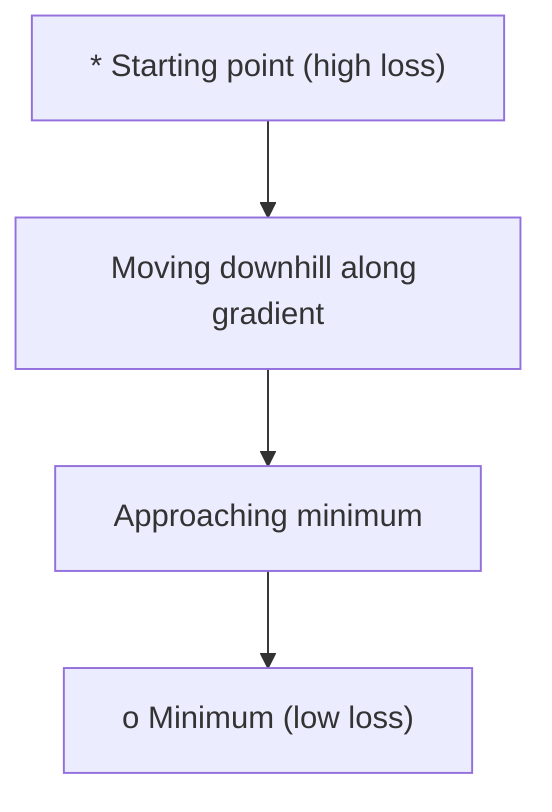
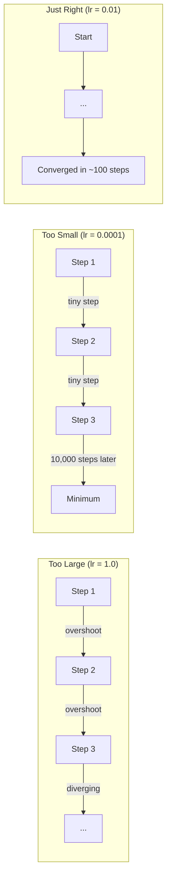
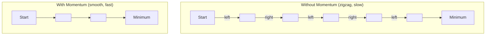
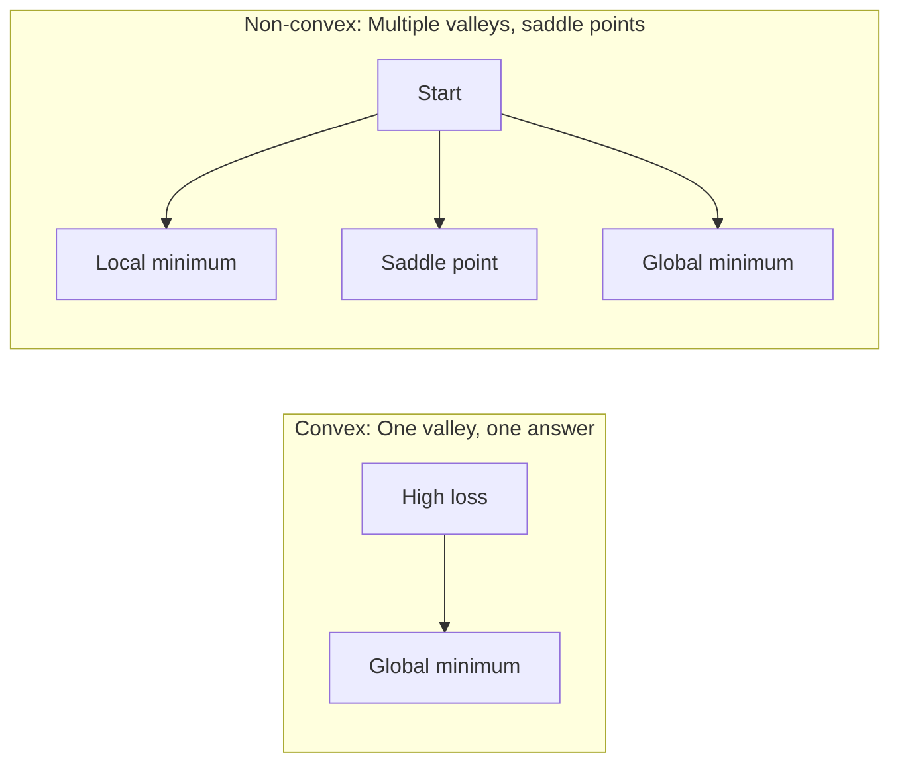
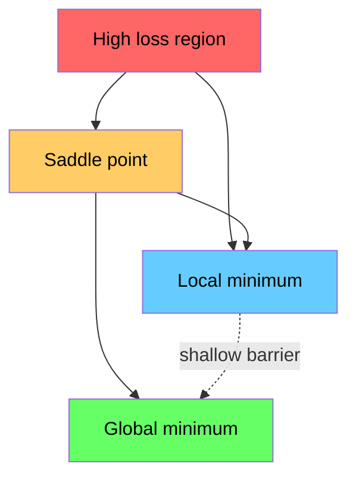

# 최적화 (Optimization)

> 신경망(neural network)을 학습시키는 것은 골짜기의 바닥을 찾는 일에 지나지 않는다.

**Type:** Build
**Language:** Python
**Prerequisites:** Phase 1, Lessons 04-05 (Derivatives, Gradients)
**Time:** ~75분

## 학습 목표 (Learning Objectives)

- 기본 경사 하강법(gradient descent), 모멘텀(momentum)이 있는 SGD, Adam을 밑바닥부터 구현하기
- Rosenbrock 함수에서 옵티마이저(optimizer)의 수렴(convergence)을 비교하고 Adam이 왜 가중치별 학습률(learning rate)을 적응시키는지 설명하기
- 볼록(convex) 손실 지형과 비볼록(non-convex) 손실 지형을 구별하고 고차원에서 안장점(saddle point)의 역할을 설명하기
- 학습 안정성을 위해 학습률 스케줄(스텝 감쇠(step decay), 코사인 어닐링(cosine annealing), 워밍업(warmup)) 구성하기

## 문제 (The Problem)

손실 함수(loss function)가 있다. 모델이 얼마나 틀렸는지 알려준다. 그래디언트(gradient)가 있다. 어느 방향이 손실을 더 나쁘게 만드는지 알려준다. 이제 내리막을 걷는 전략이 필요하다.

순진한 접근법은 간단하다: 그래디언트의 반대로 움직인다. 스텝을 학습률이라는 어떤 숫자로 스케일링한다. 반복한다. 이것이 경사 하강법이고, 동작한다. 하지만 "동작한다"에는 단서가 있다. 학습률이 너무 크면 골짜기를 통째로 지나쳐 벽 사이를 튀어다닌다. 너무 작으면 불필요한 수천 스텝에 걸쳐 답을 향해 기어간다. 안장점에 부딪히면 최솟값을 찾지 못했는데도 움직임을 멈춘다.

딥러닝의 모든 옵티마이저는 같은 질문에 대한 답이다: 어떻게 하면 더 빠르고 더 안정적으로 골짜기 바닥에 도달하는가?

## 개념 (The Concept)

### 최적화가 의미하는 것

최적화는 함수를 최소화(또는 최대화)하는 입력 값을 찾는 것이다. 머신러닝에서 그 함수는 손실이다. 입력은 모델의 가중치(weight)다. 학습이 곧 최적화다.

```
minimize L(w) where:
  L = loss function
  w = model weights (could be millions of parameters)
```

### 경사 하강법 (기본형)

가장 단순한 옵티마이저다. 모든 가중치에 대한 손실의 그래디언트를 계산한다. 각 가중치를 그 그래디언트의 반대 방향으로 움직인다. 스텝을 학습률로 스케일링한다.

```
w = w - lr * gradient
```

이게 알고리즘 전부다. 한 줄.



### 학습률: 가장 중요한 하이퍼파라미터

학습률은 스텝 크기를 제어한다. 수렴에 관한 모든 것을 결정한다.



올바른 학습률에 대한 공식은 없다. 실험으로 찾는다. 흔한 시작점: Adam의 경우 0.001, 모멘텀이 있는 SGD의 경우 0.01.

### SGD vs 배치 vs 미니배치

기본 경사 하강법은 한 스텝을 밟기 전에 전체 데이터셋(dataset)에 대한 그래디언트를 계산한다. 이를 배치 경사 하강법(batch gradient descent)이라 한다. 안정적이지만 느리다.

확률적 경사 하강법(stochastic gradient descent, SGD)은 단일 무작위 샘플에 대한 그래디언트를 계산하고 즉시 스텝을 밟는다. 노이즈가 많지만 빠르다.

미니배치 경사 하강법(mini-batch gradient descent)은 그 차이를 절충한다. 작은 배치(batch)(32, 64, 128, 256개 샘플)에 대한 그래디언트를 계산한 뒤 스텝을 밟는다. 이것이 모두가 실제로 쓰는 방식이다.

| 변형 | 배치 크기 | 그래디언트 품질 | 스텝당 속도 | 노이즈 |
|---------|-----------|-----------------|---------------|-------|
| 배치 GD | 전체 데이터셋 | 정확함 | 느림 | 없음 |
| SGD | 1개 샘플 | 매우 노이즈가 많음 | 빠름 | 높음 |
| 미니배치 | 32-256 | 좋은 추정 | 균형 잡힘 | 보통 |

SGD와 미니배치의 노이즈는 버그가 아니다. 얕은 지역 최솟값(local minima)과 안장점에서 벗어나도록 돕는다.

### 모멘텀: 내리막을 굴러가는 공

기본 경사 하강법은 현재 그래디언트만 본다. 그래디언트가 지그재그로 움직이면(좁은 골짜기에서 흔함) 진행이 느리다. 모멘텀은 과거 그래디언트를 속도(velocity) 항에 누적함으로써 이를 고친다.

```
v = beta * v + gradient
w = w - lr * v
```

비유: 내리막을 굴러가는 공. 공은 모든 요철에서 멈췄다 다시 출발하지 않는다. 일관된 방향으로 속도를 쌓고 진동을 감쇠시킨다.



`beta`(보통 0.9)는 얼마나 많은 이력을 유지할지 제어한다. beta가 높을수록 모멘텀이 더 많고, 경로가 더 매끄럽지만, 방향 변화에 대한 반응이 더 느리다.

### Adam: 적응적 학습률

서로 다른 가중치는 서로 다른 학습률이 필요하다. 큰 그래디언트를 거의 받지 못하는 가중치는 마침내 받았을 때 더 큰 스텝을 밟아야 한다. 끊임없이 거대한 그래디언트를 받는 가중치는 더 작은 스텝을 밟아야 한다.

Adam(Adaptive Moment Estimation)은 가중치별로 두 가지를 추적한다:

1. 1차 모멘트(m): 그래디언트의 이동 평균 (모멘텀과 비슷)
2. 2차 모멘트(v): 그래디언트 제곱의 이동 평균 (그래디언트 크기)

```
m = beta1 * m + (1 - beta1) * gradient
v = beta2 * v + (1 - beta2) * gradient^2

m_hat = m / (1 - beta1^t)    bias correction
v_hat = v / (1 - beta2^t)    bias correction

w = w - lr * m_hat / (sqrt(v_hat) + epsilon)
```

`sqrt(v_hat)`로 나누는 것이 핵심 통찰이다. 큰 그래디언트를 가진 가중치는 큰 수로 나뉜다(작은 유효 스텝). 작은 그래디언트를 가진 가중치는 작은 수로 나뉜다(큰 유효 스텝). 각 가중치는 자신만의 적응적 학습률을 갖는다.

기본 하이퍼파라미터(hyperparameter): `lr=0.001, beta1=0.9, beta2=0.999, epsilon=1e-8`. 이 기본값들은 대부분의 문제에서 잘 동작한다.

### 학습률 스케줄

고정 학습률은 타협이다. 학습 초기에는 빠르게 진전하도록 큰 스텝이 필요하다. 학습 후기에는 최솟값 근처에서 미세 조정하도록 작은 스텝이 필요하다.

흔한 스케줄:

| 스케줄 | 공식 | 사용 사례 |
|----------|---------|----------|
| 스텝 감쇠 (Step decay) | N 에폭마다 lr = lr * factor | 간단함, 수동 제어 |
| 지수 감쇠 (Exponential decay) | lr = lr_0 * decay^t | 부드러운 감소 |
| 코사인 어닐링 (Cosine annealing) | lr = lr_min + 0.5 * (lr_max - lr_min) * (1 + cos(pi * t / T)) | 트랜스포머, 현대적 학습 |
| 워밍업 + 감쇠 (Warmup + decay) | 선형으로 올린 뒤 감쇠 | 대형 모델, 초기 불안정성 방지 |

### 볼록 vs 비볼록

볼록 함수(convex function)는 최솟값이 하나다. 경사 하강법은 항상 그것을 찾는다. `f(x) = x^2` 같은 2차 함수는 볼록이다.

신경망 손실 함수는 비볼록이다. 많은 지역 최솟값, 안장점, 평평한 영역을 갖는다.



실무에서 고차원 신경망의 지역 최솟값은 문제가 되는 경우가 드물다. 대부분의 지역 최솟값은 전역 최솟값(global minimum)에 가까운 손실 값을 갖는다. 안장점(어떤 방향으로는 평평하고 다른 방향으로는 굽은)이 진짜 장애물이다. 모멘텀과 미니배치의 노이즈가 거기서 벗어나도록 돕는다.

### 손실 지형 시각화

손실은 모든 가중치의 함수다. 100만 개 가중치를 가진 모델의 경우, 손실 지형은 1,000,001차원 공간에 존재한다. 우리는 가중치 공간에서 무작위 방향 두 개를 고르고 그 방향들을 따라 손실을 그려 2D 표면을 만들어 시각화한다.



날카로운(sharp) 최솟값은 일반화(generalization)가 나쁘다. 평평한(flat) 최솟값은 일반화가 좋다. 이것이 모멘텀이 있는 SGD가 최종 테스트 정확도에서 Adam을 능가하는 경우가 많은 한 가지 이유다: 그 노이즈가 날카로운 최솟값에 안착하지 못하게 막는다.

## 직접 만들기 (Build It)

### 1단계: 테스트 함수 정의

Rosenbrock 함수는 고전적인 최적화 벤치마크(benchmark)다. 그 최솟값은 (1, 1)에 있는데, 찾기는 쉽지만 따라가기는 어려운 좁고 굽은 골짜기 안에 있다.

```
f(x, y) = (1 - x)^2 + 100 * (y - x^2)^2
```

```python
def rosenbrock(params):
    x, y = params
    return (1 - x) ** 2 + 100 * (y - x ** 2) ** 2

def rosenbrock_gradient(params):
    x, y = params
    df_dx = -2 * (1 - x) + 200 * (y - x ** 2) * (-2 * x)
    df_dy = 200 * (y - x ** 2)
    return [df_dx, df_dy]
```

### 2단계: 기본 경사 하강법

```python
class GradientDescent:
    def __init__(self, lr=0.001):
        self.lr = lr

    def step(self, params, grads):
        return [p - self.lr * g for p, g in zip(params, grads)]
```

### 3단계: 모멘텀이 있는 SGD

```python
class SGDMomentum:
    def __init__(self, lr=0.001, momentum=0.9):
        self.lr = lr
        self.momentum = momentum
        self.velocity = None

    def step(self, params, grads):
        if self.velocity is None:
            self.velocity = [0.0] * len(params)
        self.velocity = [
            self.momentum * v + g
            for v, g in zip(self.velocity, grads)
        ]
        return [p - self.lr * v for p, v in zip(params, self.velocity)]
```

### 4단계: Adam

```python
class Adam:
    def __init__(self, lr=0.001, beta1=0.9, beta2=0.999, epsilon=1e-8):
        self.lr = lr
        self.beta1 = beta1
        self.beta2 = beta2
        self.epsilon = epsilon
        self.m = None
        self.v = None
        self.t = 0

    def step(self, params, grads):
        if self.m is None:
            self.m = [0.0] * len(params)
            self.v = [0.0] * len(params)

        self.t += 1

        self.m = [
            self.beta1 * m + (1 - self.beta1) * g
            for m, g in zip(self.m, grads)
        ]
        self.v = [
            self.beta2 * v + (1 - self.beta2) * g ** 2
            for v, g in zip(self.v, grads)
        ]

        m_hat = [m / (1 - self.beta1 ** self.t) for m in self.m]
        v_hat = [v / (1 - self.beta2 ** self.t) for v in self.v]

        return [
            p - self.lr * mh / (vh ** 0.5 + self.epsilon)
            for p, mh, vh in zip(params, m_hat, v_hat)
        ]
```

### 5단계: 실행하고 비교하기

```python
def optimize(optimizer, func, grad_func, start, steps=5000):
    params = list(start)
    history = [params[:]]
    for _ in range(steps):
        grads = grad_func(params)
        params = optimizer.step(params, grads)
        history.append(params[:])
    return history

start = [-1.0, 1.0]

gd_history = optimize(GradientDescent(lr=0.0005), rosenbrock, rosenbrock_gradient, start)
sgd_history = optimize(SGDMomentum(lr=0.0001, momentum=0.9), rosenbrock, rosenbrock_gradient, start)
adam_history = optimize(Adam(lr=0.01), rosenbrock, rosenbrock_gradient, start)

for name, history in [("GD", gd_history), ("SGD+M", sgd_history), ("Adam", adam_history)]:
    final = history[-1]
    loss = rosenbrock(final)
    print(f"{name:6s} -> x={final[0]:.6f}, y={final[1]:.6f}, loss={loss:.8f}")
```

예상 출력: Adam이 가장 빨리 수렴한다. 모멘텀이 있는 SGD는 더 매끄러운 경로를 따른다. 기본 GD는 좁은 골짜기를 따라 느리게 진전한다.

## 라이브러리로 써보기 (Use It)

실무에서는 PyTorch나 JAX 옵티마이저를 쓴다. 이들은 파라미터 그룹, 가중치 감쇠(weight decay), 그래디언트 클리핑(gradient clipping), GPU 가속을 처리한다.

```python
import torch

model = torch.nn.Linear(784, 10)

sgd = torch.optim.SGD(model.parameters(), lr=0.01, momentum=0.9)
adam = torch.optim.Adam(model.parameters(), lr=0.001)
adamw = torch.optim.AdamW(model.parameters(), lr=0.001, weight_decay=0.01)

scheduler = torch.optim.lr_scheduler.CosineAnnealingLR(adam, T_max=100)
```

경험 법칙:

- Adam(lr=0.001)으로 시작하라. 튜닝 없이 대부분의 문제에서 동작한다.
- 최고의 최종 정확도가 필요하고 더 많은 튜닝을 감당할 수 있으면 모멘텀이 있는 SGD(lr=0.01, momentum=0.9)로 바꿔라.
- 트랜스포머(transformer)에는 AdamW(가중치 감쇠가 분리된 Adam)를 사용하라.
- 몇 에폭(epoch)보다 긴 학습 실행에는 항상 학습률 스케줄을 사용하라.
- 학습이 불안정하면 학습률을 낮춰라. 학습이 너무 느리면 높여라.

## 산출물 (Ship It)

이 레슨은 올바른 옵티마이저를 고르기 위한 프롬프트(prompt)를 만들어낸다. `outputs/prompt-optimizer-guide.md`를 참고하라.

여기서 만든 옵티마이저 클래스는 Phase 3에서 신경망을 밑바닥부터 학습시킬 때 다시 등장한다.

## 연습 문제 (Exercises)

1. **학습률 스윕.** 학습률 [0.0001, 0.0005, 0.001, 0.005, 0.01]로 Rosenbrock 함수에 기본 경사 하강법을 실행하라. 각각에 대해 5000 스텝 후 최종 손실을 그리거나 출력하라. 여전히 수렴하는 가장 큰 학습률을 찾아라.

2. **모멘텀 비교.** 모멘텀 값 [0.0, 0.5, 0.9, 0.99]로 Rosenbrock 함수에 SGD를 실행하라. 매 스텝마다 손실을 추적하라. 어느 모멘텀 값이 가장 빨리 수렴하는가? 어느 것이 지나치는가?

3. **안장점 탈출.** 함수 `f(x, y) = x^2 - y^2`(원점에 안장점)를 정의하라. (0.01, 0.01)에서 시작하라. 기본 GD, 모멘텀이 있는 SGD, Adam이 어떻게 동작하는지 비교하라. 어느 것이 안장점에서 벗어나는가?

4. **학습률 감쇠 구현.** GradientDescent 클래스에 지수 감쇠 스케줄을 추가하라: `lr = lr_0 * 0.999^step`. Rosenbrock 함수에서 감쇠가 있을 때와 없을 때의 수렴을 비교하라.

## 핵심 용어 (Key Terms)

| 용어 | 흔히 하는 말 | 실제 의미 |
|------|----------------|----------------------|
| 경사 하강법 (Gradient descent) | "내리막으로 간다" | 학습률로 스케일링한 그래디언트를 빼서 가중치를 갱신한다. 가장 기본적인 옵티마이저. |
| 학습률 (Learning rate) | "스텝 크기" | 각 갱신이 가중치를 얼마나 멀리 옮기는지 제어하는 스칼라. 너무 크면 발산. 너무 작으면 연산 낭비. |
| 모멘텀 (Momentum) | "계속 굴러간다" | 과거 그래디언트를 속도 벡터에 누적한다. 진동을 감쇠시키고 일관된 방향으로의 이동을 가속한다. |
| SGD (확률적 경사 하강법) | "무작위 샘플링" | 확률적 경사 하강법. 전체 데이터셋 대신 무작위 부분집합에 대해 그래디언트를 계산한다. 실무에서는 거의 항상 미니배치 SGD를 뜻한다. |
| 미니배치 (Mini-batch) | "데이터 한 덩어리" | 그래디언트를 추정하는 데 쓰이는 학습 데이터의 작은 부분집합(32-256개 샘플). 속도와 그래디언트 정확도의 균형을 잡는다. |
| Adam | "기본 옵티마이저" | Adaptive Moment Estimation. 가중치별 그래디언트와 그래디언트 제곱의 이동 평균을 추적해 각 가중치에 자신만의 학습률을 준다. |
| 편향 보정 (Bias correction) | "콜드 스타트를 고친다" | Adam의 1차·2차 모멘트는 0으로 초기화된다. 편향 보정은 초기 스텝 동안 (1 - beta^t)로 나누어 보완한다. |
| 학습률 스케줄 (Learning rate schedule) | "시간에 따라 lr을 바꾼다" | 학습 중에 학습률을 조정하는 함수. 초기에는 큰 스텝, 후기에는 작은 스텝. |
| 볼록 함수 (Convex function) | "하나의 골짜기" | 임의의 지역 최솟값이 전역 최솟값인 함수. 경사 하강법은 항상 그것을 찾는다. 신경망 손실은 볼록이 아니다. |
| 안장점 (Saddle point) | "평평하지만 최솟값이 아닌" | 그래디언트가 0이지만 어떤 방향으로는 최솟값이고 다른 방향으로는 최댓값인 점. 고차원에서 흔하다. |
| 손실 지형 (Loss landscape) | "지형" | 가중치 공간에 걸쳐 그린 손실 함수. 무작위 방향 두 개를 따라 잘라서 시각화한다. |
| 수렴 (Convergence) | "도달하기" | 옵티마이저가 더 스텝을 밟아도 손실을 의미 있게 줄이지 못하는 지점에 도달한 상태. |

## 더 읽을거리 (Further Reading)

- [Sebastian Ruder: An overview of gradient descent optimization algorithms](https://ruder.io/optimizing-gradient-descent/) - 모든 주요 옵티마이저에 대한 포괄적 개관
- [Why Momentum Really Works (Distill)](https://distill.pub/2017/momentum/) - 모멘텀 동역학의 인터랙티브 시각화
- [Adam: A Method for Stochastic Optimization (Kingma & Ba, 2014)](https://arxiv.org/abs/1412.6980) - 원본 Adam 논문, 읽기 쉽고 짧다
- [Visualizing the Loss Landscape of Neural Nets (Li et al., 2018)](https://arxiv.org/abs/1712.09913) - 날카로운 최솟값 대 평평한 최솟값을 보여준 논문
