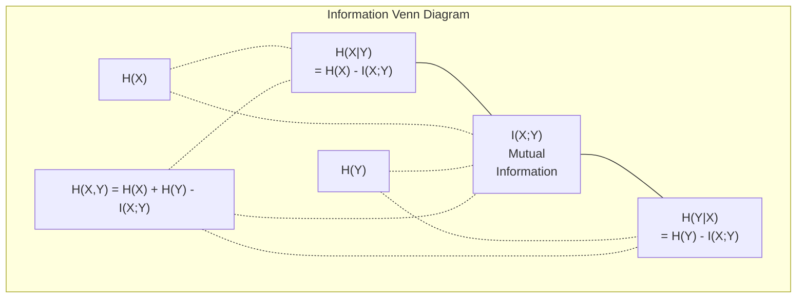

# 정보 이론 (Information Theory)

> 정보 이론(information theory)은 놀라움(surprise)을 측정한다. 손실 함수(loss function)는 그 위에 세워진다.

**Type:** Learn
**Language:** Python
**Prerequisites:** Phase 1, Lesson 06 (Probability)
**Time:** ~60분

## 학습 목표 (Learning Objectives)

- 엔트로피(entropy), 교차 엔트로피(cross-entropy), KL 발산(KL divergence)을 밑바닥부터 계산하고 그 관계를 설명하기
- 교차 엔트로피 손실을 최소화하는 것이 로그 우도(log-likelihood)를 최대화하는 것과 동등한 이유 유도하기
- 특성(feature)과 목표(target) 사이의 상호 정보(mutual information)를 계산해 특성 중요도 순위 매기기
- 퍼플렉서티(perplexity)를 언어 모델이 선택하는 유효 어휘 크기(effective vocabulary size)로 설명하기

## 문제 (The Problem)

학습시키는 모든 분류 모델에서 `CrossEntropyLoss()`를 호출한다. 모든 언어 모델 논문에서 "퍼플렉서티"를 본다. VAE, 증류(distillation), RLHF에서 KL 발산에 대해 읽는다. 이것들은 서로 단절된 개념이 아니다. 모두 다른 모자를 쓴 같은 아이디어다.

정보 이론은 불확실성, 압축, 예측에 대해 추론하는 언어를 준다. Claude Shannon이 통신 문제를 풀기 위해 1948년에 발명했다. 알고 보니, 신경망(neural network)을 학습시키는 것은 통신 문제다: 모델은 학습된 가중치(weight)라는 잡음 많은 채널을 통해 올바른 레이블(label)을 전송하려 애쓰고 있다.

이 레슨은 모든 공식을 밑바닥부터 만들어, 그것들이 어디서 오는지 그리고 왜 동작하는지 볼 수 있게 한다.

## 개념 (The Concept)

### 정보량 (놀라움)

가능성이 낮은 일이 일어나면, 그것은 더 많은 정보를 담는다. 동전이 앞면? 놀랍지 않다. 복권 당첨? 매우 놀랍다.

확률 p를 가진 사건의 정보량(information content)은:

```
I(x) = -log(p(x))
```

밑이 2인 로그를 쓰면 비트(bit)를 얻는다. 자연로그를 쓰면 내트(nat)를 얻는다. 같은 아이디어, 다른 단위다.

```
Event              Probability    Surprise (bits)
Fair coin heads    0.5            1.0
Rolling a 6        0.167          2.58
1-in-1000 event    0.001          9.97
Certain event      1.0            0.0
```

확실한 사건은 정보량이 0이다. 일어날 것을 이미 알고 있었기 때문이다.

### 엔트로피 (평균 놀라움)

엔트로피는 어떤 분포의 가능한 모든 결과에 걸친 기대 놀라움이다.

```
H(P) = -sum( p(x) * log(p(x)) )  for all x
```

공정한 동전은 이진 변수에 대해 최대 엔트로피를 갖는다: 1비트. 편향된 동전(99% 앞면)은 낮은 엔트로피를 갖는다: 0.08비트. 무슨 일이 일어날지 이미 알고 있으므로, 각 던지기는 거의 아무것도 알려주지 않는다.

```
Fair coin:    H = -(0.5 * log2(0.5) + 0.5 * log2(0.5)) = 1.0 bit
Biased coin:  H = -(0.99 * log2(0.99) + 0.01 * log2(0.01)) = 0.08 bits
```

엔트로피는 분포 안의 줄일 수 없는 불확실성을 측정한다. 그 아래로는 압축할 수 없다.

### 교차 엔트로피 (당신이 매일 쓰는 손실 함수)

교차 엔트로피는 실제로는 분포 P에서 오는 사건을 분포 Q로 인코딩할 때의 평균 놀라움을 측정한다.

```
H(P, Q) = -sum( p(x) * log(q(x)) )  for all x
```

P는 참 분포(레이블)다. Q는 당신 모델의 예측이다. Q가 P와 완벽하게 일치하면 교차 엔트로피는 엔트로피와 같아진다. 어떤 불일치든 그것을 더 크게 만든다.

분류에서 P는 원-핫(one-hot) 벡터다(참 클래스는 확률 1, 그 밖의 모든 것은 0). 이는 교차 엔트로피를 다음으로 단순화한다:

```
H(P, Q) = -log(q(true_class))
```

그것이 분류를 위한 교차 엔트로피 손실 공식 전부다. 올바른 클래스의 예측 확률을 최대화하라.

### KL 발산 (분포 사이의 거리)

KL 발산은 P 대신 Q를 사용함으로써 얼마나 많은 추가 놀라움을 얻는지 측정한다.

```
D_KL(P || Q) = sum( p(x) * log(p(x) / q(x)) )  for all x
             = H(P, Q) - H(P)
```

교차 엔트로피는 엔트로피 더하기 KL 발산이다. 참 분포의 엔트로피는 학습 중에 상수이므로, 교차 엔트로피를 최소화하는 것은 KL 발산을 최소화하는 것과 같다. 당신은 모델의 분포를 참 분포 쪽으로 밀고 있는 것이다.

KL 발산은 대칭이 아니다: D_KL(P || Q) != D_KL(Q || P). 진정한 거리 척도가 아니다.

### 상호 정보 (Mutual Information)

상호 정보는 한 변수를 아는 것이 다른 변수에 대해 얼마나 알려주는지 측정한다.

```
I(X; Y) = H(X) - H(X|Y)
        = H(X) + H(Y) - H(X, Y)
```

X와 Y가 독립이면 상호 정보는 0이다. 한쪽을 알아도 다른 쪽에 대해 아무것도 알 수 없다. 완벽하게 상관되어 있으면 상호 정보는 둘 중 어느 변수의 엔트로피와 같다.

특성 선택에서, 특성과 목표 사이의 높은 상호 정보는 그 특성이 유용함을 뜻한다. 낮은 상호 정보는 그것이 노이즈임을 뜻한다.

### 조건부 엔트로피 (Conditional Entropy)

H(Y|X)는 X를 관측한 후 Y에 대해 얼마나 많은 불확실성이 남는지 측정한다.

```
H(Y|X) = H(X,Y) - H(X)
```

두 극단:
- X가 Y를 완전히 결정하면 H(Y|X) = 0이다. X를 아는 것이 Y에 대한 모든 불확실성을 제거한다. 예: X = 섭씨 온도, Y = 화씨 온도.
- X가 Y에 대해 아무것도 알려주지 않으면 H(Y|X) = H(Y)다. X를 아는 것이 불확실성을 전혀 줄이지 않는다. 예: X = 동전 던지기, Y = 내일 날씨.

조건부 엔트로피는 항상 음이 아니며 결코 H(Y)를 넘지 않는다:

```
0 <= H(Y|X) <= H(Y)
```

머신러닝에서 조건부 엔트로피는 결정 트리(decision tree)에 나타난다. 각 분할에서 알고리즘은 H(Y|X)를 최소화하는 특성 X를 고른다 — 레이블 Y에 대한 불확실성을 가장 많이 제거하는 특성.

### 결합 엔트로피 (Joint Entropy)

H(X,Y)는 X와 Y를 함께 본 결합 분포의 엔트로피다.

```
H(X,Y) = -sum sum p(x,y) * log(p(x,y))   for all x, y
```

핵심 성질:

```
H(X,Y) <= H(X) + H(Y)
```

등호는 X와 Y가 독립일 때 성립한다. 둘이 정보를 공유하면, 결합 엔트로피는 개별 엔트로피의 합보다 작다. 그 "사라진" 엔트로피가 정확히 상호 정보다.



관계들:
- H(X,Y) = H(X) + H(Y|X) = H(Y) + H(X|Y)
- I(X;Y) = H(X) - H(X|Y) = H(Y) - H(Y|X)
- H(X,Y) = H(X) + H(Y) - I(X;Y)

### 상호 정보 (심화)

상호 정보 I(X;Y)는 한 변수를 아는 것이 다른 변수에 대한 불확실성을 얼마나 줄이는지 정량화한다.

```
I(X;Y) = H(X) - H(X|Y)
       = H(Y) - H(Y|X)
       = H(X) + H(Y) - H(X,Y)
       = sum sum p(x,y) * log(p(x,y) / (p(x) * p(y)))
```

성질:
- I(X;Y) >= 0 항상. 무언가를 관측해서 정보를 잃는 일은 결코 없다.
- I(X;Y) = 0은 X와 Y가 독립일 때 그리고 오직 그때만 성립한다.
- I(X;Y) = I(Y;X). KL 발산과 달리 대칭이다.
- I(X;X) = H(X). 변수는 자신과 모든 정보를 공유한다.

**특성 선택을 위한 상호 정보.** ML에서는 목표에 대해 정보를 주는 특성을 원한다. 상호 정보는 특성 순위를 매기는 원칙적인 방법을 준다:

1. 각 특성 X_i에 대해, Y가 목표 변수일 때 I(X_i; Y)를 계산한다.
2. MI 점수로 특성 순위를 매긴다.
3. 상위 k개 특성을 남긴다.

이는 특성과 목표 사이의 어떤 관계에도 동작한다 — 선형, 비선형, 단조든 아니든. 상관관계는 선형 관계만 잡는다. MI는 모든 것을 잡는다.

| 방법 | 탐지 대상 | 계산 비용 | 범주형 처리 가능? |
|--------|---------|-------------------|---------------------|
| 피어슨 상관 | 선형 관계 | O(n) | 아니오 |
| 스피어만 상관 | 단조 관계 | O(n log n) | 아니오 |
| 상호 정보량 | 모든 통계적 의존성 | 비닝 시 O(n log n) | 예 |

### 레이블 평활화와 교차 엔트로피

표준 분류는 하드 타깃(hard target)을 사용한다: [0, 0, 1, 0]. 참 클래스는 확률 1을 받고, 그 밖의 모든 것은 0을 받는다. 레이블 평활화(label smoothing)는 이를 소프트 타깃(soft target)으로 대체한다:

```
soft_target = (1 - epsilon) * hard_target + epsilon / num_classes
```

epsilon = 0.1이고 클래스가 4개일 때:
- 하드 타깃:  [0, 0, 1, 0]
- 소프트 타깃:  [0.025, 0.025, 0.925, 0.025]

정보 이론 관점에서, 레이블 평활화는 목표 분포의 엔트로피를 높인다. 하드 원-핫 타깃은 엔트로피가 0이다 — 불확실성이 없다. 소프트 타깃은 양의 엔트로피를 갖는다.

이것이 도움이 되는 이유:
- 모델이 로짓(logits)을 극단적인 값으로 몰아가는 것을 막는다(교차 엔트로피하에서 원-핫 타깃을 완벽하게 맞추려면 무한대 로짓이 필요하다)
- 정규화(regularization)로 작용한다: 모델이 100% 확신할 수 없다
- 보정(calibration)을 개선한다: 예측 확률이 참 불확실성을 더 잘 반영한다
- 학습과 추론 동작 사이의 간극을 줄인다

레이블 평활화가 있는 교차 엔트로피 손실은 다음이 된다:

```
L = (1 - epsilon) * CE(hard_target, prediction) + epsilon * H_uniform(prediction)
```

두 번째 항은 균등에서 멀리 떨어진 예측에 페널티를 준다 — 확신에 대한 직접적인 정규화다.

### 교차 엔트로피가 바로 그 분류 손실인 이유

세 가지 관점, 같은 결론.

**정보 이론 관점.** 교차 엔트로피는 참 분포 대신 모델의 분포를 사용함으로써 낭비하는 비트 수를 측정한다. 이를 최소화하면 모델이 현실의 가장 효율적인 인코더가 된다.

**최대 우도 관점.** 참 클래스 y_i를 가진 N개 학습 샘플에 대해:

```
Likelihood     = product( q(y_i) )
Log-likelihood = sum( log(q(y_i)) )
Negative log-likelihood = -sum( log(q(y_i)) )
```

그 마지막 줄이 교차 엔트로피 손실이다. 교차 엔트로피를 최소화하는 것 = 당신의 모델 하에서 학습 데이터의 우도를 최대화하는 것.

**그래디언트 관점.** 로짓에 대한 교차 엔트로피의 그래디언트(gradient)는 단순히 (predicted - true)다. 깔끔하고, 안정적이며, 계산이 빠르다. 이것이 소프트맥스(softmax)와 완벽하게 짝을 이루는 이유다.

### 비트 vs 내트

유일한 차이는 로그의 밑이다.

```
log base 2   -> bits      (information theory tradition)
log base e   -> nats      (machine learning convention)
log base 10  -> hartleys  (rarely used)
```

1 내트 = 1/ln(2) 비트 = 1.4427 비트. PyTorch와 TensorFlow는 기본적으로 자연로그(내트)를 사용한다.

### 퍼플렉서티 (Perplexity)

퍼플렉서티는 교차 엔트로피의 지수다. 모델이 그 사이에서 불확실해하는, 동등하게 가능한 선택지의 유효 개수를 알려준다.

```
Perplexity = 2^H(P,Q)   (if using bits)
Perplexity = e^H(P,Q)   (if using nats)
```

퍼플렉서티 50인 언어 모델은 평균적으로 50개의 가능한 다음 토큰(token) 중에서 균등하게 골라야 하는 것만큼 혼란스럽다. 낮을수록 좋다.

GPT-2는 일반적인 벤치마크(benchmark)에서 퍼플렉서티 ~30을 달성했다. 현대 모델은 잘 표현된 도메인에서 한 자릿수다.

## 직접 만들기 (Build It)

### 1단계: 정보량과 엔트로피

```python
import math

def information_content(p, base=2):
    if p <= 0 or p > 1:
        return float('inf') if p <= 0 else 0.0
    return -math.log(p) / math.log(base)

def entropy(probs, base=2):
    return sum(
        p * information_content(p, base)
        for p in probs if p > 0
    )

fair_coin = [0.5, 0.5]
biased_coin = [0.99, 0.01]
fair_die = [1/6] * 6

print(f"Fair coin entropy:   {entropy(fair_coin):.4f} bits")
print(f"Biased coin entropy: {entropy(biased_coin):.4f} bits")
print(f"Fair die entropy:    {entropy(fair_die):.4f} bits")
```

### 2단계: 교차 엔트로피와 KL 발산

```python
def cross_entropy(p, q, base=2):
    total = 0.0
    for pi, qi in zip(p, q):
        if pi > 0:
            if qi <= 0:
                return float('inf')
            total += pi * (-math.log(qi) / math.log(base))
    return total

def kl_divergence(p, q, base=2):
    return cross_entropy(p, q, base) - entropy(p, base)

true_dist = [0.7, 0.2, 0.1]
good_model = [0.6, 0.25, 0.15]
bad_model = [0.1, 0.1, 0.8]

print(f"Entropy of true dist:     {entropy(true_dist):.4f} bits")
print(f"CE (good model):          {cross_entropy(true_dist, good_model):.4f} bits")
print(f"CE (bad model):           {cross_entropy(true_dist, bad_model):.4f} bits")
print(f"KL divergence (good):     {kl_divergence(true_dist, good_model):.4f} bits")
print(f"KL divergence (bad):      {kl_divergence(true_dist, bad_model):.4f} bits")
```

### 3단계: 분류 손실로서의 교차 엔트로피

```python
def softmax(logits):
    max_logit = max(logits)
    exps = [math.exp(z - max_logit) for z in logits]
    total = sum(exps)
    return [e / total for e in exps]

def cross_entropy_loss(true_class, logits):
    probs = softmax(logits)
    return -math.log(probs[true_class])

logits = [2.0, 1.0, 0.1]
true_class = 0

probs = softmax(logits)
loss = cross_entropy_loss(true_class, logits)

print(f"Logits:      {logits}")
print(f"Softmax:     {[f'{p:.4f}' for p in probs]}")
print(f"True class:  {true_class}")
print(f"Loss:        {loss:.4f} nats")
print(f"Perplexity:  {math.exp(loss):.2f}")
```

### 4단계: 교차 엔트로피는 음의 로그 우도와 같다

```python
import random

random.seed(42)

n_samples = 1000
n_classes = 3
true_labels = [random.randint(0, n_classes - 1) for _ in range(n_samples)]
model_logits = [[random.gauss(0, 1) for _ in range(n_classes)] for _ in range(n_samples)]

ce_loss = sum(
    cross_entropy_loss(label, logits)
    for label, logits in zip(true_labels, model_logits)
) / n_samples

nll = -sum(
    math.log(softmax(logits)[label])
    for label, logits in zip(true_labels, model_logits)
) / n_samples

print(f"Cross-entropy loss:      {ce_loss:.6f}")
print(f"Negative log-likelihood: {nll:.6f}")
print(f"Difference:              {abs(ce_loss - nll):.2e}")
```

### 5단계: 상호 정보

```python
def mutual_information(joint_probs, base=2):
    rows = len(joint_probs)
    cols = len(joint_probs[0])

    margin_x = [sum(joint_probs[i][j] for j in range(cols)) for i in range(rows)]
    margin_y = [sum(joint_probs[i][j] for i in range(rows)) for j in range(cols)]

    mi = 0.0
    for i in range(rows):
        for j in range(cols):
            pxy = joint_probs[i][j]
            if pxy > 0:
                mi += pxy * math.log(pxy / (margin_x[i] * margin_y[j])) / math.log(base)
    return mi

independent = [[0.25, 0.25], [0.25, 0.25]]
dependent = [[0.45, 0.05], [0.05, 0.45]]

print(f"MI (independent): {mutual_information(independent):.4f} bits")
print(f"MI (dependent):   {mutual_information(dependent):.4f} bits")
```

## 라이브러리로 써보기 (Use It)

NumPy를 사용한 같은 개념들, 실무에서 쓰게 될 방식:

```python
import numpy as np

def np_entropy(p):
    p = np.asarray(p, dtype=float)
    mask = p > 0
    result = np.zeros_like(p)
    result[mask] = p[mask] * np.log(p[mask])
    return -result.sum()

def np_cross_entropy(p, q):
    p, q = np.asarray(p, dtype=float), np.asarray(q, dtype=float)
    mask = p > 0
    return -(p[mask] * np.log(q[mask])).sum()

def np_kl_divergence(p, q):
    return np_cross_entropy(p, q) - np_entropy(p)

true = np.array([0.7, 0.2, 0.1])
pred = np.array([0.6, 0.25, 0.15])
print(f"Entropy:    {np_entropy(true):.4f} nats")
print(f"Cross-ent:  {np_cross_entropy(true, pred):.4f} nats")
print(f"KL div:     {np_kl_divergence(true, pred):.4f} nats")
```

당신은 `torch.nn.CrossEntropyLoss()`가 내부적으로 하는 일을 밑바닥부터 만들었다. 이제 학습 중에 왜 손실이 내려가는지 안다: 당신 모델의 예측 분포가 참 분포에 더 가까워지고 있으며, 이는 낭비된 정보의 내트로 측정된다.

## 연습 문제 (Exercises)

1. 균등 분포를 가정하고 영어 알파벳(26개 문자)의 엔트로피를 계산하라. 그다음 실제 문자 빈도를 사용해 추정하라. 어느 것이 더 높으며 그 이유는?

2. 어떤 모델이 참 클래스가 1인 샘플에 대해 로짓 [5.0, 2.0, 0.5]를 출력한다. 교차 엔트로피 손실을 손으로 계산한 뒤, `cross_entropy_loss` 함수로 검증하라. 어떤 로짓이 손실을 0으로 만드는가?

3. KL 발산이 대칭이 아님을 보여라. 두 분포 P와 Q를 골라 D_KL(P || Q)와 D_KL(Q || P)를 계산하라. 왜 다른지 설명하라.

4. 토큰 예측 시퀀스에 대한 퍼플렉서티를 계산하는 함수를 만들어라. (true_token_index, predicted_logits) 쌍의 리스트가 주어졌을 때, 그 시퀀스의 퍼플렉서티를 반환하라.

## 핵심 용어 (Key Terms)

| 용어 | 흔히 하는 말 | 실제 의미 |
|------|----------------|----------------------|
| 정보량 (Information content) | "놀라움" | 사건을 인코딩하는 데 필요한 비트(또는 내트)의 수: -log(p) |
| 엔트로피 (Entropy) | "무작위성" | 분포의 모든 결과에 걸친 평균 놀라움. 줄일 수 없는 불확실성을 측정한다. |
| 교차 엔트로피 (Cross-entropy) | "손실 함수" | 참 분포 P에서 온 사건을 모델 분포 Q로 인코딩할 때의 평균 놀라움. |
| KL 발산 (KL divergence) | "분포 사이의 거리" | P 대신 Q를 사용함으로써 낭비되는 추가 비트. 교차 엔트로피 빼기 엔트로피와 같다. 대칭이 아니다. |
| 상호 정보량 (Mutual information) | "X와 Y가 얼마나 관련되어 있나" | Y를 아는 것으로부터 X에 대한 불확실성이 줄어드는 양. 0이면 독립이다. |
| 소프트맥스 (Softmax) | "로짓을 확률로 바꾼다" | 지수화하고 정규화한다. 임의의 실수 값 벡터를 유효한 확률 분포로 매핑한다. |
| 퍼플렉서티 (Perplexity) | "모델이 얼마나 혼란스러운가" | 교차 엔트로피의 지수. 모델이 각 스텝에서 선택하는 유효 어휘 크기. |
| 비트 (Bits) | "Shannon의 단위" | 밑이 2인 로그로 측정한 정보. 1비트는 공정한 동전 던지기 하나를 결정한다. |
| 내트 (Nats) | "ML의 단위" | 자연로그로 측정한 정보. PyTorch와 TensorFlow가 기본적으로 사용한다. |
| 음의 로그 우도 (Negative log-likelihood) | "NLL 손실" | 원-핫 레이블에 대해 교차 엔트로피 손실과 동일하다. 이를 최소화하면 올바른 예측의 확률을 최대화한다. |

## 더 읽을거리 (Further Reading)

- [Shannon 1948: A Mathematical Theory of Communication](https://people.math.harvard.edu/~ctm/home/text/others/shannon/entropy/entropy.pdf) - 원본 논문, 지금도 읽을 만하다
- [Visual Information Theory (Chris Olah)](https://colah.github.io/posts/2015-09-Visual-Information/) - 엔트로피와 KL 발산에 대한 최고의 시각적 설명
- [PyTorch CrossEntropyLoss docs](https://pytorch.org/docs/stable/generated/torch.nn.CrossEntropyLoss.html) - 프레임워크가 방금 당신이 만든 것을 어떻게 구현하는지
