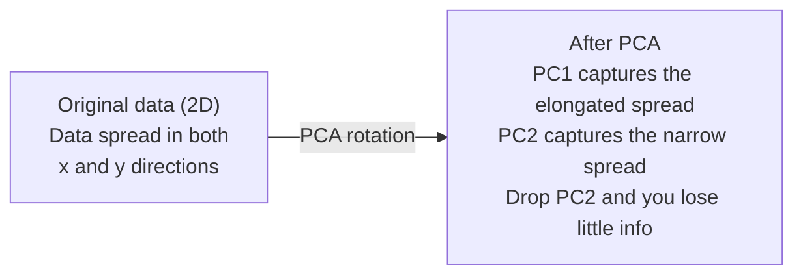

# 차원 축소 (Dimensionality Reduction)

> 고차원 데이터에는 구조가 있다. 올바른 각도에서 바라봄으로써 그것을 찾는다.

**Type:** Build
**Language:** Python
**Prerequisites:** Phase 1, Lessons 01 (Linear Algebra Intuition), 02 (Vectors, Matrices & Operations), 03 (Eigenvalues & Eigenvectors), 06 (Probability & Distributions)
**Time:** ~90분

## 학습 목표 (Learning Objectives)

- PCA를 밑바닥부터 구현하기: 데이터 중심화, 공분산 행렬(covariance matrix) 계산, 고윳값 분해(eigendecomposition), 사영(projection)
- 설명된 분산 비율(explained variance ratio)과 엘보(elbow) 방법으로 주성분(principal component) 개수 선택하기
- MNIST 숫자를 2D로 시각화하기 위해 PCA, t-SNE, UMAP를 비교하고 그 트레이드오프(trade-off) 설명하기
- 표준 PCA가 다룰 수 없는 비선형 데이터 구조를 분리하기 위해 RBF 커널을 사용한 커널 PCA(kernel PCA) 적용하기

## 문제 (The Problem)

샘플당 784개 특성(feature)을 가진 데이터셋(dataset)이 있다. 손글씨 숫자의 픽셀 값일 수도 있고, 유전자 발현 수준일 수도 있고, 사용자 행동 신호일 수도 있다. 784차원은 시각화할 수 없다. 그릴 수 없다. 심지어 머릿속에 떠올릴 수도 없다.

하지만 그 784개 특성은 대부분 중복이다. 실제 정보는 훨씬 작은 표면 위에 산다. 손글씨 "7"을 묘사하는 데 784개의 독립적인 숫자가 필요하지는 않다. 몇 개면 된다: 획의 각도, 가로 막대의 길이, 얼마나 기울어졌는지. 나머지는 노이즈다.

차원 축소(dimensionality reduction)는 그 작은 표면을 찾는다. 784차원 데이터를 받아, 중요한 구조를 유지하면서 2차원, 10차원, 또는 50차원으로 압축한다.

## 개념 (The Concept)

### 차원의 저주

고차원 공간은 직관에 반한다. 차원이 커지면 세 가지가 무너진다.

**거리가 무의미해진다.** 고차원에서 임의의 두 점 사이의 거리는 같은 값으로 수렴(convergence)한다. 모든 점이 다른 모든 점에서 대략 같은 거리에 있으면, 최근접 이웃(nearest-neighbor) 검색이 동작을 멈춘다.

```
Dimension    Avg distance ratio (max/min between random points)
2            ~5.0
10           ~1.8
100          ~1.2
1000         ~1.02
```

**부피가 구석에 집중된다.** d차원의 단위 초입방체(hypercube)는 2^d개의 구석을 갖는다. 100차원에서는 거의 모든 부피가 중심에서 멀리 떨어진 구석에 있다. 데이터 포인트는 가장자리로 퍼지고, 모델은 내부에서 데이터에 굶주린다.

**지수적으로 더 많은 데이터가 필요하다.** 공간에서 같은 샘플 밀도를 유지하려면, 2D에서 20D로 갈 때 데이터가 10^18배 더 많아야 한다. 결코 충분하지 않다. 차원을 줄이면 데이터 밀도가 다룰 만한 수준으로 되돌아온다.

### PCA: 중요한 방향을 찾기

주성분 분석(Principal Component Analysis, PCA)은 데이터가 가장 많이 변하는 축들을 찾는다. 첫 번째 축이 가장 많은 분산(variance)을 포착하고, 두 번째 축이 그다음 많은 분산을 포착하는 식으로 좌표계를 회전시킨다.

알고리즘:

```
1. Center the data        (subtract the mean from each feature)
2. Compute covariance     (how features move together)
3. Eigendecomposition     (find the principal directions)
4. Sort by eigenvalue     (biggest variance first)
5. Project               (keep top k eigenvectors, drop the rest)
```

왜 고윳값 분해인가? 공분산 행렬은 대칭이고 양의 준정부호(positive semi-definite)다. 그 고유벡터(eigenvector)는 특성 공간에서 직교하는 방향들이다. 고윳값(eigenvalue)은 각 방향이 얼마나 많은 분산을 포착하는지 알려준다. 가장 큰 고윳값을 가진 고유벡터가 최대 분산 방향을 가리킨다.



- **PCA 이전:** 데이터 구름이 x축과 y축에 걸쳐 대각선으로 퍼져 있다
- **PCA 이후:** PC1이 최대 분산 방향(길게 늘어진 퍼짐)에 정렬되고 PC2가 최소 분산 방향(좁은 퍼짐)에 정렬되도록 좌표계가 회전된다
- **차원 축소:** PC2를 버리면 데이터를 PC1에 사영하게 되어, 정보를 거의 잃지 않는다

### 설명된 분산 비율

각 주성분은 전체 분산의 일부를 포착한다. 설명된 분산 비율은 그것이 얼마인지 알려준다.

```
Component    Eigenvalue    Explained ratio    Cumulative
PC1          4.73          0.473              0.473
PC2          2.51          0.251              0.724
PC3          1.12          0.112              0.836
PC4          0.89          0.089              0.925
...
```

누적 설명된 분산이 0.95에 도달하면, 그만큼의 성분이 정보의 95%를 포착한다는 뜻이다. 그 이후의 것은 대부분 노이즈다.

### 성분 개수 선택

세 가지 전략:

1. **임계값.** 분산의 90-95%를 설명하기에 충분한 성분을 남긴다.
2. **엘보 방법.** 성분별 설명된 분산을 그린다. 급격한 하락을 찾는다.
3. **다운스트림 성능.** PCA를 전처리로 사용한다. k를 스윕(sweep)하며 모델의 정확도를 측정한다. 최선의 k는 정확도가 평탄해지는 지점이다.

### t-SNE: 이웃 관계를 보존하기

t-분포 확률적 이웃 임베딩(t-Distributed Stochastic Neighbor Embedding, t-SNE)은 시각화를 위해 설계되었다. 어떤 점들이 서로 가까운지 보존하면서 고차원 데이터를 2D(또는 3D)로 매핑한다.

직관: 원래 공간에서 점 쌍들의 거리에 기반해 확률 분포를 계산한다. 가까운 점은 높은 확률을 받고, 먼 점은 낮은 확률을 받는다. 그다음 같은 확률 분포가 성립하는 2D 배치를 찾는다. 784차원에서 이웃이었던 점들은 2D에서도 이웃으로 남는다.

t-SNE의 핵심 성질:
- 비선형. PCA가 할 수 없는 복잡한 매니폴드(manifold)를 펼칠 수 있다.
- 확률적. 실행할 때마다 다른 레이아웃을 만든다.
- 퍼플렉서티(perplexity) 파라미터가 몇 개의 이웃을 고려할지 제어한다(일반적 범위: 5-50).
- 출력에서 클러스터 사이의 거리는 의미가 없다. 오직 클러스터 자체만 의미가 있다.
- 큰 데이터셋에서 느리다. 기본적으로 O(n^2).

### UMAP: 더 빠르고 전역 구조가 더 좋음

균등 매니폴드 근사 및 사영(Uniform Manifold Approximation and Projection, UMAP)은 t-SNE와 비슷하게 동작하지만 두 가지 장점이 있다:
- 더 빠르다. 모든 쌍별 거리를 계산하는 대신 근사 최근접 이웃 그래프를 사용한다.
- 전역 구조가 더 낫다. 출력에서 클러스터의 상대적 위치가 t-SNE보다 더 의미 있는 경향이 있다.

UMAP은 고차원 공간에서 가중 그래프("퍼지 위상 표현")를 만든 뒤, 이 그래프를 가능한 한 잘 보존하는 저차원 레이아웃을 찾는다.

핵심 파라미터:
- `n_neighbors`: 몇 개의 이웃이 국소 구조를 정의하는지(퍼플렉서티와 유사). 값이 높을수록 더 많은 전역 구조를 보존한다.
- `min_dist`: 출력에서 점들이 얼마나 빽빽하게 모이는지. 값이 낮을수록 더 밀집된 클러스터를 만든다.

### 어느 것을 언제 쓰는가

| 방법 | 사용 사례 | 보존하는 것 | 속도 |
|--------|----------|-----------|-------|
| PCA | 학습 전 전처리 | 전역 분산 | 빠름 (정확), 수백만 샘플에서 동작 |
| PCA | 빠른 탐색적 시각화 | 선형 구조 | 빠름 |
| t-SNE | 출판 품질의 2D 플롯 | 국소 이웃 | 느림 (1만 샘플 미만이 이상적) |
| UMAP | 대규모 2D 시각화 | 국소 + 일부 전역 구조 | 중간 (수백만 처리) |
| PCA | 모델을 위한 특성 축소 | 분산 순위 특성 | 빠름 |
| t-SNE / UMAP | 클러스터 구조 이해 | 클러스터 분리 | 중간에서 느림 |

경험 법칙: 전처리와 데이터 압축에는 PCA를 쓴다. 2D에서 구조를 시각화해야 할 때는 t-SNE나 UMAP을 쓴다.

### 커널 PCA

표준 PCA는 선형 부분공간을 찾는다. 좌표계를 회전시키고 축을 버린다. 하지만 데이터가 비선형 매니폴드 위에 놓여 있다면? 2D의 원은 어떤 직선으로도 분리할 수 없다. 표준 PCA는 도움이 되지 않는다.

커널 PCA는 커널 함수가 유도하는 고차원 특성 공간에서 PCA를 적용하되, 그 공간에서의 좌표를 명시적으로 계산하지 않는다. 이것이 커널 트릭(kernel trick)이다 — SVM 뒤에 있는 것과 같은 아이디어다.

알고리즘:
1. K_ij = k(x_i, x_j)인 커널 행렬 K를 계산한다
2. 특성 공간에서 커널 행렬을 중심화한다
3. 중심화된 커널 행렬을 고윳값 분해한다
4. 상위 고유벡터들(1/sqrt(고윳값)로 스케일링된)이 사영이다

흔한 커널 함수:

| 커널 | 공식 | 적합한 경우 |
|--------|---------|----------|
| RBF (가우시안) | exp(-gamma * \|\|x - y\|\|^2) | 대부분의 비선형 데이터, 부드러운 매니폴드 |
| 다항 (Polynomial) | (x . y + c)^d | 다항 관계 |
| 시그모이드 (Sigmoid) | tanh(alpha * x . y + c) | 신경망 같은 매핑 |

커널 PCA를 표준 PCA 대신 언제 쓰는가:

| 기준 | 표준 PCA | 커널 PCA |
|-----------|-------------|------------|
| 데이터 구조 | 선형 부분공간 | 비선형 매니폴드 |
| 속도 | O(min(n^2 d, d^2 n)) | O(n^2 d + n^3) |
| 해석 가능성 | 성분이 특성의 선형 결합 | 성분에 직접적인 특성 해석이 없음 |
| 확장성 | 수백만 샘플에서 동작 | 커널 행렬이 n x n, 메모리 제약 |
| 재구성 | 직접 역변환 | 사전 이미지(pre-image) 근사가 필요 |

고전적인 예시: 2D의 동심원. 두 개의 점 고리가 있고, 하나가 다른 하나 안에 있다. 표준 PCA는 둘 다 같은 직선에 사영한다 — 분류에는 쓸모없다. RBF 커널을 사용한 커널 PCA는 안쪽 원과 바깥쪽 원을 서로 다른 영역으로 매핑하여, 선형 분리가 가능하게 만든다.

### 재구성 오차 (Reconstruction Error)

차원 축소가 얼마나 잘 됐는지 어떻게 아는가? 784차원을 50차원으로 압축했다. 무엇을 잃었는가?

재구성 오차(reconstruction error)를 측정한다:
1. 데이터를 k차원으로 사영한다: X_reduced = X @ W_k
2. 재구성한다: X_hat = X_reduced @ W_k^T
3. MSE를 계산한다: mean((X - X_hat)^2)

PCA의 경우, 재구성 오차는 설명된 분산과 깔끔한 관계를 갖는다:

```
Reconstruction error = sum of eigenvalues NOT included
Total variance = sum of ALL eigenvalues
Fraction lost = (sum of dropped eigenvalues) / (sum of all eigenvalues)
```

각 성분의 설명된 분산 비율은 다음과 같다:

```
explained_ratio_k = eigenvalue_k / sum(all eigenvalues)
```

성분 개수에 대해 누적 설명된 분산을 그리면 "엘보" 곡선이 나온다. 올바른 성분 개수는 다음 지점이다:
- 곡선이 평탄해지는 곳(수익 체감)
- 누적 분산이 임계값(보통 0.90 또는 0.95)을 넘는 곳
- 다운스트림 작업 성능이 평탄해지는 곳

재구성 오차는 k를 고르는 것 이상으로 유용하다. 이상 탐지(anomaly detection)에도 쓸 수 있다: 재구성 오차가 높은 샘플은 학습된 부분공간에 맞지 않는 이상치(outlier)다. 이것이 프로덕션(production) 시스템에서 PCA 기반 이상 탐지의 토대다.

## 직접 만들기 (Build It)

### 1단계: 밑바닥부터 만드는 PCA

```python
import numpy as np

class PCA:
    def __init__(self, n_components):
        self.n_components = n_components
        self.components = None
        self.mean = None
        self.eigenvalues = None
        self.explained_variance_ratio_ = None

    def fit(self, X):
        self.mean = np.mean(X, axis=0)
        X_centered = X - self.mean

        cov_matrix = np.cov(X_centered, rowvar=False)

        eigenvalues, eigenvectors = np.linalg.eigh(cov_matrix)

        sorted_idx = np.argsort(eigenvalues)[::-1]
        eigenvalues = eigenvalues[sorted_idx]
        eigenvectors = eigenvectors[:, sorted_idx]

        self.components = eigenvectors[:, :self.n_components].T
        self.eigenvalues = eigenvalues[:self.n_components]
        total_var = np.sum(eigenvalues)
        self.explained_variance_ratio_ = self.eigenvalues / total_var

        return self

    def transform(self, X):
        X_centered = X - self.mean
        return X_centered @ self.components.T

    def fit_transform(self, X):
        self.fit(X)
        return self.transform(X)
```

### 2단계: 합성 데이터로 테스트

```python
np.random.seed(42)
n_samples = 500

t = np.random.uniform(0, 2 * np.pi, n_samples)
x1 = 3 * np.cos(t) + np.random.normal(0, 0.2, n_samples)
x2 = 3 * np.sin(t) + np.random.normal(0, 0.2, n_samples)
x3 = 0.5 * x1 + 0.3 * x2 + np.random.normal(0, 0.1, n_samples)

X_synthetic = np.column_stack([x1, x2, x3])

pca = PCA(n_components=2)
X_reduced = pca.fit_transform(X_synthetic)

print(f"Original shape: {X_synthetic.shape}")
print(f"Reduced shape:  {X_reduced.shape}")
print(f"Explained variance ratios: {pca.explained_variance_ratio_}")
print(f"Total variance captured: {sum(pca.explained_variance_ratio_):.4f}")
```

### 3단계: MNIST 숫자를 2D로

```python
from sklearn.datasets import fetch_openml

mnist = fetch_openml("mnist_784", version=1, as_frame=False, parser="auto")
X_mnist = mnist.data[:5000].astype(float)
y_mnist = mnist.target[:5000].astype(int)

pca_mnist = PCA(n_components=50)
X_pca50 = pca_mnist.fit_transform(X_mnist)
print(f"50 components capture {sum(pca_mnist.explained_variance_ratio_):.2%} of variance")

pca_2d = PCA(n_components=2)
X_pca2d = pca_2d.fit_transform(X_mnist)
print(f"2 components capture {sum(pca_2d.explained_variance_ratio_):.2%} of variance")
```

### 4단계: sklearn과 비교

```python
from sklearn.decomposition import PCA as SklearnPCA
from sklearn.manifold import TSNE

sklearn_pca = SklearnPCA(n_components=2)
X_sklearn_pca = sklearn_pca.fit_transform(X_mnist)

print(f"\nOur PCA explained variance:     {pca_2d.explained_variance_ratio_}")
print(f"Sklearn PCA explained variance: {sklearn_pca.explained_variance_ratio_}")

diff = np.abs(np.abs(X_pca2d) - np.abs(X_sklearn_pca))
print(f"Max absolute difference: {diff.max():.10f}")

tsne = TSNE(n_components=2, perplexity=30, random_state=42)
X_tsne = tsne.fit_transform(X_mnist)
print(f"\nt-SNE output shape: {X_tsne.shape}")
```

### 5단계: UMAP 비교

```python
try:
    from umap import UMAP

    reducer = UMAP(n_components=2, n_neighbors=15, min_dist=0.1, random_state=42)
    X_umap = reducer.fit_transform(X_mnist)
    print(f"UMAP output shape: {X_umap.shape}")
except ImportError:
    print("Install umap-learn: pip install umap-learn")
```

## 라이브러리로 써보기 (Use It)

분류기 이전의 전처리로서의 PCA:

```python
from sklearn.decomposition import PCA as SklearnPCA
from sklearn.linear_model import LogisticRegression
from sklearn.model_selection import train_test_split
from sklearn.metrics import accuracy_score

X_train, X_test, y_train, y_test = train_test_split(
    X_mnist, y_mnist, test_size=0.2, random_state=42
)

results = {}
for k in [10, 30, 50, 100, 200]:
    pca_k = SklearnPCA(n_components=k)
    X_tr = pca_k.fit_transform(X_train)
    X_te = pca_k.transform(X_test)

    clf = LogisticRegression(max_iter=1000, random_state=42)
    clf.fit(X_tr, y_train)
    acc = accuracy_score(y_test, clf.predict(X_te))
    var_captured = sum(pca_k.explained_variance_ratio_)
    results[k] = (acc, var_captured)
    print(f"k={k:>3d}  accuracy={acc:.4f}  variance={var_captured:.4f}")
```

성능은 784차원에 한참 못 미쳐서 평탄해진다. 그 평탄해지는 지점이 작동점이다.

## 산출물 (Ship It)

이 레슨이 만들어내는 것:
- `outputs/skill-dimensionality-reduction.md` - 주어진 작업에 맞는 차원 축소 기법을 고르는 스킬

## 연습 문제 (Exercises)

1. `inverse_transform`을 지원하도록 PCA 클래스를 수정하라. 10, 50, 200개 성분으로 MNIST 숫자를 재구성하라. 각각에 대해 재구성 오차(원본과의 평균 제곱 차이)를 출력하라.

2. 퍼플렉서티 값 5, 30, 100으로 같은 MNIST 부분집합에 t-SNE를 실행하라. 출력이 어떻게 변하는지 묘사하라. 퍼플렉서티가 왜 클러스터 밀집도에 영향을 주는가?

3. 50개 특성 중 5개만 정보를 주는 데이터셋을 가져와라(`sklearn.datasets.make_classification`으로 하나 생성하라). PCA를 적용하고 설명된 분산 곡선이 데이터가 사실상 5차원임을 올바르게 식별하는지 확인하라.

## 핵심 용어 (Key Terms)

| 용어 | 흔히 하는 말 | 실제 의미 |
|------|----------------|----------------------|
| 차원의 저주 (Curse of dimensionality) | "특성이 너무 많다" | 차원이 커지면서 거리, 부피, 데이터 밀도가 모두 직관에 반하게 동작한다. 모델은 보완하기 위해 지수적으로 더 많은 데이터가 필요하다. |
| PCA (주성분 분석) | "차원을 줄인다" | 축이 최대 분산 방향에 정렬되도록 좌표계를 회전한 뒤, 저분산 축을 버린다. |
| 주성분 (Principal component) | "중요한 방향" | 공분산 행렬의 고유벡터. 데이터가 가장 많이 변하는 특성 공간의 방향. |
| 설명된 분산 비율 (Explained variance ratio) | "이 성분이 가진 정보량" | 한 주성분이 포착하는 전체 분산의 비율. 상위 k개 비율을 더하면 k개 성분이 얼마나 보존하는지 알 수 있다. |
| 공분산 행렬 (Covariance matrix) | "특성들이 어떻게 상관되는가" | 항목 (i,j)가 특성 i와 특성 j가 함께 움직이는 정도를 재는 대칭 행렬. 대각 항목은 개별 분산이다. |
| t-SNE | "그 클러스터 그림" | 쌍별 이웃 확률을 보존하여 고차원 데이터를 2D로 매핑하는 비선형 방법. 시각화에는 좋지만 전처리에는 적합하지 않다. |
| UMAP | "더 빠른 t-SNE" | 위상적 데이터 분석에 기반한 비선형 방법. 국소 구조와 일부 전역 구조를 모두 보존한다. t-SNE보다 확장성이 좋다. |
| 퍼플렉서티 (Perplexity) | "t-SNE 손잡이" | 각 점이 고려하는 유효 이웃 수를 제어한다. 낮은 퍼플렉서티는 매우 국소적인 구조에 집중한다. 높은 퍼플렉서티는 더 넓은 패턴을 포착한다. |
| 매니폴드 (Manifold) | "데이터가 사는 표면" | 더 높은 차원 공간에 묻힌 더 낮은 차원의 표면. 3D에서 구겨진 종이 한 장은 2D 매니폴드다. |

## 더 읽을거리 (Further Reading)

- [A Tutorial on Principal Component Analysis](https://arxiv.org/abs/1404.1100) (Shlens) - 밑바닥부터 하는 PCA의 명료한 유도
- [How to Use t-SNE Effectively](https://distill.pub/2016/misread-tsne/) (Wattenberg et al.) - t-SNE의 함정과 파라미터 선택에 대한 인터랙티브 가이드
- [UMAP documentation](https://umap-learn.readthedocs.io/) - UMAP 저자들의 이론과 실용적 안내
