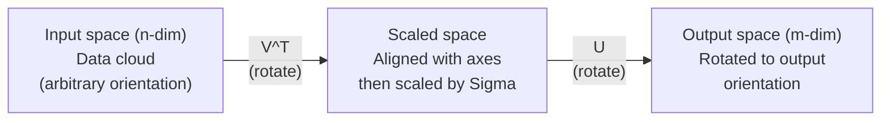
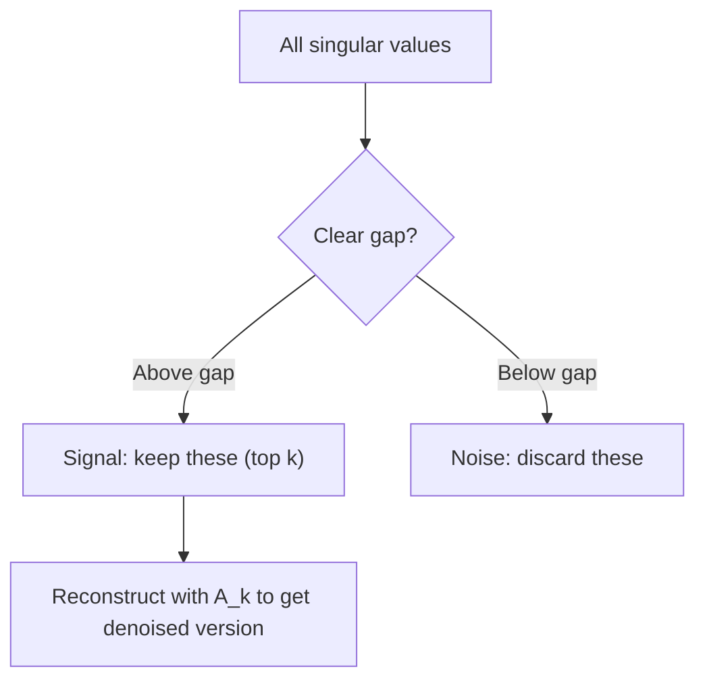

# 특이값 분해 (Singular Value Decomposition)

> SVD는 선형대수의 맥가이버 칼이다. 모든 행렬에 하나씩 있다. 모든 데이터 과학자에게 하나씩 필요하다.

**Type:** Build
**Languages:** Python, Julia
**Prerequisites:** Phase 1, Lessons 01 (Linear Algebra Intuition), 02 (Vectors & Matrices Operations), 03 (Matrix Transformations)
**Time:** ~120분

## 학습 목표 (Learning Objectives)

- 거듭제곱 반복(power iteration)을 통해 SVD를 구현하고 U, Sigma, V^T의 기하학적 의미 설명하기
- 이미지 압축에 절단 SVD(truncated SVD)를 적용하고 압축률 대 재구성 오차(reconstruction error)를 측정하기
- 과결정(overdetermined) 최소제곱 시스템을 풀기 위해 SVD로 무어-펜로즈 유사역행렬(Moore-Penrose pseudoinverse) 계산하기
- SVD를 PCA, 추천 시스템(잠재 인자(latent factor)), NLP의 잠재 의미 분석(Latent Semantic Analysis)과 연결하기

## 문제 (The Problem)

1000x2000 행렬(matrix)이 있다. 사용자-영화 평점일 수도 있다. 문서-용어 빈도 표일 수도 있다. 이미지의 픽셀 값일 수도 있다. 이를 압축하거나, 노이즈를 제거하거나, 그 안의 숨겨진 구조를 찾거나, 그것으로 최소제곱 시스템을 풀어야 한다. 고윳값 분해(eigendecomposition)는 정사각 행렬에서만 동작한다. 그마저도 행렬에 선형 독립인 고유벡터(eigenvector)의 완전한 집합이 있어야 한다.

SVD는 어떤 행렬에서도 동작한다. 어떤 모양이든. 어떤 랭크(rank)든. 조건 없다. 행렬이 공간에 무엇을 하는지의 기하를 드러내는 세 인자로 행렬을 분해한다. 선형대수 전체에서 가장 일반적이고 가장 유용한 분해다.

## 개념 (The Concept)

### SVD가 기하학적으로 하는 일

모든 행렬은 모양과 상관없이 순서대로 세 연산을 수행한다: 회전, 스케일링, 회전. SVD는 이 분해를 명시적으로 만든다.

```
A = U * Sigma * V^T

      m x n     m x m    m x n    n x n
     (any)    (rotate)  (scale)  (rotate)
```

임의의 행렬 A가 주어지면, SVD는 그것을 다음으로 분해한다:
- V^T는 입력 공간(n차원)에서 벡터를 회전한다
- Sigma는 각 축을 따라 스케일링한다(늘이거나 압축한다)
- U는 결과를 출력 공간(m차원)으로 회전한다



이렇게 생각하라. SVD에 행렬을 건넨다. 그것은 알려준다: "이 행렬은 입력의 구(sphere)를 받아, 먼저 V^T로 회전하고, 그다음 Sigma로 타원체(ellipsoid)로 늘이고, 그다음 그 타원체를 U로 회전한다." 특이값(singular value)은 그 타원체 축들의 길이다.

### 완전한 분해

모양이 m x n인 행렬 A에 대해:

```
A = U * Sigma * V^T

where:
  U     is m x m, orthogonal (U^T U = I)
  Sigma is m x n, diagonal (singular values on the diagonal)
  V     is n x n, orthogonal (V^T V = I)

The singular values sigma_1 >= sigma_2 >= ... >= sigma_r > 0
where r = rank(A)
```

U의 열들을 좌특이벡터(left singular vector)라 한다. V의 열들을 우특이벡터(right singular vector)라 한다. Sigma의 대각 항목들을 특이값이라 한다. 이들은 항상 음이 아니며 관례적으로 내림차순으로 정렬된다.

### 좌특이벡터, 특이값, 우특이벡터

SVD의 각 성분은 뚜렷한 기하학적 의미를 갖는다.

**우특이벡터(V의 열):** 이들은 입력 공간(R^n)의 정규직교 기저(orthonormal basis)를 이룬다. 행렬이 출력 공간의 직교 방향으로 매핑하는 입력 공간의 방향들이다. 정의역(domain)의 자연스러운 좌표계로 생각하면 된다.

**특이값(Sigma의 대각):** 이들은 스케일링 인자다. i번째 특이값은 행렬이 i번째 우특이벡터를 따라 벡터를 얼마나 늘이는지 알려준다. 특이값이 0이라는 것은 행렬이 그 방향을 완전히 짓뭉갠다는 뜻이다.

**좌특이벡터(U의 열):** 이들은 출력 공간(R^m)의 정규직교 기저를 이룬다. i번째 좌특이벡터는 i번째 우특이벡터가 (스케일링 후) 도달하는 출력 공간의 방향이다.

이들 사이의 관계:

```
A * v_i = sigma_i * u_i

The matrix A takes the i-th right singular vector v_i,
scales it by sigma_i, and maps it to the i-th left singular vector u_i.
```

임의의 행렬이 무엇을 하는지 좌표 단위로 그려 보여주는 셈이다.

### 외적 형태 (Outer product form)

SVD는 랭크-1 행렬들의 합으로 쓸 수 있다:

```
A = sigma_1 * u_1 * v_1^T + sigma_2 * u_2 * v_2^T + ... + sigma_r * u_r * v_r^T

Each term sigma_i * u_i * v_i^T is a rank-1 matrix (an outer product).
The full matrix is the sum of r such matrices, where r is the rank.
```

이 형태가 저랭크 근사(low-rank approximation)의 토대다. 각 항은 구조의 한 층을 더한다. 첫 항은 가장 중요한 단일 패턴을 포착한다. 둘째 항은 그다음으로 중요한 것을 포착한다. 이런 식이다. 이 합을 절단하면 주어진 임의의 랭크에서 가능한 최선의 근사를 얻는다.

```
Rank-1 approx:    A_1 = sigma_1 * u_1 * v_1^T
                  (captures the dominant pattern)

Rank-2 approx:    A_2 = sigma_1 * u_1 * v_1^T + sigma_2 * u_2 * v_2^T
                  (captures the two most important patterns)

Rank-k approx:    A_k = sum of top k terms
                  (optimal by the Eckart-Young theorem)
```

### 고윳값 분해와의 관계

SVD와 고윳값 분해는 깊이 연결되어 있다. A의 특이값과 특이벡터는 A^T A와 A A^T의 고윳값(eigenvalue)과 고유벡터에서 직접 나온다.

```
A^T A = V * Sigma^T * U^T * U * Sigma * V^T
      = V * Sigma^T * Sigma * V^T
      = V * D * V^T

where D = Sigma^T * Sigma is a diagonal matrix with sigma_i^2 on the diagonal.

So:
- The right singular vectors (V) are eigenvectors of A^T A
- The singular values squared (sigma_i^2) are eigenvalues of A^T A

Similarly:
A A^T = U * Sigma * V^T * V * Sigma^T * U^T
      = U * Sigma * Sigma^T * U^T

So:
- The left singular vectors (U) are eigenvectors of A A^T
- The eigenvalues of A A^T are also sigma_i^2
```

이 연결은 세 가지를 알려준다:
1. 특이값은 항상 실수이고 음이 아니다(양의 준정부호(positive semi-definite) 행렬의 고윳값의 제곱근이다).
2. A^T A의 고윳값 분해를 통해 SVD를 계산할 수 있지만, 이는 조건수(condition number)를 제곱하여 수치 정밀도를 잃는다. 전용 SVD 알고리즘은 이를 피한다.
3. A가 정사각이고 대칭 양의 준정부호일 때, SVD와 고윳값 분해는 같은 것이다.

### 절단 SVD: 저랭크 근사

에카르트-영-미르스키(Eckart-Young-Mirsky) 정리는 A에 대한 최선의 랭크-k 근사가(프로베니우스(Frobenius) 노름과 스펙트럴(spectral) 노름 모두에서) 상위 k개 특이값과 그에 대응하는 벡터만 남김으로써 얻어진다고 말한다:

```
A_k = U_k * Sigma_k * V_k^T

where:
  U_k     is m x k  (first k columns of U)
  Sigma_k is k x k  (top-left k x k block of Sigma)
  V_k     is n x k  (first k columns of V)

Approximation error = sigma_{k+1}  (in spectral norm)
                    = sqrt(sigma_{k+1}^2 + ... + sigma_r^2)  (in Frobenius norm)
```

이는 그저 "좋은" 근사가 아니다. 증명 가능하게 랭크 k의 가능한 최선의 근사다. 다른 어떤 랭크-k 행렬도 A에 더 가깝지 않다.

| 성분 | 상대 크기 | 랭크-3 근사에 유지? |
|-----------|-------------------|------------------------|
| sigma_1 | 가장 큼 | 예 |
| sigma_2 | 큼 | 예 |
| sigma_3 | 중간-큼 | 예 |
| sigma_4 | 중간 | 아니오 (오차) |
| sigma_5 | 중간-작음 | 아니오 (오차) |
| sigma_6 | 작음 | 아니오 (오차) |
| sigma_7 | 매우 작음 | 아니오 (오차) |
| sigma_8 | 극히 작음 | 아니오 (오차) |

상위 3개 유지: A_3은 가장 큰 세 특이값을 포착한다. 오차 = 나머지 값들(sigma_4부터 sigma_8까지).

특이값이 빠르게 감쇠하면 작은 k가 행렬 대부분을 포착한다. 느리게 감쇠하면 행렬에 저랭크 구조가 없다.

### SVD를 이용한 이미지 압축

흑백 이미지는 픽셀 강도의 행렬이다. 800x600 이미지는 480,000개 값을 갖는다. SVD는 훨씬 적은 값으로 그것을 근사할 수 있게 한다.

```
Original image: 800 x 600 = 480,000 values

SVD with rank k:
  U_k:      800 x k values
  Sigma_k:  k values
  V_k:      600 x k values
  Total:    k * (800 + 600 + 1) = k * 1401 values

  k=10:   14,010 values   (2.9% of original)
  k=50:   70,050 values  (14.6% of original)
  k=100: 140,100 values  (29.2% of original)

  The compression ratio improves as k gets smaller,
  but visual quality degrades.
```

핵심 통찰: 자연 이미지는 빠르게 감쇠하는 특이값을 갖는다. 처음 몇 개의 특이값은 큰 구조(형태, 그래디언트)를 포착한다. 나중 것들은 미세한 디테일과 노이즈를 포착한다. 랭크 50에서 절단하면 흔히 원본과 거의 똑같아 보이는 이미지를 85% 적은 저장 공간으로 만든다.

### 추천 시스템을 위한 SVD

넷플릭스 프라이즈(Netflix Prize)로 이 방법이 널리 알려졌다. 대부분의 항목이 비어 있는 사용자-영화 평점 행렬이 있다.

```
             Movie1  Movie2  Movie3  Movie4  Movie5
  User1      [  5      ?       3       ?       1  ]
  User2      [  ?      4       ?       2       ?  ]
  User3      [  3      ?       5       ?       ?  ]
  User4      [  ?      ?       ?       4       3  ]

  ? = unknown rating
```

아이디어: 이 평점 행렬은 저랭크다. 사용자들은 완전히 독립적인 취향을 갖지 않는다. 대부분의 선호를 설명하는 소수의 잠재 인자(액션 대 드라마, 옛날 대 최신, 지적 대 감각적)가 있다.

(채워진) 평점 행렬에 대한 SVD는 그것을 다음으로 분해한다:
- U: 잠재 인자 공간에서의 사용자 프로필
- Sigma: 각 잠재 인자의 중요도
- V^T: 잠재 인자 공간에서의 영화 프로필

특정 영화에 대한 사용자의 예측 평점은 그 사용자 프로필과 영화 프로필의 내적(특이값으로 가중된)이다. 저랭크 근사가 빠진 항목들을 채운다.

실무에서는 빠진 데이터를 직접 다루는 사이먼 펑크(Simon Funk)의 점진적 SVD나 ALS(교대 최소제곱, alternating least squares) 같은 변형을 사용한다. 하지만 핵심 아이디어는 같다: SVD를 통한 잠재 인자 분해.

### NLP에서의 SVD: 잠재 의미 분석

잠재 의미 분석(Latent Semantic Analysis, LSA), 잠재 의미 색인(Latent Semantic Indexing, LSI)이라고도 불리는 것은, 용어-문서 행렬에 SVD를 적용한다.

```
             Doc1   Doc2   Doc3   Doc4
  "cat"      [  3      0      1      0  ]
  "dog"      [  2      0      0      1  ]
  "fish"     [  0      4      1      0  ]
  "pet"      [  1      1      1      1  ]
  "ocean"    [  0      3      0      0  ]

After SVD with rank k=2:

  Each document becomes a point in 2D "concept space."
  Each term becomes a point in the same 2D space.
  Documents about similar topics cluster together.
  Terms with similar meanings cluster together.

  "cat" and "dog" end up near each other (land pets).
  "fish" and "ocean" end up near each other (water concepts).
  Doc1 and Doc3 cluster if they share similar topics.
```

LSA는 원시 텍스트로부터 의미적 유사도를 포착한 최초의 성공적인 방법 중 하나였다. 동의어 용어들은 비슷한 문서에 나타나는 경향이 있어 SVD가 그것들을 같은 잠재 차원으로 묶기 때문에 동작한다. 현대의 단어 임베딩(embedding)(Word2Vec, GloVe)은 이 아이디어의 후손으로 볼 수 있다.

### 노이즈 제거를 위한 SVD

노이즈 많은 데이터는 신호가 상위 특이값에 집중되어 있고 노이즈는 모든 특이값에 퍼져 있다. 절단은 노이즈 바닥(noise floor)을 제거한다.

**깨끗한 신호의 특이값:**

| 성분 | 크기 | 유형 |
|-----------|-----------|------|
| sigma_1 | 매우 큼 | 신호 |
| sigma_2 | 큼 | 신호 |
| sigma_3 | 중간 | 신호 |
| sigma_4 | 0에 가까움 | 무시 가능 |
| sigma_5 | 0에 가까움 | 무시 가능 |

**노이즈 많은 신호의 특이값(노이즈가 모든 것에 더해짐):**

| 성분 | 크기 | 유형 |
|-----------|-----------|------|
| sigma_1 | 매우 큼 | 신호 |
| sigma_2 | 큼 | 신호 |
| sigma_3 | 중간 | 신호 |
| sigma_4 | 작음 | 노이즈 |
| sigma_5 | 작음 | 노이즈 |
| sigma_6 | 작음 | 노이즈 |
| sigma_7 | 작음 | 노이즈 |



이는 신호 처리, 과학적 측정, 데이터 정제에 사용된다. 가법 노이즈로 오염된 행렬이 있을 때마다, 절단 SVD는 신호와 노이즈를 분리하는 원칙적인 방법이다.

### SVD를 통한 유사역행렬

무어-펜로즈 유사역행렬 A+는 행렬 역연산을 비정사각 및 특이 행렬로 일반화한다. SVD는 그것의 계산을 사소하게 만든다.

```
If A = U * Sigma * V^T, then:

A+ = V * Sigma+ * U^T

where Sigma+ is formed by:
  1. Transpose Sigma (swap rows and columns)
  2. Replace each non-zero diagonal entry sigma_i with 1/sigma_i
  3. Leave zeros as zeros

For A (m x n):      A+ is (n x m)
For Sigma (m x n):  Sigma+ is (n x m)
```

유사역행렬은 최소제곱 문제를 푼다. Ax = b가 정확한 해를 갖지 않으면(과결정 시스템), x = A+ b가 최소제곱 해다(||Ax - b||를 최소화한다).

```
Overdetermined system (more equations than unknowns):

  [1  1]         [3]
  [2  1] x   =   [5]       No exact solution exists.
  [3  1]         [6]

  x_ls = A+ b = V * Sigma+ * U^T * b

  This gives the x that minimizes the sum of squared residuals.
  Same result as the normal equations (A^T A)^(-1) A^T b,
  but numerically more stable.
```

### 수치 안정성 장점

A^T A의 고윳값 분해를 계산하면 특이값을 제곱한다(A^T A의 고윳값은 sigma_i^2다). 이는 조건수를 제곱하여 수치 오차를 증폭한다.

```
Example:
  A has singular values [1000, 1, 0.001]
  Condition number of A: 1000 / 0.001 = 10^6

  A^T A has eigenvalues [10^6, 1, 10^{-6}]
  Condition number of A^T A: 10^6 / 10^{-6} = 10^{12}

  Computing SVD directly: works with condition number 10^6
  Computing via A^T A:     works with condition number 10^{12}
                           (6 extra digits of precision lost)
```

현대 SVD 알고리즘(골럽-카한(Golub-Kahan) 이중대각화)은 A에 직접 작용하며, A^T A를 결코 형성하지 않는다. 이것이 항상 `np.linalg.eig(A.T @ A)`보다 `np.linalg.svd(A)`를 선호해야 하는 이유다.

### PCA와의 연결

PCA는 중심화된 데이터에 대한 SVD다. 이는 비유가 아니다. 말 그대로 같은 계산이다.

```
Given data matrix X (n_samples x n_features), centered (mean subtracted):

Covariance matrix: C = (1/(n-1)) * X^T X

PCA finds eigenvectors of C. But:

  X = U * Sigma * V^T    (SVD of X)

  X^T X = V * Sigma^2 * V^T

  C = (1/(n-1)) * V * Sigma^2 * V^T

So the principal components are exactly the right singular vectors V.
The explained variance for each component is sigma_i^2 / (n-1).

In sklearn, PCA is implemented using SVD, not eigendecomposition.
It is faster and more numerically stable.
```

이는 Lesson 10에서 차원 축소에 대해 배운 모든 것이 내부적으로 SVD임을 뜻한다. PCA는 머신러닝에서 SVD의 가장 흔한 응용이다.

## 직접 만들기 (Build It)

### 1단계: 거듭제곱 반복을 사용한 밑바닥부터의 SVD

아이디어: 가장 큰 특이값과 그 벡터들을 찾으려면 A^T A(또는 A A^T)에 거듭제곱 반복을 사용한다. 그다음 행렬을 디플레이션(deflate)하고 다음 특이값에 대해 반복한다.

```python
import numpy as np

def power_iteration(M, num_iters=100):
    n = M.shape[1]
    v = np.random.randn(n)
    v = v / np.linalg.norm(v)

    for _ in range(num_iters):
        Mv = M @ v
        v = Mv / np.linalg.norm(Mv)

    eigenvalue = v @ M @ v
    return eigenvalue, v

def svd_from_scratch(A, k=None):
    m, n = A.shape
    if k is None:
        k = min(m, n)

    sigmas = []
    us = []
    vs = []

    A_residual = A.copy().astype(float)

    for _ in range(k):
        AtA = A_residual.T @ A_residual
        eigenvalue, v = power_iteration(AtA, num_iters=200)

        if eigenvalue < 1e-10:
            break

        sigma = np.sqrt(eigenvalue)
        u = A_residual @ v / sigma

        sigmas.append(sigma)
        us.append(u)
        vs.append(v)

        A_residual = A_residual - sigma * np.outer(u, v)

    U = np.column_stack(us) if us else np.empty((m, 0))
    S = np.array(sigmas)
    V = np.column_stack(vs) if vs else np.empty((n, 0))

    return U, S, V
```

### 2단계: 테스트하고 NumPy와 비교

```python
np.random.seed(42)
A = np.random.randn(5, 4)

U_ours, S_ours, V_ours = svd_from_scratch(A)
U_np, S_np, Vt_np = np.linalg.svd(A, full_matrices=False)

print("Our singular values:", np.round(S_ours, 4))
print("NumPy singular values:", np.round(S_np, 4))

A_reconstructed = U_ours @ np.diag(S_ours) @ V_ours.T
print(f"Reconstruction error: {np.linalg.norm(A - A_reconstructed):.8f}")
```

### 3단계: 이미지 압축 데모

```python
def compress_image_svd(image_matrix, k):
    U, S, Vt = np.linalg.svd(image_matrix, full_matrices=False)
    compressed = U[:, :k] @ np.diag(S[:k]) @ Vt[:k, :]
    return compressed

image = np.random.seed(42)
rows, cols = 200, 300
image = np.random.randn(rows, cols)

for k in [1, 5, 10, 20, 50]:
    compressed = compress_image_svd(image, k)
    error = np.linalg.norm(image - compressed) / np.linalg.norm(image)
    original_size = rows * cols
    compressed_size = k * (rows + cols + 1)
    ratio = compressed_size / original_size
    print(f"k={k:>3d}  error={error:.4f}  storage={ratio:.1%}")
```

### 4단계: 노이즈 제거

```python
np.random.seed(42)
clean = np.outer(np.sin(np.linspace(0, 4*np.pi, 100)),
                 np.cos(np.linspace(0, 2*np.pi, 80)))
noise = 0.3 * np.random.randn(100, 80)
noisy = clean + noise

U, S, Vt = np.linalg.svd(noisy, full_matrices=False)
denoised = U[:, :5] @ np.diag(S[:5]) @ Vt[:5, :]

print(f"Noisy error:    {np.linalg.norm(noisy - clean):.4f}")
print(f"Denoised error: {np.linalg.norm(denoised - clean):.4f}")
print(f"Improvement:    {(1 - np.linalg.norm(denoised - clean) / np.linalg.norm(noisy - clean)):.1%}")
```

### 5단계: 유사역행렬

```python
A = np.array([[1, 1], [2, 1], [3, 1]], dtype=float)
b = np.array([3, 5, 6], dtype=float)

U, S, Vt = np.linalg.svd(A, full_matrices=False)
S_inv = np.diag(1.0 / S)
A_pinv = Vt.T @ S_inv @ U.T

x_svd = A_pinv @ b
x_lstsq = np.linalg.lstsq(A, b, rcond=None)[0]
x_pinv = np.linalg.pinv(A) @ b

print(f"SVD pseudoinverse solution:  {x_svd}")
print(f"np.linalg.lstsq solution:   {x_lstsq}")
print(f"np.linalg.pinv solution:    {x_pinv}")
```

## 라이브러리로 써보기 (Use It)

완전히 동작하는 데모는 `code/svd.py`에 있다. 실행하면 이미지 압축, 추천 시스템, 잠재 의미 분석, 노이즈 제거에 적용된 SVD를 볼 수 있다.

```bash
python svd.py
```

`code/svd.jl`의 Julia 버전은 Julia의 네이티브 `svd()` 함수와 `LinearAlgebra` 패키지를 사용해 같은 개념을 시연한다.

```bash
julia svd.jl
```

## 산출물 (Ship It)

이 레슨이 만들어내는 것:
- `outputs/skill-svd.md` - 실제 프로젝트에서 언제 어떻게 SVD를 적용할지 아는 스킬

## 연습 문제 (Exercises)

1. 거듭제곱 반복을 사용하지 않고 완전한 SVD를 밑바닥부터 구현하라. 대신 A^T A의 고윳값 분해를 계산해 V와 특이값을 얻은 뒤, U = A V Sigma^{-1}를 계산하라. 거듭제곱 반복 버전 및 NumPy와 수치 정확도를 비교하라.

2. 실제 흑백 이미지를 불러오라(또는 하나를 흑백으로 변환하라). 랭크 1, 5, 10, 25, 50, 100에서 압축하라. 각 랭크에 대해 압축률과 상대 오차를 계산하라. 이미지가 시각적으로 받아들일 만해지는 랭크를 찾아라.

3. 작은 추천 시스템을 만들어라. 일부 알려진 항목을 가진 10x8 사용자-영화 평점 행렬을 만들어라. 빠진 항목을 행 평균으로 채워라. SVD를 계산하고 랭크-3 근사를 재구성하라. 재구성된 행렬을 사용해 빠진 평점을 예측하라. 예측이 합리적인지 검증하라.

4. 3개의 합성 주제를 가진 100x50 문서-용어 행렬을 만들어라. 각 주제는 5개의 연관 용어를 갖는다. 노이즈를 더하라. SVD를 적용하고 상위 3개 특이값이 나머지보다 훨씬 큰지 검증하라. 문서를 3D 잠재 공간에 사영하고 같은 주제의 문서들이 함께 클러스터를 이루는지 확인하라.

5. 깨끗한 저랭크 행렬(랭크 3, 크기 50x40)을 생성하고 서로 다른 수준의 가우시안 노이즈(sigma = 0.1, 0.5, 1.0, 2.0)를 더하라. 각 노이즈 수준에 대해, k를 1부터 40까지 스윕하며 깨끗한 행렬에 대한 재구성 오차를 측정하여 최적 절단 랭크를 찾아라. 최적 k가 노이즈 수준에 따라 어떻게 변하는지 그려라.

## 핵심 용어 (Key Terms)

| 용어 | 흔히 하는 말 | 실제 의미 |
|------|----------------|----------------------|
| SVD (특이값 분해) | "어떤 행렬이든 분해한다" | A를 U Sigma V^T로 분해한다. U와 V는 직교이고 Sigma는 음이 아닌 항목을 가진 대각이다. 어떤 모양의 어떤 행렬에도 동작한다. |
| 특이값 (Singular value) | "이 성분이 얼마나 중요한가" | Sigma의 i번째 대각 항목. 행렬이 i번째 주방향을 따라 얼마나 늘이는지 측정한다. 항상 음이 아니며 내림차순으로 정렬된다. |
| 좌특이벡터 (Left singular vector) | "출력 방향" | U의 한 열. i번째 우특이벡터가 (sigma_i로 스케일링된 후) 매핑되는 출력 공간의 방향. |
| 우특이벡터 (Right singular vector) | "입력 방향" | V의 한 열. 행렬이 (sigma_i로 스케일링한 후) i번째 좌특이벡터로 매핑하는 입력 공간의 방향. |
| 절단 SVD (Truncated SVD) | "저랭크 근사" | 상위 k개 특이값과 그 벡터들만 남긴다. 원래 행렬에 대한 증명 가능한 최선의 랭크-k 근사를 만든다(에카르트-영 정리). |
| 랭크 (Rank) | "진정한 차원성" | 0이 아닌 특이값의 개수. 행렬이 실제로 사용하는 독립 방향의 수를 알려준다. |
| 의사역행렬 (Pseudoinverse) | "일반화된 역행렬" | V Sigma+ U^T. 0이 아닌 특이값을 역으로 만들고 0은 0으로 둔다. 비정사각 또는 특이 행렬의 최소제곱 문제를 푼다. |
| 조건수 (Condition number) | "오차에 얼마나 민감한가" | sigma_max / sigma_min. 큰 조건수는 작은 입력 변화가 큰 출력 변화를 일으킴을 뜻한다. SVD가 이를 직접 드러낸다. |
| 잠재 인자 (Latent factor) | "숨겨진 변수" | SVD가 발견한 저랭크 공간의 한 차원. 추천에서는 잠재 인자가 장르 선호에 대응할 수 있다. NLP에서는 주제에 대응할 수 있다. |
| 프로베니우스 노름 (Frobenius norm) | "전체 행렬 크기" | 제곱한 항목들의 합의 제곱근. 제곱한 특이값들의 합의 제곱근과 같다. 근사 오차를 측정하는 데 쓰인다. |
| 에카르트-영 정리 (Eckart-Young theorem) | "SVD가 최선의 압축을 준다" | 임의의 목표 랭크 k에 대해, 절단 SVD는 가능한 모든 랭크-k 행렬에 걸쳐 근사 오차를 최소화한다. |
| 거듭제곱 반복법 (Power iteration) | "가장 큰 고유벡터를 찾는다" | 무작위 벡터에 행렬을 반복해서 곱하고 정규화한다. 가장 큰 고윳값을 가진 고유벡터로 수렴한다. 많은 SVD 알고리즘의 구성 요소. |

## 더 읽을거리 (Further Reading)

- [Gilbert Strang: Linear Algebra and Its Applications, Chapter 7](https://math.mit.edu/~gs/linearalgebra/) - 응용을 곁들인 SVD의 철저한 설명
- [3Blue1Brown: But what is the SVD?](https://www.youtube.com/watch?v=vSczTbgc8Rc) - SVD에 대한 기하학적 직관
- [We Recommend a Singular Value Decomposition](https://www.ams.org/publicoutreach/feature-column/fcarc-svd) - 미국 수학회의 접근하기 쉬운 개관
- [Netflix Prize and Matrix Factorization](https://sifter.org/~simon/journal/20061211.html) - 추천을 위한 SVD에 대한 Simon Funk의 원본 블로그 게시물
- [Latent Semantic Analysis](https://en.wikipedia.org/wiki/Latent_semantic_analysis) - SVD의 원조 NLP 응용
- [Numerical Linear Algebra by Trefethen and Bau](https://people.maths.ox.ac.uk/trefethen/text.html) - SVD 알고리즘과 그 수치적 성질을 이해하기 위한 표준 교재
