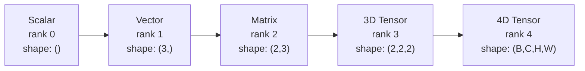
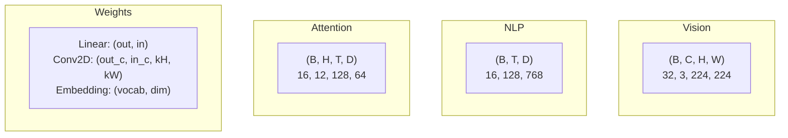
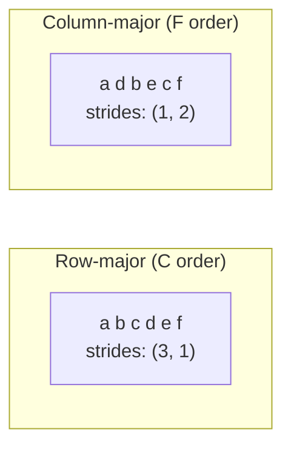
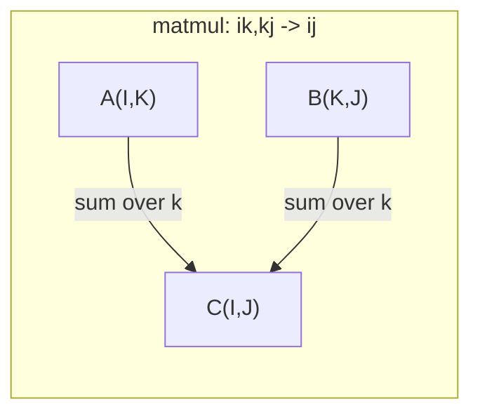

# 텐서 연산 (Tensor Operations)

> 텐서(tensor)는 데이터와 딥러닝(deep learning) 사이의 공통 언어다. 모든 이미지, 모든 문장, 모든 그래디언트(gradient)가 텐서를 통해 흐른다.

**Type:** Build
**Language:** Python
**Prerequisites:** Phase 1, Lessons 01 (Linear Algebra Intuition), 02 (Vectors, Matrices & Operations)
**Time:** ~90분

## 학습 목표 (Learning Objectives)

- shape, strides, reshape, transpose, 원소별(element-wise) 연산을 갖춘 텐서 클래스를 밑바닥부터 구현하기
- 데이터를 복사하지 않고 서로 다른 shape의 텐서를 연산하기 위해 브로드캐스팅(broadcasting) 규칙 적용하기
- 내적(dot product), 행렬 곱(matrix multiplication), 외적(outer product), 배치(batch) 연산을 위한 einsum 표현식 작성하기
- 멀티헤드 어텐션(multi-head attention)의 모든 단계를 거치며 정확한 텐서 shape 추적하기

## 문제 (The Problem)

트랜스포머(transformer)를 만든다고 하자. 순방향 패스(forward pass)는 깔끔해 보인다. 실행하면 이런 에러가 나온다. `RuntimeError: mat1 and mat2 shapes cannot be multiplied (32x768 and 512x768)`. shape를 노려본다. transpose를 시도한다. 이제는 `Expected 4D input (got 3D input)`이라고 한다. unsqueeze를 추가한다. 그러자 다른 무언가가 깨진다.

shape 에러는 딥러닝 코드에서 가장 흔한 버그다. 개념적으로는 어렵지 않다 — 각 연산에는 shape 계약(contract)이 있다 — 하지만 빠르게 불어난다. 트랜스포머에는 수십 개의 reshape, transpose, 브로드캐스트가 연쇄적으로 엮여 있다. 축(axis) 하나만 잘못되어도 에러가 연쇄적으로 퍼진다. 더 곤란한 경우는 아예 에러를 던지지 않는 shape 실수다. 잘못된 차원을 따라 브로드캐스트하거나 잘못된 축을 따라 합산하면서 조용히 쓰레기 값을 만들어낸다.

행렬(matrix)은 두 집합 사이의 쌍별(pairwise) 관계를 다룬다. 실제 데이터는 2차원에 들어맞지 않는다. 224x224 크기의 RGB 이미지 32개로 이루어진 배치는 4D 텐서다. `(32, 3, 224, 224)`. 헤드 12개를 쓰는 셀프 어텐션(self-attention)도 4D다. `(batch, heads, seq_len, head_dim)`. 차원 개수에 상관없이 일반화되며, 모든 차원에 걸쳐 깔끔하게 합성되는 연산을 가진 자료 구조가 필요하다. 그 구조가 바로 텐서다. 텐서 연산을 통달하면 shape 에러는 사소하게 디버깅할 수 있게 된다.

## 개념 (The Concept)

### 텐서란 무엇인가

텐서는 균일한 데이터 타입을 가진 다차원 숫자 배열이다. 차원의 개수가 **랭크(rank)**(또는 **차수(order)**)다. 각 차원은 **축(axis)**이다. **shape**는 각 축의 크기를 나열한 튜플이다.



전체 원소 수 = 모든 크기의 곱. shape `(2, 3, 4)`는 `2 * 3 * 4 = 24`개의 원소를 담는다.

### 딥러닝에서의 텐서 shape

서로 다른 데이터 타입은 관례에 따라 특정 텐서 shape에 매핑된다.



PyTorch는 NCHW(채널 우선, channels-first)를 쓴다. TensorFlow는 기본적으로 NHWC(채널 후순, channels-last)를 쓴다. 레이아웃이 어긋나면 조용한 속도 저하나 에러를 일으킨다.

### 메모리 레이아웃의 동작 방식

메모리상의 2D 배열은 1D 바이트 시퀀스다. **스트라이드(strides)**는 각 축을 따라 한 칸 이동하려면 몇 개의 원소를 건너뛰어야 하는지 알려준다.



transpose는 데이터를 옮기지 않는다. 스트라이드를 맞바꿔서 텐서를 **비연속(non-contiguous)** 상태로 만든다 — 한 행의 원소들이 더 이상 메모리에서 인접하지 않게 된다.

### 브로드캐스팅 규칙

브로드캐스팅(broadcasting)은 데이터를 복사하지 않고 서로 다른 shape의 텐서를 연산할 수 있게 한다. shape를 오른쪽부터 정렬한다. 두 차원은 서로 같거나 한쪽이 1일 때 호환된다. 차원이 적은 쪽은 왼쪽에 1을 채워 보충한다.

```
Tensor A:     (8, 1, 6, 1)
Tensor B:        (7, 1, 5)
Padded B:     (1, 7, 1, 5)
Result:       (8, 7, 6, 5)
```

### Einsum: 만능 텐서 연산

아인슈타인 합(Einstein summation)은 각 축에 문자를 라벨로 붙인다. 입력에는 있지만 출력에는 없는 축은 합산된다. 양쪽에 모두 있는 축은 유지된다.



핵심 패턴: `i,i->` (내적), `i,j->ij` (외적), `ii->` (대각합, trace), `ij->ji` (전치), `bij,bjk->bik` (배치 행렬 곱), `bhtd,bhsd->bhts` (어텐션 스코어).

## 직접 만들기 (Build It)

코드는 `code/tensors.py`에 있다. 각 단계는 그곳의 구현을 참조한다.

### 1단계: 텐서 저장소와 스트라이드

텐서는 평탄한(flat) 숫자 리스트와 shape 메타데이터를 저장한다. 스트라이드는 인덱싱 로직에게 다차원 인덱스를 평탄한 위치로 매핑하는 방법을 알려준다.

```python
class Tensor:
    def __init__(self, data, shape=None):
        if isinstance(data, (list, tuple)):
            self._data, self._shape = self._flatten_nested(data)
        elif isinstance(data, np.ndarray):
            self._data = data.flatten().tolist()
            self._shape = tuple(data.shape)
        else:
            self._data = [data]
            self._shape = ()

        if shape is not None:
            total = reduce(lambda a, b: a * b, shape, 1)
            if total != len(self._data):
                raise ValueError(
                    f"Cannot reshape {len(self._data)} elements into shape {shape}"
                )
            self._shape = tuple(shape)

        self._strides = self._compute_strides(self._shape)

    @staticmethod
    def _compute_strides(shape):
        if len(shape) == 0:
            return ()
        strides = [1] * len(shape)
        for i in range(len(shape) - 2, -1, -1):
            strides[i] = strides[i + 1] * shape[i + 1]
        return tuple(strides)
```

shape `(3, 4)`의 경우 스트라이드는 `(4, 1)`이다 — 한 행을 나아가려면 4개 원소를 건너뛰고, 한 열을 나아가려면 1개 원소를 건너뛴다.

### 2단계: Reshape, squeeze, unsqueeze

reshape는 원소 순서를 바꾸지 않고 shape를 바꾼다. 전체 원소 수는 동일하게 유지되어야 한다. 한 차원에 `-1`을 쓰면 그 크기를 추론한다.

```python
t = Tensor(list(range(12)), shape=(2, 6))
r = t.reshape((3, 4))
r = t.reshape((-1, 3))
```

squeeze는 크기가 1인 축을 제거한다. unsqueeze는 하나를 삽입한다. unsqueeze는 브로드캐스팅에 결정적으로 중요하다 — 편향(bias) 벡터 `(D,)`를 배치 `(B, T, D)`에 더하려면 `(1, 1, D)`로 unsqueeze해야 한다.

```python
t = Tensor(list(range(6)), shape=(1, 3, 1, 2))
s = t.squeeze()
v = Tensor([1, 2, 3])
u = v.unsqueeze(0)
```

### 3단계: Transpose와 permute

transpose는 두 축을 맞바꾼다. permute는 모든 축을 재배열한다. 이것이 NCHW와 NHWC 사이를 변환하는 방법이다.

```python
mat = Tensor(list(range(6)), shape=(2, 3))
tr = mat.transpose(0, 1)

t4d = Tensor(list(range(24)), shape=(1, 2, 3, 4))
perm = t4d.permute((0, 2, 3, 1))
```

transpose나 permute 이후 텐서는 메모리상에서 비연속 상태가 된다. PyTorch에서 `view`는 비연속 텐서에 대해 실패한다 — `reshape`를 쓰거나 먼저 `.contiguous()`를 호출하라.

### 4단계: 원소별 연산과 리덕션

원소별 연산(덧셈, 곱셈, 뺄셈)은 각 원소에 독립적으로 적용되며 shape를 보존한다. 리덕션(sum, mean, max)은 하나 이상의 축을 무너뜨린다.

```python
a = Tensor([[1, 2], [3, 4]])
b = Tensor([[10, 20], [30, 40]])
c = a + b
d = a * 2
s = a.sum(axis=0)
```

CNN에서의 전역 평균 풀링(global average pooling): `(B, C, H, W).mean(axis=[2, 3])`은 `(B, C)`를 만든다. NLP에서의 시퀀스 평균 풀링: `(B, T, D).mean(axis=1)`은 `(B, D)`를 만든다.

### 5단계: NumPy로 브로드캐스팅

`tensors.py`의 `demo_broadcasting_numpy()` 함수는 핵심 패턴을 보여준다.

```python
activations = np.random.randn(4, 3)
bias = np.array([0.1, 0.2, 0.3])
result = activations + bias

images = np.random.randn(2, 3, 4, 4)
scale = np.array([0.5, 1.0, 1.5]).reshape(1, 3, 1, 1)
result = images * scale

a = np.array([1, 2, 3]).reshape(-1, 1)
b = np.array([10, 20, 30, 40]).reshape(1, -1)
outer = a * b
```

브로드캐스팅을 통한 쌍별 거리: `(M, 2)`를 `(M, 1, 2)`로, `(N, 2)`를 `(1, N, 2)`로 reshape하고, 빼고, 제곱하고, 마지막 축을 따라 합한 뒤 제곱근을 취한다. 결과: `(M, N)`.

### 6단계: Einsum 연산

`demo_einsum()`과 `demo_einsum_gallery()` 함수는 모든 흔한 패턴을 차례로 보여준다.

```python
a = np.array([1.0, 2.0, 3.0])
b = np.array([4.0, 5.0, 6.0])
dot = np.einsum("i,i->", a, b)

A = np.array([[1, 2], [3, 4], [5, 6]], dtype=float)
B = np.array([[7, 8, 9], [10, 11, 12]], dtype=float)
matmul = np.einsum("ik,kj->ij", A, B)

batch_A = np.random.randn(4, 3, 5)
batch_B = np.random.randn(4, 5, 2)
batch_mm = np.einsum("bij,bjk->bik", batch_A, batch_B)
```

축약(contraction)의 계산 비용은 모든 인덱스 크기(유지되는 것과 합산되는 것 모두)의 곱이다. B=32, I=128, J=64, K=128인 `bij,bjk->bik`의 경우: `32 * 128 * 64 * 128 = 33,554,432`번의 곱셈-덧셈.

### 7단계: Einsum을 통한 어텐션 메커니즘

`demo_attention_einsum()` 함수는 멀티헤드 어텐션을 처음부터 끝까지 구현한다.

```python
B, H, T, D = 2, 4, 8, 16
E = H * D

X = np.random.randn(B, T, E)
W_q = np.random.randn(E, E) * 0.02

Q = np.einsum("bte,ek->btk", X, W_q)
Q = Q.reshape(B, T, H, D).transpose(0, 2, 1, 3)

scores = np.einsum("bhtd,bhsd->bhts", Q, K) / np.sqrt(D)
weights = softmax(scores, axis=-1)
attn_output = np.einsum("bhts,bhsd->bhtd", weights, V)

concat = attn_output.transpose(0, 2, 1, 3).reshape(B, T, E)
output = np.einsum("bte,ek->btk", concat, W_o)
```

모든 단계가 텐서 연산이다. 투영(projection)(einsum을 통한 행렬 곱), 헤드 분할(reshape + transpose), 어텐션 스코어(einsum을 통한 배치 행렬 곱), 가중합(einsum을 통한 배치 행렬 곱), 헤드 병합(transpose + reshape), 출력 투영(einsum을 통한 행렬 곱).

## 라이브러리로 써보기 (Use It)

### 밑바닥 구현 vs NumPy

| 연산 | 밑바닥 구현 (Tensor 클래스) | NumPy |
|---|---|---|
| 생성 | `Tensor([[1,2],[3,4]])` | `np.array([[1,2],[3,4]])` |
| Reshape | `t.reshape((3,4))` | `a.reshape(3,4)` |
| Transpose | `t.transpose(0,1)` | `a.T` or `a.transpose(0,1)` |
| Squeeze | `t.squeeze(0)` | `np.squeeze(a, 0)` |
| Sum | `t.sum(axis=0)` | `a.sum(axis=0)` |
| Einsum | N/A | `np.einsum("ij,jk->ik", a, b)` |

### 밑바닥 구현 vs PyTorch

```python
import torch

t = torch.tensor([[1, 2, 3], [4, 5, 6]], dtype=torch.float32)
t.shape
t.stride()
t.is_contiguous()

t.reshape(3, 2)
t.unsqueeze(0)
t.transpose(0, 1)
t.transpose(0, 1).contiguous()

torch.einsum("ik,kj->ij", A, B)
```

PyTorch는 자동 미분(autograd), GPU 지원, 최적화된 BLAS 커널을 더한다. shape 의미론은 동일하다. 밑바닥 버전을 이해하면 PyTorch shape 에러를 읽을 수 있게 된다.

### 모든 신경망 층을 텐서 연산으로

| 연산 | 텐서 형태 | Einsum |
|---|---|---|
| 선형 층(Linear layer) | `Y = X @ W.T + b` | `"bd,od->bo"` + bias |
| 어텐션 QKV | `Q = X @ W_q` | `"btd,dh->bth"` |
| 어텐션 스코어 | `Q @ K.T / sqrt(d)` | `"bhtd,bhsd->bhts"` |
| 어텐션 출력 | `softmax(scores) @ V` | `"bhts,bhsd->bhtd"` |
| 배치 정규화(Batch norm) | `(X - mu) / sigma * gamma` | element-wise + broadcast |
| 소프트맥스(Softmax) | `exp(x) / sum(exp(x))` | element-wise + reduction |

## 산출물 (Ship It)

이 레슨은 재사용 가능한 프롬프트 두 개를 만들어낸다.

1. **`outputs/prompt-tensor-shapes.md`** -- 텐서 shape 불일치를 디버깅하기 위한 체계적인 프롬프트. 모든 흔한 연산(matmul, broadcast, cat, Linear, Conv2d, BatchNorm, softmax)에 대한 의사결정 표와 수정 조회 표를 포함한다.

2. **`outputs/prompt-tensor-debugger.md`** -- shape 에러에 발이 묶일 때 어떤 AI 어시스턴트에든 붙여넣는 단계별 디버깅 프롬프트. 에러 메시지와 텐서 shape를 입력하면 정확한 수정안을 돌려받는다.

## 연습 문제 (Exercises)

1. **쉬움 -- Reshape 왕복.** shape `(2, 3, 4)`인 텐서를 가져온다. `(6, 4)`로 reshape하고, 그다음 `(24,)`로, 그다음 다시 `(2, 3, 4)`로 reshape하라. 평탄한 데이터를 출력하여 각 단계에서 원소 순서가 보존되는지 검증하라.

2. **보통 -- 브로드캐스팅 구현.** `Tensor` 클래스를 확장하여 크기가 1인 차원을 목표 shape에 맞게 확장하는 `broadcast_to(shape)` 메서드를 추가하라. 그다음 `_elementwise_op`를 수정하여 연산 전에 자동으로 브로드캐스트하도록 하라. shape `(3, 1)`과 `(1, 4)`가 `(3, 4)`를 만들어내는지로 테스트하라.

3. **어려움 -- Einsum을 밑바닥부터 만들기.** 최소한 다음을 처리하는 기본 `einsum(subscripts, *tensors)` 함수를 구현하라. 내적(`i,i->`), 행렬 곱(`ij,jk->ik`), 외적(`i,j->ij`), 전치(`ij->ji`). 첨자 문자열을 파싱하고, 축약되는 인덱스를 식별하고, 모든 인덱스 조합을 반복하라. 결과를 `np.einsum`과 비교하라.

4. **어려움 -- 어텐션 shape 추적기.** `batch_size`, `seq_len`, `embed_dim`, `num_heads`를 입력으로 받아 멀티헤드 어텐션의 모든 단계에서 정확한 shape를 출력하는 함수를 작성하라. 입력, Q/K/V 투영, 헤드 분할, 어텐션 스코어, 소프트맥스 가중치, 가중합, 헤드 병합, 출력 투영. `demo_attention_einsum()` 출력과 비교하여 검증하라.

## 핵심 용어 (Key Terms)

| 용어 | 흔히 하는 말 | 실제 의미 |
|---|---|---|
| 텐서(Tensor) | "행렬인데 차원이 더 많은 것" | 균일한 타입과 정의된 shape, 스트라이드, 연산을 가진 다차원 배열 |
| 랭크(Rank) | "차원의 개수" | 축의 개수. 행렬은 랭크 2이며, 그 행렬의 계수(matrix rank)와는 다르다 |
| Shape | "텐서의 크기" | 각 축의 크기를 나열한 튜플. `(2, 3)`은 2행 3열을 뜻한다 |
| 스트라이드(Stride) | "메모리가 어떻게 배치되는지" | 각 축을 따라 한 위치 나아가려면 건너뛰어야 하는 원소의 개수 |
| 브로드캐스팅(Broadcasting) | "shape가 달라도 그냥 된다" | 엄격한 규칙 집합: 오른쪽부터 정렬, 차원은 서로 같거나 한쪽이 1이어야 한다 |
| 연속(Contiguous) | "텐서가 정상이다" | 논리적 레이아웃에서 빈틈이나 재배열 없이 메모리에 순차적으로 저장된 원소 |
| Einsum | "matmul을 멋지게 쓰는 법" | 모든 텐서 축약, 외적, 대각합, 전치를 한 줄로 표현하는 일반 표기법 |
| 뷰(View) | "reshape과 같은 것" | 같은 메모리 버퍼를 공유하되 shape/스트라이드 메타데이터가 다른 텐서. 비연속 데이터에서는 실패한다 |
| 축약(Contraction) | "인덱스를 합산하는 것" | 텐서 간에 공유되는 인덱스를 곱하고 합산하여 더 낮은 랭크의 결과를 만드는 일반 연산 |
| NCHW / NHWC | "PyTorch vs TensorFlow 형식" | 이미지 텐서의 메모리 레이아웃 관례. NCHW는 채널을 공간 차원 앞에 두고, NHWC는 뒤에 둔다 |

## 더 읽을거리 (Further Reading)

- [NumPy Broadcasting](https://numpy.org/doc/stable/user/basics.broadcasting.html) -- 시각적 예시와 함께 보는 표준 규칙
- [PyTorch Tensor Views](https://pytorch.org/docs/stable/tensor_view.html) -- 뷰가 동작할 때와 복사할 때
- [einops](https://github.com/arogozhnikov/einops) -- 텐서 reshape을 읽기 쉽고 안전하게 만드는 라이브러리
- [The Illustrated Transformer](https://jalammar.github.io/illustrated-transformer/) -- 어텐션을 통과해 흐르는 텐서 shape를 시각화
- [Einstein Summation in NumPy](https://numpy.org/doc/stable/reference/generated/numpy.einsum.html) -- 예시와 함께 보는 전체 einsum 문서
