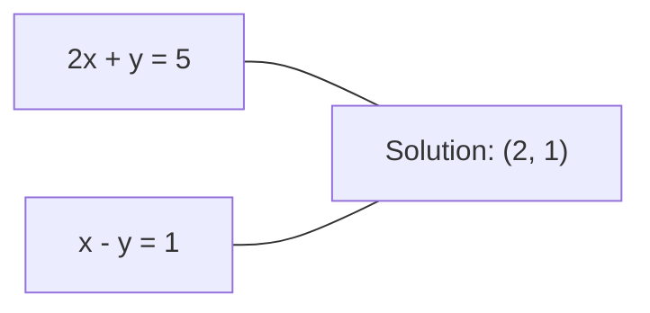
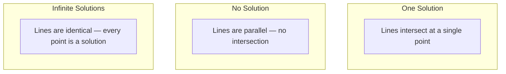

# 선형 시스템 (Linear Systems)

> Ax = b를 푸는 것은 수학에서 가장 오래된 문제이면서 여전히 신경망(neural network)을 돌리는 문제다.

**Type:** Build
**Language:** Python
**Prerequisites:** Phase 1, Lessons 01 (Linear Algebra Intuition), 02 (Vectors & Matrices), 03 (Matrix Transformations)
**Time:** ~120분

## 학습 목표 (Learning Objectives)

- 부분 피벗팅(partial pivoting)과 후진 대입(back substitution)을 사용한 가우스 소거법(Gaussian elimination)으로 Ax = b 풀기
- LU, QR, 촐레스키(Cholesky) 분해로 행렬을 인수분해하고 각각이 언제 적절한지 설명하기
- 최소제곱법(least squares)의 정규 방정식(normal equations)을 유도하고 선형 회귀(linear regression) 및 릿지 회귀(ridge regression)와 연결하기
- 조건수(condition number)를 사용해 악조건(ill-conditioned) 시스템을 진단하고 정규화(regularization)를 적용해 안정화하기

## 문제 (The Problem)

선형 회귀를 학습시킬 때마다 선형 시스템을 푼다. 최소제곱 적합을 계산할 때마다 선형 시스템을 푼다. 신경망 층(layer)이 `y = Wx + b`를 계산할 때마다 선형 시스템의 한쪽 변을 평가하는 셈이다. 정규화를 추가하면 시스템을 수정한다. 가우시안 프로세스(Gaussian process)를 쓰면 행렬을 인수분해한다. 마할라노비스 거리(Mahalanobis distance)를 위해 공분산 행렬(covariance matrix)을 역변환하면 선형 시스템을 푼다.

방정식 Ax = b는 어디에나 등장한다. A는 알려진 계수의 행렬이다. b는 알려진 출력의 벡터다. x는 찾으려는 미지수의 벡터다. 선형 회귀에서 A는 데이터 행렬, b는 목표 벡터, x는 가중치(weight) 벡터다. 모델 전체가 이렇게 환원된다: Ax가 b에 최대한 가까워지는 x를 찾아라.

이 레슨은 그 방정식을 푸는 모든 주요 방법을 밑바닥부터 만든다. 어떤 방법은 빠르고 어떤 방법은 안정한 이유, 어떤 것은 정방 시스템에만 동작하고 어떤 것은 과결정(overdetermined) 시스템을 다루는 이유, 그리고 행렬의 조건수가 답이 의미를 갖는지를 결정하는 이유를 이해하게 된다.

## 개념 (The Concept)

### Ax = b가 기하학적으로 의미하는 것

선형 방정식의 시스템에는 기하학적 해석이 있다. 각 방정식은 초평면(hyperplane)을 정의한다. 해는 모든 초평면이 교차하는 점(또는 점들의 집합)이다.

```
2x + y = 5          Two lines in 2D.
x - y  = 1          They intersect at x=2, y=1.
```



세 가지 일이 일어날 수 있다.



행렬 형태로, "하나의 해"는 A가 가역(invertible)임을 의미한다. "해 없음"은 시스템이 모순됨을 의미한다. "무한 해"는 A가 영공간(null space)을 가짐을 의미한다. 대부분의 ML 문제는 미지수(파라미터)보다 방정식(데이터 포인트)이 많기 때문에 "정확한 해 없음" 범주에 속한다. 거기서 최소제곱법이 등장한다.

### 열 그림 vs 행 그림

Ax = b를 읽는 두 가지 방법이 있다.

**행 그림(Row picture).** A의 각 행이 하나의 방정식을 정의한다. 각 방정식은 초평면이다. 해는 그것들이 모두 교차하는 곳이다.

**열 그림(Column picture).** A의 각 열은 벡터다. 질문은 이렇게 된다: A의 열들의 어떤 선형 결합이 b를 만드는가?

```
A = | 2  1 |    b = | 5 |
    | 1 -1 |        | 1 |

Row picture: solve 2x + y = 5 and x - y = 1 simultaneously.

Column picture: find x1, x2 such that:
  x1 * [2, 1] + x2 * [1, -1] = [5, 1]
  2 * [2, 1] + 1 * [1, -1] = [4+1, 2-1] = [5, 1]   check.
```

열 그림이 더 근본적이다. b가 A의 열공간(column space)에 있으면 시스템에 해가 있다. 그렇지 않으면 열공간에서 가장 가까운 점을 찾는다. 그 가장 가까운 점이 최소제곱 해다.

### 가우스 소거법 (Gaussian elimination)

가우스 소거법은 Ax = b를 후진 대입으로 푸는 상삼각(upper triangular) 시스템 Ux = c로 변환한다. 가장 직접적인 방법이다.

알고리즘:

```
1. For each column k (the pivot column):
   a. Find the largest entry in column k at or below row k (partial pivoting).
   b. Swap that row with row k.
   c. For each row i below k:
      - Compute multiplier m = A[i][k] / A[k][k]
      - Subtract m times row k from row i.
2. Back substitute: solve from the last equation upward.
```

예시:

```
Original:
| 2  1  1 | 8 |       R2 = R2 - (2)R1     | 2  1   1 |  8 |
| 4  3  3 |20 |  -->  R3 = R3 - (1)R1 --> | 0  1   1 |  4 |
| 2  3  1 |12 |                            | 0  2   0 |  4 |

                       R3 = R3 - (2)R2     | 2  1   1 |  8 |
                                       --> | 0  1   1 |  4 |
                                           | 0  0  -2 | -4 |

Back substitute:
  -2 * x3 = -4    -->  x3 = 2
  x2 + 2  = 4     -->  x2 = 2
  2*x1 + 2 + 2 = 8 --> x1 = 2
```

가우스 소거법은 O(n^3) 연산이 든다. 1000x1000 시스템의 경우 약 10억 번의 부동소수점 연산이다. 빠르지만, 같은 A로 여러 시스템을 풀어야 한다면 더 잘할 수 있다.

### 부분 피벗팅: 왜 중요한가

피벗팅 없이는 가우스 소거법이 실패하거나 쓰레기를 만들 수 있다. 피벗 원소가 0이면 0으로 나눈다. 작으면 반올림 오차를 증폭한다.

```
Bad pivot:                       With partial pivoting:
| 0.001  1 | 1.001 |            Swap rows first:
| 1      1 | 2     |            | 1      1 | 2     |
                                 | 0.001  1 | 1.001 |
m = 1/0.001 = 1000              m = 0.001/1 = 0.001
R2 = R2 - 1000*R1               R2 = R2 - 0.001*R1
| 0.001  1     | 1.001   |      | 1      1     | 2     |
| 0     -999   | -999.0  |      | 0      0.999 | 0.999 |

x2 = 1.000 (correct)            x2 = 1.000 (correct)
x1 = (1.001 - 1)/0.001          x1 = (2 - 1)/1 = 1.000 (correct)
   = 0.001/0.001 = 1.000        Stable because the multiplier is small.
```

정밀도가 제한된 부동소수점 산술에서, 피벗팅하지 않은 버전은 유효 숫자를 잃을 수 있다. 부분 피벗팅은 오차 증폭을 최소화하기 위해 항상 사용 가능한 가장 큰 피벗을 선택한다.

### LU 분해

LU 분해는 A를 하삼각 행렬 L과 상삼각 행렬 U로 인수분해한다: A = LU. L 행렬은 가우스 소거법의 곱셈자(multiplier)를 저장한다. U 행렬은 소거의 결과다.

```
A = L @ U

| 2  1  1 |   | 1  0  0 |   | 2  1   1 |
| 4  3  3 | = | 2  1  0 | @ | 0  1   1 |
| 2  3  1 |   | 1  2  1 |   | 0  0  -2 |
```

그냥 소거하지 않고 왜 인수분해하는가? L과 U를 갖고 나면, 어떤 새로운 b에 대해서든 Ax = b를 푸는 데 O(n^2)밖에 들지 않기 때문이다.

```
Ax = b
LUx = b
Let y = Ux:
  Ly = b    (forward substitution, O(n^2))
  Ux = y    (back substitution, O(n^2))
```

O(n^3) 비용은 인수분해 동안 한 번만 지불된다. 이후의 모든 풀이는 O(n^2)다. 같은 A에 다른 b 벡터로 1000개의 시스템을 풀어야 한다면, LU는 총 작업량에서 1000/3배를 절약한다.

부분 피벗팅을 하면, 행 교환을 기록하는 치환 행렬(permutation matrix) P를 써서 PA = LU를 얻는다.

### QR 분해

QR 분해는 A를 직교 행렬(orthogonal matrix) Q와 상삼각 행렬 R로 인수분해한다: A = QR.

직교 행렬은 Q^T Q = I라는 성질을 가진다. 그 열들은 정규직교(orthonormal) 벡터다. Q를 곱하면 길이와 각도가 보존된다.

```
A = Q @ R

Q has orthonormal columns: Q^T Q = I
R is upper triangular

To solve Ax = b:
  QRx = b
  Rx = Q^T b    (just multiply by Q^T, no inversion needed)
  Back substitute to get x.
```

QR은 최소제곱 문제를 푸는 데 LU보다 수치적으로 더 안정하다. 그람-슈미트(Gram-Schmidt) 과정이 Q를 열 단위로 만든다.

```
Given columns a1, a2, ... of A:

q1 = a1 / ||a1||

q2 = a2 - (a2 . q1) * q1        (subtract projection onto q1)
q2 = q2 / ||q2||                (normalize)

q3 = a3 - (a3 . q1) * q1 - (a3 . q2) * q2
q3 = q3 / ||q3||

R[i][j] = qi . aj    for i <= j
```

각 단계는 이전의 모든 q 벡터를 따르는 성분을 제거하여, 새로운 직교 방향만 남긴다.

### 촐레스키 분해 (Cholesky decomposition)

A가 대칭(symmetric, A = A^T)이고 양의 정부호(positive definite, 모든 고윳값이 양수)이면, A = L L^T로 인수분해할 수 있으며 여기서 L은 하삼각 행렬이다. 이것이 촐레스키 분해다.

```
A = L @ L^T

| 4  2 |   | 2  0 |   | 2  1 |
| 2  5 | = | 1  2 | @ | 0  2 |

L[i][i] = sqrt(A[i][i] - sum(L[i][k]^2 for k < i))
L[i][j] = (A[i][j] - sum(L[i][k]*L[j][k] for k < j)) / L[j][j]    for i > j
```

촐레스키는 LU보다 두 배 빠르고 저장 공간이 절반이다. 대칭 양의 정부호 행렬에만 동작하지만, 그런 행렬은 끊임없이 등장한다.

- 공분산 행렬은 대칭 양의 준정부호(positive semi-definite)다(정규화하면 양의 정부호).
- 가우시안 프로세스의 커널 행렬은 대칭 양의 정부호다.
- 최솟값에서 볼록 함수(convex function)의 헤시안(Hessian)은 대칭 양의 정부호다.
- A^T A는 항상 대칭 양의 준정부호다.

가우시안 프로세스에서는 커널 행렬 K를 촐레스키로 인수분해한 뒤, K alpha = y를 풀어 예측 평균을 얻는다. 촐레스키 인수는 또한 주변 가능도(marginal likelihood)를 위한 로그 행렬식을 준다: log det(K) = 2 * sum(log(diag(L))).

### 최소제곱법: Ax = b에 정확한 해가 없을 때

A가 m > n인 m x n 행렬이면(미지수보다 방정식이 많음), 시스템은 과결정이다. 정확한 해가 없다. 대신 제곱 오차를 최소화한다.

```
minimize ||Ax - b||^2

This is the sum of squared residuals:
  sum((A[i,:] @ x - b[i])^2 for i in range(m))
```

최소화 해는 정규 방정식을 만족한다.

```
A^T A x = A^T b
```

유도: ||Ax - b||^2 = (Ax - b)^T (Ax - b) = x^T A^T A x - 2 x^T A^T b + b^T b를 전개한다. x에 대해 그래디언트(gradient)를 취하고 0으로 둔다: 2 A^T A x - 2 A^T b = 0.

```
Original system (overdetermined, 4 equations, 2 unknowns):
| 1  1 |         | 3 |
| 1  2 | x     = | 5 |       No exact x satisfies all 4 equations.
| 1  3 |         | 6 |
| 1  4 |         | 8 |

Normal equations:
A^T A = | 4  10 |    A^T b = | 22 |
        | 10 30 |            | 63 |

Solve: x = [1.5, 1.7]

This is linear regression. x[0] is the intercept, x[1] is the slope.
```

### 정규 방정식 = 선형 회귀

연결은 정확하다. 선형 회귀에서 데이터 행렬 X는 표본당 한 행, 특성(feature)당 한 열을 가진다. 목표 벡터 y는 표본당 한 항목을 가진다. 가중치 벡터 w는 다음을 만족한다.

```
X^T X w = X^T y
w = (X^T X)^(-1) X^T y
```

이것이 선형 회귀의 닫힌 형식 해다. `sklearn.linear_model.LinearRegression.fit()`을 호출할 때마다 이것을 계산한다(또는 QR이나 SVD를 통한 등가물).

행렬에 정규화 항 lambda * I를 더하면 릿지 회귀를 얻는다.

```
(X^T X + lambda * I) w = X^T y
w = (X^T X + lambda * I)^(-1) X^T y
```

정규화는 행렬을 더 잘 조건화하고(정확하게 역변환하기 쉽게) 가중치를 0을 향해 줄여 과적합(overfitting)을 막는다. 행렬 X^T X + lambda * I는 lambda > 0일 때 항상 대칭 양의 정부호이므로, 촐레스키로 풀 수 있다.

### 유사역행렬 (무어-펜로즈, Moore-Penrose)

유사역행렬(pseudoinverse) A+는 행렬 역변환을 비정방 및 특이(singular) 행렬로 일반화한다. 어떤 행렬 A에 대해서든:

```
x = A+ b

where A+ = V Sigma+ U^T    (computed via SVD)
```

Sigma+는 각 0이 아닌 특잇값(singular value)의 역수를 취하고 결과를 전치하여 만든다. A = U Sigma V^T이면 A+ = V Sigma+ U^T다.

```
A = U Sigma V^T        (SVD)

Sigma = | 5  0 |       Sigma+ = | 1/5  0  0 |
        | 0  2 |                | 0  1/2  0 |
        | 0  0 |

A+ = V Sigma+ U^T
```

유사역행렬은 최소 노름(minimum-norm) 최소제곱 해를 준다. 시스템이 다음을 가질 때:
- 하나의 해: A+ b가 그 해를 준다.
- 해 없음: A+ b가 최소제곱 해를 준다.
- 무한 해: A+ b가 가장 작은 ||x||를 가진 것을 준다.

NumPy의 `np.linalg.lstsq`와 `np.linalg.pinv`는 둘 다 내부적으로 SVD를 쓴다.

### 조건수 (Condition number)

조건수는 해가 입력의 작은 변화에 얼마나 민감한지를 측정한다. 행렬 A에 대해 조건수는 다음과 같다.

```
kappa(A) = ||A|| * ||A^(-1)|| = sigma_max / sigma_min
```

여기서 sigma_max와 sigma_min은 가장 큰 특잇값과 가장 작은 특잇값이다.

```
Well-conditioned (kappa ~ 1):        Ill-conditioned (kappa ~ 10^15):
Small change in b -->                Small change in b -->
small change in x                    huge change in x

| 2  0 |   kappa = 2/1 = 2          | 1   1          |   kappa ~ 10^15
| 0  1 |   safe to solve            | 1   1+10^(-15) |   solution is garbage
```

경험칙:
- kappa < 100: 안전, 해가 정확하다.
- kappa ~ 10^k: 부동소수점 산술에서 약 k자리의 정밀도를 잃는다.
- kappa ~ 10^16 (float64의 경우): 해가 무의미하다. 행렬이 사실상 특이하다.

ML에서 악조건은 특성들이 거의 공선적(collinear)일 때 발생한다. 정규화(lambda * I 추가)는 조건수를 sigma_max / sigma_min에서 (sigma_max + lambda) / (sigma_min + lambda)로 개선한다.

### 반복 방법: 켤레 경사 (conjugate gradient)

매우 큰 희소(sparse) 시스템(수백만 개의 미지수)의 경우, LU나 촐레스키 같은 직접 방법은 너무 비싸다. 반복 방법은 많은 반복에 걸쳐 추측을 개선하여 해를 근사한다.

켤레 경사(conjugate gradient, CG)는 A가 대칭 양의 정부호일 때 Ax = b를 푼다. (정확한 산술에서) 최대 n번의 반복 안에 정확한 해를 찾지만, A의 고윳값이 군집되어 있으면 보통 훨씬 빠르게 수렴한다.

```
Algorithm sketch:
  x0 = initial guess (often zero)
  r0 = b - A x0           (residual)
  p0 = r0                 (search direction)

  For k = 0, 1, 2, ...:
    alpha = (rk . rk) / (pk . A pk)
    x_{k+1} = xk + alpha * pk
    r_{k+1} = rk - alpha * A pk
    beta = (r_{k+1} . r_{k+1}) / (rk . rk)
    p_{k+1} = r_{k+1} + beta * pk
    if ||r_{k+1}|| < tolerance: stop
```

CG는 다음에 쓰인다.
- 대규모 최적화(Newton-CG 방법)
- PDE 이산화 풀이
- 커널 행렬이 인수분해하기에 너무 큰 커널 방법
- 다른 반복 솔버를 위한 전처리(preconditioning)

수렴 속도는 조건수에 달려 있다. 더 잘 조건화된 시스템이 더 빠르게 수렴하며, 이는 정규화가 도움이 되는 또 다른 이유다.

### 전체 그림: 언제 어떤 방법인가

| 방법 | 요구 조건 | 비용 | 사용 사례 |
|--------|-------------|------|----------|
| 가우스 소거법 | 정방, 비특이 A | O(n^3) | 정방 시스템의 일회성 풀이 |
| LU 분해 | 정방, 비특이 A | O(n^3) 인수분해 + O(n^2) 풀이 | 같은 A로 여러 번 풀이 |
| QR 분해 | 임의의 A (m >= n) | O(mn^2) | 최소제곱, 수치적으로 안정 |
| 촐레스키 | 대칭 양의 정부호 A | O(n^3/3) | 공분산 행렬, 가우시안 프로세스, 릿지 회귀 |
| 정규 방정식 | 과결정 (m > n) | O(mn^2 + n^3) | 선형 회귀 (작은 n) |
| SVD / 유사역행렬 | 임의의 A | O(mn^2) | 계수 부족(rank-deficient) 시스템, 최소 노름 해 |
| 켤레 경사 | 대칭 양의 정부호, 희소 A | O(n * k * nnz) | 큰 희소 시스템, k = 반복 횟수 |

### ML과의 연결

이 레슨의 모든 방법은 프로덕션(production) ML에 등장한다.

**선형 회귀.** 닫힌 형식 해는 정규 방정식 X^T X w = X^T y를 푼다. 이는 촐레스키(n이 작으면)나 QR(수치 안정성이 중요하면)이나 SVD(행렬이 계수 부족일 수 있으면)로 이루어진다.

**릿지 회귀.** X^T X에 lambda * I를 더한다. 정규화된 시스템 (X^T X + lambda * I) w = X^T y는 lambda > 0에 대해 X^T X + lambda * I가 대칭 양의 정부호이므로 항상 촐레스키로 풀 수 있다.

**가우시안 프로세스.** 예측 평균은 K가 커널 행렬일 때 K alpha = y를 풀어야 한다. K의 촐레스키 인수분해가 표준 접근법이다. 로그 주변 가능도는 log det(K) = 2 sum(log(diag(L)))를 쓴다.

**신경망 초기화.** 직교 초기화(orthogonal initialization)는 QR 분해를 사용해 열이 정규직교인 가중치 행렬을 만든다. 이는 깊은 신경망에서 신호 붕괴를 막는다.

**전처리.** 대규모 옵티마이저(optimizer)는 켤레 경사 솔버를 위한 전처리자로 불완전 촐레스키나 불완전 LU를 쓴다.

**특성 공학.** X^T X의 조건수는 특성이 공선적인지 알려준다. kappa가 크면 특성을 버리거나 정규화를 추가하라.

## 직접 만들기 (Build It)

### 1단계: 부분 피벗팅을 곁들인 가우스 소거법

```python
import numpy as np

def gaussian_elimination(A, b):
    n = len(b)
    Ab = np.hstack([A.astype(float), b.reshape(-1, 1).astype(float)])

    for k in range(n):
        max_row = k + np.argmax(np.abs(Ab[k:, k]))
        Ab[[k, max_row]] = Ab[[max_row, k]]

        if abs(Ab[k, k]) < 1e-12:
            raise ValueError(f"Matrix is singular or nearly singular at pivot {k}")

        for i in range(k + 1, n):
            m = Ab[i, k] / Ab[k, k]
            Ab[i, k:] -= m * Ab[k, k:]

    x = np.zeros(n)
    for i in range(n - 1, -1, -1):
        x[i] = (Ab[i, -1] - Ab[i, i+1:n] @ x[i+1:n]) / Ab[i, i]

    return x
```

### 2단계: LU 분해

```python
def lu_decompose(A):
    n = A.shape[0]
    L = np.eye(n)
    U = A.astype(float).copy()
    P = np.eye(n)

    for k in range(n):
        max_row = k + np.argmax(np.abs(U[k:, k]))
        if max_row != k:
            U[[k, max_row]] = U[[max_row, k]]
            P[[k, max_row]] = P[[max_row, k]]
            if k > 0:
                L[[k, max_row], :k] = L[[max_row, k], :k]

        for i in range(k + 1, n):
            L[i, k] = U[i, k] / U[k, k]
            U[i, k:] -= L[i, k] * U[k, k:]

    return P, L, U

def lu_solve(P, L, U, b):
    n = len(b)
    Pb = P @ b.astype(float)

    y = np.zeros(n)
    for i in range(n):
        y[i] = Pb[i] - L[i, :i] @ y[:i]

    x = np.zeros(n)
    for i in range(n - 1, -1, -1):
        x[i] = (y[i] - U[i, i+1:] @ x[i+1:]) / U[i, i]

    return x
```

### 3단계: 촐레스키 분해

```python
def cholesky(A):
    n = A.shape[0]
    L = np.zeros_like(A, dtype=float)

    for i in range(n):
        for j in range(i + 1):
            s = A[i, j] - L[i, :j] @ L[j, :j]
            if i == j:
                if s <= 0:
                    raise ValueError("Matrix is not positive definite")
                L[i, j] = np.sqrt(s)
            else:
                L[i, j] = s / L[j, j]

    return L
```

### 4단계: 정규 방정식을 통한 최소제곱

```python
def least_squares_normal(A, b):
    AtA = A.T @ A
    Atb = A.T @ b
    return gaussian_elimination(AtA, Atb)

def ridge_regression(A, b, lam):
    n = A.shape[1]
    AtA = A.T @ A + lam * np.eye(n)
    Atb = A.T @ b
    L = cholesky(AtA)
    y = np.zeros(n)
    for i in range(n):
        y[i] = (Atb[i] - L[i, :i] @ y[:i]) / L[i, i]
    x = np.zeros(n)
    for i in range(n - 1, -1, -1):
        x[i] = (y[i] - L.T[i, i+1:] @ x[i+1:]) / L.T[i, i]
    return x
```

### 5단계: 조건수

```python
def condition_number(A):
    U, S, Vt = np.linalg.svd(A)
    return S[0] / S[-1]
```

## 라이브러리로 써보기 (Use It)

실제 데이터에 대한 선형 회귀와 릿지 회귀를 위해 조각들을 맞추기:

```python
np.random.seed(42)
X_raw = np.random.randn(100, 3)
w_true = np.array([2.0, -1.0, 0.5])
y = X_raw @ w_true + np.random.randn(100) * 0.1

X = np.column_stack([np.ones(100), X_raw])

w_ols = least_squares_normal(X, y)
print(f"OLS weights (ours):    {w_ols}")

w_np = np.linalg.lstsq(X, y, rcond=None)[0]
print(f"OLS weights (numpy):   {w_np}")
print(f"Max difference: {np.max(np.abs(w_ols - w_np)):.2e}")

w_ridge = ridge_regression(X, y, lam=1.0)
print(f"Ridge weights (ours):  {w_ridge}")

from sklearn.linear_model import Ridge
ridge_sk = Ridge(alpha=1.0, fit_intercept=False)
ridge_sk.fit(X, y)
print(f"Ridge weights (sklearn): {ridge_sk.coef_}")
```

## 산출물 (Ship It)

이 레슨이 만들어내는 것:
- 가우스 소거법, LU 분해, 촐레스키 분해, 최소제곱, 릿지 회귀의 밑바닥 구현을 담은 `code/linear_systems.py`
- 정규 방정식과 sklearn의 LinearRegression이 같은 가중치를 만든다는 동작 시연

## 연습 문제 (Exercises)

1. 직접 만든 가우스 소거법, 직접 만든 LU 솔버, `np.linalg.solve`를 사용해 시스템 `[[1,2,3],[4,5,6],[7,8,10]] x = [6, 15, 27]`을 풀어라. 셋 모두가 부동소수점 허용 오차 내에서 같은 답을 주는지 검증하라.

2. 50x5 무작위 행렬 X와 목표 y = X @ w_true + 잡음을 생성하라. 정규 방정식, QR(`np.linalg.qr`을 통해), SVD(`np.linalg.svd`를 통해), `np.linalg.lstsq`를 사용해 w를 풀어라. 네 가지 해를 모두 비교하라. X^T X의 조건수를 측정하고 그것이 어떤 방법을 신뢰할지에 어떻게 영향을 주는지 설명하라.

3. 두 열을 거의 동일하게 만들어(예: 열 2 = 열 1 + 1e-10 * 잡음) 거의 특이한 행렬을 만들어라. 그 조건수를 계산하라. 정규화 있을 때와 없을 때(0.01 * I 추가) Ax = b를 풀어라. 해와 잔차(residual)를 비교하라. 정규화가 도움이 되는 이유를 설명하라.

4. 100x100 무작위 대칭 양의 정부호 행렬에 대해 켤레 경사 알고리즘을 구현하라. 허용 오차 1e-8로 수렴하는 데 몇 번의 반복이 필요한지 세어라. n번 반복이라는 이론적 최댓값과 비교하라.

5. 크기 10, 50, 200, 500의 대칭 양의 정부호 행렬에 대해 직접 만든 촐레스키 솔버, LU 솔버, `np.linalg.solve`의 시간을 재라. 결과를 플롯하라. 촐레스키가 LU보다 대략 2배 빠른지 검증하라.

## 핵심 용어 (Key Terms)

| 용어 | 흔히 하는 말 | 실제 의미 |
|------|----------------|----------------------|
| 선형 시스템(Linear system) | "x를 풀어라" | 선형 방정식의 집합 Ax = b. x를 찾는다는 것은 변환 A 아래에서 출력 b를 만드는 입력을 찾는 것이다. |
| 가우스 소거법(Gaussian elimination) | "행 축약" | 행 연산을 사용해 대각선 아래 항목을 체계적으로 0으로 만들어, 후진 대입으로 풀 수 있는 상삼각 시스템을 만든다. O(n^3). |
| 부분 피벗팅(Partial pivoting) | "안정성을 위한 행 교환" | 열 k에서 소거하기 전에, 그 열에서 절댓값이 가장 큰 행을 피벗 위치로 교환한다. 작은 수로 나누는 것을 막는다. |
| LU 분해(LU decomposition) | "삼각형으로 인수분해" | A = LU로 쓰며 L은 하삼각(곱셈자 저장), U는 상삼각(소거된 행렬)이다. O(n^3) 비용을 여러 풀이에 분할 상환한다. |
| QR 분해(QR decomposition) | "직교 인수분해" | A = QR로 쓰며 Q는 정규직교 열을, R은 상삼각이다. 최소제곱에서 LU보다 안정하다. |
| 촐레스키 분해(Cholesky decomposition) | "행렬의 제곱근" | 대칭 양의 정부호 A에 대해 A = LL^T로 쓴다. LU 비용의 절반. 공분산 행렬, 커널 행렬, 릿지 회귀에 쓰인다. |
| 최소제곱법(Least squares) | "정확한 해가 불가능할 때의 최적 적합" | 시스템이 과결정일 때(미지수보다 방정식이 많음) 제곱 잔차의 합 ||Ax - b||^2을 최소화한다. |
| 정규 방정식(Normal equations) | "미적분 지름길" | A^T A x = A^T b. ||Ax - b||^2의 그래디언트를 0으로 둔 것. 이것이 바로 선형 회귀의 닫힌 형식 해다. |
| 유사역행렬(Pseudoinverse) | "비정방 행렬을 위한 역변환" | SVD를 통한 A+ = V Sigma+ U^T. 정방이든 직사각형이든, 특이하든 아니든 어떤 행렬에 대해서도 최소 노름 최소제곱 해를 준다. |
| 조건수(Condition number) | "이 답이 얼마나 믿을 만한가" | kappa = sigma_max / sigma_min. 입력 섭동에 대한 민감도를 측정한다. 약 log10(kappa)자리의 정밀도를 잃는다. |
| 릿지 회귀(Ridge regression) | "정규화된 최소제곱" | (X^T X + lambda I) w = X^T y를 푼다. lambda I를 더하면 조건화가 개선되고 가중치가 0을 향해 줄어든다. 과적합을 막는다. |
| 켤레 경사(Conjugate gradient) | "큰 행렬을 위한 반복적 Ax=b" | 대칭 양의 정부호 시스템을 위한 반복 솔버. 최대 n 스텝 안에 수렴한다. 인수분해가 너무 비싼 큰 희소 시스템에 실용적이다. |
| 과결정 시스템(Overdetermined system) | "파라미터보다 데이터가 많음" | m x n 시스템에서 m > n. 정확한 해가 없다. 최소제곱이 최선의 근사를 찾는다. 이것이 모든 회귀 문제다. |
| 후진 대입(Back substitution) | "아래에서 위로 풀기" | 상삼각 시스템이 주어지면 마지막 방정식을 먼저 풀고, 거꾸로 대입한다. O(n^2). |
| 전진 대입(Forward substitution) | "위에서 아래로 풀기" | 하삼각 시스템이 주어지면 첫 방정식을 먼저 풀고, 앞으로 대입한다. O(n^2). LU 풀이의 L 단계에서 쓰인다. |

## 더 읽을거리 (Further Reading)

- [MIT 18.06: Linear Algebra](https://ocw.mit.edu/courses/18-06-linear-algebra-spring-2010/) (Gilbert Strang) -- 선형 시스템과 행렬 인수분해에 대한 결정적인 강의
- [Numerical Linear Algebra](https://people.maths.ox.ac.uk/trefethen/text.html) (Trefethen & Bau) -- 수치 안정성, 조건화, 알고리즘이 실패하는 이유를 이해하기 위한 표준 참고 문헌
- [Matrix Computations](https://www.cs.cornell.edu/cv/GolubVanLoan4/golubandvanloan.htm) (Golub & Van Loan) -- 모든 행렬 알고리즘에 대한 백과사전적 참고 문헌
- [3Blue1Brown: Inverse Matrices](https://www.3blue1brown.com/lessons/inverse-matrices) -- Ax = b를 푸는 것이 기하학적으로 무엇을 의미하는지에 대한 시각적 직관
