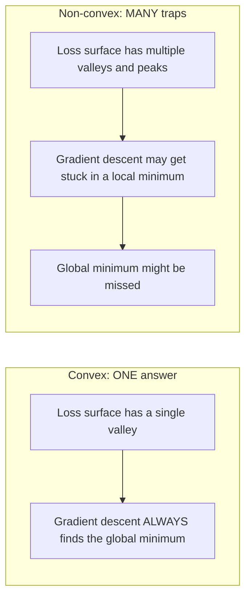
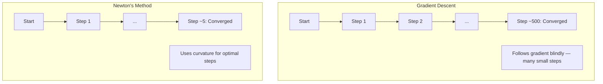
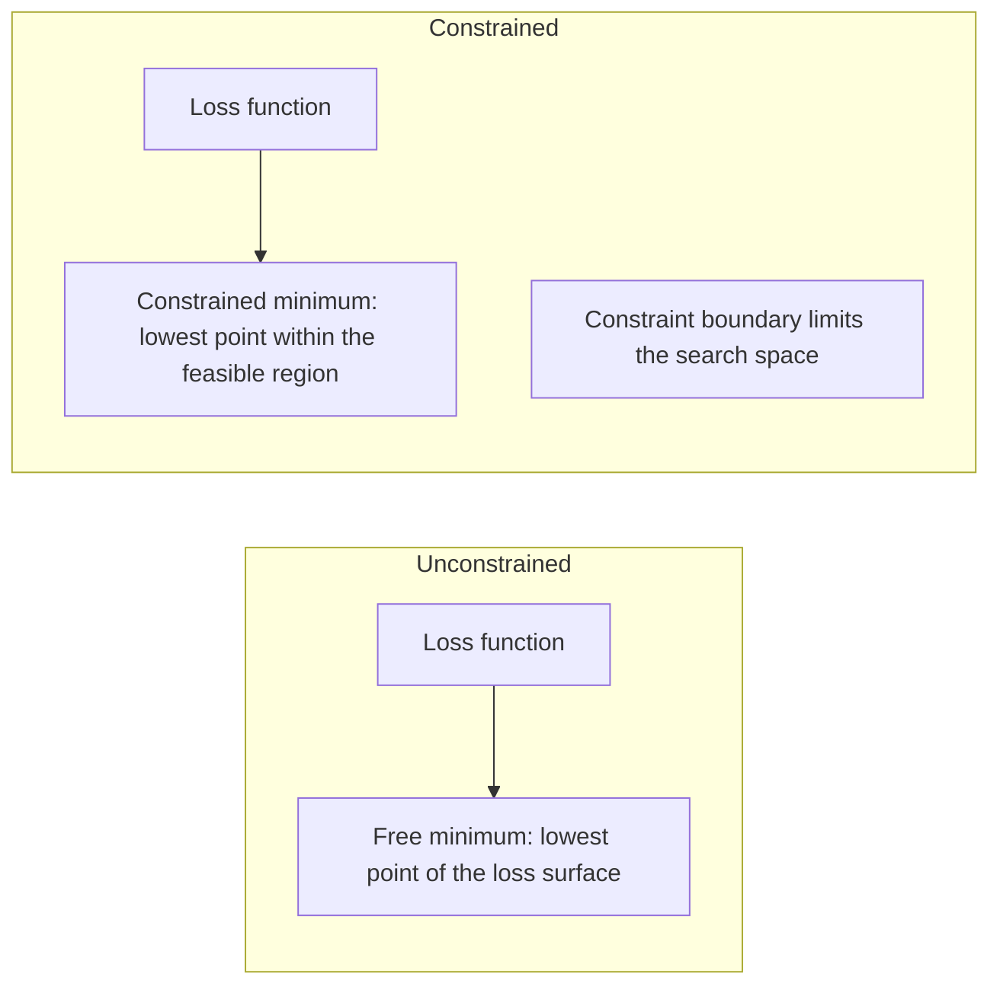
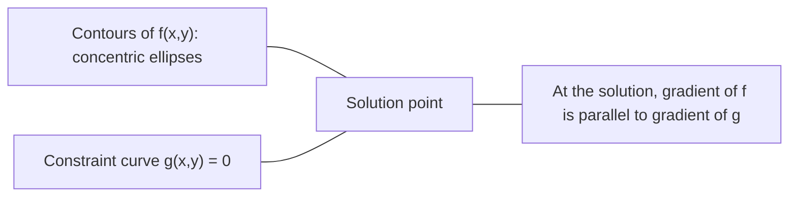

# 볼록 최적화 (Convex Optimization)

> 볼록(convex) 문제에는 골짜기가 하나다. 신경망(neural network)에는 수백만 개가 있다. 그 차이를 아는 것이 중요하다.

**Type:** Build
**Language:** Python
**Prerequisites:** Phase 1, Lessons 04 (Calculus for ML), 08 (Optimization)
**Time:** ~90분

## 학습 목표 (Learning Objectives)

- 정의, 이계도함수, 헤시안(Hessian) 기준을 사용해 함수가 볼록인지 검사하기
- 뉴턴 방법(Newton's method)을 구현하고 그 이차 수렴(quadratic convergence)을 경사 하강법(gradient descent)과 비교하기
- 라그랑주 승수(Lagrange multipliers)를 사용해 제약 최적화(constrained optimization) 문제를 풀고 KKT 조건을 해석하기
- 신경망 손실 지형(loss landscape)이 비볼록(non-convex)임에도 SGD가 여전히 좋은 해를 찾는 이유 설명하기

## 문제 (The Problem)

Lesson 08은 경사 하강법, 모멘텀(momentum), Adam을 가르쳤다. 그 옵티마이저(optimizer)들은 어떤 표면에서든 내리막을 걷는다. 하지만 아무 보장도 없다. 비볼록 지형에서의 경사 하강법은 나쁜 지역 최솟값(local minimum)에 빠지거나, 안장점(saddle point)에 갇히거나, 영원히 진동할 수 있다. 그럼에도 당신은 그것을 썼다. 신경망은 비볼록이고 대안이 없기 때문이다.

하지만 머신러닝의 많은 문제는 볼록이다. 선형 회귀(linear regression), 로지스틱 회귀(logistic regression), SVM, LASSO, 릿지 회귀(ridge regression). 이들에게는 더 강력한 무언가가 존재한다. 수학적 보장이 있는 최적화다. 볼록 문제에는 정확히 하나의 골짜기가 있다. 내리막을 걷는 어떤 알고리즘이든 전역 최솟값(global minimum)에 도달한다. 재시작이 필요 없다. 학습률(learning rate) 스케줄도 없다. 기도도 없다.

볼록성을 이해하면 세 가지를 얻는다. 첫째, 문제가 쉬운지(볼록) 어려운지(비볼록) 알 수 있다. 둘째, 볼록 문제에 대해 뉴턴 방법 같은 더 빠른 도구를 얻는다. 셋째, ML 전반에 등장하는 개념을 설명한다. 제약으로서의 정규화(regularization), SVM의 쌍대성(duality), 그리고 볼록성이 주는 모든 좋은 성질을 위반함에도 딥러닝(deep learning)이 동작하는 이유.

## 개념 (The Concept)

### 볼록 집합 (Convex sets)

집합 S가 볼록(convex)이라는 것은 S의 어떤 두 점에 대해서도, 그 사이의 선분이 전적으로 S 안에 놓인다는 것이다.

| 볼록 집합 | 비볼록 |
|---|---|
| **직사각형**: 내부의 어떤 두 점이든 내부에 머무는 선분으로 연결할 수 있다 | **별/초승달 모양**: 두 내부 점 사이의 선이 집합 밖을 지날 수 있다 |
| **삼각형**: 모든 내부 점에 대해 같은 성질이 성립한다 | **도넛/고리(annulus)**: 구멍 때문에 일부 선분이 집합을 벗어난다 |
| 어떤 두 점 사이의 선분도 집합 안에 머문다 | 어떤 점 쌍 사이의 선분은 집합을 벗어난다 |

형식적 검사: S의 어떤 점 x, y에 대해서든 [0, 1]의 어떤 t에 대해서든, 점 tx + (1-t)y도 S 안에 있다.

볼록 집합의 예:
- 직선, 평면, R^n 전체
- 공(원, 구, 초구)
- 반공간(halfspace): {x : a^T x <= b}
- 임의 개수 볼록 집합의 교집합

비볼록 집합의 예:
- 도넛(고리)
- 서로 떨어진 두 원의 합집합
- "움푹 패임"이나 "구멍"이 있는 모든 집합

### 볼록 함수 (Convex functions)

함수 f가 볼록(convex)이라는 것은 그 정의역이 볼록 집합이고 정의역의 어떤 두 점 x, y와 [0, 1]의 어떤 t에 대해서든:

```
f(tx + (1-t)y) <= t*f(x) + (1-t)*f(y)
```

기하학적으로: 그래프 위 어떤 두 점 사이의 선분이 그래프 위에 있거나 그래프 위쪽에 놓인다.

| 성질 | 볼록 함수 | 비볼록 함수 |
|---|---|---|
| **선분 검사** | 그래프 위 어떤 두 점 사이의 선이 곡선 **위에 있거나 위쪽에** 놓인다 | 그래프 위 어떤 점 사이의 선이 곡선 **아래로** 내려간다 |
| **모양** | 위로 휘는 단일 그릇/골짜기 | 혼합된 곡률을 가진 여러 봉우리와 골짜기 |
| **지역 최솟값** | 모든 지역 최솟값이 전역 최솟값이다 | 서로 다른 높이에 여러 지역 최솟값이 존재할 수 있다 |

흔한 볼록 함수:
- f(x) = x^2 (포물선)
- f(x) = |x| (절댓값)
- f(x) = e^x (지수)
- f(x) = max(0, x) (ReLU, 구간별 선형이지만)
- x > 0에 대한 f(x) = -log(x) (음의 로그)
- 모든 선형 함수 f(x) = a^T x + b (볼록이면서 동시에 오목)

### 볼록성 검사

가장 쉬운 것부터 가장 엄밀한 것까지, 세 가지 실용적 검사.

**검사 1: 이계도함수 검사(1D).** 모든 x에 대해 f''(x) >= 0이면 f는 볼록이다.

- f(x) = x^2: f''(x) = 2 >= 0. 볼록.
- f(x) = x^3: f''(x) = 6x. x < 0에서 음수. 비볼록.
- f(x) = e^x: f''(x) = e^x > 0. 볼록.

**검사 2: 헤시안 검사(다변수).** 모든 x에 대해 헤시안 행렬 H(x)가 양의 준정부호(positive semidefinite)이면 f는 볼록이다. 헤시안은 이계 편도함수(second partial derivative)의 행렬이다.

**검사 3: 정의 검사.** 부등식 f(tx + (1-t)y) <= t*f(x) + (1-t)*f(y)를 직접 확인한다. 도함수를 계산하기 어려운 함수에 유용하다.

### 볼록성이 중요한 이유

볼록 최적화의 핵심 정리:

**볼록 함수의 경우, 모든 지역 최솟값이 전역 최솟값이다.**

이는 경사 하강법이 갇힐 수 없다는 뜻이다. 어떤 내리막 경로든 같은 답으로 이어진다. 알고리즘이 최적해로 수렴하는 것이 보장된다.



결과:
- 무작위 재시작이 필요 없다
- 정교한 학습률 스케줄이 필요 없다
- 수렴 증명이 가능하다(속도는 함수의 성질에 따라 다름)
- 해가 유일하다(평탄 영역까지)

### ML에서의 볼록 vs 비볼록

| 문제 | 볼록? | 이유 |
|---------|---------|-----|
| 선형 회귀 (MSE) | 예 | 손실이 가중치에 대해 이차다 |
| 로지스틱 회귀 | 예 | 로그 손실이 가중치에 대해 볼록이다 |
| SVM (힌지 손실) | 예 | 선형 함수들의 최댓값 |
| LASSO (L1 회귀) | 예 | 볼록 함수의 합은 볼록이다 |
| 릿지 회귀 (L2) | 예 | 이차 + 이차 = 볼록 |
| 신경망 (어떤 손실이든) | 아니오 | 비선형 활성화가 비볼록 지형을 만든다 |
| k-평균 클러스터링 | 아니오 | 이산 할당 단계 |
| 행렬 분해 | 아니오 | 미지수들의 곱 |

볼록 손실을 가진 선형 모델은 볼록이다. 비선형 활성화를 가진 은닉층을 추가하는 순간, 볼록성이 깨진다.

### 헤시안 행렬 (The Hessian matrix)

함수 f: R^n -> R의 헤시안 H는 이계 편도함수의 n x n 행렬이다.

```
H[i][j] = d^2 f / (dx_i dx_j)
```

f(x, y) = x^2 + 3xy + y^2의 경우:

```
df/dx = 2x + 3y       d^2f/dx^2 = 2      d^2f/dxdy = 3
df/dy = 3x + 2y       d^2f/dydx = 3      d^2f/dy^2 = 2

H = [ 2  3 ]
    [ 3  2 ]
```

헤시안은 곡률에 대해 알려준다.
- 고윳값(eigenvalue)이 모두 양수: 함수가 모든 방향에서 위로 휜다(그 점에서 볼록)
- 고윳값이 모두 음수: 모든 방향에서 아래로 휜다(오목, 지역 최댓값)
- 부호가 섞임: 안장점(어떤 방향에서는 위로, 어떤 방향에서는 아래로 휜다)
- 고윳값이 0: 그 방향에서 평탄하다(퇴화)

볼록성을 위해서는 헤시안이 한 점에서뿐 아니라 모든 곳에서 양의 준정부호(모든 고윳값 >= 0)여야 한다.

### 뉴턴 방법 (Newton's method)

경사 하강법은 일차 정보(그래디언트)를 쓴다. 뉴턴 방법은 이차 정보(헤시안)를 쓴다. 현재 점에서 이차 근사를 맞추고 그 이차식의 최솟값으로 직접 점프한다.

```
Update rule:
  x_new = x - H^(-1) * gradient

Compare to gradient descent:
  x_new = x - lr * gradient
```

뉴턴 방법은 스칼라 학습률을 역헤시안으로 대체한다. 이는 지역 곡률에 기반해 스텝 크기와 방향을 자동으로 조정한다.



장점:
- 최솟값 근처에서 이차 수렴(매 스텝마다 오차가 제곱됨)
- 조정할 학습률이 없음
- 스케일 불변(문제를 어떻게 매개변수화하든 동작)

단점:
- 헤시안 계산에 O(n^2) 메모리와 역변환에 O(n^3)이 든다
- 가중치 100만 개를 가진 신경망의 경우, 이는 10^12개 항목과 10^18번 연산이다
- 딥러닝에 실용적이지 않다

### 제약 최적화 (Constrained optimization)

비제약 최적화(unconstrained optimization): 모든 x에 대해 f(x)를 최소화한다.
제약 최적화(constrained optimization): 제약 조건 아래에서 f(x)를 최소화한다.

실제 문제에는 제약이 있다. 비용을 최소화하고 싶지만 예산이 제한되어 있다. 오차를 최소화하고 싶지만 모델 복잡도가 유계다.



### 라그랑주 승수 (Lagrange multipliers)

라그랑주 승수 방법은 제약 문제를 비제약 문제로 변환한다.

문제: g(x) = 0 제약 아래에서 f(x)를 최소화한다.

해법: 새 변수(라그랑주 승수 lambda)를 도입하고 비제약 문제를 푼다.

```
L(x, lambda) = f(x) + lambda * g(x)
```

해에서 L의 그래디언트는 0이다.

```
dL/dx = df/dx + lambda * dg/dx = 0
dL/dlambda = g(x) = 0
```

기하학적 직관: 제약 최솟값에서 f의 그래디언트는 제약 g의 그래디언트와 평행해야 한다. 평행하지 않다면, 제약 표면을 따라 움직여 f를 더 줄일 수 있을 것이다.



예시: x + y = 1 제약 아래에서 f(x,y) = x^2 + y^2를 최소화한다.

```
L = x^2 + y^2 + lambda(x + y - 1)

dL/dx = 2x + lambda = 0  =>  x = -lambda/2
dL/dy = 2y + lambda = 0  =>  y = -lambda/2
dL/dlambda = x + y - 1 = 0

From first two: x = y
Substituting: 2x = 1, so x = y = 0.5, lambda = -1
```

원점에서 직선 x + y = 1까지 가장 가까운 점은 (0.5, 0.5)다.

### KKT 조건

카루시-쿤-터커(Karush-Kuhn-Tucker) 조건은 라그랑주 승수를 부등식 제약으로 확장한다.

문제: i = 1, ..., m에 대해 g_i(x) <= 0 제약 아래에서 f(x)를 최소화한다.

KKT 조건(최적성에 필요):

```
1. Stationarity:    df/dx + sum(lambda_i * dg_i/dx) = 0
2. Primal feasibility:  g_i(x) <= 0  for all i
3. Dual feasibility:    lambda_i >= 0  for all i
4. Complementary slackness:  lambda_i * g_i(x) = 0  for all i
```

상보적 여유성(complementary slackness)이 핵심 통찰이다. 제약이 활성화되어 있거나(g_i = 0, 해가 경계에 있음) 승수가 0이거나(제약이 중요하지 않음) 둘 중 하나다. 해에 영향을 주지 않는 제약은 lambda = 0이다.

KKT 조건은 SVM의 핵심이다. 서포트 벡터(support vector)는 제약이 활성화된 데이터 포인트(lambda > 0)다. 다른 모든 데이터 포인트는 lambda = 0이고 결정 경계(decision boundary)에 영향을 주지 않는다.

### 제약 최적화로서의 정규화

L1과 L2 정규화는 임의의 꼼수가 아니다. 변장한 제약 최적화 문제다.

**L2 정규화(릿지):**

```
minimize  Loss(w)  subject to  ||w||^2 <= t

Equivalent unconstrained form:
minimize  Loss(w) + lambda * ||w||^2
```

제약 ||w||^2 <= t는 공(2D에서는 원, 3D에서는 구)을 정의한다. 해는 손실 등고선이 이 공에 처음 닿는 곳이다.

**L1 정규화(LASSO):**

```
minimize  Loss(w)  subject to  ||w||_1 <= t

Equivalent unconstrained form:
minimize  Loss(w) + lambda * ||w||_1
```

제약 ||w||_1 <= t는 다이아몬드(2D에서는 회전된 정사각형)를 정의한다.

| 성질 | L2 제약 (원) | L1 제약 (다이아몬드) |
|---|---|---|
| **제약 모양** | 원 (고차원에서는 구) | 다이아몬드 (2D에서는 회전된 정사각형) |
| **손실 등고선이 닿는 곳** | 매끄러운 경계 — 원 위 어떤 점이든 | 꼭짓점 — 축에 정렬됨 |
| **해의 행동** | 가중치가 작지만 0이 아님 | 일부 가중치가 정확히 0임(희소) |
| **결과** | 가중치 축소 | 특성 선택 |

이것이 L1은 희소 모델(특성 선택)을 만들지만 L2는 가중치만 줄이는 이유를 설명한다. 다이아몬드는 축에 정렬된 꼭짓점을 가진다. 손실 등고선은 꼭짓점에 닿을 가능성이 더 높아, 하나 이상의 가중치를 정확히 0으로 만든다.

### 쌍대성 (Duality)

모든 제약 최적화 문제(원초, primal)에는 동반 문제(쌍대, dual)가 있다. 볼록 문제의 경우, 원초와 쌍대는 같은 최적값을 가진다. 이것이 강쌍대성(strong duality)이다.

라그랑주 쌍대 함수:

```
Primal: minimize f(x) subject to g(x) <= 0
Lagrangian: L(x, lambda) = f(x) + lambda * g(x)
Dual function: d(lambda) = min_x L(x, lambda)
Dual problem: maximize d(lambda) subject to lambda >= 0
```

쌍대성이 중요한 이유:
- 쌍대 문제가 때로는 원초보다 풀기 쉽다
- SVM은 쌍대 형태로 풀리며, 거기서 문제가 데이터 포인트 사이의 내적(dot product)에 의존한다(커널 트릭을 가능하게 함)
- 쌍대는 원초 최적값에 대한 하한을 제공하여, 해의 품질을 확인하는 데 유용하다

특히 SVM의 경우:

```
Primal: find w, b that maximize the margin 2/||w|| subject to
        y_i(w^T x_i + b) >= 1 for all i

Dual:   maximize sum(alpha_i) - 0.5 * sum_ij(alpha_i * alpha_j * y_i * y_j * x_i^T x_j)
        subject to alpha_i >= 0 and sum(alpha_i * y_i) = 0

The dual only involves dot products x_i^T x_j.
Replace x_i^T x_j with K(x_i, x_j) to get the kernel trick.
```

### 비볼록성에도 딥러닝이 동작하는 이유

신경망 손실 함수는 극심하게 비볼록이다. 모든 고전적 척도로 보면, 그것들을 최적화하는 것은 실패해야 한다. 그럼에도 확률적 경사 하강법(stochastic gradient descent)은 신뢰할 만하게 좋은 해를 찾는다. 몇 가지 요인이 이를 설명한다.

**대부분의 지역 최솟값은 충분히 좋다.** 고차원 공간에서, 무작위 임계점(그래디언트가 0인 곳)은 압도적으로 지역 최솟값이 아니라 안장점이다. 존재하는 소수의 지역 최솟값은 전역 최솟값에 가까운 손실 값을 가지는 경향이 있다. 파라미터 공간이 수백만 차원일 때 끔찍한 지역 최솟값에 갇히는 것은 극히 드물다.

**지역 최솟값이 아니라 안장점이 진짜 장애물이다.** n개의 파라미터(parameter)를 가진 함수에서, 안장점은 양의 곡률 방향과 음의 곡률 방향이 섞여 있다. 고차원의 무작위 임계점에서, n개 고윳값이 모두 양수(지역 최솟값)일 확률은 대략 2^(-n)이다. 거의 모든 임계점이 안장점이다. SGD의 잡음이 그것들을 탈출하는 데 도움을 준다.

**과매개변수화가 지형을 매끄럽게 한다.** 학습 예제보다 파라미터가 많은 신경망은 더 매끄럽고 더 연결된 손실 표면을 가진다. 더 넓은 신경망은 나쁜 지역 최솟값이 더 적다. 이는 직관에 반하지만 경험적으로 일관적이다.

**손실 지형 구조:**

| 성질 | 저차원 공간 | 고차원 공간 |
|---|---|---|
| **지형** | 고립된 봉우리와 골짜기가 많음 | 매끄럽게 연결된 골짜기 |
| **최솟값** | 고립된 지역 최솟값이 많음 | 나쁜 지역 최솟값이 적음; 대부분 거의 최적 |
| **탐색** | 전역 최솟값 찾기 어려움 | 많은 경로가 좋은 해로 이어짐 |
| **임계점** | 지역 최솟값과 안장점이 섞임 | 압도적으로 지역 최솟값이 아닌 안장점 |

**확률적 잡음이 암묵적 정규화로 작용한다.** 미니배치 SGD는 날카로운 최솟값(sharp minima)에 안착하는 것을 막는 잡음을 더한다. 날카로운 최솟값은 과적합하고, 평탄한 최솟값(flat minima)은 일반화한다. 잡음은 최적화를 손실 지형의 평탄한 영역 쪽으로 편향시킨다.

### 실무에서의 이차 방법

순수한 뉴턴 방법은 큰 모델에 비실용적이다. 몇 가지 근사가 이차 정보를 쓸 만하게 만든다.

**L-BFGS(제한 메모리 BFGS):** 마지막 m개의 그래디언트 차이를 사용해 역헤시안을 근사한다. O(n^2) 대신 O(mn) 메모리가 필요하다. 약 10,000개까지의 파라미터를 가진 문제에 잘 동작한다. 고전적 ML(로지스틱 회귀, CRF)에 쓰이지만 딥러닝에는 쓰이지 않는다.

**자연 그래디언트(Natural gradient):** 표준 헤시안 대신 피셔 정보 행렬(Fisher information matrix, 로그 가능도의 기대 헤시안)을 쓴다. 이는 확률 분포의 기하를 고려한다. K-FAC(Kronecker-Factored Approximate Curvature)는 피셔 행렬을 크로네커 곱(Kronecker product)으로 근사하여, 신경망에 실용적으로 만든다.

**헤시안 프리 최적화(Hessian-free optimization):** H를 한 번도 형성하지 않고 켤레 경사(conjugate gradient)를 사용해 Hx = g를 푼다. 자동 미분(automatic differentiation)을 통해 O(n) 시간에 계산할 수 있는 헤시안-벡터 곱만 필요로 한다.

**대각 근사:** Adam의 이차 모멘트는 헤시안 대각선의 대각 근사다. AdaHessian은 허친슨(Hutchinson) 추정량을 통해 실제 헤시안 대각 원소를 사용하여 이를 확장한다.

| 방법 | 메모리 | 스텝당 비용 | 언제 쓰는가 |
|--------|--------|--------------|-------------|
| 경사 하강법 | O(n) | O(n) | 베이스라인, 큰 모델 |
| 뉴턴 방법 | O(n^2) | O(n^3) | 작은 볼록 문제 |
| L-BFGS | O(mn) | O(mn) | 중간 볼록 문제 |
| Adam | O(n) | O(n) | 딥러닝 기본값 |
| K-FAC | O(n) | 층당 O(n) | 연구, 대용량 배치 학습 |

## 직접 만들기 (Build It)

### 1단계: 볼록성 검사기

점을 샘플링하고 정의를 확인하여 볼록성을 경험적으로 검사하는 함수를 만든다.

```python
import random
import math

def check_convexity(f, dim, bounds=(-5, 5), samples=1000):
    violations = 0
    for _ in range(samples):
        x = [random.uniform(*bounds) for _ in range(dim)]
        y = [random.uniform(*bounds) for _ in range(dim)]
        t = random.uniform(0, 1)
        mid = [t * xi + (1 - t) * yi for xi, yi in zip(x, y)]
        lhs = f(mid)
        rhs = t * f(x) + (1 - t) * f(y)
        if lhs > rhs + 1e-10:
            violations += 1
    return violations == 0, violations
```

### 2단계: 2D를 위한 뉴턴 방법

명시적 헤시안을 사용해 뉴턴 방법을 구현한다. 경사 하강법과 수렴 속도를 비교한다.

```python
def newtons_method(f, grad_f, hessian_f, x0, steps=50, tol=1e-12):
    x = list(x0)
    history = [x[:]]
    for _ in range(steps):
        g = grad_f(x)
        H = hessian_f(x)
        det = H[0][0] * H[1][1] - H[0][1] * H[1][0]
        if abs(det) < 1e-15:
            break
        H_inv = [
            [H[1][1] / det, -H[0][1] / det],
            [-H[1][0] / det, H[0][0] / det],
        ]
        dx = [
            H_inv[0][0] * g[0] + H_inv[0][1] * g[1],
            H_inv[1][0] * g[0] + H_inv[1][1] * g[1],
        ]
        x = [x[0] - dx[0], x[1] - dx[1]]
        history.append(x[:])
        if sum(gi ** 2 for gi in g) < tol:
            break
    return history
```

### 3단계: 라그랑주 승수 솔버

라그랑지안에 대한 경사 하강법을 사용해 제약 최적화를 푼다.

```python
def lagrange_solve(f_grad, g_val, g_grad, x0, lr=0.01,
                   lr_lambda=0.01, steps=5000):
    x = list(x0)
    lam = 0.0
    history = []
    for _ in range(steps):
        fg = f_grad(x)
        gv = g_val(x)
        gg = g_grad(x)
        x = [
            xi - lr * (fgi + lam * ggi)
            for xi, fgi, ggi in zip(x, fg, gg)
        ]
        lam = lam + lr_lambda * gv
        history.append((x[:], lam, gv))
    return history
```

### 4단계: 일차 vs 이차 비교

같은 이차 함수에 대해 경사 하강법과 뉴턴 방법을 실행한다. 수렴까지의 스텝 수를 센다.

```python
def quadratic(x):
    return 5 * x[0] ** 2 + x[1] ** 2

def quadratic_grad(x):
    return [10 * x[0], 2 * x[1]]

def quadratic_hessian(x):
    return [[10, 0], [0, 2]]
```

뉴턴 방법은 1 스텝에 수렴한다(이차식에 대해 정확하다). 경사 하강법은 헤시안의 고윳값이 5배 차이 나서 길쭉한 골짜기를 만들기 때문에 수백 스텝이 걸린다.

## 라이브러리로 써보기 (Use It)

볼록성 분석은 ML 모델과 솔버를 선택할 때 직접 적용된다.

볼록 문제(로지스틱 회귀, SVM, LASSO)의 경우:
- 전용 솔버를 써라(liblinear, CVXPY, method='L-BFGS-B'를 쓰는 scipy.optimize.minimize)
- 유일한 전역 해를 기대하라
- 이차 방법이 실용적이고 빠르다

비볼록 문제(신경망)의 경우:
- 일차 방법을 써라(SGD, Adam)
- 해가 초기화와 무작위성에 의존함을 받아들여라
- 암묵적 정규화로 과매개변수화, 잡음, 학습률 스케줄을 써라
- 전역 최솟값을 찾는 데 시간을 낭비하지 마라. 좋은 지역 최솟값이면 충분하다.

```python
from scipy.optimize import minimize

result = minimize(
    fun=lambda w: sum((y - X @ w) ** 2) + 0.1 * sum(w ** 2),
    x0=np.zeros(d),
    method='L-BFGS-B',
    jac=lambda w: -2 * X.T @ (y - X @ w) + 0.2 * w,
)
```

SVM의 경우, 쌍대 정식화가 커널 트릭을 쓸 수 있게 한다.

```python
from sklearn.svm import SVC

svm = SVC(kernel='rbf', C=1.0)
svm.fit(X_train, y_train)
print(f"Support vectors: {svm.n_support_}")
```

## 연습 문제 (Exercises)

1. **볼록성 갤러리.** 검사기를 사용해 이 함수들의 볼록성을 검사하라: f(x) = x^4, f(x) = sin(x), f(x,y) = x^2 + y^2, f(x,y) = x*y, f(x) = max(x, 0). 각 결과가 왜 타당한지 설명하라.

2. **뉴턴 vs 경사 하강법 경주.** 시작점 (10, 10)에서 f(x,y) = 50*x^2 + y^2에 두 방법을 모두 실행하라. 손실 < 1e-10에 도달하는 데 각각 몇 스텝이 필요한가? 조건수(가장 큰 헤시안 고윳값 대 가장 작은 것의 비율)가 증가하면 경사 하강법에 무슨 일이 일어나는가?

3. **라그랑주 승수 기하.** x + 2y = 4 제약 아래에서 f(x,y) = (x-3)^2 + (y-3)^2을 최소화하라. 해에서 f의 그래디언트가 g의 그래디언트와 평행한지 확인하여 해를 검증하라.

4. **정규화 제약.** L1 제약 최적화를 구현하라: |x| + |y| <= 1 제약 아래에서 (x-3)^2 + (y-2)^2을 최소화한다. 해가 한 좌표가 0인 것(다이아몬드 제약으로 인한 희소성)을 보여라.

5. **헤시안 고윳값 분석.** (1,1)과 (-1,1)에서 로젠브록(Rosenbrock) 함수의 헤시안을 계산하라. 두 점에서 고윳값을 계산하라. 고윳값이 최솟값에서의 곡률과 그로부터 멀리 떨어진 곳에서의 곡률에 대해 무엇을 알려주는가?

## 핵심 용어 (Key Terms)

| 용어 | 의미 |
|------|---------------|
| 볼록 집합(Convex set) | 집합 내 어떤 두 점 사이의 선분이 집합 안에 머무는 집합 |
| 볼록 함수(Convex function) | 그래프 위 어떤 두 점 사이의 선이 그래프 위에 있거나 위쪽에 놓이는 함수. 동등하게, 헤시안이 모든 곳에서 양의 준정부호 |
| 지역 최솟값(Local minimum) | 모든 인접한 점보다 낮은 점. 볼록 함수의 경우 모든 지역 최솟값이 전역 최솟값 |
| 전역 최솟값(Global minimum) | 정의역 전체에서 함수의 가장 낮은 점 |
| 헤시안 행렬(Hessian matrix) | 모든 이계 편도함수의 행렬. 곡률 정보를 부호화 |
| 양의 준정부호(Positive semidefinite) | 고윳값이 모두 음이 아닌 행렬. "이계도함수 >= 0"의 다차원 유사물 |
| 조건수(Condition number) | 헤시안의 가장 큰 고윳값 대 가장 작은 것의 비율. 높은 조건수는 길쭉한 골짜기와 느린 경사 하강법을 의미 |
| 뉴턴 방법(Newton's method) | 역헤시안을 사용해 스텝 방향과 크기를 결정하는 이차 옵티마이저. 최솟값 근처에서 이차 수렴 |
| 라그랑주 승수(Lagrange multiplier) | 제약 최적화 문제를 비제약 문제로 변환하기 위해 도입된 변수 |
| KKT 조건 | 부등식 제약을 가진 최적성을 위한 필요 조건. 라그랑주 승수를 일반화 |
| 상보적 여유성(Complementary slackness) | 해에서, 제약이 활성화되어 있거나 그 승수가 0이거나. 둘 다 0이 아닌 경우는 없음 |
| 쌍대성(Duality) | 모든 제약 문제에는 동반 쌍대 문제가 있음. 볼록 문제의 경우 둘 다 같은 최적값 |
| 강쌍대성(Strong duality) | 원초와 쌍대 최적값이 같음. 슬레이터(Slater) 조건을 만족하는 볼록 문제에 대해 성립 |
| L-BFGS | 전체 헤시안 대신 마지막 m개의 그래디언트 차이를 저장하는 근사 이차 방법 |
| 안장점(Saddle point) | 그래디언트가 0이지만 어떤 방향에서는 최솟값이고 다른 방향에서는 최댓값인 점 |
| 과매개변수화(Overparameterization) | 학습 예제보다 많은 파라미터를 쓰는 것. 손실 지형을 매끄럽게 하고 나쁜 지역 최솟값을 줄임 |

## 더 읽을거리 (Further Reading)

- [Boyd & Vandenberghe: Convex Optimization](https://web.stanford.edu/~boyd/cvxbook/) - 표준 교과서, 온라인에서 무료로 이용 가능
- [Bottou, Curtis, Nocedal: Optimization Methods for Large-Scale Machine Learning (2018)](https://arxiv.org/abs/1606.04838) - 볼록 최적화 이론과 딥러닝 실무를 잇는 다리
- [Choromanska et al.: The Loss Surfaces of Multilayer Networks (2015)](https://arxiv.org/abs/1412.0233) - 비볼록 신경망 지형이 보이는 것만큼 나쁘지 않은 이유
- [Nocedal & Wright: Numerical Optimization](https://link.springer.com/book/10.1007/978-0-387-40065-5) - 뉴턴 방법, L-BFGS, 제약 최적화에 대한 종합 참고 문헌
