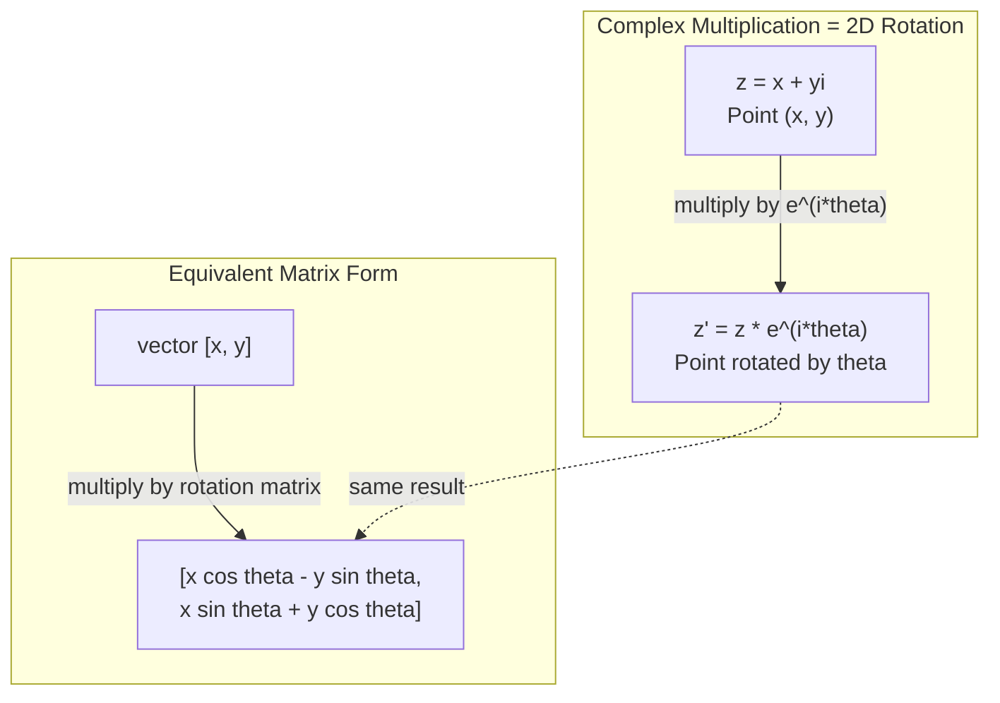
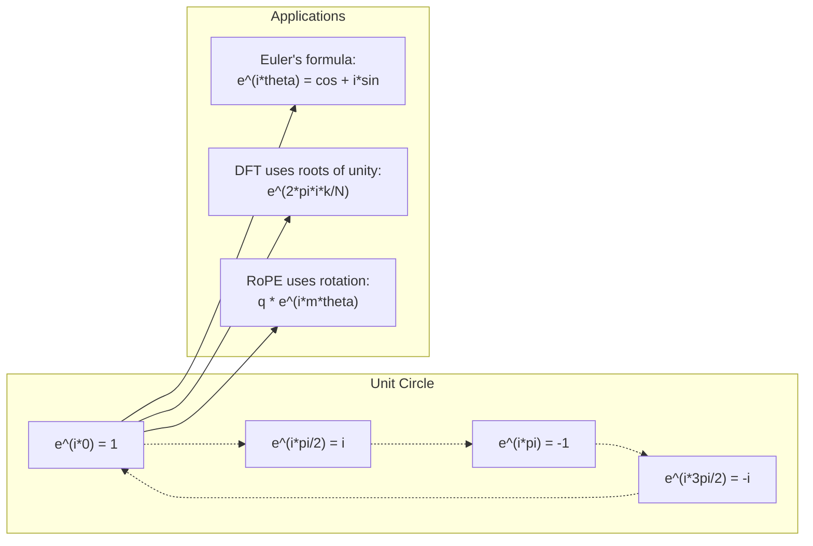

# AI를 위한 복소수 (Complex Numbers for AI)

> -1의 제곱근은 상상의 것이 아니다. 그것은 회전, 주파수, 그리고 신호 처리의 절반을 여는 열쇠다.

**Type:** Learn
**Language:** Python
**Prerequisites:** Phase 1, Lessons 01-04 (linear algebra, calculus)
**Time:** ~60분

## 학습 목표 (Learning Objectives)

- 직교 형식과 극 형식 모두에서 복소수 산술(덧셈, 곱셈, 나눗셈, 켤레) 수행하기
- 오일러 공식(Euler's formula)을 적용해 복소 지수와 삼각 함수 사이를 변환하기
- 단위근(roots of unity)을 사용해 이산 푸리에 변환(Discrete Fourier Transform)을 구현하기
- 복소 회전이 트랜스포머(transformer)의 RoPE와 사인파 위치 인코딩(positional encoding)의 바탕이 되는 방식 설명하기

## 문제 (The Problem)

푸리에 변환에 관한 논문을 펴면 곳곳에 `i`가 있다. 트랜스포머 위치 인코딩을 보면 서로 다른 주파수의 `sin`과 `cos`이 보인다 — 복소 지수의 실수부와 허수부다. 양자 컴퓨팅에 관해 읽으면 모든 것이 복소 벡터 공간으로 표현되어 있다.

복소수(complex number)는 추상적으로 보인다. -1의 제곱근 위에 세워진 수 체계는 수학적 속임수처럼 느껴진다. 하지만 속임수가 아니다. 회전과 진동의 자연스러운 언어다. 무언가가 돌거나, 떨리거나, 진동할 때마다 복소수가 올바른 도구다.

복소수를 이해하지 못하면 이산 푸리에 변환을 이해할 수 없다. FFT를 이해할 수 없다. 현대 언어 모델에서 RoPE(Rotary Position Embedding, 회전 위치 임베딩)가 어떻게 동작하는지 이해할 수 없다. 원래 Transformer 논문의 사인파 위치 인코딩이 왜 그런 주파수를 쓰는지 이해할 수 없다.

이 레슨은 복소수 산술을 밑바닥부터 만들고, 기하학과 연결하고, 복소수가 머신러닝의 어디에 등장하는지 정확히 보여준다.

## 개념 (The Concept)

### 복소수란 무엇인가?

복소수에는 두 부분이 있다. 실수부와 허수부.

```
z = a + bi

where:
  a is the real part
  b is the imaginary part
  i is the imaginary unit, defined by i^2 = -1
```

그게 전부다. 수직선을 평면으로 확장한다. 실수는 한 축에 놓인다. 허수는 다른 축에 놓인다. 모든 복소수는 이 평면의 한 점이다.

### 복소수 산술

**덧셈.** 실수부끼리 더하고, 허수부끼리 더한다.

```
(a + bi) + (c + di) = (a + c) + (b + d)i

Example: (3 + 2i) + (1 + 4i) = 4 + 6i
```

**곱셈.** 분배 법칙을 쓰고 i^2 = -1임을 기억한다.

```
(a + bi)(c + di) = ac + adi + bci + bdi^2
                 = ac + adi + bci - bd
                 = (ac - bd) + (ad + bc)i

Example: (3 + 2i)(1 + 4i) = 3 + 12i + 2i + 8i^2
                            = 3 + 14i - 8
                            = -5 + 14i
```

**켤레.** 허수부의 부호를 뒤집는다.

```
conjugate of (a + bi) = a - bi
```

복소수와 그 켤레의 곱은 항상 실수다.

```
(a + bi)(a - bi) = a^2 + b^2
```

**나눗셈.** 분자와 분모에 분모의 켤레를 곱한다.

```
(a + bi) / (c + di) = (a + bi)(c - di) / (c^2 + d^2)
```

이렇게 하면 분모에서 허수부가 사라지면서 깔끔한 복소수가 남는다.

### 복소평면

복소평면(complex plane)은 모든 복소수를 2D 점으로 매핑한다. 수평축은 실수축, 수직축은 허수축이다.

```
z = 3 + 2i  corresponds to the point (3, 2)
z = -1 + 0i corresponds to the point (-1, 0) on the real axis
z = 0 + 4i  corresponds to the point (0, 4) on the imaginary axis
```

복소수는 동시에 점이자 원점으로부터의 벡터다. 이 이중 해석 덕분에 복소수가 기하학에서 유용하다.

### 극 형식 (Polar form)

평면의 어떤 점이든 원점으로부터의 거리와 양의 실수축으로부터의 각도로 설명할 수 있다.

```
z = r * (cos(theta) + i*sin(theta))

where:
  r = |z| = sqrt(a^2 + b^2)     (magnitude, or modulus)
  theta = atan2(b, a)             (phase, or argument)
```

직교 형식(a + bi)은 덧셈에 좋다. 극 형식(r, theta)은 곱셈에 좋다.

**극 형식에서의 곱셈.** 크기를 곱하고, 각도를 더한다.

```
z1 = r1 * e^(i*theta1)
z2 = r2 * e^(i*theta2)

z1 * z2 = (r1 * r2) * e^(i*(theta1 + theta2))
```

이것이 복소수가 회전에 완벽한 이유다. 크기가 1인 복소수를 곱하는 것은 순수한 회전이다.

### 오일러 공식 (Euler's formula)

복소 지수와 삼각법 사이의 다리:

```
e^(i*theta) = cos(theta) + i*sin(theta)
```

이것이 이 레슨에서 가장 중요한 공식이다. theta = pi일 때:

```
e^(i*pi) = cos(pi) + i*sin(pi) = -1 + 0i = -1

Therefore: e^(i*pi) + 1 = 0
```

다섯 개의 근본 상수(e, i, pi, 1, 0)가 하나의 방정식으로 연결된다.

### 오일러 공식이 ML에 중요한 이유

오일러 공식은 theta가 변함에 따라 `e^(i*theta)`가 단위원을 그린다고 말한다. theta = 0에서 (1, 0)에 있다. theta = pi/2에서 (0, 1)에 있다. theta = pi에서 (-1, 0)에 있다. theta = 3*pi/2에서 (0, -1)에 있다. 한 바퀴 회전은 theta = 2*pi다.

곧 복소 지수가 회전이라는 뜻이다. 그리고 회전은 신호 처리와 ML 어디에나 있다.

### 2D 회전과의 연결

복소수 (x + yi)에 e^(i*theta)를 곱하면 점 (x, y)를 원점 주위로 각도 theta만큼 회전한다.

```
Rotation via complex multiplication:
  (x + yi) * (cos(theta) + i*sin(theta))
  = (x*cos(theta) - y*sin(theta)) + (x*sin(theta) + y*cos(theta))i

Rotation via matrix multiplication:
  [cos(theta)  -sin(theta)] [x]   [x*cos(theta) - y*sin(theta)]
  [sin(theta)   cos(theta)] [y] = [x*sin(theta) + y*cos(theta)]
```

이들은 동일한 결과를 만든다. 복소수 곱셈이 곧 2D 회전이다. 회전 행렬은 행렬 표기로 쓴 복소수 곱셈일 뿐이다.



### 페이저와 회전하는 신호

복소 지수 e^(i*omega*t)는 각주파수 omega로 단위원 주위를 회전하는 점이다. t가 증가함에 따라 점이 원을 그린다.

이 회전하는 점의 실수부는 cos(omega*t)다. 허수부는 sin(omega*t)다. 사인파 신호는 회전하는 복소수의 그림자다.

```
e^(i*omega*t) = cos(omega*t) + i*sin(omega*t)

Real part:      cos(omega*t)    -- a cosine wave
Imaginary part: sin(omega*t)    -- a sine wave
```

이것이 페이저(phasor) 표현이다. 흔들거리는 사인파를 추적하는 대신, 매끄럽게 회전하는 화살표를 추적한다. 위상 이동(phase shift)은 각도 오프셋이 된다. 진폭 변화는 크기 변화가 된다. 신호의 덧셈은 벡터 덧셈이 된다.

### 단위근 (Roots of unity)

N번째 단위근은 단위원에 균등하게 배치된 N개의 점이다.

```
w_k = e^(2*pi*i*k/N)    for k = 0, 1, 2, ..., N-1
```

N = 4의 경우, 근은 1, i, -1, -i다(네 방위점).
N = 8의 경우, 네 방위점에 더해 네 대각선을 얻는다.

단위근은 이산 푸리에 변환의 기초다. DFT는 신호를 이 N개의 균등 간격 주파수에서의 성분으로 분해한다.

### DFT와의 연결

신호 x[0], x[1], ..., x[N-1]의 이산 푸리에 변환은 다음과 같다.

```
X[k] = sum_{n=0}^{N-1} x[n] * e^(-2*pi*i*k*n/N)
```

각 X[k]는 신호가 k번째 단위근 — 주파수 k의 복소 사인파 — 와 얼마나 상관되는지를 측정한다. DFT는 신호를 N개의 회전하는 페이저로 쪼개고 각각의 진폭과 위상을 알려준다.

### i가 상상의 것이 아닌 이유

"상상의(imaginary)"라는 단어는 역사적 사고다. 데카르트가 경멸적으로 썼다. 하지만 i는 사람들이 음수를 처음 거부했을 때의 음수보다 더 상상의 것이 아니다. 음수는 "3에서 무엇을 빼야 5를 얻는가?"에 답한다. 허수 단위는 "무엇을 제곱하면 -1을 얻는가?"에 답한다.

더 유용하게: i는 90도 회전 연산자다. 실수에 i를 한 번 곱하면 허수축으로 90도 회전한다. 다시 i를 곱하면(i^2) 또 90도 회전한다 — 이제 음의 실수 방향을 가리킨다. 그것이 i^2 = -1인 이유다. 신비로운 게 아니다. 두 번의 4분의 1 회전으로 만든 반 바퀴 회전이다.

이것이 복소수가 공학 어디에나 있는 이유다. 회전하는 모든 것 — 전자기파, 양자 상태, 신호 진동, 위치 인코딩 — 은 자연스럽게 복소수로 기술된다.

### 복소 지수 vs 삼각 함수

오일러 공식 이전에, 엔지니어는 신호를 A*cos(omega*t + phi)로 썼다 — 진폭 A, 주파수 omega, 위상 phi. 이는 동작하지만 산술을 고통스럽게 만든다. 위상이 다른 두 코사인을 더하려면 삼각 항등식이 필요하다.

복소 지수를 쓰면, 같은 신호가 A*e^(i*(omega*t + phi))다. 두 신호를 더하는 것은 두 복소수를 더하는 것일 뿐이다. 곱하는(변조하는) 것은 크기를 곱하고 각도를 더하는 것일 뿐이다. 위상 이동은 각도 덧셈이 된다. 주파수 이동은 페이저의 곱셈이 된다.

신호 처리 분야 전체가 복소 지수 표기로 전환했는데, 수학이 더 깔끔하기 때문이다. "실제 신호"는 항상 복소 표현의 실수부일 뿐이다. 허수부는 장부 정리로 따라다니며, 모든 대수가 자연스럽게 풀리게 한다.

### 트랜스포머와의 연결

**사인파 위치 인코딩**(원래 Transformer 논문):

```
PE(pos, 2i) = sin(pos / 10000^(2i/d))
PE(pos, 2i+1) = cos(pos / 10000^(2i/d))
```

sin과 cos 쌍은 서로 다른 주파수의 복소 지수의 실수부와 허수부다. 각 주파수는 위치를 인코딩하는 서로 다른 "해상도"를 제공한다. 낮은 주파수는 천천히 변한다(거친 위치). 높은 주파수는 빠르게 변한다(세밀한 위치). 함께, 각 위치에 고유한 주파수 지문을 준다.

**RoPE(Rotary Position Embedding)**는 이를 더 밀고 나간다. 쿼리(query)와 키(key) 벡터에 복소 회전 행렬을 명시적으로 곱한다. 두 토큰(token) 사이의 상대 위치가 회전 각도가 된다. 어텐션(attention)은 이 회전된 벡터를 사용해 계산되며, 복소수 곱셈을 통해 모델을 상대 위치에 민감하게 만든다.

| 연산 | 대수 형식 | 기하학적 의미 |
|-----------|---------------|-------------------|
| 덧셈 | (a+c) + (b+d)i | 평면에서의 벡터 덧셈 |
| 곱셈 | (ac-bd) + (ad+bc)i | 회전 및 스케일링 |
| 켤레 | a - bi | 실수축에 대한 반사 |
| 크기 | sqrt(a^2 + b^2) | 원점으로부터의 거리 |
| 위상 | atan2(b, a) | 양의 실수축으로부터의 각도 |
| 나눗셈 | 켤레 곱하기 | 회전 반전 및 재스케일링 |
| 거듭제곱 | r^n * e^(i*n*theta) | n번 회전, r^n으로 스케일 |



## 직접 만들기 (Build It)

### 1단계: Complex 클래스

산술, 크기, 위상, 직교 형식과 극 형식 사이의 변환을 지원하는 Complex 수 클래스를 만든다.

```python
import math

class Complex:
    def __init__(self, real, imag=0.0):
        self.real = real
        self.imag = imag

    def __add__(self, other):
        return Complex(self.real + other.real, self.imag + other.imag)

    def __mul__(self, other):
        r = self.real * other.real - self.imag * other.imag
        i = self.real * other.imag + self.imag * other.real
        return Complex(r, i)

    def __truediv__(self, other):
        denom = other.real ** 2 + other.imag ** 2
        r = (self.real * other.real + self.imag * other.imag) / denom
        i = (self.imag * other.real - self.real * other.imag) / denom
        return Complex(r, i)

    def magnitude(self):
        return math.sqrt(self.real ** 2 + self.imag ** 2)

    def phase(self):
        return math.atan2(self.imag, self.real)

    def conjugate(self):
        return Complex(self.real, -self.imag)
```

### 2단계: 극 변환과 오일러 공식

```python
def to_polar(z):
    return z.magnitude(), z.phase()

def from_polar(r, theta):
    return Complex(r * math.cos(theta), r * math.sin(theta))

def euler(theta):
    return Complex(math.cos(theta), math.sin(theta))
```

검증: `euler(theta).magnitude()`는 항상 1.0이어야 한다. `euler(0)`은 (1, 0)을 줘야 한다. `euler(pi)`는 (-1, 0)을 줘야 한다.

### 3단계: 회전

점 (x, y)를 각도 theta만큼 회전하는 것은 한 번의 복소수 곱셈이다.

```python
point = Complex(3, 4)
rotated = point * euler(math.pi / 4)
```

크기는 그대로다. 각도만 변한다.

### 4단계: 복소수 산술로부터의 DFT

```python
def dft(signal):
    N = len(signal)
    result = []
    for k in range(N):
        total = Complex(0, 0)
        for n in range(N):
            angle = -2 * math.pi * k * n / N
            total = total + Complex(signal[n], 0) * euler(angle)
        result.append(total)
    return result
```

이것은 O(N^2) DFT다. 각 출력 X[k]는 신호 표본에 단위근을 곱한 것의 합이다.

### 5단계: 역 DFT

역 DFT는 스펙트럼으로부터 원래 신호를 재구성한다. 순방향 DFT로부터의 유일한 변화: 지수의 부호를 뒤집고 N으로 나눈다.

```python
def idft(spectrum):
    N = len(spectrum)
    result = []
    for n in range(N):
        total = Complex(0, 0)
        for k in range(N):
            angle = 2 * math.pi * k * n / N
            total = total + spectrum[k] * euler(angle)
        result.append(Complex(total.real / N, total.imag / N))
    return result
```

이는 완벽한 재구성을 준다. DFT를 적용하고 IDFT를 적용하면 머신 정밀도까지 원래 신호를 되찾는다. 정보가 손실되지 않는다.

### 6단계: 단위근

```python
def roots_of_unity(N):
    return [euler(2 * math.pi * k / N) for k in range(N)]
```

두 성질을 검증하라:
- 모든 근의 크기는 정확히 1이다.
- 모든 N개 근의 합은 0이다(대칭성(symmetry)으로 상쇄된다).

이 성질들이 DFT를 가역으로 만든다. 단위근은 주파수 영역에 대한 직교 기저(orthogonal basis)를 이룬다.

## 라이브러리로 써보기 (Use It)

Python에는 내장 복소수 지원이 있다. 리터럴 `j`가 허수 단위를 나타낸다.

```python
z = 3 + 2j
w = 1 + 4j

print(z + w)
print(z * w)
print(abs(z))

import cmath
print(cmath.phase(z))
print(cmath.exp(1j * cmath.pi))
```

배열의 경우, numpy가 복소수를 네이티브로 처리한다.

```python
import numpy as np

z = np.array([1+2j, 3+4j, 5+6j])
print(np.abs(z))
print(np.angle(z))
print(np.conj(z))
print(np.real(z))
print(np.imag(z))

signal = np.sin(2 * np.pi * 5 * np.linspace(0, 1, 128))
spectrum = np.fft.fft(signal)
freqs = np.fft.fftfreq(128, d=1/128)
```

## 산출물 (Ship It)

`code/complex_numbers.py`를 실행하여 `outputs/skill-complex-arithmetic.md`를 생성하라.

## 연습 문제 (Exercises)

1. **손으로 하는 복소수 산술.** (2 + 3i) * (4 - i)를 계산하고 코드로 검증하라. 그다음 (5 + 2i) / (1 - 3i)를 계산하라. 두 결과를 복소평면에 그리고 곱셈이 첫 번째 수를 회전하고 스케일링했는지 확인하라.

2. **회전 시퀀스.** 점 (1, 0)으로 시작하라. e^(i*pi/6)을 열두 번 곱하라. 12번 곱한 후 (1, 0)으로 돌아오는지 검증하라. 각 단계의 좌표를 출력하고 그것들이 정십이각형을 그리는지 확인하라.

3. **알려진 신호의 DFT.** 32개 점에서 샘플링된 sin(2*pi*3*t)와 0.5*sin(2*pi*7*t)의 합인 신호를 만들어라. DFT를 실행하라. 크기 스펙트럼이 주파수 3과 7에서 봉우리를 가지며, 7의 봉우리가 3의 봉우리 높이의 절반인지 검증하라.

4. **단위근 시각화.** 8번째 단위근을 계산하라. 그것들이 0으로 합산되는지 검증하라. 어떤 근에든 원시근(primitive root) e^(2*pi*i/8)을 곱하면 다음 근이 나오는지 검증하라.

5. **회전 행렬 동등성.** 10개의 무작위 각도와 10개의 무작위 점에 대해, 복소수 곱셈이 2x2 회전 행렬과의 행렬-벡터 곱셈과 같은 결과를 주는지 검증하라. 최대 수치 차이를 출력하라.

## 핵심 용어 (Key Terms)

| 용어 | 의미 |
|------|---------------|
| 복소수(Complex number) | a + bi 형태의 수로, a는 실수부, b는 허수부, i^2 = -1 |
| 허수 단위(Imaginary unit) | i^2 = -1로 정의된 수 i. 철학적 의미에서 상상의 것이 아니다 — 회전 연산자다 |
| 복소평면(Complex plane) | x축이 실수, y축이 허수인 2D 평면. 아르강(Argand) 평면이라고도 함 |
| 크기(Magnitude, modulus) | 원점으로부터의 거리: sqrt(a^2 + b^2). \|z\|로 표기 |
| 위상(Phase, argument) | 양의 실수축으로부터의 각도: atan2(b, a). arg(z)로 표기 |
| 켤레(Conjugate) | 실수축에 대한 거울상: a + bi의 켤레는 a - bi |
| 극 형식(Polar form) | z를 a + bi 대신 r * e^(i*theta)로 표현. 곱셈을 쉽게 만듦 |
| 오일러 공식(Euler's formula) | e^(i*theta) = cos(theta) + i*sin(theta). 지수를 삼각법과 연결 |
| 페이저(Phasor) | 사인파 신호를 나타내는 회전하는 복소수 e^(i*omega*t) |
| 단위근(Roots of unity) | k = 0에서 N-1까지의 N개 복소수 e^(2*pi*i*k/N). 단위원에 균등 배치된 N개 점 |
| DFT | 이산 푸리에 변환. 단위근을 사용해 신호를 복소 사인파 성분으로 분해 |
| RoPE | 회전 위치 임베딩. 복소수 곱셈을 사용해 트랜스포머 어텐션에서 상대 위치를 인코딩 |

## 더 읽을거리 (Further Reading)

- [Visual Introduction to Euler's Formula](https://betterexplained.com/articles/intuitive-understanding-of-eulers-formula/) - 무거운 표기 없이 기하학적 직관을 쌓는다
- [Su et al.: RoFormer (2021)](https://arxiv.org/abs/2104.09864) - 복소 회전을 사용한 회전 위치 임베딩을 도입한 논문
- [Vaswani et al.: Attention Is All You Need (2017)](https://arxiv.org/abs/1706.03762) - 사인파 위치 인코딩을 가진 원래 Transformer 논문
- [3Blue1Brown: Euler's formula with introductory group theory](https://www.youtube.com/watch?v=mvmuCPvRoWQ) - e^(i*pi) = -1인 이유에 대한 시각적 설명
- [Needham: Visual Complex Analysis](https://global.oup.com/academic/product/visual-complex-analysis-9780198534464) - 복소수에 대한 최고의 시각적 다룸, 기하학적 통찰로 가득함
- [Strang: Introduction to Linear Algebra, Ch. 10](https://math.mit.edu/~gs/linearalgebra/) - 선형 대수와 고윳값(eigenvalue)의 맥락에서의 복소수
