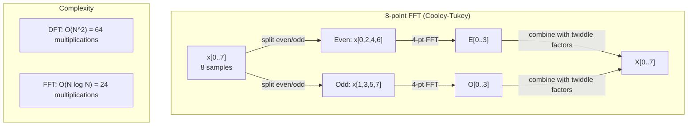
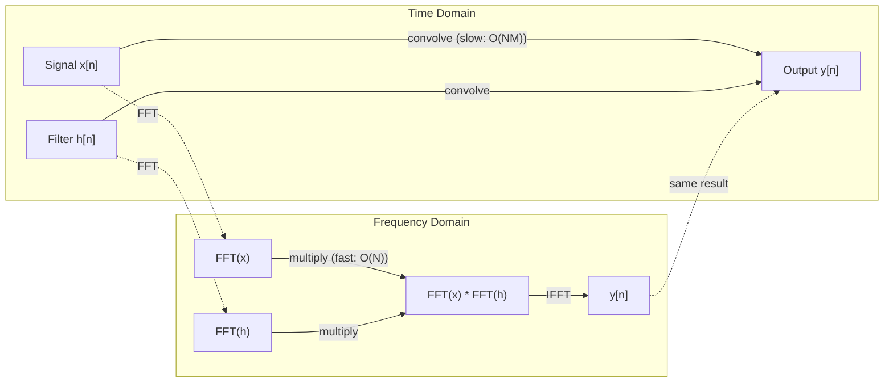

# 푸리에 변환 (The Fourier Transform)

> 모든 신호는 사인파의 합이다. 푸리에 변환(Fourier transform)은 어떤 사인파들인지 알려준다.

**Type:** Build
**Language:** Python
**Prerequisites:** Phase 1, Lessons 01-04, 19 (complex numbers)
**Time:** ~90분

## 학습 목표 (Learning Objectives)

- DFT를 밑바닥부터 구현하고 O(N log N) 쿨리-튜키(Cooley-Tukey) FFT와 대조하여 검증하기
- 주파수 계수 해석하기: 신호에서 진폭, 위상, 파워 스펙트럼 추출하기
- 합성곱 정리(convolution theorem)를 적용해 FFT 곱셈으로 합성곱(convolution) 수행하기
- 푸리에 주파수 분해를 트랜스포머(transformer) 위치 인코딩(positional encoding) 및 CNN 합성곱 층(layer)과 연결하기

## 문제 (The Problem)

오디오 녹음은 시간에 따른 압력 측정값의 시퀀스다. 주가는 날에 따른 값의 시퀀스다. 이미지는 공간에 따른 픽셀 강도의 격자다. 이 모든 것은 시간 영역(time domain)(또는 공간 영역)의 데이터다. 어떤 인덱스에 따라 값이 변하는 것을 본다.

하지만 많은 패턴은 시간 영역에서 보이지 않는다. 이 오디오 신호는 순음(pure tone)인가 화음(chord)인가? 이 주가에는 주간 주기가 있는가? 이 이미지에는 반복되는 질감이 있는가? 이 질문들은 주파수 내용에 관한 것이며, 시간 영역은 그것을 숨긴다.

푸리에 변환은 데이터를 시간 영역에서 주파수 영역(frequency domain)으로 변환한다. 신호를 받아 서로 다른 주파수의 사인파로 분해한다. 각 사인파에는 진폭(얼마나 강한지)과 위상(어디서 시작하는지)이 있다. 푸리에 변환은 둘 다 알려준다.

이것이 ML에 중요한 이유는 주파수 영역적 사고가 어디에나 등장하기 때문이다. 합성곱 신경망(convolutional neural network)은 합성곱을 수행하는데, 이는 주파수 영역에서의 곱셈이다. 트랜스포머 위치 인코딩은 위치를 표현하기 위해 주파수 분해를 쓴다. 오디오 모델(음성 인식, 음악 생성)은 스펙트로그램(spectrogram) — 소리의 주파수 표현 — 위에서 작동한다. 시계열 모델은 주기적 패턴을 찾는다. 푸리에 변환을 이해하면 이 모든 것을 다룰 어휘를 갖게 된다.

## 개념 (The Concept)

### DFT 정의

N개의 표본 x[0], x[1], ..., x[N-1]이 주어지면, 이산 푸리에 변환(Discrete Fourier Transform)은 N개의 주파수 계수 X[0], X[1], ..., X[N-1]을 만든다.

```
X[k] = sum_{n=0}^{N-1} x[n] * e^(-2*pi*i*k*n/N)

for k = 0, 1, ..., N-1
```

각 X[k]는 복소수(complex number)다. 그 크기 |X[k]|는 주파수 k의 진폭을 알려준다. 그 위상 angle(X[k])는 그 주파수의 위상 오프셋을 알려준다.

핵심 통찰: `e^(-2*pi*i*k*n/N)`은 주파수 k에서 회전하는 페이저(phasor)다. DFT는 신호와 N개의 균등 간격 주파수 각각 사이의 상관을 계산한다. 신호가 주파수 k에 에너지를 담고 있으면 상관이 크다. 아니면 0에 가깝다.

### 각 계수가 의미하는 것

**X[0]: DC 성분.** 이것은 모든 표본의 합이다 — 평균에 비례한다. 신호의 상수(영주파수) 오프셋을 나타낸다.

```
X[0] = sum_{n=0}^{N-1} x[n] * e^0 = sum of all samples
```

**1 <= k <= N/2에 대한 X[k]: 양의 주파수.** X[k]는 N개 표본당 k 사이클의 주파수를 나타낸다. k가 클수록 주파수가 높다(더 빠른 진동).

**X[N/2]: 나이퀴스트(Nyquist) 주파수.** N개 표본으로 표현할 수 있는 가장 높은 주파수다. 이 위로는 에일리어싱(aliasing)이 생긴다 — 높은 주파수가 낮은 주파수로 위장한다.

**N/2 < k < N에 대한 X[k]: 음의 주파수.** 실수값 신호의 경우, X[N-k] = conj(X[k])다. 음의 주파수는 양의 주파수의 거울상이다. 이것이 유용한 정보가 첫 N/2 + 1개의 계수에 있는 이유다.

### 역 DFT

역 DFT는 주파수 계수로부터 원래 신호를 재구성한다.

```
x[n] = (1/N) * sum_{k=0}^{N-1} X[k] * e^(2*pi*i*k*n/N)

for n = 0, 1, ..., N-1
```

순방향 DFT로부터의 유일한 차이: 지수의 부호가 양수(음수가 아님)이고, 1/N 정규화 인수가 있다.

역 DFT는 완벽한 재구성이다. 정보가 손실되지 않는다. 시간 영역에서 주파수 영역으로, 그리고 다시 오차 없이 갈 수 있다. DFT는 기저 변환(change of basis)이다 — 같은 정보를 다른 좌표계로 재표현한다.

### FFT: 빠르게 만들기

위에서 정의한 DFT는 O(N^2)다. N개의 출력 계수 각각에 대해 N개의 입력 표본을 합산한다. N = 100만이면 10^12번의 연산이다.

고속 푸리에 변환(Fast Fourier Transform, FFT)은 같은 결과를 O(N log N)으로 계산한다. N = 100만이면 1조 대신 약 2천만 번의 연산이다. 이것이 주파수 분석을 실용적으로 만드는 것이다.

쿨리-튜키 알고리즘(가장 흔한 FFT)은 분할 정복으로 작동한다.

1. 신호를 짝수 인덱스와 홀수 인덱스 표본으로 나눈다.
2. 각 절반의 DFT를 재귀적으로 계산한다.
3. "트위들 인수(twiddle factor)" e^(-2*pi*i*k/N)을 사용해 두 절반 크기 DFT를 결합한다.

```
X[k] = E[k] + e^(-2*pi*i*k/N) * O[k]          for k = 0, ..., N/2 - 1
X[k + N/2] = E[k] - e^(-2*pi*i*k/N) * O[k]    for k = 0, ..., N/2 - 1

where E = DFT of even-indexed samples
      O = DFT of odd-indexed samples
```

대칭성(symmetry)은 각 재귀 수준이 O(N)의 작업을 하고 log2(N)개의 수준이 있음을 뜻한다. 총: O(N log N).



FFT는 신호 길이가 2의 거듭제곱이어야 한다. 실제로 신호는 다음 2의 거듭제곱까지 0으로 채워진다(zero-pad).

### 스펙트럼 분석

**파워 스펙트럼(power spectrum)**은 |X[k]|^2다 — 각 주파수 계수의 제곱 크기. 각 주파수에 에너지가 얼마나 있는지 보여준다.

**위상 스펙트럼(phase spectrum)**은 angle(X[k])다 — 각 주파수의 위상 오프셋. 대부분의 분석 과제에서는 파워 스펙트럼에 관심을 두고 위상은 무시한다.

```
Power at frequency k:  P[k] = |X[k]|^2 = X[k].real^2 + X[k].imag^2
Phase at frequency k:  phi[k] = atan2(X[k].imag, X[k].real)
```

### 주파수 해상도

DFT의 주파수 해상도는 표본 수 N과 샘플링 레이트 fs에 달려 있다.

```
Frequency of bin k:      f_k = k * fs / N
Frequency resolution:    delta_f = fs / N
Maximum frequency:       f_max = fs / 2  (Nyquist)
```

서로 가까운 두 주파수를 분해하려면 더 많은 표본이 필요하다. 높은 주파수를 포착하려면 더 높은 샘플링 레이트가 필요하다.

### 합성곱 정리 (The convolution theorem)

이것은 신호 처리에서 가장 중요한 결과 중 하나이며 CNN과 직접 관련된다.

**시간 영역에서의 합성곱은 주파수 영역에서의 점별 곱셈과 같다.**

```
x * h = IFFT(FFT(x) . FFT(h))

where * is convolution and . is element-wise multiplication
```

이것이 중요한 이유:

- 길이 N과 M의 두 신호를 직접 합성곱하면 O(N*M) 연산이 든다.
- FFT 기반 합성곱은 O(N log N)이 든다: 둘 다 변환하고, 곱하고, 다시 변환한다.
- 큰 커널(kernel)의 경우, FFT 합성곱이 극적으로 빠르다.
- 이것이 큰 수용 영역(receptive field)을 가진 합성곱 층에서 정확히 일어나는 일이다.

참고: DFT는 순환 합성곱(circular convolution)을 계산한다(신호가 감싸 돈다). 선형 합성곱(linear convolution, 감싸 돌지 않음)을 위해서는 계산 전에 두 신호를 길이 N + M - 1로 0으로 채운다.



### 윈도잉 (Windowing)

DFT는 신호가 주기적이라고 가정한다 — N개의 표본을 무한히 반복하는 신호의 한 주기로 취급한다. 신호가 같은 값에서 시작하고 끝나지 않으면, 이는 경계에서 불연속을 만들고, 이것이 가짜 고주파 내용으로 나타난다. 이를 스펙트럼 누출(spectral leakage)이라고 한다.

윈도잉은 DFT 계산 전에 신호를 양 끝에서 0으로 점차 줄여 누출을 감소시킨다.

흔한 윈도:

| 윈도 | 모양 | 주엽 폭 | 부엽 수준 | 사용 사례 |
|--------|-------|----------------|-----------------|----------|
| 직사각형(Rectangular) | 평탄(윈도 없음) | 가장 좁음 | 가장 높음 (-13 dB) | 신호가 N개 표본에서 정확히 주기적일 때 |
| 한(Hann) | 융기된 코사인 | 중간 | 낮음 (-31 dB) | 범용 스펙트럼 분석 |
| 해밍(Hamming) | 수정된 코사인 | 중간 | 더 낮음 (-42 dB) | 오디오 처리, 음성 분석 |
| 블랙맨(Blackman) | 삼중 코사인 | 넓음 | 매우 낮음 (-58 dB) | 부엽 억제가 결정적일 때 |

```
Hann window:    w[n] = 0.5 * (1 - cos(2*pi*n / (N-1)))
Hamming window: w[n] = 0.54 - 0.46 * cos(2*pi*n / (N-1))
```

DFT 전에 신호와 원소별로 곱하여 윈도를 적용한다: `X = DFT(x * w)`.

### DFT 성질

| 성질 | 시간 영역 | 주파수 영역 |
|----------|-------------|-----------------|
| 선형성 | a*x + b*y | a*X + b*Y |
| 시간 이동 | x[n - k] | X[f] * e^(-2*pi*i*f*k/N) |
| 주파수 이동 | x[n] * e^(2*pi*i*f0*n/N) | X[f - f0] |
| 합성곱 | x * h | X * H (점별) |
| 곱셈 | x * h (점별) | X * H (순환 합성곱, 1/N로 스케일) |
| 파스발 정리 | sum \|x[n]\|^2 | (1/N) * sum \|X[k]\|^2 |
| 켤레 대칭성 (실수 입력) | x[n] 실수 | X[k] = conj(X[N-k]) |

파스발 정리(Parseval's theorem)는 전체 에너지가 두 영역에서 같다고 말한다. 에너지는 변환을 통해 보존된다.

### 위치 인코딩과의 연결

원래 Transformer는 사인파 위치 인코딩을 쓴다.

```
PE(pos, 2i)   = sin(pos / 10000^(2i/d_model))
PE(pos, 2i+1) = cos(pos / 10000^(2i/d_model))
```

각 차원 쌍 (2i, 2i+1)은 서로 다른 주파수로 진동한다. 주파수는 높음(차원 0,1)에서 낮음(마지막 차원)까지 기하학적으로 배치된다. 이는 각 위치에 모든 주파수 대역에 걸친 고유한 패턴을 준다 — 푸리에 계수가 신호를 고유하게 식별하는 방식과 비슷하다.

이것이 제공하는 핵심 성질:

- **유일성:** 두 위치가 같은 인코딩을 갖지 않는다.
- **유계 값:** sin과 cos은 항상 [-1, 1]에 있다.
- **상대 위치:** 위치 p+k의 인코딩은 위치 p의 인코딩의 선형 함수로 표현될 수 있다. 모델은 상대 위치에 주목하는 법을 배울 수 있다.

### CNN과의 연결

합성곱 층은 학습된 필터(커널)를 신호나 이미지에 걸쳐 미끄러뜨려 입력에 적용한다. 수학적으로 이것이 합성곱 연산이다.

합성곱 정리에 의해, 이는 다음과 동등하다.
1. 입력을 FFT
2. 커널을 FFT
3. 주파수 영역에서 곱셈
4. 결과를 IFFT

표준 CNN 구현은 직접 합성곱을 쓴다(작은 3x3 커널에 더 빠름). 하지만 큰 커널이나 전역 합성곱의 경우 FFT 기반 접근이 상당히 빠르다. 일부 아키텍처(FNet 같은)는 어텐션(attention)을 FFT로 완전히 대체하여, O(N^2) 대신 O(N log N) 복잡도로 경쟁력 있는 정확도를 달성한다.

### 스펙트로그램과 단시간 푸리에 변환

단일 FFT는 전체 신호의 주파수 내용을 주지만, 그 주파수가 언제 발생하는지에 대해서는 아무것도 알려주지 않는다. 처프(chirp, 주파수가 시간에 따라 증가하는 신호)와 화음(모든 주파수가 동시에 존재)은 같은 크기 스펙트럼을 가질 수 있다.

단시간 푸리에 변환(Short-Time Fourier Transform, STFT)은 신호의 겹치는 윈도에서 FFT를 계산하여 이를 해결한다. 결과는 스펙트로그램이다. 한 축에 시간, 다른 축에 주파수를 가진 2D 표현이다. 각 점의 강도는 그 시간에 그 주파수에서의 에너지를 보여준다.

```
STFT procedure:
1. Choose a window size (e.g., 1024 samples)
2. Choose a hop size (e.g., 256 samples -- 75% overlap)
3. For each window position:
   a. Extract the windowed segment
   b. Apply a Hann/Hamming window
   c. Compute FFT
   d. Store the magnitude spectrum as one column of the spectrogram
```

스펙트로그램은 오디오 ML 모델의 표준 입력 표현이다. 음성 인식 모델(Whisper, DeepSpeech)은 멜 스펙트로그램(mel-spectrogram) 위에서 작동한다 — 주파수를 멜 척도로 매핑한 스펙트로그램으로, 인간의 음높이 지각과 더 잘 맞는다.

### 에일리어싱 (Aliasing)

신호가 fs/2(나이퀴스트 주파수) 위의 주파수를 담고 있으면, 레이트 fs로 샘플링하면 에일리어싱된 복사본이 생긴다. 100 Hz로 샘플링된 90 Hz 신호는 10 Hz 신호와 동일하게 보인다. 표본만으로는 그것들을 구별할 방법이 없다.

```
Example:
  True signal: 90 Hz sine wave
  Sampling rate: 100 Hz
  Apparent frequency: 100 - 90 = 10 Hz

  The samples from the 90 Hz signal at 100 Hz sampling rate
  are identical to the samples from a 10 Hz signal.
  No amount of math can recover the original 90 Hz.
```

이것이 아날로그-디지털 변환기가 샘플링 전에 나이퀴스트 위의 주파수를 제거하는 안티 에일리어싱 필터를 포함하는 이유다. ML에서는 적절한 저역 통과 필터링 없이 특성 맵을 다운샘플링할 때 에일리어싱이 나타난다 — 일부 아키텍처는 안티 에일리어싱 풀링(pooling) 층으로 이를 다룬다.

### 0으로 채우기는 해상도를 높이지 않는다

흔한 오해: FFT 전에 신호를 0으로 채우면 주파수 해상도가 개선된다. 그렇지 않다. 0으로 채우기는 기존 주파수 빈 사이를 보간하여, 더 매끄러워 보이는 스펙트럼을 준다. 하지만 원래 표본에 없었던 주파수 세부를 드러낼 수는 없다.

진짜 주파수 해상도는 오직 관측 시간 T = N / fs에만 달려 있다. delta_f만큼 떨어진 두 주파수를 분해하려면 최소 T = 1 / delta_f초의 데이터가 필요하다. 아무리 0으로 채워도 이 근본적 한계는 바뀌지 않는다.

## 직접 만들기 (Build It)

### 1단계: DFT를 밑바닥부터

O(N^2) DFT는 정의에서 직접 따라온다.

```python
import math

class Complex:
    ...

def dft(x):
    N = len(x)
    result = []
    for k in range(N):
        total = Complex(0, 0)
        for n in range(N):
            angle = -2 * math.pi * k * n / N
            w = Complex(math.cos(angle), math.sin(angle))
            xn = x[n] if isinstance(x[n], Complex) else Complex(x[n])
            total = total + xn * w
        result.append(total)
    return result
```

### 2단계: 역 DFT

같은 구조, 양의 지수, N으로 나눈다.

```python
def idft(X):
    N = len(X)
    result = []
    for n in range(N):
        total = Complex(0, 0)
        for k in range(N):
            angle = 2 * math.pi * k * n / N
            w = Complex(math.cos(angle), math.sin(angle))
            total = total + X[k] * w
        result.append(Complex(total.real / N, total.imag / N))
    return result
```

### 3단계: FFT (쿨리-튜키)

재귀 FFT는 2의 거듭제곱 길이가 필요하다. 짝수와 홀수로 나누고, 재귀하고, 트위들 인수로 결합한다.

```python
def fft(x):
    N = len(x)
    if N <= 1:
        return [x[0] if isinstance(x[0], Complex) else Complex(x[0])]
    if N % 2 != 0:
        return dft(x)

    even = fft([x[i] for i in range(0, N, 2)])
    odd = fft([x[i] for i in range(1, N, 2)])

    result = [Complex(0)] * N
    for k in range(N // 2):
        angle = -2 * math.pi * k / N
        twiddle = Complex(math.cos(angle), math.sin(angle))
        t = twiddle * odd[k]
        result[k] = even[k] + t
        result[k + N // 2] = even[k] - t
    return result
```

### 4단계: 스펙트럼 분석 도우미

```python
def power_spectrum(X):
    return [xk.real ** 2 + xk.imag ** 2 for xk in X]

def convolve_fft(x, h):
    N = len(x) + len(h) - 1
    padded_N = 1
    while padded_N < N:
        padded_N *= 2

    x_padded = x + [0.0] * (padded_N - len(x))
    h_padded = h + [0.0] * (padded_N - len(h))

    X = fft(x_padded)
    H = fft(h_padded)

    Y = [xk * hk for xk, hk in zip(X, H)]

    y = idft(Y)
    return [y[n].real for n in range(N)]
```

## 라이브러리로 써보기 (Use It)

실제 작업에는 고도로 최적화된 C 라이브러리로 뒷받침되는 numpy의 FFT를 써라.

```python
import numpy as np

signal = np.sin(2 * np.pi * 5 * np.arange(256) / 256)
spectrum = np.fft.fft(signal)
freqs = np.fft.fftfreq(256, d=1/256)

power = np.abs(spectrum) ** 2

positive_freqs = freqs[:len(freqs)//2]
positive_power = power[:len(power)//2]
```

윈도잉과 더 고급 스펙트럼 분석을 위해:

```python
from scipy.signal import windows, stft

window = windows.hann(256)
windowed = signal * window
spectrum = np.fft.fft(windowed)
```

합성곱을 위해:

```python
from scipy.signal import fftconvolve

result = fftconvolve(signal, kernel, mode='full')
```

스펙트로그램을 위해:

```python
from scipy.signal import stft

frequencies, times, Zxx = stft(signal, fs=sample_rate, nperseg=256)
spectrogram = np.abs(Zxx) ** 2
```

스펙트로그램 행렬은 shape (n_frequencies, n_time_frames)를 가진다. 각 열은 한 시간 윈도에서의 파워 스펙트럼이다. 이것이 오디오 ML 모델이 입력으로 소비하는 것이다.

## 산출물 (Ship It)

`code/fourier.py`를 실행하여 `outputs/prompt-spectral-analyzer.md`를 생성하라.

## 연습 문제 (Exercises)

1. **순음 식별.** 128 Hz로 1초 동안 샘플링된, 알 수 없는 주파수(1에서 50 Hz 사이)의 단일 사인파를 가진 신호를 만들어라. 당신의 DFT를 사용해 주파수를 식별하라. 답이 일치하는지 검증하라. 이제 표준편차 0.5의 가우시안 잡음을 추가하고 반복하라. 잡음이 스펙트럼에 어떤 영향을 주는가?

2. **FFT vs DFT 검증.** 길이 64의 무작위 신호를 생성하라. DFT(O(N^2))와 FFT를 모두 계산하라. 모든 계수가 1e-10 이내로 일치하는지 검증하라. 길이 256, 512, 1024, 2048의 신호에서 두 함수의 시간을 재라. DFT 시간 대 FFT 시간의 비율을 플롯하라.

3. **예시로 보는 합성곱 정리 증명.** 신호 x = [1, 2, 3, 4, 0, 0, 0, 0]과 필터 h = [1, 1, 1, 0, 0, 0, 0, 0]을 만들어라. 그것들의 순환 합성곱을 직접 계산하라(중첩 루프). 그다음 FFT로 계산하라(변환, 곱셈, 역변환). 결과가 일치하는지 검증하라. 이제 적절히 0으로 채워 선형 합성곱을 하라.

4. **윈도잉 효과.** 10 Hz와 12 Hz(매우 가까움)의 두 사인파의 합인 신호를 만들어라. 128 Hz로 1초 동안 샘플링하라. 윈도 없이, 한 윈도로, 해밍 윈도로 파워 스펙트럼을 계산하라. 어떤 윈도가 두 봉우리를 구별하기 가장 쉽게 만드는가? 왜인가?

5. **위치 인코딩 분석.** d_model = 128, max_pos = 512에 대한 사인파 위치 인코딩을 생성하라. 각 위치 쌍 (p1, p2)에 대해 그 인코딩의 내적을 계산하라. 내적이 절대 위치가 아니라 |p1 - p2|에만 의존함을 보여라. 거리가 증가하면 내적은 어떻게 되는가?

## 핵심 용어 (Key Terms)

| 용어 | 의미 |
|------|---------------|
| DFT (이산 푸리에 변환) | N개의 시간 영역 표본을 N개의 주파수 영역 계수로 변환. 각 계수는 그 주파수의 복소 사인파와의 상관 |
| FFT (고속 푸리에 변환) | DFT를 계산하는 O(N log N) 알고리즘. 쿨리-튜키 알고리즘은 짝수/홀수 인덱스를 재귀적으로 나눔 |
| 역 DFT | 주파수 계수로부터 시간 영역 신호를 재구성. 지수 부호를 뒤집고 1/N 스케일링한 DFT와 같은 공식 |
| 주파수 빈(Frequency bin) | DFT 출력의 각 인덱스 k는 주파수 k*fs/N Hz를 나타냄. "빈"은 이산 주파수 슬롯 |
| DC 성분 | X[0], 영주파수 계수. 신호 평균에 비례 |
| 나이퀴스트 주파수 | fs/2, 샘플링 레이트 fs에서 표현 가능한 최대 주파수. 이 위의 주파수는 에일리어싱됨 |
| 파워 스펙트럼(Power spectrum) | \|X[k]\|^2, 각 주파수 계수의 제곱 크기. 주파수에 걸친 에너지 분포를 보여줌 |
| 위상 스펙트럼(Phase spectrum) | angle(X[k]), 각 주파수 성분의 위상 오프셋. 분석에서 종종 무시됨 |
| 스펙트럼 누출(Spectral leakage) | 비주기 신호를 주기적으로 취급하여 생긴 가짜 주파수 내용. 윈도잉으로 감소 |
| 윈도 함수(Window function) | 스펙트럼 누출을 줄이기 위해 DFT 전에 적용하는 점감 함수(한, 해밍, 블랙맨) |
| 트위들 인수(Twiddle factor) | FFT 버터플라이 계산에서 하위 DFT를 결합하는 데 쓰는 복소 지수 e^(-2*pi*i*k/N) |
| 합성곱 정리(Convolution theorem) | 시간 영역의 합성곱은 주파수 영역의 점별 곱셈과 같음. 신호 처리와 CNN의 근본 |
| 순환 합성곱(Circular convolution) | 신호가 감싸 도는 합성곱. DFT가 자연스럽게 계산하는 것 |
| 선형 합성곱(Linear convolution) | 감싸 돌지 않는 표준 합성곱. DFT 전에 0으로 채워 달성 |
| 파스발 정리(Parseval's theorem) | 전체 에너지가 푸리에 변환을 통해 보존됨. sum \|x[n]\|^2 = (1/N) sum \|X[k]\|^2 |
| 에일리어싱(Aliasing) | 불충분한 샘플링 레이트로 인해 나이퀴스트 위의 주파수가 낮은 주파수로 나타나는 것 |

## 더 읽을거리 (Further Reading)

- [Cooley & Tukey: An Algorithm for the Machine Calculation of Complex Fourier Series (1965)](https://www.ams.org/journals/mcom/1965-19-090/S0025-5718-1965-0178586-1/) - 컴퓨팅을 바꾼 원래의 FFT 논문
- [3Blue1Brown: But what is the Fourier Transform?](https://www.youtube.com/watch?v=spUNpyF58BY) - 푸리에 변환에 대한 최고의 시각적 입문
- [Lee-Thorp et al.: FNet: Mixing Tokens with Fourier Transforms (2021)](https://arxiv.org/abs/2105.03824) - 트랜스포머에서 셀프 어텐션을 FFT로 대체
- [Smith: The Scientist and Engineer's Guide to Digital Signal Processing](http://www.dspguide.com/) - FFT, 윈도잉, 스펙트럼 분석을 깊이 다루는 무료 온라인 교과서
- [Vaswani et al.: Attention Is All You Need (2017)](https://arxiv.org/abs/1706.03762) - 푸리에 주파수 분해에서 유도된 사인파 위치 인코딩
- [Radford et al.: Whisper (2022)](https://arxiv.org/abs/2212.04356) - 멜 스펙트로그램을 입력 표현으로 쓰는 음성 인식
