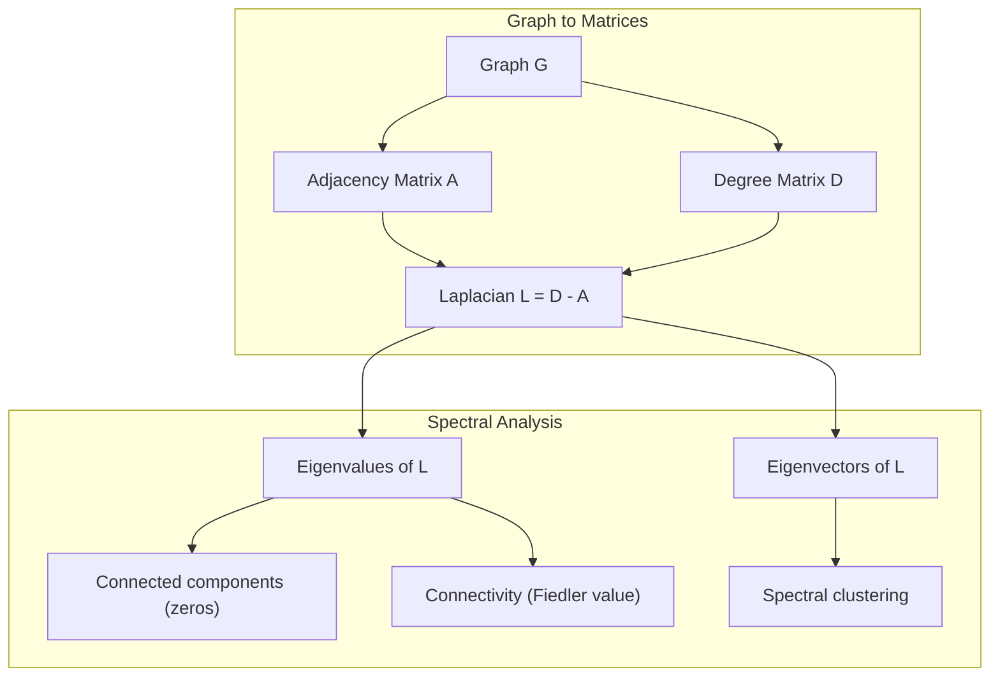
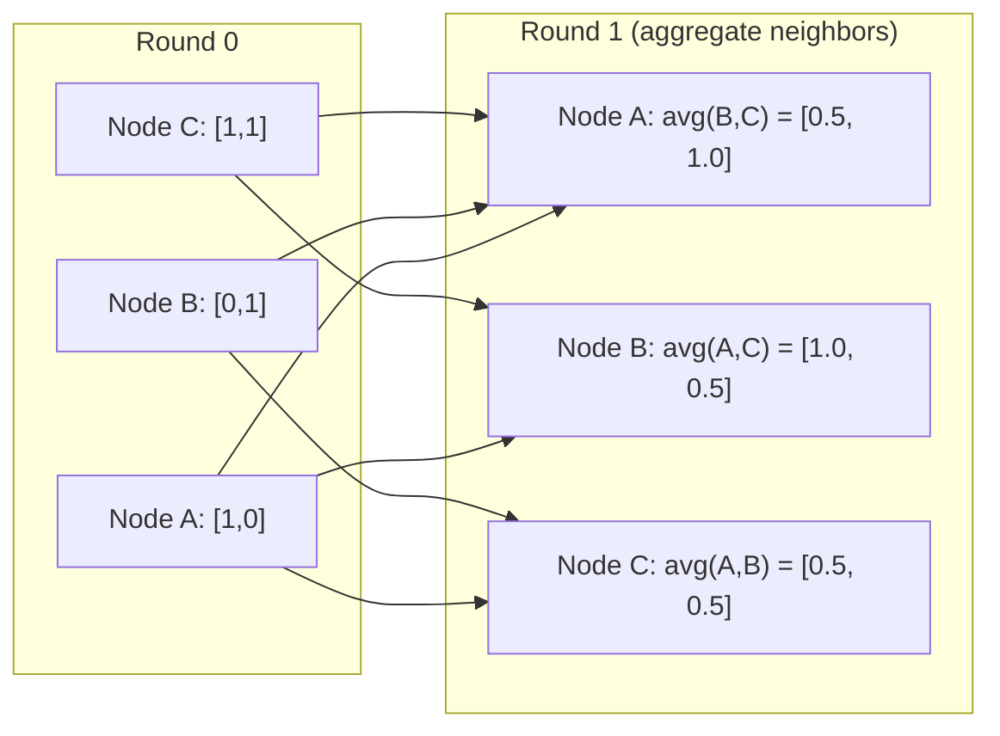

# 머신러닝을 위한 그래프 이론 (Graph Theory for Machine Learning)

> 그래프(graph)는 관계의 자료 구조다. 데이터에 연결이 있다면 그래프 이론이 필요하다.

**Type:** Build
**Language:** Python
**Prerequisites:** Phase 1, Lessons 01-03 (linear algebra, matrices)
**Time:** ~90분

## 학습 목표 (Learning Objectives)

- 인접 행렬(adjacency matrix)/리스트 표현을 가진 그래프 클래스를 만들고 BFS와 DFS 순회 구현하기
- 그래프 라플라시안(Laplacian)을 계산하고 그 고윳값(eigenvalue)을 사용해 연결 요소(connected component)를 탐지하고 노드를 클러스터링하기
- 정규화된 인접 행렬 곱셈으로 GNN 스타일 메시지 전달(message passing) 한 라운드 구현하기
- 피들러 벡터(Fiedler vector)를 사용해 그래프를 분할하는 스펙트럼 클러스터링(spectral clustering) 적용하기

## 문제 (The Problem)

소셜 네트워크, 분자, 지식 베이스, 인용 네트워크, 도로 지도 — 모두 그래프다. 전통적인 ML은 데이터를 평평한 표로 취급한다. 각 행은 독립적이다. 각 특성(feature)은 열이다. 하지만 연결의 구조가 중요할 때, 표는 실패한다.

소셜 네트워크를 생각해 보라. 어떤 사용자가 무슨 제품을 살지 예측하고 싶다. 그 사람의 구매 이력이 중요하다. 하지만 그 친구들의 구매 이력이 더 중요하다. 연결이 신호를 운반한다.

또는 분자를 생각해 보라. 그것이 단백질에 결합하는지 예측하고 싶다. 원자가 중요하지만, 정말 중요한 것은 원자들이 어떻게 서로 결합되어 있는지다. 구조가 곧 데이터다.

그래프 신경망(Graph Neural Network, GNN)은 딥러닝에서 가장 빠르게 성장하는 분야다. 신약 발견, 소셜 추천, 사기 탐지, 지식 그래프 추론을 구동한다. 모든 GNN은 같은 기초 위에 세워진다. 기본 그래프 이론.

네 가지가 필요하다.
1. 그래프를 행렬(matrix)로 표현하는 방법(그래야 곱할 수 있다)
2. 그래프 구조를 탐색하는 순회 알고리즘
3. 라플라시안 — 스펙트럼 그래프 이론에서 가장 중요한 단 하나의 행렬
4. 메시지 전달 — GNN을 동작하게 만드는 연산

## 개념 (The Concept)

### 그래프: 노드와 간선

그래프 G = (V, E)는 정점(노드) V와 간선(edge) E로 이루어진다. 각 간선은 두 노드를 연결한다.

**방향 vs 무방향.** 무방향 그래프에서 간선 (u, v)는 u가 v에 연결되고 v도 u에 연결됨을 의미한다. 방향 그래프(digraph)에서 간선 (u, v)는 u가 v를 가리키지만, 반드시 그 역은 아님을 의미한다.

**가중 vs 비가중.** 비가중 그래프에서 간선은 존재하거나 존재하지 않는다. 가중 그래프에서 각 간선은 수치 가중치(weight)를 가진다 — 거리, 비용, 강도.

| 그래프 유형 | 예시 |
|-----------|---------|
| 무방향, 비가중 | Facebook 친구 네트워크 |
| 방향, 비가중 | Twitter 팔로우 네트워크 |
| 무방향, 가중 | 도로 지도 (거리) |
| 방향, 가중 | 웹 페이지 링크 (PageRank 점수) |

### 인접 행렬 (The Adjacency Matrix)

인접 행렬 A는 핵심 표현이다. n개 노드를 가진 그래프의 경우:

```
A[i][j] = 1    if there is an edge from node i to node j
A[i][j] = 0    otherwise
```

무방향 그래프의 경우, A는 대칭이다: A[i][j] = A[j][i]. 가중 그래프의 경우, A[i][j] = 간선 (i, j)의 가중치.

**예시 -- 삼각형:**

```
Nodes: 0, 1, 2
Edges: (0,1), (1,2), (0,2)

A = [[0, 1, 1],
     [1, 0, 1],
     [1, 1, 0]]
```

인접 행렬은 모든 GNN의 입력이다. A에 대한 행렬 연산은 그래프에 대한 연산에 대응한다.

### 차수 (Degree)

노드의 차수(degree)는 그것에 연결된 간선의 수다. 방향 그래프의 경우, 진입 차수(in-degree, 들어오는 간선)와 진출 차수(out-degree, 나가는 간선)가 있다.

차수 행렬 D는 대각이다.

```
D[i][i] = degree of node i
D[i][j] = 0    for i != j
```

삼각형 예시의 경우: 모든 노드가 다른 둘에 연결되므로 D = diag(2, 2, 2).

차수는 노드 중요도에 대해 알려준다. 높은 차수 = 허브(hub) 노드. 네트워크의 차수 분포(degree distribution)는 그 구조를 드러낸다. 소셜 네트워크는 멱법칙(power law)을 따른다(소수의 허브, 다수의 잎 노드). 무작위 그래프는 푸아송 분포(Poisson-distributed) 차수를 가진다.

### BFS와 DFS

두 가지 근본적인 그래프 순회 알고리즘. 둘 다 필요하다.

**너비 우선 탐색(Breadth-First Search, BFS):** 먼저 모든 이웃을 탐색하고, 그다음 이웃의 이웃을 탐색한다. 큐(queue, FIFO)를 쓴다.

```
BFS from node 0:
  Visit 0
  Queue: [1, 2]        (neighbors of 0)
  Visit 1
  Queue: [2, 3]        (add neighbors of 1)
  Visit 2
  Queue: [3]           (neighbors of 2 already visited)
  Visit 3
  Queue: []            (done)
```

BFS는 비가중 그래프에서 최단 경로를 찾는다. 시작점에서 어떤 노드까지의 거리는 그 노드가 처음 발견된 BFS 수준과 같다. 이것이 BFS가 소셜 네트워크에서 홉 수(hop-count) 거리에 쓰이는 이유다.

**깊이 우선 탐색(Depth-First Search, DFS):** 되돌아가기 전에 가능한 한 깊이 들어간다. 스택(stack, LIFO)이나 재귀를 쓴다.

```
DFS from node 0:
  Visit 0
  Stack: [1, 2]        (neighbors of 0)
  Visit 2               (pop from stack)
  Stack: [1, 3]         (add neighbors of 2)
  Visit 3               (pop from stack)
  Stack: [1]
  Visit 1               (pop from stack)
  Stack: []             (done)
```

DFS는 다음에 유용하다.
- 연결 요소 찾기(방문하지 않은 노드에서 DFS 실행)
- 사이클 탐지(DFS 트리의 역방향 간선)
- 위상 정렬(topological sort, DFS 종료 순서의 역순)

| 알고리즘 | 자료 구조 | 찾는 것 | 사용 사례 |
|-----------|---------------|-------|----------|
| BFS | 큐 | 최단 경로 | 소셜 네트워크 거리, 지식 그래프 순회 |
| DFS | 스택 | 요소, 사이클 | 연결성, 위상 정렬 |

### 그래프 라플라시안 (The Graph Laplacian)

L = D - A. 스펙트럼 그래프 이론에서 가장 중요한 행렬.

삼각형의 경우:

```
D = [[2, 0, 0],    A = [[0, 1, 1],    L = [[2, -1, -1],
     [0, 2, 0],         [1, 0, 1],         [-1, 2, -1],
     [0, 0, 2]]         [1, 1, 0]]         [-1, -1,  2]]
```

라플라시안은 주목할 만한 성질을 가진다.

1. **L은 양의 준정부호(positive semi-definite)다.** 모든 고윳값이 >= 0이다.

2. **0인 고윳값의 수는 연결 요소의 수와 같다.** 연결된 그래프는 정확히 하나의 0 고윳값을 가진다. 3개의 분리된 요소를 가진 그래프는 3개의 0 고윳값을 가진다.

3. **가장 작은 0이 아닌 고윳값(피들러 값, Fiedler value)은 연결성을 측정한다.** 큰 피들러 값은 그래프가 잘 연결되어 있음을 의미한다. 작은 피들러 값은 그래프에 약점 — 병목(bottleneck) — 이 있음을 의미한다.

4. **피들러 값의 고유벡터(피들러 벡터, Fiedler vector)는 최선의 분할을 드러낸다.** 양수 값을 가진 노드는 한 그룹으로, 음수 값을 가진 노드는 다른 그룹으로 간다. 이것이 스펙트럼 클러스터링이다.



### 스펙트럼 성질

인접 행렬과 라플라시안의 고윳값은 어떤 순회도 없이 구조적 성질을 드러낸다.

**스펙트럼 클러스터링**은 이렇게 작동한다.
1. 라플라시안 L을 계산한다
2. L의 가장 작은 k개 고유벡터(eigenvector)를 찾는다(첫 번째는 건너뛴다. 연결된 그래프의 경우 모두 1이다)
3. 그 고유벡터를 각 노드의 새 좌표로 쓴다
4. 그 좌표에 k-평균을 실행한다

이것이 동작하는 이유는? L의 고유벡터는 그래프에서 "가장 매끄러운" 함수를 부호화한다. 잘 연결된 노드는 비슷한 고유벡터 값을 얻는다. 병목으로 분리된 노드는 다른 값을 얻는다. 고유벡터가 자연스럽게 클러스터를 분리한다.

**무작위 보행(random walk) 연결.** 정규화된 라플라시안은 그래프에서의 무작위 보행과 관련된다. 무작위 보행의 정상 분포(stationary distribution)는 노드 차수에 비례한다. 혼합 시간(mixing time, 보행이 얼마나 빨리 수렴하는지)은 스펙트럼 간격(spectral gap)에 달려 있다.

### 메시지 전달 (Message Passing)

그래프 신경망의 핵심 연산. 각 노드는 이웃으로부터 메시지를 수집하고, 그것들을 집계하고, 자신의 상태를 갱신한다.

```
h_v^(k+1) = UPDATE(h_v^(k), AGGREGATE({h_u^(k) : u in neighbors(v)}))
```

가장 단순한 형태에서, AGGREGATE = 평균, UPDATE = 선형 변환 + 활성화(activation):

```
h_v^(k+1) = sigma(W * mean({h_u^(k) : u in neighbors(v)}))
```

이것은 변장한 행렬 곱셈이다. H가 모든 노드 특성의 행렬이고 A가 인접 행렬이면:

```
H^(k+1) = sigma(A_norm * H^(k) * W)
```

여기서 A_norm은 정규화된 인접 행렬(각 행의 합이 1)이다.

메시지 전달 한 라운드는 각 노드가 직접 이웃을 "보게" 한다. 두 라운드는 이웃의 이웃을 보게 한다. K 라운드는 각 노드에 그 K-홉 이웃으로부터의 정보를 준다.



### 개념과 ML 응용

| 개념 | ML 응용 |
|---------|---------------|
| 인접 행렬 | GNN 입력 표현 |
| 그래프 라플라시안 | 스펙트럼 클러스터링, 커뮤니티 탐지 |
| BFS/DFS | 지식 그래프 순회, 경로 찾기 |
| 차수 분포 | 노드 중요도, 특성 공학 |
| 메시지 전달 | GNN 층(GCN, GAT, GraphSAGE) |
| L의 고윳값 | 커뮤니티 탐지, 그래프 분할 |
| 스펙트럼 클러스터링 | 비지도 노드 그룹화 |
| PageRank | 노드 중요도, 웹 검색 |

## 직접 만들기 (Build It)

### 1단계: 밑바닥부터 만드는 그래프 클래스

```python
class Graph:
    def __init__(self, n_nodes, directed=False):
        self.n = n_nodes
        self.directed = directed
        self.adj = {i: {} for i in range(n_nodes)}

    def add_edge(self, u, v, weight=1.0):
        self.adj[u][v] = weight
        if not self.directed:
            self.adj[v][u] = weight

    def neighbors(self, node):
        return list(self.adj[node].keys())

    def degree(self, node):
        return len(self.adj[node])

    def adjacency_matrix(self):
        import numpy as np
        A = np.zeros((self.n, self.n))
        for u in range(self.n):
            for v, w in self.adj[u].items():
                A[u][v] = w
        return A

    def degree_matrix(self):
        import numpy as np
        D = np.zeros((self.n, self.n))
        for i in range(self.n):
            D[i][i] = self.degree(i)
        return D

    def laplacian(self):
        return self.degree_matrix() - self.adjacency_matrix()
```

인접 리스트(`self.adj`)는 이웃을 효율적으로 저장한다. 인접 행렬 변환은 모든 스펙트럼 연산이 그것을 필요로 하므로 numpy를 쓴다.

### 2단계: BFS와 DFS

```python
from collections import deque

def bfs(graph, start):
    visited = set()
    order = []
    distances = {}
    queue = deque([(start, 0)])
    visited.add(start)
    while queue:
        node, dist = queue.popleft()
        order.append(node)
        distances[node] = dist
        for neighbor in graph.neighbors(node):
            if neighbor not in visited:
                visited.add(neighbor)
                queue.append((neighbor, dist + 1))
    return order, distances


def dfs(graph, start):
    visited = set()
    order = []
    stack = [start]
    while stack:
        node = stack.pop()
        if node in visited:
            continue
        visited.add(node)
        order.append(node)
        for neighbor in reversed(graph.neighbors(node)):
            if neighbor not in visited:
                stack.append(neighbor)
    return order
```

BFS는 O(1) popleft를 위해 deque(양방향 큐)를 쓴다. DFS는 리스트를 스택으로 쓴다. 둘 다 모든 노드를 정확히 한 번 방문한다 — O(V + E) 시간.

### 3단계: 연결 요소와 라플라시안 고윳값

```python
def connected_components(graph):
    visited = set()
    components = []
    for node in range(graph.n):
        if node not in visited:
            order, _ = bfs(graph, node)
            visited.update(order)
            components.append(order)
    return components


def laplacian_eigenvalues(graph):
    import numpy as np
    L = graph.laplacian()
    eigenvalues = np.linalg.eigvalsh(L)
    return eigenvalues
```

`eigvalsh`는 대칭 행렬용이다 — 라플라시안은 무방향 그래프의 경우 항상 대칭이다. 고윳값을 오름차순으로 반환한다. 0의 개수를 세어 연결 요소의 수를 찾는다.

### 4단계: 스펙트럼 클러스터링

```python
def spectral_clustering(graph, k=2):
    import numpy as np
    L = graph.laplacian()
    eigenvalues, eigenvectors = np.linalg.eigh(L)
    features = eigenvectors[:, 1:k+1]

    labels = np.zeros(graph.n, dtype=int)
    for i in range(graph.n):
        if features[i, 0] >= 0:
            labels[i] = 0
        else:
            labels[i] = 1
    return labels
```

k=2의 경우, 피들러 벡터의 부호가 그래프를 두 클러스터로 나눈다. k>2의 경우, 첫 k개 고유벡터(자명한 모두-1 고유벡터 제외)에 k-평균을 실행한다.

### 5단계: 메시지 전달

```python
def message_passing(graph, features, weight_matrix):
    import numpy as np
    A = graph.adjacency_matrix()
    row_sums = A.sum(axis=1, keepdims=True)
    row_sums[row_sums == 0] = 1
    A_norm = A / row_sums
    aggregated = A_norm @ features
    output = aggregated @ weight_matrix
    return output
```

이것이 GNN 메시지 전달 한 라운드다. 각 노드의 새 특성은 그 이웃 특성의 가중 평균을 가중치 행렬로 변환한 것이다. 여러 라운드를 쌓아 정보를 더 멀리 전파한다.

## 라이브러리로 써보기 (Use It)

networkx와 numpy를 쓰면, 같은 연산이 한 줄짜리다.

```python
import networkx as nx
import numpy as np

G = nx.karate_club_graph()

A = nx.adjacency_matrix(G).toarray()
L = nx.laplacian_matrix(G).toarray()

eigenvalues = np.linalg.eigvalsh(L.astype(float))
print(f"Smallest eigenvalues: {eigenvalues[:5]}")
print(f"Connected components: {nx.number_connected_components(G)}")

communities = nx.community.greedy_modularity_communities(G)
print(f"Communities found: {len(communities)}")

pr = nx.pagerank(G)
top_nodes = sorted(pr.items(), key=lambda x: x[1], reverse=True)[:5]
print(f"Top 5 PageRank nodes: {top_nodes}")
```

networkx는 최적화된 C 백엔드로 어떤 크기의 그래프든 처리한다. 프로덕션에서는 그것을 써라. 밑바닥 구현은 그것이 무엇을 하는지 이해하는 데 써라.

### numpy 스펙트럼 분석

```python
import numpy as np

A = np.array([
    [0, 1, 1, 0, 0],
    [1, 0, 1, 0, 0],
    [1, 1, 0, 1, 0],
    [0, 0, 1, 0, 1],
    [0, 0, 0, 1, 0]
])

D = np.diag(A.sum(axis=1))
L = D - A

eigenvalues, eigenvectors = np.linalg.eigh(L)
print(f"Eigenvalues: {np.round(eigenvalues, 4)}")
print(f"Fiedler value: {eigenvalues[1]:.4f}")
print(f"Fiedler vector: {np.round(eigenvectors[:, 1], 4)}")

fiedler = eigenvectors[:, 1]
group_a = np.where(fiedler >= 0)[0]
group_b = np.where(fiedler < 0)[0]
print(f"Cluster A: {group_a}")
print(f"Cluster B: {group_b}")
```

피들러 벡터가 무거운 일을 한다. 한 클러스터에서는 양수 항목, 다른 클러스터에서는 음수. 반복 최적화가 필요 없다 — 단 한 번의 고유분해(eigendecomposition)면 된다.

## 산출물 (Ship It)

이 레슨이 만들어내는 것:
- `outputs/skill-graph-analysis.md` -- 그래프 구조 데이터를 분석하기 위한 스킬 레퍼런스

## 연결 (Connections)

| 개념 | 등장하는 곳 |
|---------|------------------|
| 인접 행렬 | GCN, GAT, GraphSAGE 입력 |
| 라플라시안 | 스펙트럼 클러스터링, ChebNet 필터 |
| BFS | 지식 그래프 순회, 최단 경로 질의 |
| 메시지 전달 | 모든 GNN 층, 신경 메시지 전달 |
| 스펙트럼 간격 | 그래프 연결성, 무작위 보행의 혼합 시간 |
| 차수 분포 | 멱법칙 네트워크, 노드 특성 공학 |
| 연결 요소 | 전처리, 분리된 그래프 다루기 |
| PageRank | 노드 중요도 순위, 어텐션 초기화 |

GNN은 특별히 언급할 가치가 있다. GCN(Kipf & Welling, 2017)의 그래프 합성곱(convolution) 연산은 자기 루프(self-loop)가 추가된 인접 행렬 A_hat = A + I를 쓴다.

```text
H^(l+1) = sigma(D_hat^(-1/2) * A_hat * D_hat^(-1/2) * H^(l) * W^(l))
```

여기서 A_hat = A + I(인접 더하기 자기 루프)이고 D_hat은 A_hat의 차수 행렬이다. 자기 루프는 각 노드가 집계 동안 자신의 특성을 포함하도록 보장한다. 이것이 정확히 대칭 정규화(symmetric normalization)를 곁들인 메시지 전달이다. D_hat^(-1/2) * A_hat * D_hat^(-1/2)는 정규화된 인접 행렬이다. 이 정규화가 L_sym = I - D^(-1/2) * A * D^(-1/2)와 관련되기 때문에 라플라시안이 등장한다. 라플라시안을 이해하는 것은 GCN이 동작하는 이유를 이해하는 것이다.

## 연습 문제 (Exercises)

1. **PageRank를 밑바닥부터 구현하라.** 균등한 점수로 시작하라. 각 스텝에서: v를 가리키는 모든 u에 대해 score(v) = (1-d)/n + d * sum(score(u)/out_degree(u)). d=0.85를 쓰라. 수렴(변화 < 1e-6)까지 실행하라. 작은 웹 그래프에서 테스트하라.

2. **스펙트럼 클러스터링으로 커뮤니티를 찾아라.** 명확히 분리된 두 클러스터를 가진 그래프(예: 단일 간선으로 연결된 두 클리크)를 만들어라. 스펙트럼 클러스터링을 실행하고 올바른 분할을 찾는지 검증하라. 클러스터 간 간선을 더 추가하면 무슨 일이 일어나는가?

3. **가중 그래프에서 최단 경로를 위한 다익스트라(Dijkstra) 알고리즘을 구현하라.** 같은 그래프에 균등 가중치를 준 BFS와 결과를 비교하라.

4. **2층 메시지 전달 네트워크를 만들어라.** 서로 다른 가중치 행렬로 메시지 전달을 두 번 적용하라. 2 라운드 후 각 노드가 그 2-홉 이웃으로부터의 정보를 가짐을 보여라.

5. **실세계 그래프를 분석하라.** Karate Club 그래프(34개 노드, 78개 간선)를 쓰라. 차수 분포, 라플라시안 고윳값, 스펙트럼 클러스터링을 계산하라. 스펙트럼 클러스터링 결과를 알려진 정답 분할과 비교하라.

## 핵심 용어 (Key Terms)

| 용어 | 흔히 하는 말 | 실제 의미 |
|------|----------------|----------------------|
| 그래프(Graph) | "노드와 간선" | 쌍별 관계를 부호화하는 수학적 구조 G=(V,E) |
| 인접 행렬(Adjacency matrix) | "연결 표" | 노드 i와 j가 연결되어 있으면 A[i][j] = 1인 n x n 행렬 |
| 차수(Degree) | "노드가 얼마나 연결되어 있는지" | 노드에 닿는 간선의 수 |
| 라플라시안(Laplacian) | "D 빼기 A" | L = D - A, 그 고윳값이 그래프 구조를 드러내는 행렬 |
| 피들러 값(Fiedler value) | "대수적 연결성" | L의 가장 작은 0이 아닌 고윳값으로, 그래프가 얼마나 잘 연결되어 있는지 측정 |
| BFS | "수준별 탐색" | 더 깊이 가기 전에 모든 이웃을 방문하는 순회, 최단 경로를 찾음 |
| DFS | "먼저 깊이 들어가기" | 되돌아가기 전에 한 경로를 끝까지 따라가는 순회 |
| 메시지 전달(Message passing) | "노드가 이웃과 대화" | 각 노드가 그 이웃으로부터 정보를 집계하는 것, GNN의 핵심 |
| 스펙트럼 클러스터링(Spectral clustering) | "고유벡터로 클러스터링" | 라플라시안의 고유벡터를 사용해 그래프를 분할 |
| 연결 요소(Connected component) | "분리된 조각" | 모든 노드가 다른 모든 노드에 도달할 수 있는 극대 부분그래프 |

## 더 읽을거리 (Further Reading)

- **Kipf & Welling (2017)** -- "Semi-Supervised Classification with Graph Convolutional Networks." 현대 GNN을 출범시킨 논문. 스펙트럼 그래프 합성곱이 메시지 전달로 단순화됨을 보여준다.
- **Spielman (2012)** -- "Spectral Graph Theory" 강의 노트. 라플라시안, 스펙트럼 간격, 그래프 분할에 대한 결정적인 입문.
- **Hamilton (2020)** -- "Graph Representation Learning." 기초부터 응용까지 GNN을 다루는 책.
- **Bronstein et al. (2021)** -- "Geometric Deep Learning: Grids, Groups, Graphs, Geodesics, and Gauges." 통합 프레임워크 논문.
- **Veličković et al. (2018)** -- "Graph Attention Networks." 어텐션 메커니즘으로 메시지 전달을 확장.
