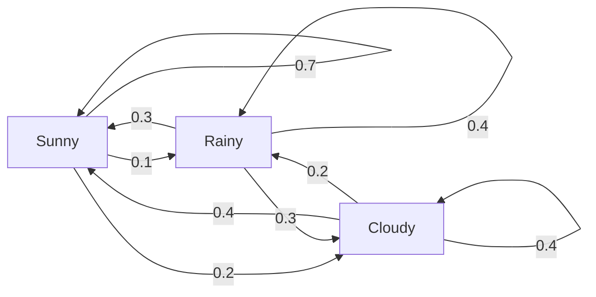
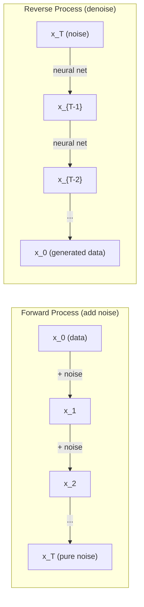

# 확률 과정 (Stochastic Processes)

> 구조를 가진 무작위성. 무작위 보행, 마르코프 연쇄, 확산 모델 뒤에 있는 수학.

**Type:** Learn
**Language:** Python
**Prerequisites:** Phase 1, Lessons 06-07 (probability, Bayes)
**Time:** ~75분

## 학습 목표 (Learning Objectives)

- 1D와 2D 무작위 보행(random walk)을 시뮬레이션하고 변위의 sqrt(n) 스케일링 검증하기
- 마르코프 연쇄(Markov chain) 시뮬레이터를 만들고 고유분해(eigendecomposition)를 통해 그 정상 분포(stationary distribution) 계산하기
- 목표 분포에서 샘플링하기 위해 메트로폴리스-헤이스팅스(Metropolis-Hastings) MCMC와 랑주뱅 동역학(Langevin dynamics) 구현하기
- 순방향 확산(diffusion) 과정을 브라운 운동(Brownian motion)과 연결하고 역방향 과정이 데이터를 생성하는 방식 설명하기

## 문제 (The Problem)

많은 AI 시스템은 시간에 따라 진화하는 무작위성을 포함한다. 정적인 무작위성이 아니라 — 각 스텝이 그 이전에 온 것에 의존하는 구조적이고 순차적인 무작위성이다.

언어 모델은 토큰(token)을 한 번에 하나씩 생성한다. 각 토큰은 이전 컨텍스트(context)에 의존한다. 모델은 확률 분포(probability distribution)를 출력하고, 거기서 샘플링하고, 다음으로 넘어간다. 그것이 확률 과정(stochastic process)이다.

확산 모델은 이미지가 순수한 잡음(static)이 될 때까지 한 스텝씩 잡음을 더한다. 그다음 과정을 거꾸로 돌려, 새 이미지가 나타날 때까지 한 스텝씩 노이즈를 제거한다. 순방향 과정은 마르코프 연쇄다. 역방향 과정은 거꾸로 돌아가는 학습된 마르코프 연쇄다.

강화 학습(reinforcement learning) 에이전트(agent)는 환경에서 행동을 취한다. 각 행동은 어떤 확률로 새로운 상태로 이어진다. 에이전트는 무작위 세계에서 무작위 정책을 따른다. 그 전체가 마르코프 결정 과정(Markov decision process)이다.

MCMC 샘플링 — 베이지안 추론(Bayesian inference)의 중추 — 은 정상 분포가 당신이 샘플링하고 싶은 사후 분포(posterior)인 마르코프 연쇄를 구성한다.

이 모든 것은 네 가지 근본 아이디어 위에 세워진다.
1. 무작위 보행 — 가장 단순한 확률 과정
2. 마르코프 연쇄 — 전이 행렬(transition matrix)을 가진 구조적 무작위성
3. 랑주뱅 동역학 — 잡음을 곁들인 경사 하강법(gradient descent)
4. 메트로폴리스-헤이스팅스 — 어떤 분포에서든 샘플링

## 개념 (The Concept)

### 무작위 보행 (Random Walks)

위치 0에서 시작한다. 각 스텝마다 공정한 동전을 던진다. 앞면: 오른쪽으로(+1) 이동. 뒷면: 왼쪽으로(-1) 이동.

n 스텝 후, 당신의 위치는 n개의 무작위 +/-1 값의 합이다. 기대 위치는 0이다(보행이 편향되지 않음). 하지만 원점으로부터의 기대 거리는 sqrt(n)으로 커진다.

이것은 직관에 반한다. 보행은 공정하다 — 어느 방향으로도 표류(drift)가 없다. 하지만 시간이 지나면서, 시작한 곳으로부터 점점 더 멀리 헤맨다. n 스텝 후의 표준편차는 sqrt(n)이다.

```
Step 0:  Position = 0
Step 1:  Position = +1 or -1
Step 2:  Position = +2, 0, or -2
...
Step 100: Expected distance from origin ~ 10 (sqrt(100))
Step 10000: Expected distance from origin ~ 100 (sqrt(10000))
```

**2D에서**, 보행은 같은 확률로 위, 아래, 왼쪽, 오른쪽으로 이동한다. 같은 sqrt(n) 스케일링이 원점으로부터의 거리에 적용된다. 경로는 프랙탈 같은 패턴을 그린다.

**왜 sqrt(n)인가?** 각 스텝은 같은 확률로 +1 또는 -1이다. n 스텝 후, 위치 S_n = X_1 + X_2 + ... + X_n이며 각 X_i는 +/-1이다. 각 스텝의 분산은 1이고, 스텝들은 독립적이므로 Var(S_n) = n이다. 표준편차 = sqrt(n). 중심 극한 정리(central limit theorem)에 의해, S_n / sqrt(n)은 표준 정규 분포로 수렴한다.

이 sqrt(n) 스케일링은 ML 어디에나 나타난다. SGD 잡음은 1/sqrt(batch_size)로 스케일링된다. 임베딩(embedding) 차원은 sqrt(d)로 스케일링된다. 제곱근은 독립적인 무작위 덧셈의 서명이다.

**브라운 운동과의 연결.** 스텝 크기가 1/sqrt(n)이고 단위 시간당 n 스텝인 무작위 보행을 취하라. n이 무한대로 가면, 보행은 브라운 운동 B(t)로 수렴한다 — B(t)가 평균 0, 분산 t인 정규 분포를 따르는 연속 시간 과정이다.

브라운 운동은 확산의 수학적 기초다. 유체 속 입자의 무작위 떨림, 주가의 변동, 그리고 — 결정적으로 — 확산 모델의 잡음 과정을 모델링한다.

**도박꾼의 파산(Gambler's ruin).** 위치 k에서 시작하고, 0과 N에 흡수 장벽(absorbing barrier)을 가진 무작위 보행자. 0보다 N에 먼저 도달할 확률은? 공정한 보행의 경우: P(N에 도달) = k/N. 이것은 놀랍도록 단순하고 우아하다. 마팅게일(martingale) 이론과 연결된다 — 공정한 무작위 보행은 마팅게일이다(기대 미래 값 = 현재 값).

### 마르코프 연쇄 (Markov Chains)

마르코프 연쇄는 고정된 확률에 따라 상태 사이를 전이하는 시스템이다. 핵심 성질: 다음 상태는 과거가 아니라 현재 상태에만 의존한다.

```
P(X_{t+1} = j | X_t = i, X_{t-1} = ...) = P(X_{t+1} = j | X_t = i)
```

이것이 마르코프 성질(Markov property)이다. 전체 동역학을 전이 행렬 P로 기술할 수 있음을 뜻한다.

```
P[i][j] = probability of going from state i to state j
```

P의 각 행은 1로 합산된다(어딘가로 가야 한다).

**예시 -- 날씨:**

```
States: Sunny (0), Rainy (1), Cloudy (2)

P = [[0.7, 0.1, 0.2],    (if sunny: 70% sunny, 10% rainy, 20% cloudy)
     [0.3, 0.4, 0.3],    (if rainy: 30% sunny, 40% rainy, 30% cloudy)
     [0.4, 0.2, 0.4]]    (if cloudy: 40% sunny, 20% rainy, 40% cloudy)
```

어떤 상태에서든 시작한다. 많은 전이 후, 상태의 분포는 pi * P = pi인 정상 분포 pi로 수렴한다. 이것이 고윳값(eigenvalue) 1을 가진 P의 좌측 고유벡터(left eigenvector)다.

날씨 연쇄의 경우, 정상 분포는 [0.53, 0.18, 0.29]일 수 있다 — 장기적으로, 시작 상태와 무관하게 53%의 시간이 맑다.



**정상 분포 계산.** 두 가지 접근법이 있다.

1. **거듭제곱 방법(Power method)**: 어떤 초기 분포든 P를 반복적으로 곱한다. 충분한 반복 후, 수렴한다.
2. **고윳값 방법(Eigenvalue method)**: 고윳값 1을 가진 P의 좌측 고유벡터를 찾는다. 이것이 고윳값 1을 가진 P^T의 고유벡터다.

두 접근법 모두 연쇄가 수렴 조건을 만족해야 한다.

**수렴 조건.** 마르코프 연쇄는 다음일 때 유일한 정상 분포로 수렴한다.
- **기약(Irreducible)**: 모든 상태가 다른 모든 상태로부터 도달 가능
- **비주기(Aperiodic)**: 연쇄가 고정된 주기로 순환하지 않음

ML에서 만나는 대부분의 연쇄는 두 조건을 모두 만족한다.

**흡수 상태(Absorbing states).** 한 상태에 들어가면 결코 떠나지 않으면 그것은 흡수 상태다(P[i][i] = 1). 흡수 마르코프 연쇄는 종료 상태를 가진 과정을 모델링한다 — 끝나는 게임, 이탈하는 고객, 텍스트 종료(end-of-text) 토큰에 도달하는 토큰 시퀀스.

**혼합 시간(Mixing time).** 연쇄가 정상 분포에 "가까워질" 때까지 몇 스텝이 걸리는가? 형식적으로, 정상성으로부터의 전변동 거리(total variation distance)가 어떤 임곗값 아래로 떨어질 때까지의 스텝 수. 빠른 혼합 = 적은 스텝 필요. P의 스펙트럼 간격(spectral gap, 1 빼기 두 번째로 큰 고윳값)이 혼합 시간을 제어한다. 큰 간격 = 빠른 혼합.

### 언어 모델과의 연결

언어 모델에서의 토큰 생성은 근사적으로 마르코프 과정이다. 현재 컨텍스트가 주어지면, 모델은 다음 토큰에 대한 분포를 출력한다. 온도(temperature)가 날카로움을 제어한다.

```
P(token_i) = exp(logit_i / temperature) / sum(exp(logit_j / temperature))
```

- 온도 = 1.0: 표준 분포
- 온도 < 1.0: 더 날카로움(더 결정적)
- 온도 > 1.0: 더 평평함(더 무작위)
- 온도 -> 0: argmax(그리디)

Top-k 샘플링은 확률이 가장 높은 k개 토큰으로 잘라낸다. Top-p(뉴클리어스) 샘플링은 누적 확률이 p를 초과하는 가장 작은 토큰 집합으로 잘라낸다. 둘 다 마르코프 전이 확률을 수정한다.

### 브라운 운동 (Brownian Motion)

무작위 보행의 연속 시간 극한. 위치 B(t)는 세 가지 성질을 가진다.
1. B(0) = 0
2. B(t) - B(s)는 평균 0, 분산 t - s인 정규 분포를 따른다(t > s에 대해)
3. 겹치지 않는 구간의 증분은 독립적이다

브라운 운동은 연속이지만 어디서도 미분 불가능하다 — 모든 스케일에서 떤다. 경로는 평면에서 프랙탈 차원 2를 가진다.

이산 시뮬레이션에서, 브라운 운동을 다음으로 근사한다.

```
B(t + dt) = B(t) + sqrt(dt) * z,    where z ~ N(0, 1)
```

sqrt(dt) 스케일링이 중요하다. 이는 무작위 보행에 적용된 중심 극한 정리에서 나온다.

### 랑주뱅 동역학 (Langevin Dynamics)

경사 하강법은 함수의 최솟값을 찾는다. 랑주뱅 동역학은 exp(-U(x)/T)에 비례하는 확률 분포를 찾는다. 여기서 U는 에너지 함수, T는 온도다.

```
x_{t+1} = x_t - dt * gradient(U(x_t)) + sqrt(2 * T * dt) * z_t
```

입자에 두 힘이 작용한다.
1. **그래디언트 힘**(-dt * gradient(U)): 낮은 에너지를 향해 민다(경사 하강법처럼)
2. **무작위 힘**(sqrt(2*T*dt) * z): 무작위 방향으로 민다(탐색)

온도 T = 0에서, 이는 순수한 경사 하강법이다. 높은 온도에서는 거의 무작위 보행이다. 적절한 온도에서는, 입자가 에너지 지형을 탐색하고 낮은 에너지 영역에서 더 많은 시간을 보낸다.

**확산 모델과의 연결.** 확산 모델의 순방향 과정은 다음과 같다.

```
x_t = sqrt(alpha_t) * x_{t-1} + sqrt(1 - alpha_t) * noise
```

이것은 데이터를 잡음과 점차 섞는 마르코프 연쇄다. 충분한 스텝 후, x_T는 순수한 가우시안 잡음이다.

역방향 과정 — 잡음에서 다시 데이터로 가는 것 — 도 마르코프 연쇄지만, 그 전이 확률은 신경망(neural network)에 의해 학습된다. 신경망은 각 스텝에서 더해진 잡음을 예측하는 법을 배우고, 그것을 뺀다.



### MCMC: 마르코프 연쇄 몬테카를로

때때로 (상수 배까지) 평가할 수는 있지만 직접 샘플링할 수는 없는 분포 p(x)에서 샘플링해야 한다. 베이지안 사후 분포가 고전적 예시다 — 가능도(likelihood) 곱하기 사전(prior)은 알지만, 정규화 상수는 다루기 어렵다.

**메트로폴리스-헤이스팅스**는 정상 분포가 p(x)인 마르코프 연쇄를 구성한다.

1. 어떤 위치 x에서 시작한다
2. 제안 분포(proposal distribution) Q(x'|x)에서 새 위치 x'을 제안한다
3. 수락 비율을 계산한다: a = p(x') * Q(x|x') / (p(x) * Q(x'|x))
4. 확률 min(1, a)로 x'을 수락한다. 아니면 x에 머문다.
5. 반복한다.

Q가 대칭이면(예: Q(x'|x) = Q(x|x') = N(x, sigma^2)), 비율은 a = p(x') / p(x)로 단순화된다. 확률의 비율만 필요하다 — 정규화 상수가 상쇄된다.

연쇄는 온화한 조건 아래에서 p(x)로 수렴하는 것이 보장된다. 하지만 제안이 너무 작거나(무작위 보행) 너무 크면(높은 기각) 수렴이 느릴 수 있다. 제안을 조정하는 것이 MCMC의 기예다.

**동작하는 이유.** 수락 비율은 세부 균형(detailed balance)을 보장한다. x에 있다가 x'로 이동할 확률이 x'에 있다가 x로 이동할 확률과 같다. 세부 균형은 p(x)가 연쇄의 정상 분포임을 함의한다. 따라서 충분한 스텝 후, 샘플은 p(x)에서 온다.

**실용적 고려사항:**
- **번인(Burn-in)**: 처음 N개 샘플을 버린다. 연쇄가 시작점으로부터 정상 분포에 도달할 시간이 필요하다.
- **솎아내기(Thinning)**: 자기상관을 줄이기 위해 k번째마다 샘플을 유지한다.
- **다중 연쇄**: 서로 다른 시작점에서 여러 연쇄를 실행한다. 같은 분포로 수렴하면, 수렴의 증거가 있는 것이다.
- **수락률**: d 차원에서 가우시안 제안의 경우, 최적 수락률은 약 23%다(Roberts & Rosenthal, 2001). 너무 높으면 연쇄가 거의 움직이지 않는다. 너무 낮으면 모든 것을 기각한다.

### AI에서의 확률 과정

| 과정 | AI 응용 |
|---------|---------------|
| 무작위 보행 | RL에서의 탐색, Node2Vec 임베딩 |
| 마르코프 연쇄 | 텍스트 생성, MCMC 샘플링 |
| 브라운 운동 | 확산 모델 (순방향 과정) |
| 랑주뱅 동역학 | 점수 기반 생성 모델, SGLD |
| 마르코프 결정 과정 | 강화 학습 |
| 메트로폴리스-헤이스팅스 | 베이지안 추론, 사후 샘플링 |

## 직접 만들기 (Build It)

### 1단계: 무작위 보행 시뮬레이터

```python
import numpy as np

def random_walk_1d(n_steps, seed=None):
    rng = np.random.RandomState(seed)
    steps = rng.choice([-1, 1], size=n_steps)
    positions = np.concatenate([[0], np.cumsum(steps)])
    return positions


def random_walk_2d(n_steps, seed=None):
    rng = np.random.RandomState(seed)
    directions = rng.choice(4, size=n_steps)
    dx = np.zeros(n_steps)
    dy = np.zeros(n_steps)
    dx[directions == 0] = 1   # right
    dx[directions == 1] = -1  # left
    dy[directions == 2] = 1   # up
    dy[directions == 3] = -1  # down
    x = np.concatenate([[0], np.cumsum(dx)])
    y = np.concatenate([[0], np.cumsum(dy)])
    return x, y
```

1D 보행은 누적합을 저장한다. 각 스텝은 +1 또는 -1이다. n 스텝 후, 위치는 그 합이다. 분산이 n에 따라 선형으로 커지므로, 표준편차는 sqrt(n)으로 커진다.

### 2단계: 마르코프 연쇄

```python
class MarkovChain:
    def __init__(self, transition_matrix, state_names=None):
        self.P = np.array(transition_matrix, dtype=float)
        self.n_states = len(self.P)
        self.state_names = state_names or [str(i) for i in range(self.n_states)]

    def step(self, current_state, rng=None):
        if rng is None:
            rng = np.random.RandomState()
        probs = self.P[current_state]
        return rng.choice(self.n_states, p=probs)

    def simulate(self, start_state, n_steps, seed=None):
        rng = np.random.RandomState(seed)
        states = [start_state]
        current = start_state
        for _ in range(n_steps):
            current = self.step(current, rng)
            states.append(current)
        return states

    def stationary_distribution(self):
        eigenvalues, eigenvectors = np.linalg.eig(self.P.T)
        idx = np.argmin(np.abs(eigenvalues - 1.0))
        stationary = np.real(eigenvectors[:, idx])
        stationary = stationary / stationary.sum()
        return np.abs(stationary)
```

정상 분포는 고윳값 1을 가진 P의 좌측 고유벡터다. P^T의 고유벡터를 계산하여 찾는다(전치는 좌측 고유벡터를 우측 고유벡터로 바꾼다).

### 3단계: 랑주뱅 동역학

```python
def langevin_dynamics(grad_U, x0, dt, temperature, n_steps, seed=None):
    rng = np.random.RandomState(seed)
    x = np.array(x0, dtype=float)
    trajectory = [x.copy()]
    for _ in range(n_steps):
        noise = rng.randn(*x.shape)
        x = x - dt * grad_U(x) + np.sqrt(2 * temperature * dt) * noise
        trajectory.append(x.copy())
    return np.array(trajectory)
```

그래디언트가 x를 낮은 에너지를 향해 민다. 잡음이 그것이 갇히는 것을 막는다. 평형에서, 샘플의 분포는 exp(-U(x)/temperature)에 비례한다.

### 4단계: 메트로폴리스-헤이스팅스

```python
def metropolis_hastings(target_log_prob, proposal_std, x0, n_samples, seed=None):
    rng = np.random.RandomState(seed)
    x = np.array(x0, dtype=float)
    samples = [x.copy()]
    accepted = 0
    for _ in range(n_samples - 1):
        x_proposed = x + rng.randn(*x.shape) * proposal_std
        log_ratio = target_log_prob(x_proposed) - target_log_prob(x)
        if np.log(rng.rand()) < log_ratio:
            x = x_proposed
            accepted += 1
        samples.append(x.copy())
    acceptance_rate = accepted / (n_samples - 1)
    return np.array(samples), acceptance_rate
```

알고리즘은 새 점을 제안하고, 더 높은 확률을 갖는지 확인하고(또는 비율에 비례하는 확률로 수락하고), 반복한다. 좋은 혼합을 위해 수락률은 23-50% 정도여야 한다.

## 라이브러리로 써보기 (Use It)

실제로는 이 알고리즘들에 확립된 라이브러리를 쓴다. 하지만 메커니즘을 이해하는 것은 디버깅과 조정에 중요하다.

```python
import numpy as np

rng = np.random.RandomState(42)
walk = np.cumsum(rng.choice([-1, 1], size=10000))
print(f"Final position: {walk[-1]}")
print(f"Expected distance: {np.sqrt(10000):.1f}")
print(f"Actual distance: {abs(walk[-1])}")
```

### 전이 행렬을 위한 numpy

```python
import numpy as np

P = np.array([[0.7, 0.1, 0.2],
              [0.3, 0.4, 0.3],
              [0.4, 0.2, 0.4]])

distribution = np.array([1.0, 0.0, 0.0])
for _ in range(100):
    distribution = distribution @ P

print(f"Stationary distribution: {np.round(distribution, 4)}")
```

초기 분포에 P를 반복적으로 곱한다. 충분한 반복 후, 어디서 시작했든 정상 분포로 수렴한다. 이것이 지배적 좌측 고유벡터를 찾는 거듭제곱 방법이다.

### 실제 프레임워크와의 연결

- **PyTorch 확산:** Hugging Face `diffusers`의 `DDPMScheduler`는 순방향 및 역방향 마르코프 연쇄를 구현한다
- **NumPyro / PyMC:** 베이지안 추론을 위해 MCMC(메트로폴리스-헤이스팅스를 개선한 NUTS 샘플러)를 쓴다
- **Gymnasium (RL):** 환경 스텝 함수가 마르코프 결정 과정을 정의한다

### 마르코프 연쇄 수렴 검증

```python
import numpy as np

P = np.array([[0.9, 0.1], [0.3, 0.7]])

eigenvalues = np.linalg.eigvals(P)
spectral_gap = 1 - sorted(np.abs(eigenvalues))[-2]
print(f"Eigenvalues: {eigenvalues}")
print(f"Spectral gap: {spectral_gap:.4f}")
print(f"Approximate mixing time: {1/spectral_gap:.1f} steps")
```

스펙트럼 간격은 연쇄가 초기 상태를 얼마나 빨리 잊는지 알려준다. 0.2의 간격은 대략 5 스텝의 혼합을 의미한다. 0.01의 간격은 대략 100 스텝을 의미한다. 긴 시뮬레이션을 실행하기 전에 항상 이것을 확인하라 — 느리게 혼합하는 연쇄는 계산을 낭비한다.

## 산출물 (Ship It)

이 레슨이 만들어내는 것:
- `outputs/prompt-stochastic-process-advisor.md` -- 주어진 문제에 어떤 확률 과정 프레임워크가 적용되는지 식별하는 데 도움을 주는 프롬프트

## 연결 (Connections)

| 개념 | 등장하는 곳 |
|---------|------------------|
| 무작위 보행 | Node2Vec 그래프 임베딩, RL에서의 탐색 |
| 마르코프 연쇄 | LLM에서의 토큰 생성, MCMC 샘플링 |
| 브라운 운동 | DDPM의 순방향 확산 과정, SDE 기반 모델 |
| 랑주뱅 동역학 | 점수 기반 생성 모델, 확률적 경사 랑주뱅 동역학(SGLD) |
| 정상 분포 | MCMC 수렴 목표, PageRank |
| 메트로폴리스-헤이스팅스 | 베이지안 사후 샘플링, 시뮬레이티드 어닐링 |
| 온도 | LLM 샘플링, RL에서의 볼츠만 탐색, 시뮬레이티드 어닐링 |
| 혼합 시간 | MCMC의 수렴 속도, 스펙트럼 간격 분석 |
| 흡수 상태 | 시퀀스 종료 토큰, RL에서의 종료 상태 |
| 세부 균형 | MCMC 샘플러의 정확성 보장 |

확산 모델은 특별한 주목을 받을 가치가 있다. DDPM(Ho et al., 2020)은 순방향 마르코프 연쇄를 정의한다.

```
q(x_t | x_{t-1}) = N(x_t; sqrt(1-beta_t) * x_{t-1}, beta_t * I)
```

여기서 beta_t는 잡음 스케줄이다. T 스텝 후, x_T는 근사적으로 N(0, I)다. 역방향 과정은 잡음을 예측하는 신경망으로 매개변수화된다.

```
p_theta(x_{t-1} | x_t) = N(x_{t-1}; mu_theta(x_t, t), sigma_t^2 * I)
```

생성의 모든 스텝은 학습된 마르코프 연쇄의 한 스텝이다. 마르코프 연쇄를 이해하는 것은 확산 모델이 어떻게 그리고 왜 데이터를 생성하는지 이해하는 것이다.

SGLD(확률적 경사 랑주뱅 동역학)는 미니배치(mini-batch) 경사 하강법과 랑주뱅 잡음을 결합한다. 전체 그래디언트를 계산하는 대신, 확률적 추정치를 쓰고 보정된 잡음을 더한다. 학습률(learning rate)이 감쇠함에 따라, SGLD는 최적화에서 샘플링으로 전이한다 — 근사적 베이지안 사후 샘플을 공짜로 얻는다. 이것은 신경망으로부터 불확실성 추정치를 얻는 가장 단순한 방법 중 하나다.

이 모든 연결을 관통하는 핵심 통찰: 확률 과정은 단지 이론적 도구가 아니다. 현대 AI 시스템 내부의 계산 메커니즘이다. LLM의 온도를 조정할 때, 당신은 마르코프 연쇄를 조정하고 있는 것이다. 확산 모델을 학습시킬 때, 당신은 브라운 운동 같은 과정을 거꾸로 돌리는 법을 배우고 있는 것이다. 베이지안 추론을 실행할 때, 당신은 사후 분포로 수렴하는 연쇄를 구성하고 있는 것이다.

## 연습 문제 (Exercises)

1. **10000 스텝의 무작위 보행 1000개를 시뮬레이션하라.** 최종 위치의 분포를 플롯하라. 그것이 평균 0, 표준편차 sqrt(10000) = 100인 근사 가우시안인지 검증하라.

2. **마르코프 연쇄를 사용해 텍스트 생성기를 만들어라.** 작은 말뭉치로 학습하라: 각 단어에 대해, 다음 단어로의 전이를 센다. 전이 행렬을 만든다. 연쇄에서 샘플링하여 새 문장을 생성하라.

3. **메트로폴리스-헤이스팅스를 사용해 시뮬레이티드 어닐링(simulated annealing)을 구현하라.** 높은 온도에서 시작하고(거의 모든 것을 수락) 점차 식힌다(개선만 수락). 그것을 사용해 여러 지역 최솟값(local minimum)을 가진 함수의 최솟값을 찾아라.

4. **다른 온도에서의 랑주뱅 동역학을 비교하라.** 이중 우물 퍼텐셜(double-well potential) U(x) = (x^2 - 1)^2에서 샘플링하라. 낮은 온도에서는 샘플이 한 우물에 모인다. 높은 온도에서는 두 우물에 퍼진다. 연쇄가 우물 사이를 혼합하는 임계 온도를 찾아라.

5. **순방향 확산 과정을 구현하라.** 1D 신호(예: 사인파)로 시작하라. 선형 잡음 스케줄로 100 스텝에 걸쳐 잡음을 점진적으로 더하라. 신호가 순수 잡음으로 어떻게 저하되는지 보여라. 그다음 과정을 거꾸로 돌리는 간단한 노이즈 제거기(추정된 잡음을 그냥 빼는 순진한 것이라도)를 구현하라.

## 핵심 용어 (Key Terms)

| 용어 | 흔히 하는 말 | 실제 의미 |
|------|----------------|----------------------|
| 무작위 보행(Random walk) | "동전 던지기 이동" | 각 스텝에서 위치가 무작위 증분만큼 변하는 과정 |
| 마르코프 성질(Markov property) | "무기억성" | 미래가 과거가 아니라 현재 상태에만 의존 |
| 전이 행렬(Transition matrix) | "확률 표" | P[i][j] = 상태 i에서 상태 j로 이동할 확률 |
| 정상 분포(Stationary distribution) | "장기 평균" | pi*P = pi인 분포 pi — 연쇄의 평형 |
| 브라운 운동(Brownian motion) | "무작위 떨림" | 무작위 보행의 연속 시간 극한, B(t) ~ N(0, t) |
| 랑주뱅 동역학(Langevin dynamics) | "잡음을 곁들인 경사 하강법" | 결정적 그래디언트와 무작위 섭동을 결합한 갱신 규칙 |
| MCMC | "목표를 향해 걷기" | 정상 분포가 당신이 원하는 것인 마르코프 연쇄를 구성 |
| 메트로폴리스-헤이스팅스(Metropolis-Hastings) | "제안하고 수락/기각" | 수렴을 보장하기 위해 수락 비율을 쓰는 MCMC 알고리즘 |
| 온도(Temperature) | "무작위성 손잡이" | 탐색과 활용 사이의 트레이드오프(trade-off)를 제어하는 파라미터 |
| 확산 과정(Diffusion process) | "잡음 입력, 잡음 출력" | 순방향: 점차 잡음을 더함. 역방향: 점차 제거함. 데이터를 생성 |

## 더 읽을거리 (Further Reading)

- **Ho, Jain, Abbeel (2020)** -- "Denoising Diffusion Probabilistic Models." 확산 모델 혁명을 출범시킨 DDPM 논문. 순방향과 역방향 마르코프 연쇄의 명료한 유도.
- **Song & Ermon (2019)** -- "Generative Modeling by Estimating Gradients of the Data Distribution." 샘플링에 랑주뱅 동역학을 쓰는 점수 기반 접근.
- **Roberts & Rosenthal (2004)** -- "General state space Markov chains and MCMC algorithms." MCMC가 언제 그리고 왜 동작하는지의 이론.
- **Norris (1997)** -- "Markov Chains." 표준 교과서. 수렴, 정상 분포, 도달 시간을 다룸.
- **Welling & Teh (2011)** -- "Bayesian Learning via Stochastic Gradient Langevin Dynamics." 확장 가능한 베이지안 추론을 위해 SGD와 랑주뱅 동역학을 결합.
