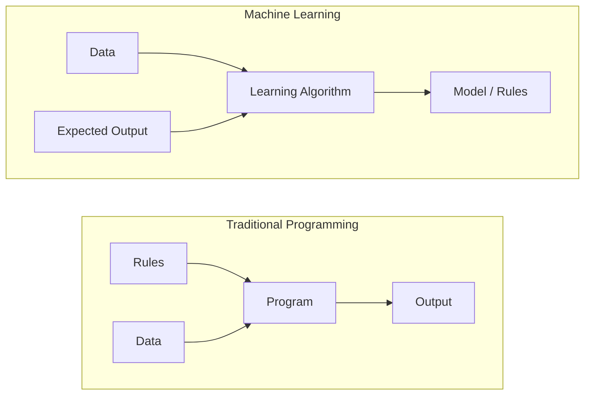
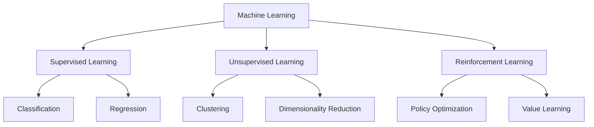
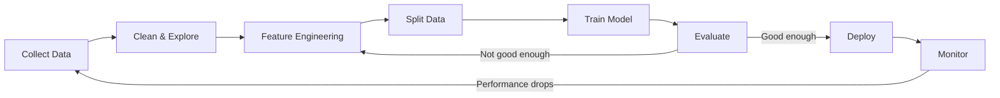
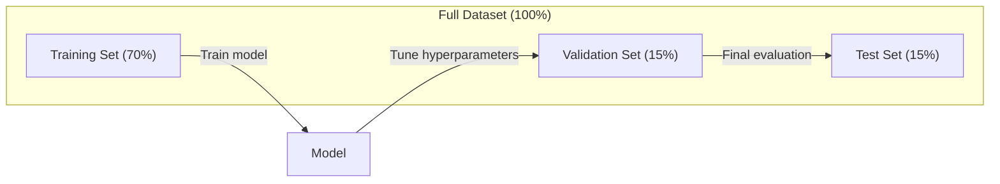
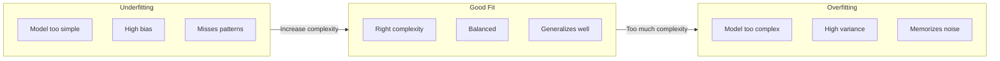
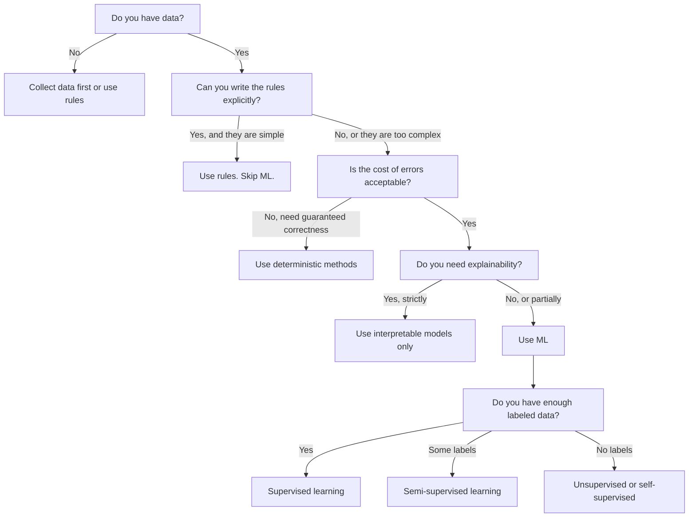

# 머신러닝이란 무엇인가 (What Is Machine Learning)

> 머신러닝(machine learning)은 규칙을 손으로 일일이 작성하는 대신 데이터에서 패턴을 찾도록 컴퓨터를 가르치는 것이다.

**Type:** Learn
**Languages:** Python
**Prerequisites:** Phase 1 (Math Foundations)
**Time:** ~45분

## 학습 목표 (Learning Objectives)

- 지도 학습(supervised learning), 비지도 학습(unsupervised learning), 강화 학습(reinforcement learning)의 차이를 설명하고, 주어진 문제에 어떤 유형이 해당하는지 식별하기
- 최근접 중심점 분류기(nearest centroid classifier)를 밑바닥부터 구현하고, 무작위 베이스라인(baseline)과 비교하여 평가하기
- 분류(classification)와 회귀(regression) 과제를 구분하고, 각각에 적절한 손실 함수(loss function)를 선택하기
- 주어진 비즈니스 문제가 ML에 적합한지, 아니면 결정론적 규칙으로 푸는 편이 나은지 평가하기

## 문제 (The Problem)

스팸 필터를 만든다고 하자. 전통적인 접근법은 이렇다. 앉아서 수백 개의 규칙을 작성한다. "이메일에 'FREE MONEY'가 들어 있으면 스팸으로 표시한다. 느낌표가 3개를 넘으면 스팸으로 표시한다." 몇 주에 걸쳐 규칙을 작성한다. 그러면 스패머들이 표현을 바꾼다. 규칙이 깨진다. 다시 규칙을 더 작성한다. 이 순환은 끝나지 않는다.

머신러닝(machine learning)은 이를 뒤집는다. 규칙을 작성하는 대신, 컴퓨터에 레이블(label)이 붙은 이메일 수천 개("스팸" 또는 "스팸 아님")를 주고 규칙을 스스로 알아내게 한다. 컴퓨터는 사람이 결코 생각해 내지 못했을 패턴을 찾아낸다. 스패머들이 전술을 바꾸면, 코드를 다시 쓰는 대신 새 데이터로 재학습(retrain)한다.

이렇게 "규칙을 프로그래밍하는 것"에서 "데이터로부터 학습하는 것"으로 옮겨 가는 것이 머신러닝의 핵심이다. 모든 추천 엔진, 음성 비서, 자율주행차, 언어 모델이 이런 방식으로 동작한다.

## 개념 (The Concept)

### 규칙이 아니라 데이터로부터 학습하기

전통적인 프로그래밍과 머신러닝은 문제를 정반대 방향으로 푼다.



전통적인 프로그래밍에서는 사람이 규칙을 작성한다. 프로그램은 그 규칙을 데이터에 적용하여 출력을 만든다.

머신러닝에서는 사람이 데이터와 기대 출력을 제공한다. 알고리즘이 규칙을 발견한다.

학습(training)에서 나오는 "모델(model)"이 곧 규칙이며, 숫자(가중치, 파라미터)로 인코딩되어 있다. 모델은 자신이 본 예시들로부터 일반화하여, 한 번도 본 적 없는 데이터에 대해 예측을 한다.

### 머신러닝의 세 가지 유형



**지도 학습(Supervised Learning)**: 입력-출력 쌍을 가지고 있다. 모델은 입력을 출력으로 매핑하는 법을 학습한다.
- "여기 고양이 또는 개로 레이블된 사진 10,000장이 있다. 둘을 구별하는 법을 학습하라."
- "여기 주택 특성과 가격이 있다. 가격을 예측하는 법을 학습하라."

**비지도 학습(Unsupervised Learning)**: 입력만 가지고 있다. 레이블은 없다. 모델이 스스로 구조를 찾는다.
- "여기 고객 구매 이력 10,000건이 있다. 자연스러운 그룹을 찾아라."
- "여기 1,000차원 데이터 포인트가 있다. 구조를 유지하면서 2차원으로 축소하라."

**강화 학습(Reinforcement Learning)**: 에이전트(agent)가 환경 안에서 행동을 취하고 보상 또는 벌점을 받는다. 에이전트는 총 보상을 최대화하는 전략(정책, policy)을 학습한다.
- "이 게임을 하라. 이기면 +1, 지면 -1. 전략을 알아내라."
- "이 로봇 팔을 제어하라. 물체를 집으면 +1, 낭비되는 매초마다 -0.01."

실무에서 만들게 될 것의 대부분은 지도 학습을 쓴다. 비지도 학습은 전처리와 탐색에 흔히 쓰인다. 강화 학습은 게임 AI, 로보틱스, 그리고 언어 모델을 위한 RLHF를 구동한다.

### 세 가지 큰 범주를 넘어서

위의 세 범주는 깔끔하지만, 현실 세계의 ML은 종종 경계를 흐린다.

**준지도 학습(Semi-supervised learning)**은 소량의 레이블된 데이터와 대량의 레이블되지 않은 데이터를 사용한다. 레이블된 의료 영상 100장과 레이블되지 않은 영상 100,000장을 가지고 있을 수 있다. 기법으로는 다음이 있다.

- **레이블 전파(Label propagation):** 비슷한 데이터 포인트를 연결하는 그래프를 만든다. 레이블은 레이블된 노드에서 레이블되지 않은 이웃으로 그래프를 통해 퍼져 나간다.
- **의사 레이블링(Pseudo-labeling):** 레이블된 데이터로 모델을 학습시키고, 그 모델로 레이블되지 않은 데이터의 레이블을 예측한 뒤, 전체로 다시 학습시킨다. 모델이 자기 자신의 학습 셋을 부트스트랩한다.
- **일관성 정규화(Consistency regularization):** 모델은 어떤 입력과 그 입력을 약간 교란시킨 버전에 대해 같은 예측을 내놓아야 한다. 이것은 레이블 없이도 동작한다.

**자기 지도 학습(Self-supervised learning)**은 데이터 자체에서 지도(supervision)를 만들어 낸다. 사람이 단 하나의 레이블도 붙일 필요가 없다. 모델은 데이터의 구조로부터 자기 자신의 예측 과제를 만든다.

- **마스킹된 언어 모델링(BERT):** 문장에서 단어의 15%를 가리고, 모델이 빠진 단어를 예측하도록 학습시킨다. "레이블"은 원래 텍스트에서 온다.
- **대조 학습(Contrastive learning, SimCLR):** 이미지 하나를 가져와 증강된 두 버전을 만든다. 모델이 그 둘이 같은 이미지에서 왔음을 인식하면서, 동시에 다른 이미지의 증강 버전과는 구별하도록 학습시킨다.
- **다음 토큰 예측(Next-token prediction, GPT):** 이전 모든 단어가 주어졌을 때 다음 단어를 예측한다. 모든 텍스트 문서가 학습 예시가 된다.

이것들은 세 가지 큰 범주와 별개의 범주가 아니다. 지도 학습과 비지도 학습의 아이디어를 결합한 전략이다. 자기 지도 학습은 기술적으로는 지도 학습이지만(모델이 무언가를 예측한다), 레이블이 사람이 아니라 자동으로 생성된다.

### 분류 vs 회귀

이것이 지도 학습의 두 가지 주요 과제다.

| 측면 | 분류(Classification) | 회귀(Regression) |
|--------|---------------|------------|
| 출력 | 이산적 범주 | 연속적 숫자 |
| 예시 | "이 이메일은 스팸인가?" | "주택 가격은 얼마가 될까?" |
| 출력 공간 | {cat, dog, bird} | 임의의 실수 |
| 손실 함수 | 교차 엔트로피(cross-entropy), 정확도 | 평균 제곱 오차(MSE), MAE |
| 결정 | 클래스 사이의 경계 | 데이터에 맞는 곡선 |

분류는 "어느 범주인가?"에 답한다. 회귀는 "얼마인가?"에 답한다.

어떤 문제는 양쪽 방식으로 모두 구성할 수 있다. 주가가 오를지 내릴지 예측하는 것은 분류다. 정확한 가격을 예측하는 것은 회귀다.

### ML 워크플로

모든 머신러닝 프로젝트는 알고리즘과 무관하게 같은 파이프라인(pipeline)을 따른다.



**데이터 수집(Collect Data)**: 원시 데이터를 모은다. 데이터는 거의 언제나 많을수록 좋지만, 양보다 품질이 더 중요하다.

**정제 및 탐색(Clean & Explore)**: 결측값을 처리하고 중복을 제거하며, 분포를 시각화하고 이상치를 찾는다. 이 단계는 종종 전체 프로젝트 시간의 60~80%를 차지한다.

**특성 공학(Feature Engineering)**: 원시 데이터를 모델이 사용할 수 있는 특성(feature)으로 변환한다. 날짜를 요일로 바꾼다. 수치 컬럼을 정규화(normalize)한다. 범주형 변수를 인코딩한다. 좋은 특성이 화려한 알고리즘보다 더 중요하다.

**데이터 분할(Split Data)**: 학습(training), 검증(validation), 테스트(test) 셋으로 나눈다. 모델은 학습 데이터로 학습하고, 검증 데이터로 하이퍼파라미터(hyperparameter)를 튜닝하며, 최종 성능은 테스트 데이터로 보고한다.

**모델 학습(Train Model)**: 학습 데이터를 알고리즘에 넣는다. 알고리즘은 손실 함수(loss function)를 최소화하도록 내부 파라미터를 조정한다.

**평가(Evaluate)**: 검증/테스트 데이터에서 성능을 측정한다. 성능이 만족스럽지 않으면, 돌아가서 다른 특성, 알고리즘, 또는 하이퍼파라미터를 시도한다.

**배포(Deploy)**: 모델을 프로덕션(production)에 투입하여 새 데이터에 대해 예측하게 한다.

**모니터링(Monitor)**: 시간에 따른 성능을 추적한다. 데이터 분포가 바뀌고(데이터 드리프트, data drift), 모델이 열화된다. 성능이 떨어지면 재학습한다.

### 학습, 검증, 테스트 분할

이것은 초보자가 가장 많이 틀리는 개념이다. 모델은 학습 중에 한 번도 본 적 없는 데이터로 평가해야 한다. 그렇지 않으면 학습이 아니라 암기를 측정하는 셈이다.



| 분할 | 목적 | 사용 시점 | 일반적 크기 |
|-------|---------|-----------|-------------|
| 학습(Training) | 모델이 이 데이터로부터 학습한다 | 학습 중 | 60~80% |
| 검증(Validation) | 하이퍼파라미터 튜닝, 모델 비교 | 각 학습 실행 후 | 10~20% |
| 테스트(Test) | 최종 비편향 성능 추정 | 단 한 번, 맨 마지막에 | 10~20% |

테스트 셋은 신성하다. 정확히 한 번만 본다. 테스트 성능을 기준으로 모델을 계속 조정한다면, 사실상 테스트 셋으로 학습하는 것이며 보고하는 수치는 무의미해진다.

작은 데이터셋(dataset)의 경우 k-겹 교차 검증(k-fold cross-validation)을 사용한다. 데이터를 k개로 나누고, k-1개로 학습하고, 나머지 한 개로 검증하고, 회전시키며, 결과를 평균한다.

### 과적합 vs 과소적합



**과소적합(Underfitting)**: 모델이 너무 단순해서 데이터의 패턴을 포착하지 못한다. 곡선 관계를 직선으로 맞추려는 격이다. 학습 오차가 높다. 테스트 오차도 높다.

**과적합(Overfitting)**: 모델이 너무 복잡해서 노이즈를 포함한 학습 데이터를 암기해 버린다. 모든 학습 점을 통과하지만 새 데이터에서는 실패하는 구불구불한 곡선이다. 학습 오차가 낮다. 테스트 오차는 높다.

**좋은 적합(Good fit)**: 모델이 노이즈를 암기하지 않으면서 실제 패턴을 포착한다. 학습 오차와 테스트 오차 모두 합리적으로 낮다.

과적합의 징후:
- 학습 정확도가 검증 정확도보다 훨씬 높다
- 모델이 학습 데이터에서는 잘하지만 새 데이터에서는 못한다
- 학습 데이터를 더 추가하면 성능이 개선된다(모델이 학습이 아니라 암기를 하고 있었다)

과적합 해결책:
- 학습 데이터를 더 확보한다
- 모델 복잡도를 줄인다(파라미터를 줄이거나, 더 단순한 아키텍처)
- 정규화(regularization)(큰 가중치에 페널티를 더한다)
- 드롭아웃(dropout)(학습 중 뉴런을 무작위로 0으로 만든다)
- 조기 종료(early stopping)(검증 오차가 증가하기 시작하면 학습을 멈춘다)

과소적합 해결책:
- 더 복잡한 모델을 사용한다
- 특성을 더 추가한다
- 정규화를 줄인다
- 더 오래 학습한다

### 편향-분산 트레이드오프

이것이 과적합과 과소적합 뒤에 있는 수학적 틀이다.

**편향(Bias)**: 모델의 잘못된 가정에서 오는 오차. 참 관계가 비선형일 때 선형 모델은 높은 편향을 가진다. 높은 편향은 과소적합으로 이어진다.

**분산(Variance)**: 학습 데이터의 작은 변동에 대한 민감성에서 오는 오차. 분산이 높은 모델은 서로 다른 데이터 부분집합으로 학습했을 때 매우 다른 예측을 내놓는다. 높은 분산은 과적합으로 이어진다.

| 모델 복잡도 | 편향 | 분산 | 결과 |
|-----------------|------|----------|--------|
| 너무 낮음(곡선 데이터에 선형 모델) | 높음 | 낮음 | 과소적합 |
| 딱 적당함 | 중간 | 중간 | 좋은 일반화 |
| 너무 높음(10개 점에 20차 다항식) | 낮음 | 높음 | 과적합 |

총 오차 = Bias^2 + Variance + Irreducible noise

축소 불가능한 노이즈(irreducible noise)는 줄일 수 없다(데이터 자체에 있는 무작위성이다). 결국 찾고 싶은 것은 bias^2 + variance가 최소가 되는 최적점이다.

### 공짜 점심은 없다 정리 (No Free Lunch Theorem)

모든 문제에 대해 가장 잘 동작하는 단 하나의 알고리즘은 없다. 어떤 부류의 문제에서 잘 동작하는 알고리즘은 다른 부류에서는 잘 못한다. 데이터 과학자들이 여러 알고리즘을 시도하고 결과를 비교하는 이유가 이것이다.

실무에서 선택은 다음에 달려 있다.
- 데이터를 얼마나 많이 가지고 있는가
- 특성이 몇 개인가
- 관계가 선형인가 비선형인가
- 해석 가능성(interpretability)이 필요한가
- 얼마나 많은 연산 자원을 감당할 수 있는가

### 머신러닝을 쓰지 말아야 할 때

ML은 강력하지만 언제나 올바른 도구는 아니다. 모델에 손을 뻗기 전에, 정말로 모델이 필요한지 자문하라.

**ML을 쓰지 말아야 할 때:**

- **규칙이 단순하고 잘 정의되어 있을 때.** 세금 계산, 정렬 알고리즘, 단위 변환. 로직을 몇 개의 if-문으로 작성할 수 있다면, 모델은 아무 이득 없이 복잡도만 더한다.
- **데이터가 없거나 매우 적을 때.** ML은 학습할 예시가 필요하다. 데이터 포인트가 10개라면 의미 있는 무언가를 학습시킬 수 없다. 먼저 데이터를 모아라.
- **틀렸을 때의 비용이 치명적이고 보장된 정확성이 필요할 때.** 의료 투약량 계산, 원자로 제어, 암호 검증. ML 모델은 확률적이다. 가끔 틀릴 것이다. "가끔 틀림"이 용납되지 않는다면 결정론적 방법을 써라.
- **룩업 테이블이나 휴리스틱으로 문제가 풀릴 때.** 단순한 임계값이나 테이블이 99%의 경우를 처리한다면, ML을 더하는 것은 의미 있는 개선 없이 유지보수 비용만 늘린다.
- **결정을 설명할 수 없는데 설명 가능성이 요구될 때.** 규제 산업(대출, 보험, 형사 사법)에서는 모든 결정이 완전히 설명 가능해야 할 때가 있다. 일부 ML 모델은 해석 가능하다(선형 회귀, 작은 결정 트리). 대부분은 그렇지 않다.
- **문제가 재학습할 수 있는 속도보다 더 빨리 변할 때.** 규칙이 매일 바뀌는데 재학습에 일주일이 걸린다면, 모델은 언제나 낡은 상태다.

이 결정 순서도를 사용하라.



## 직접 만들기 (Build It)

`code/ml_intro.py`의 코드는 가능한 가장 단순한 ML 알고리즘인 최근접 중심점 분류기(nearest centroid classifier)를 밑바닥부터 구현한다. 이는 핵심 아이디어를 보여준다. 데이터로부터 학습하고, 그다음 새 데이터에 대해 예측한다.

### 1단계: 밑바닥부터 만드는 최근접 중심점 분류기

최근접 중심점 분류기는 학습 데이터에서 각 클래스의 중심(평균)을 계산한다. 예측할 때는 각 새 점을 그 중심이 가장 가까운 클래스에 배정한다.

```python
class NearestCentroid:
    def fit(self, X, y):
        self.classes = np.unique(y)
        self.centroids = np.array([
            X[y == c].mean(axis=0) for c in self.classes
        ])

    def predict(self, X):
        distances = np.array([
            np.sqrt(((X - c) ** 2).sum(axis=1))
            for c in self.centroids
        ])
        return self.classes[distances.argmin(axis=0)]
```

이게 알고리즘 전부다. fit은 평균 두 개를 계산한다. predict는 거리를 계산한다. 경사 하강법(gradient descent)도, 반복도, 하이퍼파라미터도 없다.

### 2단계: 합성 데이터로 학습하기

약간 겹치는 두 클래스를 가진 2D 분류 데이터셋을 생성한다. 중심점 분류기는 클래스 중심들 사이에 선형 결정 경계(decision boundary)를 긋는다.

```python
rng = np.random.RandomState(42)
X_class0 = rng.randn(100, 2) + np.array([1.0, 1.0])
X_class1 = rng.randn(100, 2) + np.array([-1.0, -1.0])
X = np.vstack([X_class0, X_class1])
y = np.array([0] * 100 + [1] * 100)
```

### 3단계: 베이스라인과 비교하기

모든 ML 모델은 사소한 베이스라인(baseline)과 비교해야 한다. 여기서 베이스라인은 무작위 클래스를 예측한다. ML 모델이 무작위 추측을 이기지 못한다면, 뭔가 잘못된 것이다.

```python
baseline_preds = rng.choice([0, 1], size=len(y_test))
baseline_acc = np.mean(baseline_preds == y_test)
```

중심점 분류기는 이 깔끔한 데이터셋에서 90% 이상의 정확도를 얻어야 한다. 무작위 베이스라인은 약 50%를 얻는다.

### 왜 이것이 중요한가

최근접 중심점 분류기는 사소할 정도로 단순하다. 하이퍼파라미터도, 반복도, 경사 하강법도 없다. 그럼에도 ML의 근본 패턴을 담고 있다.

1. 학습 데이터로부터 표현(representation)을 **학습한다**(중심점들)
2. 그 표현을 사용해 새 데이터에 대해 **예측한다**(최근접 거리)
3. 베이스라인과 **비교 평가한다**(무작위 추측)

로지스틱 회귀(logistic regression)에서 트랜스포머(transformer)에 이르기까지 모든 ML 알고리즘은 같은 세 단계 패턴을 따른다. 표현은 더 복잡해지지만, 워크플로는 그대로다.

### 4단계: 중심점 분류기가 할 수 없는 것

최근접 중심점 분류기는 각 클래스가 하나의 덩어리를 이룬다고 가정한다. 선형 결정 경계를 긋는다. 다음의 경우 실패한다.

- 클래스가 여러 군집을 가질 때(예: 숫자 "1"은 여러 다른 방식으로 쓰일 수 있다)
- 결정 경계가 비선형일 때(예: 한 클래스가 다른 클래스를 감싸고 있을 때)
- 특성들이 매우 다른 스케일을 가질 때(거리가 가장 큰 스케일의 특성에 의해 지배된다)

이러한 한계가 앞으로 배우게 될 다른 모든 알고리즘의 동기가 된다. k-최근접 이웃(K-nearest neighbors)은 여러 군집을 처리한다. 결정 트리(decision tree)는 비선형 경계를 처리한다. 특성 스케일링(feature scaling)은 스케일 문제를 해결한다. 각 레슨은 이전 레슨의 한계 위에 쌓인다.

## 라이브러리로 써보기 (Use It)

sklearn은 `NearestCentroid`와 합성 데이터 생성기를 제공한다.

```python
from sklearn.neighbors import NearestCentroid
from sklearn.datasets import make_classification
from sklearn.model_selection import train_test_split

X, y = make_classification(
    n_samples=500, n_features=2, n_redundant=0,
    n_clusters_per_class=1, random_state=42
)
X_train, X_test, y_train, y_test = train_test_split(X, y, test_size=0.3)

clf = NearestCentroid()
clf.fit(X_train, y_train)
print(f"Accuracy: {clf.score(X_test, y_test):.3f}")
```

## 산출물 (Ship It)

이 레슨은 `outputs/prompt-ml-problem-framer.md`를 만들어낸다 -- 모호한 비즈니스 문제를 구체적인 ML 과제로 바꿔주는 프롬프트(prompt)다. 문제 설명("이탈을 줄이고 싶다" 또는 "다음 분기 수요를 예측하라")을 주면, 학습 유형을 식별하고, 예측 목표를 정의하고, 후보 특성을 나열하고, 성공 지표를 고르고, 베이스라인을 설정하고, 데이터 누출(data leakage)이나 클래스 불균형 같은 함정을 표시한다. 잘못된 것을 만드는 일을 피하기 위해 모든 ML 프로젝트의 시작에 사용하라.

## 핵심 용어 (Key Terms)

| 용어 | 흔히 하는 말 | 실제 의미 |
|------|----------------|----------------------|
| 모델(Model) | "그 AI" | 입력을 출력으로 매핑하는, 학습 가능한 파라미터를 가진 수학 함수 |
| 학습(Training) | "AI를 가르친다" | 예측이 알려진 출력과 일치하도록 모델 파라미터를 조정하는 최적화 알고리즘을 실행하는 것 |
| 특성(Feature) | "입력 컬럼 하나" | 모델이 예측을 하는 데 사용하는, 데이터의 측정 가능한 속성 |
| 레이블(Label) | "정답" | 학습 예시에 대한 알려진 출력으로, 오차 신호를 계산하는 데 쓰인다 |
| 하이퍼파라미터(Hyperparameter) | "당신이 만지작거리는 설정" | 학습 과정을 제어하기 위해 학습 전에 설정하는 파라미터(학습률, 층의 수) |
| 손실 함수(Loss function) | "모델이 얼마나 틀렸는가" | 예측 출력과 실제 출력 사이의 간극을 측정하는 함수로, 학습이 최소화하려는 대상 |
| 과적합(Overfitting) | "테스트를 외워버렸다" | 모델이 일반적 패턴 대신 학습 특유의 노이즈를 학습하여, 새 데이터에서 실패하는 것 |
| 과소적합(Underfitting) | "아무것도 학습하지 못했다" | 모델이 너무 단순해서 데이터의 실제 패턴을 포착하지 못하는 것 |
| 일반화(Generalization) | "새 데이터에서도 동작한다" | 학습되지 않은 데이터에 대해 정확한 예측을 하는 모델의 능력 |
| 교차 검증(Cross-validation) | "다른 덩어리들로 테스트하기" | 데이터를 학습/테스트 폴드로 반복해서 나누고 결과를 평균하여, 더 견고한 성능 추정을 얻는 것 |
| 정규화(Regularization) | "가중치를 작게 유지하기" | 지나치게 복잡한 모델을 억제하는 페널티 항을 손실 함수에 더하는 것 |
| 데이터 드리프트(Data drift) | "세상이 바뀌었다" | 들어오는 데이터의 통계적 분포가 시간에 따라 이동하여, 모델 성능을 떨어뜨리는 것 |

## 연습 문제 (Exercises)

1. 아무 데이터셋이나 골라라(예: Iris, Titanic). 이를 학습/검증/테스트로 70/15/15로 나눠라. 테스트 셋에서 하이퍼파라미터를 튜닝하면 안 되는 이유를 설명하라.
2. 현실 세계의 문제 세 개를 나열하라. 각각에 대해, 그것이 분류인지 회귀인지 군집화(clustering)인지, 그리고 지도 학습인지 비지도 학습인지 식별하라.
3. 어떤 모델이 학습 데이터에서 99% 정확도를 얻지만 테스트 데이터에서 60%를 얻는다. 문제를 진단하고, 이를 고치기 위해 시도할 세 가지를 나열하라.

## 더 읽을거리 (Further Reading)

- [An Introduction to Statistical Learning](https://www.statlearning.com/) - 고전적 ML 방법 전반을 실용적 예시와 함께 다루는 무료 교과서
- [Google's Machine Learning Crash Course](https://developers.google.com/machine-learning/crash-course) - ML 개념에 대한 간결한 시각적 입문
- [Scikit-learn User Guide](https://scikit-learn.org/stable/user_guide.html) - 파이썬으로 ML을 구현하기 위한 실용 레퍼런스
