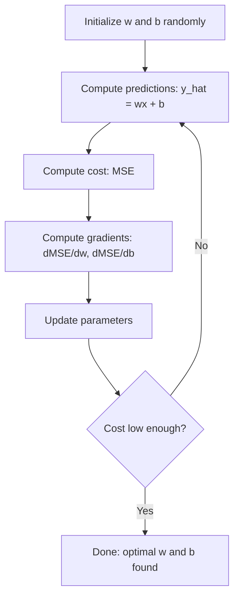

# 선형 회귀 (Linear Regression)

> 선형 회귀(linear regression)는 데이터를 관통하는 최적의 직선을 긋는다. 머신러닝의 "hello world"다.

**Type:** Build
**Languages:** Python
**Prerequisites:** Phase 1 (Linear Algebra, Calculus, Optimization), Phase 2 Lesson 1
**Time:** ~90분

## 학습 목표 (Learning Objectives)

- 평균 제곱 오차(mean squared error)에 대한 경사 하강법(gradient descent) 갱신 규칙을 유도하고, 선형 회귀를 밑바닥부터 구현하기
- 경사 하강법과 정규 방정식(normal equation)을 계산 복잡도와 각각의 사용 시점 측면에서 비교하기
- 특성 표준화(feature standardization)를 적용한 다중 선형 회귀(multiple linear regression) 모델을 만들고, 학습된 가중치(weight)를 해석하기
- 릿지 회귀(Ridge regression, L2 정규화)가 큰 가중치에 페널티를 부과함으로써 어떻게 과적합(overfitting)을 막는지 설명하기

## 문제 (The Problem)

데이터가 있다. 주택 크기와 그 판매 가격이다. 새 주택의 크기가 주어졌을 때 가격을 예측하고 싶다. 산점도를 눈대중으로 볼 수도 있지만, 공식이 필요하다. 어떤 크기든 대입해서 가격 예측을 얻을 수 있도록, 데이터에 가장 잘 맞는 직선이 필요하다.

선형 회귀(linear regression)는 그 직선을 준다. 더 중요하게는, ML 학습 루프 전체를 소개한다. 모델을 정의하고, 비용 함수(cost function)를 정의하고, 파라미터(parameter)를 최적화한다. 모든 ML 알고리즘이 이 같은 패턴을 따른다. 가장 단순한 경우인 여기서 통달하면, 어디서든 그 패턴을 알아보게 된다.

이는 단순한 문제만을 위한 것이 아니다. 선형 회귀는 수요 예측, A/B 테스트 분석, 금융 모델링에서 프로덕션(production) 시스템으로 쓰이고, 모든 회귀(regression) 과제의 베이스라인(baseline)으로도 쓰인다.

## 개념 (The Concept)

### 모델

선형 회귀는 입력(x)과 출력(y) 사이에 선형 관계를 가정한다.

```
y = wx + b
```

- `w` (가중치/기울기): x가 1만큼 증가할 때 y가 얼마나 변하는가
- `b` (편향/절편): x = 0일 때 y의 값

여러 입력(특성, feature)의 경우, 이는 다음으로 확장된다.

```
y = w1*x1 + w2*x2 + ... + wn*xn + b
```

또는 벡터 형태로: `y = w^T * x + b`

목표는 모든 학습 예시에 걸쳐 예측 y가 실제 y에 가능한 한 가까워지게 만드는 w와 b의 값을 찾는 것이다.

### 비용 함수 (평균 제곱 오차)

"가능한 한 가깝다"를 어떻게 측정하는가? 예측이 얼마나 틀렸는지를 담는 단일 숫자가 필요하다. 가장 흔한 선택은 평균 제곱 오차(Mean Squared Error, MSE)다.

```
MSE = (1/n) * sum((y_predicted - y_actual)^2)
```

왜 제곱인가? 두 가지 이유다. 첫째, 작은 오차보다 큰 오차에 더 큰 페널티를 준다(오차 10은 오차 1보다 10배가 아니라 100배 나쁘다). 둘째, 제곱 함수는 매끄럽고 모든 곳에서 미분 가능하여, 최적화를 단순하게 만든다.

비용 함수는 곡면을 만든다. 단일 가중치 w와 편향 b에 대해, MSE 곡면은 그릇(볼록한 포물면) 모양이다. 그릇의 바닥이 MSE가 최소화되는 곳이다. 학습이란 그 바닥을 찾는 것이다.

### 경사 하강법

경사 하강법(gradient descent)은 내리막으로 한 걸음씩 내디뎌 그릇의 바닥을 찾는다.



그래디언트(gradient)는 두 가지를 알려준다. 각 파라미터를 어느 방향으로 움직일지, 그리고 얼마나 움직일지.

y_hat = wx + b인 MSE의 경우:

```
dMSE/dw = (2/n) * sum((y_hat - y) * x)
dMSE/db = (2/n) * sum(y_hat - y)
```

갱신 규칙:

```
w = w - learning_rate * dMSE/dw
b = b - learning_rate * dMSE/db
```

학습률(learning rate)은 스텝 크기를 제어한다. 너무 크면 최솟값을 지나쳐 발산한다. 너무 작으면 학습이 한없이 걸린다. 일반적인 시작 값: 0.01, 0.001, 또는 0.0001.

### 정규 방정식 (닫힌 형태 해)

특별히 선형 회귀에 한해서는, 어떤 반복도 없이 최적 가중치를 주는 직접적인 공식이 있다.

```
w = (X^T * X)^(-1) * X^T * y
```

이는 한 단계로 w를 풀기 위해 행렬을 역행렬화한다. 작은 데이터셋(dataset)에서는 완벽하게 동작한다. 큰 데이터셋(수백만 행 또는 수천 특성)에서는 경사 하강법이 선호되는데, 행렬 역행렬화가 특성 수에 대해 O(n^3)이기 때문이다.

### 다중 선형 회귀

여러 특성을 가지면 모델은 다음이 된다.

```
y = w1*x1 + w2*x2 + ... + wn*xn + b
```

모든 것이 동일하게 동작한다. MSE가 비용 함수이고, 경사 하강법이 모든 가중치를 동시에 갱신한다. 유일한 차이는 직선 대신 초평면(hyperplane)을 맞춘다는 점이다.

여기서 특성 스케일링(feature scaling)이 중요하다. 한 특성이 0~1 범위이고 다른 특성이 0~1,000,000 범위라면, 비용 곡면이 길쭉해지기 때문에 경사 하강법이 고전한다. 학습 전에 특성을 표준화하라(평균을 빼고, 표준편차로 나눈다).

### 다항 회귀

관계가 선형이 아니라면 어떻게 하는가? 다항 특성을 만들면 여전히 선형 회귀를 쓸 수 있다.

```
y = w1*x + w2*x^2 + w3*x^3 + b
```

이것은 모델이 가중치(w1, w2, w3)에 대해 선형이기 때문에 여전히 "선형" 회귀다. 단지 x의 비선형 특성을 사용하는 것뿐이다.

차수가 높은 다항식은 더 복잡한 곡선을 맞출 수 있지만 과적합(overfitting)의 위험이 있다. 10차 다항식은 10개 점 데이터셋의 모든 점을 통과하지만 새 데이터에서는 형편없이 예측한다.

### R-제곱 점수

MSE는 얼마나 틀렸는지 알려주지만, 그 숫자는 y의 스케일에 따라 달라진다. R-제곱(R^2)은 스케일에 무관한 측정값을 준다.

```
R^2 = 1 - (sum of squared residuals) / (sum of squared deviations from mean)
    = 1 - SS_res / SS_tot
```

- R^2 = 1.0: 완벽한 예측
- R^2 = 0.0: 모델이 매번 평균을 예측하는 것보다 나을 게 없음
- R^2 < 0.0: 모델이 평균을 예측하는 것보다 나쁨

### 정규화 맛보기 (릿지 회귀)

특성이 많을 때, 모델은 큰 가중치를 배정함으로써 과적합할 수 있다. 릿지 회귀(Ridge regression, L2 정규화)는 페널티를 더한다.

```
Cost = MSE + lambda * sum(w_i^2)
```

페널티 항은 큰 가중치를 억제한다. 하이퍼파라미터(hyperparameter) lambda가 트레이드오프(trade-off)를 제어한다. lambda가 클수록 가중치가 작아지고 정규화가 더 강해진다. 이는 뒤의 레슨에서 깊이 다룬다. 지금은 그것이 존재한다는 것과 왜 도움이 되는지만 알면 된다.

## 직접 만들기 (Build It)

### 1단계: 샘플 데이터 생성

```python
import random
import math

random.seed(42)

TRUE_W = 3.0
TRUE_B = 7.0
N_SAMPLES = 100

X = [random.uniform(0, 10) for _ in range(N_SAMPLES)]
y = [TRUE_W * x + TRUE_B + random.gauss(0, 2.0) for x in X]

print(f"Generated {N_SAMPLES} samples")
print(f"True relationship: y = {TRUE_W}x + {TRUE_B} (+ noise)")
print(f"First 5 points: {[(round(X[i], 2), round(y[i], 2)) for i in range(5)]}")
```

### 2단계: 경사 하강법으로 밑바닥부터 만드는 선형 회귀

```python
class LinearRegression:
    def __init__(self, learning_rate=0.01):
        self.w = 0.0
        self.b = 0.0
        self.lr = learning_rate
        self.cost_history = []

    def predict(self, X):
        return [self.w * x + self.b for x in X]

    def compute_cost(self, X, y):
        predictions = self.predict(X)
        n = len(y)
        cost = sum((pred - actual) ** 2 for pred, actual in zip(predictions, y)) / n
        return cost

    def compute_gradients(self, X, y):
        predictions = self.predict(X)
        n = len(y)
        dw = (2 / n) * sum((pred - actual) * x for pred, actual, x in zip(predictions, y, X))
        db = (2 / n) * sum(pred - actual for pred, actual in zip(predictions, y))
        return dw, db

    def fit(self, X, y, epochs=1000, print_every=200):
        for epoch in range(epochs):
            dw, db = self.compute_gradients(X, y)
            self.w -= self.lr * dw
            self.b -= self.lr * db
            cost = self.compute_cost(X, y)
            self.cost_history.append(cost)
            if epoch % print_every == 0:
                print(f"  Epoch {epoch:4d} | Cost: {cost:.4f} | w: {self.w:.4f} | b: {self.b:.4f}")
        return self

    def r_squared(self, X, y):
        predictions = self.predict(X)
        y_mean = sum(y) / len(y)
        ss_res = sum((actual - pred) ** 2 for actual, pred in zip(y, predictions))
        ss_tot = sum((actual - y_mean) ** 2 for actual in y)
        return 1 - (ss_res / ss_tot)


print("=== Training Linear Regression (Gradient Descent) ===")
model = LinearRegression(learning_rate=0.005)
model.fit(X, y, epochs=1000, print_every=200)
print(f"\nLearned: y = {model.w:.4f}x + {model.b:.4f}")
print(f"True:    y = {TRUE_W}x + {TRUE_B}")
print(f"R-squared: {model.r_squared(X, y):.4f}")
```

### 3단계: 정규 방정식 (닫힌 형태 해)

```python
class LinearRegressionNormal:
    def __init__(self):
        self.w = 0.0
        self.b = 0.0

    def fit(self, X, y):
        n = len(X)
        x_mean = sum(X) / n
        y_mean = sum(y) / n
        numerator = sum((X[i] - x_mean) * (y[i] - y_mean) for i in range(n))
        denominator = sum((X[i] - x_mean) ** 2 for i in range(n))
        self.w = numerator / denominator
        self.b = y_mean - self.w * x_mean
        return self

    def predict(self, X):
        return [self.w * x + self.b for x in X]

    def r_squared(self, X, y):
        predictions = self.predict(X)
        y_mean = sum(y) / len(y)
        ss_res = sum((actual - pred) ** 2 for actual, pred in zip(y, predictions))
        ss_tot = sum((actual - y_mean) ** 2 for actual in y)
        return 1 - (ss_res / ss_tot)


print("\n=== Normal Equation (Closed-Form) ===")
model_normal = LinearRegressionNormal()
model_normal.fit(X, y)
print(f"Learned: y = {model_normal.w:.4f}x + {model_normal.b:.4f}")
print(f"R-squared: {model_normal.r_squared(X, y):.4f}")
```

### 4단계: 다중 선형 회귀

```python
class MultipleLinearRegression:
    def __init__(self, n_features, learning_rate=0.01):
        self.weights = [0.0] * n_features
        self.bias = 0.0
        self.lr = learning_rate
        self.cost_history = []

    def predict_single(self, x):
        return sum(w * xi for w, xi in zip(self.weights, x)) + self.bias

    def predict(self, X):
        return [self.predict_single(x) for x in X]

    def compute_cost(self, X, y):
        predictions = self.predict(X)
        n = len(y)
        return sum((pred - actual) ** 2 for pred, actual in zip(predictions, y)) / n

    def fit(self, X, y, epochs=1000, print_every=200):
        n = len(y)
        n_features = len(X[0])
        for epoch in range(epochs):
            predictions = self.predict(X)
            errors = [pred - actual for pred, actual in zip(predictions, y)]
            for j in range(n_features):
                grad = (2 / n) * sum(errors[i] * X[i][j] for i in range(n))
                self.weights[j] -= self.lr * grad
            grad_b = (2 / n) * sum(errors)
            self.bias -= self.lr * grad_b
            cost = self.compute_cost(X, y)
            self.cost_history.append(cost)
            if epoch % print_every == 0:
                print(f"  Epoch {epoch:4d} | Cost: {cost:.4f}")
        return self

    def r_squared(self, X, y):
        predictions = self.predict(X)
        y_mean = sum(y) / len(y)
        ss_res = sum((actual - pred) ** 2 for actual, pred in zip(y, predictions))
        ss_tot = sum((actual - y_mean) ** 2 for actual in y)
        return 1 - (ss_res / ss_tot)


random.seed(42)
N = 100
X_multi = []
y_multi = []
for _ in range(N):
    size = random.uniform(500, 3000)
    bedrooms = random.randint(1, 5)
    age = random.uniform(0, 50)
    price = 50 * size + 10000 * bedrooms - 1000 * age + 50000 + random.gauss(0, 20000)
    X_multi.append([size, bedrooms, age])
    y_multi.append(price)


def standardize(X):
    n_features = len(X[0])
    means = [sum(X[i][j] for i in range(len(X))) / len(X) for j in range(n_features)]
    stds = []
    for j in range(n_features):
        variance = sum((X[i][j] - means[j]) ** 2 for i in range(len(X))) / len(X)
        stds.append(variance ** 0.5)
    X_scaled = []
    for i in range(len(X)):
        row = [(X[i][j] - means[j]) / stds[j] if stds[j] > 0 else 0 for j in range(n_features)]
        X_scaled.append(row)
    return X_scaled, means, stds


y_mean_val = sum(y_multi) / len(y_multi)
y_std_val = (sum((yi - y_mean_val) ** 2 for yi in y_multi) / len(y_multi)) ** 0.5
y_scaled = [(yi - y_mean_val) / y_std_val for yi in y_multi]

X_scaled, x_means, x_stds = standardize(X_multi)

print("\n=== Multiple Linear Regression (3 features) ===")
print("Features: house size, bedrooms, age")
multi_model = MultipleLinearRegression(n_features=3, learning_rate=0.01)
multi_model.fit(X_scaled, y_scaled, epochs=1000, print_every=200)

print(f"\nWeights (standardized): {[round(w, 4) for w in multi_model.weights]}")
print(f"Bias (standardized): {multi_model.bias:.4f}")
print(f"R-squared: {multi_model.r_squared(X_scaled, y_scaled):.4f}")
```

### 5단계: 다항 회귀

```python
class PolynomialRegression:
    def __init__(self, degree, learning_rate=0.01):
        self.degree = degree
        self.weights = [0.0] * degree
        self.bias = 0.0
        self.lr = learning_rate

    def make_features(self, X):
        return [[x ** (d + 1) for d in range(self.degree)] for x in X]

    def predict(self, X):
        features = self.make_features(X)
        return [sum(w * f for w, f in zip(self.weights, row)) + self.bias for row in features]

    def fit(self, X, y, epochs=1000, print_every=200):
        features = self.make_features(X)
        n = len(y)
        for epoch in range(epochs):
            predictions = [sum(w * f for w, f in zip(self.weights, row)) + self.bias for row in features]
            errors = [pred - actual for pred, actual in zip(predictions, y)]
            for j in range(self.degree):
                grad = (2 / n) * sum(errors[i] * features[i][j] for i in range(n))
                self.weights[j] -= self.lr * grad
            grad_b = (2 / n) * sum(errors)
            self.bias -= self.lr * grad_b
            if epoch % print_every == 0:
                cost = sum(e ** 2 for e in errors) / n
                print(f"  Epoch {epoch:4d} | Cost: {cost:.6f}")
        return self

    def r_squared(self, X, y):
        predictions = self.predict(X)
        y_mean = sum(y) / len(y)
        ss_res = sum((actual - pred) ** 2 for actual, pred in zip(y, predictions))
        ss_tot = sum((actual - y_mean) ** 2 for actual in y)
        return 1 - (ss_res / ss_tot)


random.seed(42)
X_poly = [x / 10.0 for x in range(0, 50)]
y_poly = [0.5 * x ** 2 - 2 * x + 3 + random.gauss(0, 1.0) for x in X_poly]

x_max = max(abs(x) for x in X_poly)
X_poly_norm = [x / x_max for x in X_poly]
y_poly_mean = sum(y_poly) / len(y_poly)
y_poly_std = (sum((yi - y_poly_mean) ** 2 for yi in y_poly) / len(y_poly)) ** 0.5
y_poly_norm = [(yi - y_poly_mean) / y_poly_std for yi in y_poly]

print("\n=== Polynomial Regression (degree 2 vs degree 5) ===")
print("True relationship: y = 0.5x^2 - 2x + 3")

print("\nDegree 2:")
poly2 = PolynomialRegression(degree=2, learning_rate=0.1)
poly2.fit(X_poly_norm, y_poly_norm, epochs=2000, print_every=500)
print(f"  R-squared: {poly2.r_squared(X_poly_norm, y_poly_norm):.4f}")

print("\nDegree 5:")
poly5 = PolynomialRegression(degree=5, learning_rate=0.1)
poly5.fit(X_poly_norm, y_poly_norm, epochs=2000, print_every=500)
print(f"  R-squared: {poly5.r_squared(X_poly_norm, y_poly_norm):.4f}")

print("\nDegree 2 fits the true curve well. Degree 5 fits training data slightly better")
print("but risks overfitting on new data.")
```

### 6단계: 릿지 회귀 (L2 정규화)

```python
class RidgeRegression:
    def __init__(self, n_features, learning_rate=0.01, alpha=1.0):
        self.weights = [0.0] * n_features
        self.bias = 0.0
        self.lr = learning_rate
        self.alpha = alpha

    def predict_single(self, x):
        return sum(w * xi for w, xi in zip(self.weights, x)) + self.bias

    def predict(self, X):
        return [self.predict_single(x) for x in X]

    def fit(self, X, y, epochs=1000, print_every=200):
        n = len(y)
        n_features = len(X[0])
        for epoch in range(epochs):
            predictions = self.predict(X)
            errors = [pred - actual for pred, actual in zip(predictions, y)]
            mse = sum(e ** 2 for e in errors) / n
            reg_term = self.alpha * sum(w ** 2 for w in self.weights)
            cost = mse + reg_term
            for j in range(n_features):
                grad = (2 / n) * sum(errors[i] * X[i][j] for i in range(n))
                grad += 2 * self.alpha * self.weights[j]
                self.weights[j] -= self.lr * grad
            grad_b = (2 / n) * sum(errors)
            self.bias -= self.lr * grad_b
            if epoch % print_every == 0:
                print(f"  Epoch {epoch:4d} | Cost: {cost:.4f} | L2 penalty: {reg_term:.4f}")
        return self


print("\n=== Ridge Regression (L2 Regularization) ===")
print("Same data as multiple regression, with alpha=0.1")
ridge = RidgeRegression(n_features=3, learning_rate=0.01, alpha=0.1)
ridge.fit(X_scaled, y_scaled, epochs=1000, print_every=200)
print(f"\nRidge weights: {[round(w, 4) for w in ridge.weights]}")
print(f"Plain weights: {[round(w, 4) for w in multi_model.weights]}")
print("Ridge weights are smaller (shrunk toward zero) due to the L2 penalty.")
```

## 라이브러리로 써보기 (Use It)

이제 같은 것을 scikit-learn으로 한다. 이것이 프로덕션에서 실제로 사용할 도구다.

```python
from sklearn.linear_model import LinearRegression as SklearnLR
from sklearn.linear_model import Ridge
from sklearn.preprocessing import PolynomialFeatures, StandardScaler
from sklearn.model_selection import train_test_split
from sklearn.metrics import mean_squared_error, r2_score
import numpy as np

np.random.seed(42)
X_sk = np.random.uniform(0, 10, (100, 1))
y_sk = 3.0 * X_sk.squeeze() + 7.0 + np.random.normal(0, 2.0, 100)

X_train, X_test, y_train, y_test = train_test_split(X_sk, y_sk, test_size=0.2, random_state=42)

lr = SklearnLR()
lr.fit(X_train, y_train)
y_pred = lr.predict(X_test)

print("=== Scikit-learn Linear Regression ===")
print(f"Coefficient (w): {lr.coef_[0]:.4f}")
print(f"Intercept (b): {lr.intercept_:.4f}")
print(f"R-squared (test): {r2_score(y_test, y_pred):.4f}")
print(f"MSE (test): {mean_squared_error(y_test, y_pred):.4f}")

poly = PolynomialFeatures(degree=2, include_bias=False)
X_poly_sk = poly.fit_transform(X_train)
X_poly_test = poly.transform(X_test)

lr_poly = SklearnLR()
lr_poly.fit(X_poly_sk, y_train)
print(f"\nPolynomial degree 2 R-squared: {r2_score(y_test, lr_poly.predict(X_poly_test)):.4f}")

scaler = StandardScaler()
X_train_scaled = scaler.fit_transform(X_train)
X_test_scaled = scaler.transform(X_test)

ridge = Ridge(alpha=1.0)
ridge.fit(X_train_scaled, y_train)
print(f"Ridge R-squared: {r2_score(y_test, ridge.predict(X_test_scaled)):.4f}")
print(f"Ridge coefficient: {ridge.coef_[0]:.4f}")
```

밑바닥 구현과 scikit-learn은 같은 결과를 낸다. 차이는 scikit-learn이 엣지 케이스, 수치 안정성, 성능 최적화를 처리한다는 점이다. 프로덕션에는 라이브러리를 써라. 무슨 일이 일어나는지 이해하려면 밑바닥 버전을 써라.

## 산출물 (Ship It)

이 레슨이 만들어내는 것:
- `outputs/skill-regression.md` - 문제에 따라 올바른 회귀 접근법을 고르기 위한 스킬

## 연습 문제 (Exercises)

1. 배치 경사 하강법(batch gradient descent), 확률적 경사 하강법(stochastic gradient descent, SGD), 미니배치 경사 하강법(mini-batch gradient descent)을 구현하라. 같은 데이터셋에서 수렴 속도를 비교하라. 어느 것이 가장 빨리 수렴하는가? 어느 것이 가장 매끄러운 비용 곡선을 갖는가?
2. 3차 함수(y = ax^3 + bx^2 + cx + d + noise)에서 데이터를 생성하라. 차수 1, 3, 10의 다항식을 맞춰라. 학습 R^2와 테스트 R^2를 비교하라. 어느 차수에서 과적합이 분명해지는가?
3. 라쏘 회귀(Lasso regression, L1 정규화: penalty = alpha * sum(|w_i|))를 구현하라. 다중 특성 주택 데이터로 학습시켜라. 릿지와 비교하여 어느 가중치가 0이 되는지 비교하라. 왜 L1은 희소(sparse) 해를 만드는데 L2는 그렇지 않은가?

## 핵심 용어 (Key Terms)

| 용어 | 흔히 하는 말 | 실제 의미 |
|------|----------------|----------------------|
| 선형 회귀(Linear regression) | "데이터를 관통하는 직선을 긋는다" | wx+b와 실제 y 값 사이의 제곱 차이 합을 최소화하는 가중치 w와 편향 b를 찾는 것 |
| 비용 함수(Cost function) | "모델이 얼마나 나쁜가" | 모델 파라미터를 예측 오차를 측정하는 단일 숫자로 매핑하는 함수로, 최적화가 최소화하는 대상 |
| 평균 제곱 오차(Mean squared error) | "제곱 오차의 평균" | (1/n) * sum of (predicted - actual)^2로, 큰 오차에 불균형하게 페널티를 준다 |
| 경사 하강법(Gradient descent) | "내리막을 걷는다" | 편도함수를 사용해, 비용 함수를 줄이는 방향으로 파라미터를 반복적으로 조정하는 것 |
| 학습률(Learning rate) | "스텝 크기" | 경사 하강법 스텝당 파라미터가 얼마나 변하는지 제어하는 스칼라 |
| 정규 방정식(Normal equation) | "직접 푼다" | 반복 없이 최적 가중치를 주는 닫힌 형태 해 w = (X^T X)^-1 X^T y |
| R-제곱(R-squared) | "적합이 얼마나 좋은가" | 모델이 설명하는 y 분산의 비율로, 음의 무한대부터 1.0까지의 범위 |
| 특성 스케일링(Feature scaling) | "특성을 비교 가능하게 만든다" | 경사 하강법이 더 빨리 수렴하도록 특성을 비슷한 범위(예: 평균 0, 분산 1)로 변환하는 것 |
| 정규화(Regularization) | "복잡도에 페널티를 준다" | 가중치를 줄여 과적합을 막는 항을 비용 함수에 더하는 것 |
| 릿지 회귀(Ridge regression) | "L2 정규화" | MSE에 lambda * sum(w_i^2)의 페널티가 더해진 선형 회귀 |
| 다항 회귀(Polynomial regression) | "선형 수학으로 곡선 맞추기" | 다항 특성(x, x^2, x^3, ...)에 대한 선형 회귀로, 여전히 가중치에 대해 선형 |
| 과적합(Overfitting) | "학습 데이터를 암기하기" | 너무 복잡한 모델을 써서 학습 데이터의 노이즈를 맞추고 새 데이터에서 실패하는 것 |

## 더 읽을거리 (Further Reading)

- [An Introduction to Statistical Learning (ISLR)](https://www.statlearning.com/) -- 무료 PDF, 3장과 6장이 실용적 R 예제와 함께 선형 회귀와 정규화를 다룬다
- [The Elements of Statistical Learning (ESL)](https://hastie.su.domains/ElemStatLearn/) -- 무료 PDF, ISLR의 더 수학적인 자매편으로 릿지와 라쏘를 더 깊이 다룬다
- [Stanford CS229 Lecture Notes on Linear Regression](https://cs229.stanford.edu/main_notes.pdf) -- Andrew Ng의 노트로, 정규 방정식과 경사 하강법을 제1원리로부터 유도한다
- [scikit-learn LinearRegression documentation](https://scikit-learn.org/stable/modules/linear_model.html) -- LinearRegression, Ridge, Lasso, ElasticNet에 대한 코드 예제가 있는 실용 레퍼런스
