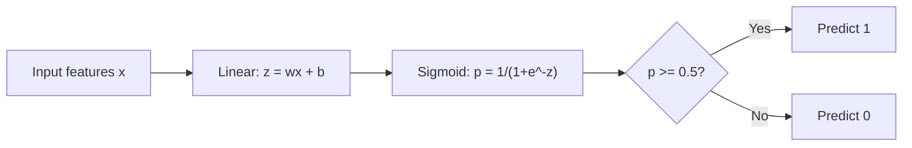
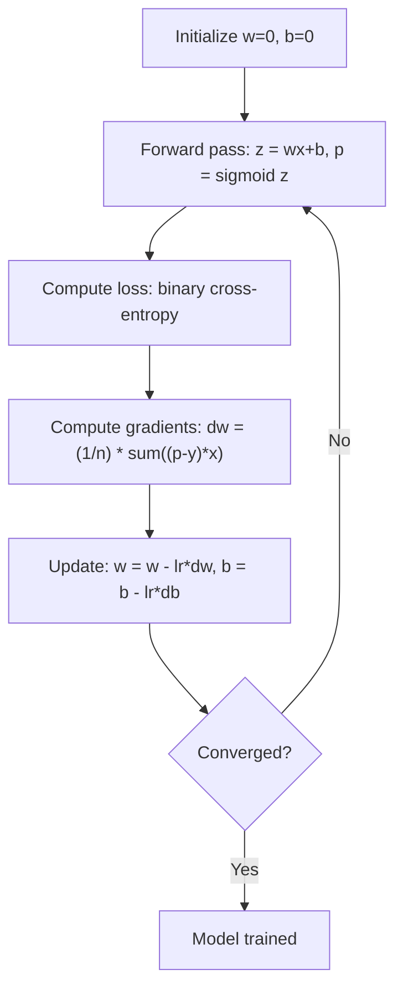

# 로지스틱 회귀 (Logistic Regression)

> 로지스틱 회귀(logistic regression)는 직선을 S자 곡선으로 휘어, 예/아니오 질문에 확률로 답한다.

**Type:** Build
**Languages:** Python
**Prerequisites:** Phase 2 Lesson 1-2 (What Is ML, Linear Regression)
**Time:** ~90분

## 학습 목표 (Learning Objectives)

- 시그모이드(sigmoid) 함수와 이진 교차 엔트로피(binary cross-entropy) 손실을 사용해 로지스틱 회귀를 밑바닥부터 구현하기
- 이진 분류(binary classification)에 대해 정밀도(precision), 재현율(recall), F1 점수, 혼동 행렬(confusion matrix)을 계산하고 해석하기
- 왜 MSE가 분류에 실패하는지, 그리고 왜 이진 교차 엔트로피가 볼록한 비용 곡면을 만드는지 설명하기
- 다중 클래스 분류를 위한 소프트맥스 회귀(softmax regression) 모델을 만들고, 임계값(threshold) 튜닝의 트레이드오프(trade-off)를 평가하기

## 문제 (The Problem)

종양 크기가 주어졌을 때 악성인지 양성인지 예측하고 싶다고 하자. 선형 회귀(linear regression)를 시도한다. 그러면 0.3이나 1.7이나 -0.5 같은 숫자가 나온다. 이 숫자들은 무엇을 의미하는가? 1.7은 "매우 악성"인가? -0.5는 "매우 양성"인가? 선형 회귀는 범위가 정해지지 않은 숫자를 출력한다. 분류(classification)는 0과 1 사이의 범위가 정해진 확률과, 명확한 결정(예 또는 아니오)이 필요하다.

로지스틱 회귀(logistic regression)는 이를 해결한다. 같은 선형 결합(wx + b)을 취해, 어떤 숫자든 (0, 1) 범위로 짓눌러 넣는 시그모이드(sigmoid) 함수를 통과시킨다. 출력은 확률이다. 임계값(threshold)(보통 0.5)을 설정하고 결정을 내린다.

이것은 실무에서 가장 널리 쓰이는 알고리즘 중 하나다. 이름과 달리, 로지스틱 회귀는 회귀(regression) 알고리즘이 아니라 분류 알고리즘이다. 이름은 그것이 사용하는 로지스틱(시그모이드) 함수에서 온다.

## 개념 (The Concept)

### 왜 선형 회귀는 분류에 실패하는가

공부 시간을 바탕으로 합격/불합격(1/0)을 예측한다고 상상해 보라. 선형 회귀는 데이터를 관통하는 직선을 맞춘다.

```
hours:  1   2   3   4   5   6   7   8   9   10
actual: 0   0   0   0   1   1   1   1   1   1
```

선형 적합은 1시간에서 -0.2, 10시간에서 1.3 같은 예측을 내놓을 수 있다. 이 값들은 확률이 아니다. 0 아래로, 1 위로 간다. 더 나쁘게는, 단 하나의 이상치(50시간을 공부한 사람)가 전체 직선을 끌어당겨, 모두에 대한 예측을 바꿔버린다.

분류에는 다음과 같은 함수가 필요하다.
- 0과 1 사이의 값(확률)을 출력한다
- 급격한 전이(결정 경계, decision boundary)를 만든다
- 경계에서 멀리 떨어진 이상치에 의해 왜곡되지 않는다

### 시그모이드 함수

시그모이드 함수는 정확히 이 일을 한다.

```
sigmoid(z) = 1 / (1 + e^(-z))
```

성질:
- z가 크고 양수일 때, sigmoid(z)는 1에 가까워진다
- z가 크고 음수일 때, sigmoid(z)는 0에 가까워진다
- z = 0일 때, sigmoid(z) = 0.5
- 출력은 항상 0과 1 사이다
- 함수는 매끄럽고 모든 곳에서 미분 가능하다

도함수(derivative)는 편리한 형태를 가진다: sigmoid'(z) = sigmoid(z) * (1 - sigmoid(z)). 이는 그래디언트(gradient) 계산을 효율적으로 만든다.

### 로지스틱 회귀 = 선형 모델 + 시그모이드

모델은 z = wx + b(선형 회귀와 동일)를 계산한 뒤, 시그모이드를 적용한다.



출력 p는 입력이 클래스 1에 속할 확률인 P(y=1 | x)로 해석된다. 결정 경계는 wx + b = 0인 곳이며, 이는 시그모이드가 정확히 0.5를 출력하게 만든다.

### 이진 교차 엔트로피 손실

로지스틱 회귀에는 MSE를 쓸 수 없다. 시그모이드와 결합한 MSE는 많은 국소 최솟값을 가진 비볼록 비용 곡면을 만든다. 대신, 이진 교차 엔트로피(binary cross-entropy, 로그 손실)를 사용한다.

```
Loss = -(1/n) * sum(y * log(p) + (1-y) * log(1-p))
```

왜 이것이 동작하는가:
- y=1이고 p가 1에 가까울 때: log(1) = 0이므로 손실(loss)은 0에 가깝다(정답, 낮은 비용)
- y=1이고 p가 0에 가까울 때: log(0)은 음의 무한대로 가므로 손실이 막대하다(오답, 높은 비용)
- y=0이고 p가 0에 가까울 때: log(1) = 0이므로 손실은 0에 가깝다(정답, 낮은 비용)
- y=0이고 p가 1에 가까울 때: log(0)은 음의 무한대로 가므로 손실이 막대하다(오답, 높은 비용)

이 손실 함수는 로지스틱 회귀에 대해 볼록(convex)하여, 단일 전역 최솟값을 보장한다.

### 로지스틱 회귀를 위한 경사 하강법

시그모이드를 적용한 이진 교차 엔트로피의 그래디언트는 깔끔한 형태를 가진다.

```
dL/dw = (1/n) * sum((p - y) * x)
dL/db = (1/n) * sum(p - y)
```

이 식들은 선형 회귀의 그래디언트와 똑같아 보인다. 차이는 p = wx + b 대신 p = sigmoid(wx + b)라는 점이다. 시그모이드가 비선형성을 도입하지만, 그래디언트 갱신 규칙은 그대로다.



### 결정 경계

2D 입력(두 특성)의 경우, 결정 경계는 다음을 만족하는 직선이다.

```
w1*x1 + w2*x2 + b = 0
```

한쪽의 점들은 1로 분류되고, 다른 쪽의 점들은 0으로 분류된다. 로지스틱 회귀는 항상 선형 결정 경계를 만든다. 곡선 경계가 필요하다면, 다항 특성(polynomial feature)을 추가하거나 비선형 모델을 쓴다.

### 소프트맥스를 사용한 다중 클래스 분류

이진 로지스틱 회귀는 두 클래스를 처리한다. k개 클래스의 경우, 소프트맥스(softmax) 함수를 사용한다.

```
softmax(z_i) = e^(z_i) / sum(e^(z_j) for all j)
```

각 클래스는 자신의 가중치 벡터를 가진다. 모델은 각 클래스에 대한 점수 z_i를 계산한 뒤, 소프트맥스가 점수를 합이 1이 되는 확률로 변환한다. 예측 클래스는 가장 높은 확률을 가진 것이다.

손실 함수는 범주형 교차 엔트로피(categorical cross-entropy)가 된다.

```
Loss = -(1/n) * sum(sum(y_k * log(p_k)))
```

여기서 y_k는 참 클래스에 대해 1이고 다른 모든 클래스에 대해 0이다(원-핫 인코딩, one-hot encoding).

### 평가 지표

정확도만으로는 충분하지 않다. 95%가 음성이고 5%가 양성인 데이터셋에서, 항상 음성을 예측하는 모델은 95% 정확도를 얻지만 쓸모가 없다.

**혼동 행렬(Confusion Matrix)**:

| | Predicted Positive | Predicted Negative |
|---|---|---|
| Actually Positive | True Positive (TP) | False Negative (FN) |
| Actually Negative | False Positive (FP) | True Negative (TN) |

**정밀도(Precision)**: 양성으로 예측한 것 중, 실제로 양성인 것은 얼마나 되는가?
```
Precision = TP / (TP + FP)
```

**재현율(Recall)** (민감도, Sensitivity): 실제 양성 중, 우리가 잡아낸 것은 얼마나 되는가?
```
Recall = TP / (TP + FN)
```

**F1 점수**: 정밀도와 재현율의 조화 평균. 두 지표의 균형을 맞춘다.
```
F1 = 2 * (Precision * Recall) / (Precision + Recall)
```

언제 우선시할 것인가:
- **정밀도(Precision)**: 거짓 양성이 비쌀 때(스팸 필터, 정상 이메일을 차단하고 싶지 않다)
- **재현율(Recall)**: 거짓 음성이 비쌀 때(암 검진, 종양을 놓치고 싶지 않다)
- **F1**: 단일한 균형 지표가 필요할 때

## 직접 만들기 (Build It)

### 1단계: 시그모이드 함수와 데이터 생성

```python
import random
import math

def sigmoid(z):
    z = max(-500, min(500, z))
    return 1.0 / (1.0 + math.exp(-z))


random.seed(42)
N = 200
X = []
y = []

for _ in range(N // 2):
    X.append([random.gauss(2, 1), random.gauss(2, 1)])
    y.append(0)

for _ in range(N // 2):
    X.append([random.gauss(5, 1), random.gauss(5, 1)])
    y.append(1)

combined = list(zip(X, y))
random.shuffle(combined)
X, y = zip(*combined)
X = list(X)
y = list(y)

print(f"Generated {N} samples (2 classes, 2 features)")
print(f"Class 0 center: (2, 2), Class 1 center: (5, 5)")
print(f"First 5 samples:")
for i in range(5):
    print(f"  Features: [{X[i][0]:.2f}, {X[i][1]:.2f}], Label: {y[i]}")
```

### 2단계: 밑바닥부터 만드는 로지스틱 회귀

```python
class LogisticRegression:
    def __init__(self, n_features, learning_rate=0.01):
        self.weights = [0.0] * n_features
        self.bias = 0.0
        self.lr = learning_rate
        self.loss_history = []

    def predict_proba(self, x):
        z = sum(w * xi for w, xi in zip(self.weights, x)) + self.bias
        return sigmoid(z)

    def predict(self, x, threshold=0.5):
        return 1 if self.predict_proba(x) >= threshold else 0

    def compute_loss(self, X, y):
        n = len(y)
        total = 0.0
        for i in range(n):
            p = self.predict_proba(X[i])
            p = max(1e-15, min(1 - 1e-15, p))
            total += y[i] * math.log(p) + (1 - y[i]) * math.log(1 - p)
        return -total / n

    def fit(self, X, y, epochs=1000, print_every=200):
        n = len(y)
        n_features = len(X[0])
        for epoch in range(epochs):
            dw = [0.0] * n_features
            db = 0.0
            for i in range(n):
                p = self.predict_proba(X[i])
                error = p - y[i]
                for j in range(n_features):
                    dw[j] += error * X[i][j]
                db += error
            for j in range(n_features):
                self.weights[j] -= self.lr * (dw[j] / n)
            self.bias -= self.lr * (db / n)
            loss = self.compute_loss(X, y)
            self.loss_history.append(loss)
            if epoch % print_every == 0:
                print(f"  Epoch {epoch:4d} | Loss: {loss:.4f} | w: [{self.weights[0]:.3f}, {self.weights[1]:.3f}] | b: {self.bias:.3f}")
        return self

    def accuracy(self, X, y):
        correct = sum(1 for i in range(len(y)) if self.predict(X[i]) == y[i])
        return correct / len(y)


split = int(0.8 * N)
X_train, X_test = X[:split], X[split:]
y_train, y_test = y[:split], y[split:]

print("\n=== Training Logistic Regression ===")
model = LogisticRegression(n_features=2, learning_rate=0.1)
model.fit(X_train, y_train, epochs=1000, print_every=200)

print(f"\nTrain accuracy: {model.accuracy(X_train, y_train):.4f}")
print(f"Test accuracy:  {model.accuracy(X_test, y_test):.4f}")
print(f"Weights: [{model.weights[0]:.4f}, {model.weights[1]:.4f}]")
print(f"Bias: {model.bias:.4f}")
```

### 3단계: 밑바닥부터 만드는 혼동 행렬과 지표

```python
class ClassificationMetrics:
    def __init__(self, y_true, y_pred):
        self.tp = sum(1 for t, p in zip(y_true, y_pred) if t == 1 and p == 1)
        self.tn = sum(1 for t, p in zip(y_true, y_pred) if t == 0 and p == 0)
        self.fp = sum(1 for t, p in zip(y_true, y_pred) if t == 0 and p == 1)
        self.fn = sum(1 for t, p in zip(y_true, y_pred) if t == 1 and p == 0)

    def accuracy(self):
        total = self.tp + self.tn + self.fp + self.fn
        return (self.tp + self.tn) / total if total > 0 else 0

    def precision(self):
        denom = self.tp + self.fp
        return self.tp / denom if denom > 0 else 0

    def recall(self):
        denom = self.tp + self.fn
        return self.tp / denom if denom > 0 else 0

    def f1(self):
        p = self.precision()
        r = self.recall()
        return 2 * p * r / (p + r) if (p + r) > 0 else 0

    def print_confusion_matrix(self):
        print(f"\n  Confusion Matrix:")
        print(f"                  Predicted")
        print(f"                  Pos   Neg")
        print(f"  Actual Pos     {self.tp:4d}  {self.fn:4d}")
        print(f"  Actual Neg     {self.fp:4d}  {self.tn:4d}")

    def print_report(self):
        self.print_confusion_matrix()
        print(f"\n  Accuracy:  {self.accuracy():.4f}")
        print(f"  Precision: {self.precision():.4f}")
        print(f"  Recall:    {self.recall():.4f}")
        print(f"  F1 Score:  {self.f1():.4f}")


y_pred_test = [model.predict(x) for x in X_test]
print("\n=== Classification Report (Test Set) ===")
metrics = ClassificationMetrics(y_test, y_pred_test)
metrics.print_report()
```

### 4단계: 결정 경계 분석

```python
print("\n=== Decision Boundary ===")
w1, w2 = model.weights
b = model.bias
print(f"Decision boundary: {w1:.4f}*x1 + {w2:.4f}*x2 + {b:.4f} = 0")
if abs(w2) > 1e-10:
    print(f"Solved for x2:     x2 = {-w1/w2:.4f}*x1 + {-b/w2:.4f}")

print("\nSample predictions near the boundary:")
test_points = [
    [3.0, 3.0],
    [3.5, 3.5],
    [4.0, 4.0],
    [2.5, 2.5],
    [5.0, 5.0],
]
for point in test_points:
    prob = model.predict_proba(point)
    pred = model.predict(point)
    print(f"  [{point[0]}, {point[1]}] -> prob={prob:.4f}, class={pred}")
```

### 5단계: 소프트맥스를 사용한 다중 클래스

```python
class SoftmaxRegression:
    def __init__(self, n_features, n_classes, learning_rate=0.01):
        self.n_features = n_features
        self.n_classes = n_classes
        self.lr = learning_rate
        self.weights = [[0.0] * n_features for _ in range(n_classes)]
        self.biases = [0.0] * n_classes

    def softmax(self, scores):
        max_score = max(scores)
        exp_scores = [math.exp(s - max_score) for s in scores]
        total = sum(exp_scores)
        return [e / total for e in exp_scores]

    def predict_proba(self, x):
        scores = [
            sum(self.weights[k][j] * x[j] for j in range(self.n_features)) + self.biases[k]
            for k in range(self.n_classes)
        ]
        return self.softmax(scores)

    def predict(self, x):
        probs = self.predict_proba(x)
        return probs.index(max(probs))

    def fit(self, X, y, epochs=1000, print_every=200):
        n = len(y)
        for epoch in range(epochs):
            grad_w = [[0.0] * self.n_features for _ in range(self.n_classes)]
            grad_b = [0.0] * self.n_classes
            total_loss = 0.0
            for i in range(n):
                probs = self.predict_proba(X[i])
                for k in range(self.n_classes):
                    target = 1.0 if y[i] == k else 0.0
                    error = probs[k] - target
                    for j in range(self.n_features):
                        grad_w[k][j] += error * X[i][j]
                    grad_b[k] += error
                true_prob = max(probs[y[i]], 1e-15)
                total_loss -= math.log(true_prob)
            for k in range(self.n_classes):
                for j in range(self.n_features):
                    self.weights[k][j] -= self.lr * (grad_w[k][j] / n)
                self.biases[k] -= self.lr * (grad_b[k] / n)
            if epoch % print_every == 0:
                print(f"  Epoch {epoch:4d} | Loss: {total_loss / n:.4f}")
        return self

    def accuracy(self, X, y):
        correct = sum(1 for i in range(len(y)) if self.predict(X[i]) == y[i])
        return correct / len(y)


random.seed(42)
X_3class = []
y_3class = []

centers = [(1, 1), (5, 1), (3, 5)]
for label, (cx, cy) in enumerate(centers):
    for _ in range(50):
        X_3class.append([random.gauss(cx, 0.8), random.gauss(cy, 0.8)])
        y_3class.append(label)

combined = list(zip(X_3class, y_3class))
random.shuffle(combined)
X_3class, y_3class = zip(*combined)
X_3class = list(X_3class)
y_3class = list(y_3class)

split_3 = int(0.8 * len(X_3class))
X_train_3 = X_3class[:split_3]
y_train_3 = y_3class[:split_3]
X_test_3 = X_3class[split_3:]
y_test_3 = y_3class[split_3:]

print("\n=== Multi-class Softmax Regression (3 classes) ===")
softmax_model = SoftmaxRegression(n_features=2, n_classes=3, learning_rate=0.1)
softmax_model.fit(X_train_3, y_train_3, epochs=1000, print_every=200)
print(f"\nTrain accuracy: {softmax_model.accuracy(X_train_3, y_train_3):.4f}")
print(f"Test accuracy:  {softmax_model.accuracy(X_test_3, y_test_3):.4f}")

print("\nSample predictions:")
for i in range(5):
    probs = softmax_model.predict_proba(X_test_3[i])
    pred = softmax_model.predict(X_test_3[i])
    print(f"  True: {y_test_3[i]}, Predicted: {pred}, Probs: [{', '.join(f'{p:.3f}' for p in probs)}]")
```

### 6단계: 임계값 튜닝

```python
print("\n=== Threshold Tuning ===")
print("Default threshold: 0.5. Adjusting the threshold trades precision for recall.\n")

thresholds = [0.3, 0.4, 0.5, 0.6, 0.7]
print(f"{'Threshold':>10} {'Accuracy':>10} {'Precision':>10} {'Recall':>10} {'F1':>10}")
print("-" * 52)

for t in thresholds:
    y_pred_t = [1 if model.predict_proba(x) >= t else 0 for x in X_test]
    m = ClassificationMetrics(y_test, y_pred_t)
    print(f"{t:>10.1f} {m.accuracy():>10.4f} {m.precision():>10.4f} {m.recall():>10.4f} {m.f1():>10.4f}")
```

## 라이브러리로 써보기 (Use It)

이제 같은 것을 scikit-learn으로 한다.

```python
from sklearn.linear_model import LogisticRegression as SklearnLR
from sklearn.metrics import accuracy_score, precision_score, recall_score, f1_score
from sklearn.metrics import confusion_matrix, classification_report
from sklearn.model_selection import train_test_split
from sklearn.preprocessing import StandardScaler
import numpy as np

np.random.seed(42)
X_0 = np.random.randn(100, 2) + [2, 2]
X_1 = np.random.randn(100, 2) + [5, 5]
X_sk = np.vstack([X_0, X_1])
y_sk = np.array([0] * 100 + [1] * 100)

X_tr, X_te, y_tr, y_te = train_test_split(X_sk, y_sk, test_size=0.2, random_state=42)

scaler = StandardScaler()
X_tr_sc = scaler.fit_transform(X_tr)
X_te_sc = scaler.transform(X_te)

lr = SklearnLR()
lr.fit(X_tr_sc, y_tr)
y_pred = lr.predict(X_te_sc)

print("=== Scikit-learn Logistic Regression ===")
print(f"Accuracy:  {accuracy_score(y_te, y_pred):.4f}")
print(f"Precision: {precision_score(y_te, y_pred):.4f}")
print(f"Recall:    {recall_score(y_te, y_pred):.4f}")
print(f"F1:        {f1_score(y_te, y_pred):.4f}")
print(f"\nConfusion Matrix:\n{confusion_matrix(y_te, y_pred)}")
print(f"\nClassification Report:\n{classification_report(y_te, y_pred)}")
```

밑바닥 구현은 같은 결정 경계와 지표를 만든다. scikit-learn은 솔버 옵션(liblinear, lbfgs, saga), 자동 정규화(regularization), 다중 클래스 전략(one-vs-rest, multinomial), 그리고 수치 안정성 최적화를 더한다.

## 산출물 (Ship It)

이 레슨이 만들어내는 것:
- `code/logistic_regression.py` - 지표를 포함한, 밑바닥부터 만든 로지스틱 회귀

## 연습 문제 (Exercises)

1. 선형적으로 분리 불가능한 데이터셋(예: 두 동심원)을 생성하라. 로지스틱 회귀를 학습시키고 그 실패를 관찰하라. 그다음 다항 특성(x1^2, x2^2, x1*x2)을 추가하고 다시 학습시켜라. 정확도가 개선됨을 보여라.
2. 3-클래스 소프트맥스 모델에 대한 다중 클래스 혼동 행렬을 구현하라. 클래스별 정밀도와 재현율을 계산하라. 어느 클래스가 분류하기 가장 어려운가?
3. ROC 곡선을 밑바닥부터 만들어라. 0부터 1까지의 100개 임계값에 대해, 참 양성률(true positive rate)과 거짓 양성률(false positive rate)을 계산하라. 사다리꼴 법칙(trapezoidal rule)을 사용해 AUC(곡선 아래 면적)를 계산하라.

## 핵심 용어 (Key Terms)

| 용어 | 흔히 하는 말 | 실제 의미 |
|------|----------------|----------------------|
| 로지스틱 회귀(Logistic regression) | "분류를 위한 회귀" | 클래스 확률을 출력하는, 시그모이드 함수가 뒤따르는 선형 모델 |
| 시그모이드 함수(Sigmoid function) | "S자 곡선" | 임의의 실수를 (0, 1) 범위로 매핑하는 함수 1/(1+e^(-z)) |
| 이진 교차 엔트로피(Binary cross-entropy) | "로그 손실" | 확신에 찬 오답을 심하게 처벌하는 손실 함수 -[y*log(p) + (1-y)*log(1-p)] |
| 결정 경계(Decision boundary) | "나누는 선" | 모델의 출력 확률이 0.5와 같아지는, 예측 클래스를 분리하는 곡면 |
| 소프트맥스(Softmax) | "다중 클래스 시그모이드" | 점수 벡터를 합이 1이 되는 확률로 변환하는 함수 |
| 정밀도(Precision) | "선택한 것 중 얼마나 적절한가" | TP / (TP + FP), 양성 예측 중 실제로 양성인 비율 |
| 재현율(Recall) | "적절한 것 중 얼마나 선택했나" | TP / (TP + FN), 모델이 올바르게 식별한 실제 양성의 비율 |
| F1 점수(F1 score) | "균형 잡힌 정확도" | 정밀도와 재현율의 조화 평균: 2*P*R / (P+R) |
| 혼동 행렬(Confusion matrix) | "오류 분해표" | 각 클래스 쌍에 대해 TP, TN, FP, FN 개수를 보여주는 표 |
| 임계값(Threshold) | "컷오프" | 그 위에서 모델이 클래스 1을 예측하는 확률 값(기본 0.5, 튜닝 가능) |
| 원-핫 인코딩(One-hot encoding) | "범주를 위한 이진 컬럼" | 클래스 k를 위치 k에 1이 있는 0의 벡터로 표현하는 것 |
| 범주형 교차 엔트로피(Categorical cross-entropy) | "다중 클래스 로그 손실" | 원-핫 인코딩된 레이블을 사용해 이진 교차 엔트로피를 k개 클래스로 확장한 것 |
</content>
</invoke>
