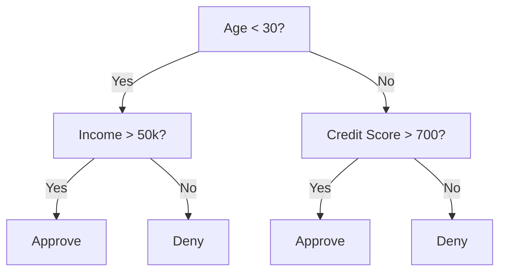
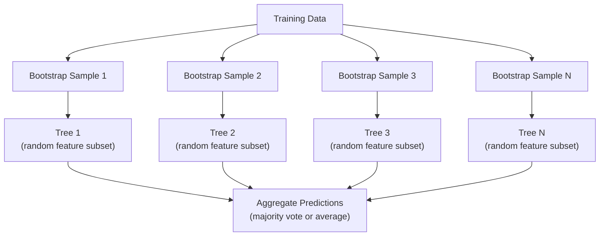

# 결정 트리와 랜덤 포레스트 (Decision Trees and Random Forests)

> 결정 트리(decision tree)는 그저 순서도일 뿐이다. 하지만 트리가 모인 숲(forest)은 ML에서 가장 강력한 도구 중 하나다.

**Type:** Build
**Language:** Python
**Prerequisites:** Phase 1 (Lessons 09 Information Theory, 06 Probability)
**Time:** ~90분

## 학습 목표 (Learning Objectives)

- 최적의 결정 트리 분할을 찾기 위해 지니 불순도(Gini impurity), 엔트로피(entropy), 정보 이득(information gain) 계산을 구현하기
- 사전 가지치기(pre-pruning) 제어(최대 깊이, 최소 샘플 수)를 갖춘 결정 트리 분류기를 밑바닥부터 만들기
- 부트스트랩 샘플링(bootstrap sampling)과 특성 무작위화(feature randomization)를 사용해 랜덤 포레스트(random forest)를 구성하고, 왜 그것이 분산을 줄이는지 설명하기
- MDI 특성 중요도(feature importance)를 순열 중요도(permutation importance)와 비교하고, 언제 MDI가 편향되는지 식별하기

## 문제 (The Problem)

표 형태의 데이터가 있다고 하자. 행은 샘플, 열은 특성(feature)이고, 예측하고 싶은 타깃 열이 있다. 신경망(neural network)을 던져볼 수도 있다. 하지만 표 형태 데이터에서는 트리 기반 모델(결정 트리, 랜덤 포레스트, 그래디언트 부스티드 트리)이 딥러닝(deep learning)을 꾸준히 능가한다. 구조화된 데이터에 대한 Kaggle 대회는 트랜스포머가 아니라 XGBoost와 LightGBM이 지배한다.

왜일까? 트리는 전처리 없이 혼합된 특성 유형(수치형과 범주형)을 처리한다. 특성 공학(feature engineering) 없이 비선형 관계를 다룬다. 해석도 된다. 트리를 보면 어떤 예측이 왜 나왔는지 정확히 알 수 있다. 그리고 많은 트리를 평균하는 랜덤 포레스트는 중간 크기 데이터셋(dataset)에서 과적합(overfitting)에 매우 강하다.

이 레슨에서는 재귀적 분할로 결정 트리를 밑바닥부터 만든 다음, 그 위에 랜덤 포레스트를 만든다. 분할 기준(지니 불순도, 엔트로피, 정보 이득) 뒤에 있는 수학을 구현하면서, 약한 학습기(weak learner)들의 앙상블(ensemble)이 어떻게 강한 학습기가 되는지 이해한다.

## 개념 (The Concept)

### 결정 트리가 하는 일

결정 트리는 일련의 예/아니오 질문을 던져 특성 공간을 직사각형 영역들로 분할한다.



각 내부 노드는 어떤 특성을 임계값(threshold)과 비교해 테스트한다. 각 잎(leaf) 노드는 예측을 내놓는다. 새 데이터 포인트를 분류하려면 루트에서 시작해 잎에 도달할 때까지 가지를 따라간다.

트리는 위에서 아래로, 각 노드에서 데이터를 가장 잘 분리하는 특성과 임계값을 고르며 만들어진다. "가장 잘"은 분할 기준(split criterion)으로 정의된다.

### 분할 기준: 불순도 측정

각 노드에는 샘플 집합이 있다. 분할 결과로 나오는 자식 노드들이 가능한 한 "순수"하도록, 즉 각 자식이 대부분 하나의 클래스만 담도록 분할하는 것이 목표다.

**지니 불순도(Gini impurity)**는 무작위로 선택된 샘플을, 그 노드의 클래스 분포에 따라 레이블을 붙였을 때 잘못 분류될 확률을 측정한다.

```
Gini(S) = 1 - sum(p_k^2)

where p_k is the proportion of class k in set S.
```

순수한 노드(모두 한 클래스)에서 Gini = 0이다. 50/50 클래스의 이진 분할에서 Gini = 0.5다. 낮을수록 좋다.

```
Example: 6 cats, 4 dogs

Gini = 1 - (0.6^2 + 0.4^2) = 1 - (0.36 + 0.16) = 0.48
```

**엔트로피(Entropy)**는 노드의 정보량(무질서)을 측정한다. Phase 1 Lesson 09에서 다뤘다.

```
Entropy(S) = -sum(p_k * log2(p_k))
```

순수한 노드에서 엔트로피 = 0이다. 50/50 이진 분할에서 엔트로피 = 1.0이다. 낮을수록 좋다.

```
Example: 6 cats, 4 dogs

Entropy = -(0.6 * log2(0.6) + 0.4 * log2(0.4))
        = -(0.6 * -0.737 + 0.4 * -1.322)
        = 0.442 + 0.529
        = 0.971 bits
```

**정보 이득(Information gain)**은 분할 후 불순도(엔트로피 또는 지니)의 감소량이다.

```
IG(S, feature, threshold) = Impurity(S) - weighted_avg(Impurity(S_left), Impurity(S_right))

where the weights are the proportions of samples in each child.
```

각 노드에서의 탐욕 알고리즘(greedy algorithm): 모든 특성과 가능한 모든 임계값을 시도한다. 정보 이득을 최대화하는 (특성, 임계값) 쌍을 고른다.

### 분할은 어떻게 동작하는가

현재 노드에 n개 특성과 m개 샘플이 있는 데이터셋의 경우:

1. 각 특성 j에 대해(j = 1부터 n까지):
   - 샘플을 특성 j로 정렬한다
   - 연속한 서로 다른 값들 사이의 모든 중간점을 임계값으로 시도한다
   - 각 임계값에 대한 정보 이득을 계산한다
2. 가장 높은 정보 이득을 가진 특성과 임계값을 선택한다
3. 데이터를 왼쪽(feature <= threshold)과 오른쪽(feature > threshold)으로 분할한다
4. 각 자식에 대해 재귀한다

이 탐욕적 접근법이 전역적으로 최적인 트리를 보장하지는 않는다. 최적 트리를 찾는 것은 NP-하드다. 그래도 탐욕적 분할은 실무에서 잘 동작한다.

### 정지 조건

정지 조건이 없으면 트리는 모든 잎이 순수해질 때까지(잎당 샘플 하나) 자란다. 학습 데이터는 완벽히 암기하지만 일반화는 형편없어진다.

**사전 가지치기(Pre-pruning)**는 트리가 완전히 자라기 전에 멈춘다.
- 최대 깊이: 트리가 설정된 깊이에 도달하면 분할을 멈춘다
- 잎당 최소 샘플 수: 노드의 샘플이 k개 미만이면 멈춘다
- 최소 정보 이득: 최선의 분할이 불순도를 임계값보다 적게 개선하면 멈춘다
- 최대 잎 노드 수: 잎의 총 개수를 제한한다

**사후 가지치기(Post-pruning)**는 트리를 완전히 키운 뒤 다시 잘라낸다.
- 비용-복잡도 가지치기(scikit-learn이 사용): 잎의 수에 비례하는 페널티를 더한다. 페널티를 높이면 더 작은 트리를 얻는다
- 오류 감소 가지치기(Reduced error pruning): 검증 오차가 증가하지 않으면 서브트리를 제거한다

사전 가지치기가 더 단순하고 빠르다. 사후 가지치기는 유용한 추가 분할로 이어질 분할을 성급하게 멈추지 않기 때문에 종종 더 나은 트리를 만든다.

### 회귀를 위한 결정 트리

회귀(regression)의 경우, 잎의 예측은 그 잎에 있는 타깃 값들의 평균이다. 분할 기준도 바뀐다.

**분산 감소(Variance reduction)**가 정보 이득을 대체한다.

```
VR(S, feature, threshold) = Var(S) - weighted_avg(Var(S_left), Var(S_right))
```

분산을 가장 많이 줄이는 분할을 고른다. 트리는 입력 공간을 영역들로 분할하고, 각 영역에서 상수(평균)를 예측한다.

### 랜덤 포레스트: 앙상블의 힘

단일 결정 트리는 분산이 높다. 데이터가 조금만 달라져도 완전히 다른 트리가 나올 수 있다. 랜덤 포레스트(random forest)는 많은 트리를 평균해 이를 해결한다.



두 가지 무작위성의 원천이 트리를 다양하게 만든다.

**배깅(Bagging, bootstrap aggregating):** 각 트리는 학습 데이터에서 복원 추출한 무작위 샘플인 부트스트랩 샘플(bootstrap sample)로 학습된다. 원본 샘플의 약 63%가 각 부트스트랩에 나타난다(나머지는 검증에 쓸 수 있는 out-of-bag 샘플이다).

**특성 무작위화(Feature randomization):** 각 분할에서, 특성의 무작위 부분집합만 고려된다. 분류(classification)의 경우 기본값은 sqrt(n_features)다. 회귀의 경우 n_features/3이다. 이는 모든 트리가 같은 지배적 특성으로 분할하는 것을 막는다.

핵심 통찰: 많은 비상관(decorrelated) 트리를 평균하면 편향을 늘리지 않으면서 분산을 줄인다. 개별 트리는 평범해도 앙상블은 강하다.

### 특성 중요도

랜덤 포레스트는 자연스럽게 특성 중요도(feature importance) 점수를 제공한다. 가장 흔한 방법:

**평균 불순도 감소(Mean Decrease in Impurity, MDI):** 각 특성에 대해, 그 특성이 사용된 모든 트리와 모든 노드에 걸친 총 불순도 감소를 합산한다. 더 이른 분할에서 더 큰 불순도 감소를 만드는 특성이 더 중요하다.

```
importance(feature_j) = sum over all nodes where feature_j is used:
    (n_samples_at_node / n_total_samples) * impurity_decrease
```

이 방법은 빠르지만(학습 중에 계산된다) 카디널리티가 높은 특성과 분할 지점이 많은 특성 쪽으로 편향된다.

**순열 중요도(Permutation importance)**는 대안이다. 한 특성의 값을 섞고 모델의 정확도가 얼마나 떨어지는지 측정한다. 더 신뢰할 수 있지만 더 느리다.

### 트리가 신경망을 이길 때

트리와 포레스트는 표 형태 데이터에서 신경망을 압도한다. 여러 이유가 있다.

| 요인 | 트리 | 신경망 |
|--------|-------|----------------|
| 혼합 유형(수치형 + 범주형) | 네이티브 지원 | 인코딩 필요 |
| 작은 데이터셋(< 10k 행) | 잘 동작 | 과적합 |
| 특성 상호작용 | 분할로 찾아냄 | 아키텍처 설계 필요 |
| 해석 가능성 | 완전한 투명성 | 블랙박스 |
| 학습 시간 | 분 단위 | 시간 단위 |
| 하이퍼파라미터 민감도 | 낮음 | 높음 |

신경망은 데이터가 공간적이거나 순차적인 구조(이미지, 텍스트, 오디오)를 가질 때 이긴다. 특성들이 평평하게 나열된 표에서는 트리가 기본 선택이다.

## 직접 만들기 (Build It)

### 1단계: 지니 불순도와 엔트로피

두 분할 기준을 밑바닥부터 만들고, 어떤 분할이 좋은지에 대해 둘이 일치하는지 검증한다.

```python
import math

def gini_impurity(labels):
    n = len(labels)
    if n == 0:
        return 0.0
    counts = {}
    for label in labels:
        counts[label] = counts.get(label, 0) + 1
    return 1.0 - sum((c / n) ** 2 for c in counts.values())

def entropy(labels):
    n = len(labels)
    if n == 0:
        return 0.0
    counts = {}
    for label in labels:
        counts[label] = counts.get(label, 0) + 1
    return -sum(
        (c / n) * math.log2(c / n) for c in counts.values() if c > 0
    )
```

### 2단계: 최선의 분할 찾기

모든 특성과 모든 임계값을 시도한다. 가장 높은 정보 이득을 가진 것을 반환한다.

```python
def information_gain(parent_labels, left_labels, right_labels, criterion="gini"):
    measure = gini_impurity if criterion == "gini" else entropy
    n = len(parent_labels)
    n_left = len(left_labels)
    n_right = len(right_labels)
    if n_left == 0 or n_right == 0:
        return 0.0
    parent_impurity = measure(parent_labels)
    child_impurity = (
        (n_left / n) * measure(left_labels) +
        (n_right / n) * measure(right_labels)
    )
    return parent_impurity - child_impurity
```

### 3단계: DecisionTree 클래스 만들기

재귀적 분할, 예측, 그리고 특성 중요도 추적.

```python
class DecisionTree:
    def __init__(self, max_depth=None, min_samples_split=2,
                 min_samples_leaf=1, criterion="gini",
                 max_features=None):
        self.max_depth = max_depth
        self.min_samples_split = min_samples_split
        self.min_samples_leaf = min_samples_leaf
        self.criterion = criterion
        self.max_features = max_features
        self.tree = None
        self.feature_importances_ = None

    def fit(self, X, y):
        self.n_features = len(X[0])
        self.feature_importances_ = [0.0] * self.n_features
        self.n_samples = len(X)
        self.tree = self._build(X, y, depth=0)
        total = sum(self.feature_importances_)
        if total > 0:
            self.feature_importances_ = [
                fi / total for fi in self.feature_importances_
            ]

    def predict(self, X):
        return [self._predict_one(x, self.tree) for x in X]
```

### 4단계: RandomForest 클래스 만들기

부트스트랩 샘플링, 특성 무작위화, 그리고 다수결 투표.

```python
class RandomForest:
    def __init__(self, n_trees=100, max_depth=None,
                 min_samples_split=2, max_features="sqrt",
                 criterion="gini"):
        self.n_trees = n_trees
        self.max_depth = max_depth
        self.min_samples_split = min_samples_split
        self.max_features = max_features
        self.criterion = criterion
        self.trees = []

    def fit(self, X, y):
        n = len(X)
        for _ in range(self.n_trees):
            indices = [random.randint(0, n - 1) for _ in range(n)]
            X_boot = [X[i] for i in indices]
            y_boot = [y[i] for i in indices]
            tree = DecisionTree(
                max_depth=self.max_depth,
                min_samples_split=self.min_samples_split,
                max_features=self.max_features,
                criterion=self.criterion,
            )
            tree.fit(X_boot, y_boot)
            self.trees.append(tree)

    def predict(self, X):
        all_preds = [tree.predict(X) for tree in self.trees]
        predictions = []
        for i in range(len(X)):
            votes = {}
            for preds in all_preds:
                v = preds[i]
                votes[v] = votes.get(v, 0) + 1
            predictions.append(max(votes, key=votes.get))
        return predictions
```

모든 헬퍼 메서드를 포함한 완전한 구현은 `code/trees.py`를 보라.

## 라이브러리로 써보기 (Use It)

scikit-learn으로는 랜덤 포레스트를 학습시키는 것이 세 줄이다.

```python
from sklearn.ensemble import RandomForestClassifier
from sklearn.datasets import load_iris
from sklearn.model_selection import train_test_split

X, y = load_iris(return_X_y=True)
X_train, X_test, y_train, y_test = train_test_split(X, y, random_state=42)

rf = RandomForestClassifier(n_estimators=100, random_state=42)
rf.fit(X_train, y_train)
print(f"Accuracy: {rf.score(X_test, y_test):.4f}")
print(f"Feature importances: {rf.feature_importances_}")
```

실무에서 그래디언트 부스티드 트리(XGBoost, LightGBM, CatBoost)가 랜덤 포레스트보다 강할 때가 많은데, 트리를 순차적으로 만들면서 각 트리가 이전 트리들의 오류를 교정하기 때문이다. 다만 랜덤 포레스트는 잘못 구성하기가 더 어렵고 하이퍼파라미터 튜닝도 거의 필요 없다.

## 산출물 (Ship It)

이 레슨은 `outputs/prompt-tree-interpreter.md`를 만들어낸다 -- 비즈니스 이해관계자를 위해 결정 트리 분할을 해석하는 프롬프트(prompt)다. 학습된 트리의 구조(깊이, 특성, 분할 임계값, 정확도)를 넣으면 모델을 평이한 언어의 규칙으로 번역하고, 특성 중요도 순위를 매기고, 과적합이나 누출(leakage)을 표시하며, 다음 단계를 권장한다. 코드를 읽지 않는 사람에게 트리 기반 모델을 설명해야 할 때 언제든 사용하라.

## 연습 문제 (Exercises)

1. 3개 클래스를 가진 2D 데이터셋에서 단일 결정 트리를 학습시켜라. 분할을 수동으로 추적하고 직사각형 결정 경계(decision boundary)를 그려라. max_depth=2일 때와 max_depth=10일 때의 경계를 비교하라.

2. 회귀 트리를 위한 분산 감소 분할을 구현하라. 200개 점에 대해 y = sin(x) + noise를 생성하고 회귀 트리를 맞춰라. 트리의 구간별 상수(piecewise-constant) 예측을 참 곡선과 비교해 그려라.

3. 1, 5, 10, 50, 200개의 트리로 랜덤 포레스트를 만들어라. 트리 수에 따른 학습 정확도와 테스트 정확도를 그려라. 테스트 정확도가 평탄해지지만 감소하지는 않음(포레스트는 과적합에 강함)을 관찰하라.

4. 5개의 서로 다른 데이터셋에서 분할 기준으로 지니 불순도와 엔트로피를 비교하라. 정확도와 트리 깊이를 측정하라. 대부분의 경우, 둘은 거의 동일한 결과를 낸다. 이유를 설명하라.

5. 순열 중요도를 구현하라. 한 특성이 무작위 노이즈이지만 카디널리티가 높은 데이터셋에서 MDI 중요도와 비교하라. MDI는 노이즈 특성에 높은 순위를 매길 것이다. 순열 중요도는 그러지 않을 것이다.

## 핵심 용어 (Key Terms)

| 용어 | 흔히 하는 말 | 실제 의미 |
|------|----------------|----------------------|
| 결정 트리(Decision tree) | "예측을 위한 순서도" | 일련의 if/else 분할을 학습하여 특성 공간을 직사각형 영역으로 분할하는 모델 |
| 지니 불순도(Gini impurity) | "노드가 얼마나 섞여 있는가" | 노드에서 무작위 샘플을 잘못 분류할 확률. 0 = 순수, 0.5 = 이진의 경우 최대 불순도 |
| 엔트로피(Entropy) | "노드의 무질서" | 노드의 정보량. 0 = 순수, 1.0 = 이진의 경우 최대 불확실성. 정보 이론에서 유래 |
| 정보 이득(Information gain) | "분할이 얼마나 좋은가" | 분할 후 불순도의 감소량. 분할을 고르는 탐욕적 기준 |
| 사전 가지치기(Pre-pruning) | "트리를 일찍 멈춘다" | 최대 깊이, 최소 샘플, 또는 최소 이득 임계값을 설정해 트리 성장을 일찍 멈추는 것 |
| 사후 가지치기(Post-pruning) | "나중에 트리를 다듬는다" | 트리를 완전히 키운 뒤, 검증 성능을 개선하지 않는 서브트리를 제거하는 것 |
| 배깅(Bagging) | "무작위 부분집합으로 학습한다" | Bootstrap aggregating. 각 모델을 복원 추출한 서로 다른 무작위 샘플로 학습하는 것 |
| 랜덤 포레스트(Random forest) | "한 무더기의 트리" | 각각 부트스트랩 샘플로 학습되며 각 분할에서 무작위 특성 부분집합을 쓰는 결정 트리의 앙상블 |
| 특성 중요도 (MDI) | "어떤 특성이 중요한가" | 모든 트리와 노드에 걸쳐 합산된, 각 특성이 기여한 총 불순도 감소 |
| 순열 중요도(Permutation importance) | "섞어서 확인한다" | 특성의 값을 무작위로 섞었을 때의 정확도 하락. 노이즈 특성에 대해 MDI보다 신뢰할 수 있다 |
| 분산 감소(Variance reduction) | "정보 이득의 회귀 버전" | 정보 이득의 회귀 트리 대응물. 타깃 분산을 가장 많이 줄이는 분할을 고른다 |
| 부트스트랩 샘플(Bootstrap sample) | "반복을 허용한 무작위 샘플" | 원본 데이터셋에서 복원 추출한 무작위 샘플. 같은 크기지만 중복이 있다 |

## 더 읽을거리 (Further Reading)

- [Breiman: Random Forests (2001)](https://link.springer.com/article/10.1023/A:1010933404324) - 원조 랜덤 포레스트 논문
- [Grinsztajn et al.: Why do tree-based models still outperform deep learning on tabular data? (2022)](https://arxiv.org/abs/2207.08815) - 표 형태 과제에서 트리 대 신경망의 엄밀한 비교
- [scikit-learn Decision Trees documentation](https://scikit-learn.org/stable/modules/tree.html) - 시각화 도구가 있는 실용 가이드
- [XGBoost: A Scalable Tree Boosting System (Chen & Guestrin, 2016)](https://arxiv.org/abs/1603.02754) - Kaggle을 지배하는 그래디언트 부스팅 논문
