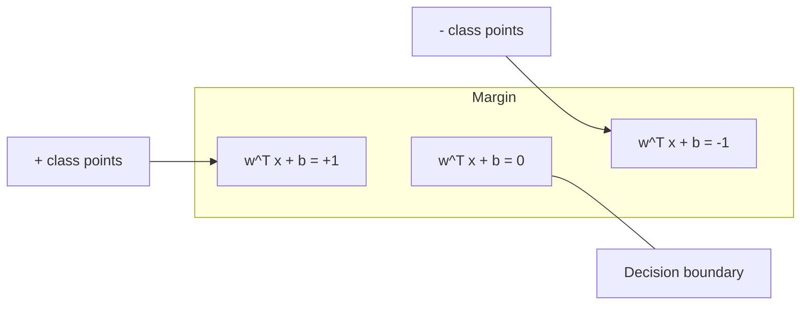
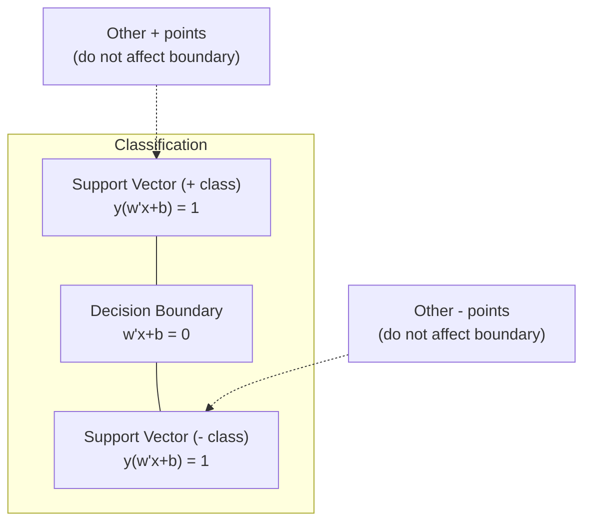
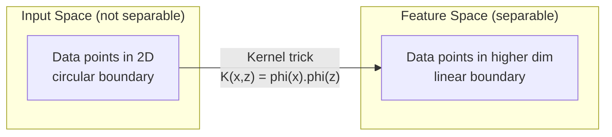

# 서포트 벡터 머신 (Support Vector Machines)

> 두 클래스 사이의 가장 넓은 길을 찾아라. 그것이 전부다.

**Type:** Build
**Language:** Python
**Prerequisites:** Phase 1 (Lessons 08 Optimization, 14 Norms and Distances, 18 Convex Optimization)
**Time:** ~90분

## 학습 목표 (Learning Objectives)

- 힌지 손실(hinge loss)과 원초(primal) 정식화에 대한 경사 하강법(gradient descent)을 사용해 선형 SVM을 밑바닥부터 구현하기
- 최대 마진(maximum margin) 원리를 설명하고, 학습된 모델에서 서포트 벡터(support vector)를 식별하기
- 선형, 다항(polynomial), RBF 커널을 비교하고, 커널 트릭(kernel trick)이 명시적인 고차원 매핑을 어떻게 피하는지 설명하기
- 마진 너비와 분류 오류 사이에서 C 파라미터(parameter)가 제어하는 트레이드오프(trade-off)를 평가하기

## 문제 (The Problem)

두 클래스의 데이터 포인트가 있고, 이를 분리하는 직선(또는 초평면, hyperplane)을 그어야 한다. 가능한 직선은 무한히 많다. 어느 것을 골라야 하는가?

가장 큰 마진(margin)을 가진 것이다. 마진은 결정 경계(decision boundary)와 양쪽의 가장 가까운 데이터 포인트 사이의 거리다. 마진이 더 넓으면 분류기가 더 확신하고, 보지 못한 데이터에도 더 잘 일반화한다.

이 직관은 ML에서 가장 수학적으로 우아한 알고리즘 중 하나인 서포트 벡터 머신(Support Vector Machine, SVM)으로 이어진다. SVM은 딥러닝(deep learning) 이전 지배적인 분류 방법이었고, 작은 데이터셋(dataset), 고차원 데이터, 그리고 이론적 보장을 가진 원칙에 입각하고 잘 이해된 모델이 필요한 문제에 여전히 최선의 선택이다.

SVM은 Phase 1과 직접 연결된다. 최적화는 볼록(convex)이고(Lesson 18), 마진은 노름(norm)으로 측정되며(Lesson 14), 커널 트릭은 내적(dot product)을 활용해 고차원 공간에서 결코 계산하지 않고도 비선형 경계를 처리한다.

## 개념 (The Concept)

### 최대 마진 분류기

레이블(label) y_i가 {-1, +1}에 속하고 특성 벡터(feature vector) x_i를 가진 선형적으로 분리 가능한 데이터가 주어졌을 때, 클래스들을 분리하는 초평면 w^T x + b = 0을 구한다.

점 x_i에서 초평면까지의 거리는 다음과 같다.

```
distance = |w^T x_i + b| / ||w||
```

올바르게 분류된 점의 경우: y_i * (w^T x_i + b) > 0. 마진은 초평면에서 양쪽의 가장 가까운 점까지 거리의 두 배다.



최적화 문제:

```
maximize    2 / ||w||     (the margin width)
subject to  y_i * (w^T x_i + b) >= 1  for all i
```

동등하게(||w||^2을 최소화하는 것이 최적화하기 더 쉽다):

```
minimize    (1/2) ||w||^2
subject to  y_i * (w^T x_i + b) >= 1  for all i
```

이는 볼록 2차 계획법(quadratic program)이다. 유일한 전역 해를 가진다. 마진 경계 위에 정확히 놓인 데이터 포인트들(y_i * (w^T x_i + b) = 1인 곳)이 서포트 벡터(support vector)다. 이 점들이 결정 경계를 결정하는 유일한 점들이다. 서포트 벡터가 아닌 점은 어떤 것이든 옮기거나 제거해도 경계는 변하지 않는다.

### 서포트 벡터: 결정적인 소수



대부분의 학습 점들은 무관하다. 오직 서포트 벡터만이 중요하다. SVM이 예측 시점에 메모리 효율적인 이유가 여기에 있다. 전체 학습 셋이 아니라 서포트 벡터만 저장하면 된다.

서포트 벡터의 개수는 일반화 오차에 대한 한계(bound)도 준다. 데이터셋 크기 대비 서포트 벡터가 적을수록 일반화가 더 좋다는 뜻이다.

### 소프트 마진: C 파라미터로 노이즈 다루기

실제 데이터는 완벽하게 분리 가능한 경우가 드물다. 일부 점은 경계의 잘못된 쪽에 있거나 마진 안에 있다. 소프트 마진(soft margin) 정식화는 슬랙 변수(slack variable)를 도입해 위반을 허용한다.

```
minimize    (1/2) ||w||^2 + C * sum(xi_i)
subject to  y_i * (w^T x_i + b) >= 1 - xi_i
            xi_i >= 0  for all i
```

슬랙 변수 xi_i는 점 i가 마진을 얼마나 위반하는지 측정한다. C가 트레이드오프를 제어한다.

| C 값 | 동작 |
|---------|----------|
| 큰 C | 위반에 무겁게 페널티를 준다. 좁은 마진, 더 적은 오분류. 과적합 |
| 작은 C | 더 많은 위반을 허용한다. 넓은 마진, 더 많은 오분류. 과소적합 |

C는 정규화(regularization) 강도를 역으로 한 것이다. 큰 C = 적은 정규화. 작은 C = 많은 정규화.

### 힌지 손실: SVM 손실 함수

소프트 마진 SVM은 제약 없는 최적화로 다시 쓸 수 있다.

```
minimize    (1/2) ||w||^2 + C * sum(max(0, 1 - y_i * (w^T x_i + b)))
```

max(0, 1 - y_i * f(x_i)) 항이 힌지 손실(hinge loss)이다. 점이 올바르게 분류되고 마진을 넘어서면 0이다. 점이 마진 안에 있거나 오분류되면 선형이다.

```
Hinge loss for a single point:

loss
  |
  | \
  |  \
  |   \
  |    \
  |     \_______________
  |
  +-----|-----|-------->  y * f(x)
       0     1

Zero loss when y*f(x) >= 1 (correctly classified, outside margin).
Linear penalty when y*f(x) < 1.
```

로지스틱 손실(로지스틱 회귀)과 비교하면:

```
Hinge:     max(0, 1 - y*f(x))          Hard cutoff at margin
Logistic:  log(1 + exp(-y*f(x)))        Smooth, never exactly zero
```

힌지 손실은 희소(sparse) 해를 만든다(오직 서포트 벡터만 0이 아닌 기여를 한다). 로지스틱 손실은 모든 데이터 포인트를 사용한다. 그래서 SVM이 예측 시점에 더 메모리 효율적이다.

### 경사 하강법으로 선형 SVM 학습하기

제약된 QP를 풀지 않고도, 힌지 손실에 L2 정규화를 더한 것에 대한 경사 하강법으로 선형 SVM을 학습시킬 수 있다.

```
L(w, b) = (lambda/2) * ||w||^2 + (1/n) * sum(max(0, 1 - y_i * (w^T x_i + b)))

Gradient with respect to w:
  If y_i * (w^T x_i + b) >= 1:  dL/dw = lambda * w
  If y_i * (w^T x_i + b) < 1:   dL/dw = lambda * w - y_i * x_i

Gradient with respect to b:
  If y_i * (w^T x_i + b) >= 1:  dL/db = 0
  If y_i * (w^T x_i + b) < 1:   dL/db = -y_i
```

이것을 원초(primal) 정식화라고 한다. 에폭(epoch)당 O(n * d)로 실행되며, 여기서 n은 샘플 수, d는 특성 수다. 크고 희소한 고차원 데이터(텍스트 분류)에서 이 방식은 빠르다.

### 쌍대 정식화와 커널 트릭

SVM 문제의 라그랑주 쌍대(Lagrangian dual)(Phase 1 Lesson 18의 KKT 조건으로부터)는 다음과 같다.

```
maximize    sum(alpha_i) - (1/2) * sum_ij(alpha_i * alpha_j * y_i * y_j * (x_i . x_j))
subject to  0 <= alpha_i <= C
            sum(alpha_i * y_i) = 0
```

쌍대(dual)는 데이터 포인트 사이의 내적 x_i . x_j만을 포함한다. 이것이 핵심 통찰이다. 모든 내적을 커널 함수 K(x_i, x_j)로 대체하면, SVM은 변환을 명시적으로 계산하지 않고도 비선형 경계를 학습한다.

```
Linear kernel:      K(x, z) = x . z
Polynomial kernel:  K(x, z) = (x . z + c)^d
RBF (Gaussian):     K(x, z) = exp(-gamma * ||x - z||^2)
```

RBF 커널은 데이터를 무한 차원 공간으로 매핑한다. 입력 공간에서 가까운 점들은 1에 가까운 커널 값을 가진다. 멀리 떨어진 점들은 0에 가까운 커널 값을 가진다. 어떤 매끄러운 결정 경계든 학습할 수 있다.



커널 트릭은 고차원 공간으로 결코 가지 않고도 그 공간에서의 내적을 계산한다. D차원에서 차수 d인 다항 커널의 경우, 명시적 특성 공간은 O(D^d) 차원을 가진다. 하지만 K(x, z)는 O(D) 시간에 계산된다.

### 회귀를 위한 SVM (SVR)

서포트 벡터 회귀(Support Vector Regression)는 데이터 주위에 너비 epsilon인 관(tube)을 맞춘다. 관 안의 점들은 손실(loss)이 0이다. 관 밖의 점들은 선형으로 페널티를 받는다.

```
minimize    (1/2) ||w||^2 + C * sum(xi_i + xi_i*)
subject to  y_i - (w^T x_i + b) <= epsilon + xi_i
            (w^T x_i + b) - y_i <= epsilon + xi_i*
            xi_i, xi_i* >= 0
```

epsilon 파라미터가 관 너비를 제어한다. 넓은 관 = 더 적은 서포트 벡터 = 더 매끄러운 적합. 좁은 관 = 더 많은 서포트 벡터 = 더 빡빡한 적합.

### 왜 SVM이 딥러닝에 졌는가 (그리고 언제 여전히 이기는가)

SVM은 1990년대 후반부터 2010년대 초반까지 ML을 지배했다. 딥러닝이 여러 이유로 SVM을 추월했다.

| 요인 | SVM | 딥러닝 |
|--------|------|---------------|
| 특성 공학 | 필요함 | 특성을 학습함 |
| 확장성 | 커널의 경우 O(n^2)~O(n^3) | SGD로 에폭당 O(n) |
| 이미지/텍스트/오디오 | 손수 만든 특성 필요 | 원시 데이터로부터 학습 |
| 큰 데이터셋(>100k) | 느림 | 잘 확장됨 |
| GPU 가속 | 제한적 이득 | 막대한 속도 향상 |

SVM은 다음 상황에서 여전히 이긴다.
- 작은 데이터셋(수백~낮은 수천 개 샘플)
- 고차원 희소 데이터(TF-IDF 특성을 가진 텍스트)
- 수학적 보장(마진 한계)이 필요할 때
- 학습 시간이 최소여야 할 때(선형 SVM은 매우 빠르다)
- 명확한 마진 구조를 가진 이진 분류(binary classification)
- 이상 탐지(anomaly detection)(one-class SVM)

## 직접 만들기 (Build It)

### 1단계: 힌지 손실과 그래디언트

토대다. 배치(batch)에 대한 힌지 손실과 그 그래디언트(gradient)를 계산한다.

```python
def hinge_loss(X, y, w, b):
    n = len(X)
    total_loss = 0.0
    for i in range(n):
        margin = y[i] * (dot(w, X[i]) + b)
        total_loss += max(0.0, 1.0 - margin)
    return total_loss / n
```

### 2단계: 경사 하강법을 통한 선형 SVM

정규화된 힌지 손실을 최소화하여 학습한다. QP 솔버가 필요 없다.

```python
class LinearSVM:
    def __init__(self, lr=0.001, lambda_param=0.01, n_epochs=1000):
        self.lr = lr
        self.lambda_param = lambda_param
        self.n_epochs = n_epochs
        self.w = None
        self.b = 0.0

    def fit(self, X, y):
        n_features = len(X[0])
        self.w = [0.0] * n_features
        self.b = 0.0

        for epoch in range(self.n_epochs):
            for i in range(len(X)):
                margin = y[i] * (dot(self.w, X[i]) + self.b)
                if margin >= 1:
                    self.w = [wj - self.lr * self.lambda_param * wj
                              for wj in self.w]
                else:
                    self.w = [wj - self.lr * (self.lambda_param * wj - y[i] * X[i][j])
                              for j, wj in enumerate(self.w)]
                    self.b -= self.lr * (-y[i])

    def predict(self, X):
        return [1 if dot(self.w, x) + self.b >= 0 else -1 for x in X]
```

### 3단계: 커널 함수

선형, 다항, RBF 커널을 구현한다.

```python
def linear_kernel(x, z):
    return dot(x, z)

def polynomial_kernel(x, z, degree=3, c=1.0):
    return (dot(x, z) + c) ** degree

def rbf_kernel(x, z, gamma=0.5):
    diff = [xi - zi for xi, zi in zip(x, z)]
    return math.exp(-gamma * dot(diff, diff))
```

### 4단계: 마진과 서포트 벡터 식별

학습 후, 어느 점들이 서포트 벡터인지 식별하고 마진 너비를 계산한다.

```python
def find_support_vectors(X, y, w, b, tol=1e-3):
    support_vectors = []
    for i in range(len(X)):
        margin = y[i] * (dot(w, X[i]) + b)
        if abs(margin - 1.0) < tol:
            support_vectors.append(i)
    return support_vectors
```

모든 데모를 포함한 완전한 구현은 `code/svm.py`를 보라.

## 라이브러리로 써보기 (Use It)

scikit-learn으로:

```python
from sklearn.svm import SVC, LinearSVC, SVR
from sklearn.preprocessing import StandardScaler
from sklearn.pipeline import Pipeline

clf = Pipeline([
    ("scaler", StandardScaler()),
    ("svm", SVC(kernel="rbf", C=1.0, gamma="scale")),
])
clf.fit(X_train, y_train)
print(f"Accuracy: {clf.score(X_test, y_test):.4f}")
print(f"Support vectors: {clf['svm'].n_support_}")
```

중요: SVM을 학습시키기 전에 항상 특성을 스케일링하라. SVM은 마진이 ||w||에 의존하기 때문에 특성 크기에 민감하며, 스케일링되지 않은 특성은 기하 구조를 왜곡한다.

큰 데이터셋의 경우, `SVC`(쌍대 정식화, O(n^2)~O(n^3)) 대신 `LinearSVC`(원초 정식화, 에폭당 O(n))를 사용하라.

```python
from sklearn.svm import LinearSVC

clf = Pipeline([
    ("scaler", StandardScaler()),
    ("svm", LinearSVC(C=1.0, max_iter=10000)),
])
```

## 연습 문제 (Exercises)

1. 2D 선형 분리 가능 데이터셋을 생성하라. LinearSVM을 학습시키고 서포트 벡터를 식별하라. 서포트 벡터가 결정 경계에 가장 가까운 점들임을 검증하라.

2. 노이즈가 있는 데이터셋에서 C를 0.001부터 1000까지 변화시켜라. 각 C 값에 대한 결정 경계를 그려라. 넓은 마진(과소적합)에서 좁은 마진(과적합)으로의 전이를 관찰하라.

3. 클래스 경계가 원형(선형이 아님)인 데이터셋을 만들어라. 선형 SVM이 실패함을 보여라. RBF 커널 행렬(matrix)을 계산하고, 커널이 유도한 특성 공간에서 클래스들이 분리 가능해짐을 보여라.

4. 같은 데이터셋에서 힌지 손실과 로지스틱 손실을 비교하라. 선형 SVM과 로지스틱 회귀를 학습시켜라. 각 모델의 결정 경계에 몇 개의 학습 점이 기여하는지 세어라(서포트 벡터 대 모든 점).

5. SVR(epsilon-둔감 손실)을 구현하라. y = sin(x) + noise에 맞춰라. 예측 주위의 epsilon 관을 그리고 서포트 벡터(관 밖의 점)를 강조하라.

## 핵심 용어 (Key Terms)

| 용어 | 실제 의미 |
|------|----------------------|
| 서포트 벡터(Support vectors) | 결정 경계에 가장 가까운 학습 점들. 초평면을 결정하는 유일한 점들 |
| 마진(Margin) | 결정 경계와 가장 가까운 서포트 벡터 사이의 거리. SVM은 이를 최대화한다 |
| 힌지 손실(Hinge loss) | max(0, 1 - y*f(x)). 올바르게 분류되고 마진 밖에 있으면 0. 그렇지 않으면 선형 페널티 |
| C 파라미터(C parameter) | 마진 너비와 분류 오류 사이의 트레이드오프. 큰 C = 좁은 마진, 작은 C = 넓은 마진 |
| 소프트 마진(Soft margin) | 슬랙 변수를 통해 마진 위반을 허용하는 SVM 정식화. 분리 불가능한 데이터를 처리한다 |
| 커널 트릭(Kernel trick) | 고차원 특성 공간으로 명시적으로 매핑하지 않고 그 공간에서 내적을 계산하는 것 |
| 선형 커널(Linear kernel) | K(x, z) = x . z. 표준 내적과 동등. 선형 분리 가능 데이터용 |
| RBF 커널(RBF kernel) | K(x, z) = exp(-gamma * \|\|x-z\|\|^2). 무한 차원으로 매핑. 어떤 매끄러운 경계든 학습 |
| 다항 커널(Polynomial kernel) | K(x, z) = (x . z + c)^d. 다항 조합의 특성 공간으로 매핑 |
| 쌍대 정식화(Dual formulation) | 데이터 포인트 사이의 내적에만 의존하는 SVM 문제의 재정식화. 커널을 가능하게 한다 |
| SVR | 서포트 벡터 회귀. 데이터 주위에 epsilon-관을 맞춘다. 관 안의 점들은 손실이 0 |
| 슬랙 변수(Slack variables) | xi_i: 점이 마진을 얼마나 위반하는지 측정. 마진 밖에서 올바르게 분류된 점은 0 |
| 최대 마진(Maximum margin) | 각 클래스의 가장 가까운 점들까지의 거리를 최대화하는 초평면을 고르는 원리 |

## 더 읽을거리 (Further Reading)

- [Vapnik: The Nature of Statistical Learning Theory (1995)](https://link.springer.com/book/10.1007/978-1-4757-3264-1) - SVM과 통계적 학습 이론에 대한 기초 문헌
- [Cortes & Vapnik: Support-vector networks (1995)](https://link.springer.com/article/10.1007/BF00994018) - 원조 SVM 논문
- [Platt: Sequential Minimal Optimization (1998)](https://www.microsoft.com/en-us/research/publication/sequential-minimal-optimization-a-fast-algorithm-for-training-support-vector-machines/) - SVM 학습을 실용적으로 만든 SMO 알고리즘
- [scikit-learn SVM documentation](https://scikit-learn.org/stable/modules/svm.html) - 구현 세부 사항이 있는 실용 가이드
- [LIBSVM: A Library for Support Vector Machines](https://www.csie.ntu.edu.tw/~cjlin/libsvm/) - 대부분의 SVM 구현 뒤에 있는 C++ 라이브러리
