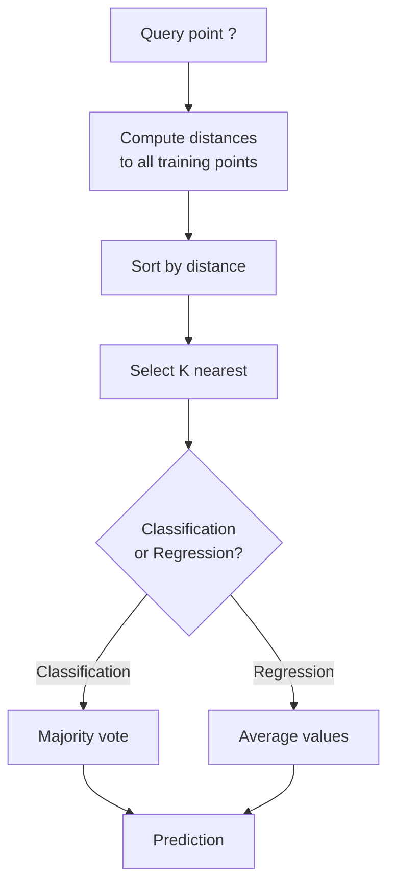
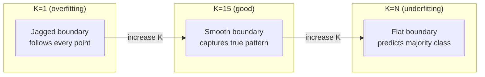
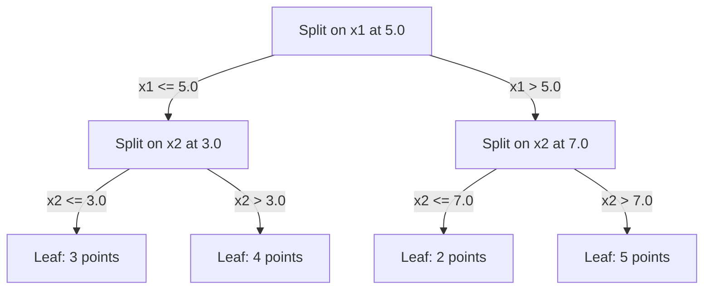

# k-최근접 이웃과 거리 (K-Nearest Neighbors and Distances)

> 모든 것을 저장하라. 이웃을 보고 예측하라. 실제로 동작하는 가장 단순한 알고리즘이다.

**Type:** Build
**Language:** Python
**Prerequisites:** Phase 1 (Lesson 14 Norms and Distances)
**Time:** ~90분

## 학습 목표 (Learning Objectives)

- 설정 가능한 K와 거리 가중 투표(distance-weighted voting)를 갖춘 KNN 분류(classification)와 회귀(regression)를 밑바닥부터 구현하기
- L1, L2, 코사인(cosine), 민코프스키(Minkowski) 거리 지표를 비교하고, 주어진 데이터 유형에 적절한 것을 선택하기
- 차원의 저주(curse of dimensionality)를 설명하고, 왜 KNN이 고차원 공간에서 열화되는지 시연하기
- 효율적인 최근접 이웃 탐색을 위한 KD-트리(KD-tree)를 만들고, 언제 그것이 무차별 대입(brute-force)을 능가하는지 분석하기

## 문제 (The Problem)

데이터셋(dataset)이 하나 있고, 새 데이터 포인트가 도착했다. 이 점을 분류하거나 그 값을 예측해야 한다. 데이터로부터 파라미터(parameter)를 학습(선형 회귀나 SVM처럼)하는 대신, 그저 새 점에 가장 가까운 K개의 학습 점을 찾아 투표하게 한다.

이것이 k-최근접 이웃(K-nearest neighbors, KNN)이다. 학습 단계가 없다. 학습할 파라미터가 없다. 최소화할 손실 함수가 없다. 전체 학습 셋을 저장하고 예측 시점에 거리를 계산한다.

너무 단순해서 동작하지 않을 것 같다. 하지만 KNN은 많은 문제, 특히 작은~중간 크기 데이터셋에서 놀랍도록 경쟁력이 있으며, 이를 깊이 이해하면 근본 개념들이 드러난다. 거리 지표의 선택(Phase 1 Lesson 14와 연결된다), 차원의 저주, 게으른(lazy) 학습과 부지런한(eager) 학습의 차이가 그것이다.

KNN은 또한 현대 AI 어디에나 등장하는데, 단지 이름만 다를 뿐이다. 벡터 데이터베이스는 임베딩(embedding)을 대상으로 KNN 탐색을 한다. 검색 증강 생성(RAG)은 K개의 가장 가까운 문서 청크를 찾는다. 추천 시스템은 비슷한 사용자나 항목을 찾는다. 알고리즘은 같다. 규모와 자료 구조가 다를 뿐이다.

## 개념 (The Concept)

### KNN은 어떻게 동작하는가

레이블(label)이 붙은 점들의 데이터셋과 새 질의 점이 주어졌을 때:

1. 질의에서 데이터셋의 모든 점까지의 거리를 계산한다
2. 거리로 정렬한다
3. 가장 가까운 K개의 점을 취한다
4. 분류의 경우: K개 이웃 사이의 다수결 투표
5. 회귀의 경우: K개 이웃 값의 평균(또는 가중 평균)



이것이 알고리즘 전부다. 적합(fitting)도, 경사 하강법도, 에폭(epoch)도 없다.

### K 선택하기

K는 단 하나의 하이퍼파라미터(hyperparameter)다. 그것은 편향-분산 트레이드오프(trade-off)를 제어한다.

| K | 동작 |
|---|----------|
| K = 1 | 결정 경계(decision boundary)가 모든 점을 따라간다. 학습 오차 0. 높은 분산. 과적합 |
| 작은 K (3-5) | 국소 구조에 민감. 복잡한 경계를 포착할 수 있다 |
| 큰 K | 더 매끄러운 경계. 노이즈에 더 견고. 과소적합할 수 있다 |
| K = N | 모든 점에 대해 다수 클래스를 예측한다. 최대 편향 |

흔한 출발점은 N개 점의 데이터셋에 대해 K = sqrt(N)이다. 동점을 피하기 위해 이진 분류(binary classification)에는 홀수 K를 사용한다.



### 거리 지표

거리 함수는 "가깝다"가 무엇을 의미하는지 정의한다. 서로 다른 지표는 서로 다른 이웃, 서로 다른 예측을 만든다.

**L2 (유클리드, Euclidean)**가 기본값이다. 직선 거리다.

```
d(a, b) = sqrt(sum((a_i - b_i)^2))
```

특성 스케일에 민감하다. KNN과 함께 L2를 쓰기 전에 항상 특성을 표준화하라.

**L1 (맨해튼, Manhattan)**은 절대 차이를 합한다. 차이를 제곱하지 않기 때문에 L2보다 이상치에 더 견고하다.

```
d(a, b) = sum(|a_i - b_i|)
```

**코사인 거리(Cosine distance)**는 크기를 무시하고 벡터 사이의 각도를 측정한다. 텍스트와 임베딩 데이터에 필수적이다.

```
d(a, b) = 1 - (a . b) / (||a|| * ||b||)
```

**민코프스키(Minkowski)**는 파라미터 p로 L1과 L2를 일반화한다.

```
d(a, b) = (sum(|a_i - b_i|^p))^(1/p)

p=1: Manhattan
p=2: Euclidean
p->inf: Chebyshev (max absolute difference)
```

어느 지표를 쓸지는 데이터에 달려 있다.

| 데이터 유형 | 최적 지표 | 이유 |
|-----------|------------|-----|
| 수치 특성, 비슷한 스케일 | L2 (유클리드) | 기본값, 공간 데이터에 동작 |
| 수치 특성, 이상치 | L1 (맨해튼) | 견고, 큰 차이를 증폭하지 않음 |
| 텍스트 임베딩 | 코사인 | 크기는 노이즈, 방향이 의미 |
| 고차원 희소 | 코사인 또는 L1 | L2는 차원의 저주를 겪는다 |
| 혼합 유형 | 커스텀 거리 | 특성 유형별로 지표를 조합 |

### 가중 KNN

표준 KNN은 모든 K개 이웃에 동등한 가중치를 준다. 하지만 거리 0.1에 있는 이웃은 거리 5.0에 있는 이웃보다 더 중요해야 한다.

**거리 가중 KNN(Distance-weighted KNN)**은 각 이웃에 거리의 역으로 가중치를 준다.

```
weight_i = 1 / (distance_i + epsilon)

For classification: weighted vote
For regression:     weighted average = sum(w_i * y_i) / sum(w_i)
```

epsilon은 질의 점이 학습 점과 정확히 일치할 때 0으로 나누는 것을 막는다.

가중 KNN은 먼 이웃이 어차피 거의 기여하지 않기 때문에 K 선택에 덜 민감하다.

### 차원의 저주

KNN 성능은 고차원에서 열화된다. 이것은 막연한 우려가 아니다. 수학적 사실이다.

**문제 1: 거리가 수렴한다.** 차원이 증가함에 따라, 최대 거리 대 최소 거리의 비율이 1에 가까워진다. 모든 점이 질의로부터 똑같이 "멀어진다".

```
In d dimensions, for random uniform points:

d=2:    max_dist / min_dist = varies widely
d=100:  max_dist / min_dist ~ 1.01
d=1000: max_dist / min_dist ~ 1.001

When all distances are nearly equal, "nearest" is meaningless.
```

**문제 2: 부피가 폭발한다.** 데이터의 고정된 비율 안에서 K개 이웃을 포착하려면, 특성 공간의 훨씬 더 큰 부분을 덮도록 탐색 반경을 넓혀야 한다. 고차원에서 "이웃"은 공간의 대부분을 포함한다.

**문제 3: 모서리가 지배한다.** d차원 단위 초입방체(hypercube)에서, 대부분의 부피는 중심이 아니라 모서리 근처에 집중된다. 입방체에 내접한 구는 d가 커질수록 부피의 사라지는 비율만 포함한다.

실용적 결과: KNN은 약 20~50개 특성까지 잘 동작한다. 그 이상에서는 KNN을 적용하기 전에 차원 축소(PCA, UMAP, t-SNE)가 필요하거나, 데이터의 내재적 저차원성을 활용하는 트리 기반 탐색 구조를 써야 한다.

### KD-트리: 빠른 최근접 이웃 탐색

무차별 대입 KNN은 질의에서 모든 학습 점까지의 거리를 계산한다. 그것은 질의당 O(n * d)다. 큰 데이터셋에는 너무 느리다.

KD-트리(KD-tree)는 특성 축을 따라 공간을 재귀적으로 분할한다. 각 레벨에서 중앙값(median)에서 한 차원을 따라 분할한다.



최근접 이웃을 찾으려면 질의를 포함하는 잎(leaf)까지 트리를 순회한 뒤, 역추적하면서 더 가까운 점을 포함할 만한 이웃 분할만 확인한다.

평균 질의 시간: 저차원에서 O(log n). 하지만 KD-트리는 고차원(d > 20)에서 O(n)으로 열화되는데, 역추적이 점점 더 적은 가지를 제거하기 때문이다.

### 볼 트리: 중간 차원에 더 좋음

볼 트리(Ball tree)는 축 정렬 상자 대신 중첩된 초구(hypersphere)로 데이터를 분할한다. 각 노드는 그 서브트리의 모든 점을 포함하는 공(중심 + 반지름)을 정의한다.

KD-트리 대비 장점:
- 중간 차원(~50까지)에서 더 잘 동작
- 축에 정렬되지 않은 구조를 처리
- 더 빡빡한 경계 부피는 탐색 중 더 많은 가지가 가지치기됨을 의미

KD-트리와 볼 트리 모두 정확한 알고리즘이다. 정말로 대규모인 탐색(수백만 점, 수백 차원)에는 근사 최근접 이웃 방법(HNSW, IVF, product quantization)이 대신 쓰인다. 이것들은 Phase 1 Lesson 14에서 다룬다.

### 게으른 학습 vs 부지런한 학습

KNN은 게으른 학습기(lazy learner)다. 학습 시점에는 아무 일도 하지 않고 모든 일을 예측 시점에 한다. 다른 대부분의 알고리즘(선형 회귀, SVM, 신경망)은 부지런한 학습기(eager learner)다. 학습 시점에 무거운 계산을 해서 간결한 모델을 만들고, 그다음 예측이 빠르다.

| 측면 | 게으른 (KNN) | 부지런한 (SVM, 신경망) |
|--------|------------|------------------------|
| 학습 시간 | O(1), 데이터만 저장 | O(n * epochs) |
| 예측 시간 | 질의당 O(n * d) | O(d) 또는 O(parameters) |
| 예측 시 메모리 | 전체 학습 셋 저장 | 모델 파라미터만 저장 |
| 새 데이터 적응 | 즉시 점 추가 | 모델 재학습 |
| 결정 경계 | 암묵적, 즉석에서 계산 | 명시적, 학습 후 고정 |

게으른 학습은 다음일 때 이상적이다.
- 데이터셋이 자주 바뀐다(재학습 없이 점 추가/제거)
- 매우 적은 수의 질의에 대한 예측만 필요하다
- 학습 시간이 0이기를 원한다
- 데이터셋이 무차별 대입 탐색이 빠를 만큼 충분히 작다

### 회귀를 위한 KNN

다수결 투표 대신, 회귀를 위한 KNN은 K개 이웃의 타깃 값들을 평균한다.

```
prediction = (1/K) * sum(y_i for i in K nearest neighbors)

Or with distance weighting:
prediction = sum(w_i * y_i) / sum(w_i)
where w_i = 1 / distance_i
```

KNN 회귀는 구간별 상수(가중 시 구간별 매끄러운) 예측을 만든다. 학습 데이터의 범위를 넘어 외삽(extrapolate)할 수 없다. 학습 타깃이 모두 0과 100 사이라면, KNN은 결코 200을 예측하지 않는다.

## 직접 만들기 (Build It)

### 1단계: 거리 함수

L1, L2, 코사인, 민코프스키 거리를 구현한다. 이것들은 Phase 1 Lesson 14와 직접 연결된다.

```python
import math

def l2_distance(a, b):
    return math.sqrt(sum((ai - bi) ** 2 for ai, bi in zip(a, b)))

def l1_distance(a, b):
    return sum(abs(ai - bi) for ai, bi in zip(a, b))

def cosine_distance(a, b):
    dot_val = sum(ai * bi for ai, bi in zip(a, b))
    norm_a = math.sqrt(sum(ai ** 2 for ai in a))
    norm_b = math.sqrt(sum(bi ** 2 for bi in b))
    if norm_a == 0 or norm_b == 0:
        return 1.0
    return 1.0 - dot_val / (norm_a * norm_b)

def minkowski_distance(a, b, p=2):
    if p == float('inf'):
        return max(abs(ai - bi) for ai, bi in zip(a, b))
    return sum(abs(ai - bi) ** p for ai, bi in zip(a, b)) ** (1 / p)
```

### 2단계: KNN 분류기와 회귀기

설정 가능한 K, 거리 지표, 그리고 선택적 거리 가중을 갖춘 완전한 KNN을 만든다.

```python
class KNN:
    def __init__(self, k=5, distance_fn=l2_distance, weighted=False,
                 task="classification"):
        self.k = k
        self.distance_fn = distance_fn
        self.weighted = weighted
        self.task = task
        self.X_train = None
        self.y_train = None

    def fit(self, X, y):
        self.X_train = X
        self.y_train = y

    def predict(self, X):
        return [self._predict_one(x) for x in X]
```

### 3단계: 효율적 탐색을 위한 KD-트리

각 차원의 중앙값에서 재귀적으로 분할하는 KD-트리를 밑바닥부터 만든다.

```python
class KDTree:
    def __init__(self, X, indices=None, depth=0):
        # Recursively partition the data
        self.axis = depth % len(X[0])
        # Split on median of the current axis
        ...

    def query(self, point, k=1):
        # Traverse to leaf, then backtrack
        ...
```

모든 헬퍼 메서드와 데모를 포함한 완전한 구현은 `code/knn.py`를 보라.

### 4단계: 특성 스케일링

KNN은 거리가 특성 크기에 민감하기 때문에 특성 스케일링이 필요하다. 0에서 1000까지 범위인 특성은 0에서 1까지 범위인 특성을 압도한다.

```python
def standardize(X):
    n = len(X)
    d = len(X[0])
    means = [sum(X[i][j] for i in range(n)) / n for j in range(d)]
    stds = [
        max(1e-10, (sum((X[i][j] - means[j]) ** 2 for i in range(n)) / n) ** 0.5)
        for j in range(d)
    ]
    return [[((X[i][j] - means[j]) / stds[j]) for j in range(d)] for i in range(n)], means, stds
```

## 라이브러리로 써보기 (Use It)

scikit-learn으로:

```python
from sklearn.neighbors import KNeighborsClassifier
from sklearn.preprocessing import StandardScaler
from sklearn.pipeline import Pipeline

clf = Pipeline([
    ("scaler", StandardScaler()),
    ("knn", KNeighborsClassifier(n_neighbors=5, metric="euclidean")),
])
clf.fit(X_train, y_train)
print(f"Accuracy: {clf.score(X_test, y_test):.4f}")
```

scikit-learn은 데이터셋이 충분히 크고 차원이 충분히 낮을 때 KD-트리나 볼 트리를 자동으로 사용한다. 고차원 데이터의 경우 무차별 대입으로 되돌아간다. 이를 `algorithm` 파라미터로 제어할 수 있다.

대규모 최근접 이웃 탐색(수백만 벡터)에는 FAISS, Annoy, 또는 벡터 데이터베이스를 사용하라.

```python
import faiss

index = faiss.IndexFlatL2(dimension)
index.add(embeddings)
distances, indices = index.search(query_vectors, k=5)
```

## 연습 문제 (Exercises)

1. 3개 클래스를 가진 2D 데이터셋에서 KNN 분류를 구현하라. K=1, K=5, K=15, K=N에 대한 결정 경계를 그려라. 과적합에서 과소적합으로의 전이를 관찰하라.

2. 2, 5, 10, 50, 100, 500차원에서 1000개의 무작위 점을 생성하라. 각 차원에 대해, 최대 쌍별 거리 대 최소 쌍별 거리의 비율을 계산하라. 차원의 저주를 시각화하기 위해 비율 대 차원을 그려라.

3. 텍스트 분류 문제(TF-IDF 벡터 사용)에서 KNN에 대해 L1, L2, 코사인 거리를 비교하라. 어느 지표가 최고 정확도를 주는가? 왜 코사인이 텍스트에서 이기는 경향이 있는가?

4. KD-트리를 구현하고, 2D, 10D, 50D에서 1k, 10k, 100k개 점의 데이터셋에 대해 질의 시간을 무차별 대입과 비교하라. 어느 차원에서 KD-트리가 무차별 대입보다 빠르지 않게 되는가?

5. y = sin(x) + noise에 대한 가중 KNN 회귀기를 만들어라. K=3, 10, 30에 대해 가중 없는 KNN과 비교하라. 가중이, 특히 큰 K에 대해, 더 매끄러운 예측을 만듦을 보여라.

## 핵심 용어 (Key Terms)

| 용어 | 실제 의미 |
|------|----------------------|
| k-최근접 이웃(K-nearest neighbors) | 질의에 가장 가까운 K개 학습 점을 찾아 예측하는 비모수(non-parametric) 알고리즘 |
| 게으른 학습(Lazy learning) | 학습 시점에 계산 없음. 모든 일이 예측 시점에 일어난다. KNN이 대표적 예시 |
| 부지런한 학습(Eager learning) | 간결한 모델을 만들기 위해 학습 시점에 무거운 계산. 대부분의 ML 알고리즘이 부지런하다 |
| 차원의 저주(Curse of dimensionality) | 고차원에서 거리가 수렴하고 이웃이 공간 대부분을 덮도록 확장되어, KNN을 무력하게 만드는 것 |
| KD-트리(KD-tree) | 특성 축을 따라 공간을 재귀적으로 분할하는 이진 트리. 저차원에서 O(log n) 질의 |
| 볼 트리(Ball tree) | 중첩된 초구의 트리. 중간 차원(~50까지)에서 KD-트리보다 잘 동작 |
| 가중 KNN(Weighted KNN) | 거리의 역으로 이웃을 가중. 더 가까운 이웃이 예측에 더 큰 영향 |
| 특성 스케일링(Feature scaling) | 특성을 비교 가능한 범위로 정규화. KNN 같은 거리 기반 방법에 필수 |
| 다수결 투표(Majority vote) | K개 이웃 중 어느 클래스가 가장 흔한지 세어 분류하는 것 |
| 무차별 대입 탐색(Brute force search) | 모든 학습 점까지 거리를 계산. 질의당 O(n*d). 정확하지만 큰 n에 대해 느림 |
| 근사 최근접 이웃(Approximate nearest neighbor) | 정확한 탐색보다 훨씬 빠르게 근사적으로 가장 가까운 점을 찾는 알고리즘(HNSW, LSH, IVF) |
| 보로노이 다이어그램(Voronoi diagram) | 각 영역이 다른 어떤 학습 점보다 한 학습 점에 더 가까운 모든 점을 포함하는 공간 분할. K=1 KNN은 보로노이 경계를 만든다 |

## 더 읽을거리 (Further Reading)

- [Cover & Hart: Nearest Neighbor Pattern Classification (1967)](https://ieeexplore.ieee.org/document/1053964) - KNN의 오차율이 베이즈 최적(Bayes optimal)의 최대 두 배임을 증명한 기초 논문
- [Friedman, Bentley, Finkel: An Algorithm for Finding Best Matches in Logarithmic Expected Time (1977)](https://dl.acm.org/doi/10.1145/355744.355745) - 원조 KD-트리 논문
- [Beyer et al.: When Is "Nearest Neighbor" Meaningful? (1999)](https://link.springer.com/chapter/10.1007/3-540-49257-7_15) - 최근접 이웃에 대한 차원의 저주의 형식적 분석
- [scikit-learn Nearest Neighbors documentation](https://scikit-learn.org/stable/modules/neighbors.html) - 알고리즘 선택이 있는 실용 가이드
- [FAISS: A Library for Efficient Similarity Search](https://github.com/facebookresearch/faiss) - 수십억 규모 근사 최근접 이웃 탐색을 위한 Meta의 라이브러리
