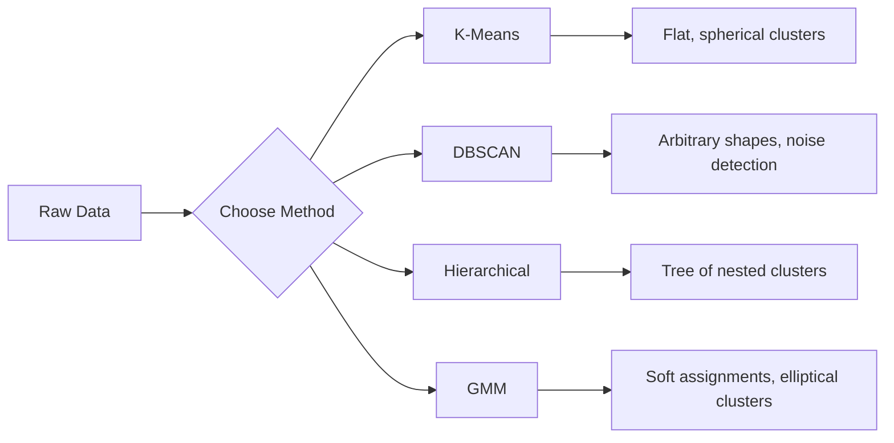

# 비지도 학습 (Unsupervised Learning)

> 레이블도, 교사도 없다. 알고리즘이 스스로 구조를 찾는다.

**Type:** Build
**Languages:** Python
**Prerequisites:** Phase 1 (Norms & Distances, Probability & Distributions), Phase 2 Lessons 1-6
**Time:** ~90분

## 학습 목표 (Learning Objectives)

- K-평균(K-Means), DBSCAN, 가우시안 혼합 모델(Gaussian Mixture Model)을 밑바닥부터 구현하고 그 군집화(clustering) 동작을 비교하기
- 실루엣 점수(silhouette score)와 엘보 방법(elbow method)을 사용해 군집 품질을 평가하고 최적의 K를 선택하기
- 언제 DBSCAN이 K-평균을 능가하는지 설명하고, 어느 알고리즘이 비구형 군집과 이상치를 처리하는지 식별하기
- 정상 패턴에서 벗어나는 점들을 표시하기 위해 군집화 방법을 사용하는 이상 탐지(anomaly detection) 파이프라인(pipeline)을 만들기

## 문제 (The Problem)

지금까지의 모든 ML 레슨은 레이블(label)이 붙은 데이터를 가정했다. "여기 입력이 있고, 여기 올바른 출력이 있다." 현실 세계에서 레이블은 비싸다. 병원에는 수백만 개의 환자 기록이 있지만 누구도 각각에 질병 범주를 수동으로 태깅하지 않았다. 이커머스 사이트에는 수백만 개의 사용자 세션이 있지만 누구도 고객 세그먼트를 손으로 레이블하지 않았다. 보안 팀에는 네트워크 로그가 있지만 누구도 모든 이상을 표시하지 않았다.

비지도 학습(unsupervised learning)은 무엇을 찾으라고 듣지 않고도 패턴을 찾는다. 비슷한 데이터 포인트를 묶고, 숨겨진 구조를 발견하고, 이상치를 드러낸다. 지도 학습(supervised learning)이 정답 키가 있는 교과서로 배우는 것이라면, 비지도 학습은 패턴이 스스로 드러날 때까지 원시 데이터를 응시하는 것이다.

함정: 레이블이 없으면 "맞다" 또는 "틀리다"를 직접 측정할 수 없다. 알고리즘이 찾은 구조가 의미 있는지 평가하려면 다른 도구가 필요하다.

## 개념 (The Concept)

### 군집화: 비슷한 것들을 함께 묶기

군집화(clustering)는 각 데이터 포인트를 그룹(군집, cluster)에 배정하여, 같은 그룹 안의 점들이 다른 그룹의 점들보다 서로 더 비슷하게 만든다. 질문은 언제나 이것이다. "비슷하다"는 무엇을 의미하는가?



### K-평균: 일꾼

K-평균(K-Means)은 데이터를 정확히 K개 군집으로 분할한다. 각 군집은 중심점(centroid, 그 질량 중심)을 가지며, 모든 점은 가장 가까운 중심점에 속한다.

로이드 알고리즘(Lloyd's algorithm):

1. K개의 무작위 점을 초기 중심점으로 고른다
2. 각 데이터 포인트를 가장 가까운 중심점에 배정한다
3. 각 중심점을 배정된 점들의 평균으로 다시 계산한다
4. 배정이 변하지 않을 때까지 2-3단계를 반복한다

목적 함수(관성, inertia)는 각 점에서 배정된 중심점까지의 총 제곱 거리를 측정한다. K-평균은 이를 최소화하지만, 국소 최솟값만 찾는다. 서로 다른 초기화는 서로 다른 결과를 줄 수 있다.

### K 선택하기

두 가지 표준 방법:

**엘보 방법(Elbow method):** K = 1, 2, 3, ..., n에 대해 K-평균을 실행한다. 관성 대 K를 그린다. 군집을 더 추가해도 관성이 더 이상 유의미하게 줄지 않는 "팔꿈치(elbow)"를 찾는다.

**실루엣 점수(Silhouette score):** 각 점에 대해, 자기 군집과 얼마나 비슷한지(a) 대 가장 가까운 다른 군집과 얼마나 비슷한지(b)를 측정한다. 실루엣 계수는 (b - a) / max(a, b)이며, -1(잘못된 군집)부터 +1(잘 군집됨)까지의 범위다. 전역 점수를 위해 모든 점에 걸쳐 평균한다.

### DBSCAN: 밀도 기반 군집화

K-평균은 군집이 구형이라고 가정하고 K를 미리 고르라고 요구한다. DBSCAN은 둘 다 가정하지 않는다. 희소한 영역으로 갈라진 밀집 영역에서 군집을 찾는다.

두 파라미터(parameter):
- **eps**: 이웃의 반경
- **min_samples**: 밀집 영역을 형성하는 데 필요한 최소 점 수

세 가지 유형의 점:
- **핵심 점(Core point)**: eps 거리 안에 적어도 min_samples개의 점을 가진다
- **경계 점(Border point)**: 핵심 점의 eps 안에 있지만 그 자신은 핵심 점이 아니다
- **노이즈 점(Noise point)**: 핵심도 경계도 아니다. 이것들이 이상치다.

DBSCAN은 서로 eps 안에 있는 핵심 점들을 같은 군집으로 연결한다. 경계 점들은 가까운 핵심 점의 군집에 합류한다. 노이즈 점들은 어떤 군집에도 속하지 않는다.

강점: 어떤 모양의 군집이든 찾고, 군집 수를 자동으로 결정하고, 이상치를 식별한다. 약점: 밀도가 다양한 군집에서 고전한다.

### 계층적 군집화

중첩된 군집의 트리(덴드로그램, dendrogram)를 만든다.

병합적(상향식, agglomerative):
1. 각 점을 자기 자신의 군집으로 시작한다
2. 가장 가까운 두 군집을 병합한다
3. 하나의 군집만 남을 때까지 반복한다
4. K개 군집을 얻기 위해 원하는 레벨에서 덴드로그램을 자른다

군집 사이의 "가까움"은 다음으로 측정할 수 있다.
- **단일 연결(Single linkage)**: 두 군집의 임의의 두 점 사이의 최소 거리
- **완전 연결(Complete linkage)**: 임의의 두 점 사이의 최대 거리
- **평균 연결(Average linkage)**: 모든 쌍 사이의 평균 거리
- **워드 방법(Ward's method)**: 총 군집 내 분산의 증가를 가장 작게 만드는 병합

### 가우시안 혼합 모델 (GMM)

K-평균은 하드 배정(hard assignment)을 준다. 각 점이 정확히 한 군집에 속한다. GMM은 소프트 배정(soft assignment)을 준다. 각 점이 각 군집에 속할 확률을 가진다.

GMM은 데이터가 각각 자기 평균과 공분산을 가진 K개 가우시안 분포의 혼합으로부터 생성되었다고 가정한다. 기댓값-최대화(Expectation-Maximization, EM) 알고리즘은 다음을 번갈아 한다.

- **E-단계(E-step)**: 각 점이 각 가우시안에 속할 확률을 계산한다
- **M-단계(M-step)**: 데이터의 우도(likelihood)를 최대화하도록 각 가우시안의 평균, 공분산, 혼합 가중치를 갱신한다

GMM은 (K-평균처럼 구형만이 아니라) 타원형 군집을 모델링할 수 있고 겹치는 군집을 자연스럽게 처리한다.

### 어느 것을 언제 쓸 것인가

| 방법 | 적합한 경우 | 피해야 할 때 |
|--------|----------|------------|
| K-평균 | 큰 데이터셋, 구형 군집, 알려진 K | 불규칙한 모양, 이상치 존재 |
| DBSCAN | 미지의 K, 임의의 모양, 이상치 탐지 | 다양한 밀도, 매우 높은 차원 |
| 계층적 | 작은 데이터셋, 덴드로그램 필요, 미지의 K | 큰 데이터셋(O(n^2) 메모리) |
| GMM | 겹치는 군집, 소프트 배정 필요 | 매우 큰 데이터셋, 너무 많은 차원 |

### 군집화를 사용한 이상 탐지

군집화는 이상 탐지를 자연스럽게 지원한다.
- **K-평균**: 어떤 중심점에서도 먼 점들이 이상치다
- **DBSCAN**: 노이즈 점들이 정의상 이상치다
- **GMM**: 모든 가우시안 아래에서 낮은 확률을 가진 점들이 이상치다

## 직접 만들기 (Build It)

### 1단계: 밑바닥부터 만드는 K-평균

```python
import math
import random


def euclidean_distance(a, b):
    return math.sqrt(sum((ai - bi) ** 2 for ai, bi in zip(a, b)))


def kmeans(data, k, max_iterations=100, seed=42):
    random.seed(seed)
    n_features = len(data[0])

    centroids = random.sample(data, k)

    for iteration in range(max_iterations):
        clusters = [[] for _ in range(k)]
        assignments = []

        for point in data:
            distances = [euclidean_distance(point, c) for c in centroids]
            nearest = distances.index(min(distances))
            clusters[nearest].append(point)
            assignments.append(nearest)

        new_centroids = []
        for cluster in clusters:
            if len(cluster) == 0:
                new_centroids.append(random.choice(data))
                continue
            centroid = [
                sum(point[j] for point in cluster) / len(cluster)
                for j in range(n_features)
            ]
            new_centroids.append(centroid)

        if all(
            euclidean_distance(old, new) < 1e-6
            for old, new in zip(centroids, new_centroids)
        ):
            print(f"  Converged at iteration {iteration + 1}")
            break

        centroids = new_centroids

    return assignments, centroids
```

### 2단계: 엘보 방법과 실루엣 점수

```python
def compute_inertia(data, assignments, centroids):
    total = 0.0
    for point, cluster_id in zip(data, assignments):
        total += euclidean_distance(point, centroids[cluster_id]) ** 2
    return total


def silhouette_score(data, assignments):
    n = len(data)
    if n < 2:
        return 0.0

    clusters = {}
    for i, c in enumerate(assignments):
        clusters.setdefault(c, []).append(i)

    if len(clusters) < 2:
        return 0.0

    scores = []
    for i in range(n):
        own_cluster = assignments[i]
        own_members = [j for j in clusters[own_cluster] if j != i]

        if len(own_members) == 0:
            scores.append(0.0)
            continue

        a = sum(euclidean_distance(data[i], data[j]) for j in own_members) / len(own_members)

        b = float("inf")
        for cluster_id, members in clusters.items():
            if cluster_id == own_cluster:
                continue
            avg_dist = sum(euclidean_distance(data[i], data[j]) for j in members) / len(members)
            b = min(b, avg_dist)

        if max(a, b) == 0:
            scores.append(0.0)
        else:
            scores.append((b - a) / max(a, b))

    return sum(scores) / len(scores)


def find_best_k(data, max_k=10):
    print("Elbow method:")
    inertias = []
    for k in range(1, max_k + 1):
        assignments, centroids = kmeans(data, k)
        inertia = compute_inertia(data, assignments, centroids)
        inertias.append(inertia)
        print(f"  K={k}: inertia={inertia:.2f}")

    print("\nSilhouette scores:")
    for k in range(2, max_k + 1):
        assignments, centroids = kmeans(data, k)
        score = silhouette_score(data, assignments)
        print(f"  K={k}: silhouette={score:.4f}")

    return inertias
```

### 3단계: 밑바닥부터 만드는 DBSCAN

```python
def dbscan(data, eps, min_samples):
    n = len(data)
    labels = [-1] * n
    cluster_id = 0

    def region_query(point_idx):
        neighbors = []
        for i in range(n):
            if euclidean_distance(data[point_idx], data[i]) <= eps:
                neighbors.append(i)
        return neighbors

    visited = [False] * n

    for i in range(n):
        if visited[i]:
            continue
        visited[i] = True

        neighbors = region_query(i)

        if len(neighbors) < min_samples:
            labels[i] = -1
            continue

        labels[i] = cluster_id
        seed_set = list(neighbors)
        seed_set.remove(i)

        j = 0
        while j < len(seed_set):
            q = seed_set[j]

            if not visited[q]:
                visited[q] = True
                q_neighbors = region_query(q)
                if len(q_neighbors) >= min_samples:
                    for nb in q_neighbors:
                        if nb not in seed_set:
                            seed_set.append(nb)

            if labels[q] == -1:
                labels[q] = cluster_id

            j += 1

        cluster_id += 1

    return labels
```

### 4단계: 가우시안 혼합 모델 (EM 알고리즘)

```python
def gmm(data, k, max_iterations=100, seed=42):
    random.seed(seed)
    n = len(data)
    d = len(data[0])

    indices = random.sample(range(n), k)
    means = [list(data[i]) for i in indices]
    variances = [1.0] * k
    weights = [1.0 / k] * k

    def gaussian_pdf(x, mean, variance):
        d = len(x)
        coeff = 1.0 / ((2 * math.pi * variance) ** (d / 2))
        exponent = -sum((xi - mi) ** 2 for xi, mi in zip(x, mean)) / (2 * variance)
        return coeff * math.exp(max(exponent, -500))

    for iteration in range(max_iterations):
        responsibilities = []
        for i in range(n):
            probs = []
            for j in range(k):
                probs.append(weights[j] * gaussian_pdf(data[i], means[j], variances[j]))
            total = sum(probs)
            if total == 0:
                total = 1e-300
            responsibilities.append([p / total for p in probs])

        old_means = [list(m) for m in means]

        for j in range(k):
            r_sum = sum(responsibilities[i][j] for i in range(n))
            if r_sum < 1e-10:
                continue

            weights[j] = r_sum / n

            for dim in range(d):
                means[j][dim] = sum(
                    responsibilities[i][j] * data[i][dim] for i in range(n)
                ) / r_sum

            variances[j] = sum(
                responsibilities[i][j]
                * sum((data[i][dim] - means[j][dim]) ** 2 for dim in range(d))
                for i in range(n)
            ) / (r_sum * d)
            variances[j] = max(variances[j], 1e-6)

        shift = sum(
            euclidean_distance(old_means[j], means[j]) for j in range(k)
        )
        if shift < 1e-6:
            print(f"  GMM converged at iteration {iteration + 1}")
            break

    assignments = []
    for i in range(n):
        assignments.append(responsibilities[i].index(max(responsibilities[i])))

    return assignments, means, weights, responsibilities
```

### 5단계: 테스트 데이터 생성 및 모두 실행

```python
def make_blobs(centers, n_per_cluster=50, spread=0.5, seed=42):
    random.seed(seed)
    data = []
    true_labels = []
    for label, (cx, cy) in enumerate(centers):
        for _ in range(n_per_cluster):
            x = cx + random.gauss(0, spread)
            y = cy + random.gauss(0, spread)
            data.append([x, y])
            true_labels.append(label)
    return data, true_labels


def make_moons(n_samples=200, noise=0.1, seed=42):
    random.seed(seed)
    data = []
    labels = []
    n_half = n_samples // 2
    for i in range(n_half):
        angle = math.pi * i / n_half
        x = math.cos(angle) + random.gauss(0, noise)
        y = math.sin(angle) + random.gauss(0, noise)
        data.append([x, y])
        labels.append(0)
    for i in range(n_half):
        angle = math.pi * i / n_half
        x = 1 - math.cos(angle) + random.gauss(0, noise)
        y = 1 - math.sin(angle) - 0.5 + random.gauss(0, noise)
        data.append([x, y])
        labels.append(1)
    return data, labels


if __name__ == "__main__":
    centers = [[2, 2], [8, 3], [5, 8]]
    data, true_labels = make_blobs(centers, n_per_cluster=50, spread=0.8)

    print("=== K-Means on 3 blobs ===")
    assignments, centroids = kmeans(data, k=3)
    print(f"  Centroids: {[[round(c, 2) for c in cent] for cent in centroids]}")
    sil = silhouette_score(data, assignments)
    print(f"  Silhouette score: {sil:.4f}")

    print("\n=== Elbow Method ===")
    find_best_k(data, max_k=6)

    print("\n=== DBSCAN on 3 blobs ===")
    db_labels = dbscan(data, eps=1.5, min_samples=5)
    n_clusters = len(set(db_labels) - {-1})
    n_noise = db_labels.count(-1)
    print(f"  Found {n_clusters} clusters, {n_noise} noise points")

    print("\n=== GMM on 3 blobs ===")
    gmm_assignments, gmm_means, gmm_weights, _ = gmm(data, k=3)
    print(f"  Means: {[[round(m, 2) for m in mean] for mean in gmm_means]}")
    print(f"  Weights: {[round(w, 3) for w in gmm_weights]}")
    gmm_sil = silhouette_score(data, gmm_assignments)
    print(f"  Silhouette score: {gmm_sil:.4f}")

    print("\n=== DBSCAN on moons (non-spherical clusters) ===")
    moon_data, moon_labels = make_moons(n_samples=200, noise=0.1)
    moon_db = dbscan(moon_data, eps=0.3, min_samples=5)
    n_moon_clusters = len(set(moon_db) - {-1})
    n_moon_noise = moon_db.count(-1)
    print(f"  Found {n_moon_clusters} clusters, {n_moon_noise} noise points")

    print("\n=== K-Means on moons (will fail to separate) ===")
    moon_km, moon_centroids = kmeans(moon_data, k=2)
    moon_sil = silhouette_score(moon_data, moon_km)
    print(f"  Silhouette score: {moon_sil:.4f}")
    print("  K-Means splits moons poorly because they are not spherical")

    print("\n=== Anomaly detection with DBSCAN ===")
    anomaly_data = list(data)
    anomaly_data.append([20.0, 20.0])
    anomaly_data.append([-5.0, -5.0])
    anomaly_data.append([15.0, 0.0])
    anomaly_labels = dbscan(anomaly_data, eps=1.5, min_samples=5)
    anomalies = [
        anomaly_data[i]
        for i in range(len(anomaly_labels))
        if anomaly_labels[i] == -1
    ]
    print(f"  Detected {len(anomalies)} anomalies")
    for a in anomalies[-3:]:
        print(f"    Point {[round(v, 2) for v in a]}")
```

## 라이브러리로 써보기 (Use It)

scikit-learn에서는 같은 알고리즘들이 한 줄이면 끝난다.

```python
from sklearn.cluster import KMeans, DBSCAN, AgglomerativeClustering
from sklearn.mixture import GaussianMixture
from sklearn.metrics import silhouette_score as sklearn_silhouette

km = KMeans(n_clusters=3, random_state=42).fit(data)
db = DBSCAN(eps=1.5, min_samples=5).fit(data)
agg = AgglomerativeClustering(n_clusters=3).fit(data)
gmm_model = GaussianMixture(n_components=3, random_state=42).fit(data)
```

밑바닥 버전들은 이 라이브러리들이 정확히 무엇을 계산하는지 보여준다. K-평균은 배정과 재계산 사이를 반복한다. DBSCAN은 밀집 씨앗(seed)에서 군집을 키운다. GMM은 기댓값과 최대화 사이를 번갈아 한다. 라이브러리 버전은 수치 안정성, 더 똑똑한 초기화(K-Means++), GPU 가속을 더하지만 핵심 로직은 같다.

## 산출물 (Ship It)

이 레슨은 밑바닥부터 만든 K-평균, DBSCAN, GMM의 동작하는 구현을 만들어낸다. 이 군집화 코드는 더 고급 비지도 방법의 토대로 재사용할 수 있다.

## 연습 문제 (Exercises)

1. K-Means++ 초기화를 구현하라. 무작위 중심점을 고르는 대신, 첫 번째는 무작위로 고르고 이후 각 중심점은 가장 가까운 기존 중심점으로부터의 제곱 거리에 비례하는 확률로 고른다. 무작위 초기화와 수렴 속도를 비교하라.
2. 코드에 계층적 병합 군집화를 추가하라. 워드 연결(Ward's linkage)을 구현하고 덴드로그램(병합의 중첩 리스트로서)을 만들어라. 다른 레벨에서 자르고 K-평균 결과와 비교하라.
3. 간단한 이상 탐지 파이프라인을 만들어라. 같은 데이터에서 DBSCAN과 GMM을 실행하고, 두 방법이 모두 이상치라고 동의하는 점들(DBSCAN의 노이즈, GMM의 낮은 확률)을 표시하라. 겹침을 측정하고 두 방법이 언제 의견이 다른지 논의하라.

## 핵심 용어 (Key Terms)

| 용어 | 흔히 하는 말 | 실제 의미 |
|------|----------------|----------------------|
| 군집화(Clustering) | "비슷한 것들을 묶기" | 특정 거리 지표로 측정했을 때 그룹 내 유사도가 그룹 간 유사도를 초과하는 부분집합으로 데이터를 분할하는 것 |
| 중심점(Centroid) | "군집의 중심" | 한 군집에 배정된 모든 점의 평균. K-평균이 군집 대표로 사용 |
| 관성(Inertia) | "군집이 얼마나 빡빡한가" | 각 점에서 배정된 중심점까지의 제곱 거리 합. 낮을수록 빡빡하다 |
| 실루엣 점수(Silhouette score) | "군집이 얼마나 잘 분리되어 있는가" | 각 점에 대해 (b - a) / max(a, b), 여기서 a는 평균 군집 내 거리, b는 평균 최근접 군집 거리 |
| 핵심 점(Core point) | "밀집 영역의 점" | DBSCAN에서 eps 거리 안에 적어도 min_samples개의 이웃을 가진 점 |
| EM 알고리즘(EM algorithm) | "소프트 K-평균" | 기댓값-최대화: 멤버십 확률을 반복적으로 계산(E-단계)하고 분포 파라미터를 갱신(M-단계)하는 것 |
| 덴드로그램(Dendrogram) | "군집의 트리" | 계층적 군집화에서 군집이 병합된 순서와 거리를 보여주는 트리 다이어그램 |
| 이상(Anomaly) | "이상치" | 기대된 패턴에 부합하지 않는 데이터 포인트. DBSCAN이 노이즈로, 또는 GMM이 낮은 확률로 식별 |

## 더 읽을거리 (Further Reading)

- [Stanford CS229 - Unsupervised Learning](https://cs229.stanford.edu/notes2022fall/main_notes.pdf) - 군집화와 EM에 대한 Andrew Ng의 강의 노트
- [scikit-learn Clustering Guide](https://scikit-learn.org/stable/modules/clustering.html) - 모든 군집화 알고리즘의 실용적 비교와 시각적 예시
- [DBSCAN original paper (Ester et al., 1996)](https://www.aaai.org/Papers/KDD/1996/KDD96-037.pdf) - 밀도 기반 군집화를 도입한 논문
