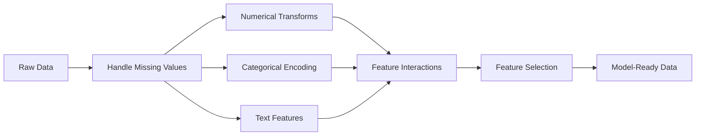

# 특성 공학과 선택 (Feature Engineering & Selection)

> 좋은 특성 하나는 데이터 포인트 천 개의 값어치가 있다.

**Type:** Build
**Languages:** Python
**Prerequisites:** Phase 1 (Statistics for ML, Linear Algebra), Phase 2 Lessons 1-7
**Time:** ~90분

## 학습 목표 (Learning Objectives)

- 수치 변환(표준화, 최소-최대 스케일링, 로그 변환, 비닝)을 구현하고, 각각이 언제 적절한지 설명하기
- 범주형 특성에 대한 원-핫(one-hot), 레이블(label), 타깃(target) 인코딩을 만들고, 타깃 인코딩의 데이터 누출(data leakage) 위험을 식별하기
- TF-IDF 벡터라이저(vectorizer)를 밑바닥부터 구성하고, 왜 그것이 텍스트 분류에서 원시 단어 빈도를 능가하는지 설명하기
- 필터 기반 특성 선택(분산 임계값, 상관, 상호 정보량)을 적용하여 차원을 줄이기

## 문제 (The Problem)

데이터셋(dataset)이 있다. 알고리즘을 고른다. 학습시킨다. 결과가 평범하다. 더 화려한 알고리즘을 시도한다. 여전히 평범하다. 하이퍼파라미터(hyperparameter) 튜닝에 일주일을 쓴다. 미미한 개선이다.

그러다 누군가가 원시 데이터를 더 나은 특성(feature)으로 변환하면, 단순한 로지스틱 회귀(logistic regression)가 공들여 튜닝한 그래디언트 부스티드 앙상블을 이긴다.

이런 일은 끊임없이 일어난다. 고전적 ML에서는, 데이터의 표현(representation)이 알고리즘의 선택보다 더 중요하다. "면적"과 "침실 수"를 가진 주택 가격 모델은, 학습기가 아무리 정교해도 "주소를 원시 문자열로" 가진 모델을 이긴다. 알고리즘은 주어진 것으로만 작업한다.

특성 공학(feature engineering)은 원시 데이터를, 모델이 패턴을 더 쉽게 찾을 수 있는 표현으로 변환하는 과정이다. 특성 선택(feature selection)은 신호를 더하지 않고 노이즈만 더하는 특성을 버리는 과정이다. 둘을 합치면, 고전적 ML에서 가장 레버리지가 높은 활동이다.

## 개념 (The Concept)

### 특성 파이프라인



### 수치 특성

원시 숫자는 모델에 바로 쓸 준비가 된 경우가 드물다. 흔한 변환:

**스케일링(Scaling):** 거리 기반 알고리즘(K-평균, KNN, SVM)이 모든 특성을 동등하게 다루도록, 특성을 같은 범위에 둔다. 최소-최대 스케일링은 [0, 1]로 매핑한다. 표준화(z-점수)는 평균=0, 표준편차=1로 매핑한다.

**로그 변환(Log transform):** 오른쪽으로 치우친 분포(소득, 인구, 단어 빈도)를 압축한다. 곱셈적 관계를 덧셈적 관계로 바꾼다.

**비닝(Binning):** 연속 값을 범주로 변환한다. 특성과 타깃 사이의 관계가 비선형이지만 계단식일 때 유용하다(예: 연령 그룹).

**다항 특성(Polynomial features):** x^2, x^3, x1*x2 항을 만든다. 더 많은 특성을 대가로 선형 모델이 비선형 관계를 포착하게 한다.

### 범주형 특성

모델은 숫자가 필요하다. 범주는 인코딩이 필요하다.

**원-핫 인코딩(One-hot encoding):** 각 범주에 대해 이진 컬럼을 만든다. "color = red/blue/green"은 is_red, is_blue, is_green 세 컬럼이 된다. 카디널리티가 낮은 특성에 잘 동작하지만, 범주가 많으면 폭발한다.

**레이블 인코딩(Label encoding):** 각 범주를 정수로 매핑한다: red=0, blue=1, green=2. 거짓 순서를 도입한다(모델이 green > blue > red라고 생각할 수 있다). 개별 값으로 분할하는 트리 기반 모델에만 적절하다.

**타깃 인코딩(Target encoding):** 각 범주를 그 범주에 대한 타깃 변수의 평균으로 대체한다. 강력하지만 위험하다. 데이터 누출(data leakage)의 위험이 높다. 학습 데이터에서만 계산하고 테스트 데이터에 적용해야 한다.

### 텍스트 특성

**카운트 벡터라이저(Count vectorizer):** 각 단어가 문서에 몇 번 나타나는지 센다. "the cat sat on the mat"은 {the: 2, cat: 1, sat: 1, on: 1, mat: 1}이 된다.

**TF-IDF:** 단어 빈도-역문서 빈도(Term Frequency-Inverse Document Frequency). 단어를 문서 전체에 걸쳐 얼마나 고유한지로 가중한다. "the" 같은 흔한 단어는 낮은 가중치를 받는다. 드물고 독특한 단어는 높은 가중치를 받는다.

```
TF(word, doc) = count(word in doc) / total words in doc
IDF(word) = log(total docs / docs containing word)
TF-IDF = TF * IDF
```

### 결측값

실제 데이터에는 구멍이 있다. 전략:

- **행 삭제:** 결측 데이터가 드물고 무작위일 때만
- **평균/중앙값 대치(imputation):** 단순하고, 분포 모양을 보존한다(중앙값이 이상치에 더 견고하다)
- **최빈값 대치:** 범주형 특성에
- **지시 컬럼(Indicator column):** 대치하기 전에 "이것이 결측이었나"라는 이진 컬럼을 추가한다. 데이터가 결측이라는 사실 자체가 정보가 될 수 있다
- **전방/후방 채우기(Forward/backward fill):** 시계열 데이터에

### 특성 상호작용

때로는 관계가 조합 안에 있다. "키"와 "몸무게"만으로는 "BMI = weight / height^2"보다 덜 예측적이다. 특성 상호작용은 특성 공간을 곱하므로, 올바른 것을 고르려면 도메인 지식을 사용하라.

### 특성 선택

특성이 많을수록 항상 좋은 것은 아니다. 무관한 특성은 노이즈를 더하고, 학습 시간을 늘리고, 과적합(overfitting)을 일으킬 수 있다.

**필터 방법(모델 이전):**
- 상관(Correlation): 서로 높게 상관된 특성을 제거한다(중복)
- 상호 정보량(Mutual information): 특성을 아는 것이 타깃에 대한 불확실성을 얼마나 줄이는지 측정한다
- 분산 임계값(Variance threshold): 거의 변하지 않는 특성을 제거한다

**래퍼 방법(모델 기반):**
- L1 정규화(Lasso): 무관한 특성 가중치를 정확히 0으로 몰아간다
- 재귀적 특성 제거(Recursive feature elimination): 학습하고, 가장 덜 중요한 특성을 제거하고, 반복한다

**왜 선택이 중요한가:** 10개의 좋은 특성을 가진 모델은 보통 10개의 좋은 특성과 90개의 노이즈 특성을 가진 모델을 능가한다. 노이즈 특성은 일반화되지 않는 학습 데이터 패턴에 모델이 과적합할 기회를 준다.

## 직접 만들기 (Build It)

### 1단계: 밑바닥부터 만드는 수치 변환

```python
import math


def min_max_scale(values):
    min_val = min(values)
    max_val = max(values)
    if max_val == min_val:
        return [0.0] * len(values)
    return [(v - min_val) / (max_val - min_val) for v in values]


def standardize(values):
    n = len(values)
    mean = sum(values) / n
    variance = sum((v - mean) ** 2 for v in values) / n
    std = math.sqrt(variance) if variance > 0 else 1.0
    return [(v - mean) / std for v in values]


def log_transform(values):
    return [math.log(v + 1) for v in values]


def bin_values(values, n_bins=5):
    min_val = min(values)
    max_val = max(values)
    bin_width = (max_val - min_val) / n_bins
    if bin_width == 0:
        return [0] * len(values)
    result = []
    for v in values:
        bin_idx = int((v - min_val) / bin_width)
        bin_idx = min(bin_idx, n_bins - 1)
        result.append(bin_idx)
    return result


def polynomial_features(row, degree=2):
    n = len(row)
    result = list(row)
    if degree >= 2:
        for i in range(n):
            result.append(row[i] ** 2)
        for i in range(n):
            for j in range(i + 1, n):
                result.append(row[i] * row[j])
    return result
```

### 2단계: 밑바닥부터 만드는 범주형 인코딩

```python
def one_hot_encode(values):
    categories = sorted(set(values))
    cat_to_idx = {cat: i for i, cat in enumerate(categories)}
    n_cats = len(categories)

    encoded = []
    for v in values:
        row = [0] * n_cats
        row[cat_to_idx[v]] = 1
        encoded.append(row)

    return encoded, categories


def label_encode(values):
    categories = sorted(set(values))
    cat_to_int = {cat: i for i, cat in enumerate(categories)}
    return [cat_to_int[v] for v in values], cat_to_int


def target_encode(feature_values, target_values, smoothing=10):
    global_mean = sum(target_values) / len(target_values)

    category_stats = {}
    for feat, target in zip(feature_values, target_values):
        if feat not in category_stats:
            category_stats[feat] = {"sum": 0.0, "count": 0}
        category_stats[feat]["sum"] += target
        category_stats[feat]["count"] += 1

    encoding = {}
    for cat, stats in category_stats.items():
        cat_mean = stats["sum"] / stats["count"]
        weight = stats["count"] / (stats["count"] + smoothing)
        encoding[cat] = weight * cat_mean + (1 - weight) * global_mean

    return [encoding[v] for v in feature_values], encoding
```

### 3단계: 밑바닥부터 만드는 텍스트 특성

```python
def count_vectorize(documents):
    vocab = {}
    idx = 0
    for doc in documents:
        for word in doc.lower().split():
            if word not in vocab:
                vocab[word] = idx
                idx += 1

    vectors = []
    for doc in documents:
        vec = [0] * len(vocab)
        for word in doc.lower().split():
            vec[vocab[word]] += 1
        vectors.append(vec)

    return vectors, vocab


def tfidf(documents):
    n_docs = len(documents)

    vocab = {}
    idx = 0
    for doc in documents:
        for word in doc.lower().split():
            if word not in vocab:
                vocab[word] = idx
                idx += 1

    doc_freq = {}
    for doc in documents:
        seen = set()
        for word in doc.lower().split():
            if word not in seen:
                doc_freq[word] = doc_freq.get(word, 0) + 1
                seen.add(word)

    vectors = []
    for doc in documents:
        words = doc.lower().split()
        word_count = len(words)
        tf_map = {}
        for word in words:
            tf_map[word] = tf_map.get(word, 0) + 1

        vec = [0.0] * len(vocab)
        for word, count in tf_map.items():
            tf = count / word_count
            idf = math.log(n_docs / doc_freq[word])
            vec[vocab[word]] = tf * idf
        vectors.append(vec)

    return vectors, vocab
```

### 4단계: 밑바닥부터 만드는 결측값 대치

```python
def impute_mean(values):
    present = [v for v in values if v is not None]
    if not present:
        return [0.0] * len(values), 0.0
    mean = sum(present) / len(present)
    return [v if v is not None else mean for v in values], mean


def impute_median(values):
    present = sorted(v for v in values if v is not None)
    if not present:
        return [0.0] * len(values), 0.0
    n = len(present)
    if n % 2 == 0:
        median = (present[n // 2 - 1] + present[n // 2]) / 2
    else:
        median = present[n // 2]
    return [v if v is not None else median for v in values], median


def impute_mode(values):
    present = [v for v in values if v is not None]
    if not present:
        return values, None
    counts = {}
    for v in present:
        counts[v] = counts.get(v, 0) + 1
    mode = max(counts, key=counts.get)
    return [v if v is not None else mode for v in values], mode


def add_missing_indicator(values):
    return [0 if v is not None else 1 for v in values]
```

### 5단계: 밑바닥부터 만드는 특성 선택

```python
def correlation(x, y):
    n = len(x)
    mean_x = sum(x) / n
    mean_y = sum(y) / n
    cov = sum((xi - mean_x) * (yi - mean_y) for xi, yi in zip(x, y)) / n
    std_x = math.sqrt(sum((xi - mean_x) ** 2 for xi in x) / n)
    std_y = math.sqrt(sum((yi - mean_y) ** 2 for yi in y) / n)
    if std_x == 0 or std_y == 0:
        return 0.0
    return cov / (std_x * std_y)


def mutual_information(feature, target, n_bins=10):
    feat_min = min(feature)
    feat_max = max(feature)
    bin_width = (feat_max - feat_min) / n_bins if feat_max != feat_min else 1.0
    feat_binned = [
        min(int((f - feat_min) / bin_width), n_bins - 1) for f in feature
    ]

    n = len(feature)
    target_classes = sorted(set(target))

    feat_bins = sorted(set(feat_binned))
    p_feat = {}
    for b in feat_bins:
        p_feat[b] = feat_binned.count(b) / n

    p_target = {}
    for t in target_classes:
        p_target[t] = target.count(t) / n

    mi = 0.0
    for b in feat_bins:
        for t in target_classes:
            joint_count = sum(
                1 for fb, tv in zip(feat_binned, target) if fb == b and tv == t
            )
            p_joint = joint_count / n
            if p_joint > 0:
                mi += p_joint * math.log(p_joint / (p_feat[b] * p_target[t]))

    return mi


def variance_threshold(features, threshold=0.01):
    n_features = len(features[0])
    n_samples = len(features)
    selected = []

    for j in range(n_features):
        col = [features[i][j] for i in range(n_samples)]
        mean = sum(col) / n_samples
        var = sum((v - mean) ** 2 for v in col) / n_samples
        if var >= threshold:
            selected.append(j)

    return selected


def remove_correlated(features, threshold=0.9):
    n_features = len(features[0])
    n_samples = len(features)

    to_remove = set()
    for i in range(n_features):
        if i in to_remove:
            continue
        col_i = [features[r][i] for r in range(n_samples)]
        for j in range(i + 1, n_features):
            if j in to_remove:
                continue
            col_j = [features[r][j] for r in range(n_samples)]
            corr = abs(correlation(col_i, col_j))
            if corr >= threshold:
                to_remove.add(j)

    return [i for i in range(n_features) if i not in to_remove]
```

### 6단계: 전체 파이프라인과 데모

```python
import random


def make_housing_data(n=200, seed=42):
    random.seed(seed)
    data = []
    for _ in range(n):
        sqft = random.uniform(500, 5000)
        bedrooms = random.choice([1, 2, 3, 4, 5])
        age = random.uniform(0, 50)
        neighborhood = random.choice(["downtown", "suburbs", "rural"])
        has_pool = random.choice([True, False])

        sqft_with_missing = sqft if random.random() > 0.05 else None
        age_with_missing = age if random.random() > 0.08 else None

        price = (
            50 * sqft
            + 20000 * bedrooms
            - 1000 * age
            + (50000 if neighborhood == "downtown" else 10000 if neighborhood == "suburbs" else 0)
            + (15000 if has_pool else 0)
            + random.gauss(0, 20000)
        )

        data.append({
            "sqft": sqft_with_missing,
            "bedrooms": bedrooms,
            "age": age_with_missing,
            "neighborhood": neighborhood,
            "has_pool": has_pool,
            "price": price,
        })
    return data


if __name__ == "__main__":
    data = make_housing_data(200)

    print("=== Raw Data Sample ===")
    for row in data[:3]:
        print(f"  {row}")

    sqft_raw = [d["sqft"] for d in data]
    age_raw = [d["age"] for d in data]
    prices = [d["price"] for d in data]

    print("\n=== Missing Value Handling ===")
    sqft_missing = sum(1 for v in sqft_raw if v is None)
    age_missing = sum(1 for v in age_raw if v is None)
    print(f"  sqft missing: {sqft_missing}/{len(sqft_raw)}")
    print(f"  age missing: {age_missing}/{len(age_raw)}")

    sqft_indicator = add_missing_indicator(sqft_raw)
    age_indicator = add_missing_indicator(age_raw)
    sqft_imputed, sqft_fill = impute_median(sqft_raw)
    age_imputed, age_fill = impute_mean(age_raw)
    print(f"  sqft filled with median: {sqft_fill:.0f}")
    print(f"  age filled with mean: {age_fill:.1f}")

    print("\n=== Numerical Transforms ===")
    sqft_scaled = standardize(sqft_imputed)
    age_scaled = min_max_scale(age_imputed)
    sqft_log = log_transform(sqft_imputed)
    age_binned = bin_values(age_imputed, n_bins=5)
    print(f"  sqft standardized: mean={sum(sqft_scaled)/len(sqft_scaled):.4f}, std={math.sqrt(sum(v**2 for v in sqft_scaled)/len(sqft_scaled)):.4f}")
    print(f"  age min-max: [{min(age_scaled):.2f}, {max(age_scaled):.2f}]")
    print(f"  age bins: {sorted(set(age_binned))}")

    print("\n=== Categorical Encoding ===")
    neighborhoods = [d["neighborhood"] for d in data]

    ohe, ohe_cats = one_hot_encode(neighborhoods)
    print(f"  One-hot categories: {ohe_cats}")
    print(f"  Sample encoding: {neighborhoods[0]} -> {ohe[0]}")

    le, le_map = label_encode(neighborhoods)
    print(f"  Label encoding map: {le_map}")

    te, te_map = target_encode(neighborhoods, prices, smoothing=10)
    print(f"  Target encoding: {({k: round(v) for k, v in te_map.items()})}")

    print("\n=== Text Features ===")
    descriptions = [
        "large modern house with pool",
        "small cozy cottage near downtown",
        "spacious family home with large yard",
        "modern apartment downtown with view",
        "rustic cabin in rural area",
    ]
    cv, cv_vocab = count_vectorize(descriptions)
    print(f"  Vocabulary size: {len(cv_vocab)}")
    print(f"  Doc 0 non-zero features: {sum(1 for v in cv[0] if v > 0)}")

    tf, tf_vocab = tfidf(descriptions)
    print(f"  TF-IDF vocabulary size: {len(tf_vocab)}")
    top_words = sorted(tf_vocab.keys(), key=lambda w: tf[0][tf_vocab[w]], reverse=True)[:3]
    print(f"  Doc 0 top TF-IDF words: {top_words}")

    print("\n=== Polynomial Features ===")
    sample_row = [sqft_scaled[0], age_scaled[0]]
    poly = polynomial_features(sample_row, degree=2)
    print(f"  Input: {[round(v, 4) for v in sample_row]}")
    print(f"  Polynomial: {[round(v, 4) for v in poly]}")
    print(f"  Features: [x1, x2, x1^2, x2^2, x1*x2]")

    print("\n=== Feature Selection ===")
    feature_matrix = [
        [sqft_scaled[i], age_scaled[i], float(sqft_indicator[i]), float(age_indicator[i])]
        + ohe[i]
        for i in range(len(data))
    ]

    print(f"  Total features: {len(feature_matrix[0])}")

    surviving_var = variance_threshold(feature_matrix, threshold=0.01)
    print(f"  After variance threshold (0.01): {len(surviving_var)} features kept")

    surviving_corr = remove_correlated(feature_matrix, threshold=0.9)
    print(f"  After correlation filter (0.9): {len(surviving_corr)} features kept")

    binary_prices = [1 if p > sum(prices) / len(prices) else 0 for p in prices]
    print("\n  Mutual information with target:")
    feature_names = ["sqft", "age", "sqft_missing", "age_missing"] + [f"neigh_{c}" for c in ohe_cats]
    for j in range(len(feature_matrix[0])):
        col = [feature_matrix[i][j] for i in range(len(feature_matrix))]
        mi = mutual_information(col, binary_prices, n_bins=10)
        print(f"    {feature_names[j]}: MI={mi:.4f}")

    print("\n  Correlation with price:")
    for j in range(len(feature_matrix[0])):
        col = [feature_matrix[i][j] for i in range(len(feature_matrix))]
        corr = correlation(col, prices)
        print(f"    {feature_names[j]}: r={corr:.4f}")
```

## 라이브러리로 써보기 (Use It)

scikit-learn으로는, 이 변환들이 합성 가능한 파이프라인이다.

```python
from sklearn.preprocessing import StandardScaler, OneHotEncoder, PolynomialFeatures
from sklearn.impute import SimpleImputer
from sklearn.feature_extraction.text import TfidfVectorizer
from sklearn.feature_selection import mutual_info_classif, VarianceThreshold
from sklearn.compose import ColumnTransformer
from sklearn.pipeline import Pipeline

numeric_pipe = Pipeline([
    ("imputer", SimpleImputer(strategy="median")),
    ("scaler", StandardScaler()),
])

categorical_pipe = Pipeline([
    ("encoder", OneHotEncoder(sparse_output=False)),
])

preprocessor = ColumnTransformer([
    ("num", numeric_pipe, ["sqft", "age"]),
    ("cat", categorical_pipe, ["neighborhood"]),
])
```

밑바닥 버전들은 각 변환 내부에서 정확히 무슨 일이 일어나는지 보여준다. 라이브러리 버전은 엣지 케이스 처리, 희소 행렬(sparse matrix) 지원, 파이프라인 합성을 더하지만, 수학은 같다.

## 산출물 (Ship It)

이 레슨이 만들어내는 것:
- `outputs/prompt-feature-engineer.md` - 원시 데이터로부터 특성을 체계적으로 공학하기 위한 프롬프트(prompt)

## 연습 문제 (Exercises)

1. 수치 변환에 견고한 스케일링(평균과 표준편차 대신 중앙값과 사분위 범위를 사용)을 추가하라. 극단적 이상치가 있는 데이터에서 표준 스케일링과 비교하라.
2. 리브-원-아웃(leave-one-out) 타깃 인코딩을 구현하라. 각 행에 대해, 그 행 자신의 타깃 값을 제외하고 타깃 평균을 계산한다. 이것이 순진한 타깃 인코딩에 비해 과적합을 어떻게 줄이는지 보여라.
3. 분산 임계값, 상관 필터링, 상호 정보량 순위를 결합한 자동 특성 선택 파이프라인을 만들어라. 주택 데이터셋에 적용하고, 모든 특성을 쓸 때와 선택된 특성을 쓸 때의 모델 성능(단순 선형 회귀 사용)을 비교하라.

## 핵심 용어 (Key Terms)

| 용어 | 흔히 하는 말 | 실제 의미 |
|------|----------------|----------------------|
| 특성 공학(Feature engineering) | "새 컬럼을 만들기" | 원시 데이터를, 모델에 패턴을 드러내는 표현으로 변환하는 것 |
| 표준화(Standardization) | "정규로 만들기" | 평균을 빼고 표준편차로 나눠 특성이 평균=0, 표준편차=1이 되게 하는 것 |
| 원-핫 인코딩(One-hot encoding) | "더미 변수 만들기" | 범주마다 이진 컬럼 하나를 만들되, 각 행에서 정확히 한 컬럼이 1인 것 |
| 타깃 인코딩(Target encoding) | "정답을 써서 인코딩하기" | 각 범주를 그 범주의 평균 타깃 값으로 대체하되, 과적합을 막기 위해 스무딩(smoothing)을 적용하는 것 |
| TF-IDF | "화려한 단어 빈도" | 단어 빈도 곱하기 역문서 빈도: 코퍼스 전체에서 얼마나 독특한지로 가중된 단어 |
| 대치(Imputation) | "빈칸 채우기" | 결측값을 추정값(평균, 중앙값, 최빈값, 또는 모델 예측값)으로 대체하는 것 |
| 특성 선택(Feature selection) | "나쁜 컬럼 버리기" | 노이즈나 중복을 더하는 특성을 제거하고, 타깃에 대한 신호를 가진 것만 남기는 것 |
| 상호 정보량(Mutual information) | "한 가지가 다른 것에 대해 얼마나 알려주는가" | 변수 X를 관찰함으로써 얻는 변수 Y에 대한 불확실성 감소의 척도 |
| 데이터 누출(Data leakage) | "실수로 부정행위" | 예측 시점에 사용할 수 없을 정보를 학습 중에 써서, 거짓으로 낙관적인 결과를 주는 것 |

## 더 읽을거리 (Further Reading)

- [Feature Engineering and Selection (Max Kuhn & Kjell Johnson)](http://www.feat.engineering/) - 특성 공학의 전체 지형을 다루는 무료 온라인 책
- [scikit-learn Preprocessing Guide](https://scikit-learn.org/stable/modules/preprocessing.html) - 모든 표준 변환에 대한 실용 레퍼런스
- [Target Encoding Done Right (Micci-Barreca, 2001)](https://dl.acm.org/doi/10.1145/507533.507538) - 스무딩을 적용한 타깃 인코딩에 대한 원조 논문
