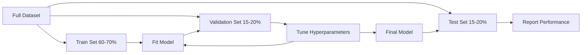

# 모델 평가 (Model Evaluation)

> 모델은 그것을 측정하는 방식만큼만 좋다.

**Type:** Build
**Languages:** Python
**Prerequisites:** Phase 1 (Probability & Distributions, Statistics for ML), Phase 2 Lessons 1-8
**Time:** ~90분

## 학습 목표 (Learning Objectives)

- K-겹(K-fold)과 계층화 K-겹(stratified K-fold) 교차 검증(cross-validation)을 밑바닥부터 구현하고, 불균형 데이터에 계층화가 왜 중요한지 설명하기
- 정밀도(precision), 재현율(recall), F1, AUC-ROC, 그리고 회귀 지표(MSE, RMSE, MAE, R-제곱)를 밑바닥부터 계산하기
- 학습 곡선(learning curve)을 해석해 모델이 높은 편향(high bias)에 시달리는지 높은 분산(high variance)에 시달리는지 진단하기
- 데이터 누출(data leakage), 잘못된 지표 선택, 테스트 셋 오염 같은 흔한 평가 실수를 식별하기

## 문제 (The Problem)

모델을 학습시켰더니 가진 데이터에서 95% 정확도가 나왔다. 좋은 걸까?

그럴 수도, 아닐 수도 있다. 데이터의 95%가 한 클래스에 속한다면, 항상 그 클래스만 예측하는 모델도 완전히 쓸모없으면서 95% 정확도를 낸다. 학습한 데이터와 같은 데이터로 평가했다면 모델이 답을 그냥 외운 것이므로 95%라는 숫자는 무의미하다. 데이터셋(dataset)에 시간 요소가 있는데 분할 전에 무작위로 섞었다면, 모델이 미래 데이터로 과거를 예측하는 셈이 된다.

모델 평가는 대부분의 ML 프로젝트가 어긋나는 지점이다. 잘못된 지표는 나쁜 모델을 좋아 보이게 만들고, 잘못된 분할은 모델이 부정행위를 하게 하며, 잘못된 비교는 더 나쁜 모델을 고르게 만든다. 평가를 제대로 하는 일은 선택 사항이 아니다. 프로덕션(production)에서 동작하는 모델과 실제 데이터를 보는 순간 실패하는 모델을 가르는 차이다.

## 개념 (The Concept)

### 학습, 검증, 테스트



세 가지 분할, 세 가지 목적:

- **학습 셋(Training set)**: 모델이 이 데이터로부터 학습한다. 학습 중 이 예시들을 본다.
- **검증 셋(Validation set)**: 하이퍼파라미터(hyperparameter)를 튜닝하고 모델들 사이에서 선택하는 데 쓴다. 모델은 이 데이터로 결코 학습하지 않지만, 우리의 결정이 여기에 영향을 받는다.
- **테스트 셋(Test set)**: 최종 성능을 보고하려고 맨 마지막에 딱 한 번 건드린다. 테스트 성능을 보고 나서 돌아가 모델을 바꾼다면, 그것은 더 이상 테스트 셋이 아니라 두 번째 검증 셋이 되어버린다.

테스트 셋은 보고된 성능이 모델이 정말로 보지 못한 데이터에서 어떻게 할지를 반영한다고 보장하는 홀드아웃(hold-out) 장치다.

### K-겹 교차 검증

작은 데이터셋에서는 단일 학습/검증 분할이 데이터를 낭비하고 노이즈가 많은 추정을 준다. K-겹 교차 검증(K-fold cross-validation)은 모든 데이터를 학습과 검증 양쪽에 사용한다.

```mermaid
flowchart TB
    subgraph Fold1["Fold 1"]
        direction LR
        V1["Val"] --- T1a["Train"] --- T1b["Train"] --- T1c["Train"] --- T1d["Train"]
    end
    subgraph Fold2["Fold 2"]
        direction LR
        T2a["Train"] --- V2["Val"] --- T2b["Train"] --- T2c["Train"] --- T2d["Train"]
    end
    subgraph Fold3["Fold 3"]
        direction LR
        T3a["Train"] --- T3b["Train"] --- V3["Val"] --- T3c["Train"] --- T3d["Train"]
    end
    subgraph Fold4["Fold 4"]
        direction LR
        T4a["Train"] --- T4b["Train"] --- T4c["Train"] --- V4["Val"] --- T4d["Train"]
    end
    subgraph Fold5["Fold 5"]
        direction LR
        T5a["Train"] --- T5b["Train"] --- T5c["Train"] --- T5d["Train"] --- V5["Val"]
    end
    Fold1 --> R["Average scores"]
    Fold2 --> R
    Fold3 --> R
    Fold4 --> R
    Fold5 --> R
```



1. 데이터를 K개의 같은 크기 폴드(fold)로 나눈다
2. 각 폴드에 대해, K-1개 폴드로 학습하고 나머지 폴드로 검증한다
3. K개의 검증 점수를 평균한다

K=5 또는 K=10이 표준 선택이다. 모든 데이터 포인트가 정확히 한 번 검증에 쓰인다. 평균 점수는 어떤 단일 분할보다 더 안정적인 추정이다.

**계층화 K-겹(Stratified K-fold)**: 각 폴드에서 클래스 분포를 보존한다. 데이터셋이 70% 클래스 A, 30% 클래스 B라면, 각 폴드도 대략 같은 비율을 갖는다. 무작위 분할은 소수 샘플을 모두 한 폴드에 몰아넣어 버릴 수 있어, 불균형 데이터셋에서 계층화가 특히 중요하다.

### 분류 지표

**혼동 행렬(Confusion matrix)**: 토대다. 이진 분류(binary classification)에서는 이렇다:

|  | Predicted Positive | Predicted Negative |
|--|---|---|
| Actually Positive | True Positive (TP) | False Negative (FN) |
| Actually Negative | False Positive (FP) | True Negative (TN) |

이 행렬에서 다른 모든 지표가 따라온다.

- **정확도(Accuracy)** = (TP + TN) / (TP + TN + FP + FN). 올바른 예측의 비율. 클래스가 불균형할 때 오해를 부른다.
- **정밀도(Precision)** = TP / (TP + FP). 양성으로 예측한 모든 것 중, 실제로 양성이었던 것은 얼마나 되는가? 거짓 양성이 비쌀 때 쓴다(예: 스팸 필터가 실제 이메일을 스팸으로 표시).
- **재현율(Recall)** (민감도, sensitivity) = TP / (TP + FN). 실제 양성 중, 우리가 잡아낸 것은 얼마나 되는가? 거짓 음성이 비쌀 때 쓴다(예: 암 검진이 종양을 놓침).
- **F1 점수(F1 score)** = 2 * precision * recall / (precision + recall). 정밀도와 재현율의 조화 평균. 어느 쪽도 명확히 지배하지 않을 때 둘의 균형을 맞춘다.
- **AUC-ROC**: 수신자 조작 특성(Receiver Operating Characteristic) 곡선 아래 면적. 다양한 분류 임계값(threshold)에서 참 양성률 대 거짓 양성률을 그린다. AUC = 0.5는 무작위 추측, AUC = 1.0은 완벽한 분리를 뜻한다. 임계값과는 무관하며, 어떤 컷오프를 고르든 모델이 양성을 음성보다 얼마나 잘 순위 매기는지 측정한다.

### 회귀 지표

- **MSE** (평균 제곱 오차, Mean Squared Error) = mean((y_true - y_pred)^2). 큰 오차를 제곱으로 처벌한다. 이상치에 민감하다.
- **RMSE** (제곱근 평균 제곱 오차, Root Mean Squared Error) = sqrt(MSE). 타깃 변수와 같은 단위. MSE보다 해석하기 쉽다.
- **MAE** (평균 절대 오차, Mean Absolute Error) = mean(|y_true - y_pred|). 모든 오차를 선형으로 다룬다. MSE보다 이상치에 더 견고하다.
- **R-제곱(R-squared)** = 1 - SS_res / SS_tot, 여기서 SS_res = sum((y_true - y_pred)^2)이고 SS_tot = sum((y_true - y_mean)^2)이다. 모델이 설명하는 분산의 비율. R^2 = 1.0은 완벽. R^2 = 0.0은 모델이 항상 평균을 예측하는 것보다 나을 게 없음. 모델이 평균보다 나쁘면 R^2는 음수가 될 수 있다.

### 학습 곡선

학습 셋 크기의 함수로 학습 점수와 검증 점수를 그린다.

- **높은 편향(과소적합, underfitting)**: 두 곡선 모두 낮은 점수로 수렴한다. 데이터를 더 추가해도 도움이 안 된다. 더 복잡한 모델이 필요하다.
- **높은 분산(과적합, overfitting)**: 학습 점수는 높지만 검증 점수가 훨씬 낮다. 둘 사이의 간극이 크다. 데이터를 더 추가하면 도움이 된다.

### 검증 곡선

하이퍼파라미터의 함수로 학습 점수와 검증 점수를 그린다.

- 낮은 복잡도에서: 두 점수 모두 낮다(과소적합)
- 올바른 복잡도에서: 두 점수 모두 높고 서로 가깝다
- 높은 복잡도에서: 학습 점수는 높게 유지되지만 검증 점수가 떨어진다(과적합)

최적의 하이퍼파라미터 값은 검증 점수가 정점에 이르는 곳이다.

### 흔한 평가 실수

**데이터 누출(Data leakage)**: 테스트 셋의 정보가 학습으로 새어 든다. 예를 들어 분할 전에 전체 데이터셋에 스케일러를 적합(fit)시키기, 시계열 예측에 미래 데이터를 포함하기, 타깃에서 파생된 특성을 사용하기다. 항상 먼저 분할하고, 그다음 전처리하라.

**클래스 불균형(Class imbalance)**: 거래의 99%가 정상이고 1%가 사기다. 항상 "정상"을 예측하는 모델은 99% 정확도를 얻는다. 대신 정밀도, 재현율, F1, 또는 AUC-ROC를 쓰라.

**잘못된 지표(Wrong metric)**: 재현율을 최적화해야 할 때(의료 진단) 정확도를 최적화하거나, 데이터에 심한 이상치가 있을 때 RMSE를 최적화하기(대신 MAE를 써라).

**계층화 분할을 쓰지 않기**: 불균형 데이터에서, 무작위 분할이 검증 폴드에 소수 샘플을 매우 적게 넣어, 불안정한 추정을 줄 수 있다.

**너무 자주 테스트하기**: 테스트 성능을 보고 조정할 때마다, 테스트 셋에 과적합한다. 테스트 셋은 일회용이다.

## 직접 만들기 (Build It)

### 1단계: 학습/검증/테스트 분할

```python
import random
import math


def train_val_test_split(X, y, train_ratio=0.6, val_ratio=0.2, seed=42):
    random.seed(seed)
    n = len(X)
    indices = list(range(n))
    random.shuffle(indices)

    train_end = int(n * train_ratio)
    val_end = int(n * (train_ratio + val_ratio))

    train_idx = indices[:train_end]
    val_idx = indices[train_end:val_end]
    test_idx = indices[val_end:]

    X_train = [X[i] for i in train_idx]
    y_train = [y[i] for i in train_idx]
    X_val = [X[i] for i in val_idx]
    y_val = [y[i] for i in val_idx]
    X_test = [X[i] for i in test_idx]
    y_test = [y[i] for i in test_idx]

    return X_train, y_train, X_val, y_val, X_test, y_test
```

### 2단계: K-겹과 계층화 K-겹 교차 검증

```python
def kfold_split(n, k=5, seed=42):
    random.seed(seed)
    indices = list(range(n))
    random.shuffle(indices)

    fold_size = n // k
    folds = []

    for i in range(k):
        start = i * fold_size
        end = start + fold_size if i < k - 1 else n
        val_idx = indices[start:end]
        train_idx = indices[:start] + indices[end:]
        folds.append((train_idx, val_idx))

    return folds


def stratified_kfold_split(y, k=5, seed=42):
    random.seed(seed)

    class_indices = {}
    for i, label in enumerate(y):
        class_indices.setdefault(label, []).append(i)

    for label in class_indices:
        random.shuffle(class_indices[label])

    folds = [{"train": [], "val": []} for _ in range(k)]

    for label, indices in class_indices.items():
        fold_size = len(indices) // k
        for i in range(k):
            start = i * fold_size
            end = start + fold_size if i < k - 1 else len(indices)
            val_part = indices[start:end]
            train_part = indices[:start] + indices[end:]
            folds[i]["val"].extend(val_part)
            folds[i]["train"].extend(train_part)

    return [(f["train"], f["val"]) for f in folds]


def cross_validate(X, y, model_fn, k=5, metric_fn=None, stratified=False):
    n = len(X)

    if stratified:
        folds = stratified_kfold_split(y, k)
    else:
        folds = kfold_split(n, k)

    scores = []
    for train_idx, val_idx in folds:
        X_train = [X[i] for i in train_idx]
        y_train = [y[i] for i in train_idx]
        X_val = [X[i] for i in val_idx]
        y_val = [y[i] for i in val_idx]

        model = model_fn()
        model.fit(X_train, y_train)
        predictions = [model.predict(x) for x in X_val]

        if metric_fn:
            score = metric_fn(y_val, predictions)
        else:
            score = sum(1 for yt, yp in zip(y_val, predictions) if yt == yp) / len(y_val)
        scores.append(score)

    return scores
```

### 3단계: 혼동 행렬과 분류 지표

```python
def confusion_matrix(y_true, y_pred):
    tp = sum(1 for yt, yp in zip(y_true, y_pred) if yt == 1 and yp == 1)
    tn = sum(1 for yt, yp in zip(y_true, y_pred) if yt == 0 and yp == 0)
    fp = sum(1 for yt, yp in zip(y_true, y_pred) if yt == 0 and yp == 1)
    fn = sum(1 for yt, yp in zip(y_true, y_pred) if yt == 1 and yp == 0)
    return tp, tn, fp, fn


def accuracy(y_true, y_pred):
    tp, tn, fp, fn = confusion_matrix(y_true, y_pred)
    total = tp + tn + fp + fn
    return (tp + tn) / total if total > 0 else 0.0


def precision(y_true, y_pred):
    tp, tn, fp, fn = confusion_matrix(y_true, y_pred)
    return tp / (tp + fp) if (tp + fp) > 0 else 0.0


def recall(y_true, y_pred):
    tp, tn, fp, fn = confusion_matrix(y_true, y_pred)
    return tp / (tp + fn) if (tp + fn) > 0 else 0.0


def f1_score(y_true, y_pred):
    p = precision(y_true, y_pred)
    r = recall(y_true, y_pred)
    return 2 * p * r / (p + r) if (p + r) > 0 else 0.0


def roc_curve(y_true, y_scores):
    thresholds = sorted(set(y_scores), reverse=True)
    tpr_list = []
    fpr_list = []

    total_positives = sum(y_true)
    total_negatives = len(y_true) - total_positives

    for threshold in thresholds:
        y_pred = [1 if s >= threshold else 0 for s in y_scores]
        tp = sum(1 for yt, yp in zip(y_true, y_pred) if yt == 1 and yp == 1)
        fp = sum(1 for yt, yp in zip(y_true, y_pred) if yt == 0 and yp == 1)

        tpr = tp / total_positives if total_positives > 0 else 0.0
        fpr = fp / total_negatives if total_negatives > 0 else 0.0

        tpr_list.append(tpr)
        fpr_list.append(fpr)

    return fpr_list, tpr_list, thresholds


def auc_roc(y_true, y_scores):
    fpr_list, tpr_list, _ = roc_curve(y_true, y_scores)

    pairs = sorted(zip(fpr_list, tpr_list))
    fpr_sorted = [p[0] for p in pairs]
    tpr_sorted = [p[1] for p in pairs]

    area = 0.0
    for i in range(1, len(fpr_sorted)):
        width = fpr_sorted[i] - fpr_sorted[i - 1]
        height = (tpr_sorted[i] + tpr_sorted[i - 1]) / 2
        area += width * height

    return area
```

### 4단계: 회귀 지표

```python
def mse(y_true, y_pred):
    n = len(y_true)
    return sum((yt - yp) ** 2 for yt, yp in zip(y_true, y_pred)) / n


def rmse(y_true, y_pred):
    return math.sqrt(mse(y_true, y_pred))


def mae(y_true, y_pred):
    n = len(y_true)
    return sum(abs(yt - yp) for yt, yp in zip(y_true, y_pred)) / n


def r_squared(y_true, y_pred):
    mean_y = sum(y_true) / len(y_true)
    ss_res = sum((yt - yp) ** 2 for yt, yp in zip(y_true, y_pred))
    ss_tot = sum((yt - mean_y) ** 2 for yt in y_true)
    if ss_tot == 0:
        return 0.0
    return 1.0 - ss_res / ss_tot
```

### 5단계: 학습 곡선

```python
def learning_curve(X, y, model_fn, metric_fn, train_sizes=None, val_ratio=0.2, seed=42):
    random.seed(seed)
    n = len(X)
    indices = list(range(n))
    random.shuffle(indices)

    val_size = int(n * val_ratio)
    val_idx = indices[:val_size]
    pool_idx = indices[val_size:]

    X_val = [X[i] for i in val_idx]
    y_val = [y[i] for i in val_idx]

    if train_sizes is None:
        train_sizes = [int(len(pool_idx) * r) for r in [0.1, 0.2, 0.4, 0.6, 0.8, 1.0]]

    train_scores = []
    val_scores = []

    for size in train_sizes:
        subset = pool_idx[:size]
        X_train = [X[i] for i in subset]
        y_train = [y[i] for i in subset]

        model = model_fn()
        model.fit(X_train, y_train)

        train_pred = [model.predict(x) for x in X_train]
        val_pred = [model.predict(x) for x in X_val]

        train_scores.append(metric_fn(y_train, train_pred))
        val_scores.append(metric_fn(y_val, val_pred))

    return train_sizes, train_scores, val_scores
```

### 6단계: 테스트를 위한 간단한 분류기, 그리고 전체 데모

```python
class SimpleLogistic:
    def __init__(self, lr=0.1, epochs=100):
        self.lr = lr
        self.epochs = epochs
        self.weights = None
        self.bias = 0.0

    def sigmoid(self, z):
        z = max(-500, min(500, z))
        return 1.0 / (1.0 + math.exp(-z))

    def fit(self, X, y):
        n_features = len(X[0])
        self.weights = [0.0] * n_features
        self.bias = 0.0

        for _ in range(self.epochs):
            for xi, yi in zip(X, y):
                z = sum(w * x for w, x in zip(self.weights, xi)) + self.bias
                pred = self.sigmoid(z)
                error = yi - pred
                for j in range(n_features):
                    self.weights[j] += self.lr * error * xi[j]
                self.bias += self.lr * error

    def predict_proba(self, x):
        z = sum(w * xi for w, xi in zip(self.weights, x)) + self.bias
        return self.sigmoid(z)

    def predict(self, x):
        return 1 if self.predict_proba(x) >= 0.5 else 0


class SimpleLinearRegression:
    def __init__(self, lr=0.001, epochs=200):
        self.lr = lr
        self.epochs = epochs
        self.weights = None
        self.bias = 0.0

    def fit(self, X, y):
        n_features = len(X[0])
        self.weights = [0.0] * n_features
        self.bias = 0.0
        n = len(X)

        for _ in range(self.epochs):
            for xi, yi in zip(X, y):
                pred = sum(w * x for w, x in zip(self.weights, xi)) + self.bias
                error = yi - pred
                for j in range(n_features):
                    self.weights[j] += self.lr * error * xi[j] / n
                self.bias += self.lr * error / n

    def predict(self, x):
        return sum(w * xi for w, xi in zip(self.weights, x)) + self.bias


def standardize(values):
    n = len(values)
    mean = sum(values) / n
    var = sum((v - mean) ** 2 for v in values) / n
    std = math.sqrt(var) if var > 0 else 1.0
    return [(v - mean) / std for v in values], mean, std


def make_classification_data(n=300, seed=42):
    random.seed(seed)
    X = []
    y = []
    for _ in range(n):
        x1 = random.gauss(0, 1)
        x2 = random.gauss(0, 1)
        label = 1 if (x1 + x2 + random.gauss(0, 0.5)) > 0 else 0
        X.append([x1, x2])
        y.append(label)
    return X, y


def make_regression_data(n=200, seed=42):
    random.seed(seed)
    X = []
    y = []
    for _ in range(n):
        x1 = random.uniform(0, 10)
        x2 = random.uniform(0, 5)
        target = 3 * x1 + 2 * x2 + random.gauss(0, 2)
        X.append([x1, x2])
        y.append(target)
    return X, y


def make_imbalanced_data(n=300, minority_ratio=0.05, seed=42):
    random.seed(seed)
    X = []
    y = []
    for _ in range(n):
        if random.random() < minority_ratio:
            x1 = random.gauss(3, 0.5)
            x2 = random.gauss(3, 0.5)
            label = 1
        else:
            x1 = random.gauss(0, 1)
            x2 = random.gauss(0, 1)
            label = 0
        X.append([x1, x2])
        y.append(label)
    return X, y


if __name__ == "__main__":
    X_clf, y_clf = make_classification_data(300)

    print("=== Train/Validation/Test Split ===")
    X_train, y_train, X_val, y_val, X_test, y_test = train_val_test_split(X_clf, y_clf)
    print(f"  Train: {len(X_train)}, Val: {len(X_val)}, Test: {len(X_test)}")
    print(f"  Train class distribution: {sum(y_train)}/{len(y_train)} positive")
    print(f"  Val class distribution: {sum(y_val)}/{len(y_val)} positive")

    model = SimpleLogistic(lr=0.1, epochs=200)
    model.fit(X_train, y_train)

    print("\n=== Classification Metrics ===")
    y_pred = [model.predict(x) for x in X_test]
    tp, tn, fp, fn = confusion_matrix(y_test, y_pred)
    print(f"  Confusion matrix: TP={tp}, TN={tn}, FP={fp}, FN={fn}")
    print(f"  Accuracy:  {accuracy(y_test, y_pred):.4f}")
    print(f"  Precision: {precision(y_test, y_pred):.4f}")
    print(f"  Recall:    {recall(y_test, y_pred):.4f}")
    print(f"  F1 Score:  {f1_score(y_test, y_pred):.4f}")

    y_scores = [model.predict_proba(x) for x in X_test]
    auc = auc_roc(y_test, y_scores)
    print(f"  AUC-ROC:   {auc:.4f}")

    print("\n=== K-Fold Cross-Validation (K=5) ===")
    cv_scores = cross_validate(
        X_clf, y_clf,
        model_fn=lambda: SimpleLogistic(lr=0.1, epochs=200),
        k=5,
        metric_fn=accuracy,
    )
    mean_cv = sum(cv_scores) / len(cv_scores)
    std_cv = math.sqrt(sum((s - mean_cv) ** 2 for s in cv_scores) / len(cv_scores))
    print(f"  Fold scores: {[round(s, 4) for s in cv_scores]}")
    print(f"  Mean: {mean_cv:.4f} (+/- {std_cv:.4f})")

    print("\n=== Stratified K-Fold Cross-Validation (K=5) ===")
    strat_scores = cross_validate(
        X_clf, y_clf,
        model_fn=lambda: SimpleLogistic(lr=0.1, epochs=200),
        k=5,
        metric_fn=accuracy,
        stratified=True,
    )
    strat_mean = sum(strat_scores) / len(strat_scores)
    strat_std = math.sqrt(sum((s - strat_mean) ** 2 for s in strat_scores) / len(strat_scores))
    print(f"  Fold scores: {[round(s, 4) for s in strat_scores]}")
    print(f"  Mean: {strat_mean:.4f} (+/- {strat_std:.4f})")

    print("\n=== Imbalanced Data: Why Accuracy Lies ===")
    X_imb, y_imb = make_imbalanced_data(300, minority_ratio=0.05)
    positives = sum(y_imb)
    print(f"  Class distribution: {positives} positive, {len(y_imb) - positives} negative ({positives/len(y_imb)*100:.1f}% positive)")

    always_negative = [0] * len(y_imb)
    print(f"  Always-negative baseline:")
    print(f"    Accuracy:  {accuracy(y_imb, always_negative):.4f}")
    print(f"    Precision: {precision(y_imb, always_negative):.4f}")
    print(f"    Recall:    {recall(y_imb, always_negative):.4f}")
    print(f"    F1 Score:  {f1_score(y_imb, always_negative):.4f}")

    X_tr_i, y_tr_i, X_v_i, y_v_i, X_te_i, y_te_i = train_val_test_split(X_imb, y_imb)
    model_imb = SimpleLogistic(lr=0.5, epochs=500)
    model_imb.fit(X_tr_i, y_tr_i)
    y_pred_imb = [model_imb.predict(x) for x in X_te_i]
    print(f"\n  Trained model on imbalanced data:")
    print(f"    Accuracy:  {accuracy(y_te_i, y_pred_imb):.4f}")
    print(f"    Precision: {precision(y_te_i, y_pred_imb):.4f}")
    print(f"    Recall:    {recall(y_te_i, y_pred_imb):.4f}")
    print(f"    F1 Score:  {f1_score(y_te_i, y_pred_imb):.4f}")

    print("\n=== Regression Metrics ===")
    X_reg, y_reg = make_regression_data(200)

    col0 = [x[0] for x in X_reg]
    col1 = [x[1] for x in X_reg]
    col0_s, m0, s0 = standardize(col0)
    col1_s, m1, s1 = standardize(col1)
    X_reg_scaled = [[col0_s[i], col1_s[i]] for i in range(len(X_reg))]

    X_tr_r, y_tr_r, X_v_r, y_v_r, X_te_r, y_te_r = train_val_test_split(X_reg_scaled, y_reg)
    reg_model = SimpleLinearRegression(lr=0.01, epochs=500)
    reg_model.fit(X_tr_r, y_tr_r)
    y_pred_r = [reg_model.predict(x) for x in X_te_r]

    print(f"  MSE:       {mse(y_te_r, y_pred_r):.4f}")
    print(f"  RMSE:      {rmse(y_te_r, y_pred_r):.4f}")
    print(f"  MAE:       {mae(y_te_r, y_pred_r):.4f}")
    print(f"  R-squared: {r_squared(y_te_r, y_pred_r):.4f}")

    mean_baseline = [sum(y_tr_r) / len(y_tr_r)] * len(y_te_r)
    print(f"\n  Mean baseline:")
    print(f"    MSE:       {mse(y_te_r, mean_baseline):.4f}")
    print(f"    R-squared: {r_squared(y_te_r, mean_baseline):.4f}")

    print("\n=== Learning Curve ===")
    sizes, train_sc, val_sc = learning_curve(
        X_clf, y_clf,
        model_fn=lambda: SimpleLogistic(lr=0.1, epochs=200),
        metric_fn=accuracy,
    )
    print(f"  {'Size':>6} {'Train':>8} {'Val':>8}")
    for s, tr, va in zip(sizes, train_sc, val_sc):
        print(f"  {s:>6} {tr:>8.4f} {va:>8.4f}")

    print("\n=== Statistical Model Comparison ===")
    model_a_scores = cross_validate(
        X_clf, y_clf,
        model_fn=lambda: SimpleLogistic(lr=0.1, epochs=100),
        k=5, metric_fn=accuracy,
    )
    model_b_scores = cross_validate(
        X_clf, y_clf,
        model_fn=lambda: SimpleLogistic(lr=0.1, epochs=500),
        k=5, metric_fn=accuracy,
    )
    diffs = [a - b for a, b in zip(model_a_scores, model_b_scores)]
    mean_diff = sum(diffs) / len(diffs)
    std_diff = math.sqrt(sum((d - mean_diff) ** 2 for d in diffs) / len(diffs))
    t_stat = mean_diff / (std_diff / math.sqrt(len(diffs))) if std_diff > 0 else 0.0
    print(f"  Model A (100 epochs) mean: {sum(model_a_scores)/len(model_a_scores):.4f}")
    print(f"  Model B (500 epochs) mean: {sum(model_b_scores)/len(model_b_scores):.4f}")
    print(f"  Mean difference: {mean_diff:.4f}")
    print(f"  Paired t-statistic: {t_stat:.4f}")
    print(f"  (|t| > 2.78 for significance at p<0.05 with df=4)")
```

## 라이브러리로 써보기 (Use It)

scikit-learn에서는 평가가 워크플로에 내장되어 있다.

```python
from sklearn.model_selection import cross_val_score, StratifiedKFold, learning_curve
from sklearn.metrics import (
    accuracy_score, precision_score, recall_score, f1_score,
    roc_auc_score, confusion_matrix, mean_squared_error, r2_score,
)
from sklearn.linear_model import LogisticRegression

model = LogisticRegression()
scores = cross_val_score(model, X, y, cv=StratifiedKFold(5), scoring="f1")
```

밑바닥 버전은 교차 검증이 정확히 무엇을 하는지(마법이 아니라 그저 for-루프와 인덱스 추적), 각 지표를 어떻게 계산하는지(그저 TP/FP/TN/FN을 세는 일), 계층화가 왜 중요한지(각 폴드에서 클래스 비율을 보존하는 일)를 보여준다. 라이브러리 버전은 여기에 병렬성과 더 많은 채점 옵션, 파이프라인 통합을 더한다.

## 산출물 (Ship It)

이 레슨이 만들어내는 것:
- `outputs/skill-evaluation.md` - 분류 및 회귀 모델의 평가 전략을 다루는 스킬

## 연습 문제 (Exercises)

1. 정밀도-재현율 곡선을 구현하라. 다른 임계값에서 정밀도 대 재현율을 그린다. 평균 정밀도(PR 곡선 아래 면적)를 계산하라. 불균형 데이터셋에서 PR 곡선을 ROC 곡선과 비교하고, 각각이 언제 더 유익한지 설명하라.
2. 중첩 교차 검증 루프를 만들어라. 외부 루프는 모델 성능을 평가하고, 내부 루프는 하이퍼파라미터를 튜닝한다. 검증 데이터를 평가로 누출하지 않고 두 모델을 공정하게 비교하는 데 쓰라.
3. 모델 비교를 위한 순열 검정(permutation test)을 구현하라. 레이블을 섞고, 재학습하고, 성능을 측정한다. 100번 반복해 귀무 분포를 만든다. 이 분포에 대해 관측된 모델 성능의 p-값을 계산하라.

## 핵심 용어 (Key Terms)

| 용어 | 흔히 하는 말 | 실제 의미 |
|------|----------------|----------------------|
| 과적합(Overfitting) | "학습 데이터를 암기하기" | 모델이 학습 데이터의 노이즈를 포착하여, 학습에서는 잘하지만 보지 못한 데이터에서는 못하는 것 |
| 교차 검증(Cross-validation) | "다른 부분집합으로 테스트하기" | 검증에 쓰는 데이터 부분을 체계적으로 회전시키고, 모든 회전에 걸쳐 결과를 평균하는 것 |
| 정밀도(Precision) | "예측한 양성 중 몇 개가 맞는가" | TP / (TP + FP): 양성 예측 중 실제로 양성인 비율 |
| 재현율(Recall) | "실제 양성 중 몇 개를 찾았나" | TP / (TP + FN): 올바르게 식별된 실제 양성의 비율 |
| AUC-ROC | "모델이 클래스를 얼마나 잘 분리하는가" | 모든 임계값에 걸친 참 양성률 대 거짓 양성률 곡선 아래 면적, 0.5(무작위)부터 1.0(완벽)까지 |
| R-제곱(R-squared) | "분산이 얼마나 설명되는가" | 1 - (제곱 잔차 합 / 총 제곱합): 모델이 포착하는 타깃 분산의 비율 |
| 데이터 누출(Data leakage) | "모델이 부정행위를 했다" | 예측 시점에 사용할 수 없을 정보를 학습 중에 사용하여, 낙관적 평가로 이어지는 것 |
| 학습 곡선(Learning curve) | "데이터가 늘면 성능이 어떻게 변하는가" | 학습 셋 크기 대 학습 및 검증 점수의 그래프로, 과소적합이나 과적합을 드러낸다 |
| 계층화 분할(Stratified split) | "클래스 비율을 균형 있게 유지하기" | 각 부분집합이 전체 데이터셋과 같은 클래스 비율을 갖도록 데이터를 분할하는 것 |

## 더 읽을거리 (Further Reading)

- [scikit-learn Model Selection Guide](https://scikit-learn.org/stable/model_selection.html) - 교차 검증, 지표, 하이퍼파라미터 튜닝에 대한 종합 레퍼런스
- [Beyond Accuracy: Precision and Recall (Google ML Crash Course)](https://developers.google.com/machine-learning/crash-course/classification/precision-and-recall) - 인터랙티브 예제가 있는 명료한 설명
- [A Survey of Cross-Validation Procedures (Arlot & Celisse, 2010)](https://projecteuclid.org/journals/statistics-surveys/volume-4/issue-none/A-survey-of-cross-validation-procedures-for-model-selection/10.1214/09-SS054.full) - 다른 CV 전략이 언제 왜 동작하는지에 대한 엄밀한 다룸
