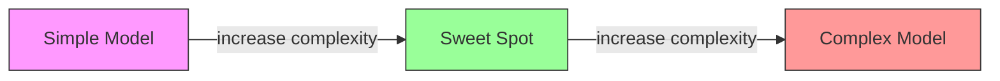
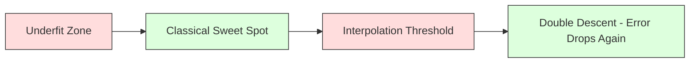
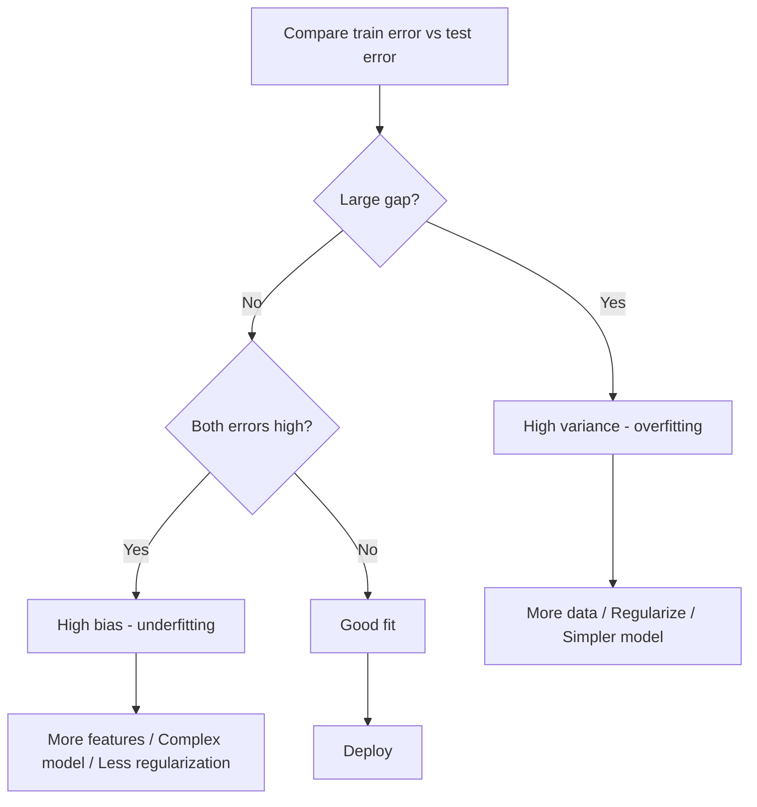
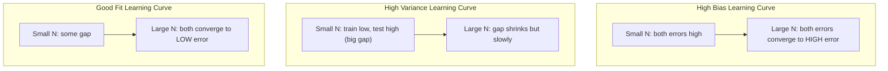
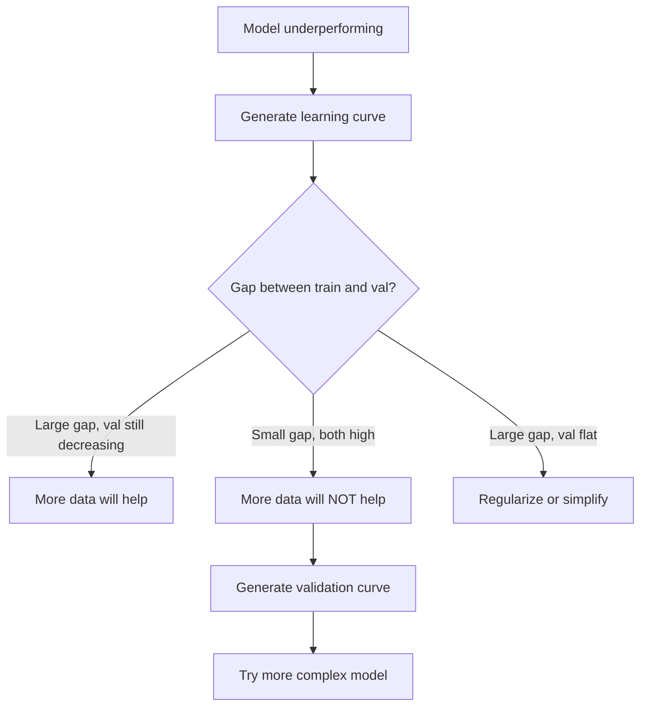

# 편향-분산 트레이드오프 (Bias-Variance Tradeoff)

> 모든 모델 오차는 세 가지 원천 중 하나에서 온다: 편향(bias), 분산(variance), 노이즈(noise). 당신이 제어할 수 있는 것은 앞의 두 가지뿐이다.

**Type:** Learn
**Language:** Python
**Prerequisites:** Phase 2, Lessons 01-09 (ML basics, regression, classification, evaluation)
**Time:** ~75분

## 학습 목표 (Learning Objectives)

- 기대 예측 오차의 편향-분산 분해(bias-variance decomposition)를 유도하고, 줄일 수 없는 노이즈(irreducible noise)의 역할을 설명하기
- 학습 오차와 테스트 오차 패턴을 사용해 모델이 높은 편향에 시달리는지 높은 분산에 시달리는지 진단하기
- 정규화(regularization) 기법(L1, L2, 드롭아웃(dropout), 조기 종료(early stopping))이 어떻게 편향을 분산과 맞바꾸는지 설명하기
- 복잡도가 증가하는 여러 모델에 걸쳐 편향-분산 트레이드오프(trade-off)를 시각화하는 실험 구현하기

## 문제 (The Problem)

당신은 모델(model) 하나를 학습시켰다. 테스트 데이터에서 어느 정도 오차가 난다. 그 오차는 어디서 오는가?

모델이 너무 단순하다면(곡선형 데이터셋(dataset)에 선형 회귀(linear regression)를 적용한 경우), 참된 패턴을 일관되게 놓친다. 그것이 편향(bias)이다. 모델이 너무 복잡하다면(데이터 포인트 15개에 차수 20짜리 다항식을 적용한 경우), 학습 데이터에는 완벽하게 들어맞지만 새로운 데이터에서는 제각각 크게 다른 예측을 내놓는다. 그것이 분산(variance)이다.

고정된 모델 용량(capacity)에서는 둘을 동시에 최소화할 수 없다. 편향을 낮추면 분산이 올라간다. 분산을 낮추면 편향이 올라간다. 이 트레이드오프를 이해하는 것은 머신러닝(machine learning)에서 가장 유용한 단 하나의 진단 능력이다. 이것은 모델을 더 복잡하게 만들지 덜 복잡하게 만들지, 데이터를 더 모을지 더 나은 특성(feature)을 만들지, 규제를 더 강하게 할지 약하게 할지를 알려준다.

## 개념 (The Concept)

### 편향: 체계적 오차 (Bias: Systematic Error)

편향은 모델의 평균 예측이 참값에서 얼마나 벗어났는지를 측정한다. 같은 분포에서 추출된 여러 다른 학습 세트로 같은 모델을 학습시키고 예측을 평균낸다면, 편향은 그 평균과 진실 사이의 간극이다.

높은 편향은 모델이 실제 패턴을 포착하기에는 너무 경직되어 있다는 뜻이다. 포물선에 직선을 맞추면 데이터를 아무리 많이 줘도 언제나 곡선을 놓친다. 이것이 과소적합(underfitting)이다.

```
High bias (underfitting):
  Model always predicts roughly the same wrong thing.
  Training error: HIGH
  Test error: HIGH
  Gap between them: SMALL
```

### 분산: 학습 데이터에 대한 민감성 (Variance: Sensitivity to Training Data)

분산은 다른 데이터 부분집합으로 학습할 때 예측이 얼마나 변하는지를 측정한다. 학습 세트의 작은 변화가 모델에 큰 변화를 일으킨다면 분산이 높은 것이다.

높은 분산은 모델이 기저 신호가 아니라 학습 데이터의 노이즈에 맞춰지고 있다는 뜻이다. 차수 20짜리 다항식은 모든 학습 포인트를 꿰뚫고 지나가지만 그 사이에서는 격렬하게 진동한다. 이것이 과적합(overfitting)이다.

```
High variance (overfitting):
  Model fits training data perfectly but fails on new data.
  Training error: LOW
  Test error: HIGH
  Gap between them: LARGE
```

### 분해 (The Decomposition)

임의의 점 x에 대해, 제곱 손실(squared loss) 하에서의 기대 예측 오차는 정확하게 분해된다:

```
Expected Error = Bias^2 + Variance + Irreducible Noise

where:
  Bias^2   = (E[f_hat(x)] - f(x))^2
  Variance = E[(f_hat(x) - E[f_hat(x)])^2]
  Noise    = E[(y - f(x))^2]             (sigma^2)
```

- `f(x)`는 참된 함수다
- `f_hat(x)`는 당신 모델의 예측이다
- `E[...]`는 서로 다른 학습 세트에 대한 기댓값이다
- `y`는 관측된 레이블(label)이다 (참된 함수에 노이즈를 더한 값)

노이즈 항은 줄일 수 없다. 노이즈가 있는 데이터에서 어떤 모델도 sigma^2보다 더 잘할 수는 없다. 당신의 일은 bias^2와 분산 사이의 올바른 균형을 찾는 것이다.

### 모델 복잡도 vs 오차 (Model Complexity vs Error)



고전적인 U자형 곡선:

| 복잡도 | 편향 | 분산 | 총 오차 |
|-----------|------|----------|-------------|
| 너무 낮음 | 높음 | 낮음 | 높음 (과소적합) |
| 딱 적당함 | 중간 | 중간 | 최저 |
| 너무 높음 | 낮음 | 높음 | 높음 (과적합) |

### 편향-분산 제어로서의 정규화 (Regularization as Bias-Variance Control)

정규화는 분산을 줄이기 위해 의도적으로 편향을 늘린다. 모델이 노이즈를 좇지 못하도록 제약한다.

- **L2 (Ridge):** 모든 가중치(weight)를 0 쪽으로 축소한다. 모든 특성을 유지하되 그 영향력을 줄인다.
- **L1 (Lasso):** 일부 가중치를 정확히 0으로 밀어낸다. 특성 선택(feature selection)을 수행한다.
- **드롭아웃(Dropout):** 학습 중 뉴런(neuron)을 무작위로 비활성화한다. 중복적인 표현(redundant representation)을 강제한다.
- **조기 종료(Early stopping):** 모델이 학습 데이터에 완전히 맞춰지기 전에 학습을 멈춘다.

정규화 강도(lambda, 드롭아웃 비율, 에폭(epoch) 수)는 편향-분산 곡선 위에서 당신이 어디에 위치하는지를 직접 제어한다. 정규화가 강할수록 편향은 더 커지고 분산은 더 작아진다.

### 이중 하강: 현대적 관점 (Double Descent: The Modern Perspective)

고전 이론은 이렇게 말한다: 스위트 스폿(sweet spot)을 지나면 복잡도가 늘수록 항상 해롭다. 그러나 2019년 이후의 연구는 예상치 못한 무언가를 보여줬다. 보간 임계점(interpolation threshold, 모델이 학습 데이터에 완벽하게 맞출 수 있을 만큼의 파라미터(parameter)를 갖는 지점)을 한참 넘어서까지 모델 용량을 계속 늘리면, 테스트 오차가 다시 감소할 수 있다.



이 "이중 하강(double descent)" 현상은 (학습 예제보다 파라미터가 훨씬 더 많은) 대규모로 과대 파라미터화된 신경망(neural network)이 어째서 여전히 잘 일반화하는지를 설명한다. 고전적인 편향-분산 트레이드오프가 틀린 것은 아니지만, 현대적 영역에서는 불완전하다.

이중 하강에 관한 핵심 관찰:
- 선형 모델, 결정 트리(decision tree), 신경망에서 일어난다
- 보간 영역에서는 데이터를 더 모으는 것이 오히려 해로울 수 있다(샘플 단위 이중 하강(sample-wise double descent))
- 학습 에폭을 더 늘려도 발생할 수 있다(에폭 단위 이중 하강(epoch-wise double descent))
- 정규화는 봉우리를 매끄럽게 만들지만 제거하지는 못한다

왜 이런 일이 일어나는가? 보간 임계점에서 모델은 모든 학습 포인트에 맞출 만큼만 딱 충분한 용량을 갖는다. 모든 점을 꿰뚫는 매우 특정한 해(solution)로 내몰리며, 데이터의 작은 교란이 적합(fit)에 큰 변화를 일으킨다. 바로 여기서 분산이 정점에 이른다. 임계점을 넘어서면 모델은 데이터에 완벽하게 맞는 여러 가능한 해를 갖게 된다. 학습 알고리즘(예: 암묵적 정규화를 동반한 경사 하강법(gradient descent))은 그중 가장 단순한 해를 고르는 경향이 있다. 단순한 해를 향한 이 암묵적 편향이 바로 과대 파라미터화된 모델이 일반화하는 이유다.

| 영역 | 파라미터 vs 샘플 | 동작 |
|--------|----------------------|----------|
| 과소 파라미터화 (Underparameterized) | p << n | 고전적 트레이드오프가 적용된다 |
| 보간 임계점 (Interpolation threshold) | p ~ n | 분산이 정점에 이르고 테스트 오차가 치솟는다 |
| 과대 파라미터화 (Overparameterized) | p >> n | 암묵적 정규화가 작동하여 테스트 오차가 감소한다 |

실용적인 관점에서: 신경망이나 대규모 트리 앙상블(tree ensemble)을 쓰고 있다면 보간 임계점에서 멈추지 말라. (명시적 정규화와 함께) 그 한참 아래에 머무르거나, 그 한참 위로 넘어가라. 가장 나쁜 위치는 바로 임계점 위다.

### 모델 진단하기 (Diagnosing Your Model)



| 증상 | 진단 | 해결책 |
|---------|-----------|-----|
| 높은 학습 오차, 높은 테스트 오차 | 편향 | 특성 추가, 복잡한 모델, 정규화 줄이기 |
| 낮은 학습 오차, 높은 테스트 오차 | 분산 | 데이터 추가, 정규화, 단순한 모델, 드롭아웃 |
| 낮은 학습 오차, 낮은 테스트 오차 | 좋은 적합 | 배포한다 |
| 학습 오차 감소, 테스트 오차 증가 | 과적합 진행 중 | 조기 종료 |

### 실전 전략 (Practical Strategies)

**편향이 문제일 때:**
- 다항(polynomial) 또는 상호작용(interaction) 특성을 추가한다
- 더 유연한 모델을 쓴다(선형 대신 트리 앙상블)
- 정규화 강도를 줄인다
- 더 오래 학습한다(아직 수렴하지 않았다면)

**분산이 문제일 때:**
- 학습 데이터를 더 모은다
- 배깅(bagging, 랜덤 포레스트(random forest))을 쓴다
- 정규화를 강화한다(더 높은 lambda, 더 많은 드롭아웃)
- 특성 선택(노이즈가 많은 특성 제거)
- 교차 검증(cross-validation)으로 일찍 탐지한다

### 앙상블 기법과 분산 감소 (Ensemble Methods and Variance Reduction)

앙상블 기법은 분산과 싸우는 가장 실용적인 도구다.

**배깅(Bagging, Bootstrap Aggregating)**은 학습 데이터의 서로 다른 부트스트랩(bootstrap) 샘플로 여러 모델을 학습시킨 뒤 그 예측을 평균낸다. 개별 모델 각각은 높은 분산을 갖지만, 그 평균은 훨씬 낮은 분산을 갖는다. 랜덤 포레스트는 결정 트리에 적용한 배깅이다.

수학적으로 왜 작동하는가: 각각 분산이 sigma^2인 N개의 독립적인 예측을 평균내면, 그 평균의 분산은 sigma^2 / N이다. 모델들은 진정으로 독립적이지는 않으므로(모두 비슷한 데이터를 본다) 감소폭은 1/N보다 작지만, 그래도 상당하다.

**부스팅(Boosting)**은 모델을 순차적으로 쌓아 편향을 줄이는데, 각 새 모델은 지금까지 앙상블이 낸 오차에 집중한다. 그래디언트 부스팅(gradient boosting)과 AdaBoost가 주요 예시다. 부스팅은 모델을 너무 많이 추가하면 과적합할 수 있으므로 조기 종료나 정규화가 필요하다.

| 기법 | 주요 효과 | 편향 변화 | 분산 변화 |
|--------|---------------|-------------|-----------------|
| 배깅 (Bagging) | 분산 감소 | 변화 없음 | 감소 |
| 부스팅 (Boosting) | 편향 감소 | 감소 | 증가할 수 있음 |
| 스태킹 (Stacking) | 둘 다 감소 | 메타 학습기에 따라 다름 | 베이스 모델에 따라 다름 |
| 드롭아웃 (Dropout) | 암묵적 배깅 | 약간 증가 | 감소 |

**실전 규칙:** 베이스 모델이 높은 분산을 갖는다면(깊은 트리, 고차 다항식) 배깅을 쓴다. 베이스 모델이 높은 편향을 갖는다면(얕은 스텀프(stump), 단순 선형 모델) 부스팅을 쓴다.

### 학습 곡선 (Learning Curves)

학습 곡선(learning curve)은 학습 세트 크기의 함수로 학습 오차와 검증 오차를 그린다. 당신이 가진 가장 실용적인 진단 도구다. 단일한 학습/테스트 비교와 달리, 학습 곡선은 모델의 궤적을 보여주며 데이터를 더 모으면 도움이 될지를 알려준다.



읽는 법:

| 시나리오 | 학습 오차 | 검증 오차 | 간극 | 의미 | 해야 할 일 |
|----------|---------------|-----------------|-----|---------------|------------|
| 높은 편향 | 높음 | 높음 | 작음 | 모델이 패턴을 포착하지 못한다 | 특성 추가, 복잡한 모델, 정규화 줄이기 |
| 높은 분산 | 낮음 | 높음 | 큼 | 모델이 학습 데이터를 암기한다 | 데이터 추가, 정규화, 단순한 모델 |
| 좋은 적합 | 중간 | 중간 | 작음 | 모델이 잘 일반화한다 | 배포한다 |
| 높은 분산, 개선 중 | 낮음 | 데이터가 많아질수록 감소 | 줄어드는 중 | 데이터로 해결 가능한 분산 문제 | 데이터를 더 모은다 |
| 높은 편향, 평탄함 | 높음 | 높고 평탄함 | 작고 평탄함 | 데이터를 더 모아도 도움이 안 된다 | 모델 아키텍처를 바꾼다 |

핵심 통찰: 두 곡선이 모두 평탄해졌고 간극은 작은데 둘 다 오차가 높다면, 데이터를 더 모으는 것은 소용없다. 더 나은 모델이 필요하다. 간극이 크고 여전히 줄어들고 있다면, 데이터를 더 모으는 것이 도움이 된다.

### 학습 곡선 생성 방법 (How to Generate Learning Curves)

두 가지 접근법이 있다:

**접근법 1: 학습 세트 크기를 변화, 모델 고정.** 모델과 하이퍼파라미터(hyperparameter)를 고정한다. 점점 더 큰 학습 데이터 부분집합으로 학습시킨다. 각 크기에서 학습 오차와 검증 오차를 측정한다. 이것이 표준 학습 곡선이다.

**접근법 2: 모델 복잡도를 변화, 데이터 고정.** 데이터를 고정한다. 복잡도 파라미터(다항식 차수, 트리 깊이, 층(layer) 수)를 훑는다. 각 복잡도에서 학습 오차와 검증 오차를 측정한다. 이것이 검증 곡선(validation curve)이며 편향-분산 트레이드오프를 직접 보여준다.

두 접근법은 서로 보완한다. 첫 번째는 데이터를 더 모으면 도움이 될지를 알려준다. 두 번째는 다른 모델이 도움이 될지를 알려준다. 다음 단계를 결정하기 전에 둘 다 실행하라.



## 직접 만들기 (Build It)

`code/bias_variance.py`의 코드는 완전한 편향-분산 분해 실험을 실행한다. 단계별 접근법은 다음과 같다.

### 1단계: 알려진 함수로부터 합성 데이터 생성

가우시안 노이즈(Gaussian noise)를 더한 `f(x) = sin(1.5x) + 0.5x`를 사용한다. 참된 함수를 알면 정확한 편향과 분산을 계산할 수 있다.

```python
def true_function(x):
    return np.sin(1.5 * x) + 0.5 * x

def generate_data(n_samples=30, noise_std=0.5, x_range=(-3, 3), seed=None):
    rng = np.random.RandomState(seed)
    x = rng.uniform(x_range[0], x_range[1], n_samples)
    y = true_function(x) + rng.normal(0, noise_std, n_samples)
    return x, y
```

### 2단계: 부트스트랩 샘플링과 다항식 적합

각 다항식 차수에 대해 여러 부트스트랩 학습 세트를 추출하고, 다항식을 적합하고, 고정된 테스트 그리드에서의 예측을 기록한다. 이를 통해 각 테스트 점에서 예측의 분포를 얻는다.

```python
def fit_polynomial(x_train, y_train, degree, lam=0.0):
    X = np.column_stack([x_train ** d for d in range(degree + 1)])
    if lam > 0:
        penalty = lam * np.eye(X.shape[1])
        penalty[0, 0] = 0
        w = np.linalg.solve(X.T @ X + penalty, X.T @ y_train)
    else:
        w = np.linalg.lstsq(X, y_train, rcond=None)[0]
    return w
```

200개의 서로 다른 부트스트랩 샘플로 적합한다. 각 부트스트랩 샘플은 같은 기저 분포에서 추출되지만 서로 다른 점들을 담고 있다.

### 3단계: Bias^2, 분산 분해 계산

각 테스트 점에서 200세트의 예측이 있으면, 정의로부터 직접 분해를 계산할 수 있다:

```python
mean_pred = predictions.mean(axis=0)
bias_sq = np.mean((mean_pred - y_true) ** 2)
variance = np.mean(predictions.var(axis=0))
total_error = np.mean(np.mean((predictions - y_true) ** 2, axis=1))
```

- `mean_pred`는 부트스트랩 샘플로부터 추정한 E[f_hat(x)]다
- `bias_sq`는 평균 예측과 진실 사이의 제곱 간극이다
- `variance`는 부트스트랩 샘플 전반에 걸친 예측의 평균 퍼짐이다
- `total_error`는 대략 bias^2 + variance + noise와 같아야 한다

### 4단계: 학습 곡선

학습 곡선은 모델 복잡도를 고정한 채 학습 세트 크기를 훑는다. 모델이 데이터 제한적인지 용량 제한적인지를 보여준다.

```python
def demo_learning_curves():
    sizes = [10, 15, 20, 30, 50, 75, 100, 150, 200, 300]
    degree = 5

    for n in sizes:
        train_errors = []
        test_errors = []
        for seed in range(50):
            x_train, y_train = generate_data(n_samples=n, seed=seed * 100)
            w = fit_polynomial(x_train, y_train, degree)
            train_pred = predict_polynomial(x_train, w)
            train_mse = np.mean((train_pred - y_train) ** 2)
            test_pred = predict_polynomial(x_test, w)
            test_mse = np.mean((test_pred - y_test) ** 2)
            train_errors.append(train_mse)
            test_errors.append(test_mse)
        # Average over runs gives the learning curve point
```

높은 분산 모델(작은 데이터에 차수 5)에서는 다음을 보게 된다:
- 학습 오차는 낮게 시작했다가, 데이터가 많아질수록 암기가 어려워지면서 증가한다
- 테스트 오차는 높게 시작했다가, 모델이 더 많은 신호를 얻으면서 감소한다
- 데이터가 많아질수록 간극이 줄어든다

높은 편향 모델(차수 1)에서는 두 오차가 모두 같은 높은 값으로 빠르게 수렴하며 데이터를 더 모아도 도움이 되지 않는다.

### 5단계: 정규화 스윕

코드에는 `demo_regularization_sweep()`도 포함되어 있는데, 이는 고차 다항식(차수 15)을 고정하고 Ridge 정규화 강도를 0.001부터 100까지 훑는다. 이는 편향-분산 트레이드오프를 다른 각도에서 보여준다: 모델 복잡도를 변화시키는 대신 제약 강도를 변화시킨다.

```python
def demo_regularization_sweep():
    alphas = [0.001, 0.005, 0.01, 0.05, 0.1, 0.5, 1.0, 5.0, 10.0, 50.0, 100.0]
    for alpha in alphas:
        results = bias_variance_decomposition([15], lam=alpha)
        r = results[15]
        print(f"alpha={alpha:.3f}  bias={r['bias_sq']:.4f}  var={r['variance']:.4f}")
```

낮은 alpha에서는 차수 15 다항식이 거의 제약을 받지 않는다. 모델이 각 부트스트랩 샘플의 노이즈를 좇기 때문에 분산이 지배한다. 높은 alpha에서는 페널티가 너무 강해서 모델이 사실상 거의 상수 함수가 된다. 편향이 지배한다. 최적의 alpha는 이 양극단 사이에 있다.

이것은 다항식 차수를 변화시킬 때와 같은 U자 곡선이지만, 이산적인 손잡이가 아니라 연속적인 손잡이로 제어된다. 실무에서 정규화는 트레이드오프를 제어하는 데 선호되는 방법인데, 특성 집합을 바꾸지 않고도 세밀한 제어가 가능하기 때문이다.

## 라이브러리로 써보기 (Use It)

sklearn은 부트스트랩 루프를 작성하지 않고도 이 진단을 자동화하는 `learning_curve`와 `validation_curve`를 제공한다.

### 검증 곡선: 모델 복잡도 스윕 (Validation Curve: Sweep Model Complexity)

```python
from sklearn.model_selection import validation_curve
from sklearn.pipeline import make_pipeline
from sklearn.preprocessing import PolynomialFeatures
from sklearn.linear_model import Ridge

degrees = list(range(1, 16))
train_scores_all = []
val_scores_all = []

for d in degrees:
    pipe = make_pipeline(PolynomialFeatures(d), Ridge(alpha=0.01))
    train_scores, val_scores = validation_curve(
        pipe, X, y, param_name="polynomialfeatures__degree",
        param_range=[d], cv=5, scoring="neg_mean_squared_error"
    )
    train_scores_all.append(-train_scores.mean())
    val_scores_all.append(-val_scores.mean())
```

이는 편향-분산 트레이드오프 곡선을 직접 제공한다. 검증 점수가 학습 점수에 비해 가장 나쁜 곳에서는 분산이 지배한다. 둘 다 나쁜 곳에서는 편향이 지배한다.

### 학습 곡선: 학습 세트 크기 스윕 (Learning Curve: Sweep Training Set Size)

```python
from sklearn.model_selection import learning_curve

pipe = make_pipeline(PolynomialFeatures(5), Ridge(alpha=0.01))
train_sizes, train_scores, val_scores = learning_curve(
    pipe, X, y, train_sizes=np.linspace(0.1, 1.0, 10),
    cv=5, scoring="neg_mean_squared_error"
)
train_mse = -train_scores.mean(axis=1)
val_mse = -val_scores.mean(axis=1)
```

`train_mse`와 `val_mse`를 `train_sizes`에 대해 그린다. 그 모양이 모델에 관한 모든 것을 알려준다.

### 정규화 스윕을 동반한 교차 검증 (Cross-Validation with Regularization Sweep)

```python
from sklearn.model_selection import cross_val_score

alphas = [0.001, 0.01, 0.1, 1.0, 10.0, 100.0]
for alpha in alphas:
    pipe = make_pipeline(PolynomialFeatures(10), Ridge(alpha=alpha))
    scores = cross_val_score(pipe, X, y, cv=5, scoring="neg_mean_squared_error")
    print(f"alpha={alpha:>7.3f}  MSE={-scores.mean():.4f} +/- {scores.std():.4f}")
```

이는 고정된 모델 복잡도에 대해 정규화 강도를 훑는다. 같은 편향-분산 트레이드오프를 보게 된다: 낮은 alpha는 높은 분산을, 높은 alpha는 높은 편향을 의미한다.

### 모두 합치기: 완전한 진단 워크플로우 (Putting It All Together: A Complete Diagnostic Workflow)

실무에서는 이 진단들을 순서대로 실행한다:

1. 모델을 학습시킨다. 학습 오차와 테스트 오차를 계산한다.
2. 둘 다 높다면: 편향 문제다. 4단계로 건너뛴다.
3. 학습 오차는 낮은데 테스트 오차가 높다면: 분산 문제다. 학습 곡선을 생성해 데이터를 더 모으면 도움이 될지 본다. 도움이 안 되면 정규화한다.
4. 주요 복잡도 파라미터를 훑는 검증 곡선을 생성한다. 스위트 스폿을 찾는다.
5. 스위트 스폿에서 학습 곡선을 생성한다. 간극이 여전히 크다면 데이터를 더 모으거나 정규화가 필요하다.
6. `cross_val_score`를 사용해 서로 다른 alpha 값으로 Ridge/Lasso를 시도한다. 교차 검증 오차가 가장 낮은 alpha를 고른다.

대부분의 정형 데이터셋(tabular dataset)에서는 이것이 10-15분의 연산을 들여 몇 시간의 추측을 절약해 준다.

## 산출물 (Ship It)

이 레슨이 만들어내는 것: `outputs/prompt-model-diagnostics.md`

## 연습 문제 (Exercises)

1. `noise_std=0`(노이즈 없음)으로 분해를 실행하라. 줄일 수 없는 오차 항에는 무슨 일이 일어나는가? 최적 복잡도가 바뀌는가?

2. 학습 세트 크기를 30에서 300으로 늘려라. 이것이 분산 성분에 어떤 영향을 미치는가? 최적 다항식 차수가 이동하는가?

3. 실험에 L2 정규화(Ridge 회귀)를 추가하라. 고정된 고차 다항식(차수 15)에 대해 lambda를 0부터 100까지 훑어라. lambda의 함수로 bias^2와 분산을 그려라.

4. 참된 함수를 다항식에서 `sin(x)`로 바꿔라. 편향-분산 분해가 어떻게 바뀌는가? 여전히 명확한 최적 차수가 있는가?

5. 단순한 부트스트랩 애그리게이팅(배깅) 래퍼를 구현하라: 부트스트랩 샘플로 10개의 모델을 학습시키고 예측을 평균낸다. 이것이 편향을 크게 늘리지 않으면서 분산을 줄인다는 것을 보여라.

## 핵심 용어 (Key Terms)

| 용어 | 흔히 하는 말 | 실제 의미 |
|------|----------------|----------------------|
| 편향 (Bias) | "모델이 너무 단순하다" | 잘못된 가정에서 오는 체계적 오차. 모델의 평균 예측과 진실 사이의 간극이다. |
| 분산 (Variance) | "모델이 과적합하고 있다" | 학습 데이터에 대한 민감성에서 오는 오차. 서로 다른 학습 세트에 따라 예측이 얼마나 변하는지를 말한다. |
| 줄일 수 없는 오차 (Irreducible error) | "데이터의 노이즈" | 참된 데이터 생성 과정의 무작위성에서 오는 오차. 어떤 모델도 제거할 수 없다. |
| 과소적합 (Underfitting) | "충분히 학습하지 못함" | 모델의 편향이 높은 상태. 학습 데이터에서조차 실제 패턴을 놓친다. |
| 과적합 (Overfitting) | "데이터를 암기함" | 모델의 분산이 높은 상태. 일반화되지 않는 학습 데이터의 노이즈에 맞춰진다. |
| 정규화 (Regularization) | "모델을 제약하기" | 모델 복잡도를 줄이기 위해 페널티를 추가하여 편향을 더 낮은 분산과 맞바꾸는 것이다. |
| 이중 하강 (Double descent) | "파라미터가 많을수록 도움이 될 수 있다" | 모델 용량이 보간 임계점을 훨씬 넘어서면 테스트 오차가 다시 감소하는 현상이다. |
| 모델 복잡도 (Model complexity) | "모델이 얼마나 유연한가" | 임의의 패턴에 맞출 수 있는 모델의 용량. 아키텍처, 특성, 정규화로 제어된다. |

## 더 읽을거리 (Further Reading)

- [Hastie, Tibshirani, Friedman: Elements of Statistical Learning, Ch. 7](https://hastie.su.domains/ElemStatLearn/) -- 편향-분산 분해에 대한 결정판
- [Belkin et al., Reconciling modern machine learning practice and the bias-variance trade-off (2019)](https://arxiv.org/abs/1812.11118) -- 이중 하강 논문
- [Nakkiran et al., Deep Double Descent (2019)](https://arxiv.org/abs/1912.02292) -- 에폭 단위 및 샘플 단위 이중 하강
- [Scott Fortmann-Roe: Understanding the Bias-Variance Tradeoff](http://scott.fortmann-roe.com/docs/BiasVariance.html) -- 명료한 시각적 설명
