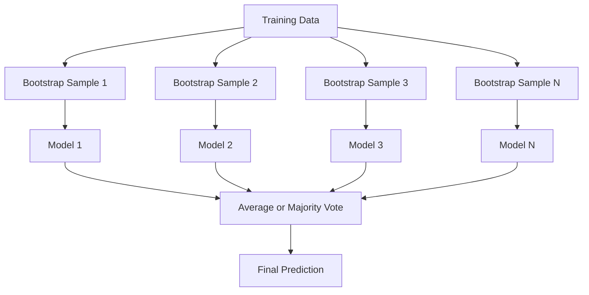
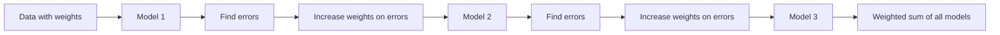
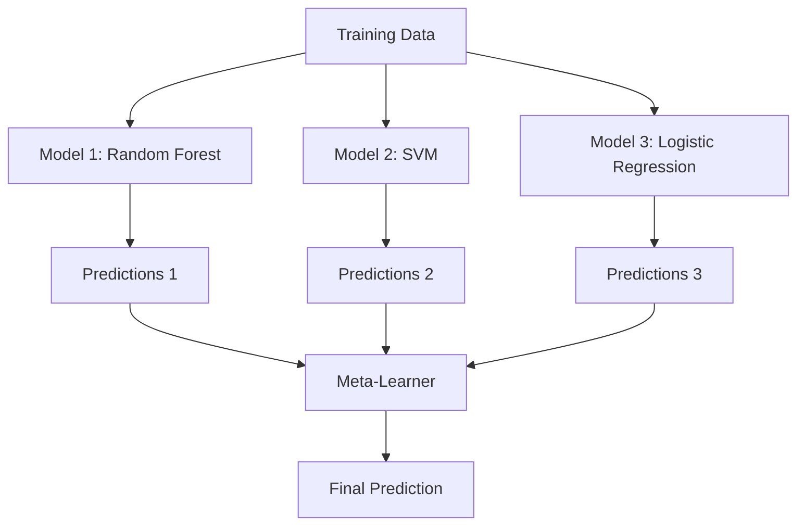

# 앙상블 기법 (Ensemble Methods)

> 약한 학습기(weak learner)들의 집단을 올바르게 결합하면 강한 학습기(strong learner)가 된다. 이것은 비유가 아니다. 정리(theorem)다.

**Type:** Build
**Language:** Python
**Prerequisites:** Phase 2, Lesson 10 (Bias-Variance Tradeoff)
**Time:** ~120분

## 학습 목표 (Learning Objectives)

- AdaBoost와 그래디언트 부스팅(gradient boosting)을 밑바닥부터 구현하고, 부스팅(boosting)이 어떻게 순차적으로 편향(bias)을 줄이는지 설명하기
- 배깅(bagging) 앙상블을 만들고, 상관관계가 제거된 모델을 평균내는 것이 어떻게 편향을 늘리지 않으면서 분산(variance)을 줄이는지 보이기
- 각 기법이 어떤 오차 성분을 겨냥하는지의 관점에서 배깅, 부스팅, 스태킹(stacking)을 비교하기
- 앙상블 다양성(diversity)을 평가하고, 독립적인 약한 학습기가 많아질수록 다수결(majority voting) 정확도가 왜 향상되는지 설명하기

## 문제 (The Problem)

단일 결정 트리(decision tree)는 학습이 빠르고 해석하기 쉽지만 과적합(overfitting)한다. 단일 선형 모델은 복잡한 경계에서 과소적합(underfitting)한다. 완벽한 모델 아키텍처를 설계하느라 며칠을 쓸 수도 있다. 아니면 불완전한 모델 여러 개를 결합해서 개별 모델 그 어느 것보다도 나은 무언가를 얻을 수도 있다.

앙상블 기법(ensemble method)이 정확히 이 일을 한다. 정형 데이터(tabular data)에서 Kaggle 대회를 우승하는 가장 신뢰할 만한 기법이고, 대부분의 프로덕션(production) ML 시스템을 떠받치며, 편향-분산 트레이드오프(bias-variance tradeoff)가 실제로 작동하는 모습을 보여준다. 배깅은 분산을 줄인다. 부스팅은 편향을 줄인다. 스태킹은 어떤 입력에서 어떤 모델을 신뢰할지를 학습한다.

## 개념 (The Concept)

### 앙상블이 작동하는 이유 (Why Ensembles Work)

각각 정확도 p > 0.5인 N개의 독립적인 분류기(classifier)가 있다고 하자. 다수결의 정확도는:

```
P(majority correct) = sum over k > N/2 of C(N,k) * p^k * (1-p)^(N-k)
```

각각 정확도 60%인 21개의 분류기에서 다수결 정확도는 약 74%다. 101개의 분류기에서는 84%로 올라간다. 모델들이 서로 다른 실수를 할 때 오차가 서로 상쇄된다.

핵심 요건은 **다양성(diversity)**이다. 모든 모델이 같은 실수를 한다면 결합해도 아무 도움이 되지 않는다. 앙상블이 작동하는 이유는 다음을 통해 다양한 모델을 만들어내기 때문이다:

- 서로 다른 학습 부분집합(배깅)
- 서로 다른 특성(feature) 부분집합(랜덤 포레스트(random forest))
- 순차적 오차 보정(부스팅)
- 서로 다른 모델 계열(스태킹)

### 배깅 (Bagging, Bootstrap Aggregating)

배깅은 각 모델을 학습 데이터의 서로 다른 부트스트랩(bootstrap) 샘플로 학습시켜 다양성을 만든다.



부트스트랩 샘플은 원본 데이터에서 복원 추출(with replacement)로 뽑으며, 크기는 원본과 같다. 각 부트스트랩에는 고유 샘플의 약 63.2%가 나타난다. 나머지 36.8%(아웃-오브-백(out-of-bag) 샘플)는 공짜 검증 세트를 제공한다.

배깅은 편향을 크게 늘리지 않으면서 분산을 줄인다. 각 개별 트리는 자신의 부트스트랩 샘플에 과적합하지만, 과적합 양상이 트리마다 다르므로 평균을 내면 노이즈가 상쇄된다.

**랜덤 포레스트(Random Forest)**는 추가적인 비틀기를 더한 배깅이다: 각 분할(split)에서 특성의 무작위 부분집합만 고려한다. 이는 트리들 사이에 더욱 큰 다양성을 강제한다. 후보 특성의 전형적인 개수는 분류에서는 `sqrt(n_features)`, 회귀(regression)에서는 `n_features / 3`이다.

### 부스팅 (Boosting, Sequential Error Correction)

부스팅은 모델을 순차적으로 학습시킨다. 각 새 모델은 이전 모델들이 틀린 예제에 집중한다.



부스팅은 편향을 줄인다. 각 새 모델은 지금까지 앙상블의 체계적 오차를 보정한다. 최종 예측은 모든 모델의 가중 합(weighted sum)이며, 더 나은 모델일수록 더 높은 가중치를 받는다.

트레이드오프: 부스팅은 라운드를 너무 많이 돌리면 과적합할 수 있는데, 더 어려운 예제에 계속 맞추려 하기 때문이며 그중 일부는 노이즈일 수 있다.

### AdaBoost

AdaBoost(Adaptive Boosting)는 최초의 실용적 부스팅 알고리즘이었다. 어떤 베이스 학습기와도 동작하며, 전형적으로는 결정 스텀프(decision stump, 깊이 1짜리 트리)를 쓴다.

알고리즘:

```
1. Initialize sample weights: w_i = 1/N for all i

2. For t = 1 to T:
   a. Train weak learner h_t on weighted data
   b. Compute weighted error:
      err_t = sum(w_i * I(h_t(x_i) != y_i)) / sum(w_i)
   c. Compute model weight:
      alpha_t = 0.5 * ln((1 - err_t) / err_t)
   d. Update sample weights:
      w_i = w_i * exp(-alpha_t * y_i * h_t(x_i))
   e. Normalize weights to sum to 1

3. Final prediction: H(x) = sign(sum(alpha_t * h_t(x)))
```

오차가 낮은 모델일수록 더 높은 alpha를 받는다. 잘못 분류된 샘플은 더 높은 가중치를 받으므로 다음 모델이 그것들에 집중한다.

### 그래디언트 부스팅 (Gradient Boosting)

그래디언트 부스팅은 부스팅을 임의의 손실 함수(loss function)로 일반화한다. 샘플의 가중치를 다시 매기는 대신, 각 새 모델을 현재 앙상블의 잔차(residual, 손실의 음의 그래디언트)에 맞춘다.

```
1. Initialize: F_0(x) = argmin_c sum(L(y_i, c))

2. For t = 1 to T:
   a. Compute pseudo-residuals:
      r_i = -dL(y_i, F_{t-1}(x_i)) / dF_{t-1}(x_i)
   b. Fit a tree h_t to the residuals r_i
   c. Find optimal step size:
      gamma_t = argmin_gamma sum(L(y_i, F_{t-1}(x_i) + gamma * h_t(x_i)))
   d. Update:
      F_t(x) = F_{t-1}(x) + learning_rate * gamma_t * h_t(x)

3. Final prediction: F_T(x)
```

제곱 오차(squared error) 손실의 경우 의사 잔차(pseudo-residual)는 그냥 실제 잔차다: `r_i = y_i - F_{t-1}(x_i)`. 각 트리는 말 그대로 이전 앙상블의 오차에 맞춰진다.

학습률(learning rate, 수축(shrinkage))은 각 트리가 얼마나 기여하는지를 제어한다. 더 작은 학습률은 더 많은 트리를 요구하지만 더 잘 일반화한다. 전형적인 값: 0.01부터 0.3까지.

### XGBoost: 정형 데이터를 지배하는 이유 (XGBoost: Why It Dominates Tabular Data)

XGBoost(eXtreme Gradient Boosting)는 빠르고, 정확하며, 과적합에 강하게 만드는 엔지니어링 최적화가 적용된 그래디언트 부스팅이다:

- **정규화된 목적 함수(Regularized objective):** 리프 가중치(leaf weight)에 대한 L1, L2 페널티가 개별 트리가 지나치게 확신하는 것을 막는다
- **2차 근사(Second-order approximation):** 손실의 1차와 2차 도함수(derivative)를 모두 사용해 더 나은 분할 결정을 내린다
- **희소성 인지 분할(Sparsity-aware splits):** 각 분할에서 결측값(missing value)에 대한 최선의 방향을 학습해 결측값을 기본적으로 처리한다
- **열 부분 샘플링(Column subsampling):** 랜덤 포레스트처럼 각 분할에서 특성을 샘플링해 다양성을 만든다
- **가중 분위수 스케치(Weighted quantile sketch):** 분산 데이터에서 연속 특성의 분할점을 효율적으로 찾는다
- **캐시 인지 블록 구조(Cache-aware block structure):** CPU 캐시 라인에 최적화된 메모리 배치

정형 데이터에서 XGBoost(그리고 그 후속인 LightGBM)는 일관되게 신경망(neural network)을 능가하며, 이 구도는 당분간 바뀌지 않는다. 데이터가 행과 열로 된 표에 들어맞는다면 그래디언트 부스팅부터 시작하라.

### 스태킹 (Stacking, Meta-Learning)

스태킹은 여러 베이스 모델의 예측을 메타 학습기(meta-learner)의 특성으로 사용한다.



메타 학습기는 어떤 입력에서 어떤 베이스 모델을 신뢰할지를 학습한다. 랜덤 포레스트가 특정 영역에서 더 낫고 SVM이 다른 영역에서 더 낫다면, 메타 학습기는 그에 따라 라우팅하는 법을 학습한다.

데이터 누수(data leakage)를 피하려면, 베이스 모델 예측을 학습 세트에 대한 교차 검증(cross-validation)으로 생성해야 한다. 베이스 모델을 학습시키고 같은 데이터에서 메타 특성(meta-feature)을 생성하는 일은 결코 하지 않는다.

### 투표 (Voting)

가장 단순한 앙상블이다. 그냥 예측을 직접 결합한다.

- **하드 보팅(Hard voting):** 클래스 레이블(label)에 대한 다수결.
- **소프트 보팅(Soft voting):** 예측된 확률을 평균내어, 평균 확률이 가장 높은 클래스를 고른다. 확신(confidence) 정보를 사용하므로 보통 더 낫다.

## 직접 만들기 (Build It)

### 1단계: 결정 스텀프 (베이스 학습기)

`code/ensembles.py`의 코드는 모든 것을 밑바닥부터 구현한다. 결정 스텀프로 시작한다: 단일 분할을 가진 트리.

```python
class DecisionStump:
    def __init__(self):
        self.feature_idx = None
        self.threshold = None
        self.polarity = 1
        self.alpha = None

    def fit(self, X, y, weights):
        n_samples, n_features = X.shape
        best_error = float("inf")

        for f in range(n_features):
            thresholds = np.unique(X[:, f])
            for thresh in thresholds:
                for polarity in [1, -1]:
                    pred = np.ones(n_samples)
                    pred[polarity * X[:, f] < polarity * thresh] = -1
                    error = np.sum(weights[pred != y])
                    if error < best_error:
                        best_error = error
                        self.feature_idx = f
                        self.threshold = thresh
                        self.polarity = polarity

    def predict(self, X):
        n = X.shape[0]
        pred = np.ones(n)
        idx = self.polarity * X[:, self.feature_idx] < self.polarity * self.threshold
        pred[idx] = -1
        return pred
```

### 2단계: 밑바닥부터 만드는 AdaBoost

```python
class AdaBoostScratch:
    def __init__(self, n_estimators=50):
        self.n_estimators = n_estimators
        self.stumps = []
        self.alphas = []

    def fit(self, X, y):
        n = X.shape[0]
        weights = np.full(n, 1 / n)

        for _ in range(self.n_estimators):
            stump = DecisionStump()
            stump.fit(X, y, weights)
            pred = stump.predict(X)

            err = np.sum(weights[pred != y])
            err = np.clip(err, 1e-10, 1 - 1e-10)

            alpha = 0.5 * np.log((1 - err) / err)
            weights *= np.exp(-alpha * y * pred)
            weights /= weights.sum()

            stump.alpha = alpha
            self.stumps.append(stump)
            self.alphas.append(alpha)

    def predict(self, X):
        total = sum(a * s.predict(X) for a, s in zip(self.alphas, self.stumps))
        return np.sign(total)
```

### 3단계: 밑바닥부터 만드는 그래디언트 부스팅

```python
class GradientBoostingScratch:
    def __init__(self, n_estimators=100, learning_rate=0.1, max_depth=3):
        self.n_estimators = n_estimators
        self.lr = learning_rate
        self.max_depth = max_depth
        self.trees = []
        self.initial_pred = None

    def fit(self, X, y):
        self.initial_pred = np.mean(y)
        current_pred = np.full(len(y), self.initial_pred)

        for _ in range(self.n_estimators):
            residuals = y - current_pred
            tree = SimpleRegressionTree(max_depth=self.max_depth)
            tree.fit(X, residuals)
            update = tree.predict(X)
            current_pred += self.lr * update
            self.trees.append(tree)

    def predict(self, X):
        pred = np.full(X.shape[0], self.initial_pred)
        for tree in self.trees:
            pred += self.lr * tree.predict(X)
        return pred
```

### 4단계: sklearn과 비교

코드는 우리의 밑바닥 구현이 sklearn의 `AdaBoostClassifier`와 `GradientBoostingClassifier`와 비슷한 정확도를 내는지 검증하고, 모든 기법을 나란히 비교한다.

## 라이브러리로 써보기 (Use It)

### 각 기법을 언제 쓸 것인가 (When to Use Each Method)

| 기법 | 줄이는 것 | 적합한 경우 | 주의할 점 |
|--------|---------|----------|---------------|
| 배깅 / 랜덤 포레스트 (Bagging / Random Forest) | 분산 | 노이즈가 많은 데이터, 많은 특성 | 편향에는 도움이 되지 않는다 |
| 에이다부스트 (AdaBoost) | 편향 | 깨끗한 데이터, 단순한 베이스 학습기 | 이상치와 노이즈에 민감하다 |
| 그래디언트 부스팅 (Gradient Boosting) | 편향 | 정형 데이터, 경진 대회 | 학습이 느리고, 튜닝하지 않으면 과적합하기 쉽다 |
| XGBoost / LightGBM | 둘 다 | 프로덕션 정형 데이터 ML | 하이퍼파라미터가 많다 |
| 스태킹 (Stacking) | 둘 다 | 마지막 1-2% 정확도를 얻기 | 복잡하고, 메타 학습기가 과적합할 위험이 있다 |
| 투표 (Voting) | 분산 | 다양한 모델을 빠르게 결합하기 | 모델들이 다양할 때만 도움이 된다 |

### 정형 데이터를 위한 프로덕션 스택 (The Production Stack for Tabular Data)

대부분의 정형 예측 문제에서 시도할 순서는 다음과 같다:

1. 기본 파라미터(parameter)로 **LightGBM 또는 XGBoost**
2. n_estimators, learning_rate, max_depth, min_child_weight를 튜닝한다
3. 마지막 0.5%가 필요하다면, 3-5개의 다양한 모델로 스태킹 앙상블을 만든다
4. 전 과정에서 교차 검증을 사용한다

정형 데이터에서 신경망은 계속되는 연구 시도에도 불구하고 거의 항상 그래디언트 부스팅보다 나쁘다. TabNet, NODE, 그리고 유사한 아키텍처는 가끔 잘 튜닝된 XGBoost와 비등하지만 좀처럼 이기지는 못한다.

## 산출물 (Ship It)

이 레슨이 만들어내는 것: `outputs/prompt-ensemble-selector.md` -- 주어진 데이터셋(dataset)에 맞는 올바른 앙상블 기법을 고르도록 돕는 프롬프트(prompt)다. 데이터의 크기, 특성 유형, 노이즈 수준, 클래스 균형과 풀고 있는 문제를 기술하라. 이 프롬프트는 의사결정 체크리스트를 따라가며 기법을 추천하고, 시작 하이퍼파라미터(hyperparameter)를 제안하며, 그 기법에서 흔한 실수를 경고한다. 또한 전체 선택 가이드가 담긴 `outputs/skill-ensemble-builder.md`도 만들어낸다.

## 연습 문제 (Exercises)

1. AdaBoost 구현을 수정해 각 라운드 후의 학습 정확도를 추적하라. 추정기(estimator) 수에 대한 정확도를 그려라. 언제 수렴(converge)하는가?

2. 회귀 트리에 무작위 특성 부분 샘플링을 추가해 랜덤 포레스트를 밑바닥부터 구현하라. `max_features=sqrt(n_features)`로 100개의 트리를 학습시키고 예측을 평균내라. 단일 트리와 분산 감소를 비교하라.

3. 그래디언트 부스팅 구현에 조기 종료(early stopping)를 추가하라: 각 라운드 후의 검증 손실을 추적하고, 연속 10라운드 동안 개선되지 않으면 멈춘다. 실제로 몇 개의 트리가 필요한가?

4. 세 개의 베이스 모델(로지스틱 회귀(logistic regression), 결정 트리, k-최근접 이웃(k-nearest neighbors))과 로지스틱 회귀 메타 학습기로 스태킹 앙상블을 만들어라. 5-겹 교차 검증(5-fold cross-validation)으로 메타 특성을 생성하라. 각 베이스 모델 단독과 비교하라.

5. 기본 파라미터로 같은 데이터셋에 XGBoost를 실행하라. 정확도를 앞서 만든 밑바닥 그래디언트 부스팅과 비교하라. 둘의 시간을 재라. 속도 차이는 얼마나 큰가?

## 핵심 용어 (Key Terms)

| 용어 | 흔히 하는 말 | 실제 의미 |
|------|----------------|----------------------|
| 배깅 (Bagging) | "무작위 부분집합으로 학습한다" | 부트스트랩 애그리게이팅: 부트스트랩 샘플로 모델들을 학습시키고 예측을 평균내어 분산을 줄인다 |
| 부스팅 (Boosting) | "어려운 예제에 집중한다" | 모델을 순차적으로 학습시키되 각 모델이 지금까지 앙상블의 오차를 교정하여 편향을 줄인다 |
| 에이다부스트 (AdaBoost) | "데이터에 가중치를 다시 매긴다" | 샘플 가중치 갱신을 통한 부스팅. 오분류된 점들은 다음 학습기를 위해 더 높은 가중치를 받는다 |
| 그래디언트 부스팅 (Gradient boosting) | "잔차를 적합한다" | 각 새 모델을 손실 함수의 음의 그래디언트에 적합하는 부스팅이다 |
| XGBoost | "캐글의 무기" | 정규화, 2차 최적화, 시스템 수준의 속도 기법을 갖춘 그래디언트 부스팅이다 |
| 스태킹 (Stacking) | "모델 위의 모델" | 베이스 모델들의 예측을 메타 학습기의 입력 특성으로 사용한다 |
| 랜덤 포레스트 (Random forest) | "여러 개의 무작위화된 트리" | 결정 트리에 적용한 배깅에, 다양성을 위해 각 분할마다 무작위 특성 부분 샘플링을 더한 것이다 |
| 앙상블 다양성 (Ensemble diversity) | "서로 다른 실수를 한다" | 앙상블이 개별 모델보다 나아지려면 모델들의 오차가 서로 상관되지 않아야 한다 |
| OOB 오차 (Out-of-bag error) | "공짜 검증" | 부트스트랩 추출에 포함되지 않은 샘플들(~36.8%)이 별도의 홀드아웃 없이 검증 세트 역할을 한다 |

## 더 읽을거리 (Further Reading)

- [Schapire & Freund: Boosting: Foundations and Algorithms](https://mitpress.mit.edu/9780262526036/) -- AdaBoost 창시자들이 쓴 책
- [Friedman: Greedy Function Approximation: A Gradient Boosting Machine (2001)](https://statweb.stanford.edu/~jhf/ftp/trebst.pdf) -- 원조 그래디언트 부스팅 논문
- [Chen & Guestrin: XGBoost (2016)](https://arxiv.org/abs/1603.02754) -- XGBoost 논문
- [Wolpert: Stacked Generalization (1992)](https://www.sciencedirect.com/science/article/abs/pii/S0893608005800231) -- 원조 스태킹 논문
- [scikit-learn Ensemble Methods](https://scikit-learn.org/stable/modules/ensemble.html) -- 실용 레퍼런스
