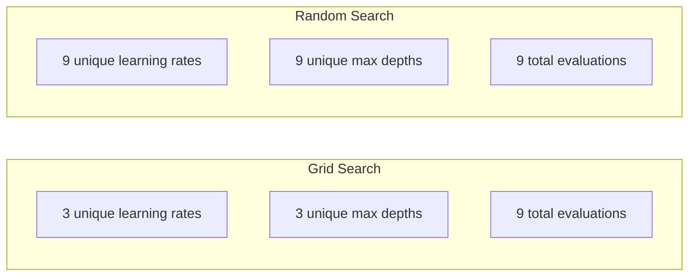
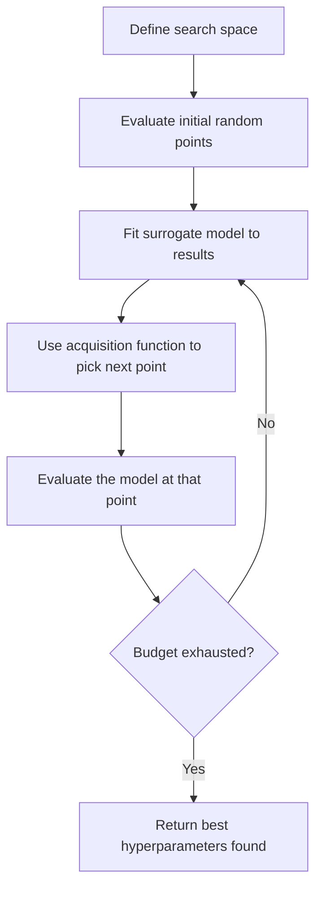
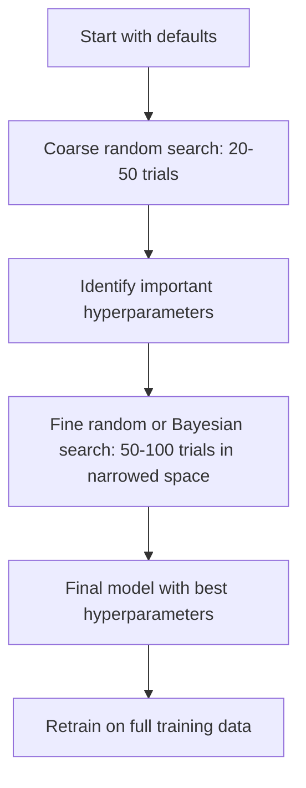
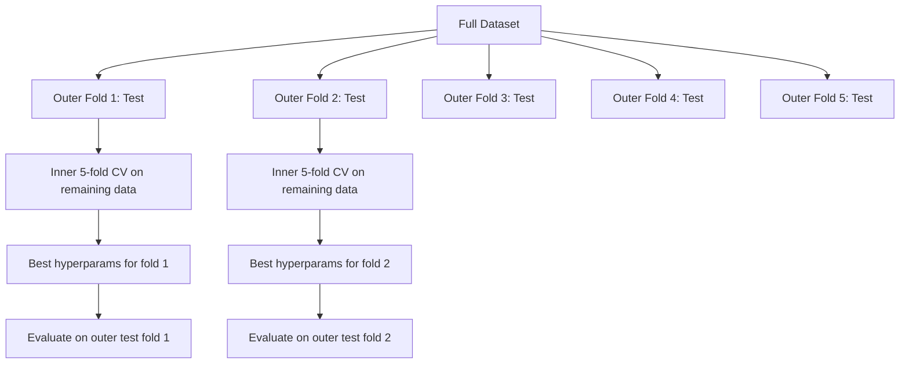

# 하이퍼파라미터 튜닝 (Hyperparameter Tuning)

> 하이퍼파라미터(hyperparameter)는 학습이 시작되기 전에 돌리는 손잡이다. 이것을 잘 돌리는 것이 평범한 모델과 훌륭한 모델을 가르는 차이다.

**Type:** Build
**Language:** Python
**Prerequisites:** Phase 2, Lesson 11 (Ensemble Methods)
**Time:** ~90분

## 학습 목표 (Learning Objectives)

- 그리드 서치(grid search), 랜덤 서치(random search), 베이지안 최적화(Bayesian optimization)를 밑바닥부터 구현하고 그 샘플 효율성을 비교하기
- 대부분의 하이퍼파라미터가 낮은 유효 차원(effective dimensionality)을 가질 때 왜 랜덤 서치가 그리드 서치를 능가하는지 설명하기
- 대리 모델(surrogate model)과 획득 함수(acquisition function)를 사용해 탐색을 안내하는 베이지안 최적화 루프 만들기
- 적절한 교차 검증(cross-validation)을 통해 검증 세트에 과적합(overfitting)하지 않는 하이퍼파라미터 튜닝 전략 설계하기

## 문제 (The Problem)

그래디언트 부스팅(gradient boosting) 모델에 학습률(learning rate), 트리 개수, 최대 깊이, 리프당 최소 샘플 수, 부분 샘플 비율, 열 샘플 비율이 있다고 하자. 하이퍼파라미터가 여섯 개다. 각각 합리적인 값이 5개씩 있다면, 그리드는 5^6 = 15,625개의 조합이 된다. 하나당 학습에 10초가 걸린다. 모두 시도하려면 43시간의 연산이 든다.

그리드 서치는 명백한 접근법이자 규모가 커지면 최악의 접근법이다. 랜덤 서치는 더 적은 연산으로 더 잘한다. 베이지안 최적화는 과거 평가로부터 학습해서 더욱 잘한다. 어떤 전략을 쓸지, 그리고 어떤 하이퍼파라미터가 실제로 중요한지를 아는 것이 며칠의 낭비된 GPU 시간을 절약한다.

## 개념 (The Concept)

### 파라미터 vs 하이퍼파라미터 (Parameters vs Hyperparameters)

파라미터(parameter)는 학습 중에 학습된다(가중치(weight), 편향(bias), 분할 임계값). 하이퍼파라미터는 학습이 시작되기 전에 설정되며 학습이 어떻게 일어나는지를 제어한다.

| 하이퍼파라미터 | 제어하는 것 | 일반적 범위 |
|---------------|-----------------|---------------|
| 학습률 (Learning rate) | 갱신당 스텝 크기 | 0.001 ~ 1.0 |
| 트리/에폭 수 (Number of trees/epochs) | 얼마나 오래 학습할지 | 10 ~ 10,000 |
| 최대 깊이 (Max depth) | 모델 복잡도 | 1 ~ 30 |
| 정규화 (Regularization, lambda) | 과적합 방지 | 0.0001 ~ 100 |
| 배치 크기 (Batch size) | 그래디언트 추정 노이즈 | 16 ~ 512 |
| 드롭아웃 비율 (Dropout rate) | 비활성화되는 뉴런의 비율 | 0.0 ~ 0.5 |

### 그리드 서치 (Grid Search)

그리드 서치는 지정된 값들의 모든 조합을 평가한다. 완전 탐색이며 이해하기 쉽지만, 하이퍼파라미터 개수에 따라 지수적으로 확장된다.

```
Grid for 2 hyperparameters:

  learning_rate: [0.01, 0.1, 1.0]
  max_depth:     [3, 5, 7]

  Evaluations: 3 x 3 = 9 combinations

  (0.01, 3)  (0.01, 5)  (0.01, 7)
  (0.1,  3)  (0.1,  5)  (0.1,  7)
  (1.0,  3)  (1.0,  5)  (1.0,  7)
```

그리드 서치에는 근본적인 결함이 있다: 한 하이퍼파라미터는 중요하고 다른 하나는 중요하지 않다면, 대부분의 평가가 낭비된다. 9번 평가하고도 중요한 파라미터의 고유 값은 단 3개만 얻는다.

### 랜덤 서치 (Random Search)

랜덤 서치는 그리드 대신 분포에서 하이퍼파라미터를 샘플링한다. 같은 9번의 평가 예산으로 각 하이퍼파라미터의 고유 값을 9개 얻는다.



랜덤이 그리드를 이기는 이유(Bergstra & Bengio, 2012):

- 대부분의 하이퍼파라미터는 낮은 유효 차원을 갖는다. 주어진 문제에서 6개 중 보통 1-2개만 중요하다.
- 그리드 서치는 중요하지 않은 차원에 평가를 낭비한다.
- 랜덤 서치는 같은 예산으로 중요한 차원을 더 조밀하게 덮는다.
- 60회의 무작위 시도에서, (탐색 공간 안에 최적점이 존재한다면) 최적점의 5% 이내에 있는 점을 찾을 확률이 95%다.

### 베이지안 최적화 (Bayesian Optimization)

랜덤 서치는 결과를 무시한다. 높은 학습률이 발산을 일으킨다거나 깊이 3이 깊이 10을 일관되게 능가한다는 것을 학습하지 못한다. 베이지안 최적화는 과거 평가를 사용해 다음에 어디를 탐색할지 결정한다.



두 가지 핵심 구성 요소:

**대리 모델(Surrogate model):** 비싼 목적 함수(objective function)를 근사하는, 평가가 저렴한 모델(보통 가우시안 프로세스(Gaussian process))이다. 탐색 공간의 임의 지점에서 예측과 불확실성 추정 둘 다를 제공한다.

**획득 함수(Acquisition function):** 활용(exploitation, 알려진 좋은 점 근처를 탐색)과 탐험(exploration, 불확실성이 높은 곳을 탐색)의 균형을 맞춰 다음에 어디를 평가할지 결정한다. 흔한 선택지:

- **기대 개선(Expected Improvement, EI):** 이 지점에서 현재 최적값 대비 얼마나 개선될 것으로 기대하는가?
- **상한 신뢰 구간(Upper Confidence Bound, UCB):** 예측에 불확실성의 배수를 더한 값. 높은 UCB는 유망하거나 미탐험됐다는 뜻이다.
- **개선 확률(Probability of Improvement, PI):** 이 지점이 현재 최적값을 이길 확률은 얼마인가?

베이지안 최적화는 보통 랜덤 서치보다 2-5배 적은 평가로 더 나은 하이퍼파라미터를 찾는다. 대리 모델을 적합하는 오버헤드는 실제 모델을 학습하는 것에 비하면 무시할 만하다.

### 조기 종료 (Early Stopping)

모든 학습 실행이 끝까지 갈 필요는 없다. 어떤 구성이 10에폭(epoch) 후에 명백히 나쁘다면, 멈추고 넘어가라. 이것이 하이퍼파라미터 탐색 맥락에서의 조기 종료(early stopping)다.

전략:
- **인내 기반(Patience-based):** 검증 손실(validation loss)이 연속 N에폭 동안 개선되지 않으면 멈춘다
- **중앙값 가지치기(Median pruning):** 해당 시도(trial)의 중간 결과가 같은 스텝에서 완료된 시도들의 중앙값보다 나쁘면 멈춘다
- **하이퍼밴드(Hyperband):** 많은 구성에 작은 예산을 할당한 뒤, 가장 좋은 것들에 점진적으로 예산을 늘린다

하이퍼밴드는 특히 효과적이다. 81개의 구성을 각각 1에폭으로 시작해, 상위 1/3을 유지하고, 그것들에 3에폭을 주고, 다시 상위 1/3을 유지하는 식으로 진행한다. 이렇게 하면 모든 구성을 전체 예산으로 평가하는 것보다 좋은 구성을 10-50배 빠르게 찾는다.

### 학습률 스케줄러 (Learning Rate Schedulers)

학습률은 거의 항상 가장 중요한 하이퍼파라미터다. 고정해 두는 대신, 스케줄러는 학습 중에 학습률을 조정한다.

| 스케줄러 | 공식 | 사용 시기 |
|-----------|---------|-------------|
| 스텝 감쇠 (Step decay) | N 에폭마다 0.1을 곱한다 | 전통적 CNN 학습 |
| 코사인 어닐링 (Cosine annealing) | lr * 0.5 * (1 + cos(pi * t / T)) | 현대적 기본값 |
| 워밍업 + 감쇠 (Warmup + decay) | 선형 증가 후 코사인 감쇠 | 트랜스포머 |
| 원사이클 (One-cycle) | 한 사이클에 걸쳐 증가 후 감소 | 빠른 수렴 |
| 정체 시 감소 (Reduce on plateau) | 지표가 정체되면 일정 배수만큼 감소 | 안전한 기본값 |

### 하이퍼파라미터 중요도 (Hyperparameter Importance)

모든 하이퍼파라미터가 똑같이 중요한 것은 아니다. 랜덤 포레스트(random forest)(Probst et al., 2019)와 그래디언트 부스팅에 대한 연구는 일관된 패턴을 보여준다:

**높은 중요도:**
- 학습률(항상 먼저 튜닝한다)
- 추정기(estimator) / 에폭 수(튜닝 대신 조기 종료를 쓴다)
- 정규화(regularization) 강도

**중간 중요도:**
- 최대 깊이 / 층(layer) 수
- 리프당 최소 샘플 수 / 가중치 감쇠(weight decay)
- 부분 샘플 비율

**낮은 중요도:**
- 최대 특성(feature) 수(랜덤 포레스트의 경우)
- 특정 활성화 함수(activation function) 선택
- 배치(batch) 크기(합리적인 범위 내에서)

중요한 것을 먼저 튜닝하고, 나머지는 기본값으로 둔다.

### 실전 전략 (Practical Strategy)



구체적인 워크플로우:

1. **라이브러리 기본값으로 시작한다.** 숙련된 실무자들이 고른 값이며 종종 목표의 80%까지 와 있다.
2. **거친 랜덤 서치.** 넓은 범위, 20-50회의 시도. 조기 종료로 나쁜 실행을 빠르게 죽인다.
3. **결과를 분석한다.** 어떤 하이퍼파라미터가 성능과 상관관계가 있는가? 탐색 공간을 좁힌다.
4. **세밀한 탐색.** 좁힌 공간에서 베이지안 최적화 또는 집중된 랜덤 서치. 50-100회의 시도.
5. 찾은 최적의 하이퍼파라미터로 **모든 학습 데이터에 대해 재학습한다.**

### 교차 검증 통합 (Cross-Validation Integration)

단일 검증 분할에서 하이퍼파라미터를 튜닝하는 것은 위험하다. 최적의 하이퍼파라미터가 특정 검증 폴드(fold)에 과적합할 수 있다. 중첩 교차 검증(nested cross-validation)은 두 개의 루프로 이를 해결한다:

- **외부 루프(Outer loop, 평가):** 데이터를 학습+검증과 테스트로 나눈다. 편향 없는 성능을 보고한다.
- **내부 루프(Inner loop, 튜닝):** 학습+검증을 학습과 검증으로 나눈다. 최적의 하이퍼파라미터를 찾는다.



각 외부 폴드는 자신의 최적 하이퍼파라미터를 독립적으로 찾는다. 외부 점수는 일반화 성능의 편향 없는 추정치다.

sklearn으로:

```python
from sklearn.model_selection import cross_val_score, GridSearchCV
from sklearn.ensemble import GradientBoostingRegressor

inner_cv = GridSearchCV(
    GradientBoostingRegressor(),
    param_grid={
        "learning_rate": [0.01, 0.05, 0.1],
        "max_depth": [2, 3, 5],
        "n_estimators": [50, 100, 200],
    },
    cv=5,
    scoring="neg_mean_squared_error",
)

outer_scores = cross_val_score(
    inner_cv, X, y, cv=5, scoring="neg_mean_squared_error"
)

print(f"Nested CV MSE: {-outer_scores.mean():.4f} +/- {outer_scores.std():.4f}")
```

이는 비싸지만(외부 폴드 5개 x 내부 폴드 5개 x 그리드 점 27개 = 675회의 모델 적합), 신뢰할 만한 성능 추정치를 준다. 논문에서 최종 결과를 보고할 때나 결정의 이해관계가 클 때 사용하라.

### 실전 팁 (Practical Tips)

**학습률부터 시작하라.** 경사 기반(gradient-based) 방법에서는 항상 가장 중요한 하이퍼파라미터다. 나쁜 학습률은 나머지 모든 것을 무의미하게 만든다. 다른 하이퍼파라미터를 기본값으로 고정하고 학습률부터 훑어라.

**학습률과 정규화에는 로그-균등(log-uniform) 분포를 써라.** 0.001과 0.01의 차이는 0.1과 1.0의 차이만큼이나 중요하다. 선형으로 탐색하면 큰 쪽 끝에 예산을 낭비한다.

**n_estimators를 튜닝하는 대신 조기 종료를 써라.** 부스팅과 신경망(neural network)에서는 n_estimators나 에폭을 높게 설정하고 조기 종료가 언제 멈출지 결정하게 하라. 이렇게 하면 탐색에서 하이퍼파라미터 하나가 빠진다.

**예산 배분.** 튜닝 예산의 60%를 가장 중요한 상위 2개 하이퍼파라미터에 쓴다. 나머지 40%를 나머지 전부에 쓴다. 상위 2개가 대부분의 성능 변동을 설명한다.

**스케일이 중요하다.** 배치 크기를 로그 스케일로 탐색하지 말라(16, 32, 64면 충분하다). 학습률은 항상 로그 스케일로 탐색하라. 탐색 분포를 하이퍼파라미터가 모델에 영향을 미치는 방식에 맞춰라.

| 모델 유형 | 주요 하이퍼파라미터 | 권장 탐색 | 예산 |
|-----------|--------------------|--------------------|--------|
| 랜덤 포레스트 (Random Forest) | n_estimators, max_depth, min_samples_leaf | 랜덤 서치, 50회 시도 | 낮음 (빠른 학습) |
| 그래디언트 부스팅 (Gradient Boosting) | learning_rate, n_estimators, max_depth | 베이지안, 100회 시도 + 조기 종료 | 중간 |
| 신경망 (Neural Network) | learning_rate, weight_decay, batch_size | 베이지안 또는 랜덤, 100회 이상 시도 | 높음 (느린 학습) |
| SVM | C, gamma (RBF 커널) | 로그 스케일 그리드, 25-50회 시도 | 낮음 (파라미터 2개) |
| Lasso/Ridge | alpha | 로그 스케일 1차원 탐색, 20회 시도 | 매우 낮음 |
| XGBoost | learning_rate, max_depth, subsample, colsample | 베이지안, 100-200회 시도 + 조기 종료 | 중간 |

**확신이 안 설 때:** 하이퍼파라미터 개수의 2배를 시도 횟수로 하는 랜덤 서치를 쓴다(예: 하이퍼파라미터 6개 = 최소 12회 이상의 시도). 50회의 시도를 하는 랜덤 서치가 정성껏 설계한 그리드 서치를 얼마나 자주 이기는지 보면 놀랄 것이다.

## 직접 만들기 (Build It)

### 1단계: 밑바닥부터 만드는 그리드 서치

`code/tuning.py`의 코드는 그리드 서치, 랜덤 서치, 그리고 간단한 베이지안 옵티마이저(optimizer)를 밑바닥부터 구현한다.

```python
def grid_search(model_fn, param_grid, X_train, y_train, X_val, y_val):
    keys = list(param_grid.keys())
    values = list(param_grid.values())
    best_score = -float("inf")
    best_params = None
    n_evals = 0

    for combo in itertools.product(*values):
        params = dict(zip(keys, combo))
        model = model_fn(**params)
        model.fit(X_train, y_train)
        score = evaluate(model, X_val, y_val)
        n_evals += 1

        if score > best_score:
            best_score = score
            best_params = params

    return best_params, best_score, n_evals
```

### 2단계: 밑바닥부터 만드는 랜덤 서치

```python
def random_search(model_fn, param_distributions, X_train, y_train,
                  X_val, y_val, n_iter=50, seed=42):
    rng = np.random.RandomState(seed)
    best_score = -float("inf")
    best_params = None

    for _ in range(n_iter):
        params = {k: sample(v, rng) for k, v in param_distributions.items()}
        model = model_fn(**params)
        model.fit(X_train, y_train)
        score = evaluate(model, X_val, y_val)

        if score > best_score:
            best_score = score
            best_params = params

    return best_params, best_score, n_iter
```

### 3단계: 베이지안 최적화 (단순화 버전)

핵심 아이디어: 관측된 (하이퍼파라미터, 점수) 쌍에 가우시안 프로세스를 적합한 뒤, 획득 함수를 사용해 다음에 어디를 볼지 결정한다.

```python
class SimpleBayesianOptimizer:
    def __init__(self, search_space, n_initial=5):
        self.search_space = search_space
        self.n_initial = n_initial
        self.X_observed = []
        self.y_observed = []

    def _kernel(self, x1, x2, length_scale=1.0):
        dists = np.sum((x1[:, None, :] - x2[None, :, :]) ** 2, axis=2)
        return np.exp(-0.5 * dists / length_scale ** 2)

    def _fit_gp(self, X_new):
        X_obs = np.array(self.X_observed)
        y_obs = np.array(self.y_observed)
        y_mean = y_obs.mean()
        y_centered = y_obs - y_mean

        K = self._kernel(X_obs, X_obs) + 1e-4 * np.eye(len(X_obs))
        K_star = self._kernel(X_new, X_obs)

        L = np.linalg.cholesky(K)
        alpha = np.linalg.solve(L.T, np.linalg.solve(L, y_centered))
        mu = K_star @ alpha + y_mean

        v = np.linalg.solve(L, K_star.T)
        var = 1.0 - np.sum(v ** 2, axis=0)
        var = np.maximum(var, 1e-6)

        return mu, var

    def _expected_improvement(self, mu, var, best_y):
        sigma = np.sqrt(var)
        z = (mu - best_y) / (sigma + 1e-10)
        ei = sigma * (z * norm_cdf(z) + norm_pdf(z))
        return ei

    def suggest(self):
        if len(self.X_observed) < self.n_initial:
            return sample_random(self.search_space)

        candidates = [sample_random(self.search_space) for _ in range(500)]
        X_cand = np.array([to_vector(c) for c in candidates])
        mu, var = self._fit_gp(X_cand)
        ei = self._expected_improvement(mu, var, max(self.y_observed))
        return candidates[np.argmax(ei)]

    def observe(self, params, score):
        self.X_observed.append(to_vector(params))
        self.y_observed.append(score)
```

GP 대리 모델은 각 후보 지점에서 두 가지를 준다: 예측 점수(mu)와 불확실성(var). 기대 개선은 이 둘의 균형을 잡는다: 모델이 높은 점수를 예측하는 지점, 또는 불확실성이 높은 지점을 선호한다. 초기에는 대부분의 지점이 높은 불확실성을 가지므로 옵티마이저가 탐험한다. 나중에는 가장 유망한 영역에 집중한다.

### 4단계: 모든 기법 비교

같은 합성 목적 함수로 세 기법을 모두 실행하고 비교한다. 이 비교는 직접적인 목적 함수로 각 옵티마이저를 호출하는(모델 학습 없음) 단순화된 래퍼를 사용하므로, API가 위의 모델 기반 구현과 다르다:

```python
def synthetic_objective(params):
    lr = params["learning_rate"]
    depth = params["max_depth"]
    return -(np.log10(lr) + 2) ** 2 - (depth - 4) ** 2 + 10

param_grid = {
    "learning_rate": [0.001, 0.01, 0.1, 1.0],
    "max_depth": [2, 3, 4, 5, 6, 7, 8],
}

grid_best = None
grid_score = -float("inf")
grid_history = []
for combo in itertools.product(*param_grid.values()):
    params = dict(zip(param_grid.keys(), combo))
    score = synthetic_objective(params)
    grid_history.append((params, score))
    if score > grid_score:
        grid_score = score
        grid_best = params

param_dist = {
    "learning_rate": ("log_float", 0.001, 1.0),
    "max_depth": ("int", 2, 8),
}

rand_best = None
rand_score = -float("inf")
rand_history = []
rng = np.random.RandomState(42)
for _ in range(28):
    params = {k: sample(v, rng) for k, v in param_dist.items()}
    score = synthetic_objective(params)
    rand_history.append((params, score))
    if score > rand_score:
        rand_score = score
        rand_best = params

optimizer = SimpleBayesianOptimizer(param_dist, n_initial=5)
bayes_history = []
for _ in range(28):
    params = optimizer.suggest()
    score = synthetic_objective(params)
    optimizer.observe(params, score)
    bayes_history.append((params, score))
bayes_score = max(s for _, s in bayes_history)

print(f"{'Method':<20} {'Best Score':>12} {'Evaluations':>12}")
print("-" * 50)
print(f"{'Grid Search':<20} {grid_score:>12.4f} {len(grid_history):>12}")
print(f"{'Random Search':<20} {rand_score:>12.4f} {len(rand_history):>12}")
print(f"{'Bayesian Opt':<20} {bayes_score:>12.4f} {len(bayes_history):>12}")
```

같은 예산이라면, 베이지안 최적화는 명백히 나쁜 영역에서 평가를 낭비하지 않으므로 보통 최적 점수를 가장 빠르게 찾는다. 랜덤 서치는 그리드 서치보다 더 넓은 지면을 덮는다. 그리드 서치는 하이퍼파라미터가 매우 적고 완전 탐색을 감당할 수 있을 때만 이긴다.

## 라이브러리로 써보기 (Use It)

### 실전 Optuna (Optuna in Practice)

Optuna는 진지한 하이퍼파라미터 튜닝에 권장되는 라이브러리다. 가지치기(pruning), 분산 탐색, 시각화를 기본으로 지원한다.

```python
import optuna

def objective(trial):
    lr = trial.suggest_float("learning_rate", 1e-4, 1e-1, log=True)
    n_est = trial.suggest_int("n_estimators", 50, 500)
    max_depth = trial.suggest_int("max_depth", 2, 10)

    model = GradientBoostingRegressor(
        learning_rate=lr,
        n_estimators=n_est,
        max_depth=max_depth,
    )
    model.fit(X_train, y_train)
    return mean_squared_error(y_val, model.predict(X_val))

study = optuna.create_study(direction="minimize")
study.optimize(objective, n_trials=100)

print(f"Best params: {study.best_params}")
print(f"Best MSE: {study.best_value:.4f}")
```

Optuna 핵심 기능:
- 로그 스케일로 탐색하는 것이 가장 좋은 파라미터(학습률, 정규화)를 위한 `suggest_float(..., log=True)`
- 정수 파라미터를 위한 `suggest_int`
- 이산 선택을 위한 `suggest_categorical`
- 나쁜 시도의 조기 종료를 위한 내장 MedianPruner
- 분석을 위한 `study.trials_dataframe()`

### 가지치기를 동반한 Optuna (Optuna with Pruning)

가지치기는 유망하지 않은 시도를 일찍 멈춰서 막대한 연산을 절약한다. 패턴은 다음과 같다:

```python
import optuna
from sklearn.model_selection import cross_val_score

def objective(trial):
    params = {
        "learning_rate": trial.suggest_float("lr", 1e-4, 0.5, log=True),
        "max_depth": trial.suggest_int("max_depth", 2, 10),
        "n_estimators": trial.suggest_int("n_estimators", 50, 500),
        "subsample": trial.suggest_float("subsample", 0.5, 1.0),
    }

    model = GradientBoostingRegressor(**params)
    scores = cross_val_score(model, X_train, y_train, cv=3,
                             scoring="neg_mean_squared_error")
    mean_score = -scores.mean()

    trial.report(mean_score, step=0)
    if trial.should_prune():
        raise optuna.TrialPruned()

    return mean_score

pruner = optuna.pruners.MedianPruner(n_startup_trials=10, n_warmup_steps=5)
study = optuna.create_study(direction="minimize", pruner=pruner)
study.optimize(objective, n_trials=200)
```

`MedianPruner`는 어떤 시도의 중간 값이 같은 스텝에서 완료된 모든 시도의 중앙값보다 나쁘면 그 시도를 멈춘다. 가지치기를 쓰려면 중간 지표를 보고하는 `trial.report()` 호출과 시도를 멈춰야 할지 확인하는 `trial.should_prune()` 호출이 필요하다. `n_startup_trials=10`은 가지치기가 작동하기 전에 최소 10개의 시도가 완전히 완료되도록 보장한다. 이렇게 하면 보통 전체 연산의 40-60%가 절약된다.

### sklearn의 내장 튜너 (sklearn's Built-in Tuners)

빠른 실험을 위해 sklearn은 `GridSearchCV`, `RandomizedSearchCV`, `HalvingRandomSearchCV`를 제공한다:

```python
from sklearn.model_selection import RandomizedSearchCV
from scipy.stats import loguniform, randint

param_dist = {
    "learning_rate": loguniform(1e-4, 0.5),
    "max_depth": randint(2, 10),
    "n_estimators": randint(50, 500),
}

search = RandomizedSearchCV(
    GradientBoostingRegressor(),
    param_dist,
    n_iter=100,
    cv=5,
    scoring="neg_mean_squared_error",
    random_state=42,
    n_jobs=-1,
)
search.fit(X_train, y_train)
print(f"Best params: {search.best_params_}")
print(f"Best CV MSE: {-search.best_score_:.4f}")
```

학습률과 정규화에는 scipy의 `loguniform`을 써라. 정수 하이퍼파라미터에는 `randint`를 써라. `n_jobs=-1` 플래그는 모든 CPU 코어에 걸쳐 병렬화한다.

### 하이퍼파라미터 튜닝에서 흔한 실수 (Common Mistakes in Hyperparameter Tuning)

**전처리를 통한 데이터 누수(data leakage).** 교차 검증 전에 전체 데이터셋(dataset)에 스케일러를 적합하면, 검증 폴드의 정보가 학습으로 새어 든다. 항상 전처리를 `Pipeline` 안에 넣어 학습 폴드에서만 적합되게 하라.

**검증 세트에 대한 과적합.** 수천 번의 시도를 실행하면 사실상 검증 세트로 학습하게 된다. 최종 성능 추정에는 중첩 교차 검증을 쓰거나, 튜닝 중 절대 건드리지 않는 별도의 테스트 세트를 떼어 두어라.

**너무 좁은 범위를 탐색하기.** 최적값이 탐색 공간의 경계에 있다면, 충분히 넓게 탐색하지 않은 것이다. 최적값이 범위 밖에 있을 수 있다. 항상 최적 파라미터가 가장자리에 있는지 확인하라.

**상호작용 효과 무시하기.** 학습률과 추정기 개수는 부스팅에서 강하게 상호작용한다. 낮은 학습률은 더 많은 추정기를 필요로 한다. 이것들을 독립적으로 튜닝하면 함께 튜닝하는 것보다 나쁜 결과가 나온다.

**반복적 모델에 조기 종료를 쓰지 않기.** 그래디언트 부스팅과 신경망에서는 n_estimators나 에폭을 높은 값으로 설정하고 조기 종료를 쓴다. 이것이 반복 횟수를 하이퍼파라미터로 튜닝하는 것보다 엄격히 더 낫다.

## 연습 문제 (Exercises)

1. 같은 전체 예산(예: 50회의 평가)으로 그리드 서치와 랜덤 서치를 실행하라. 찾은 최적 점수를 비교하라. 서로 다른 시드(seed)로 실험을 10번 실행하라. 랜덤 서치가 얼마나 자주 이기는가?

2. 하이퍼밴드를 밑바닥부터 구현하라. 81개의 구성으로 시작해 각각 1에폭씩 학습한다. 각 라운드에서 상위 1/3을 유지하고 예산을 3배로 늘린다. 전체 연산(모든 구성에 걸친 모든 에폭의 합)을 81개 구성을 전체 예산으로 실행하는 것과 비교하라.

3. Lesson 11의 그래디언트 부스팅 구현에 학습률 스케줄러(코사인 어닐링(cosine annealing))를 추가하라. 고정 학습률에 비해 도움이 되는가?

4. Optuna를 사용해 실제 데이터셋(예: sklearn의 유방암 데이터셋)에서 RandomForestClassifier를 튜닝하라. `optuna.visualization.plot_param_importances(study)`를 사용해 어떤 하이퍼파라미터가 가장 중요한지 보라. 이 레슨의 중요도 순위와 일치하는가?

5. 간단한 획득 함수(기대 개선)를 구현하고 탐험 대 활용을 보여라. 대리 모델의 평균과 불확실성을 그리고, EI가 다음에 어디를 평가하기로 선택하는지 보여라.

## 핵심 용어 (Key Terms)

| 용어 | 흔히 하는 말 | 실제 의미 |
|------|----------------|----------------------|
| 하이퍼파라미터 (Hyperparameter) | "당신이 고르는 설정" | 데이터로부터 학습되지 않고, 학습 과정을 제어하기 위해 학습 전에 설정하는 값이다 |
| 그리드 서치 (Grid search) | "모든 조합을 시도한다" | 지정된 파라미터 그리드에 대한 완전 탐색. 비용이 지수적으로 증가한다. |
| 랜덤 서치 (Random search) | "그냥 무작위로 샘플링한다" | 분포로부터 하이퍼파라미터를 샘플링한다. 중요한 차원을 그리드 서치보다 잘 커버한다. |
| 베이지안 최적화 (Bayesian optimization) | "똑똑한 탐색" | 목적 함수의 대리 모델을 사용해 다음에 어디를 평가할지 결정하며, 탐험과 활용의 균형을 맞춘다 |
| 대리 모델 (Surrogate model) | "값싼 근사" | 관측된 평가들로부터 비싼 목적 함수를 근사하는 모델(보통 가우시안 프로세스)이다 |
| 획득 함수 (Acquisition function) | "다음에 어디를 볼지" | 기대 개선과 불확실성의 균형을 맞춰 후보 점들에 점수를 매긴다. EI와 UCB가 흔한 선택지다. |
| 조기 종료 (Early stopping) | "시간 낭비를 멈춰라" | 검증 성능이 더 이상 개선되지 않을 때 학습을 일찍 종료한다 |
| 하이퍼밴드 (Hyperband) | "설정들의 토너먼트 대진표" | 적응적 자원 할당: 많은 설정을 작은 예산으로 시작하고, 가장 좋은 것들을 남겨 예산을 늘린다 |
| 학습률 스케줄러 (Learning rate scheduler) | "학습 중에 lr을 바꾼다" | 더 나은 수렴을 위해 학습이 진행되는 동안 학습률을 조정하는 함수다 |

## 더 읽을거리 (Further Reading)

- [Bergstra & Bengio: Random Search for Hyper-Parameter Optimization (2012)](https://jmlr.org/papers/v13/bergstra12a.html) -- 랜덤이 그리드를 이긴다는 것을 보여준 논문
- [Snoek et al., Practical Bayesian Optimization of Machine Learning Algorithms (2012)](https://arxiv.org/abs/1206.2944) -- ML을 위한 베이지안 최적화
- [Li et al., Hyperband: A Novel Bandit-Based Approach (2018)](https://jmlr.org/papers/v18/16-558.html) -- 하이퍼밴드 논문
- [Optuna: A Next-generation Hyperparameter Optimization Framework](https://arxiv.org/abs/1907.10902) -- Optuna 논문
- [Probst et al., Tunability: Importance of Hyperparameters (2019)](https://jmlr.org/papers/v20/18-444.html) -- 어떤 하이퍼파라미터가 중요한가
