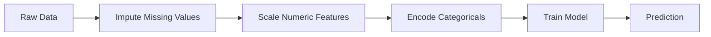
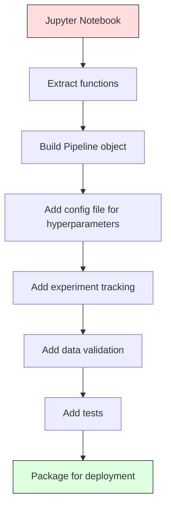

# ML 파이프라인 (ML Pipelines)

> 모델(model)은 제품이 아니다. 파이프라인(pipeline)이 제품이다. 파이프라인은 원시 데이터에서 배포된 예측까지의 모든 것이며, 모든 단계가 재현 가능해야 한다.

**Type:** Build
**Language:** Python
**Prerequisites:** Phase 2, Lesson 12 (Hyperparameter Tuning)
**Time:** ~120분

## 학습 목표 (Learning Objectives)

- 결측값 대치(imputation), 스케일링, 인코딩, 모델 학습을 단일한 재현 가능 객체로 엮는 ML 파이프라인을 밑바닥부터 만들기
- 데이터 누수(data leakage) 시나리오를 식별하고, 변환기(transformer)를 학습 데이터에만 적합함으로써 파이프라인이 이를 어떻게 방지하는지 설명하기
- 수치형 특성(feature)과 범주형 특성에 서로 다른 전처리를 적용하는 ColumnTransformer 구성하기
- 파이프라인 직렬화(serialization)를 구현하고, 같은 적합된 파이프라인이 학습과 프로덕션(production)에서 동일한 결과를 내는지 보이기

## 문제 (The Problem)

데이터를 불러오고, 결측값을 중앙값으로 채우고, 특성을 스케일링하고, 모델을 학습시키고, 정확도를 출력하는 노트북이 있다. 잘 동작한다. 그대로 출시한다.

한 달 뒤, 누군가가 모델을 재학습시키는데 다른 결과가 나온다. 중앙값이 테스트 데이터를 포함한 전체 데이터셋(dataset)에서 계산됐다(데이터 누수). 스케일링 파라미터(parameter)가 저장되지 않아서, 추론(inference)이 다른 통계를 사용한다. 특성 공학(feature engineering) 코드가 학습용과 서빙용 사이에 복사-붙여넣기됐고, 그 사본들이 서로 달라졌다. 범주형 열에는 인코더가 한 번도 본 적 없는 새로운 값이 프로덕션에서 나타났다.

이것들은 가상이 아니다. ML 시스템이 프로덕션에서 실패하는 가장 흔한 이유들이다. 파이프라인은 모든 변환 단계를 단일하고, 순서가 있으며, 재현 가능한 객체로 묶어서 이 모두를 해결한다.

## 개념 (The Concept)

### 파이프라인이란 무엇인가 (What a Pipeline Is)

파이프라인은 데이터 변환의 순서 있는 연속이며 그 뒤에 모델이 따라온다. 각 단계는 이전 단계의 출력을 입력으로 받는다. 전체 파이프라인은 학습 데이터에 대해 한 번 적합된다. 추론 시에는 같은 적합된 파이프라인이 새 데이터를 변환하고 예측을 만들어낸다.



파이프라인이 보장하는 것:
- 변환은 학습 데이터에만 적합된다(누수 없음)
- 추론 시 같은 변환이 적용된다
- 전체 객체가 하나의 아티팩트(artifact)로 직렬화되어 배포될 수 있다
- 교차 검증(cross-validation)이 폴드(fold)별로 파이프라인을 적용해 미묘한 누수를 방지한다

### 데이터 누수: 조용한 살인자 (Data Leakage: The Silent Killer)

데이터 누수는 테스트 세트나 미래 데이터의 정보가 학습을 오염시킬 때 일어난다. 파이프라인은 가장 흔한 형태들을 방지한다.

**누수 있음 (잘못됨):**
```python
X = df.drop("target", axis=1)
y = df["target"]

scaler = StandardScaler()
X_scaled = scaler.fit_transform(X)

X_train, X_test = X_scaled[:800], X_scaled[800:]
y_train, y_test = y[:800], y[800:]
```

스케일러가 테스트 데이터를 봤다. 평균과 표준편차가 테스트 샘플을 포함한다. 이는 정확도 추정치를 부풀린다.

**올바름:**
```python
X_train, X_test = X[:800], X[800:]

scaler = StandardScaler()
X_train_scaled = scaler.fit_transform(X_train)
X_test_scaled = scaler.transform(X_test)
```

파이프라인을 쓰면 이를 신경 쓸 필요가 없다. 파이프라인이 자동으로 처리한다.

### sklearn 파이프라인 (sklearn Pipeline)

sklearn의 `Pipeline`은 변환기들과 추정기(estimator)를 엮는다. 모든 단계를 순서대로 적용하는 `.fit()`, `.predict()`, `.score()`를 노출한다.

```python
from sklearn.pipeline import Pipeline
from sklearn.preprocessing import StandardScaler
from sklearn.linear_model import LogisticRegression

pipe = Pipeline([
    ("scaler", StandardScaler()),
    ("model", LogisticRegression()),
])

pipe.fit(X_train, y_train)
predictions = pipe.predict(X_test)
```

`pipe.fit(X_train, y_train)`를 호출하면:
1. 스케일러가 X_train에 대해 `fit_transform`을 호출한다
2. 모델이 스케일링된 X_train에 대해 `fit`을 호출한다

`pipe.predict(X_test)`를 호출하면:
1. 스케일러가 X_test에 대해 `transform`(fit_transform이 아님)을 호출한다
2. 모델이 스케일링된 X_test에 대해 `predict`를 호출한다

스케일러는 적합 중에 테스트 데이터를 결코 보지 않는다. 이것이 핵심 전부다.

### ColumnTransformer: 열마다 다른 파이프라인 (ColumnTransformer: Different Pipelines for Different Columns)

실제 데이터셋에는 서로 다른 전처리가 필요한 수치형 열과 범주형 열이 있다. `ColumnTransformer`가 이를 처리한다.

```python
from sklearn.compose import ColumnTransformer
from sklearn.preprocessing import StandardScaler, OneHotEncoder
from sklearn.impute import SimpleImputer

numeric_pipe = Pipeline([
    ("impute", SimpleImputer(strategy="median")),
    ("scale", StandardScaler()),
])

categorical_pipe = Pipeline([
    ("impute", SimpleImputer(strategy="most_frequent")),
    ("encode", OneHotEncoder(handle_unknown="ignore")),
])

preprocessor = ColumnTransformer([
    ("num", numeric_pipe, ["age", "income", "score"]),
    ("cat", categorical_pipe, ["city", "gender", "plan"]),
])

full_pipeline = Pipeline([
    ("preprocess", preprocessor),
    ("model", GradientBoostingClassifier()),
])
```

OneHotEncoder의 `handle_unknown="ignore"`는 프로덕션에서 결정적으로 중요하다. 새로운 범주(모델이 한 번도 본 적 없는 도시)가 나타나면, 충돌하는 대신 영벡터(zero vector)를 만들어낸다.

### 실험 추적 (Experiment Tracking)

파이프라인은 학습을 재현 가능하게 만들지만, 실험 전반에 걸쳐 무슨 일이 있었는지도 추적해야 한다: 어떤 하이퍼파라미터(hyperparameter)가 쓰였는지, 어떤 데이터셋 버전인지, 지표가 무엇이었는지, 어떤 코드가 실행되고 있었는지.

**MLflow**는 가장 흔한 오픈소스 해법이다:

```python
import mlflow

with mlflow.start_run():
    mlflow.log_param("max_depth", 5)
    mlflow.log_param("n_estimators", 100)
    mlflow.log_param("learning_rate", 0.1)

    pipe.fit(X_train, y_train)
    accuracy = pipe.score(X_test, y_test)

    mlflow.log_metric("accuracy", accuracy)
    mlflow.sklearn.log_model(pipe, "model")
```

모든 실행이 파라미터, 지표, 아티팩트, 그리고 전체 모델과 함께 기록된다. 실행을 비교하고, 어떤 실험이든 재현하고, 어떤 모델 버전이든 배포할 수 있다.

**Weights & Biases (wandb)**는 호스팅된 대시보드로 같은 기능을 제공한다:

```python
import wandb

wandb.init(project="my-pipeline")
wandb.config.update({"max_depth": 5, "n_estimators": 100})

pipe.fit(X_train, y_train)
accuracy = pipe.score(X_test, y_test)

wandb.log({"accuracy": accuracy})
```

### 모델 버저닝 (Model Versioning)

실험 추적 후에는 모델 버전을 관리해야 한다. 어떤 모델이 프로덕션에 있는가? 어떤 것이 스테이징인가? 어떤 것이 지난주 것이었나?

MLflow의 Model Registry는 다음을 제공한다:
- **버전 추적:** 저장된 모든 모델이 버전 번호를 받는다
- **스테이지 전환:** "Staging", "Production", "Archived"
- **승인 워크플로우:** 모델은 명시적으로 프로덕션으로 승격되어야 한다
- **롤백:** 이전 버전으로 즉시 되돌린다

### DVC로 하는 데이터 버저닝 (Data Versioning with DVC)

코드는 git으로 버전 관리된다. 데이터도 버전 관리되어야 하지만, git은 큰 파일을 다루지 못한다. DVC(Data Version Control)가 이를 해결한다.

```
dvc init
dvc add data/training.csv
git add data/training.csv.dvc data/.gitignore
git commit -m "Track training data"
dvc push
```

DVC는 실제 데이터를 원격 저장소(S3, GCS, Azure)에 저장하고, 해시를 기록하는 작은 `.dvc` 파일을 git에 유지한다. git 커밋을 체크아웃하면 `dvc checkout`이 사용됐던 정확한 데이터를 복원한다.

이는 모든 git 커밋이 코드와 데이터 둘 다를 고정한다는 뜻이다. 완전한 재현성.

### 재현 가능한 실험 (Reproducible Experiments)

재현 가능한 실험에는 네 가지가 필요하다:

1. **고정된 무작위 시드(seed):** numpy, random, 그리고 프레임워크(torch, sklearn)에 시드를 설정한다
2. **고정된 의존성(dependency):** 정확한 버전이 담긴 requirements.txt 또는 poetry.lock
3. **버전 관리된 데이터:** DVC 또는 유사한 것
4. **설정 파일:** 모든 하이퍼파라미터를 하드코딩하지 않고 설정에 담는다

```python
import numpy as np
import random

def set_seed(seed=42):
    random.seed(seed)
    np.random.seed(seed)
    try:
        import torch
        torch.manual_seed(seed)
        torch.cuda.manual_seed_all(seed)
        torch.backends.cudnn.deterministic = True
    except ImportError:
        pass
```

### 노트북에서 프로덕션 파이프라인으로 (From Notebook to Production Pipeline)



전형적인 진행:

1. **노트북 탐색:** 빠른 실험, 시각화, 특성 아이디어
2. **함수 추출:** 전처리, 특성 공학, 평가를 모듈로 옮긴다
3. **파이프라인 구축:** 변환을 sklearn Pipeline 또는 커스텀 클래스로 엮는다
4. **설정 관리:** 모든 하이퍼파라미터를 YAML/JSON 설정으로 옮긴다
5. **실험 추적:** MLflow나 wandb 로깅을 추가한다
6. **데이터 검증:** 학습 전에 스키마, 분포, 결측값 패턴을 점검한다
7. **테스트:** 변환기에 대한 단위 테스트, 전체 파이프라인에 대한 통합 테스트
8. **배포:** 파이프라인을 직렬화하고, API(FastAPI, Flask)로 감싸고, 컨테이너화한다

### 흔한 파이프라인 실수 (Common Pipeline Mistakes)

| 실수 | 나쁜 이유 | 해결책 |
|---------|-------------|-----|
| 분할 전에 전체 데이터로 적합하기 | 데이터 누수 | cross_val_score와 함께 Pipeline 사용 |
| 파이프라인 밖에서 특성 엔지니어링 | 학습과 서빙 시 변환이 다름 | 모든 변환을 Pipeline 안에 넣는다 |
| 알 수 없는 범주를 처리하지 않음 | 새 값에서 프로덕션 충돌 | OneHotEncoder(handle_unknown="ignore") |
| 하드코딩된 컬럼 이름 | 스키마가 바뀌면 깨진다 | 설정에서 컬럼 이름 목록을 사용한다 |
| 데이터 검증 없음 | 잘못된 데이터에 조용히 틀린 예측 | 예측 전에 스키마 검사를 추가한다 |
| 학습/서빙 스큐 | 모델이 프로덕션에서 다른 특성을 본다 | 둘 다에 하나의 Pipeline 객체 사용 |

## 직접 만들기 (Build It)

`code/pipeline.py`의 코드는 완전한 ML 파이프라인을 밑바닥부터 만든다:

### 1단계: 커스텀 변환기

```python
class CustomTransformer:
    def __init__(self):
        self.means = None
        self.stds = None

    def fit(self, X):
        self.means = np.mean(X, axis=0)
        self.stds = np.std(X, axis=0)
        self.stds[self.stds == 0] = 1.0
        return self

    def transform(self, X):
        return (X - self.means) / self.stds

    def fit_transform(self, X):
        return self.fit(X).transform(X)
```

### 2단계: 밑바닥부터 만드는 파이프라인

```python
class PipelineFromScratch:
    def __init__(self, steps):
        self.steps = steps

    def fit(self, X, y=None):
        X_current = X.copy()
        for name, step in self.steps[:-1]:
            X_current = step.fit_transform(X_current)
        name, model = self.steps[-1]
        model.fit(X_current, y)
        return self

    def predict(self, X):
        X_current = X.copy()
        for name, step in self.steps[:-1]:
            X_current = step.transform(X_current)
        name, model = self.steps[-1]
        return model.predict(X_current)
```

### 3단계: 파이프라인을 동반한 교차 검증

코드는 파이프라인을 동반한 교차 검증이 어떻게 데이터 누수를 방지하는지 보여준다: 스케일러가 각 폴드의 학습 데이터에 별도로 적합된다.

### 4단계: sklearn으로 만드는 완전한 프로덕션 파이프라인

`ColumnTransformer`, 여러 전처리 경로, 그리고 모델을 갖춘 완전한 파이프라인을, 적절한 교차 검증과 실험 로깅으로 학습시킨다.

## 산출물 (Ship It)

이 레슨이 만들어내는 것:
- `outputs/prompt-ml-pipeline.md` -- ML 파이프라인을 만들고 디버깅하는 스킬
- `code/pipeline.py` -- 밑바닥부터 sklearn까지 이르는 완전한 파이프라인

## 연습 문제 (Exercises)

1. 수치형 열 3개와 범주형 열 2개를 가진 데이터셋을 다루는 파이프라인을 만들어라. `ColumnTransformer`를 사용해 수치형에는 중앙값 대치 + 스케일링을, 범주형에는 최빈값 대치 + 원-핫 인코딩(one-hot encoding)을 적용하라. 5-겹 교차 검증으로 학습시켜라.

2. 데이터 누수를 의도적으로 도입하라: 분할 전에 전체 데이터셋에 스케일러를 적합한다. 교차 검증 점수(누수 있음)를 파이프라인 교차 검증 점수(깨끗함)와 비교하라. 차이가 얼마나 큰가?

3. `joblib.dump`로 파이프라인을 직렬화하라. 별도의 스크립트에서 그것을 불러와 예측을 실행하라. 예측이 동일한지 검증하라.

4. 가장 중요한 수치형 열 두 개에 대해 다항(polynomial) 특성(차수 2)을 만드는 커스텀 변환기를 파이프라인에 추가하라. 파이프라인의 어디에 위치해야 하는가?

5. 파이프라인을 위한 MLflow 추적을 설정하라. 서로 다른 하이퍼파라미터로 5개의 실험을 실행하라. MLflow UI(`mlflow ui`)를 사용해 실행을 비교하고 최적 모델을 고르라.

## 핵심 용어 (Key Terms)

| 용어 | 흔히 하는 말 | 실제 의미 |
|------|----------------|----------------------|
| 파이프라인 (Pipeline) | "변환 + 모델의 연쇄" | 적합된 변환기들과 모델을 순서대로 묶어, 누수를 방지하기 위해 하나의 단위로 적용하는 것이다 |
| 데이터 누수 (Data leakage) | "테스트 정보가 학습에 새어 들어감" | 학습 세트 밖의 정보를 사용해 모델을 만드는 것으로, 성능 추정치를 부풀린다 |
| ColumnTransformer | "컬럼별로 다른 전처리" | 서로 다른 컬럼 부분집합에 서로 다른 파이프라인을 적용하고 결과를 결합한다 |
| 실험 추적 (Experiment tracking) | "실행 기록 남기기" | 모든 학습 실행에 대해 파라미터, 지표, 산출물, 코드 버전을 기록하는 것이다 |
| MLflow | "모델 추적과 배포" | 실험 추적, 모델 레지스트리, 배포를 위한 오픈소스 플랫폼이다 |
| DVC | "데이터를 위한 깃(Git)" | 대용량 데이터 파일을 위한 버전 관리 시스템으로, 해시는 git에, 데이터는 원격 저장소에 둔다 |
| 모델 레지스트리 (Model registry) | "모델 버전 카탈로그" | 단계 라벨(스테이징, 프로덕션, 아카이브)과 함께 모델 버전을 추적하는 시스템이다 |
| 학습/서빙 스큐 (Training/serving skew) | "노트북에서는 잘 됐는데" | 학습 시와 추론 시 데이터가 처리되는 방식의 차이로, 조용한 오류를 일으킨다 |
| 재현성 (Reproducibility) | "같은 코드, 같은 결과" | 같은 코드, 데이터, 설정으로부터 동일한 결과를 얻을 수 있는 능력이다 |

## 더 읽을거리 (Further Reading)

- [scikit-learn Pipeline docs](https://scikit-learn.org/stable/modules/compose.html) -- 공식 파이프라인 레퍼런스
- [MLflow documentation](https://mlflow.org/docs/latest/index.html) -- 실험 추적과 모델 레지스트리
- [DVC documentation](https://dvc.org/doc) -- 데이터 버저닝
- [Sculley et al., Hidden Technical Debt in Machine Learning Systems (2015)](https://papers.nips.cc/paper/2015/hash/86df7dcfd896fcaf2674f757a2463eba-Abstract.html) -- ML 시스템 복잡성에 관한 기념비적 논문
- [Google ML Best Practices: Rules of ML](https://developers.google.com/machine-learning/guides/rules-of-ml) -- 실용적인 프로덕션 ML 조언
