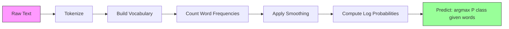

# 나이브 베이즈 (Naive Bayes)

> "나이브(naive, 순진한)" 가정은 틀렸는데, 그래도 작동한다. 그것이 이 기법의 묘미다.

**Type:** Build
**Language:** Python
**Prerequisites:** Phase 2, Lessons 01-07 (classification, Bayes' theorem)
**Time:** ~75분

## 학습 목표 (Learning Objectives)

- 텍스트 분류(text classification)를 위해 라플라스 평활화(Laplace smoothing)를 적용한 다항 나이브 베이즈(Multinomial Naive Bayes)를 밑바닥부터 구현하기
- 나이브 독립 가정(naive independence assumption)이 수학적으로 틀렸음에도 실무에서는 왜 올바른 클래스 순위를 만들어내는지 설명하기
- 다항(Multinomial), 베르누이(Bernoulli), 가우시안(Gaussian) 나이브 베이즈 변형을 비교하고, 주어진 특성(feature) 유형에 맞는 올바른 것을 선택하기
- 고차원 희소(sparse) 데이터에서 나이브 베이즈를 로지스틱 회귀(logistic regression)와 비교 평가하고, 작동하고 있는 편향-분산 트레이드오프(bias-variance tradeoff)를 설명하기

## 문제 (The Problem)

텍스트를 분류해야 한다. 이메일을 스팸/비스팸으로. 고객 리뷰를 긍정/부정으로. 지원 티켓을 카테고리로. 수천 개의 특성(단어당 하나)과 제한된 학습 데이터가 있다.

대부분의 분류기(classifier)는 여기서 막힌다. 로지스틱 회귀는 수천 개의 가중치(weight)를 신뢰성 있게 추정할 만큼 충분한 샘플이 필요하다. 결정 트리(decision tree)는 한 번에 단어 하나로 분할하며 격렬하게 과적합(overfitting)한다. 10,000차원에서 KNN은 무의미한데, 모든 점이 다른 모든 점에서 똑같이 멀기 때문이다.

나이브 베이즈는 이를 다룬다. 수학적으로 틀린 가정(모든 특성이 클래스가 주어졌을 때 다른 모든 특성과 독립이라는 가정)을 하면서도, 텍스트 분류에서, 특히 작은 학습 세트에서 "더 똑똑한" 모델을 능가한다. 데이터를 한 번 훑는 것으로 학습한다. 수백만 개의 특성으로 확장된다. 확률 추정치를 만들어낸다(다만 독립 가정 때문에 종종 잘 보정되지 않는다).

틀린 가정이 어떻게 좋은 예측으로 이어지는지를 이해하는 것은 머신러닝(machine learning)에 관한 근본적인 무언가를 가르쳐준다: 최선의 모델은 가장 정확한 것이 아니라, 당신의 데이터에 대해 최선의 편향-분산 트레이드오프를 갖는 것이다.

## 개념 (The Concept)

### 베이즈 정리 (빠른 복습) (Bayes' Theorem (Quick Review))

베이즈 정리(Bayes' theorem)는 조건부 확률을 뒤집는다:

```
P(class | features) = P(features | class) * P(class) / P(features)
```

우리는 `P(class | features)`를 원한다 -- 문서에 든 단어들이 주어졌을 때 그 문서가 어떤 클래스에 속할 확률. 이를 다음으로부터 계산할 수 있다:
- `P(features | class)` -- 이 클래스의 문서에서 이 단어들을 볼 가능도(likelihood)
- `P(class)` -- 클래스의 사전 확률(prior probability)(일반적으로 스팸이 얼마나 흔한가?)
- `P(features)` -- 증거(evidence)이며, 모든 클래스에 대해 같으므로 비교할 때 무시할 수 있다

`P(class | features)`가 가장 높은 클래스가 이긴다.

### 나이브 독립 가정 (The Naive Independence Assumption)

`P(features | class)`를 정확하게 계산하려면 모든 특성이 함께 갖는 결합 확률(joint probability)을 추정해야 한다. 어휘(vocabulary)가 10,000개 단어라면, 2^10,000개의 가능한 조합에 대한 분포를 추정해야 한다. 불가능하다.

나이브 가정: 모든 특성이 클래스가 주어졌을 때 조건부 독립(conditionally independent)이다.

```
P(w1, w2, ..., wn | class) = P(w1 | class) * P(w2 | class) * ... * P(wn | class)
```

불가능한 결합 분포 하나 대신, n개의 단순한 특성별 분포를 추정한다. 각각은 단지 개수만 필요로 한다.

이 가정은 명백히 틀렸다. 단어 "machine"과 "learning"은 어떤 문서에서도 독립이 아니다. 하지만 분류기는 올바른 확률 추정치를 필요로 하지 않는다. 올바른 순위 -- 어떤 클래스가 가장 높은 확률을 갖는지 -- 를 필요로 한다. 독립 가정은 체계적 오차를 도입하지만, 그 오차는 모든 클래스에 비슷하게 영향을 미치므로 순위는 올바르게 유지된다.

### 그래도 작동하는 이유 (Why It Still Works)

세 가지 이유:

1. **보정보다 순위.** 분류는 최상위로 매겨진 클래스가 올바르기만 하면 된다. 참된 확률이 0.7인데 P(spam) = 0.99999라고 하더라도, 분류기는 여전히 스팸을 올바르게 고른다. 우리는 올바른 확률을 필요로 하지 않는다. 올바른 승자를 필요로 한다.

2. **높은 편향, 낮은 분산.** 독립 가정은 강한 사전(prior)이다. 모델을 강하게 제약해서 과적합을 방지한다. 제한된 학습 데이터에서는, 살짝 틀렸지만 안정적인 모델이 이론적으로는 옳지만 격렬하게 불안정한 모델을 이긴다. 이것이 작동하고 있는 편향-분산 트레이드오프다.

3. **특성 중복이 상쇄된다.** 상관관계가 있는 특성은 중복된 증거를 제공한다. 분류기는 이 증거를 이중 계산하지만, 올바른 클래스에 대해서도 이중 계산한다. "machine"과 "learning"이 항상 함께 나타난다면, 둘 다 "tech" 클래스의 증거를 제공한다. NB는 이를 두 번 세지만, 올바른 클래스에 대해 두 번 센다.

네 번째, 실용적 이유: 나이브 베이즈는 극도로 빠르다. 학습은 빈도를 세며 데이터를 한 번 훑는 것이다. 예측은 행렬 곱셈이다. 백만 개의 문서로 수초 만에 학습할 수 있다. 이 속도는 더 빠르게 반복하고, 더 많은 특성 집합을 시도하고, 더 느린 모델보다 더 많은 실험을 실행할 수 있다는 뜻이다.

### 단계별 수학 (The Math Step by Step)

구체적인 예제를 따라가 보자. 두 클래스가 있다고 하자: 스팸과 비스팸. 우리 어휘에는 세 단어가 있다: "free", "money", "meeting".

학습 데이터:
- 스팸 이메일은 "free"를 80번, "money"를 60번, "meeting"을 10번 언급한다(총 단어 150개)
- 비스팸 이메일은 "free"를 5번, "money"를 10번, "meeting"을 100번 언급한다(총 단어 115개)
- 이메일의 40%가 스팸, 60%가 비스팸이다

라플라스 평활화(alpha=1)로:

```
P(free | spam)    = (80 + 1) / (150 + 3) = 81/153 = 0.529
P(money | spam)   = (60 + 1) / (150 + 3) = 61/153 = 0.399
P(meeting | spam) = (10 + 1) / (150 + 3) = 11/153 = 0.072

P(free | not-spam)    = (5 + 1) / (115 + 3) = 6/118 = 0.051
P(money | not-spam)   = (10 + 1) / (115 + 3) = 11/118 = 0.093
P(meeting | not-spam) = (100 + 1) / (115 + 3) = 101/118 = 0.856
```

새 이메일에 든 것: "free"(2번), "money"(1번), "meeting"(0번).

```
log P(spam | email) = log(0.4) + 2*log(0.529) + 1*log(0.399) + 0*log(0.072)
                    = -0.916 + 2*(-0.637) + (-0.919) + 0
                    = -3.109

log P(not-spam | email) = log(0.6) + 2*log(0.051) + 1*log(0.093) + 0*log(0.856)
                        = -0.511 + 2*(-2.976) + (-2.375) + 0
                        = -8.838
```

스팸이 큰 차이로 이긴다. "free"가 두 번 나타나는 것은 스팸의 강한 증거다. "meeting"이 나타나지 않는 것은 두 로그 합 모두에 0을 기여한다(0 * log(P)) -- 다항 NB에서 부재하는 단어는 아무 효과가 없다. 단어 부재를 명시적으로 모델링하는 것은 베르누이 NB다.

### 세 가지 변형 (Three Variants)

나이브 베이즈는 세 가지 맛으로 나온다. 각각 `P(feature | class)`를 다르게 모델링한다.

#### 다항 나이브 베이즈 (Multinomial Naive Bayes)

각 특성을 개수로 모델링한다. 특성이 단어 빈도나 TF-IDF 값인 텍스트 데이터에 가장 좋다.

```
P(word_i | class) = (count of word_i in class + alpha) / (total words in class + alpha * vocab_size)
```

`alpha`는 라플라스 평활화다(아래에서 설명). 이 변형은 텍스트 분류의 일꾼이다.

#### 가우시안 나이브 베이즈 (Gaussian Naive Bayes)

각 특성을 정규 분포(normal distribution)로 모델링한다. 연속 특성에 가장 좋다.

```
P(x_i | class) = (1 / sqrt(2 * pi * var)) * exp(-(x_i - mean)^2 / (2 * var))
```

각 클래스는 특성별로 자신의 평균과 분산을 갖는다. 특성이 각 클래스 안에서 진정으로 종 모양 곡선(bell curve)을 따를 때 잘 작동한다.

#### 베르누이 나이브 베이즈 (Bernoulli Naive Bayes)

각 특성을 이진(존재 또는 부재)으로 모델링한다. 짧은 텍스트나 이진 특성 벡터에 가장 좋다.

```
P(word_i | class) = (docs in class containing word_i + alpha) / (total docs in class + 2 * alpha)
```

다항과 달리, 베르누이는 단어의 부재를 명시적으로 벌점한다. "free"가 보통 스팸에 나타나는데 이 이메일에는 부재한다면, 베르누이는 그것을 스팸에 반대하는 증거로 센다.

### 각 변형을 언제 쓸 것인가 (When to Use Each Variant)

| 변형 | 특성 유형 | 적합한 경우 | 예시 |
|---------|-------------|----------|---------|
| 다항 (Multinomial) | 개수 또는 빈도 | 텍스트 분류, 단어 가방(bag-of-words) | 이메일 스팸, 주제 분류 |
| 가우시안 (Gaussian) | 연속 값 | 정규분포에 가까운 특성의 정형 데이터 | 붓꽃 분류, 센서 데이터 |
| 베르누이 (Bernoulli) | 이진 (0/1) | 짧은 텍스트, 이진 특성 벡터 | SMS 스팸, 존재/부재 특성 |

### 라플라스 평활화 (Laplace Smoothing)

어떤 단어가 테스트 데이터에는 나타나지만 특정 클래스의 학습 데이터에는 한 번도 나타나지 않았다면 무슨 일이 일어나는가?

평활화 없이: `P(word | class) = 0/N = 0`. 0 하나가 전체 곱에 곱해지면, 다른 모든 증거와 무관하게 `P(class | features) = 0`이 된다. 보이지 않던 단어 하나가, 다른 증거가 아무리 그것을 뒷받침하더라도, 전체 예측을 파괴한다.

라플라스 평활화는 모든 특성 개수에 작은 개수 `alpha`(보통 1)를 더한다:

```
P(word_i | class) = (count(word_i, class) + alpha) / (total_words_in_class + alpha * vocab_size)
```

alpha=1이면, 모든 단어가 적어도 아주 작은 확률을 받는다. 테스트 이메일에 나타나는 "discombobulate"가 더 이상 스팸 확률을 죽이지 않는다. 평활화에는 베이지안 해석이 있다: 단어 분포에 균등 디리클레 사전(uniform Dirichlet prior)을 두는 것과 동등하다.

높은 alpha는 더 강한 평활화(더 균등한 분포)를 의미한다. 낮은 alpha는 모델이 데이터를 더 신뢰한다는 것을 의미한다. alpha는 튜닝하는 하이퍼파라미터(hyperparameter)다.

alpha의 효과:

| Alpha | 효과 | 사용 시기 |
|-------|--------|-------------|
| 0.001 | 거의 평활화 없음, 데이터를 신뢰 | 매우 큰 학습 세트, 보이지 않는 특성이 없을 것으로 예상 |
| 0.1 | 가벼운 평활화 | 큰 학습 세트 |
| 1.0 | 표준 라플라스 평활화 | 기본 시작점 |
| 10.0 | 강한 평활화, 분포를 평탄화 | 매우 작은 학습 세트, 보이지 않는 특성이 많을 것으로 예상 |

### 로그 공간 계산 (Log-Space Computation)

수백 개의 확률(각각 1보다 작은)을 곱하면 부동소수점 언더플로(underflow)가 발생한다. 참된 값이 매우 작은 양수임에도 곱이 부동소수점에서 0이 된다.

해법: 로그 공간(log space)에서 작업한다. 확률을 곱하는 대신, 그 로그를 더한다:

```
log P(class | x1, x2, ..., xn) = log P(class) + sum_i log P(xi | class)
```

이는 예측을 내적(dot product)으로 바꾼다:

```
log_scores = X @ log_feature_probs.T + log_class_priors
prediction = argmax(log_scores)
```

행렬 곱셈. 나이브 베이즈 예측이 그토록 빠른 이유가 바로 이것이다 -- 단층 선형 모델과 같은 연산이다.

### 나이브 베이즈 vs 로지스틱 회귀 (Naive Bayes vs Logistic Regression)

둘 다 텍스트를 위한 선형 분류기다. 차이는 무엇을 모델링하느냐에 있다.

| 측면 | 나이브 베이즈 | 로지스틱 회귀 |
|--------|------------|-------------------|
| 유형 | 생성적 (P(X\|Y)를 모델링) | 판별적 (P(Y\|X)를 모델링) |
| 학습 | 빈도를 센다 | 손실 함수를 최적화한다 |
| 작은 데이터 | 더 나음 (강한 사전 확률이 도움) | 더 나쁨 (가중치 추정에 충분치 않음) |
| 큰 데이터 | 더 나쁨 (잘못된 가정이 해가 됨) | 더 나음 (유연한 경계) |
| 특성 | 독립성을 가정 | 상관관계를 처리 |
| 속도 | 단일 패스, 매우 빠름 | 반복적 최적화 |
| 보정 | 확률이 부정확 | 확률이 더 정확 |

경험칙: 나이브 베이즈로 시작하라. 데이터가 충분하고 NB가 정체되면, 로지스틱 회귀로 전환하라.

### 분류 파이프라인 (Classification Pipeline)



실무에서는 부동소수점 언더플로를 피하기 위해 로그 공간에서 작업한다. 많은 작은 확률을 곱하는 대신, 그 로그를 더한다:

```
log P(class | features) = log P(class) + sum_i log P(feature_i | class)
```

## 직접 만들기 (Build It)

`code/naive_bayes.py`의 코드는 MultinomialNB와 GaussianNB 둘 다를 밑바닥부터 구현한다.

### MultinomialNB

밑바닥 구현:

1. **fit(X, y)**: 각 클래스에 대해 각 특성의 빈도를 센다. 라플라스 평활화를 더한다. 로그 확률을 계산한다. 클래스 사전(클래스 빈도의 로그)을 저장한다.

2. **predict_log_proba(X)**: 각 샘플에 대해, 모든 클래스에 대해 log P(class) + log P(feature_i | class)의 합을 계산한다. 이것은 행렬 곱셈이다: X @ log_probs.T + log_priors.

3. **predict(X)**: 가장 높은 로그 확률을 갖는 클래스를 반환한다.

```python
class MultinomialNB:
    def __init__(self, alpha=1.0):
        self.alpha = alpha

    def fit(self, X, y):
        classes = np.unique(y)
        n_classes = len(classes)
        n_features = X.shape[1]

        self.classes_ = classes
        self.class_log_prior_ = np.zeros(n_classes)
        self.feature_log_prob_ = np.zeros((n_classes, n_features))

        for i, c in enumerate(classes):
            X_c = X[y == c]
            self.class_log_prior_[i] = np.log(X_c.shape[0] / X.shape[0])
            counts = X_c.sum(axis=0) + self.alpha
            self.feature_log_prob_[i] = np.log(counts / counts.sum())

        return self
```

핵심 통찰: 적합 후, 예측은 그저 행렬 곱셈에 편향(bias)을 더한 것이다. 나이브 베이즈가 그토록 빠른 이유가 이것이다.

### GaussianNB

연속 특성의 경우, 클래스별·특성별로 평균과 분산을 추정한다:

```python
class GaussianNB:
    def __init__(self):
        pass

    def fit(self, X, y):
        classes = np.unique(y)
        self.classes_ = classes
        self.means_ = np.zeros((len(classes), X.shape[1]))
        self.vars_ = np.zeros((len(classes), X.shape[1]))
        self.priors_ = np.zeros(len(classes))

        for i, c in enumerate(classes):
            X_c = X[y == c]
            self.means_[i] = X_c.mean(axis=0)
            self.vars_[i] = X_c.var(axis=0) + 1e-9
            self.priors_[i] = X_c.shape[0] / X.shape[0]

        return self
```

예측은 특성별 가우시안 PDF를 사용하며, 특성 전반에 걸쳐 곱한다(로그 공간에서 더한다).

### 데모: 텍스트 분류 (Demo: Text Classification)

코드는 두 클래스(기술 기사 vs 스포츠 기사)를 모사하는 합성 단어 가방(bag-of-words) 데이터를 생성한다. 각 클래스는 서로 다른 단어 빈도 분포를 갖는다. MultinomialNB는 단어 개수를 사용해 이를 분류한다.

합성 데이터는 이렇게 작동한다: 200개의 "단어"(특성 열)를 만든다. 단어 0-39는 기술 기사에서 높은 빈도, 스포츠에서 낮은 빈도를 갖는다. 단어 80-119는 스포츠에서 높은 빈도, 기술에서 낮은 빈도를 갖는다. 단어 40-79는 둘 다에서 중간 빈도다. 이는 일부 단어는 강한 클래스 지표이고 다른 것들은 노이즈인 현실적인 시나리오를 만든다.

### 데모: 연속 특성 (Demo: Continuous Features)

코드는 Iris와 유사한 데이터(클래스 3개, 특성 4개, 가우시안 군집)를 생성한다. GaussianNB는 클래스별 평균과 분산을 사용해 분류한다. 각 클래스는 서로 다른 중심(평균 벡터)과 서로 다른 퍼짐(분산)을 가지며, 측정값이 카테고리 간에 체계적으로 다른 실세계 데이터를 흉내 낸다.

코드는 또한 다음을 보여준다:
- **평활화 비교:** 서로 다른 alpha 값으로 MultinomialNB를 학습시켜 평활화 강도가 정확도에 미치는 효과를 보인다.
- **학습 크기 실험:** 학습 데이터가 20개에서 1600개 샘플로 늘어남에 따라 NB 정확도가 어떻게 향상되는지. NB는 매우 적은 샘플로도 괜찮은 정확도에 도달한다 -- 이것이 주요 장점이다.
- **혼동 행렬(confusion matrix):** NB가 어디서 실수하는지 보여주는 클래스별 정밀도(precision), 재현율(recall), F1 점수.

### 예측 속도 (Prediction Speed)

나이브 베이즈 예측은 행렬 곱셈이다. 특성 d개와 클래스 k개를 가진 n개 샘플의 경우:
- MultinomialNB: 한 번의 행렬 곱 (n x d) @ (d x k) = O(n * d * k)
- GaussianNB: n * k번의 가우시안 PDF 평가, 각각 d개 특성에 대해 = O(n * d * k)

둘 다 모든 차원에서 선형이다. 이를 KNN(모든 학습 점에 대한 거리 계산이 필요)이나 RBF 커널 SVM(모든 서포트 벡터에 대한 커널 평가가 필요)과 비교하라. NB는 예측 시점에 수십 배 더 빠르다.

## 라이브러리로 써보기 (Use It)

sklearn으로 두 변형 모두 한 줄짜리다:

```python
from sklearn.naive_bayes import GaussianNB, MultinomialNB

gnb = GaussianNB()
gnb.fit(X_train, y_train)
print(f"GaussianNB accuracy: {gnb.score(X_test, y_test):.3f}")

mnb = MultinomialNB(alpha=1.0)
mnb.fit(X_train_counts, y_train)
print(f"MultinomialNB accuracy: {mnb.score(X_test_counts, y_test):.3f}")
```

sklearn으로 하는 텍스트 분류:

```python
from sklearn.feature_extraction.text import CountVectorizer
from sklearn.naive_bayes import MultinomialNB
from sklearn.pipeline import Pipeline

text_clf = Pipeline([
    ("vectorizer", CountVectorizer()),
    ("classifier", MultinomialNB(alpha=1.0)),
])

text_clf.fit(train_texts, train_labels)
accuracy = text_clf.score(test_texts, test_labels)
```

`naive_bayes.py`의 코드는 정확성을 검증하기 위해 같은 데이터에서 밑바닥 구현을 sklearn과 비교한다.

### TF-IDF와 나이브 베이즈 (TF-IDF with Naive Bayes)

원시 단어 개수는 출현마다 모든 단어에 동일한 가중치를 준다. 하지만 "the"나 "is" 같은 흔한 단어는 모든 클래스에 자주 나타난다 -- 정보를 담지 않는다. TF-IDF(Term Frequency - Inverse Document Frequency)는 흔한 단어를 낮추고 희귀하고 변별력 있는 단어를 높인다.

```python
from sklearn.feature_extraction.text import TfidfVectorizer
from sklearn.naive_bayes import MultinomialNB
from sklearn.pipeline import Pipeline

text_clf = Pipeline([
    ("tfidf", TfidfVectorizer()),
    ("classifier", MultinomialNB(alpha=0.1)),
])
```

TF-IDF 값은 음수가 아니므로 MultinomialNB와 함께 작동한다. TF-IDF + MultinomialNB 조합은 텍스트 분류의 가장 강력한 베이스라인(baseline) 중 하나다. 학습 샘플이 10,000개 미만인 데이터셋에서 더 복잡한 모델을 자주 이긴다.

### 짧은 텍스트를 위한 BernoulliNB (BernoulliNB for Short Text)

짧은 텍스트(트윗, SMS, 채팅 메시지)의 경우, BernoulliNB가 MultinomialNB를 능가할 수 있다. 짧은 텍스트는 단어 개수가 적으므로, MultinomialNB가 의존하는 빈도 정보가 노이즈가 많다. BernoulliNB는 존재 또는 부재만 신경 쓰는데, 짧은 텍스트에서는 이것이 더 신뢰할 만하다.

```python
from sklearn.naive_bayes import BernoulliNB
from sklearn.feature_extraction.text import CountVectorizer

text_clf = Pipeline([
    ("vectorizer", CountVectorizer(binary=True)),
    ("classifier", BernoulliNB(alpha=1.0)),
])
```

CountVectorizer의 `binary=True` 플래그는 모든 개수를 0/1로 변환한다. 그것 없이도 BernoulliNB는 작동하지만, 설계되지 않은 개수를 보고 있는 셈이다.

### NB 확률 보정하기 (Calibrating NB Probabilities)

NB 확률은 잘 보정되지 않는다. NB가 P(spam) = 0.95라고 말할 때, 참된 확률은 0.7일 수 있다. 신뢰할 만한 확률 추정치가 필요하다면(예: 임계값을 설정하거나 다른 모델과 결합하기 위해), sklearn의 CalibratedClassifierCV를 써라:

```python
from sklearn.calibration import CalibratedClassifierCV

calibrated_nb = CalibratedClassifierCV(MultinomialNB(), cv=5, method="sigmoid")
calibrated_nb.fit(X_train, y_train)
proba = calibrated_nb.predict_proba(X_test)
```

이는 교차 검증(cross-validation)을 사용해 NB의 원시 점수 위에 로지스틱 회귀를 적합한다. 그 결과 확률은 참된 클래스 빈도에 훨씬 가깝다.

### 흔한 함정 (Common Gotchas)

1. **음수 특성 값.** MultinomialNB는 음수가 아닌 특성을 필요로 한다. 음수 값이 있다면(특정 설정의 TF-IDF나 표준화된 특성처럼), 대신 GaussianNB를 쓰거나 특성을 양수가 되도록 이동시켜라.

2. **분산이 0인 특성.** GaussianNB는 분산으로 나눈다. 어떤 특성이 한 클래스에 대해 분산이 0이면(모든 값이 동일), 확률 계산이 깨진다. 코드는 이를 방지하기 위해 모든 분산에 작은 평활화 항(1e-9)을 더한다.

3. **클래스 불균형(class imbalance).** 이메일의 99%가 비스팸이면, 사전 P(not-spam) = 0.99가 너무 강해서 가능도 증거를 압도한다. 클래스 사전을 수동으로 설정하거나 sklearn의 class_prior 파라미터를 쓸 수 있다.

4. **특성 스케일링.** MultinomialNB는 스케일링이 필요 없다(개수에 작동한다). GaussianNB도 스케일링이 필요 없다(특성별 통계를 추정한다). 이는 특성 스케일에 민감한 로지스틱 회귀와 SVM에 대한 장점이다.

## 산출물 (Ship It)

이 레슨이 만들어내는 것:
- `outputs/skill-naive-bayes-chooser.md` -- 올바른 NB 변형을 고르기 위한 의사결정 스킬
- `code/naive_bayes.py` -- 밑바닥부터 만든 MultinomialNB와 GaussianNB, sklearn 비교 포함

### 나이브 베이즈가 실패할 때 (When Naive Bayes Fails)

NB는 독립 가정이 (단지 틀린 확률뿐 아니라) 틀린 순위를 일으킬 때 실패한다. 이는 다음일 때 일어난다:

1. **강한 특성 상호작용.** 클래스가 두 특성의 조합에 의존하지만 둘 중 어느 것 하나만으로는 의존하지 않는다면(XOR 같은 패턴), NB는 이를 완전히 놓친다. 각 특성 단독으로는 증거를 제공하지 않으며, NB는 그것들을 비선형으로 결합할 수 없다.

2. **상반된 증거를 가진 고도로 상관된 특성.** 특성 A는 "스팸"이라 말하고 특성 B는 "비스팸"이라 말하는데, A와 B가 완벽하게 상관돼 있다면(실제로는 항상 일치한다면), NB는 실제로는 없는 상충하는 증거를 보게 된다.

3. **매우 큰 학습 세트.** 충분한 데이터가 있으면, 로지스틱 회귀 같은 판별 모델(discriminative model)이 참된 결정 경계(decision boundary)를 학습해 NB를 능가한다. 작은 데이터에서 도움이 됐던 독립 가정이 이제는 모델의 발목을 잡는다.

실무에서 이 실패 양상은 텍스트 분류에서 드물다. 텍스트 특성은 많고, 개별적으로 약하며, 독립 가정의 오차가 상쇄되는 경향이 있다. 강하게 상관된 특성이 적은 정형 데이터(tabular data)의 경우, 로지스틱 회귀나 트리 기반 모델을 먼저 고려하라.

## 연습 문제 (Exercises)

1. **평활화 실험.** alpha 값 0.01, 0.1, 1.0, 10.0, 100.0으로 텍스트 데이터에 MultinomialNB를 학습시켜라. alpha에 대한 정확도를 그려라. 성능은 어디서 정점에 이르는가? 매우 높은 alpha는 왜 해로운가?

2. **특성 독립성 검정.** 실제 텍스트 데이터셋을 가져와라. 명백히 상관된 두 단어("machine"과 "learning")를 골라라. P(word1 | class) * P(word2 | class)를 계산해 P(word1 AND word2 | class)와 비교하라. 독립 가정이 얼마나 틀렸는가? 분류 정확도에 영향을 미치는가?

3. **베르누이 구현.** 코드를 BernoulliNB 클래스로 확장하라. 단어 가방을 이진(존재/부재)으로 변환하고 텍스트 데이터에서 MultinomialNB와 정확도를 비교하라. 베르누이는 언제 이기는가?

4. **NB vs 로지스틱 회귀.** 텍스트 데이터에 둘 다 학습시켜라. 학습 샘플 100개로 시작해 10,000개로 늘려라. 둘 다에 대해 학습 세트 크기에 따른 정확도를 그려라. 어느 지점에서 로지스틱 회귀가 나이브 베이즈를 추월하는가?

5. **스팸 필터.** 완전한 스팸 분류기를 만들어라: 원시 이메일 텍스트를 토큰화하고, 어휘를 만들고, 단어 가방 특성을 만들고, MultinomialNB를 학습시키고, 정밀도와 재현율로 평가하라(단지 정확도가 아니라 -- 왜인가?).

## 핵심 용어 (Key Terms)

| 용어 | 흔히 하는 말 | 실제 의미 |
|------|----------------|----------------------|
| 나이브 베이즈 (Naive Bayes) | "단순한 확률적 분류기" | 클래스가 주어졌을 때 특성들이 조건부 독립이라는 가정 하에 베이즈 정리를 적용하는 분류기다 |
| 조건부 독립 (Conditional independence) | "특성들이 서로 영향을 주지 않는다" | P(A, B \| C) = P(A \| C) * P(B \| C) -- C를 알고 나면 B를 알아도 A에 대해 새로운 정보가 없다 |
| 라플라스 평활화 (Laplace smoothing) | "1을 더하는 평활화" | 모든 특성에 작은 개수를 더해, 0 확률이 예측을 지배하는 것을 막는다 |
| 사전 확률 (Prior) | "데이터를 보기 전에 믿었던 것" | P(class) -- 어떤 특성도 관측하기 전 각 클래스의 확률이다 |
| 가능도 (Likelihood) | "데이터가 얼마나 잘 맞는가" | P(features \| class) -- 클래스를 안다고 할 때 이 특성들을 관측할 확률이다 |
| 사후 확률 (Posterior) | "데이터를 본 후에 믿는 것" | P(class \| features) -- 특성을 관측한 후 갱신된 클래스의 확률이다 |
| 생성 모델 (Generative model) | "데이터가 어떻게 생성되는지 모델링한다" | P(X \| Y)와 P(Y)를 학습한 뒤 베이즈 정리로 P(Y \| X)를 구하는 모델이다 |
| 판별 모델 (Discriminative model) | "결정 경계를 모델링한다" | X가 어떻게 생성되는지 모델링하지 않고 P(Y \| X)를 직접 학습하는 모델이다 |
| 로그 확률 (Log probability) | "언더플로 방지" | P 대신 log P로 작업하여, 작은 수들을 많이 곱한 값이 부동소수점에서 0이 되는 것을 막는다 |

## 더 읽을거리 (Further Reading)

- [scikit-learn Naive Bayes docs](https://scikit-learn.org/stable/modules/naive_bayes.html) -- 수학적 세부와 함께 세 변형 모두
- [McCallum and Nigam, A Comparison of Event Models for Naive Bayes Text Classification (1998)](https://www.cs.cmu.edu/~knigam/papers/multinomial-aaaiws98.pdf) -- 텍스트를 위한 다항 vs 베르누이의 고전적 비교
- [Rennie et al., Tackling the Poor Assumptions of Naive Bayes Text Classifiers (2003)](https://people.csail.mit.edu/jrennie/papers/icml03-nb.pdf) -- 텍스트를 위한 NB 개선
- [Ng and Jordan, On Discriminative vs. Generative Classifiers (2001)](https://ai.stanford.edu/~ang/papers/nips01-discriminativegenerative.pdf) -- NB가 더 적은 데이터로 LR보다 빠르게 수렴함을 증명
