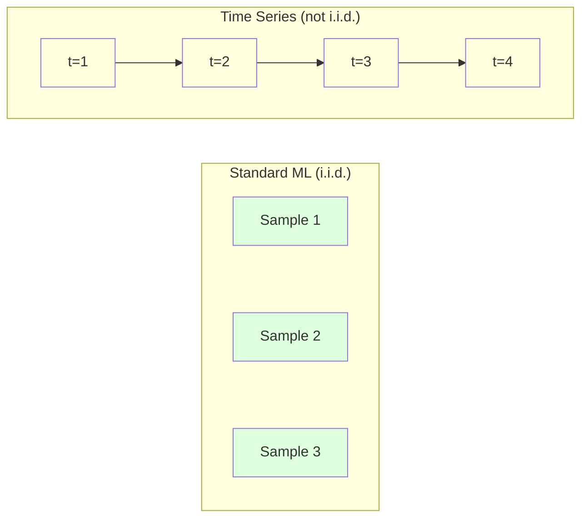
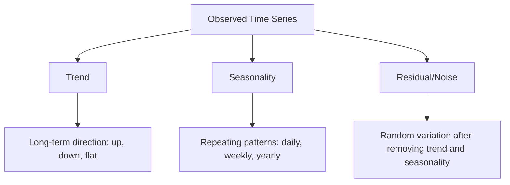
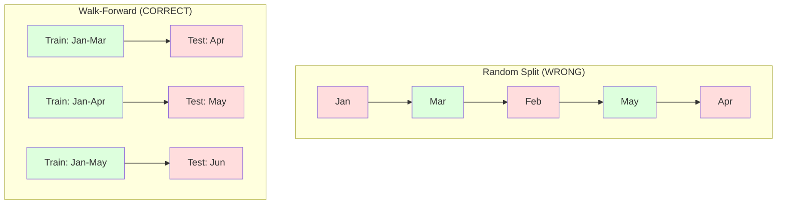

# 시계열 기초 (Time Series Fundamentals)

> 과거 성과는 미래 결과를 예측한다 -- 먼저 정상성(stationarity)을 점검한다면.

**Type:** Build
**Language:** Python
**Prerequisites:** Phase 2, Lessons 01-09
**Time:** ~90분

## 학습 목표 (Learning Objectives)

- 시계열(time series)을 추세(trend), 계절성(seasonality), 잔차(residual) 성분으로 분해하고 정상성을 검정하기
- 시계열을 지도 학습(supervised learning) 문제로 변환하기 위해 지연 특성(lag feature)과 이동 통계(rolling statistics)를 구현하기
- 미래 데이터가 학습으로 새어 드는 것을 방지하는 워크-포워드 검증(walk-forward validation) 프레임워크 만들기
- 무작위 학습/테스트 분할이 시계열에 무효한 이유를 설명하고, 적절한 시간 기반 분할 대비 성능 격차를 보이기

## 문제 (The Problem)

시간순으로 정렬된 데이터가 있다. 일별 매출, 시간별 기온, 분당 CPU 사용량, 주간 주가. 다음 값, 다음 주, 다음 분기를 예측하고 싶다.

표준 ML 도구함에 손을 뻗는다: 무작위 학습/테스트 분할, 교차 검증(cross-validation), 특성 행렬 입력, 예측 출력. 모든 단계가 틀렸다.

시계열은 표준 ML이 의존하는 가정들을 깬다. 샘플이 독립적이지 않다 -- 오늘의 기온은 어제에 의존한다. 무작위 분할은 미래 정보를 과거로 누수시킨다. 백테스트(backtest)에서 훌륭해 보이는 특성이 프로덕션(production)에서 실패하는데, 시간에 따라 이동하는 패턴에 의존하기 때문이다.

무작위 교차 검증으로 95% 정확도를 얻는 모델이 적절한 시간 기반 평가로는 55%를 얻을 수 있다. 그 차이는 사소한 기술적 문제가 아니다. 종이 위에서 작동하는 모델과 프로덕션에서 작동하는 모델의 차이다.

이 레슨은 기초를 다룬다: 시간 데이터를 무엇이 다르게 만드는지, 모델을 정직하게 평가하는 법, 그리고 표준 ML 모델이 소비할 수 있는 특성으로 시계열을 바꾸는 법.

## 개념 (The Concept)

### 시계열을 다르게 만드는 것 (What Makes Time Series Different)

표준 ML은 i.i.d. -- 독립이고 동일하게 분포(independent and identically distributed) -- 를 가정한다. 각 샘플은 다른 샘플과 독립적으로 같은 분포에서 추출된다. 시계열은 둘 다를 위반한다:

- **독립적이지 않다.** 오늘의 주가는 어제에 의존한다. 이번 주 매출은 지난주와 상관된다.
- **동일하게 분포하지 않는다.** 분포가 시간에 따라 이동한다. 12월 매출은 3월 매출과 다르게 보인다.

이 위반들은 사소하지 않다. 특성을 만드는 법, 모델을 평가하는 법, 어떤 알고리즘이 작동하는지를 바꾼다.



표준 ML에서 샘플은 서로 바꿔도 된다. 섞어도 아무것도 바뀌지 않는다. 시계열에서는 순서가 전부다. 섞으면 신호가 파괴된다.

### 시계열의 성분 (Components of a Time Series)

모든 시계열은 다음의 조합이다:



- **추세(Trend)**: 장기적 방향. 연 10% 성장하는 매출. 상승하는 지구 기온.
- **계절성(Seasonality)**: 고정된 간격으로 반복되는 패턴. 소매 매출은 12월에 급등한다. 에어컨 사용은 7월에 정점에 이른다.
- **잔차(Residual)**: 추세와 계절성을 제거한 뒤 남는 것. 잔차가 백색 잡음(white noise)처럼 보이면, 분해가 신호를 포착한 것이다.

### 정상성 (Stationarity)

시계열은 통계적 성질(평균, 분산, 자기상관(autocorrelation))이 시간에 따라 변하지 않으면 정상(stationary)이다. 대부분의 예측 기법은 정상성을 가정한다.

**왜 중요한가:** 비정상(non-stationary) 시계열은 평균이 표류한다. 1월 데이터로 학습한 모델은 2월이 보여줄 것과 다른 평균을 학습했다. 체계적으로 틀릴 것이다.

**점검 방법:** 윈도우(window)에 걸쳐 이동 평균(rolling mean)과 이동 표준편차(rolling standard deviation)를 계산한다. 그것들이 표류하면, 시계열은 비정상이다.

**고치는 방법:** 차분(differencing). 원시 값을 모델링하는 대신, 연속된 값 사이의 변화를 모델링한다:

```
diff[t] = value[t] - value[t-1]
```

한 번의 차분으로 시계열이 정상이 되지 않으면, 다시 적용한다(2차 차분). 대부분의 실세계 시계열은 최대 두 번이면 된다.

**예시:**

원본 시계열: [100, 102, 106, 112, 120]
1차 차분:  [2, 4, 6, 8] (여전히 상승 추세)
2차 차분:  [2, 2, 2] (상수 -- 정상)

원본 시계열은 2차(quadratic) 추세를 가졌다. 1차 차분이 그것을 선형 추세로 바꿨다. 2차 차분이 그것을 평평하게 만들었다. 실무에서는 두 번 이상이 거의 필요 없다.

**형식적 검정:** 증강 디키-풀러(Augmented Dickey-Fuller, ADF) 검정은 정상성에 대한 표준 통계 검정이다. 귀무가설(null hypothesis)은 "시계열은 비정상이다"이다. p-값이 0.05 미만이면 귀무가설을 기각하고 정상성을 결론 내릴 수 있다. ADF를 밑바닥부터 구현하지는 않지만(점근 분포표가 필요하다), 우리 코드의 이동 통계 접근법이 실용적인 시각적 점검을 제공한다.

### 자기상관 (Autocorrelation)

자기상관은 시각 t의 값이 시각 t-k(과거 k 스텝)의 값과 얼마나 상관되는지를 측정한다. 자기상관 함수(autocorrelation function, ACF)는 각 지연(lag) k에 대해 이 상관을 그린다.

**ACF가 알려주는 것:**
- 시계열이 얼마나 멀리까지 기억하는지. ACF가 지연 5 이후 0으로 떨어지면, 5스텝보다 더 전의 값은 무관하다.
- 계절성이 존재하는지. ACF가 지연 12(월별 데이터)에서 급등하면, 연간 계절성이 있다.
- 지연 특성을 몇 개나 만들지. ACF가 무시할 만해지는 지점까지의 지연을 사용한다.

**PACF(편자기상관 함수, Partial Autocorrelation Function)**는 간접 상관을 제거한다. 오늘이 3일 전과 상관되는 것이 단지 둘 다 어제와 상관되기 때문이라면, 지연 3에서의 PACF는 0인 반면 지연 3에서의 ACF는 0이 아니다.

### 지연 특성: 시계열을 지도 학습으로 바꾸기 (Lag Features: Turning Time Series into Supervised Learning)

표준 ML 모델은 특성 행렬 X와 타깃 y를 필요로 한다. 시계열은 값의 단일 열을 준다. 가교는 지연 특성이다.

시계열 [10, 12, 14, 13, 15]를 가져와 지연-1, 지연-2 특성을 만든다:

| lag_2 | lag_1 | target |
|-------|-------|--------|
| 10    | 12    | 14     |
| 12    | 14    | 13     |
| 14    | 13    | 15     |

이제 표준 회귀(regression) 문제가 됐다. 어떤 ML 모델(선형 회귀, 랜덤 포레스트(random forest), 그래디언트 부스팅(gradient boosting))도 지연으로부터 타깃을 예측할 수 있다.

추가로 만들 수 있는 특성:
- **이동 통계:** 마지막 k개 값에 대한 평균, 표준편차, 최솟값, 최댓값
- **달력 특성:** 요일, 월, is_holiday, is_weekend
- **차분된 값:** 이전 스텝으로부터의 변화
- **확장 통계(Expanding statistics):** 누적 평균, 누적 합
- **비율 특성:** 현재 값 / 이동 평균(최근 평균에서 얼마나 떨어졌는지)
- **상호작용 특성:** lag_1 * day_of_week(모멘텀에 대한 요일 효과)

**지연을 몇 개?** 자기상관 함수를 사용한다. ACF가 지연 10까지 유의하면, 적어도 10개의 지연을 쓴다. 주간 계절성이 있으면 지연 7(그리고 가능하면 14)을 포함한다. 지연이 많으면 모델에 더 많은 이력을 주지만 적합할 특성도 더 많아져서 과적합(overfitting) 위험이 증가한다.

**타깃 정렬 함정.** 지연 특성을 만들 때, 타깃은 시각 t의 값이어야 하고, 모든 특성은 시각 t-1 또는 그 이전의 값을 써야 한다. 실수로 시각 t의 값을 특성으로 포함하면, 완벽한 예측기를 갖게 된다 -- 그리고 완전히 쓸모없는 모델을. 이것이 시계열 특성 공학(feature engineering)에서 가장 흔한 버그다.

### 워크-포워드 검증 (Walk-Forward Validation)

이것은 이 레슨에서 가장 중요한 개념이다. 표준 k-겹 교차 검증은 샘플을 학습과 테스트에 무작위로 배정한다. 시계열의 경우, 이는 미래 정보를 누수시킨다.



워크-포워드 검증:
1. 시각 t까지의 데이터로 학습한다
2. 시각 t+1을 예측한다(또는 다중 스텝의 경우 t+1부터 t+k까지)
3. 윈도우를 앞으로 미끄러뜨린다
4. 반복한다

각 테스트 폴드(fold)는 모든 학습 데이터 뒤에 오는 데이터만 담는다. 미래 누수 없음. 이는 모델이 배포될 때 어떻게 성능을 낼지에 대한 정직한 추정치를 준다.

**확장 윈도우(Expanding window)**는 모든 과거 데이터를 학습에 쓴다(윈도우가 자란다). **슬라이딩 윈도우(Sliding window)**는 고정 크기 학습 윈도우를 쓴다(윈도우가 미끄러진다). 오래된 데이터가 여전히 유의미하다고 믿으면 확장을 쓴다. 세상이 변하고 오래된 데이터가 해로우면 슬라이딩을 쓴다.

### ARIMA 직관 (ARIMA Intuition)

ARIMA는 고전적인 시계열 모델이다. 세 성분을 갖는다:

- **AR(자기회귀, Autoregressive):** 과거 값으로부터 예측한다. AR(p)는 마지막 p개 값을 쓴다.
- **I(누적, Integrated):** 정상성을 달성하기 위한 차분. I(d)는 d번의 차분을 적용한다.
- **MA(이동 평균, Moving Average):** 과거 예측 오차로부터 예측한다. MA(q)는 마지막 q개 오차를 쓴다.

ARIMA(p, d, q)는 셋을 모두 결합한다. ACF/PACF 분석이나 자동 탐색(auto-ARIMA)에 기반해 p, d, q를 고른다.

ARIMA를 밑바닥부터 구현하지는 않는다 -- 이 레슨의 범위를 넘는 수치 최적화가 필요하다. 핵심 통찰은 각 성분이 무엇을 하는지를 이해해서 ARIMA 결과를 해석하고 언제 쓸지 아는 것이다.

### 무엇을 언제 쓸 것인가 (When to Use What)

| 접근법 | 적합한 경우 | 계절성 처리 | 외부 특성 처리 |
|----------|---------|-------------------|------------------------|
| 지연 특성 + ML | 외부 특성이 많은 정형 데이터 | 캘린더 특성으로 가능 | 가능 |
| ARIMA | 단일 단변량 시계열, 단기 | SARIMA 변형 | 불가 (제한적으로 ARIMAX) |
| 지수 평활화 (Exponential smoothing) | 단순한 추세 + 계절성 | 가능 (Holt-Winters) | 불가 |
| Prophet | 비즈니스 예측, 공휴일 | 가능 (푸리에 항) | 제한적 |
| 신경망 (LSTM, Transformer) | 긴 시퀀스, 많은 시계열 | 학습됨 | 가능 |

대부분의 실용적 문제에서, 지연 특성 + 그래디언트 부스팅이 가장 강력한 시작점이다. 외부 특성을 자연스럽게 다루고, 정상성을 요구하지 않으며, 디버깅하기 쉽다.

### 예측 시계(horizon)와 전략 (Forecasting Horizons and Strategies)

단일 스텝 예측은 한 시간 스텝 앞을 예측한다. 다중 스텝 예측은 여러 스텝을 예측한다. 세 가지 전략이 있다:

**재귀적(Recursive, 반복):** 한 스텝 앞을 예측하고, 그 예측을 다음 스텝의 입력으로 쓴다. 단순하지만 오차가 누적된다 -- 각 예측이 이전 예측을 쓰므로 실수가 복리로 쌓인다.

**직접(Direct):** 각 시계마다 별도의 모델을 학습한다. 모델-1은 t+1을, 모델-5는 t+5를 예측한다. 오차 누적은 없지만, 각 모델이 더 적은 학습 샘플을 가지며 정보를 공유하지 않는다.

**다중 출력(Multi-output):** 모든 시계를 동시에 출력하는 모델 하나를 학습한다. 시계 전반에 정보를 공유하지만, 다중 출력을 지원하는 모델(또는 커스텀 손실 함수)을 필요로 한다.

대부분의 실용적 문제에서는 짧은 시계(1-5스텝)에는 재귀적, 더 긴 시계에는 직접으로 시작하라.

### 시계열에서 흔한 실수 (Common Mistakes in Time Series)

| 실수 | 발생 이유 | 해결 방법 |
|---------|---------------|-----------|
| 무작위 학습/테스트 분할 | 표준 ML에서 온 습관 | 워크 포워드 또는 시간 기반 분할 사용 |
| 미래 특성 사용 | 시점 t의 특성이 실수로 포함됨 | 모든 특성의 시간적 정렬을 점검 |
| 계절성에 과적합 | 모델이 캘린더 패턴을 암기 | 테스트 세트에 완전한 계절 주기 하나를 떼어둠 |
| 스케일 변화 무시 | 매출은 두 배가 되어도 패턴은 그대로 | 절대값 대신 백분율 변화를 모델링 |
| 너무 많은 지연 특성 | "기록이 많을수록 좋다" | ACF로 관련 있는 지연을 결정 |
| 차분하지 않음 | "모델이 알아서 할 것이다" | 트리 모델은 추세를 처리하지만, 선형 모델은 정상성이 필요 |

## 직접 만들기 (Build It)

`code/time_series.py`의 코드는 핵심 빌딩 블록을 밑바닥부터 구현한다.

### 지연 특성 생성기 (Lag Feature Creator)

```python
def make_lag_features(series, n_lags):
    n = len(series)
    X = np.full((n, n_lags), np.nan)
    for lag in range(1, n_lags + 1):
        X[lag:, lag - 1] = series[:-lag]
    valid = ~np.isnan(X).any(axis=1)
    return X[valid], series[valid]
```

이는 1차원 시계열을, 각 행이 마지막 `n_lags`개 값을 특성으로, 현재 값을 타깃으로 갖는 특성 행렬로 변환한다.

### 워크-포워드 교차 검증 (Walk-Forward Cross-Validation)

```python
def walk_forward_split(n_samples, n_splits=5, min_train=50):
    assert min_train < n_samples, "min_train must be less than n_samples"
    step = max(1, (n_samples - min_train) // n_splits)
    for i in range(n_splits):
        train_end = min_train + i * step
        test_end = min(train_end + step, n_samples)
        if train_end >= n_samples:
            break
        yield slice(0, train_end), slice(train_end, test_end)
```

각 분할은 학습 데이터가 테스트 데이터보다 엄격히 앞서도록 보장한다. 학습 윈도우는 각 폴드마다 확장된다.

### 단순 자기회귀 모델 (Simple Autoregressive Model)

순수 AR 모델은 지연 특성에 대한 선형 회귀일 뿐이다:

```python
class SimpleAR:
    def __init__(self, n_lags=5):
        self.n_lags = n_lags
        self.weights = None
        self.bias = None

    def fit(self, series):
        X, y = make_lag_features(series, self.n_lags)
        # Solve via normal equations
        X_b = np.column_stack([np.ones(len(X)), X])
        theta = np.linalg.lstsq(X_b, y, rcond=None)[0]
        self.bias = theta[0]
        self.weights = theta[1:]
        return self
```

이는 Lesson 02의 선형 회귀와 개념적으로 동일하지만, 같은 변수의 시간 지연된 버전에 적용된다.

### 정상성 점검 (Stationarity Check)

코드는 정상성을 시각적·수치적으로 평가하기 위해 이동 통계를 계산한다:

```python
def check_stationarity(series, window=50):
    rolling_mean = np.array([
        series[max(0, i - window):i].mean()
        for i in range(1, len(series) + 1)
    ])
    rolling_std = np.array([
        series[max(0, i - window):i].std()
        for i in range(1, len(series) + 1)
    ])
    return rolling_mean, rolling_std
```

이동 평균이 표류하거나 이동 표준편차가 변하면, 시계열은 비정상이다. 차분을 적용하고 다시 점검한다.

코드는 또한 시계열의 전반부와 후반부를 비교해 정상성을 점검한다. 평균이 표준편차의 절반 이상 차이 나거나 분산 비율이 2배를 초과하면, 시계열은 비정상으로 표시된다.

### 자기상관 (Autocorrelation)

```python
def autocorrelation(series, max_lag=20):
    n = len(series)
    mean = series.mean()
    var = series.var()
    acf = np.zeros(max_lag + 1)
    for k in range(max_lag + 1):
        cov = np.mean((series[:n-k] - mean) * (series[k:] - mean))
        acf[k] = cov / var if var > 0 else 0
    return acf
```

## 라이브러리로 써보기 (Use It)

sklearn으로, 어떤 회귀기(regressor)와도 지연 특성을 직접 쓴다:

```python
from sklearn.linear_model import Ridge
from sklearn.ensemble import GradientBoostingRegressor

X, y = make_lag_features(series, n_lags=10)

for train_idx, test_idx in walk_forward_split(len(X)):
    model = Ridge(alpha=1.0)
    model.fit(X[train_idx], y[train_idx])
    predictions = model.predict(X[test_idx])
```

ARIMA의 경우, statsmodels를 쓴다:

```python
from statsmodels.tsa.arima.model import ARIMA

model = ARIMA(train_series, order=(5, 1, 2))
fitted = model.fit()
forecast = fitted.forecast(steps=30)
```

`time_series.py`의 코드는 두 접근법을 모두 보여주고 워크-포워드 검증을 사용해 비교한다.

### sklearn TimeSeriesSplit

sklearn은 워크-포워드 검증을 구현하는 `TimeSeriesSplit`을 제공한다:

```python
from sklearn.model_selection import TimeSeriesSplit

tscv = TimeSeriesSplit(n_splits=5)
for train_index, test_index in tscv.split(X):
    X_train, X_test = X[train_index], X[test_index]
    y_train, y_test = y[train_index], y[test_index]
    model.fit(X_train, y_train)
    score = model.score(X_test, y_test)
```

이는 우리의 밑바닥 `walk_forward_split`과 동등하지만 sklearn의 교차 검증 프레임워크에 통합돼 있다. `cross_val_score`와 함께 쓸 수 있다:

```python
from sklearn.model_selection import cross_val_score

scores = cross_val_score(model, X, y, cv=TimeSeriesSplit(n_splits=5))
print(f"Mean score: {scores.mean():.4f} +/- {scores.std():.4f}")
```

### 평가 지표 (Evaluation Metrics)

시계열 예측은 회귀 지표를 쓰되, 시간을 인식하는 맥락에서 쓴다:

- **MAE(평균 절대 오차, Mean Absolute Error):** |y_true - y_pred|의 평균. 원래 단위로 해석하기 쉽다. "평균적으로 예측이 3.2도 빗나간다."
- **RMSE(평균 제곱근 오차, Root Mean Squared Error):** 평균 제곱 오차의 제곱근. MAE보다 큰 오차를 더 벌점한다. 큰 오차가 많은 작은 오차보다 나쁠 때 쓴다.
- **MAPE(평균 절대 백분율 오차, Mean Absolute Percentage Error):** |error / true_value| * 100의 평균. 스케일 독립적이며, 서로 다른 시계열에 걸쳐 비교하는 데 유용하다. 하지만 참값이 0일 때 정의되지 않는다.
- **나이브 베이스라인 비교:** 항상 단순한 베이스라인(baseline)과 비교하라. 계절 나이브 베이스라인(seasonal naive baseline)은 한 주기 전(어제, 지난주)의 값을 예측한다. 모델이 나이브를 이길 수 없다면, 뭔가 잘못된 것이다.

### 이동 특성 (Rolling Features)

코드는 지연 특성에 이동 통계(7일과 14일 윈도우에 대한 평균, 표준편차, 최솟값, 최댓값)를 추가하는 것을 보여준다. 이것들은 지연 특성만으로는 포착하지 못하는 최근 추세와 변동성에 관한 정보를 모델에 준다.

예를 들어, 이동 평균이 상승 중이면 상승 추세를 시사한다. 이동 표준편차가 증가 중이면 커지는 변동성을 시사한다. 이것들은 트리 기반 모델이 학습할 수 있지만 선형 모델은 할 수 없는 종류의 패턴이다.

## 산출물 (Ship It)

이 레슨이 만들어내는 것:
- `outputs/prompt-time-series-advisor.md` -- 시계열 문제를 구성하기 위한 프롬프트(prompt)
- `code/time_series.py` -- 지연 특성, 워크-포워드 검증, AR 모델, 정상성 점검

### 반드시 이겨야 할 베이스라인 (Baselines You Must Beat)

어떤 모델이든 만들기 전에, 베이스라인을 확립하라:

1. **마지막 값(지속성, persistence).** 내일이 오늘과 같으리라 예측한다. 많은 시계열에서, 이것은 놀랍게도 이기기 어렵다.
2. **계절 나이브.** 오늘이 지난주(또는 작년) 같은 날과 같으리라 예측한다. 모델이 이를 이길 수 없다면, 계절성을 넘어선 유용한 패턴을 전혀 학습하지 못한 것이다.
3. **이동 평균.** 마지막 k개 값의 평균을 예측한다. 노이즈를 매끄럽게 하지만 급격한 변화를 포착할 수 없다.

화려한 ML 모델이 계절 나이브 베이스라인에 진다면, 버그가 있는 것이다. 가장 흔하게는: 특성의 미래 누수, 잘못된 평가 방법, 또는 시계열이 진정으로 무작위이고 예측 불가능한 경우.

### 실전 팁 (Practical Tips)

1. **그리기부터 시작하라.** 어떤 모델링 전에든, 원시 시계열을 그려라. 추세, 계절성, 이상치(outlier), 구조적 단절(behavior의 급격한 변화)을 찾아라. 30초의 시각적 검사가 종종 한 시간의 자동 분석보다 더 많은 것을 알려준다.

2. **먼저 차분하고, 그다음 모델링하라.** 시계열에 명확한 추세가 있으면, 지연 특성을 만들기 전에 차분하라. 트리 기반 모델은 추세를 다룰 수 있지만 선형 모델은 할 수 없으며, 차분은 결코 해롭지 않다.

3. **적어도 하나의 완전한 계절 주기를 떼어 두라.** 주간 계절성이 있으면, 테스트 세트에 적어도 완전한 한 주가 필요하다. 월간이면, 적어도 완전한 한 달. 그렇지 않으면 모델이 계절 패턴을 포착했는지 평가할 수 없다.

4. **프로덕션에서 모니터링하라.** 시계열 모델은 세상이 변함에 따라 시간이 지나면 성능이 저하된다. 예측 오차를 이동 기준으로 추적하라. 오차가 증가하기 시작하면, 최근 데이터로 모델을 재학습하라.

5. **체제 변화(regime change)를 경계하라.** 팬데믹 이전 데이터로 학습한 모델은 팬데믹 이후 행동을 예측하지 못한다. 알려진 체제 변화의 지표를 특성으로 포함하거나, 오래된 데이터를 잊는 슬라이딩 윈도우를 쓴다.

6. **치우친 시계열을 로그 변환하라.** 매출, 가격, 개수는 종종 오른쪽으로 치우쳐(right-skewed) 있다. 로그를 취하면 분산이 안정되고 곱셈적 패턴이 덧셈적으로 바뀌어, 선형 모델이 다룰 수 있게 된다. 로그 공간에서 예측한 뒤 지수화해 원래 단위로 되돌린다.

## 연습 문제 (Exercises)

1. **정상성 실험.** 선형 추세를 가진 시계열을 생성하라. 이동 통계로 정상성을 점검하라. 1차 차분을 적용하라. 다시 점검하라. 2차 추세에는 차분이 몇 번 필요한가?

2. **지연 선택.** 계절 시계열(주기=7)에서 ACF를 계산하라. 어떤 지연이 가장 높은 자기상관을 갖는가? 그 지연들만 사용해(연속된 지연이 아니라) 지연 특성을 만들어라. 지연 1부터 7까지를 쓰는 것에 비해 정확도가 향상되는가?

3. **워크-포워드 vs 무작위 분할.** 지연 특성에 Ridge 회귀를 학습시켜라. 무작위 80/20 분할과 워크-포워드 검증으로 평가하라. 무작위 분할이 성능을 얼마나 과대평가하는가?

4. **특성 공학.** 지연 특성에 이동 평균(window=7), 이동 표준편차(window=7), 요일 특성을 추가하라. 워크-포워드 검증으로 이 추가 항목이 있을 때와 없을 때의 정확도를 비교하라.

5. **다중 스텝 예측.** AR 모델을 1스텝 대신 5스텝 앞을 예측하도록 수정하라. 두 전략을 비교하라: (a) 한 스텝을 예측하고 그 예측을 다음 스텝의 입력으로 쓰기(재귀적), (b) 각 시계마다 별도의 모델 학습하기(직접). 어느 쪽이 더 정확한가?

## 핵심 용어 (Key Terms)

| 용어 | 흔히 하는 말 | 실제 의미 |
|------|----------------|----------------------|
| 정상성 (Stationarity) | "통계량이 시간에 따라 변하지 않는다" | 평균, 분산, 자기상관 구조가 시간에 대해 일정한 시계열이다 |
| 차분 (Differencing) | "연속된 값을 뺀다" | y[t] - y[t-1]을 계산하여 추세를 제거하고 정상성을 달성하는 것이다 |
| 자기상관 (Autocorrelation, ACF) | "시계열이 자기 자신과 얼마나 상관되는가" | 시계열과 그 지연된 복사본 사이의 상관을 지연의 함수로 나타낸 것이다 |
| 편자기상관 (Partial autocorrelation, PACF) | "직접 상관만" | 더 짧은 모든 지연의 영향을 제거한 후 지연 k에서의 자기상관이다 |
| 지연 특성 (Lag features) | "과거 값을 입력으로" | y[t-1], y[t-2], ..., y[t-k]를 특성으로 사용해 y[t]를 예측하는 것이다 |
| 워크 포워드 검증 (Walk-forward validation) | "시간을 존중하는 교차 검증" | 학습 데이터가 항상 테스트 데이터보다 시간적으로 앞서는 평가 방식이다 |
| ARIMA | "고전적 시계열 모델" | 자기회귀 통합 이동평균: 과거 값(AR), 차분(I), 과거 오차(MA)를 결합한 것이다 |
| 계절성 (Seasonality) | "반복되는 캘린더 패턴" | 캘린더 주기(일별, 주별, 연별)에 묶인 규칙적이고 예측 가능한 시계열의 순환이다 |
| 추세 (Trend) | "장기적 방향" | 시간에 따른 시계열 수준의 지속적인 증가 또는 감소다 |
| 확장 윈도우 (Expanding window) | "모든 기록을 사용" | 학습 세트가 각 폴드마다 커지는 워크 포워드 검증이다 |
| 슬라이딩 윈도우 (Sliding window) | "고정 크기 기록" | 학습 세트가 앞으로 미끄러지는 고정 길이 윈도우인 워크 포워드 검증이다 |

## 더 읽을거리 (Further Reading)

- [Hyndman and Athanasopoulos, Forecasting: Principles and Practice (3rd ed.)](https://otexts.com/fpp3/) -- 시계열 예측에 관한 최고의 무료 교과서
- [scikit-learn Time Series Split](https://scikit-learn.org/stable/modules/generated/sklearn.model_selection.TimeSeriesSplit.html) -- sklearn의 워크-포워드 분할기
- [statsmodels ARIMA docs](https://www.statsmodels.org/stable/generated/statsmodels.tsa.arima.model.ARIMA.html) -- 진단을 포함한 ARIMA 구현
- [Makridakis et al., The M5 Competition (2022)](https://www.sciencedirect.com/science/article/pii/S0169207021001874) -- ML 기법 대 통계적 기법을 보여주는 대규모 예측 대회
