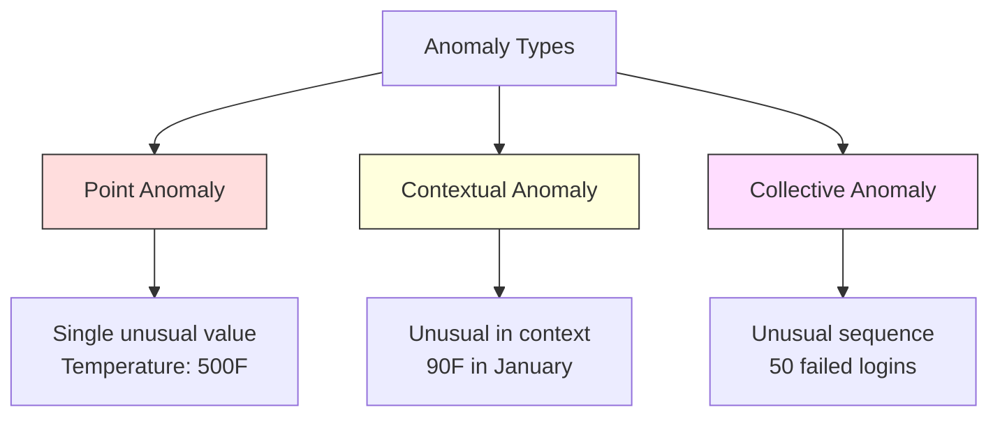
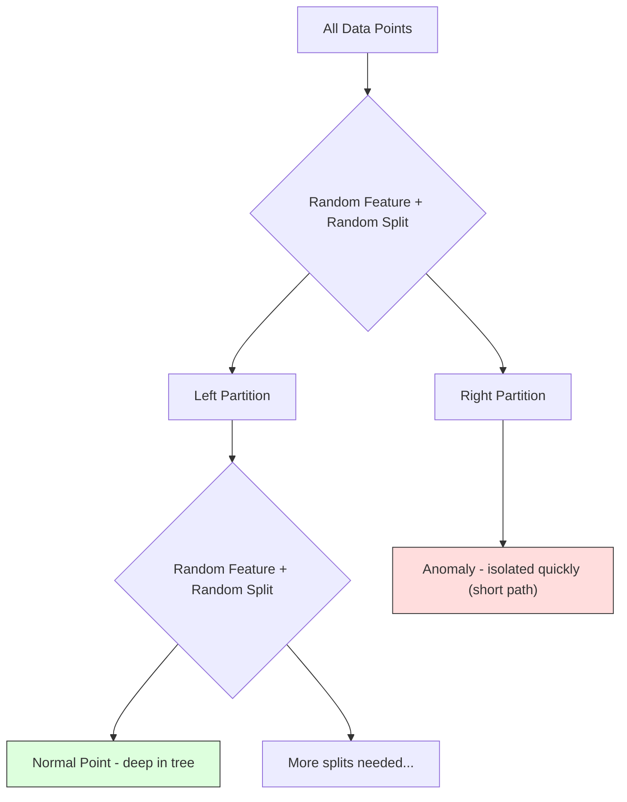
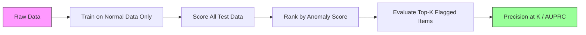

# 이상 탐지 (Anomaly Detection)

> 정상은 정의하기 쉽다. 비정상은 맞지 않는 모든 것이다.

**Type:** Build
**Language:** Python
**Prerequisites:** Phase 2, Lessons 01-09
**Time:** ~75분

## 학습 목표 (Learning Objectives)

- Z-점수(Z-score), IQR, 격리 숲(Isolation Forest) 이상 탐지(anomaly detection) 기법을 밑바닥부터 구현하기
- 점 이상(point anomaly), 맥락 이상(contextual anomaly), 집단 이상(collective anomaly)을 구별하고 각각에 적절한 탐지 기법 선택하기
- 이상 탐지가 이상을 분류하는 것이 아니라 정상 데이터를 모델링하는 것으로 구성되는 이유를 설명하기
- 비지도 이상 탐지를 지도 분류(supervised classification)와 비교하고, 새로운 이상 포괄성과 정밀도(precision) 사이의 트레이드오프(trade-off)를 평가하기

## 문제 (The Problem)

신용카드가 오후 2시에 뉴욕에서 쓰이고, 오후 2시 5분에 도쿄에서 쓰인다. 공장 센서가 정상 범위가 80-120일 때 150도를 읽는다. 서버가 일일 평균이 200일 때 초당 50,000 요청을 보낸다.

이것들은 이상(anomaly)이다. 그것들을 찾는 것이 중요하다. 사기는 수십억의 비용이 든다. 장비 고장은 가동 중단 비용이 든다. 네트워크 침입은 데이터 비용이 든다.

도전 과제: 당신은 이상의 레이블된 예제를 좀처럼 갖지 못한다. 사기는 거래의 0.1%를 차지한다. 장비 고장은 연간 몇 번 일어난다. "이상" 클래스에서 배울 것이 거의 없으므로 표준 분류기(classifier)를 학습시킬 수 없다. 일부 레이블이 있더라도, 당신이 본 이상이 마주칠 유일한 유형은 아니다. 내일의 사기 수법은 오늘과 다르게 보인다.

이상 탐지는 문제를 뒤집는다. 무엇이 비정상인지 학습하는 대신, 무엇이 정상인지 학습한다. 정상에서 벗어나는 모든 것이 의심스럽다. 이것은 레이블(label) 없이 작동하고, 새로운 유형의 이상에 적응하며, 거대한 데이터셋(dataset)으로 확장된다.

## 개념 (The Concept)

### 이상의 유형 (Types of Anomalies)

모든 이상이 같지는 않다:

- **점 이상(Point anomalies).** 맥락과 무관하게 비정상적인 단일 데이터 포인트. 500도의 기온 측정값. 보통 $50을 쓰는 계정의 $50,000 거래.
- **맥락 이상(Contextual anomalies).** 맥락이 주어졌을 때 비정상적인 데이터 포인트. 90도의 기온은 여름에는 정상이고 겨울에는 비정상이다. 같은 값, 다른 맥락.
- **집단 이상(Collective anomalies).** 각 개별 포인트는 정상일 수 있지만, 집단으로서 비정상적인 데이터 포인트의 연속. 5번의 로그인 실패는 정상이다. 연속 50번은 무차별 대입(brute-force) 공격이다.

대부분의 기법은 점 이상을 탐지한다. 맥락 이상은 시간이나 위치 특성(feature)이 필요하다. 집단 이상은 시퀀스 인지(sequence-aware) 기법이 필요하다.



### 비지도 구성 (The Unsupervised Framing)

표준 분류에서는 두 클래스 모두에 대한 레이블이 있다. 이상 탐지에서는 보통 세 가지 상황 중 하나다:

1. **완전 비지도(Fully unsupervised).** 레이블이 전혀 없다. 모든 데이터에 탐지기를 적합하고, 이상이 "정상" 모델을 오염시키지 않을 만큼 충분히 드물기를 바란다.
2. **준지도(Semi-supervised).** 정상 데이터만으로 된 깨끗한 데이터셋이 있다. 이 깨끗한 세트에 적합하고 다른 모든 것을 점수 매긴다. 가능할 때 가장 강력한 설정이다.
3. **약지도(Weakly supervised).** 레이블된 이상이 몇 개 있다. 학습이 아니라 평가에 쓴다. 비지도로 학습한 뒤, 레이블된 부분집합에서 정밀도/재현율(recall)을 측정한다.

핵심 통찰: 이상 탐지는 근본적으로 분류와 다르다. 두 클래스 사이의 결정 경계(decision boundary)가 아니라, 정상 데이터의 분포를 모델링하는 것이다.

### 지도 vs 비지도: 트레이드오프 (Supervised vs Unsupervised: The Tradeoff)

레이블된 이상이 정말로 있다면, 학습(지도 분류)에 써야 하나 평가에만 써야 하나(비지도 탐지)?

**지도(분류로 취급):**
- 전에 본 정확한 유형의 이상을 잡는다
- 알려진 이상 유형에서 더 높은 정밀도
- 새로운 이상 유형을 완전히 놓친다
- 새 이상 유형이 등장하면 재학습이 필요하다
- 충분한 이상 예제가 필요하다(종종 너무 적다)

**비지도(정상을 모델링, 편차를 표시):**
- 새로운 유형을 포함해 정상에서의 어떤 편차든 잡는다
- 레이블된 이상이 필요 없다
- 더 높은 거짓 양성(false positive) 비율(비정상이라고 다 나쁜 것은 아니다)
- 분포 이동(distribution shift)에 더 강건하다

실무에서 최선의 시스템은 둘을 결합한다: 넓은 포괄을 위한 비지도 탐지, 알려진 고우선순위 이상 유형을 위한 지도 모델, 그리고 모호한 경우를 위한 사람 검토.

### Z-점수 기법 (Z-Score Method)

가장 단순한 접근법. 각 특성의 평균과 표준편차를 계산한다. 평균에서 k 표준편차 이상 떨어진 포인트를 표시한다.

```text
z_score = (x - mean) / std
anomaly if |z_score| > threshold
```

기본 임계값은 3.0이다(가우시안 분포에서 정상 데이터의 99.7%가 3 표준편차 이내에 든다).

**강점:** 단순하다. 빠르다. 해석 가능하다("이 값은 정상에서 4.5 표준편차다").

**약점:** 데이터가 정규 분포(normally distributed)임을 가정한다. 학습 데이터의 이상치(outlier)에 민감하다(이상치가 평균을 이동시키고 표준편차를 부풀려, 탐지하기 더 어렵게 만든다). 다봉 분포(multimodal distribution)에서 실패한다.

**잘 작동할 때:** 데이터가 대략 종 모양인 단일 특성 모니터링. 서버 응답 시간, 제조 공차, 안정적인 베이스라인(baseline)을 가진 센서 측정값.

**실패할 때:** 다중 군집 데이터(서로 다른 베이스라인 기온을 가진 두 사무실 위치), 치우친 데이터(skewed data, $1000이 드물지만 비정상은 아닌 거래 금액), 학습 세트에 이상치가 있는 데이터.

### IQR 기법 (IQR Method)

Z-점수보다 더 강건하다. 평균과 표준편차 대신 사분위 범위(interquartile range)를 쓴다.

```
Q1 = 25th percentile
Q3 = 75th percentile
IQR = Q3 - Q1
lower_bound = Q1 - factor * IQR
upper_bound = Q3 + factor * IQR
anomaly if x < lower_bound or x > upper_bound
```

기본 인자(factor)는 1.5다.

**강점:** 이상치에 강건하다(백분위수는 극단값에 영향받지 않는다). 치우친 분포에서 작동한다. 정규성 가정이 없다.

**약점:** 단변량(univariate)에만 적용된다(특성별로 독립적으로 적용된다). 특성들을 함께 고려할 때만 비정상인 이상을 탐지할 수 없다(어떤 포인트가 각 특성에서는 개별적으로 정상이지만 결합 공간(joint space)에서는 비정상일 수 있다).

**실용적 참고:** IQR의 1.5 인자는 상자 그림(box plot)의 수염(whisker)에 해당한다. 수염 밖의 포인트는 잠재적 이상치다. 1.5 대신 3.0을 쓰면 탐지기가 더 보수적이 된다(더 적은 표시, 더 적은 거짓 양성). 올바른 인자는 거짓 경보에 대한 당신의 허용 범위에 달려 있다.

### 격리 숲 (Isolation Forest)

핵심 통찰: 이상은 적고 다르다. 데이터의 무작위 분할에서, 이상은 격리(isolate)하기 더 쉽다 -- 나머지에서 분리되는 데 더 적은 무작위 분할이 필요하다.



**작동 방식:**
1. 많은 무작위 트리를 만든다(격리 숲)
2. 각 노드에서, 무작위 특성과 그 특성의 최솟값·최댓값 사이의 무작위 분할 값을 고른다
3. 모든 포인트가 격리될 때까지(자신의 리프(leaf)에) 계속 분할한다
4. 이상은 모든 트리에 걸쳐 더 짧은 평균 경로 길이를 갖는다

**왜 작동하는가:** 정상 포인트는 밀집된 영역에 산다. 하나를 이웃에서 격리하려면 많은 무작위 분할이 필요하다. 이상은 희소한 영역에 산다. 그것들을 격리하는 데 한두 번의 무작위 분할이면 충분하다.

이상 점수(anomaly score)는 모든 트리에 걸친 평균 경로 길이에 기반하며, 무작위 이진 탐색 트리의 기대 경로 길이로 정규화된다:

```
score(x) = 2^(-average_path_length(x) / c(n))
```

여기서 `c(n)`은 n개 샘플에 대한 기대 경로 길이다. 점수가 1에 가까우면 이상이다. 0.5에 가까우면 정상이다. 0에 가까우면 매우 정상이다(밀집 군집 깊숙이).

**강점:** 분포 가정이 없다. 고차원에서 작동한다. 잘 확장된다(각 트리가 부분 샘플을 쓰기 때문에 샘플 크기에 대해 준선형(sublinear)). 혼합 특성 유형을 다룬다.

**약점:** 밀집 영역의 이상에 어려움을 겪는다(가림 효과(masking effect)). 무관한 특성이 많을 때 무작위 분할의 효과가 떨어진다.

**핵심 하이퍼파라미터:**
- `n_estimators`: 트리의 개수. 보통 100이면 충분하다. 트리가 많을수록 더 안정적인 점수를 주지만 연산이 느려진다.
- `max_samples`: 트리당 샘플 수. 256이 원 논문의 기본값이다. 더 작은 값은 개별 트리를 덜 정확하게 만들지만 다양성을 늘린다. 부분 샘플링이 격리 숲을 빠르게 만드는 것이다 -- 각 트리는 데이터의 작은 일부만 본다.
- `contamination`: 이상의 기대 비율. 임계값 설정에만 쓰인다. 점수 자체에는 영향을 주지 않는다.

### 국소 이상치 인자 (Local Outlier Factor, LOF)

LOF는 어떤 포인트 주변의 국소 밀도를 그 이웃 주변의 밀도와 비교한다. 밀집된 영역들에 둘러싸인 희소한 영역의 포인트가 비정상이다.

**작동 방식:**
1. 각 포인트에 대해, 그 k개의 최근접 이웃을 찾는다
2. 국소 도달 가능 밀도(local reachability density, 이웃이 얼마나 밀집됐는지)를 계산한다
3. 각 포인트의 밀도를 그 이웃의 밀도와 비교한다
4. 어떤 포인트가 그 이웃보다 훨씬 낮은 밀도를 가지면, 그것은 이상치다

**LOF 점수:**
- LOF가 1.0에 가까우면 이웃과 비슷한 밀도(정상)
- LOF가 1.0보다 크면 이웃보다 낮은 밀도(잠재적 이상)
- LOF가 1.0보다 훨씬 크면(예: 2.0+) 현저히 낮은 밀도(이상일 가능성 높음)

"국소(local)" 부분이 결정적이다. 두 군집을 가진 데이터셋을 생각해 보라: 1000개 포인트의 밀집 군집과 50개 포인트의 희소 군집. 희소 군집 가장자리의 포인트는 전역적으로 비정상이 아니다 -- 이웃이 50개 있다. 하지만 그 즉각적인 이웃들이 그것보다 더 밀집돼 있다면 국소적으로 비정상이다. LOF는 전역 기법이 놓치는 이 미묘함을 포착한다.

**강점:** 국소 이상을 탐지한다(전역적으로 비정상이 아니더라도 그 이웃에서 비정상인 포인트). 서로 다른 밀도의 군집에서 작동한다.

**약점:** 큰 데이터셋에서 느리다(순진한 구현의 경우 O(n^2)). k의 선택에 민감하다. 매우 고차원에서 잘 작동하지 않는다(차원의 저주(curse of dimensionality)가 거리 계산에 영향을 미친다).

### 비교 (Comparison)

| 기법 | 가정 | 속도 | 고차원 처리 | 국소 이상치 탐지 |
|--------|------------|-------|-------------------|------------------------|
| Z-점수 (Z-score) | 정규분포 | 매우 빠름 | 가능 (특성별) | 불가 |
| IQR | 없음 (특성별) | 매우 빠름 | 가능 (특성별) | 불가 |
| 격리 숲 (Isolation Forest) | 없음 | 빠름 | 가능 | 부분적 |
| LOF | 거리가 의미를 가짐 | 느림 | 미흡 | 가능 |

### 평가의 어려움 (Evaluation Challenges)

이상 탐지기를 평가하는 것은 분류기를 평가하는 것보다 어렵다:

- **극단적인 클래스 불균형(class imbalance).** 이상이 0.1%일 때, 모든 것에 "정상"이라 예측하면 99.9% 정확도를 준다. 정확도는 쓸모없다.
- **AUROC는 오해를 부른다.** 심한 불균형에서, 모델이 실용적인 임계값에서 대부분의 이상을 놓치더라도 AUROC가 좋아 보일 수 있다.
- **더 나은 지표:** Precision@k(표시된 상위 k개 항목 중 몇 개가 진짜 이상인지), AUPRC(정밀도-재현율 곡선 아래 면적), 그리고 고정된 거짓 양성 비율에서의 재현율.



### 이상 탐지 파이프라인 (Anomaly Detection Pipeline)

실무에서 이상 탐지는 이 워크플로우를 따른다:

1. **베이스라인 데이터 수집.** 이상적으로는, 이상이 없거나 매우 적다고 알고 있는 기간.
2. **특성 공학(feature engineering).** 원시 특성에 파생 특성(이동 통계, 시간 특성, 비율)을 더한다.
3. **탐지기 학습.** 베이스라인 데이터에 적합한다. 모델은 "정상"이 어떻게 생겼는지 학습한다.
4. **새 데이터 점수 매기기.** 각 새 관측치가 이상 점수를 받는다.
5. **임계값 선택.** 점수 컷오프(cutoff)를 고른다. 이것은 비즈니스 결정이다: 높은 임계값은 더 적은 거짓 경보지만 더 많은 놓친 이상을 의미한다.
6. **경보와 조사.** 표시된 포인트는 사람 검토나 자동 대응으로 간다.
7. **피드백 수집.** 표시된 항목이 진짜 이상이었는지 거짓 경보였는지 기록한다. 이 데이터를 사용해 탐지기를 평가하고 시간에 따라 임계값을 조정한다.

파이프라인은 결코 "끝나지" 않는다. 데이터 분포가 이동하고, 새 이상 유형이 등장하며, 임계값은 조정이 필요하다. 이상 탐지를 일회성 모델이 아니라 살아 있는 시스템으로 다뤄라.

## 직접 만들기 (Build It)

`code/anomaly_detection.py`의 코드는 Z-점수, IQR, 격리 숲을 밑바닥부터 구현한다.

### Z-점수 탐지기 (Z-Score Detector)

```python
def zscore_detect(X, threshold=3.0):
    mean = X.mean(axis=0)
    std = X.std(axis=0)
    std[std == 0] = 1.0
    z = np.abs((X - mean) / std)
    return z.max(axis=1) > threshold
```

단순하고 벡터화돼 있다. 어떤 특성이든 임계값을 초과하면 포인트를 표시한다.

### IQR 탐지기 (IQR Detector)

```python
def iqr_detect(X, factor=1.5):
    q1 = np.percentile(X, 25, axis=0)
    q3 = np.percentile(X, 75, axis=0)
    iqr = q3 - q1
    iqr[iqr == 0] = 1.0
    lower = q1 - factor * iqr
    upper = q3 + factor * iqr
    outside = (X < lower) | (X > upper)
    return outside.any(axis=1)
```

### 밑바닥부터 만드는 격리 숲 (Isolation Forest from Scratch)

밑바닥 구현은 특성 공간을 무작위로 분할하는 격리 트리를 만든다:

```python
class IsolationTree:
    def __init__(self, max_depth):
        self.max_depth = max_depth

    def fit(self, X, depth=0):
        n, p = X.shape
        if depth >= self.max_depth or n <= 1:
            self.is_leaf = True
            self.size = n
            return self
        self.is_leaf = False
        self.feature = np.random.randint(p)
        x_min = X[:, self.feature].min()
        x_max = X[:, self.feature].max()
        if x_min == x_max:
            self.is_leaf = True
            self.size = n
            return self
        self.threshold = np.random.uniform(x_min, x_max)
        left_mask = X[:, self.feature] < self.threshold
        self.left = IsolationTree(self.max_depth).fit(X[left_mask], depth + 1)
        self.right = IsolationTree(self.max_depth).fit(X[~left_mask], depth + 1)
        return self
```

포인트를 격리하기까지의 경로 길이가 그 이상 점수를 결정한다. 더 짧은 경로는 더 비정상임을 뜻한다.

`IsolationForest` 클래스는 여러 트리를 감싼다:

```python
class IsolationForest:
    def __init__(self, n_estimators=100, max_samples=256, seed=42):
        self.n_estimators = n_estimators
        self.max_samples = max_samples

    def fit(self, X):
        sample_size = min(self.max_samples, X.shape[0])
        max_depth = int(np.ceil(np.log2(sample_size)))
        for _ in range(self.n_estimators):
            idx = rng.choice(X.shape[0], size=sample_size, replace=False)
            tree = IsolationTree(max_depth=max_depth)
            tree.fit(X[idx])
            self.trees.append(tree)

    def anomaly_score(self, X):
        avg_path = average path length across all trees
        scores = 2.0 ** (-avg_path / c(max_samples))
        return scores
```

정규화 인자 `c(n)`은 n개 원소를 가진 이진 탐색 트리에서 실패한 탐색의 기대 경로 길이다. 이는 `2 * H(n-1) - 2*(n-1)/n`과 같으며, 여기서 `H`는 조화수(harmonic number)다. 이 정규화는 서로 다른 크기의 데이터셋에 걸쳐 점수가 비교 가능하도록 보장한다.

### 데모 시나리오 (Demo Scenarios)

코드는 여러 테스트 시나리오를 생성한다:

1. **이상치를 가진 단일 군집.** 중심에서 멀리 이상이 주입된 2D 가우시안 군집. 모든 기법이 여기서 작동해야 한다.
2. **다봉 데이터.** 서로 다른 크기와 밀도의 세 군집. 군집 사이의 포인트가 비정상이다. 특성별 범위가 넓기 때문에 Z-점수가 어려움을 겪는다.
3. **고차원 데이터.** 50개 특성이지만, 이상은 그중 5개에서만 다르다. 기법들이 특성의 부분집합에서 이상을 찾을 수 있는지 시험한다.

각 데모는 정밀도, 재현율, F1, Precision@k를 사용해 모든 기법을 비교한다.

## 라이브러리로 써보기 (Use It)

sklearn으로(밑바닥이 아니라 라이브러리 구현 사용):

```python
from sklearn.ensemble import IsolationForest
from sklearn.neighbors import LocalOutlierFactor

iso = IsolationForest(n_estimators=100, contamination=0.05, random_state=42)
iso.fit(X_train)
predictions = iso.predict(X_test)

lof = LocalOutlierFactor(n_neighbors=20, contamination=0.05, novelty=True)
lof.fit(X_train)
predictions = lof.predict(X_test)
```

`contamination`이 이상의 기대 비율을 설정함에 유의하라. 그것을 올바르게 설정하는 것이 중요하다 -- 너무 낮으면 이상을 놓치고, 너무 높으면 거짓 경보를 만든다.

`anomaly_detection.py`의 코드는 같은 데이터에서 밑바닥 구현을 sklearn과 비교한다.

### sklearn Contamination 파라미터 (sklearn Contamination Parameter)

sklearn의 `contamination` 파라미터는 연속적인 이상 점수를 이진 예측으로 변환하는 임계값을 결정한다. 기저 점수를 바꾸지는 않는다.

```python
iso_5 = IsolationForest(contamination=0.05)
iso_10 = IsolationForest(contamination=0.10)
```

둘 다 같은 이상 점수를 만든다. 하지만 `iso_5`는 상위 5%를, `iso_10`은 상위 10%를 표시한다. 참된 이상 비율을 모른다면(보통 모른다), contamination을 "auto"로 설정하고 원시 점수를 직접 다뤄라. 거짓 양성과 거짓 음성(false negative) 사이의 비용 트레이드오프에 기반해 당신만의 임계값을 설정하라.

### 일클래스 SVM (One-Class SVM)

알아 둘 가치가 있는 또 다른 비지도 이상 탐지기. 일클래스 SVM은 고차원 특성 공간에서 정상 데이터 주위에 경계를 적합한다(커널 트릭(kernel trick) 사용).

```python
from sklearn.svm import OneClassSVM

oc_svm = OneClassSVM(kernel="rbf", gamma="auto", nu=0.05)
oc_svm.fit(X_train)
predictions = oc_svm.predict(X_test)
```

`nu` 파라미터는 이상의 비율을 근사한다. 일클래스 SVM은 소-중규모 데이터셋에서 잘 작동하지만 매우 큰 데이터로는 확장되지 않는다(커널 행렬이 이차적으로 자란다).

### 오토인코더 접근법 (미리보기) (Autoencoder Approach (Preview))

오토인코더(autoencoder)는 데이터를 압축하고 재구성하는 법을 학습하는 신경망(neural network)이다. 정상 데이터로 학습한다. 테스트 시점에, 이상은 높은 재구성 오차를 갖는데, 신경망이 정상 패턴만 재구성하는 법을 학습했기 때문이다.

이것은 Phase 3(딥러닝)에서 다루지만, 원리는 같다: 무엇이 정상인지 모델링하고, 벗어나는 것을 표시한다.

### 앙상블 이상 탐지 (Ensemble Anomaly Detection)

앙상블 기법(ensemble method)이 분류를 향상시키는 것처럼(Lesson 11), 여러 이상 탐지기를 결합하면 탐지가 향상된다. 가장 단순한 접근법:

1. 여러 탐지기를 실행한다(Z-점수, IQR, 격리 숲, LOF)
2. 각 탐지기의 점수를 [0, 1]로 정규화한다
3. 정규화된 점수를 평균낸다
4. 평균 점수에서 임계값 위의 포인트를 표시한다

서로 다른 기법은 서로 다른 실패 양상을 갖기 때문에 이것은 거짓 양성을 줄인다. 네 기법 모두에 의해 표시된 포인트는 거의 확실히 비정상이다. 단 하나의 기법에만 의해 표시된 포인트는 그 기법의 특이점일 수 있다.

더 정교한 앙상블은 (가능하다면 알려진 이상이 있는 검증 세트에서 측정한) 추정된 신뢰도로 각 탐지기에 가중치를 준다.

### 프로덕션 고려사항 (Production Considerations)

1. **임계값 표류(Threshold drift).** 데이터 분포가 이동함에 따라 고정 임계값은 낡게 된다. 이상 점수의 분포를 모니터링하고 주기적으로 조정하라.
2. **경보 피로(Alert fatigue).** 거짓 경보가 너무 많으면 운영자가 주의를 기울이지 않게 된다. 높은 임계값(더 적고 더 신뢰할 만한 경보)으로 시작하고 신뢰가 쌓이면 낮춰라.
3. **앙상블 접근법.** 프로덕션에서는 여러 탐지기를 결합하라. 여러 기법이 비정상이라고 동의할 때만 포인트를 표시하라. 이는 거짓 양성을 상당히 줄인다.
4. **특성 공학.** 원시 특성만으로는 좀처럼 충분하지 않다. 이동 통계, 비율, 마지막 사건 이후 경과 시간, 도메인 특화 특성을 추가하라. 좋은 특성 집합이 탐지기의 선택보다 더 중요하다.
5. **피드백 루프.** 운영자가 표시된 항목을 조사하고 확인하거나 기각할 때, 이를 시스템에 되먹임하라. 시간에 따라 레이블된 데이터를 축적해 탐지기를 평가하고 개선하라.

## 산출물 (Ship It)

이 레슨이 만들어내는 것:
- `outputs/skill-anomaly-detector.md` -- 올바른 탐지기를 고르기 위한 의사결정 스킬
- `code/anomaly_detection.py` -- 밑바닥부터 만든 Z-점수, IQR, 격리 숲, sklearn 비교 포함

### 임계값 고르기 (Choosing a Threshold)

이상 점수는 연속적이다. 이진 결정을 내리려면 임계값이 필요하다. 이것은 기술적 결정이 아니라 비즈니스 결정이다.

두 시나리오를 생각해 보라:
- **사기 탐지.** 사기를 놓치는 것은 비싸다(지불 거절, 고객 신뢰). 거짓 경보는 사람 분석가의 조사 5분이 든다. 더 많은 사기를 잡기 위해 임계값을 낮게 설정하고, 더 많은 거짓 경보를 받아들인다.
- **장비 정비.** 거짓 경보는 $50,000짜리 불필요한 가동 중단을 뜻한다. 놓친 고장은 $500,000짜리 수리를 뜻한다. 이 비용들을 균형 잡도록 임계값을 설정한다.

두 경우 모두, 최적 임계값은 거짓 양성과 거짓 음성 사이의 비용 비율에 달려 있다. 서로 다른 임계값에서 정밀도와 재현율을 그리고, 비용 함수를 겹쳐 놓고, 최소 비용 지점을 고른다.

### 프로덕션으로 확장하기 (Scaling to Production)

프로덕션에서의 실시간 이상 탐지를 위해:

1. **배치 학습, 온라인 점수 매기기.** 모델을 주기적으로(일별, 주별) 최근 정상 데이터에 학습한다. 각 새 관측치를 도착하는 대로 점수 매긴다.
2. **특성 계산이 일치해야 한다.** 30일에 걸친 이동 통계로 학습했다면, 새 관측치의 특성을 계산하려면 30일의 이력이 필요하다. 필요한 이력을 버퍼링하라.
3. **점수 분포 모니터링.** 시간에 따라 이상 점수의 분포를 추적하라. 중앙값 점수가 위로 표류하면, 데이터가 변하고 있거나 모델이 낡은 것이다.
4. **설명 가능성(Explainability).** 이상을 표시할 때, 이유를 말하라. Z-점수: "특성 X가 정상보다 4.2 표준편차 위다." 격리 숲: "이 포인트는 평균 3.1번의 분할로 격리됐다(정상 포인트는 8.5번 걸린다)."

## 연습 문제 (Exercises)

1. **임계값 튜닝.** 1.0부터 5.0까지 0.5 간격의 임계값으로 Z-점수 탐지기를 실행하라. 각 임계값에서 정밀도와 재현율을 그려라. 당신의 데이터에 대한 스위트 스폿(sweet spot)은 어디인가?

2. **다변량 이상.** 각 특성이 개별적으로는 정상으로 보이지만 조합은 비정상인 2D 데이터를 만들어라(예: 주 군집 대각선에서 멀리 떨어진 포인트). 특성별 Z-점수는 이것들을 놓치지만 격리 숲은 잡는다는 것을 보여라.

3. **밑바닥부터 만드는 LOF.** k-최근접 이웃을 사용해 국소 이상치 인자를 구현하라. 같은 데이터에서 sklearn의 LocalOutlierFactor와 비교하라. k=10과 k=50을 써라 -- k의 선택이 결과에 어떤 영향을 미치는가?

4. **스트리밍 이상 탐지.** Z-점수 탐지기를 스트리밍 설정에서 작동하도록 수정하라: 새 포인트가 도착함에 따라 누적 평균과 분산을 갱신한다(Welford의 온라인 알고리즘). 같은 데이터에서 배치 Z-점수와 비교하라.

5. **실세계 평가.** 알려진 이상이 있는 데이터셋을 가져와라(예: Kaggle의 신용카드 사기). precision@100, precision@500, AUPRC를 사용해 네 기법을 모두 평가하라. 어느 기법이 가장 잘 작동하는가? 왜인가?

## 핵심 용어 (Key Terms)

| 용어 | 흔히 하는 말 | 실제 의미 |
|------|----------------|----------------------|
| 이상치 (Anomaly) | "아웃라이어, 비정상적인 점" | 정상 데이터의 기대 패턴에서 크게 벗어나는 데이터 포인트다 |
| 점 이상치 (Point anomaly) | "단일한 이상한 값" | 맥락과 무관하게 비정상적인 개별 관측치다 |
| 맥락적 이상치 (Contextual anomaly) | "정상 값, 잘못된 맥락" | 자신의 맥락(시간, 위치 등)에서는 비정상적이지만 다른 맥락에서는 정상일 수 있는 관측치다 |
| 격리 숲 (Isolation Forest) | "무작위 분할로 이상치를 찾는다" | 정상 점보다 적은 분할로 이상치를 격리하는 무작위 트리들의 앙상블이다 |
| 국소 이상치 인자 (Local Outlier Factor) | "이웃과 밀도를 비교한다" | 국소 밀도가 이웃의 밀도보다 훨씬 낮은 점들을 표시하는 기법이다 |
| Z-점수 (Z-score) | "평균으로부터의 표준편차" | (x - mean) / std로, 한 점이 중심에서 표준편차 단위로 얼마나 떨어졌는지 측정한다 |
| IQR | "사분위 범위" | Q3 - Q1로, 데이터 중간 50%의 퍼짐을 측정하며 강건한 이상치 탐지에 쓰인다 |
| 오염도 (Contamination) | "예상되는 이상치 비율" | 탐지기에게 데이터의 어느 비율을 이상으로 표시해야 하는지 알려주는 하이퍼파라미터다 |
| Precision@k | "상위 k개 표시 중 진짜는 몇 개인가" | 가장 의심스러운 k개의 점에 대해서만 계산한 정밀도로, 불균형 이상 탐지에 유용하다 |
| AUPRC | "정밀도-재현율 곡선 아래 면적" | 모든 임계값에 걸친 정밀도-재현율 성능을 요약하는 지표로, 불균형 데이터에서는 AUROC보다 낫다 |

## 더 읽을거리 (Further Reading)

- [Liu et al., Isolation Forest (2008)](https://cs.nju.edu.cn/zhouzh/zhouzh.files/publication/icdm08b.pdf) -- 원조 격리 숲 논문
- [Breunig et al., LOF: Identifying Density-Based Local Outliers (2000)](https://dl.acm.org/doi/10.1145/342009.335388) -- 원조 LOF 논문
- [scikit-learn Outlier Detection docs](https://scikit-learn.org/stable/modules/outlier_detection.html) -- 모든 sklearn 이상 탐지기 개요
- [Chandola et al., Anomaly Detection: A Survey (2009)](https://dl.acm.org/doi/10.1145/1541880.1541882) -- 이상 탐지 기법에 대한 종합 서베이
- [Goldstein and Uchida, A Comparative Evaluation of Unsupervised Anomaly Detection Algorithms (2016)](https://journals.plos.org/plosone/article?id=10.1371/journal.pone.0152173) -- 실제 데이터셋에서 10가지 기법의 실증 비교
