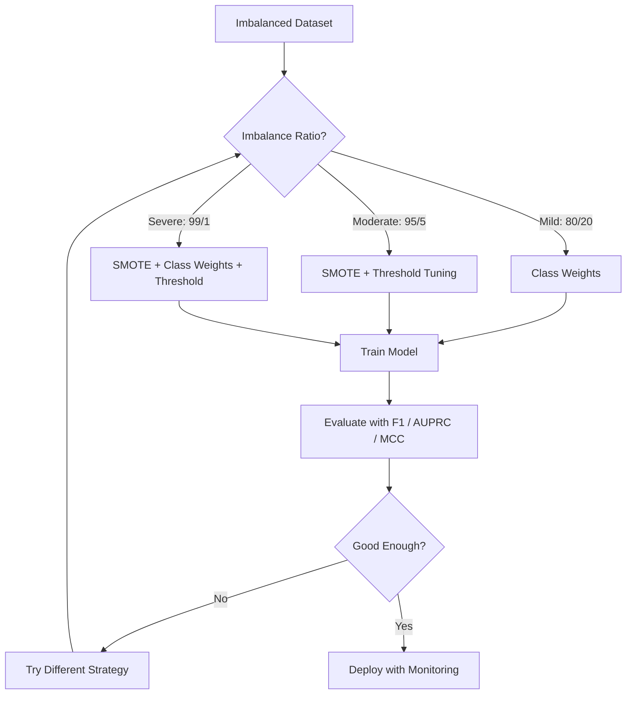
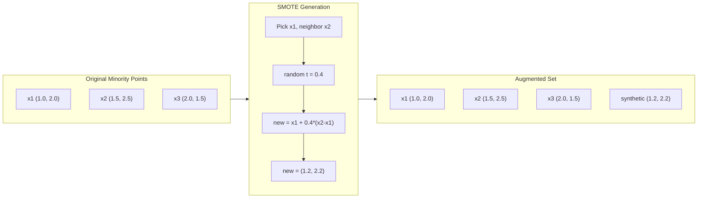
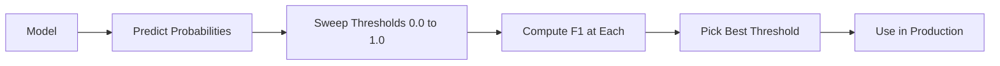
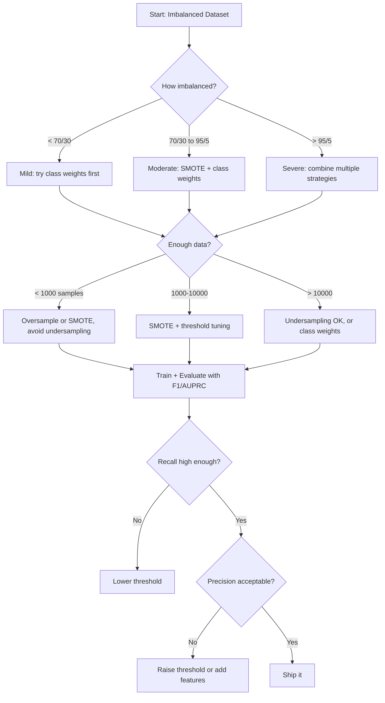

# 불균형 데이터 다루기 (Handling Imbalanced Data)

> 데이터의 99%가 "정상"일 때, 정확도(accuracy)는 거짓말이다.

**Type:** Build
**Language:** Python
**Prerequisites:** Phase 2, Lessons 01-09 (especially evaluation metrics)
**Time:** ~90분

## 학습 목표 (Learning Objectives)

- SMOTE를 밑바닥부터 구현하고, 합성 오버샘플링(synthetic oversampling)이 무작위 복제와 어떻게 다른지 설명하기
- 정확도 대신 F1, AUPRC, 매튜스 상관 계수(Matthews Correlation Coefficient)를 사용해 불균형 분류기(imbalanced classifier)를 평가하기
- 클래스 가중치(class weighting), 임계값 튜닝(threshold tuning), 리샘플링(resampling) 전략을 비교하고, 주어진 불균형 비율에 맞는 올바른 접근법 선택하기
- SMOTE, 클래스 가중치, 임계값 최적화를 결합하는 완전한 불균형 데이터 파이프라인(pipeline) 만들기

## 문제 (The Problem)

사기 탐지 모델(model)을 만든다. 99.9% 정확도를 얻는다. 축하한다. 그러다 그것이 모든 단일 거래에 대해 "사기 아님"을 예측한다는 것을 깨닫는다.

이것은 버그가 아니다. 거래의 0.1%만 사기일 때 이것은 합리적인 행동이다. 모델은 항상 다수 클래스(majority class)를 추측하는 것이 전체 오차를 최소화한다는 것을 학습한다. 기술적으로 옳고 완전히 쓸모없다.

이것은 실제 분류(classification)가 중요한 모든 곳에서 일어난다. 질병 진단: 1% 양성률. 네트워크 침입: 0.01% 공격. 제조 결함: 0.5% 불량. 스팸 필터링: 20% 스팸. 이탈 예측: 5% 이탈자. 소수 클래스(minority class)가 더 중대할수록 더 드문 경향이 있다.

정확도는 모든 올바른 예측을 똑같이 취급하기 때문에 실패한다. 정상 거래를 올바르게 레이블링하는 것과 사기를 올바르게 잡는 것이 둘 다 정확도 1점으로 친다. 하지만 사기를 잡는 것이 모델이 존재하는 이유 전부다. 우리는 모델이 드물지만 중요한 클래스에 주의를 기울이도록 강제하는 지표, 기법, 학습 전략이 필요하다.

## 개념 (The Concept)

### 정확도가 실패하는 이유 (Why Accuracy Fails)

샘플 1000개를 가진 데이터셋(dataset)을 생각해 보자: 음성 990개, 양성 10개. 항상 음성을 예측하는 모델:

|  | 양성으로 예측 | 음성으로 예측 |
|--|---|---|
| 실제 양성 | 0 (TP) | 10 (FN) |
| 실제 음성 | 0 (FP) | 990 (TN) |

정확도 = (0 + 990) / 1000 = 99.0%

모델은 사기를 0건 잡는다. 질병 0건. 결함 0건. 하지만 정확도는 99%라고 말한다. 이것이 정확도가 불균형 문제에서 위험한 이유다.

### 더 나은 지표 (Better Metrics)

**정밀도(Precision)** = TP / (TP + FP). 양성으로 표시된 모든 것 중, 몇 개가 실제로 양성인가? 높은 정밀도는 적은 거짓 경보를 의미한다.

**재현율(Recall)** = TP / (TP + FN). 실제로 양성인 모든 것 중, 몇 개를 잡았는가? 높은 재현율은 적은 놓친 양성을 의미한다.

**F1 점수(F1 Score)** = 2 * precision * recall / (precision + recall). 조화 평균. 산술 평균이 그럴 것보다 정밀도와 재현율 사이의 극단적인 불균형을 더 벌점한다.

**F-베타 점수(F-beta Score)** = (1 + beta^2) * precision * recall / (beta^2 * precision + recall). beta > 1일 때 재현율이 더 중요하다. beta < 1일 때 정밀도가 더 중요하다. F2는 사기 탐지에서 흔하다(사기를 놓치는 것이 거짓 경보보다 나쁘다).

**AUPRC**(정밀도-재현율 곡선 아래 면적, Area Under Precision-Recall Curve). AUC-ROC와 비슷하지만 불균형 데이터에 더 유익하다. 무작위 분류기는 (ROC처럼 0.5가 아니라) 양성 클래스 비율과 같은 AUPRC를 갖는다. 이는 개선을 더 보기 쉽게 만든다.

**매튜스 상관 계수(Matthews Correlation Coefficient)** = (TP * TN - FP * FN) / sqrt((TP+FP)(TP+FN)(TN+FP)(TN+FN)). -1부터 +1까지의 범위. 모델이 두 클래스 모두에서 잘할 때만 높은 점수를 준다. 클래스 크기가 매우 다를 때도 균형 잡혀 있다.

위의 "항상 음성 예측" 모델의 경우: 정밀도 = 0/0(정의되지 않음, 종종 0으로 설정), 재현율 = 0/10 = 0, F1 = 0, MCC = 0. 이 지표들은 모델을 쓸모없는 것으로 올바르게 식별한다.

### 불균형 데이터 파이프라인 (The Imbalanced Data Pipeline)



### SMOTE: 합성 소수 오버샘플링 기법 (SMOTE: Synthetic Minority Oversampling Technique)

무작위 오버샘플링은 기존 소수 샘플을 복제한다. 이는 작동하지만, 모델이 동일한 포인트를 반복적으로 보기 때문에 과적합(overfitting) 위험이 있다.

SMOTE는 그럴듯하지만 복사본은 아닌 새로운 합성 소수 샘플을 만든다. 알고리즘:

1. 각 소수 샘플 x에 대해, 다른 소수 샘플들 중 k개의 최근접 이웃(nearest neighbor)을 찾는다
2. 무작위로 이웃 하나를 고른다
3. x와 그 이웃 사이의 선분 위에 새 샘플을 만든다

공식: `new_sample = x + random(0, 1) * (neighbor - x)`

이는 실제 소수 포인트 사이를 보간(interpolate)해, 기존 데이터를 단지 복사하지 않으면서 특성 공간(feature space)의 같은 영역에 샘플을 만든다.



### 샘플링 전략 비교 (Sampling Strategies Compared)

**무작위 오버샘플링(Random Oversampling)**: 소수 샘플을 복제해 다수 개수에 맞춘다.
- 장점: 단순하고, 정보 손실 없음
- 단점: 정확한 복제본이 과적합을 일으키고, 학습 시간이 증가한다

**무작위 언더샘플링(Random Undersampling)**: 다수 샘플을 제거해 소수 개수에 맞춘다.
- 장점: 빠른 학습, 단순함
- 단점: 잠재적으로 유용한 다수 데이터를 버리고, 분산(variance)이 더 높다

**SMOTE**: 보간을 통해 합성 소수 샘플을 만든다.
- 장점: 새로운 데이터 포인트를 생성하고, 무작위 오버샘플링에 비해 과적합을 줄인다
- 단점: 결정 경계(decision boundary) 근처에 노이즈가 많은 샘플을 만들 수 있고, 다수 클래스 분포를 고려하지 않는다

| 전략 | 변경되는 데이터 | 위험 | 사용 시기 |
|----------|-------------|------|-------------|
| 오버샘플링 (Oversample) | 소수 클래스 복제 | 과적합 | 작은 데이터셋, 중간 정도 불균형 |
| 언더샘플링 (Undersample) | 다수 클래스 제거 | 정보 손실 | 큰 데이터셋, 빠른 학습을 원할 때 |
| SMOTE | 합성 소수 클래스 추가 | 경계 노이즈 | 중간 정도 불균형, k-NN에 충분한 소수 클래스 샘플 |

### 클래스 가중치 (Class Weights)

데이터를 바꾸는 대신, 모델이 오차를 다루는 방식을 바꾼다. 소수 클래스를 잘못 분류하는 것에 더 높은 가중치를 부여한다.

음성 950개와 양성 50개 샘플을 가진 이진 문제의 경우:
- 음성 클래스 가중치 = n_samples / (2 * n_negative) = 1000 / (2 * 950) = 0.526
- 양성 클래스 가중치 = n_samples / (2 * n_positive) = 1000 / (2 * 50) = 10.0

양성 클래스가 19배의 가중치를 받는다. 양성 샘플 하나를 잘못 분류하는 것이 음성 샘플 19개를 잘못 분류하는 것만큼의 비용이 든다. 모델은 소수 클래스에 주의를 기울이도록 강제된다.

로지스틱 회귀(logistic regression)에서, 이는 손실 함수(loss function)를 수정한다:

```
weighted_loss = -sum(w_i * [y_i * log(p_i) + (1-y_i) * log(1-p_i)])
```

여기서 w_i는 샘플 i의 클래스에 달려 있다.

클래스 가중치는 기댓값 측면에서 오버샘플링과 수학적으로 동등하지만, 새 데이터 포인트를 만들지 않는다. 이는 더 빠르고 복제된 샘플의 과적합 위험을 피하게 한다.

### 임계값 튜닝 (Threshold Tuning)

대부분의 분류기는 확률을 출력한다. 기본 임계값은 0.5다: P(positive) >= 0.5이면 양성으로 예측한다. 하지만 0.5는 임의적이다. 클래스가 불균형일 때, 최적 임계값은 보통 훨씬 더 낮다.

과정:
1. 모델을 학습시킨다
2. 검증 세트에서 예측된 확률을 얻는다
3. 임계값을 0.0부터 1.0까지 훑는다
4. 각 임계값에서 F1(또는 선택한 지표)을 계산한다
5. 지표를 최대화하는 임계값을 고른다



모델이 사기 거래에 대해 P(fraud) = 0.15를 출력할 수 있다. 임계값 0.5에서, 이것은 사기 아님으로 분류된다. 임계값 0.10에서, 그것은 올바르게 잡힌다. 확률 보정(probability calibration)은 순위보다 덜 중요하다 -- 사기가 비사기보다 더 높은 확률을 받는 한, 그것들을 분리하는 임계값이 존재한다.

### 비용 민감 학습 (Cost-Sensitive Learning)

클래스 가중치의 일반화. 균일한 비용 대신, 특정한 오분류 비용을 부여한다:

| | 양성으로 예측 | 음성으로 예측 |
|--|---|---|
| 실제 양성 | 0 (정답) | C_FN = 100 |
| 실제 음성 | C_FP = 1 | 0 (정답) |

사기 거래를 놓치는 것(FN)이 거짓 경보(FP)보다 100배의 비용이 든다. 모델은 전체 오차 개수가 아니라 전체 비용에 대해 최적화한다.

이것은 실세계 비용을 추정할 수 있을 때 가장 원칙적인 접근법이다. 놓친 암 진단은 추가 생검으로 이어지는 거짓 경보와 매우 다른 비용을 갖는다. 이 비용들을 명시적으로 만드는 것이 올바른 트레이드오프(trade-off)를 강제한다.

### 의사결정 순서도 (Decision Flowchart)



## 직접 만들기 (Build It)

### 1단계: 불균형 데이터셋 생성

```python
import numpy as np


def make_imbalanced_data(n_majority=950, n_minority=50, seed=42):
    rng = np.random.RandomState(seed)

    X_maj = rng.randn(n_majority, 2) * 1.0 + np.array([0.0, 0.0])
    X_min = rng.randn(n_minority, 2) * 0.8 + np.array([2.5, 2.5])

    X = np.vstack([X_maj, X_min])
    y = np.concatenate([np.zeros(n_majority), np.ones(n_minority)])

    shuffle_idx = rng.permutation(len(y))
    return X[shuffle_idx], y[shuffle_idx]
```

### 2단계: 밑바닥부터 만드는 SMOTE

```python
def euclidean_distance(a, b):
    return np.sqrt(np.sum((a - b) ** 2))


def find_k_neighbors(X, idx, k):
    distances = []
    for i in range(len(X)):
        if i == idx:
            continue
        d = euclidean_distance(X[idx], X[i])
        distances.append((i, d))
    distances.sort(key=lambda x: x[1])
    return [d[0] for d in distances[:k]]


def smote(X_minority, k=5, n_synthetic=100, seed=42):
    rng = np.random.RandomState(seed)
    n_samples = len(X_minority)
    k = min(k, n_samples - 1)
    synthetic = []

    for _ in range(n_synthetic):
        idx = rng.randint(0, n_samples)
        neighbors = find_k_neighbors(X_minority, idx, k)
        neighbor_idx = neighbors[rng.randint(0, len(neighbors))]
        t = rng.random()
        new_point = X_minority[idx] + t * (X_minority[neighbor_idx] - X_minority[idx])
        synthetic.append(new_point)

    return np.array(synthetic)
```

### 3단계: 무작위 오버샘플링과 언더샘플링

```python
def random_oversample(X, y, seed=42):
    rng = np.random.RandomState(seed)
    classes, counts = np.unique(y, return_counts=True)
    max_count = counts.max()

    X_resampled = list(X)
    y_resampled = list(y)

    for cls, count in zip(classes, counts):
        if count < max_count:
            cls_indices = np.where(y == cls)[0]
            n_needed = max_count - count
            chosen = rng.choice(cls_indices, size=n_needed, replace=True)
            X_resampled.extend(X[chosen])
            y_resampled.extend(y[chosen])

    X_out = np.array(X_resampled)
    y_out = np.array(y_resampled)
    shuffle = rng.permutation(len(y_out))
    return X_out[shuffle], y_out[shuffle]


def random_undersample(X, y, seed=42):
    rng = np.random.RandomState(seed)
    classes, counts = np.unique(y, return_counts=True)
    min_count = counts.min()

    X_resampled = []
    y_resampled = []

    for cls in classes:
        cls_indices = np.where(y == cls)[0]
        chosen = rng.choice(cls_indices, size=min_count, replace=False)
        X_resampled.extend(X[chosen])
        y_resampled.extend(y[chosen])

    X_out = np.array(X_resampled)
    y_out = np.array(y_resampled)
    shuffle = rng.permutation(len(y_out))
    return X_out[shuffle], y_out[shuffle]
```

### 4단계: 클래스 가중치를 적용한 로지스틱 회귀

```python
def sigmoid(z):
    return 1.0 / (1.0 + np.exp(-np.clip(z, -500, 500)))


def logistic_regression_weighted(X, y, weights, lr=0.01, epochs=200):
    n_samples, n_features = X.shape
    w = np.zeros(n_features)
    b = 0.0

    for _ in range(epochs):
        z = X @ w + b
        pred = sigmoid(z)
        error = pred - y
        weighted_error = error * weights

        gradient_w = (X.T @ weighted_error) / n_samples
        gradient_b = np.mean(weighted_error)

        w -= lr * gradient_w
        b -= lr * gradient_b

    return w, b


def compute_class_weights(y):
    classes, counts = np.unique(y, return_counts=True)
    n_samples = len(y)
    n_classes = len(classes)
    weight_map = {}
    for cls, count in zip(classes, counts):
        weight_map[cls] = n_samples / (n_classes * count)
    return np.array([weight_map[yi] for yi in y])
```

### 5단계: 임계값 튜닝

```python
def find_optimal_threshold(y_true, y_probs, metric="f1"):
    best_threshold = 0.5
    best_score = -1.0

    for threshold in np.arange(0.05, 0.96, 0.01):
        y_pred = (y_probs >= threshold).astype(int)
        tp = np.sum((y_pred == 1) & (y_true == 1))
        fp = np.sum((y_pred == 1) & (y_true == 0))
        fn = np.sum((y_pred == 0) & (y_true == 1))

        if metric == "f1":
            precision = tp / (tp + fp) if (tp + fp) > 0 else 0.0
            recall = tp / (tp + fn) if (tp + fn) > 0 else 0.0
            score = 2 * precision * recall / (precision + recall) if (precision + recall) > 0 else 0.0
        elif metric == "recall":
            score = tp / (tp + fn) if (tp + fn) > 0 else 0.0
        elif metric == "precision":
            score = tp / (tp + fp) if (tp + fp) > 0 else 0.0

        if score > best_score:
            best_score = score
            best_threshold = threshold

    return best_threshold, best_score
```

### 6단계: 평가 함수

```python
def confusion_matrix_values(y_true, y_pred):
    tp = np.sum((y_pred == 1) & (y_true == 1))
    tn = np.sum((y_pred == 0) & (y_true == 0))
    fp = np.sum((y_pred == 1) & (y_true == 0))
    fn = np.sum((y_pred == 0) & (y_true == 1))
    return tp, tn, fp, fn


def compute_metrics(y_true, y_pred):
    tp, tn, fp, fn = confusion_matrix_values(y_true, y_pred)
    accuracy = (tp + tn) / (tp + tn + fp + fn)
    precision = tp / (tp + fp) if (tp + fp) > 0 else 0.0
    recall = tp / (tp + fn) if (tp + fn) > 0 else 0.0
    f1 = 2 * precision * recall / (precision + recall) if (precision + recall) > 0 else 0.0

    denom = np.sqrt(float((tp + fp) * (tp + fn) * (tn + fp) * (tn + fn)))
    mcc = (tp * tn - fp * fn) / denom if denom > 0 else 0.0

    return {
        "accuracy": accuracy,
        "precision": precision,
        "recall": recall,
        "f1": f1,
        "mcc": mcc,
    }
```

### 7단계: 모든 접근법 비교

```python
X, y = make_imbalanced_data(950, 50, seed=42)
split = int(0.8 * len(y))
X_train, X_test = X[:split], X[split:]
y_train, y_test = y[:split], y[split:]

# Baseline: no treatment
w_base, b_base = logistic_regression_weighted(
    X_train, y_train, np.ones(len(y_train)), lr=0.1, epochs=300
)
probs_base = sigmoid(X_test @ w_base + b_base)
preds_base = (probs_base >= 0.5).astype(int)

# Oversampled
X_over, y_over = random_oversample(X_train, y_train)
w_over, b_over = logistic_regression_weighted(
    X_over, y_over, np.ones(len(y_over)), lr=0.1, epochs=300
)
preds_over = (sigmoid(X_test @ w_over + b_over) >= 0.5).astype(int)

# SMOTE
minority_mask = y_train == 1
X_minority = X_train[minority_mask]
synthetic = smote(X_minority, k=5, n_synthetic=len(y_train) - 2 * int(minority_mask.sum()))
X_smote = np.vstack([X_train, synthetic])
y_smote = np.concatenate([y_train, np.ones(len(synthetic))])
w_sm, b_sm = logistic_regression_weighted(
    X_smote, y_smote, np.ones(len(y_smote)), lr=0.1, epochs=300
)
preds_smote = (sigmoid(X_test @ w_sm + b_sm) >= 0.5).astype(int)

# Class weights
sample_weights = compute_class_weights(y_train)
w_cw, b_cw = logistic_regression_weighted(
    X_train, y_train, sample_weights, lr=0.1, epochs=300
)
probs_cw = sigmoid(X_test @ w_cw + b_cw)
preds_cw = (probs_cw >= 0.5).astype(int)

# Threshold tuning (tune on held-out validation set, not test set)
probs_val = sigmoid(X_val @ w_cw + b_cw)
best_thresh, best_f1 = find_optimal_threshold(y_val, probs_val, metric="f1")
preds_thresh = (probs_cw >= best_thresh).astype(int)
```

코드 파일은 이 모두를 단일 스크립트에서 실행하고 결과를 출력한다.

## 라이브러리로 써보기 (Use It)

scikit-learn과 imbalanced-learn으로, 이 기법들은 한 줄짜리다:

```python
from sklearn.linear_model import LogisticRegression
from sklearn.metrics import classification_report, f1_score
from sklearn.model_selection import train_test_split
from imblearn.over_sampling import SMOTE
from imblearn.under_sampling import RandomUnderSampler
from imblearn.pipeline import Pipeline

X_train, X_test, y_train, y_test = train_test_split(X, y, stratify=y)

model_weighted = LogisticRegression(class_weight="balanced")
model_weighted.fit(X_train, y_train)
print(classification_report(y_test, model_weighted.predict(X_test)))

smote = SMOTE(random_state=42)
X_resampled, y_resampled = smote.fit_resample(X_train, y_train)
model_smote = LogisticRegression()
model_smote.fit(X_resampled, y_resampled)
print(classification_report(y_test, model_smote.predict(X_test)))

pipeline = Pipeline([
    ("smote", SMOTE()),
    ("model", LogisticRegression(class_weight="balanced")),
])
pipeline.fit(X_train, y_train)
print(classification_report(y_test, pipeline.predict(X_test)))
```

밑바닥 구현은 각 기법이 정확히 무엇을 하는지 보여준다. SMOTE는 소수 클래스에 대한 k-NN 보간일 뿐이다. 클래스 가중치는 손실을 곱한다. 임계값 튜닝은 컷오프에 대한 for 루프다. 마법은 없다.

## 산출물 (Ship It)

이 레슨이 만들어내는 것:
- `outputs/skill-imbalanced-data.md` -- 불균형 분류 문제를 다루기 위한 의사결정 체크리스트

## 연습 문제 (Exercises)

1. **경계선 SMOTE(Borderline-SMOTE)**: SMOTE 구현을 수정해 결정 경계 근처에 있는 소수 포인트(그 k-최근접 이웃에 다수 클래스 샘플이 포함되는 포인트)에 대해서만 합성 샘플을 생성하라. 클래스가 겹치는 데이터셋에서 표준 SMOTE와 결과를 비교하라.

2. **비용 행렬 최적화**: 비용 행렬이 파라미터(parameter)인 비용 민감 학습을 구현하라. 비용 행렬을 받아 기대 비용을 최소화하는 최적 예측을 반환하는 함수를 만들어라. 서로 다른 비용 비율(1:10, 1:100, 1:1000)로 테스트하고, 정밀도-재현율 트레이드오프가 어떻게 변하는지 그려라.

3. **임계값 보정**: 플랫 스케일링(Platt scaling, 보정된 확률을 만들기 위해 모델의 원시 출력에 로지스틱 회귀를 적합)을 구현하라. 보정 전후의 정밀도-재현율 곡선을 비교하라. 보정이 순위를 바꾸지 않지만(AUC가 동일하게 유지됨) 확률을 더 유의미하게 만든다는 것을 보여라.

4. **균형 배깅을 동반한 앙상블**: 각각 균형 잡힌 부트스트랩 샘플(모든 소수 + 다수의 무작위 부분집합)로 여러 모델을 학습시켜라. 그 예측을 평균내라. 이 접근법을 SMOTE를 적용한 단일 모델과 비교하라. 실행 전반의 성능과 분산 둘 다를 측정하라.

5. **불균형 비율 실험**: 균형 잡힌 데이터셋을 가져와 불균형 비율을 점진적으로 늘려라(50/50, 70/30, 90/10, 95/5, 99/1). 각 비율에 대해 SMOTE가 있을 때와 없을 때 학습하라. 두 접근법에 대해 불균형 비율에 따른 F1을 그려라. 어느 비율에서 SMOTE가 유의미한 차이를 만들기 시작하는가?

## 핵심 용어 (Key Terms)

| 용어 | 흔히 하는 말 | 실제 의미 |
|------|----------------|----------------------|
| 클래스 불균형 (Class imbalance) | "한 클래스가 샘플이 훨씬 많다" | 데이터셋의 클래스 분포가 크게 치우쳐, 모델이 다수 클래스를 선호하게 만드는 것이다 |
| SMOTE | "합성 오버샘플링" | 기존 소수 클래스 샘플과 그 k-최근접 소수 클래스 이웃 사이를 보간하여 새 소수 클래스 샘플을 생성한다 |
| 클래스 가중치 (Class weights) | "희귀 클래스의 오류를 더 비싸게 만들기" | 손실 함수에 클래스별 가중치를 곱하여, 모델이 소수 클래스 오분류에 더 무거운 페널티를 주게 한다 |
| 임계값 튜닝 (Threshold tuning) | "결정 경계를 옮기기" | 분류의 확률 컷오프를 기본값 0.5에서 원하는 지표를 최적화하는 값으로 바꾸는 것이다 |
| 정밀도-재현율 트레이드오프 (Precision-recall tradeoff) | "둘 다 가질 수는 없다" | 임계값을 낮추면 더 많은 양성을 잡지만(높은 재현율) 더 많은 거짓 양성도 표시하며(낮은 정밀도), 그 반대도 마찬가지다 |
| AUPRC | "PR 곡선 아래 면적" | 정밀도-재현율 곡선을 하나의 수로 요약하며, 클래스가 심하게 불균형할 때 AUC-ROC보다 더 유용하다 |
| 매튜스 상관계수 (Matthews Correlation Coefficient) | "균형 잡힌 지표" | 예측 라벨과 실제 라벨 사이의 상관으로, 모델이 두 클래스 모두에서 잘 수행할 때만 높은 점수를 낸다 |
| 비용 민감 학습 (Cost-sensitive learning) | "실수마다 비용이 다르다" | 실제 오분류 비용을 학습 목적에 반영하여, 모델이 오류 개수가 아니라 총비용을 최적화하게 한다 |
| 무작위 오버샘플링 (Random oversampling) | "소수 클래스를 복제하기" | 소수 클래스 샘플을 반복하여 클래스 개수를 맞추는 것으로, 단순하지만 복제된 점에 과적합할 위험이 있다 |

## 더 읽을거리 (Further Reading)

- [SMOTE: Synthetic Minority Over-sampling Technique (Chawla et al., 2002)](https://arxiv.org/abs/1106.1813) -- 원조 SMOTE 논문, 여전히 불균형 학습에서 가장 많이 인용되는 연구
- [Learning from Imbalanced Data (He & Garcia, 2009)](https://ieeexplore.ieee.org/document/5128907) -- 샘플링, 비용 민감, 알고리즘적 접근법을 다루는 종합 서베이
- [imbalanced-learn documentation](https://imbalanced-learn.org/stable/) -- SMOTE 변형, 언더샘플링 전략, 파이프라인 통합을 갖춘 Python 라이브러리
- [The Precision-Recall Plot Is More Informative than the ROC Plot (Saito & Rehmsmeier, 2015)](https://journals.plos.org/plosone/article?id=10.1371/journal.pone.0118432) -- 불균형 문제에서 ROC 곡선보다 PR 곡선을 언제 왜 선호하는지
