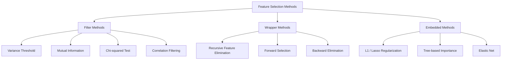
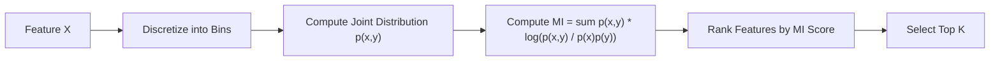
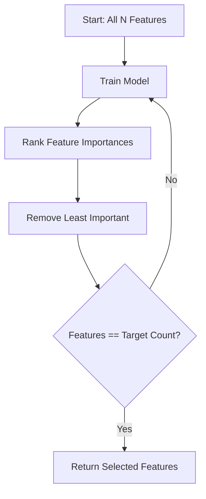
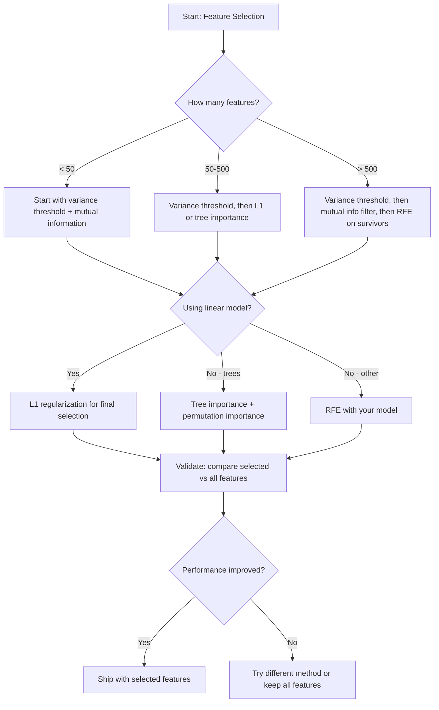

# 특성 선택 (Feature Selection)

> 특성(feature)이 더 많은 것이 더 나은 게 아니다. 올바른 특성이 더 낫다.

**Type:** Build
**Language:** Python
**Prerequisites:** Phase 2, Lessons 01-09, 08 (feature engineering)
**Time:** ~75분

## 학습 목표 (Learning Objectives)

- 필터 기법(filter method, 분산 임계값(variance threshold), 상호 정보량(mutual information), 카이제곱(chi-squared))과 래퍼 기법(wrapper method, RFE, 전진 선택(forward selection))을 밑바닥부터 구현하기
- 상호 정보량이 상관(correlation)이 놓치는 비선형 특성-타깃 관계를 어떻게 포착하는지 설명하기
- L1 정규화(regularization, 임베디드 선택(embedded selection))를 RFE(래퍼 선택)와 비교하고 그 계산적 트레이드오프(trade-off)를 평가하기
- 여러 기법을 결합하는 특성 선택 파이프라인(pipeline)을 만들고, 떼어 둔 데이터에서 향상된 일반화를 보이기

## 문제 (The Problem)

특성이 500개 있다. 모델(model)은 느리게 학습하고, 끊임없이 과적합(overfitting)하며, 그것이 무엇을 학습했는지 아무도 설명할 수 없다. 성능을 향상시키길 바라며 특성을 더 추가한다. 더 나빠진다.

이것이 작동하고 있는 차원의 저주(curse of dimensionality)다. 특성 개수가 늘어남에 따라, 특성 공간(feature space)의 부피가 폭발한다. 데이터 포인트가 희소(sparse)해진다. 포인트 사이의 거리가 수렴한다. 모델은 실제 패턴을 찾기 위해 지수적으로 더 많은 데이터를 필요로 한다. 노이즈 특성이 신호 특성을 익사시킨다. 과적합이 기본값이 된다.

특성 선택(feature selection)이 해독제다. 노이즈를 벗겨낸다. 중복을 제거한다. 타깃에 관한 실제 정보를 담은 특성을 유지한다. 그 결과: 더 빠른 학습, 더 나은 일반화, 그리고 실제로 설명할 수 있는 모델.

목표는 가용한 모든 정보를 쓰는 것이 아니다. 올바른 정보를 쓰는 것이다.

## 개념 (The Concept)

### 특성 선택의 세 범주 (Three Categories of Feature Selection)

모든 특성 선택 기법은 세 범주 중 하나에 속한다:



**필터 기법(Filter methods)**은 통계적 척도를 사용해 각 특성을 독립적으로 점수 매긴다. 모델을 쓰지 않는다. 빠르지만, 특성 상호작용을 놓친다.

**래퍼 기법(Wrapper methods)**은 특성 부분집합을 평가하기 위해 모델을 학습시킨다. 모델 성능을 점수로 쓴다. 더 나은 결과지만, 모델을 여러 번 재학습하기 때문에 비싸다.

**임베디드 기법(Embedded methods)**은 모델 학습의 일부로 특성을 선택한다. L1 정규화는 가중치(weight)를 0으로 몰아간다. 결정 트리(decision tree)는 가장 유용한 특성으로 분할한다. 선택이 별도의 단계가 아니라 적합 중에 일어난다.

### 분산 임계값 (Variance Threshold)

가장 단순한 필터. 어떤 특성이 샘플 전반에 걸쳐 거의 변하지 않는다면, 거의 아무 정보도 담지 않는다.

1000개 샘플 중 999개에서 0.0인 특성을 생각해 보라. 그 분산은 거의 0이다. 어떤 모델도 그것을 클래스 구별에 쓸 수 없다. 제거하라.

```
variance(x) = mean((x - mean(x))^2)
```

임계값(예: 0.01)을 설정한다. 그 아래의 분산을 가진 모든 특성을 버린다. 이는 타깃 변수를 전혀 보지 않고 상수 또는 거의 상수인 특성을 제거한다.

언제 쓸 것인가: 다른 기법 전의 전처리 단계로. 거의 0의 비용으로 명백히 쓸모없는 특성을 잡는다.

한계: 어떤 특성은 높은 분산을 가지면서도 여전히 순수 노이즈일 수 있다. 분산 임계값은 필요하지만 충분하지 않다.

### 상호 정보량 (Mutual Information)

상호 정보량은 특성 X의 값을 아는 것이 타깃 Y에 대한 불확실성을 얼마나 줄이는지를 측정한다.

```
I(X; Y) = sum_x sum_y p(x, y) * log(p(x, y) / (p(x) * p(y)))
```

X와 Y가 독립이면, p(x, y) = p(x) * p(y)이므로 로그 항이 0이고 I(X; Y) = 0이다. X가 Y에 대해 더 많이 알려줄수록 상호 정보량이 더 높다.

상관 대비 핵심 장점: 상호 정보량은 비선형 관계를 포착한다. 어떤 특성이 타깃과 상관이 0이면서도 관계가 2차이거나 주기적이기 때문에 높은 상호 정보량을 가질 수 있다.

연속 특성의 경우, 먼저 구간(bin)으로 이산화(discretize)한다(히스토그램 기반 추정). 구간 수가 추정치에 영향을 준다 -- 구간이 너무 적으면 정보를 잃고, 너무 많으면 노이즈를 더한다. 흔한 선택: sqrt(n)개 구간 또는 스터지스 규칙(Sturges' rule, 1 + log2(n)).



### 재귀적 특성 제거 (Recursive Feature Elimination, RFE)

RFE는 래퍼 기법이다. 모델 자신의 특성 중요도(feature importance)를 사용해 반복적으로 가지치기한다:

1. 모든 특성으로 모델을 학습시킨다
2. 중요도로 특성을 순위 매긴다(선형 모델의 경우 계수, 트리의 경우 불순도 감소)
3. 가장 덜 중요한 특성을 제거한다
4. 원하는 특성 개수가 남을 때까지 반복한다



RFE는 모델이 남은 모든 특성을 함께 보기 때문에 특성 상호작용을 고려한다. 특성 하나를 제거하면 다른 것들의 중요도가 바뀐다. 이는 필터 기법보다 더 철저하게 만든다.

비용: 모델을 N - target번 학습시킨다. 특성 500개에 목표가 10개라면, 490번의 학습 실행이다. 비싼 모델의 경우 이는 느리다. 스텝마다 여러 특성을 제거하면(예: 매 라운드 하위 10% 제거) 속도를 높일 수 있다.

### L1 (Lasso) 정규화 (L1 (Lasso) Regularization)

L1 정규화는 가중치의 절댓값을 손실 함수(loss function)에 더한다:

```
loss = prediction_error + alpha * sum(|w_i|)
```

alpha 파라미터(parameter)는 특성이 얼마나 공격적으로 가지치기되는지를 제어한다. 더 높은 alpha는 더 많은 가중치가 정확히 0이 됨을 의미한다.

왜 정확히 0인가? L1 페널티는 가중치 공간에서 마름모 모양의 제약 영역을 만든다. 최적 해(solution)는 이 마름모의 모서리에 떨어지는 경향이 있는데, 거기서는 하나 이상의 가중치가 0이다. L2 정규화(ridge)는 가중치가 축소되지만 좀처럼 0에 닿지 않는 원형 제약을 만든다.

이것이 임베디드 특성 선택이다: 모델은 학습 중에 어떤 특성을 무시할지 학습한다. 가중치가 0인 특성은 사실상 제거된다.

장점: 단일 학습 실행, 상관된 특성을 다룸(하나를 고르고 나머지를 0으로 만든다), 대부분의 선형 모델 구현에 내장.

한계: 선형 모델에만 작동한다. 비선형 특성 중요도를 포착할 수 없다.

### 트리 기반 특성 중요도 (Tree-Based Feature Importance)

결정 트리와 그 앙상블(랜덤 포레스트(random forest), 그래디언트 부스팅(gradient boosting))은 자연스럽게 특성을 순위 매긴다. 모든 분할(split)은 불순도(impurity)를 줄인다(분류(classification)의 경우 Gini나 엔트로피, 회귀(regression)의 경우 분산). 더 큰 불순도 감소를 만드는 특성이 더 중요하다.

T개 트리를 가진 랜덤 포레스트의 경우:

```
importance(feature_j) = (1/T) * sum over all trees of
    sum over all nodes splitting on feature_j of
        (n_samples * impurity_decrease)
```

이는 각 특성에 대한 정규화된 중요도 점수를 준다. 비선형 관계와 특성 상호작용을 자동으로 다룬다.

주의: 트리 기반 중요도는 고유 값이 많은 특성(높은 카디널리티(cardinality))으로 편향된다. 무작위 ID 열은 모든 샘플을 완벽하게 분할하기 때문에 중요해 보일 것이다. 순열 중요도(permutation importance)를 온전성 점검(sanity check)으로 사용하라.

### 순열 중요도 (Permutation Importance)

모델 불가지론적(model-agnostic) 기법:

1. 모델을 학습시키고 검증 데이터에서 베이스라인(baseline) 성능을 기록한다
2. 각 특성에 대해: 그 값을 무작위로 섞고, 성능 하락을 측정한다
3. 하락이 클수록 특성이 더 중요하다

어떤 특성을 섞는 것이 성능을 해치지 않으면, 모델은 그것에 의존하지 않는다. 성능이 붕괴하면, 그 특성은 결정적이다.

순열 중요도는 트리 기반 중요도의 카디널리티 편향을 피한다. 하지만 느리다: 특성당 한 번의 완전한 평가, 안정성을 위해 여러 번 반복.

### 비교표 (Comparison Table)

| 기법 | 유형 | 속도 | 비선형 | 특성 상호작용 |
|--------|------|-------|-----------|---------------------|
| 분산 임계값 (Variance threshold) | 필터 | 매우 빠름 | 불가 | 불가 |
| 상호정보량 (Mutual information) | 필터 | 빠름 | 가능 | 불가 |
| 상관 필터 (Correlation filter) | 필터 | 빠름 | 불가 | 불가 |
| RFE | 래퍼 | 느림 | 모델에 따라 다름 | 가능 |
| L1 / Lasso | 임베디드 | 빠름 | 불가 (선형) | 불가 |
| 트리 중요도 (Tree importance) | 임베디드 | 중간 | 가능 | 가능 |
| 순열 중요도 (Permutation importance) | 모델 불가지론적 | 느림 | 가능 | 가능 |

### 의사결정 순서도 (Decision Flowchart)



## 직접 만들기 (Build It)

### 1단계: 알려진 특성 구조를 가진 합성 데이터 생성

```python
import numpy as np


def make_feature_selection_data(n_samples=500, seed=42):
    rng = np.random.RandomState(seed)

    x1 = rng.randn(n_samples)
    x2 = rng.randn(n_samples)
    x3 = rng.randn(n_samples)
    x4 = x1 + 0.1 * rng.randn(n_samples)
    x5 = x2 + 0.1 * rng.randn(n_samples)

    informative = np.column_stack([x1, x2, x3, x4, x5])

    correlated = np.column_stack([
        x1 * 0.9 + 0.1 * rng.randn(n_samples),
        x2 * 0.8 + 0.2 * rng.randn(n_samples),
        x3 * 0.7 + 0.3 * rng.randn(n_samples),
        x1 * 0.5 + x2 * 0.5 + 0.1 * rng.randn(n_samples),
        x2 * 0.6 + x3 * 0.4 + 0.1 * rng.randn(n_samples),
    ])

    noise = rng.randn(n_samples, 10) * 0.5

    X = np.hstack([informative, correlated, noise])
    y = (2 * x1 - 1.5 * x2 + x3 + 0.5 * rng.randn(n_samples) > 0).astype(int)

    feature_names = (
        [f"info_{i}" for i in range(5)]
        + [f"corr_{i}" for i in range(5)]
        + [f"noise_{i}" for i in range(10)]
    )

    return X, y, feature_names
```

우리는 정답을 안다: 특성 0-4는 유익하고(게다가 3과 4는 0과 1의 상관 복사본), 특성 5-9는 유익한 특성과 상관되며, 특성 10-19는 순수 노이즈다. 좋은 선택 기법은 0-4를 가장 높게, 10-19를 가장 낮게 순위 매겨야 한다.

### 2단계: 분산 임계값

```python
def variance_threshold(X, threshold=0.01):
    variances = np.var(X, axis=0)
    mask = variances > threshold
    return mask, variances
```

### 3단계: 상호 정보량 (이산)

```python
def discretize(x, n_bins=10):
    min_val, max_val = x.min(), x.max()
    if max_val == min_val:
        return np.zeros_like(x, dtype=int)
    bin_edges = np.linspace(min_val, max_val, n_bins + 1)
    binned = np.digitize(x, bin_edges[1:-1])
    return binned


def mutual_information(X, y, n_bins=10):
    n_samples, n_features = X.shape
    mi_scores = np.zeros(n_features)

    y_vals, y_counts = np.unique(y, return_counts=True)
    p_y = y_counts / n_samples

    for f in range(n_features):
        x_binned = discretize(X[:, f], n_bins)
        x_vals, x_counts = np.unique(x_binned, return_counts=True)
        p_x = dict(zip(x_vals, x_counts / n_samples))

        mi = 0.0
        for xv in x_vals:
            for yi, yv in enumerate(y_vals):
                joint_mask = (x_binned == xv) & (y == yv)
                p_xy = np.sum(joint_mask) / n_samples
                if p_xy > 0:
                    mi += p_xy * np.log(p_xy / (p_x[xv] * p_y[yi]))
        mi_scores[f] = mi

    return mi_scores
```

### 4단계: 재귀적 특성 제거

```python
def simple_logistic_importance(X, y, lr=0.1, epochs=100):
    n_samples, n_features = X.shape
    w = np.zeros(n_features)
    b = 0.0

    for _ in range(epochs):
        z = X @ w + b
        pred = 1.0 / (1.0 + np.exp(-np.clip(z, -500, 500)))
        error = pred - y
        w -= lr * (X.T @ error) / n_samples
        b -= lr * np.mean(error)

    return w, b


def rfe(X, y, n_features_to_select=5, lr=0.1, epochs=100):
    n_total = X.shape[1]
    remaining = list(range(n_total))
    rankings = np.ones(n_total, dtype=int)
    rank = n_total

    while len(remaining) > n_features_to_select:
        X_subset = X[:, remaining]
        w, _ = simple_logistic_importance(X_subset, y, lr, epochs)
        importances = np.abs(w)

        least_idx = np.argmin(importances)
        original_idx = remaining[least_idx]
        rankings[original_idx] = rank
        rank -= 1
        remaining.pop(least_idx)

    for idx in remaining:
        rankings[idx] = 1

    selected_mask = rankings == 1
    return selected_mask, rankings
```

### 5단계: L1 특성 선택

```python
def soft_threshold(w, alpha):
    return np.sign(w) * np.maximum(np.abs(w) - alpha, 0)


def l1_feature_selection(X, y, alpha=0.1, lr=0.01, epochs=500):
    n_samples, n_features = X.shape
    w = np.zeros(n_features)
    b = 0.0

    for _ in range(epochs):
        z = X @ w + b
        pred = 1.0 / (1.0 + np.exp(-np.clip(z, -500, 500)))
        error = pred - y

        gradient_w = (X.T @ error) / n_samples
        gradient_b = np.mean(error)

        w -= lr * gradient_w
        w = soft_threshold(w, lr * alpha)
        b -= lr * gradient_b

    selected_mask = np.abs(w) > 1e-6
    return selected_mask, w
```

### 6단계: 트리 기반 중요도 (단순 결정 트리)

```python
def gini_impurity(y):
    if len(y) == 0:
        return 0.0
    classes, counts = np.unique(y, return_counts=True)
    probs = counts / len(y)
    return 1.0 - np.sum(probs ** 2)


def best_split(X, y, feature_idx):
    values = np.unique(X[:, feature_idx])
    if len(values) <= 1:
        return None, -1.0

    best_threshold = None
    best_gain = -1.0
    parent_gini = gini_impurity(y)
    n = len(y)

    for i in range(len(values) - 1):
        threshold = (values[i] + values[i + 1]) / 2.0
        left_mask = X[:, feature_idx] <= threshold
        right_mask = ~left_mask

        n_left = np.sum(left_mask)
        n_right = np.sum(right_mask)

        if n_left == 0 or n_right == 0:
            continue

        gain = parent_gini - (n_left / n) * gini_impurity(y[left_mask]) - (n_right / n) * gini_impurity(y[right_mask])

        if gain > best_gain:
            best_gain = gain
            best_threshold = threshold

    return best_threshold, best_gain


def tree_importance(X, y, n_trees=50, max_depth=5, seed=42):
    rng = np.random.RandomState(seed)
    n_samples, n_features = X.shape
    importances = np.zeros(n_features)

    for _ in range(n_trees):
        sample_idx = rng.choice(n_samples, size=n_samples, replace=True)
        feature_subset = rng.choice(n_features, size=max(1, int(np.sqrt(n_features))), replace=False)

        X_boot = X[sample_idx]
        y_boot = y[sample_idx]

        tree_imp = _build_tree_importance(X_boot, y_boot, feature_subset, max_depth)
        importances += tree_imp

    total = importances.sum()
    if total > 0:
        importances /= total

    return importances


def _build_tree_importance(X, y, feature_subset, max_depth, depth=0):
    n_features = X.shape[1]
    importances = np.zeros(n_features)

    if depth >= max_depth or len(np.unique(y)) <= 1 or len(y) < 4:
        return importances

    best_feature = None
    best_threshold = None
    best_gain = -1.0

    for f in feature_subset:
        threshold, gain = best_split(X, y, f)
        if gain > best_gain:
            best_gain = gain
            best_feature = f
            best_threshold = threshold

    if best_feature is None or best_gain <= 0:
        return importances

    importances[best_feature] += best_gain * len(y)

    left_mask = X[:, best_feature] <= best_threshold
    right_mask = ~left_mask

    importances += _build_tree_importance(X[left_mask], y[left_mask], feature_subset, max_depth, depth + 1)
    importances += _build_tree_importance(X[right_mask], y[right_mask], feature_subset, max_depth, depth + 1)

    return importances
```

### 7단계: 모든 기법 실행 및 비교

코드 파일은 같은 합성 데이터셋(dataset)에서 다섯 기법을 모두 실행하고, 각 기법이 어떤 특성을 선택하는지 보여주는 비교표를 출력한다.

## 라이브러리로 써보기 (Use It)

scikit-learn으로, 특성 선택은 파이프라인에 내장돼 있다:

```python
from sklearn.feature_selection import (
    VarianceThreshold,
    mutual_info_classif,
    RFE,
    SelectFromModel,
)
from sklearn.linear_model import Lasso, LogisticRegression
from sklearn.ensemble import RandomForestClassifier

vt = VarianceThreshold(threshold=0.01)
X_filtered = vt.fit_transform(X)

mi_scores = mutual_info_classif(X, y)
top_k = np.argsort(mi_scores)[-10:]

rfe_selector = RFE(LogisticRegression(), n_features_to_select=10)
rfe_selector.fit(X, y)
X_rfe = rfe_selector.transform(X)

lasso_selector = SelectFromModel(Lasso(alpha=0.01))
lasso_selector.fit(X, y)
X_lasso = lasso_selector.transform(X)

rf = RandomForestClassifier(n_estimators=100)
rf.fit(X, y)
importances = rf.feature_importances_
```

밑바닥 구현은 각 기법 내부에서 정확히 무슨 일이 일어나는지 보여준다. 분산 임계값은 그저 `var(X, axis=0)`을 계산하고 마스크를 적용하는 것이다. 상호 정보량은 분할표(contingency table)에서 결합 빈도와 주변(marginal) 빈도를 세는 것이다. RFE는 학습하고, 순위 매기고, 가지치기하는 루프다. L1은 소프트 임계화(soft-thresholding) 스텝을 동반한 경사 하강법(gradient descent)이다. 트리 중요도는 분할 전반에 걸쳐 불순도 감소를 누적한다. 마법은 없다 -- 그저 통계와 루프다.

sklearn 버전은 견고함(예: mutual_info_classif는 구간화 대신 k-NN 밀도 추정을 쓴다), 속도(C 구현), 그리고 파이프라인 통합을 더한다.

## 산출물 (Ship It)

이 레슨이 만들어내는 것:
- `outputs/skill-feature-selector.md` -- 올바른 특성 선택 기법을 고르기 위한 빠른 참조 의사결정 트리

## 연습 문제 (Exercises)

1. **전진 선택(Forward selection)**: RFE의 반대를 구현하라. 특성 0개로 시작한다. 각 스텝에서, 모델 성능을 가장 많이 향상시키는 특성을 추가한다. 특성을 추가해도 더 이상 도움이 안 되면 멈춘다. 선택된 특성을 RFE 결과와 비교하라. 어느 쪽이 더 빠른가? 어느 쪽이 더 나은 결과를 주는가?

2. **안정성 선택(Stability selection)**: L1 특성 선택을 50번 실행하되, 매번 데이터의 무작위 80% 부분 샘플에 대해, 약간 다른 alpha 값으로 한다. 각 특성이 얼마나 자주 선택되는지 센다. 실행의 80% 초과에서 선택된 특성이 "안정적"이다. 안정적 특성을 단일 실행 L1 선택과 비교하라. 어느 쪽이 더 신뢰할 만한가?

3. **다중공선성 탐지(Multicollinearity detection)**: 모든 특성에 대한 상관 행렬을 계산하라. 상관 임계값(예: 0.9)이 주어지면, 고도로 상관된 각 쌍에서 한 특성을 제거하는(타깃과 상호 정보량이 더 높은 쪽을 유지) 함수를 구현하라. 합성 데이터셋에서 테스트하고 중복된 상관 특성을 제거하는지 검증하라.

4. **특성 선택 파이프라인**: 분산 임계값, 상호 정보량 필터, RFE를 단일 파이프라인으로 엮어라. 먼저 거의 0인 분산 특성을 제거하고, 그다음 상호 정보량 기준 상위 50%를 유지하고, 그다음 생존자에 대해 RFE를 실행한다. 이 파이프라인을 모든 특성에 RFE만 실행하는 것과 비교하라. 파이프라인이 더 빠른가? 똑같이 정확한가?

5. **밑바닥부터 만드는 순열 중요도**: 순열 중요도를 구현하라. 각 특성에 대해, 그 값을 10번 섞고, F1 점수의 평균 하락을 측정한다. 그 순위를 트리 기반 중요도와 비교하라. 둘이 불일치하는 경우를 찾고 그 이유를 설명하라(힌트: 상관된 특성).

## 핵심 용어 (Key Terms)

| 용어 | 흔히 하는 말 | 실제 의미 |
|------|----------------|----------------------|
| 필터 방법 (Filter method) | "특성을 독립적으로 점수 매긴다" | 모델을 학습하지 않고 통계적 척도로 특성의 순위를 매기며, 각 특성을 고립적으로 평가하는 특성 선택 접근법이다 |
| 래퍼 방법 (Wrapper method) | "모델을 써서 특성을 고른다" | 모델을 학습시켜 그 성능을 선택 기준으로 삼아 특성 부분집합을 평가하는 특성 선택 접근법이다 |
| 임베디드 방법 (Embedded method) | "모델이 학습 중에 특성을 선택한다" | L1 정규화가 가중치를 0으로 만드는 것처럼, 모델 적합의 일부로 일어나는 특성 선택이다 |
| 상호정보량 (Mutual information) | "한 변수가 다른 변수에 대해 얼마나 알려주는가" | X를 알 때 Y에 대한 불확실성이 줄어드는 정도를 측정하며, 선형 및 비선형 의존성을 모두 포착한다 |
| 재귀적 특성 제거 (Recursive Feature Elimination) | "학습, 순위, 가지치기, 반복" | 모델을 학습시키고 가장 덜 중요한 특성을 제거하기를 목표 개수에 도달할 때까지 반복하는 반복적 래퍼 방법이다 |
| L1 / Lasso 정규화 (L1 / Lasso regularization) | "특성을 죽이는 페널티" | 손실 함수에 절댓값 가중치의 합을 더해, 중요하지 않은 특성 가중치를 정확히 0으로 만드는 것이다 |
| 분산 임계값 (Variance threshold) | "상수 특성을 제거한다" | 샘플 전반의 분산이 지정된 임계값 아래인 특성을 버려, 아무 정보도 담지 않은 특성을 걸러낸다 |
| 특성 중요도 (Feature importance) | "어떤 특성이 가장 중요한가" | 각 특성이 모델 예측에 얼마나 기여하는지를 나타내는 점수로, 분할 이득(트리)이나 계수 크기(선형)로부터 계산된다 |
| 순열 중요도 (Permutation importance) | "섞어서 손상을 측정한다" | 각 특성의 값을 무작위로 섞고 그로 인한 모델 성능 하락을 측정하여 특성 중요도를 평가하는 것이다 |
| 차원의 저주 (Curse of dimensionality) | "특성은 너무 많고, 데이터는 부족하다" | 특성을 추가할수록 특성 공간의 부피가 지수적으로 커져, 데이터가 희소해지고 거리가 무의미해지는 현상이다 |

## 더 읽을거리 (Further Reading)

- [An Introduction to Variable and Feature Selection (Guyon & Elisseeff, 2003)](https://jmlr.org/papers/v3/guyon03a.html) -- 특성 선택 기법에 관한 기초 서베이, 여전히 널리 인용됨
- [scikit-learn Feature Selection Guide](https://scikit-learn.org/stable/modules/feature_selection.html) -- 코드 예제와 함께하는 필터, 래퍼, 임베디드 기법의 실용 레퍼런스
- [Stability Selection (Meinshausen & Buhlmann, 2010)](https://arxiv.org/abs/0809.2932) -- 견고하고 재현 가능한 결과를 위해 부분 샘플링과 특성 선택을 결합
- [Beware Default Random Forest Importances (Strobl et al., 2007)](https://bmcbioinformatics.biomedcentral.com/articles/10.1186/1471-2105-8-25) -- 트리 기반 중요도의 카디널리티 편향을 보여주고 조건부 중요도를 대안으로 제안
