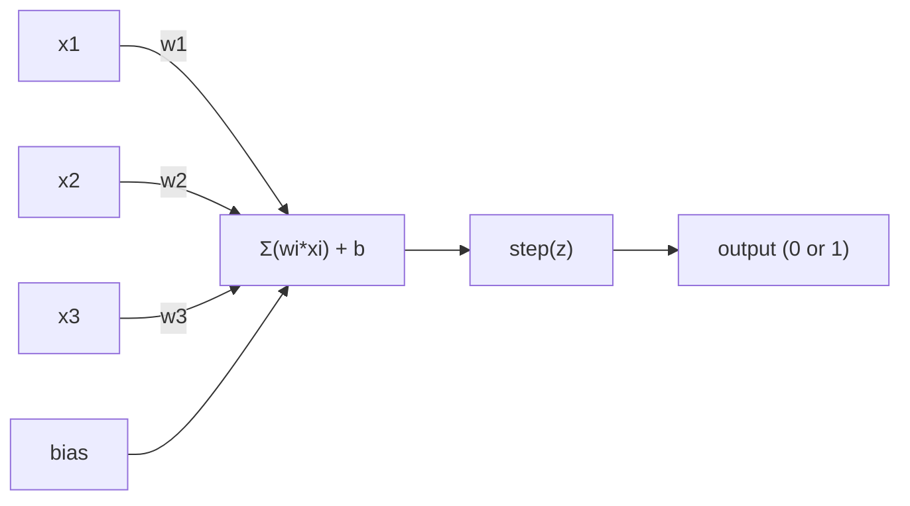
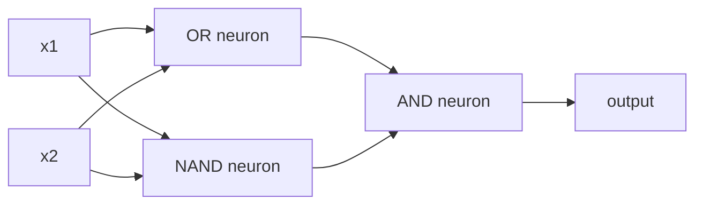

# 퍼셉트론(The Perceptron)

> 퍼셉트론(perceptron)은 신경망(neural network)의 원자다. 쪼개서 열어 보면 가중치(weight), 편향(bias), 그리고 하나의 결정(decision)이 들어 있다.

**Type:** Build
**Languages:** Python
**Prerequisites:** Phase 1 (Linear Algebra Intuition)
**Time:** ~60분

## 학습 목표 (Learning Objectives)

- 가중치 업데이트 규칙과 계단 활성화 함수(step activation function)를 포함하여, 퍼셉트론을 Python으로 밑바닥부터 구현하기
- 하나의 퍼셉트론이 왜 선형 분리 가능(linearly separable)한 문제만 풀 수 있는지 설명하고, XOR 실패 사례를 시연하기
- OR, NAND, AND 게이트를 조합하여 XOR를 푸는 다층 퍼셉트론(multi-layer perceptron) 구성하기
- 시그모이드(sigmoid) 활성화와 역전파(backpropagation)를 사용하는 2층 신경망을 학습시켜 XOR를 자동으로 학습하기

## 문제 (The Problem)

당신은 벡터(vector)와 내적(dot product)을 안다. 행렬(matrix)이 입력을 출력으로 변환한다는 것도 안다. 그런데 기계는 어떤 변환을 써야 하는지를 어떻게 *학습*하는가?

퍼셉트론이 이에 답한다. 퍼셉트론은 가능한 한 가장 단순한 학습 기계다. 입력 몇 개를 받아, 가중치를 곱하고, 편향을 더한 뒤, 이진(binary) 결정을 내린다. 그런 다음 조정한다. 그게 전부다. 지금까지 만들어진 모든 신경망은 이 아이디어를 층층이 쌓아 올린 것이다.

퍼셉트론을 이해한다는 것은 코드에서 "학습"이 실제로 무엇을 뜻하는지를 이해하는 것이다. 즉, 출력이 현실과 일치할 때까지 숫자를 조정하는 것이다.

## 개념 (The Concept)

### 하나의 뉴런, 하나의 결정

퍼셉트론은 n개의 입력을 받아, 각각에 가중치를 곱하고, 합한 뒤, 편향을 더하고, 그 결과를 활성화 함수(activation function)에 통과시킨다.



계단 함수(step function)는 가차 없다. 가중합에 편향을 더한 값이 >= 0이면 1을 출력하고, 그렇지 않으면 0을 출력한다.

```
step(z) = 1  if z >= 0
           0  if z < 0
```

이것이 선형 분류기(linear classifier)다. 가중치와 편향은 입력 공간을 두 영역으로 가르는 하나의 직선(고차원에서는 초평면(hyperplane))을 정의한다.

### 결정 경계 (The Decision Boundary)

입력이 두 개일 때, 퍼셉트론은 2차원 공간에 직선 하나를 그린다.

```
  x2
  ┤
  │  Class 1        /
  │    (0)          /
  │                /
  │               / w1·x1 + w2·x2 + b = 0
  │              /
  │             /     Class 2
  │            /        (1)
  ┼───────────/──────────── x1
```

직선의 한쪽에 있는 모든 것은 0을 출력한다. 반대쪽에 있는 모든 것은 1을 출력한다. 학습(training)은 이 직선이 클래스들을 올바르게 분리할 때까지 직선을 옮긴다.

### 학습 규칙 (The Learning Rule)

퍼셉트론 학습 규칙은 단순하다.

```
For each training example (x, y_true):
    y_pred = predict(x)
    error = y_true - y_pred

    For each weight:
        w_i = w_i + learning_rate * error * x_i
    bias = bias + learning_rate * error
```

예측이 맞으면 error = 0이므로 아무것도 바뀌지 않는다. 0으로 예측했는데 정답이 1이면 가중치가 커진다. 1로 예측했는데 정답이 0이면 가중치가 작아진다. 학습률(learning rate)은 각 조정의 크기를 제어한다.

### XOR 문제 (The XOR Problem)

여기서 무너진다. 다음 논리 게이트들을 보라.

```
AND gate:           OR gate:            XOR gate:
x1  x2  out         x1  x2  out         x1  x2  out
0   0   0           0   0   0           0   0   0
0   1   0           0   1   1           0   1   1
1   0   0           1   0   1           1   0   1
1   1   1           1   1   1           1   1   0
```

AND와 OR은 선형 분리 가능하다. 0과 1을 가르는 직선 하나를 그을 수 있다. XOR는 그렇지 않다. [0,1]과 [1,0]을 [0,0]과 [1,1]로부터 분리하는 직선은 단 하나도 존재하지 않는다.

```
AND (separable):        XOR (not separable):

  x2                      x2
  1 ┤  0     1            1 ┤  1     0
    │     /                 │
  0 ┤  0 / 0              0 ┤  0     1
    ┼──/──────── x1         ┼──────────── x1
       line works!          no single line works!
```

이것은 근본적인 한계다. 하나의 퍼셉트론은 선형 분리 가능한 문제만 풀 수 있다. 민스키(Minsky)와 페퍼트(Papert)가 1969년에 이를 증명했고, 이로 인해 신경망 연구는 10년 가까이 거의 사장될 뻔했다.

해결책은 퍼셉트론을 층(layer)으로 쌓는 것이다. 다층 퍼셉트론은 두 개의 선형 결정을 하나의 비선형 결정으로 결합하여 XOR를 풀 수 있다.

## 직접 만들기 (Build It)

### 1단계: Perceptron 클래스

```python
class Perceptron:
    def __init__(self, n_inputs, learning_rate=0.1):
        self.weights = [0.0] * n_inputs
        self.bias = 0.0
        self.lr = learning_rate

    def predict(self, inputs):
        total = sum(w * x for w, x in zip(self.weights, inputs))
        total += self.bias
        return 1 if total >= 0 else 0

    def train(self, training_data, epochs=100):
        for epoch in range(epochs):
            errors = 0
            for inputs, target in training_data:
                prediction = self.predict(inputs)
                error = target - prediction
                if error != 0:
                    errors += 1
                    for i in range(len(self.weights)):
                        self.weights[i] += self.lr * error * inputs[i]
                    self.bias += self.lr * error
            if errors == 0:
                print(f"Converged at epoch {epoch + 1}")
                return
        print(f"Did not converge after {epochs} epochs")
```

### 2단계: 논리 게이트로 학습시키기

```python
and_data = [
    ([0, 0], 0),
    ([0, 1], 0),
    ([1, 0], 0),
    ([1, 1], 1),
]

or_data = [
    ([0, 0], 0),
    ([0, 1], 1),
    ([1, 0], 1),
    ([1, 1], 1),
]

not_data = [
    ([0], 1),
    ([1], 0),
]

print("=== AND Gate ===")
p_and = Perceptron(2)
p_and.train(and_data)
for inputs, _ in and_data:
    print(f"  {inputs} -> {p_and.predict(inputs)}")

print("\n=== OR Gate ===")
p_or = Perceptron(2)
p_or.train(or_data)
for inputs, _ in or_data:
    print(f"  {inputs} -> {p_or.predict(inputs)}")

print("\n=== NOT Gate ===")
p_not = Perceptron(1)
p_not.train(not_data)
for inputs, _ in not_data:
    print(f"  {inputs} -> {p_not.predict(inputs)}")
```

### 3단계: XOR가 실패하는 것을 지켜보기

```python
xor_data = [
    ([0, 0], 0),
    ([0, 1], 1),
    ([1, 0], 1),
    ([1, 1], 0),
]

print("\n=== XOR Gate (single perceptron) ===")
p_xor = Perceptron(2)
p_xor.train(xor_data, epochs=1000)
for inputs, expected in xor_data:
    result = p_xor.predict(inputs)
    status = "OK" if result == expected else "WRONG"
    print(f"  {inputs} -> {result} (expected {expected}) {status}")
```

절대 수렴(convergence)하지 않을 것이다. 이것이 하나의 퍼셉트론은 XOR를 학습할 수 없다는 확실한 증거다.

### 4단계: 2개 층으로 XOR 풀기

비결은 이렇다. XOR = (x1 OR x2) AND NOT (x1 AND x2). 세 개의 퍼셉트론을 결합한다.



```python
def xor_network(x1, x2):
    or_neuron = Perceptron(2)
    or_neuron.weights = [1.0, 1.0]
    or_neuron.bias = -0.5

    nand_neuron = Perceptron(2)
    nand_neuron.weights = [-1.0, -1.0]
    nand_neuron.bias = 1.5

    and_neuron = Perceptron(2)
    and_neuron.weights = [1.0, 1.0]
    and_neuron.bias = -1.5

    hidden1 = or_neuron.predict([x1, x2])
    hidden2 = nand_neuron.predict([x1, x2])
    output = and_neuron.predict([hidden1, hidden2])
    return output


print("\n=== XOR Gate (multi-layer network) ===")
for inputs, expected in xor_data:
    result = xor_network(inputs[0], inputs[1])
    print(f"  {inputs} -> {result} (expected {expected})")
```

네 가지 경우 모두 맞다. 퍼셉트론을 층으로 쌓으면 단일 퍼셉트론으로는 만들 수 없는 결정 경계가 생긴다.

### 5단계: 2층 신경망 학습시키기

4단계에서는 가중치를 손으로 직접 박아 넣었다. XOR에는 통하지만, 올바른 가중치를 미리 알 수 없는 실제 문제에는 통하지 않는다. 해결책은 계단 함수를 시그모이드로 바꾸고, 역전파(backpropagation)를 통해 가중치를 자동으로 학습하는 것이다.

```python
class TwoLayerNetwork:
    def __init__(self, learning_rate=0.5):
        import random
        random.seed(0)
        self.w_hidden = [[random.uniform(-1, 1), random.uniform(-1, 1)] for _ in range(2)]
        self.b_hidden = [random.uniform(-1, 1), random.uniform(-1, 1)]
        self.w_output = [random.uniform(-1, 1), random.uniform(-1, 1)]
        self.b_output = random.uniform(-1, 1)
        self.lr = learning_rate

    def sigmoid(self, x):
        import math
        x = max(-500, min(500, x))
        return 1.0 / (1.0 + math.exp(-x))

    def forward(self, inputs):
        self.inputs = inputs
        self.hidden_outputs = []
        for i in range(2):
            z = sum(w * x for w, x in zip(self.w_hidden[i], inputs)) + self.b_hidden[i]
            self.hidden_outputs.append(self.sigmoid(z))
        z_out = sum(w * h for w, h in zip(self.w_output, self.hidden_outputs)) + self.b_output
        self.output = self.sigmoid(z_out)
        return self.output

    def train(self, training_data, epochs=10000):
        for epoch in range(epochs):
            total_error = 0
            for inputs, target in training_data:
                output = self.forward(inputs)
                error = target - output
                total_error += error ** 2

                d_output = error * output * (1 - output)

                saved_w_output = self.w_output[:]
                hidden_deltas = []
                for i in range(2):
                    h = self.hidden_outputs[i]
                    hd = d_output * saved_w_output[i] * h * (1 - h)
                    hidden_deltas.append(hd)

                for i in range(2):
                    self.w_output[i] += self.lr * d_output * self.hidden_outputs[i]
                self.b_output += self.lr * d_output

                for i in range(2):
                    for j in range(len(inputs)):
                        self.w_hidden[i][j] += self.lr * hidden_deltas[i] * inputs[j]
                    self.b_hidden[i] += self.lr * hidden_deltas[i]
```

```python
net = TwoLayerNetwork(learning_rate=2.0)
net.train(xor_data, epochs=10000)
for inputs, expected in xor_data:
    result = net.forward(inputs)
    predicted = 1 if result >= 0.5 else 0
    print(f"  {inputs} -> {result:.4f} (rounded: {predicted}, expected {expected})")
```

4단계와는 두 가지 핵심적인 차이가 있다. 첫째, 시그모이드가 계단 함수를 대체한다. 시그모이드는 매끄러우므로(smooth) 그래디언트(gradient)가 존재한다. 둘째, `train` 메서드는 오차를 출력에서 은닉층(hidden layer)으로 거꾸로 전파하면서, 각 가중치를 그것이 오차에 기여한 정도에 비례하여 조정한다. 그것이 바로 20줄로 표현된 역전파다.

이것이 Lesson 03으로 가는 다리다. `d_output`과 `hidden_deltas` 뒤에 숨은 수학은 신경망 그래프에 적용된 연쇄 법칙(chain rule)이다. 거기에서 제대로 유도할 것이다.

## 라이브러리로 써보기 (Use It)

방금 밑바닥부터 만든 모든 것이 단 한 줄의 import 안에 들어 있다.

```python
from sklearn.linear_model import Perceptron as SkPerceptron
import numpy as np

X = np.array([[0,0],[0,1],[1,0],[1,1]])
y = np.array([0, 0, 0, 1])

clf = SkPerceptron(max_iter=100, tol=1e-3)
clf.fit(X, y)
print([clf.predict([x])[0] for x in X])
```

다섯 줄이다. 당신의 30줄짜리 `Perceptron` 클래스가 똑같은 일을 한다. sklearn 버전은 수렴 검사, 여러 손실 함수(loss function), 희소 입력(sparse input) 지원을 추가하지만, 핵심 루프는 동일하다. 가중합, 계단 함수, 오차에 따른 가중치 업데이트.

진짜 차이는 규모(scale)에서 드러난다. 프로덕션(production) 신경망에서 바뀌는 것들은 이렇다.

- 계단 함수가 시그모이드, ReLU, 또는 다른 매끄러운 활성화 함수로 바뀐다
- 가중치가 역전파를 통해 자동으로 학습된다 (Lesson 03)
- 층이 더 깊어진다: 3개, 10개, 100개 이상의 층
- 동일한 원리가 유지된다: 각 층은 이전 층의 출력으로부터 새로운 특성(feature)을 만든다

하나의 퍼셉트론은 직선만 그릴 수 있다. 그것들을 쌓으면, 어떤 모양이든 그릴 수 있다.

## 산출물 (Ship It)

이 레슨은 다음을 산출한다.
- `outputs/skill-perceptron.md` - 단일 층 아키텍처와 다층 아키텍처가 각각 언제 필요한지를 다루는 스킬

## 연습 문제 (Exercises)

1. NAND 게이트(보편 게이트(universal gate) - 어떤 논리 회로든 NAND로 만들 수 있다)로 퍼셉트론을 학습시켜라. 그 가중치와 편향이 유효한 결정 경계를 형성하는지 검증하라.
2. Perceptron 클래스를 수정하여 각 에폭(epoch)마다 결정 경계(w1*x1 + w2*x2 + b = 0)를 추적하게 하라. AND 게이트 학습 중에 직선이 어떻게 이동하는지 출력하라.
3. 세 개의 입력 중 적어도 2개가 1일 때만 1을 출력하는 3-입력 퍼셉트론(다수결 함수(majority vote function))을 만들어라. 이것은 선형 분리 가능한가? 그 이유는 무엇인가?

## 핵심 용어 (Key Terms)

| 용어 | 흔히 하는 말 | 실제 의미 |
|------|----------------|----------------------|
| 퍼셉트론(Perceptron) | "가짜 뉴런" | 선형 분류기: 입력과 가중치의 내적에 편향을 더하고 계단 함수를 통과시킨 것 |
| 가중치(Weight) | "입력이 얼마나 중요한지" | 각 입력이 결정에 기여하는 정도를 조절하는 곱셈 인자 |
| 편향(Bias) | "임계값" | 결정 경계를 이동시키는 상수로, 입력이 0이어도 퍼셉트론이 발화하게 해 준다 |
| 활성화 함수(Activation function) | "값을 찌부러뜨리는 것" | 가중합 이후에 적용되는 함수 - 퍼셉트론에서는 계단 함수, 현대 신경망에서는 sigmoid/ReLU |
| 선형 분리 가능(Linearly separable) | "그 사이에 직선을 그을 수 있다" | 하나의 초평면이 클래스들을 완벽하게 분리할 수 있는 데이터셋 |
| XOR 문제(XOR problem) | "퍼셉트론이 못 하는 그것" | 단일 층 신경망이 비선형 분리 함수를 학습할 수 없다는 증거 |
| 결정 경계(Decision boundary) | "분류기가 바뀌는 지점" | 입력 공간을 두 클래스로 나누는 초평면 w*x + b = 0 |
| 다층 퍼셉트론(Multi-layer perceptron) | "진짜 신경망" | 층으로 쌓인 퍼셉트론으로, 각 층의 출력이 다음 층의 입력으로 들어간다 |

## 더 읽을거리 (Further Reading)

- Frank Rosenblatt, "The Perceptron: A Probabilistic Model for Information Storage and Organization in the Brain" (1958) -- 모든 것을 시작한 원조 논문
- Minsky & Papert, "Perceptrons" (1969) -- XOR가 단일 층 신경망으로는 풀 수 없음을 증명하고 10년간 퍼셉트론 연구를 죽인 책
- Michael Nielsen, "Neural Networks and Deep Learning", Chapter 1 (http://neuralnetworksanddeeplearning.com/) -- 무료 온라인, 퍼셉트론이 어떻게 신경망으로 조합되는지에 대한 최고의 시각적 설명
