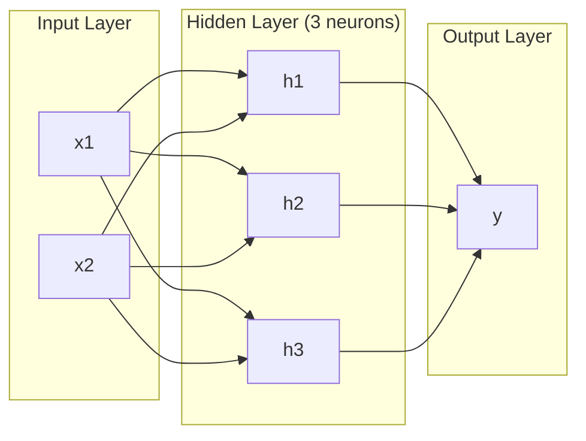
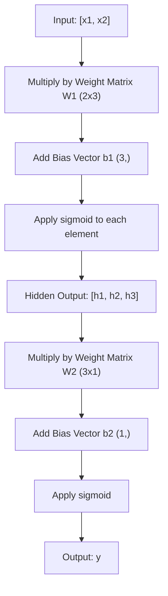
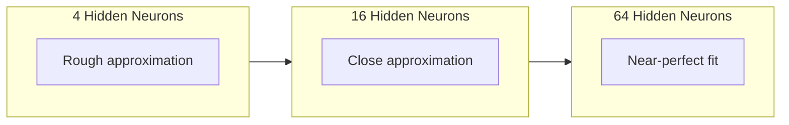

# 다층 신경망과 순방향 패스 (Multi-Layer Networks and Forward Pass)

> 뉴런 하나는 직선을 그린다. 그것들을 쌓으면, 무엇이든 그릴 수 있다.

**Type:** Build
**Languages:** Python
**Prerequisites:** Phase 01 (Math Foundations), Lesson 03.01 (The Perceptron)
**Time:** ~90분

## 학습 목표 (Learning Objectives)

- 완전한 순방향 패스(forward pass)를 수행하는 Layer 클래스와 Network 클래스로 다층 신경망(multi-layer network)을 밑바닥부터 만들기
- 신경망의 각 층(layer)을 거치는 행렬(matrix) 차원을 추적하고 형태(shape) 불일치를 식별하기
- 비선형 활성화(nonlinear activation)를 쌓는 것이 어떻게 신경망이 곡선 형태의 결정 경계(decision boundary)를 학습하게 하는지 설명하기
- 손으로 조정한 시그모이드(sigmoid) 가중치를 사용하는 2-2-1 아키텍처로 XOR 문제 풀기

## 문제 (The Problem)

하나의 뉴런(neuron)은 직선을 그리는 기계다. 그게 전부다. 데이터를 가로지르는 직선 하나. AI의 모든 실제 문제 -- 이미지 인식, 언어 이해, 바둑 두기 -- 는 곡선을 필요로 한다. 뉴런을 층으로 쌓는 것이 곡선을 얻는 방법이다.

1969년, 민스키(Minsky)와 페퍼트(Papert)는 이 한계가 치명적임을 증명했다. 단일 층 신경망은 XOR를 학습할 수 없다. "학습하기 어렵다"가 아니라 수학적으로 불가능하다. XOR 진리표는 [0,1]과 [1,0]을 한쪽에, [0,0]과 [1,1]을 반대쪽에 둔다. 그것들을 가르는 직선은 단 하나도 없다.

이로 인해 신경망 연구 자금이 10년 넘게 끊겼다. 해결책은 지나고 보니 명백했다. 한 층만 쓰는 것을 그만두라. 뉴런을 층으로 쌓아라. 첫 번째 층이 입력 공간을 새로운 특성(feature)으로 깎아 내고, 두 번째 층이 그 특성들을 단일 직선으로는 만들 수 없는 결정으로 결합하게 하라.

그 쌓아 올린 구조가 다층 신경망이다. 오늘날 프로덕션(production)에서 돌아가는 모든 딥러닝(deep learning) 모델의 토대다. 순방향 패스 -- 데이터가 입력에서 은닉층(hidden layer)을 거쳐 출력으로 흐르는 것 -- 는 다른 무엇이 작동하기 전에 가장 먼저 만들어야 한다.

## 개념 (The Concept)

### 층: 입력, 은닉, 출력

다층 신경망에는 세 종류의 층이 있다.

**입력층(input layer)** -- 사실 진짜 층은 아니다. 원본 데이터를 담는다. 특성이 두 개면 입력 노드가 두 개다. 여기서는 아무 계산도 일어나지 않는다.

**은닉층(hidden layer)** -- 일이 일어나는 곳이다. 각 뉴런은 이전 층의 모든 출력을 받아, 가중치(weight)와 편향(bias)을 적용한 뒤, 그 결과를 활성화 함수(activation function)에 통과시킨다. "은닉"인 이유는 학습 데이터에서 이 값들을 직접 보지 못하기 때문이다.

**출력층(output layer)** -- 최종 답이다. 이진 분류(binary classification)에서는 시그모이드를 쓰는 뉴런 하나. 다중 클래스에서는 클래스마다 뉴런 하나.



이것은 2-3-1 신경망이다. 입력 두 개, 은닉 뉴런 세 개, 출력 하나. 모든 연결은 가중치를 운반한다. 모든 뉴런(입력 제외)은 편향을 가진다.

각 층은 은닉 상태(hidden state)라 불리는 숫자 벡터(vector)를 만든다. 텍스트의 경우, 은닉 상태는 차원을 늘린다 -- 의미를 담기 위해 한 단어를 768개의 숫자로 인코딩한다. 이미지의 경우, 차원을 줄인다 -- 수백만 개의 픽셀을 다루기 쉬운 표현으로 압축한다. 학습이 깃드는 곳이 바로 은닉 상태다.

### 뉴런과 활성화

각 뉴런은 세 가지 일을 한다.

1. 모든 입력에 대응하는 가중치를 곱한다
2. 모든 곱을 합하고 편향을 더한다
3. 그 합을 활성화 함수에 통과시킨다

지금은 활성화가 시그모이드다.

```
sigmoid(z) = 1 / (1 + e^(-z))
```

시그모이드는 어떤 숫자든 (0, 1) 범위로 찌부러뜨린다. 큰 양수 입력은 1 쪽으로 민다. 큰 음수 입력은 0 쪽으로 민다. 0은 0.5로 매핑된다. 이 매끄러운 곡선 덕분에 학습이 가능하다 -- 퍼셉트론의 딱딱한 계단(step)과 달리, 시그모이드는 모든 곳에서 그래디언트(gradient)를 가진다.

### 순방향 패스: 데이터가 흐르는 방식

순방향 패스는 입력 데이터를 신경망에 한 층씩 밀어 넣어 출력에 도달할 때까지 진행한다. 순방향 패스 동안에는 학습이 일어나지 않는다. 순수한 계산일 뿐이다. 곱하고, 더하고, 활성화하고, 반복한다.



각 층에서는 세 가지 연산이 순서대로 일어난다.

```
z = W * input + b       (linear transformation)
a = sigmoid(z)           (activation)
```

한 층의 출력이 다음 층의 입력이 된다. 그것이 순방향 패스 전체다.

### 행렬 차원

차원을 추적하는 것은 딥러닝에서 가장 중요한 단 하나의 디버깅 기술이다. 2-3-1 신경망은 다음과 같다.

| 단계 | 연산 | 차원 | 결과 형태 |
|------|-----------|------------|-------------|
| 입력 | x | -- | (2,) |
| 은닉 선형 | W1 * x + b1 | W1: (3, 2), b1: (3,) | (3,) |
| 은닉 활성화 | sigmoid(z1) | -- | (3,) |
| 출력 선형 | W2 * h + b2 | W2: (1, 3), b2: (1,) | (1,) |
| 출력 활성화 | sigmoid(z2) | -- | (1,) |

규칙은 이렇다. 층 k에서의 가중치 행렬 W는 형태 (neurons_in_layer_k, neurons_in_layer_k_minus_1)을 가진다. 행은 현재 층과 일치한다. 열은 이전 층과 일치한다. 형태가 들어맞지 않으면 버그가 있는 것이다.

### 보편 근사 정리 (Universal Approximation Theorem)

1989년, 조지 사이벤코(George Cybenko)는 놀라운 것을 증명했다. 은닉층 하나와 충분한 뉴런을 가진 신경망은 어떤 연속 함수든 원하는 정확도로 근사할 수 있다.

이것이 은닉층 하나가 항상 최선이라는 뜻은 아니다. 그 아키텍처가 이론적으로 가능하다는 뜻이다. 실제로는, 더 깊은 신경망(층이 더 많고 층당 뉴런이 더 적은)이 얕고 넓은 신경망보다 훨씬 적은 총 파라미터(parameter)로 같은 함수를 학습한다. 그것이 딥러닝이 작동하는 이유다.

직관은 이렇다. 은닉층의 각 뉴런은 하나의 "범프(bump)" 또는 특성을 학습한다. 충분한 범프를 올바른 위치에 두면 어떤 매끄러운 곡선이든 근사할 수 있다. 뉴런이 많을수록, 범프가 많을수록, 근사가 좋아진다.



### 조합 가능성 (Composability)

신경망은 조합 가능(composable)하다. 쌓을 수도, 연결할 수도, 병렬로 돌릴 수도 있다. Whisper 모델은 오디오를 처리하는 데 인코더(encoder) 신경망을, 텍스트를 생성하는 데 별도의 디코더(decoder) 신경망을 쓴다. 현대 LLM은 디코더 전용(decoder-only)이다. BERT는 인코더 전용(encoder-only)이다. T5는 인코더-디코더(encoder-decoder)다. 아키텍처 선택이 모델이 할 수 있는 일을 정의한다.

## 직접 만들기 (Build It)

순수 Python. numpy 없음. 모든 행렬 연산을 밑바닥부터 작성한다.

### 1단계: 시그모이드 활성화

```python
import math

def sigmoid(x):
    x = max(-500.0, min(500.0, x))
    return 1.0 / (1.0 + math.exp(-x))
```

[-500, 500]으로의 클램프(clamp)는 오버플로(overflow)를 막는다. `math.exp(500)`은 크지만 유한하다. `math.exp(1000)`은 무한대다.

### 2단계: Layer 클래스

딥러닝 전체에서 가장 중요한 연산은 행렬 곱(matrix multiplication)이다. 모든 층, 모든 어텐션 헤드(attention head), 모든 순방향 패스 -- 끝까지 행렬 곱(matmul)뿐이다. 선형 층(linear layer)은 입력 벡터를 받아, 가중치 행렬을 곱하고, 편향 벡터를 더한다: y = Wx + b. 그 하나의 식이 신경망 연산의 90%다.

층은 가중치 행렬과 편향 벡터를 가진다. forward 메서드는 입력 벡터를 받아 활성화된 출력을 반환한다.

```python
class Layer:
    def __init__(self, n_inputs, n_neurons, weights=None, biases=None):
        if weights is not None:
            self.weights = weights
        else:
            import random
            self.weights = [
                [random.uniform(-1, 1) for _ in range(n_inputs)]
                for _ in range(n_neurons)
            ]
        if biases is not None:
            self.biases = biases
        else:
            self.biases = [0.0] * n_neurons

    def forward(self, inputs):
        self.last_input = inputs
        self.last_output = []
        for neuron_idx in range(len(self.weights)):
            z = sum(
                w * x for w, x in zip(self.weights[neuron_idx], inputs)
            )
            z += self.biases[neuron_idx]
            self.last_output.append(sigmoid(z))
        return self.last_output
```

가중치 행렬은 형태 (n_neurons, n_inputs)를 가진다. 각 행은 모든 입력에 걸친 한 뉴런의 가중치다. forward 메서드는 뉴런들을 순회하며, 가중합에 편향을 더해 계산하고, 시그모이드를 적용한 뒤, 결과를 모은다.

### 3단계: Network 클래스

신경망은 층들의 리스트다. 순방향 패스는 그것들을 연결한다. 층 k의 출력이 층 k+1로 들어간다.

```python
class Network:
    def __init__(self, layers):
        self.layers = layers

    def forward(self, inputs):
        current = inputs
        for layer in self.layers:
            current = layer.forward(current)
        return current
```

그것이 순방향 패스 전체다. 로직 네 줄. 데이터가 들어가고, 모든 층을 흐르고, 반대편으로 나온다.

### 4단계: 손으로 조정한 가중치로 XOR 풀기

Lesson 01에서는 OR, NAND, AND 퍼셉트론을 결합하여 XOR를 풀었다. 이제 우리의 Layer와 Network 클래스로 같은 일을 한다. 2-2-1 아키텍처: 입력 두 개, 은닉 뉴런 두 개, 출력 하나.

```python
hidden = Layer(
    n_inputs=2,
    n_neurons=2,
    weights=[[20.0, 20.0], [-20.0, -20.0]],
    biases=[-10.0, 30.0],
)

output = Layer(
    n_inputs=2,
    n_neurons=1,
    weights=[[20.0, 20.0]],
    biases=[-30.0],
)

xor_net = Network([hidden, output])

xor_data = [
    ([0, 0], 0),
    ([0, 1], 1),
    ([1, 0], 1),
    ([1, 1], 0),
]

for inputs, expected in xor_data:
    result = xor_net.forward(inputs)
    predicted = 1 if result[0] >= 0.5 else 0
    print(f"  {inputs} -> {result[0]:.6f} (rounded: {predicted}, expected: {expected})")
```

큰 가중치(20, -20)는 시그모이드가 계단 함수처럼 작동하게 만든다. 첫 번째 은닉 뉴런은 OR를 근사한다. 두 번째는 NAND를 근사한다. 출력 뉴런은 그것들을 AND로 결합하는데, 그것이 XOR다.

### 5단계: 원 분류

더 어려운 문제다. 2차원 점들을 원점 중심 반지름 0.5인 원의 안쪽 또는 바깥쪽으로 분류한다. 이것은 곡선 형태의 결정 경계를 필요로 한다 -- 하나의 퍼셉트론으로는 불가능하다.

```python
import random
import math

random.seed(42)

data = []
for _ in range(200):
    x = random.uniform(-1, 1)
    y = random.uniform(-1, 1)
    label = 1 if (x * x + y * y) < 0.25 else 0
    data.append(([x, y], label))

circle_net = Network([
    Layer(n_inputs=2, n_neurons=8),
    Layer(n_inputs=8, n_neurons=1),
])
```

무작위 가중치로는 신경망이 분류를 잘 하지 못한다. 하지만 순방향 패스는 여전히 돌아간다. 바로 이것이 핵심이다 -- 순방향 패스는 그저 계산일 뿐이다. 올바른 가중치를 학습하는 것은 역전파(backpropagation)이며, Lesson 03에서 다룬다.

```python
correct = 0
for inputs, expected in data:
    result = circle_net.forward(inputs)
    predicted = 1 if result[0] >= 0.5 else 0
    if predicted == expected:
        correct += 1

print(f"Accuracy with random weights: {correct}/{len(data)} ({100*correct/len(data):.1f}%)")
```

무작위 가중치는 형편없는 정확도를 준다 -- 종종 다수 클래스를 찍는 것보다도 나쁘다. 학습 후(Lesson 03)에는, 은닉 뉴런 8개를 가진 이 동일한 아키텍처가 안쪽과 바깥쪽을 가르는 곡선 경계를 그린다.

## 라이브러리로 써보기 (Use It)

PyTorch는 위의 모든 것을 네 줄로 해낸다.

```python
import torch
import torch.nn as nn

model = nn.Sequential(
    nn.Linear(2, 8),
    nn.Sigmoid(),
    nn.Linear(8, 1),
    nn.Sigmoid(),
)

x = torch.tensor([[0.0, 0.0], [0.0, 1.0], [1.0, 0.0], [1.0, 1.0]])
output = model(x)
print(output)
```

`nn.Linear(2, 8)`은 앞서 만든 Layer 클래스다. 형태 (8, 2)의 가중치 행렬, 형태 (8,)의 편향 벡터. `nn.Sigmoid()`는 원소별로 적용된 시그모이드 함수다. `nn.Sequential`은 앞서 만든 Network 클래스다. 층을 순서대로 연결한다.

차이는 속도와 규모다. PyTorch는 GPU에서 돌아가고, 수백만 개의 샘플 배치(batch)를 다루며, 역전파를 위해 그래디언트를 자동으로 계산한다. 하지만 순방향 패스 로직은 방금 밑바닥부터 만든 것과 동일하다.

## 산출물 (Ship It)

이 레슨은 신경망 아키텍처를 설계하기 위한 재사용 가능한 프롬프트를 산출한다.

- `outputs/prompt-network-architect.md`

주어진 문제에 대해 층을 몇 개, 층당 뉴런을 몇 개, 어떤 활성화 함수를 쓸지 결정해야 할 때 사용하라.

## 연습 문제 (Exercises)

1. 2-4-2-1 신경망(은닉층 두 개)을 만들고 무작위 가중치로 XOR 데이터에 대해 순방향 패스를 돌려라. 중간 은닉층 출력을 출력하여 각 층에서 표현이 어떻게 변환되는지 보라.

2. 원 분류기의 은닉층 크기를 8에서 2로, 그다음 32로 바꿔라. 매번 무작위 가중치로 순방향 패스를 돌려라. 은닉 뉴런의 개수가 출력 범위나 분포를 바꾸는가? 그 이유는 무엇인가?

3. Network 클래스에 학습 가능한 가중치와 편향의 총 개수를 반환하는 `count_parameters` 메서드를 구현하라. 784-256-128-10 신경망(고전적인 MNIST 아키텍처)에서 테스트하라. 파라미터가 몇 개인가?

4. 3-4-4-2 신경망에 대한 순방향 패스를 만들어라. RGB 색상값(0-1로 정규화된)을 넣고 두 개의 출력을 관찰하라. 이것은 두 클래스를 가진 단순한 색상 분류기의 아키텍처다.

5. 시그모이드를 "leaky step" 함수로 바꿔라: z < 0이면 0.01 * z를, 아니면 1.0을 반환한다. 4단계의 동일한 손-조정 가중치로 XOR에 대해 순방향 패스를 돌려라. 여전히 작동하는가? 왜 매끄러운 시그모이드가 딱딱한 컷오프(cutoff)보다 선호되는가?

## 핵심 용어 (Key Terms)

| 용어 | 흔히 하는 말 | 실제 의미 |
|------|----------------|----------------------|
| 순방향 패스(Forward pass) | "모델 돌리기" | 입력을 모든 층에 밀어 넣어 -- 가중치를 곱하고, 편향을 더하고, 활성화하여 -- 출력을 만드는 것 |
| 은닉층(Hidden layer) | "중간 부분" | 입력과 출력 사이의 층으로, 그 값이 데이터에서 직접 관찰되지 않는 모든 층 |
| 다층 신경망(Multi-layer network) | "깊은 신경망" | 뉴런의 층이 순차적으로 쌓인 것으로, 각 층의 출력이 다음 층의 입력으로 들어간다 |
| 활성화 함수(Activation function) | "비선형성" | 선형 변환 이후에 적용되어 결정 경계에 곡선을 도입하는 함수 |
| 시그모이드(Sigmoid) | "S자 곡선" | sigma(z) = 1/(1+e^(-z)), 어떤 실수든 (0,1)로 찌부러뜨리고, 모든 곳에서 매끄럽고 미분 가능 |
| 가중치 행렬(Weight matrix) | "파라미터" | 학습 가능한 연결 강도를 담은, 형태 (current_layer_neurons, previous_layer_neurons)의 행렬 W |
| 편향 벡터(Bias vector) | "오프셋" | 행렬 곱 이후에 더해져, 모든 입력이 0일 때조차 뉴런이 활성화되게 해 주는 벡터 |
| 보편 근사(Universal approximation) | "신경망은 무엇이든 학습할 수 있다" | 충분한 뉴런을 가진 은닉층 하나는 어떤 연속 함수든 근사할 수 있다 -- 단 "충분한"은 수십억을 뜻할 수 있다 |
| 선형 변환(Linear transformation) | "행렬 곱 단계" | z = W * x + b, 활성화 전의 계산으로, 입력을 새로운 공간으로 매핑한다 |
| 결정 경계(Decision boundary) | "분류기가 바뀌는 지점" | 신경망 출력이 분류 임계값을 넘는, 입력 공간 속의 면 |

## 더 읽을거리 (Further Reading)

- Michael Nielsen, "Neural Networks and Deep Learning", Chapter 1-2 (http://neuralnetworksanddeeplearning.com/) -- 순방향 패스와 신경망 구조에 대한 가장 명료한 무료 설명, 인터랙티브 시각화 포함
- Cybenko, "Approximation by Superpositions of a Sigmoidal Function" (1989) -- 원조 보편 근사 정리 논문, 의외로 읽기 쉽다
- 3Blue1Brown, "But what is a neural network?" (https://www.youtube.com/watch?v=aircAruvnKk) -- 층, 가중치, 순방향 패스에 대한 20분짜리 시각적 설명으로, 올바른 멘탈 모델을 세워 준다
- Goodfellow, Bengio, Courville, "Deep Learning", Chapter 6 (https://www.deeplearningbook.org/) -- 다층 신경망에 대한 표준 레퍼런스, 무료 온라인
