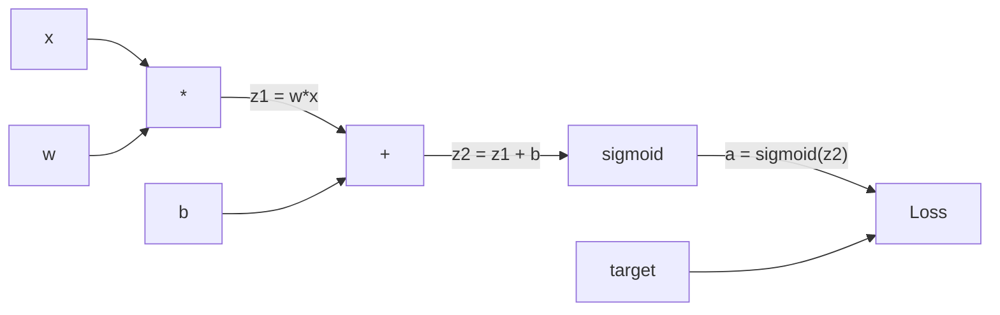
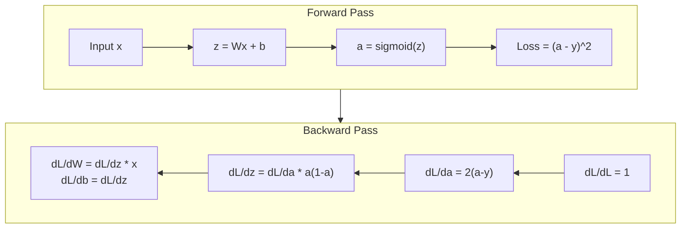
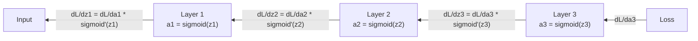

# 밑바닥부터 만드는 역전파(Backpropagation)

> 역전파(backpropagation)는 학습을 가능하게 만드는 알고리즘이다. 이것이 없다면 신경망(neural network)은 그저 비싼 난수 생성기일 뿐이다.

**Type:** Build
**Languages:** Python
**Prerequisites:** Lesson 03.02 (Multi-Layer Networks)
**Time:** ~120분

## 학습 목표 (Learning Objectives)

- 계산 그래프(computational graph)를 구성하고 위상 정렬(topological sort)로 그래디언트(gradient)를 계산하는 Value 기반 자동 미분(autograd) 엔진 구현하기
- 덧셈, 곱셈, 시그모이드(sigmoid)에 대한 역방향 패스(backward pass)를 연쇄 법칙(chain rule)으로 유도하기
- 밑바닥부터 만든 역전파 엔진만으로 XOR와 원(circle) 분류 문제에 대해 다층 신경망(multi-layer network) 학습시키기
- 깊은 시그모이드 신경망에서 발생하는 기울기 소실(vanishing gradient) 문제를 식별하고, 왜 그래디언트가 지수적으로 작아지는지 설명하기

## 문제 (The Problem)

당신의 신경망에는 입력 768개, 출력 3072개짜리 은닉층(hidden layer) 하나가 있다. 가중치(weight)가 2,359,296개라는 뜻이다. 이 신경망이 잘못된 예측을 했다. 어느 가중치가 오차를 만든 걸까? 가중치를 하나씩 개별적으로 테스트하려면 230만 번의 순방향 패스(forward pass)가 필요하다. 역전파는 이 230만 개의 그래디언트를 단 한 번의 역방향 패스로 모두 계산한다. 이건 단순한 최적화가 아니다. 학습 가능한 것과 불가능한 것을 가르는 차이다.

순진한 접근법은 이렇다. 가중치 하나를 골라 아주 조금 흔들어 보고, 순방향 패스를 다시 돌려서 손실(loss)이 올라갔는지 내려갔는지 측정한다. 그러면 그 가중치에 대한 그래디언트를 얻는다. 이제 신경망의 모든 가중치에 대해 이걸 반복한다. 여기에 수천 번의 학습 스텝과 수백만 개의 데이터 포인트를 곱하라. 쓸 만한 무언가를 학습시키려면 지질학적 시간이 필요할 것이다.

역전파는 이 문제를 해결한다. 순방향 패스 한 번, 역방향 패스 한 번이면 모든 그래디언트가 계산된다. 핵심 비결은 미적분학의 연쇄 법칙(chain rule)을, 계산 그래프(computational graph)에 체계적으로 적용하는 것이다. 이것이 딥러닝(deep learning)을 실용적으로 만든 알고리즘이다. 이것이 없었다면 우리는 여전히 장난감 수준의 문제에 갇혀 있었을 것이다.

## 개념 (The Concept)

### 신경망에 적용하는 연쇄 법칙

연쇄 법칙은 Phase 01, Lesson 05에서 이미 봤다. 빠르게 복습하면: y = f(g(x))일 때, dy/dx = f'(g(x)) * g'(x)이다. 연쇄(chain)를 따라가며 도함수(derivative)를 곱한다.

신경망에서 "연쇄"란 입력에서 손실까지 이어지는 연산의 순서다. 각 층(layer)은 가중치를 적용하고, 편향(bias)을 더하고, 활성화 함수(activation)를 통과시킨다. 손실 함수(loss function)는 최종 출력을 목표값(target)과 비교한다. 역전파는 이 연쇄를 거꾸로 추적하면서, 각 연산이 오차에 얼마나 기여했는지 계산한다.

### 계산 그래프 (Computational Graphs)

모든 순방향 패스는 그래프를 만든다. 각 노드(node)는 하나의 연산(곱셈, 덧셈, 시그모이드)이다. 각 간선(edge)은 순방향으로는 값을, 역방향으로는 그래디언트를 운반한다.



순방향 패스: 값이 왼쪽에서 오른쪽으로 흐른다. x와 w가 z1 = w*x를 만든다. 여기에 b를 더해 z2를 얻는다. 시그모이드가 활성값 a를 준다. 손실 함수를 사용해 a를 목표값 y와 비교한다.

역방향 패스: 그래디언트가 오른쪽에서 왼쪽으로 흐른다. dL/da(손실이 활성값에 따라 어떻게 변하는지)에서 시작한다. 여기에 da/dz2(시그모이드 도함수)를 곱한다. 그러면 dL/dz2를 얻는다. 이를 dL/db(z2 = z1 + b이므로 dL/dz2와 같다)와 dL/dz1로 나눈다. 그다음 dL/dw = dL/dz1 * x이고 dL/dx = dL/dz1 * w이다.

그래프의 모든 노드는 역방향 패스에서 단 하나의 일을 한다. 위에서 내려오는 그래디언트를 받아, 자신의 국소 도함수(local derivative)를 곱한 뒤, 아래로 내려보낸다.

### 순방향 vs 역방향



순방향 패스는 모든 중간값을 저장한다. z, a, 그리고 각 층의 입력들. 역방향 패스는 그래디언트를 계산하기 위해 이렇게 저장된 값들이 필요하다. 이것이 역전파의 핵심에 있는 메모리-계산 트레이드오프(tradeoff)다. 메모리(활성값 저장)를 내주고 속도(수백만 번이 아닌 단 한 번의 패스)를 얻는다.

### 신경망을 통과하는 그래디언트 흐름

3층 신경망에서 그래디언트는 모든 층을 연쇄적으로 통과한다.



각 층에서 그래디언트는 시그모이드 도함수와 곱해진다. 시그모이드 도함수는 a * (1 - a)이며, a = 0.5일 때 최댓값 0.25를 갖는다. 3층 깊이라면 그래디언트는 최대 0.25^3 = 0.0156배가 곱해진 상태다. 10층 깊이라면 0.25^10 = 0.000001배다.

### 기울기 소실 (Vanishing Gradients)

이것이 기울기 소실(vanishing gradient) 문제다. 시그모이드는 출력을 0과 1 사이로 짓눌러 버린다. 그 도함수는 언제나 0.25보다 작다. 시그모이드 층을 충분히 쌓으면 그래디언트는 거의 0으로 줄어든다. 초기 층(early layer)들은 거의 0에 가까운 그래디언트를 받기 때문에 학습이 거의 되지 않는다.

```
sigmoid(z):     Output range [0, 1]
sigmoid'(z):    Max value 0.25 (at z = 0)

After 5 layers:   gradient * 0.25^5 = 0.001x original
After 10 layers:  gradient * 0.25^10 = 0.000001x original
```

이것이 깊은 시그모이드 신경망을 학습시키기가 거의 불가능한 이유다. 그 해결책 — ReLU와 그 변형들 — 은 Lesson 04의 주제다. 지금은 역전파 자체는 완벽하게 동작한다는 점만 이해하면 된다. 문제는 역전파가 통과해 지나가는 대상에 있다.

### 2층 신경망의 그래디언트 유도

입력 x, 시그모이드를 쓰는 은닉층, 시그모이드를 쓰는 출력층, 그리고 MSE 손실로 이루어진 신경망에 대한 구체적인 수학.

순방향 패스:
```
z1 = W1 * x + b1
a1 = sigmoid(z1)
z2 = W2 * a1 + b2
a2 = sigmoid(z2)
L = (a2 - y)^2
```

역방향 패스 (연쇄 법칙을 한 단계씩 적용):
```
dL/da2 = 2(a2 - y)
da2/dz2 = a2 * (1 - a2)
dL/dz2 = dL/da2 * da2/dz2 = 2(a2 - y) * a2 * (1 - a2)

dL/dW2 = dL/dz2 * a1
dL/db2 = dL/dz2

dL/da1 = dL/dz2 * W2
da1/dz1 = a1 * (1 - a1)
dL/dz1 = dL/da1 * da1/dz1

dL/dW1 = dL/dz1 * x
dL/db1 = dL/dz1
```

모든 그래디언트는 손실에서부터 거꾸로 추적된 국소 도함수들의 곱이다. 역전파란 그게 전부다.

## 직접 만들기 (Build It)

### 1단계: Value 노드

우리 계산에 등장하는 모든 숫자는 Value가 된다. Value는 자신의 데이터, 그래디언트, 그리고 자신이 어떻게 생성되었는지(그래야 역방향으로 그래디언트를 계산하는 법을 알 수 있다)를 저장한다.

```python
class Value:
    def __init__(self, data, children=(), op=''):
        self.data = data
        self.grad = 0.0
        self._backward = lambda: None
        self._children = set(children)
        self._op = op

    def __repr__(self):
        return f"Value(data={self.data:.4f}, grad={self.grad:.4f})"
```

아직 그래디언트는 없다(0.0). 아직 역방향 함수도 없다(아무 일도 안 함). `_children`은 어떤 Value들이 이 Value를 만들어냈는지 추적해서, 나중에 그래프를 위상 정렬할 수 있게 한다.

### 2단계: 역방향 함수를 가진 연산들

각 연산은 새로운 Value를 만들고, 그래디언트가 그 연산을 통해 어떻게 역방향으로 흐르는지 정의한다.

```python
def __add__(self, other):
    other = other if isinstance(other, Value) else Value(other)
    out = Value(self.data + other.data, (self, other), '+')

    def _backward():
        self.grad += out.grad
        other.grad += out.grad

    out._backward = _backward
    return out

def __mul__(self, other):
    other = other if isinstance(other, Value) else Value(other)
    out = Value(self.data * other.data, (self, other), '*')

    def _backward():
        self.grad += other.data * out.grad
        other.grad += self.data * out.grad

    out._backward = _backward
    return out
```

덧셈의 경우: d(a+b)/da = 1, d(a+b)/db = 1. 따라서 두 입력 모두 출력의 그래디언트를 그대로 받는다.

곱셈의 경우: d(a*b)/da = b, d(a*b)/db = a. 각 입력은 상대방의 값에 출력 그래디언트를 곱한 값을 받는다.

`+=`가 결정적으로 중요하다. 하나의 Value는 여러 연산에서 쓰일 수 있다. 그 그래디언트는 모든 경로에서 온 그래디언트들의 합이다.

### 3단계: 시그모이드와 손실

```python
import math

def sigmoid(self):
    x = self.data
    x = max(-500, min(500, x))
    s = 1.0 / (1.0 + math.exp(-x))
    out = Value(s, (self,), 'sigmoid')

    def _backward():
        self.grad += (s * (1 - s)) * out.grad

    out._backward = _backward
    return out
```

시그모이드 도함수: sigmoid(x) * (1 - sigmoid(x)). 순방향 패스에서 이미 sigmoid(x) = s를 계산해 두었다. 이를 재사용한다. 추가 작업이 없다.

```python
def mse_loss(predicted, target):
    diff = predicted + Value(-target)
    return diff * diff
```

단일 출력에 대한 MSE: (predicted - target)^2. 뺄셈은 음수화된 Value와의 덧셈으로 표현한다.

### 4단계: 역방향 패스

위상 정렬(topological sort)은 노드를 올바른 순서로 처리하도록 보장한다 — 어떤 노드의 그래디언트가 완전히 누적된 뒤에야 그 노드를 통해 전파한다.

```python
def backward(self):
    topo = []
    visited = set()

    def build_topo(v):
        if v not in visited:
            visited.add(v)
            for child in v._children:
                build_topo(child)
            topo.append(v)

    build_topo(self)
    self.grad = 1.0
    for v in reversed(topo):
        v._backward()
```

손실에서 시작한다(dL/dL = 1이므로 그래디언트 = 1.0). 정렬된 그래프를 거꾸로 따라간다. 각 노드의 `_backward`가 자신의 자식들에게 그래디언트를 밀어 보낸다.

### 5단계: 층과 신경망

```python
import random

class Neuron:
    def __init__(self, n_inputs):
        scale = (2.0 / n_inputs) ** 0.5
        self.weights = [Value(random.uniform(-scale, scale)) for _ in range(n_inputs)]
        self.bias = Value(0.0)

    def __call__(self, x):
        act = sum((wi * xi for wi, xi in zip(self.weights, x)), self.bias)
        return act.sigmoid()

    def parameters(self):
        return self.weights + [self.bias]


class Layer:
    def __init__(self, n_inputs, n_outputs):
        self.neurons = [Neuron(n_inputs) for _ in range(n_outputs)]

    def __call__(self, x):
        out = [n(x) for n in self.neurons]
        return out[0] if len(out) == 1 else out

    def parameters(self):
        params = []
        for n in self.neurons:
            params.extend(n.parameters())
        return params


class Network:
    def __init__(self, sizes):
        self.layers = []
        for i in range(len(sizes) - 1):
            self.layers.append(Layer(sizes[i], sizes[i + 1]))

    def __call__(self, x):
        for layer in self.layers:
            x = layer(x)
            if not isinstance(x, list):
                x = [x]
        return x[0] if len(x) == 1 else x

    def parameters(self):
        params = []
        for layer in self.layers:
            params.extend(layer.parameters())
        return params

    def zero_grad(self):
        for p in self.parameters():
            p.grad = 0.0
```

뉴런(Neuron)은 입력을 받아 가중합 + 편향을 계산하고 시그모이드를 적용한다. 가중치 초기화는 sqrt(2/n_inputs)로 스케일링하여 더 깊은 신경망에서 시그모이드 포화(saturation)를 방지한다. 층(Layer)은 뉴런들의 리스트다. 신경망(Network)은 층들의 리스트다. `parameters()` 메서드는 학습 가능한 모든 Value를 모아서 우리가 그것들을 갱신할 수 있게 한다.

### 6단계: XOR 학습

```python
random.seed(42)
net = Network([2, 4, 1])

xor_data = [
    ([0.0, 0.0], 0.0),
    ([0.0, 1.0], 1.0),
    ([1.0, 0.0], 1.0),
    ([1.0, 1.0], 0.0),
]

learning_rate = 1.0

for epoch in range(1000):
    total_loss = Value(0.0)
    for inputs, target in xor_data:
        x = [Value(i) for i in inputs]
        pred = net(x)
        loss = mse_loss(pred, target)
        total_loss = total_loss + loss

    net.zero_grad()
    total_loss.backward()

    for p in net.parameters():
        p.data -= learning_rate * p.grad

    if epoch % 100 == 0:
        print(f"Epoch {epoch:4d} | Loss: {total_loss.data:.6f}")

print("\nXOR Results:")
for inputs, target in xor_data:
    x = [Value(i) for i in inputs]
    pred = net(x)
    print(f"  {inputs} -> {pred.data:.4f} (expected {target})")
```

손실이 줄어드는 것을 지켜보라. 무작위 예측에서 올바른 XOR 출력으로, 전적으로 역전파가 그래디언트를 계산하고 가중치를 올바른 방향으로 밀어준 결과다.

### 7단계: 원 분류

Lesson 02에서는 원 분류를 위해 가중치를 손으로 직접 조정했다. 이제 신경망이 스스로 학습하게 하자.

```python
random.seed(7)

def generate_circle_data(n=100):
    data = []
    for _ in range(n):
        x1 = random.uniform(-1.5, 1.5)
        x2 = random.uniform(-1.5, 1.5)
        label = 1.0 if x1 * x1 + x2 * x2 < 1.0 else 0.0
        data.append(([x1, x2], label))
    return data

circle_data = generate_circle_data(80)

circle_net = Network([2, 8, 1])
learning_rate = 0.5

for epoch in range(2000):
    random.shuffle(circle_data)
    total_loss_val = 0.0
    for inputs, target in circle_data:
        x = [Value(i) for i in inputs]
        pred = circle_net(x)
        loss = mse_loss(pred, target)
        circle_net.zero_grad()
        loss.backward()
        for p in circle_net.parameters():
            p.data -= learning_rate * p.grad
        total_loss_val += loss.data

    if epoch % 200 == 0:
        correct = 0
        for inputs, target in circle_data:
            x = [Value(i) for i in inputs]
            pred = circle_net(x)
            predicted_class = 1.0 if pred.data > 0.5 else 0.0
            if predicted_class == target:
                correct += 1
        accuracy = correct / len(circle_data) * 100
        print(f"Epoch {epoch:4d} | Loss: {total_loss_val:.4f} | Accuracy: {accuracy:.1f}%")
```

여기서는 온라인 SGD를 사용한다 — 전체 배치를 누적하는 대신 각 샘플마다 가중치를 갱신한다. 이렇게 하면 대칭성(symmetry)을 더 빨리 깨고, 전체 손실 지형(loss landscape)에서의 시그모이드 포화를 피한다. 매 에폭(epoch)마다 데이터를 섞으면 신경망이 순서를 외우는 것을 방지한다.

손으로 조정하는 일은 없다. 신경망이 스스로 원형의 결정 경계(decision boundary)를 발견한다. 그것이 역전파의 힘이다. 당신은 아키텍처, 손실 함수, 데이터를 정의한다. 알고리즘이 가중치를 알아낸다.

## 라이브러리로 써보기 (Use It)

PyTorch는 위의 모든 것을 단 몇 줄로 해낸다. 핵심 아이디어는 동일하다 — 자동 미분(autograd)이 순방향 패스 동안 계산 그래프를 만들고, 이를 역방향으로 추적하여 그래디언트를 계산한다.

```python
import torch
import torch.nn as nn

model = nn.Sequential(
    nn.Linear(2, 4),
    nn.Sigmoid(),
    nn.Linear(4, 1),
    nn.Sigmoid(),
)
optimizer = torch.optim.SGD(model.parameters(), lr=1.0)
criterion = nn.MSELoss()

X = torch.tensor([[0,0],[0,1],[1,0],[1,1]], dtype=torch.float32)
y = torch.tensor([[0],[1],[1],[0]], dtype=torch.float32)

for epoch in range(1000):
    pred = model(X)
    loss = criterion(pred, y)
    optimizer.zero_grad()
    loss.backward()
    optimizer.step()

print("PyTorch XOR Results:")
with torch.no_grad():
    for i in range(4):
        pred = model(X[i])
        print(f"  {X[i].tolist()} -> {pred.item():.4f} (expected {y[i].item()})")
```

`loss.backward()`는 당신의 `total_loss.backward()`다. `optimizer.step()`은 당신이 수동으로 하던 `p.data -= lr * p.grad`다. `optimizer.zero_grad()`는 당신의 `net.zero_grad()`다. 같은 알고리즘, 산업 수준의 구현. PyTorch는 GPU 가속, 혼합 정밀도(mixed precision), 그래디언트 체크포인팅(gradient checkpointing), 수백 가지 층 종류를 처리한다. 하지만 역방향 패스는 같은 계산 그래프에 적용된 같은 연쇄 법칙이다.

학습은 순방향 패스를 돌리고, 그다음 역방향 패스를 돌린 뒤, 가중치를 갱신한다. 추론(inference)은 오직 순방향 패스만 돌린다. 그래디언트도, 갱신도 없다. 이 구분이 중요한 이유는, 추론이야말로 프로덕션(production)에서 실제로 일어나는 일이기 때문이다. Claude나 GPT 같은 API를 호출할 때, 당신은 추론을 돌리고 있는 것이다 — 당신의 프롬프트가 신경망을 순방향으로 흐르고, 반대편에서 토큰(token)이 나온다. 어떤 가중치도 바뀌지 않는다. 역전파를 이해하는 것이 중요한 이유는, 역전파가 바로 그 신경망의 모든 가중치를 빚어냈기 때문이다.

## 산출물 (Ship It)

이 레슨이 만들어내는 것:
- `outputs/prompt-gradient-debugger.md` — 어떤 신경망에서든 그래디언트 문제(소실, 폭발, NaN)를 진단하는 재사용 가능한 프롬프트

## 연습 문제 (Exercises)

1. Value 클래스에 `__sub__` 메서드를 추가하라 (a - b = a + (-1 * b)). 그다음 `__neg__` 메서드를 구현하라. (a - b)^2 같은 간단한 식에 대해 수동 계산과 비교하여 그래디언트가 올바른지 검증하라.

2. Value에 `relu` 메서드를 추가하라 (출력은 max(0, x), 도함수는 x > 0이면 1, 아니면 0). 은닉층의 시그모이드를 relu로 바꾸고 XOR을 다시 학습시켜라. 수렴 속도를 비교하라. 학습이 더 빨라지는 것을 볼 수 있을 것이다 — 이는 Lesson 04를 미리 맛보는 것이다.

3. Value에 정수 거듭제곱을 위한 `__pow__` 메서드를 구현하라. 이를 사용해 `mse_loss`를 제대로 된 `(predicted - target) ** 2` 식으로 교체하라. 그래디언트가 원래 구현과 일치하는지 검증하라.

4. 학습 루프에 그래디언트 클리핑(gradient clipping)을 추가하라: `backward()`를 호출한 뒤, 모든 그래디언트를 [-1, 1]로 자른다. 더 깊은 신경망(시그모이드를 쓰는 4층 이상)을 학습시키고, 클리핑이 있을 때와 없을 때의 손실 곡선을 비교하라. 이것이 그래디언트 폭발(exploding gradient)에 대한 당신의 첫 방어선이다.

5. 시각화를 만들어 보라: XOR 학습 후, 신경망 내 모든 파라미터의 그래디언트를 출력하라. 어느 층의 그래디언트가 가장 작은지 식별하라. 이는 개념(Concept) 절에서 읽은 기울기 소실 문제를 직접 보여준다.

## 핵심 용어 (Key Terms)

| 용어 | 흔히 하는 말 | 실제 의미 |
|------|----------------|----------------------|
| 역전파 (Backpropagation) | "신경망이 학습한다" | 계산 그래프를 거꾸로 따라가며 연쇄 법칙을 적용해 모든 가중치에 대한 dL/dw를 계산하는 알고리즘 |
| 계산 그래프 (Computational graph) | "신경망 구조" | 노드는 연산이고 간선은 값(순방향)과 그래디언트(역방향)를 운반하는 방향성 비순환 그래프(DAG) |
| 연쇄 법칙 (Chain rule) | "도함수를 곱한다" | y = f(g(x))이면 dy/dx = f'(g(x)) * g'(x) — 역전파의 수학적 토대 |
| 그래디언트 (Gradient) | "가장 가파른 상승 방향" | 어떤 파라미터에 대한 손실의 편도함수 — 손실을 줄이려면 그 파라미터를 어떻게 바꿔야 하는지 알려준다 |
| 기울기 소실 (Vanishing gradient) | "깊은 신경망은 학습이 안 된다" | 시그모이드처럼 포화되는 활성화 함수를 가진 층들을 통과하며 그래디언트가 지수적으로 작아지는 현상 |
| 순방향 패스 (Forward pass) | "신경망을 돌린다" | 각 층의 연산을 순차적으로 적용하고 중간값을 저장하며 입력으로부터 출력을 계산하는 것 |
| 역방향 패스 (Backward pass) | "그래디언트를 계산한다" | 계산 그래프를 역순으로 순회하며 연쇄 법칙을 사용해 각 노드에서 그래디언트를 누적하는 것 |
| 학습률 (Learning rate) | "얼마나 빨리 학습하는가" | 가중치 갱신 시 스텝 크기를 제어하는 스칼라: w_new = w_old - lr * gradient |
| 위상 정렬 (Topological sort) | "올바른 순서" | 각 노드가 자신이 의존하는 모든 노드 뒤에 나타나도록 하는 그래프 노드의 정렬 — 전파 전에 그래디언트가 완전히 누적되도록 보장한다 |
| 자동 미분 (Autograd) | "자동 미분" | 순방향 계산 동안 계산 그래프를 만들고 자동으로 그래디언트를 계산하는 시스템 — PyTorch 엔진이 하는 일 |

## 더 읽을거리 (Further Reading)

- Rumelhart, Hinton & Williams, "Learning representations by back-propagating errors" (1986) — 역전파를 주류로 만들고 다층 신경망 학습의 빗장을 푼 논문
- 3Blue1Brown, "Neural Networks" 시리즈 (https://www.youtube.com/playlist?list=PLZHQObOWTQDNU6R1_67000Dx_ZCJB-3pi) — 역전파와 신경망을 통과하는 그래디언트 흐름에 대한 최고의 시각적 설명
