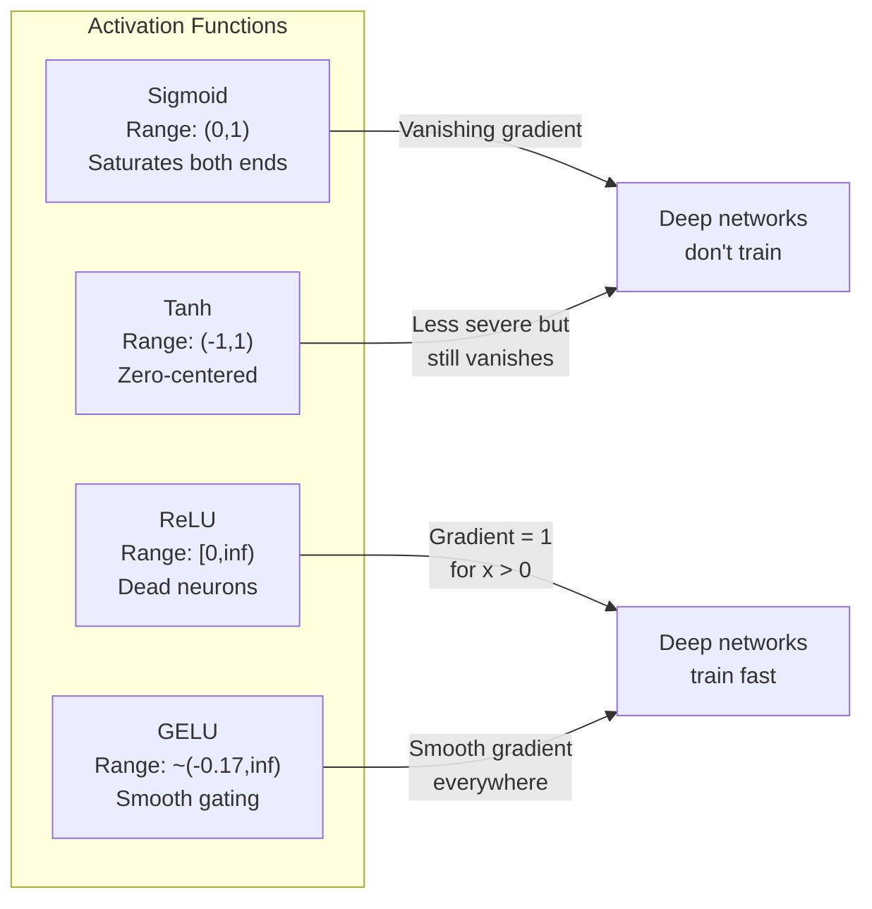
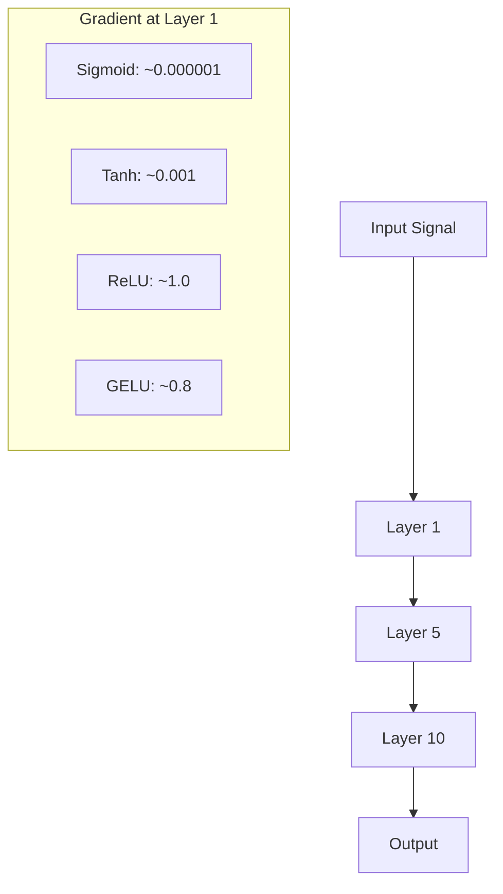
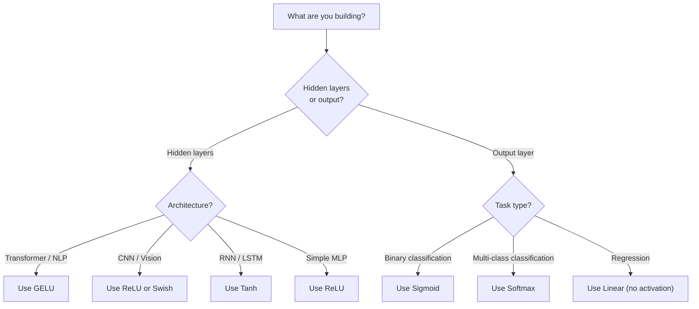

# 활성화 함수 (Activation Functions)

> 비선형성(nonlinearity)이 없으면 100층짜리 신경망도 거창한 행렬 곱일 뿐이다. 활성화 함수(activation function)는 신경망이 곡선으로 사고하게 해 주는 관문이다.

**Type:** Build
**Languages:** Python
**Prerequisites:** Lesson 03.03 (Backpropagation)
**Time:** ~75분

## 학습 목표 (Learning Objectives)

- 시그모이드(sigmoid), tanh, ReLU, Leaky ReLU, GELU, Swish, 소프트맥스(softmax)와 그 도함수(derivative)를 밑바닥부터 구현하기
- 서로 다른 활성화 함수로 10개 이상의 층(layer)을 거치며 활성값(activation) 크기를 측정하여 기울기 소실(vanishing gradient) 문제 진단하기
- ReLU 신경망에서 죽은 뉴런(dead neuron)을 탐지하고, GELU가 왜 이 실패 모드를 피하는지 설명하기
- 주어진 아키텍처(트랜스포머(transformer), CNN, RNN, 출력층)에 맞는 올바른 활성화 함수 선택하기

## 문제 (The Problem)

두 개의 선형 변환을 쌓아 보자: y = W2(W1x + b1) + b2. 전개하면 y = W2W1x + W2b1 + b2가 된다. 이것은 그저 y = Ax + c, 하나의 선형 변환일 뿐이다. 선형 층을 몇 개를 쌓든 결과는 하나의 행렬 곱으로 붕괴한다. 100층짜리 신경망도 단 한 층과 똑같은 표현력을 가질 뿐이다.

이것은 이론적 호기심이 아니다. 깊은 선형 신경망은 말 그대로 XOR를 학습할 수 없고, 나선(spiral) 데이터셋을 분류할 수 없으며, 얼굴을 인식할 수 없다는 뜻이다. 활성화 함수가 없으면, 깊이는 환상이다.

활성화 함수는 선형성을 깨뜨린다. 각 층의 출력을 비선형 함수로 휘게 해서 신경망이 결정 경계(decision boundary)를 구부리고, 임의의 함수를 근사하고, 실제로 학습하게 만든다. 하지만 잘못된 활성화를 고르면 그래디언트(gradient)가 0으로 소실되거나(깊은 신경망에서의 시그모이드), 무한대로 폭발하거나(세심한 초기화 없는 비유계 활성화), 뉴런이 영구히 죽는다(큰 음수 편향을 가진 ReLU). 활성화 함수의 선택이 신경망의 학습 여부를 직접 결정한다.

## 개념 (The Concept)

### 왜 비선형성이 필요한가

행렬 곱(matrix multiplication)은 조합 가능(composable)하다. 벡터에 행렬 A를 곱한 뒤 행렬 B를 곱하는 것은 AB를 곱하는 것과 같다. 즉 선형 층 열 개를 쌓는 것은 하나의 큰 행렬을 가진 선형 층 하나와 수학적으로 동등하다. 그 모든 파라미터(parameter)와 그 모든 깊이가 낭비되는 셈이다. 이 연쇄(chain)를 깨뜨릴 무언가가 필요한데, 그 일을 하는 것이 바로 활성화 함수다.

증명은 이렇다. 선형 층은 f(x) = Wx + b를 계산한다. 둘을 쌓자.

```
Layer 1: h = W1 * x + b1
Layer 2: y = W2 * h + b2
```

대입하면:

```
y = W2 * (W1 * x + b1) + b2
y = (W2 * W1) * x + (W2 * b1 + b2)
y = A * x + c
```

한 층이다. 층 사이에 비선형 활성화 g()를 끼워 넣자.

```
h = g(W1 * x + b1)
y = W2 * h + b2
```

이제 대입이 깨진다. W2 * g(W1 * x + b1) + b2는 하나의 선형 변환으로 환원되지 않는다. 신경망이 비선형 함수를 표현하게 되는 것이다. 활성화를 가진 층이 하나씩 더해질 때마다 표현 용량이 늘어난다.

### 시그모이드 (Sigmoid)

신경망의 원조 활성화 함수다.

```
sigmoid(x) = 1 / (1 + e^(-x))
```

출력 범위: (0, 1). 매끄럽고, 미분 가능하며, 어떤 실수든 확률 같은 값으로 매핑한다.

도함수:

```
sigmoid'(x) = sigmoid(x) * (1 - sigmoid(x))
```

이 도함수의 최댓값은 x = 0에서 발생하는 0.25다. 역전파(backpropagation)에서는 그래디언트가 층을 거치며 곱해진다. 시그모이드 열 층은 그래디언트가 최대 0.25씩 열 번 곱해진다는 뜻이다.

```
0.25^10 = 0.000000953674
```

원래 신호의 백만분의 일도 안 된다. 이것이 기울기 소실(vanishing gradient) 문제다. 앞쪽 층의 그래디언트가 너무 작아져서 가중치(weight)가 거의 갱신되지 않는다. 뒤쪽 층에서는 손실(loss)이 줄어드니 학습하는 것처럼 보이지만, 첫 번째 층들은 얼어붙어 있다. 깊은 시그모이드 신경망은 그냥 학습이 안 된다.

또 다른 문제도 있다. 시그모이드 출력은 항상 양수(0에서 1)라서, 가중치에 대한 그래디언트가 항상 같은 부호다. 그래서 경사 하강법(gradient descent) 중에 지그재그가 발생한다.

### Tanh

시그모이드의 중심을 옮긴 버전이다.

```
tanh(x) = (e^x - e^(-x)) / (e^x + e^(-x))
```

출력 범위: (-1, 1). 0 중심(zero-centered)이라 지그재그 문제를 없앤다.

도함수:

```
tanh'(x) = 1 - tanh(x)^2
```

최대 도함수는 x = 0에서 1.0으로, 시그모이드보다 네 배 낫다. 하지만 기울기 소실 문제는 여전히 남는다. 큰 양수나 음수 입력에서는 도함수가 0에 가까워진다. 열 층을 거치면 여전히 그래디언트를 짓뭉갠다. 다만 덜 공격적일 뿐이다.

### ReLU: 돌파구

정류 선형 유닛(Rectified Linear Unit). 2010년 Nair와 Hinton이 딥러닝용으로 대중화했고(함수 자체는 1969년 Fukushima의 연구로 거슬러 올라간다), 모든 것을 바꿨다.

```
relu(x) = max(0, x)
```

출력 범위: [0, infinity). 도함수는 더없이 단순하다.

```
relu'(x) = 1  if x > 0
            0  if x <= 0
```

양수 입력에서는 기울기 소실이 없다. 그래디언트가 정확히 1이라 곧장 통과한다. 이것이 깊은 신경망이 학습 가능해진 이유다. ReLU는 층을 거쳐도 그래디언트 크기를 보존한다.

하지만 실패 모드가 있다. 죽은 뉴런(dead neuron) 문제다. 어떤 뉴런의 가중 입력이 항상 음수라면(큰 음수 편향이나 불운한 가중치 초기화 때문에) 그 출력은 항상 0, 그래디언트도 항상 0이라 절대 갱신되지 않는다. 영구히 죽은 것이다. 실제로 ReLU 신경망에서는 뉴런의 10-40%가 학습 중에 죽기도 한다.

### Leaky ReLU

죽은 뉴런에 대한 가장 단순한 해결책이다.

```
leaky_relu(x) = x        if x > 0
                alpha * x if x <= 0
```

여기서 alpha는 작은 상수로 보통 0.01이다. 음수 쪽이 0 대신 작은 기울기를 가지므로, 죽은 뉴런도 그래디언트 신호를 받아 회복할 수 있다.

### GELU: 현대의 기본값

가우시안 오차 선형 유닛(Gaussian Error Linear Unit). 2016년 Hendrycks와 Gimpel이 도입했다. BERT, GPT, 그리고 대부분의 현대 트랜스포머에서 기본 활성화다.

```
gelu(x) = x * Phi(x)
```

여기서 Phi(x)는 표준 정규 분포의 누적 분포 함수(cumulative distribution function)다. 실제로 사용되는 근사는 이렇다.

```
gelu(x) ~= 0.5 * x * (1 + tanh(sqrt(2/pi) * (x + 0.044715 * x^3)))
```

GELU는 모든 곳에서 매끄럽고, 작은 음수 값을 허용하며(0으로 딱딱하게 잘라 버리는 ReLU와 달리), 확률적 해석을 가진다. 각 입력을 가우시안 분포 아래에서 그것이 양수일 확률에 따라 가중하는 것이다. 이 매끄러운 게이팅(gating)은 더 나은 그래디언트 흐름을 제공하고 죽은 뉴런 문제를 완전히 피하기 때문에, 트랜스포머 아키텍처에서 ReLU를 능가한다.

### Swish / SiLU

2017년 Ramachandran 등이 자동 탐색을 통해 발견한 자기 게이팅(self-gated) 활성화다.

```
swish(x) = x * sigmoid(x)
```

Swish는 형식적으로 x * sigmoid(x)다. Google은 활성화 함수 공간을 자동 탐색해서 이를 발견했다. 신경망이 신경망의 일부를 설계한 셈이다.

GELU처럼 매끄럽고, 비단조(non-monotonic)하며, 작은 음수 값을 허용한다. 차이는 미묘하다. Swish는 게이팅에 시그모이드를 쓰고 GELU는 가우시안 CDF를 쓴다. 실제 성능은 거의 같다. Swish는 EfficientNet과 일부 비전 모델에서 쓰이고, GELU는 언어 모델에서 지배적이다.

### 소프트맥스: 출력 활성화 (Softmax: The Output Activation)

은닉층(hidden layer)에서는 쓰이지 않는다. 소프트맥스는 원시 점수(로짓(logit)) 벡터를 확률 분포(probability distribution)로 변환한다.

```
softmax(x_i) = e^(x_i) / sum(e^(x_j) for all j)
```

모든 출력은 0과 1 사이이고, 그 합은 1이다. 그래서 다중 클래스 분류(classification)의 표준 최종 활성화가 된다. 가장 큰 로짓이 가장 높은 확률을 받지만, argmax와 달리 소프트맥스는 미분 가능하며 상대적 확신에 대한 정보를 보존한다.

### 모양 비교



### 그래디언트 흐름 비교



### 언제 어떤 활성화를 쓸까



## 직접 만들기 (Build It)

### 1단계: 모든 활성화 함수를 도함수와 함께 구현하기

각 함수는 하나의 float를 받아 float를 반환한다. 각 도함수 함수는 같은 입력을 받아 그래디언트를 반환한다.

```python
import math

def sigmoid(x):
    x = max(-500, min(500, x))
    return 1.0 / (1.0 + math.exp(-x))

def sigmoid_derivative(x):
    s = sigmoid(x)
    return s * (1 - s)

def tanh_act(x):
    return math.tanh(x)

def tanh_derivative(x):
    t = math.tanh(x)
    return 1 - t * t

def relu(x):
    return max(0.0, x)

def relu_derivative(x):
    return 1.0 if x > 0 else 0.0

def leaky_relu(x, alpha=0.01):
    return x if x > 0 else alpha * x

def leaky_relu_derivative(x, alpha=0.01):
    return 1.0 if x > 0 else alpha

def gelu(x):
    return 0.5 * x * (1 + math.tanh(math.sqrt(2 / math.pi) * (x + 0.044715 * x ** 3)))

def gelu_derivative(x):
    phi = 0.5 * (1 + math.erf(x / math.sqrt(2)))
    pdf = math.exp(-0.5 * x * x) / math.sqrt(2 * math.pi)
    return phi + x * pdf

def swish(x):
    return x * sigmoid(x)

def swish_derivative(x):
    s = sigmoid(x)
    return s + x * s * (1 - s)

def softmax(xs):
    max_x = max(xs)
    exps = [math.exp(x - max_x) for x in xs]
    total = sum(exps)
    return [e / total for e in exps]
```

### 2단계: 그래디언트가 죽는 곳 시각화하기

-5에서 5까지 균등하게 떨어진 100개 점에서 그래디언트를 계산한다. 각 활성화의 그래디언트가 0에 가까운 곳을 보여 주는 텍스트 히스토그램을 출력한다.

```python
def gradient_scan(name, derivative_fn, start=-5, end=5, n=100):
    step = (end - start) / n
    near_zero = 0
    healthy = 0
    for i in range(n):
        x = start + i * step
        g = derivative_fn(x)
        if abs(g) < 0.01:
            near_zero += 1
        else:
            healthy += 1
    pct_dead = near_zero / n * 100
    print(f"{name:15s}: {healthy:3d} healthy, {near_zero:3d} near-zero ({pct_dead:.0f}% dead zone)")

gradient_scan("Sigmoid", sigmoid_derivative)
gradient_scan("Tanh", tanh_derivative)
gradient_scan("ReLU", relu_derivative)
gradient_scan("Leaky ReLU", leaky_relu_derivative)
gradient_scan("GELU", gelu_derivative)
gradient_scan("Swish", swish_derivative)
```

### 3단계: 기울기 소실 실험

시그모이드 대 ReLU를 사용하여 N개의 층에 신호를 순방향 패스(forward pass)시킨다. 활성값 크기가 어떻게 변하는지 측정한다.

```python
import random

def vanishing_gradient_experiment(activation_fn, name, n_layers=10, n_inputs=5):
    random.seed(42)
    values = [random.gauss(0, 1) for _ in range(n_inputs)]

    print(f"\n{name} through {n_layers} layers:")
    for layer in range(n_layers):
        weights = [random.gauss(0, 1) for _ in range(n_inputs)]
        z = sum(w * v for w, v in zip(weights, values))
        activated = activation_fn(z)
        magnitude = abs(activated)
        bar = "#" * int(magnitude * 20)
        print(f"  Layer {layer+1:2d}: magnitude = {magnitude:.6f} {bar}")
        values = [activated] * n_inputs

vanishing_gradient_experiment(sigmoid, "Sigmoid")
vanishing_gradient_experiment(relu, "ReLU")
vanishing_gradient_experiment(gelu, "GELU")
```

### 4단계: 죽은 뉴런 탐지기

ReLU 신경망을 만들고, 무작위 입력을 통과시켜, 절대 발화하지 않는 뉴런이 몇 개인지 센다.

```python
def dead_neuron_detector(n_inputs=5, hidden_size=20, n_samples=1000):
    random.seed(0)
    weights = [[random.gauss(0, 1) for _ in range(n_inputs)] for _ in range(hidden_size)]
    biases = [random.gauss(0, 1) for _ in range(hidden_size)]

    fire_counts = [0] * hidden_size

    for _ in range(n_samples):
        inputs = [random.gauss(0, 1) for _ in range(n_inputs)]
        for neuron_idx in range(hidden_size):
            z = sum(w * x for w, x in zip(weights[neuron_idx], inputs)) + biases[neuron_idx]
            if relu(z) > 0:
                fire_counts[neuron_idx] += 1

    dead = sum(1 for c in fire_counts if c == 0)
    rarely_fire = sum(1 for c in fire_counts if 0 < c < n_samples * 0.05)
    healthy = hidden_size - dead - rarely_fire

    print(f"\nDead Neuron Report ({hidden_size} neurons, {n_samples} samples):")
    print(f"  Dead (never fired):     {dead}")
    print(f"  Barely alive (<5%):     {rarely_fire}")
    print(f"  Healthy:                {healthy}")
    print(f"  Dead neuron rate:       {dead/hidden_size*100:.1f}%")

    for i, c in enumerate(fire_counts):
        status = "DEAD" if c == 0 else "WEAK" if c < n_samples * 0.05 else "OK"
        bar = "#" * (c * 40 // n_samples)
        print(f"  Neuron {i:2d}: {c:4d}/{n_samples} fires [{status:4s}] {bar}")

dead_neuron_detector()
```

### 5단계: 학습 비교 -- 시그모이드 대 ReLU 대 GELU

같은 2층 신경망을 원 데이터셋(원 안의 점 = 클래스 1, 바깥 = 클래스 0)에 대해 세 가지 서로 다른 활성화로 학습시킨다. 수렴(convergence) 속도를 비교한다.

```python
def make_circle_data(n=200, seed=42):
    random.seed(seed)
    data = []
    for _ in range(n):
        x = random.uniform(-2, 2)
        y = random.uniform(-2, 2)
        label = 1.0 if x * x + y * y < 1.5 else 0.0
        data.append(([x, y], label))
    return data


class ActivationNetwork:
    def __init__(self, activation_fn, activation_deriv, hidden_size=8, lr=0.1):
        random.seed(0)
        self.act = activation_fn
        self.act_d = activation_deriv
        self.lr = lr
        self.hidden_size = hidden_size

        self.w1 = [[random.gauss(0, 0.5) for _ in range(2)] for _ in range(hidden_size)]
        self.b1 = [0.0] * hidden_size
        self.w2 = [random.gauss(0, 0.5) for _ in range(hidden_size)]
        self.b2 = 0.0

    def forward(self, x):
        self.x = x
        self.z1 = []
        self.h = []
        for i in range(self.hidden_size):
            z = self.w1[i][0] * x[0] + self.w1[i][1] * x[1] + self.b1[i]
            self.z1.append(z)
            self.h.append(self.act(z))

        self.z2 = sum(self.w2[i] * self.h[i] for i in range(self.hidden_size)) + self.b2
        self.out = sigmoid(self.z2)
        return self.out

    def backward(self, target):
        error = self.out - target
        d_out = error * self.out * (1 - self.out)

        for i in range(self.hidden_size):
            d_h = d_out * self.w2[i] * self.act_d(self.z1[i])
            self.w2[i] -= self.lr * d_out * self.h[i]
            for j in range(2):
                self.w1[i][j] -= self.lr * d_h * self.x[j]
            self.b1[i] -= self.lr * d_h
        self.b2 -= self.lr * d_out

    def train(self, data, epochs=200):
        losses = []
        for epoch in range(epochs):
            total_loss = 0
            correct = 0
            for x, y in data:
                pred = self.forward(x)
                self.backward(y)
                total_loss += (pred - y) ** 2
                if (pred >= 0.5) == (y >= 0.5):
                    correct += 1
            avg_loss = total_loss / len(data)
            accuracy = correct / len(data) * 100
            losses.append(avg_loss)
            if epoch % 50 == 0 or epoch == epochs - 1:
                print(f"    Epoch {epoch:3d}: loss={avg_loss:.4f}, accuracy={accuracy:.1f}%")
        return losses


data = make_circle_data()

configs = [
    ("Sigmoid", sigmoid, sigmoid_derivative),
    ("ReLU", relu, relu_derivative),
    ("GELU", gelu, gelu_derivative),
]

results = {}
for name, act_fn, act_d_fn in configs:
    print(f"\n=== Training with {name} ===")
    net = ActivationNetwork(act_fn, act_d_fn, hidden_size=8, lr=0.1)
    losses = net.train(data, epochs=200)
    results[name] = losses

print("\n=== Final Loss Comparison ===")
for name, losses in results.items():
    print(f"  {name:10s}: start={losses[0]:.4f} -> end={losses[-1]:.4f} (improvement: {(1 - losses[-1]/losses[0])*100:.1f}%)")
```

## 라이브러리로 써보기 (Use It)

PyTorch는 이 모두를 함수형(functional)과 모듈형(module) 형태로 제공한다.

```python
import torch
import torch.nn as nn
import torch.nn.functional as F

x = torch.randn(4, 10)

relu_out = F.relu(x)
gelu_out = F.gelu(x)
sigmoid_out = torch.sigmoid(x)
swish_out = F.silu(x)

logits = torch.randn(4, 5)
probs = F.softmax(logits, dim=1)

model = nn.Sequential(
    nn.Linear(10, 64),
    nn.GELU(),
    nn.Linear(64, 32),
    nn.GELU(),
    nn.Linear(32, 5),
)
```

트랜스포머의 은닉층은 GELU, CNN의 은닉층은 ReLU, 분류용 출력층은 소프트맥스, 회귀(regression)용 출력층은 없음(선형), 확률용 출력층은 시그모이드. 그게 전부다. 이 기본값으로 시작하고, 근거가 있을 때만 바꿔라.

RNN과 LSTM은 은닉 상태에 tanh를, 게이트(gate)에 시그모이드를 쓰지만, 오늘날 밑바닥부터 만든다면 아마 RNN을 쓰고 있지는 않을 것이다. ReLU 신경망에서 뉴런이 죽고 있다면 GELU로 바꿔라. 구체적인 이유가 없다면 Leaky ReLU에 손대지 마라. GELU가 죽은 뉴런 문제를 해결하고 더 나은 그래디언트 흐름을 준다.

## 산출물 (Ship It)

이 레슨은 다음을 산출한다.
- `outputs/prompt-activation-selector.md` -- 어떤 아키텍처에든 올바른 활성화 함수를 고르도록 돕는 재사용 가능한 프롬프트

## 연습 문제 (Exercises)

1. 음수 기울기 alpha가 학습 가능한 파라미터인 Parametric ReLU(PReLU)를 구현하라. 원 데이터셋에 대해 학습시키고 고정된 Leaky ReLU와 비교하라.

2. 기울기 소실 실험을 10개 대신 50개의 층으로 실행하라. 시그모이드, tanh, ReLU, GELU에 대해 각 층에서의 크기를 그려라. 각 활성화의 신호는 어느 층에서 사실상 0에 도달하는가?

3. ELU(Exponential Linear Unit)를 구현하라: elu(x) = x if x > 0, alpha * (e^x - 1) if x <= 0. 같은 신경망에서 그것의 죽은 뉴런 비율을 ReLU와 비교하라.

4. 학습 중에 돌아가는 "그래디언트 건강 모니터"를 만들어라: 각 에폭(epoch)마다 각 층에서의 평균 그래디언트 크기를 계산한다. 어떤 층의 그래디언트가 0.001 아래로 떨어지거나 100을 초과하면 경고를 출력하라.

5. 학습 비교를 원 대신 Lesson 01의 XOR 데이터셋을 쓰도록 수정하라. 어떤 활성화가 XOR에서 가장 빠르게 수렴하는가? 이것이 원 결과와 왜 다른가?

## 핵심 용어 (Key Terms)

| 용어 | 흔히 하는 말 | 실제 의미 |
|------|----------------|----------------------|
| 활성화 함수(Activation function) | "비선형 부분" | 각 뉴런의 출력에 적용되어 선형성을 깨뜨리고, 신경망이 비선형 매핑을 학습하게 하는 함수 |
| 기울기 소실(Vanishing gradient) | "깊은 신경망에서 그래디언트가 사라진다" | 활성화의 도함수가 1보다 작을 때 그래디언트가 층을 거치며 지수적으로 줄어들어, 앞쪽 층이 학습 불가능해지는 것 |
| 기울기 폭발(Exploding gradient) | "그래디언트가 폭발한다" | 유효 승수가 1을 초과할 때 그래디언트가 층을 거치며 지수적으로 커져, 불안정한 학습을 유발하는 것 |
| 죽은 뉴런(Dead neuron) | "학습을 멈춘 뉴런" | 입력이 영구히 음수라서 0 출력과 0 그래디언트를 내는 ReLU 뉴런 |
| 시그모이드(Sigmoid) | "값을 0-1로 찌부러뜨림" | 로지스틱 함수 1/(1+e^-x), 역사적으로 중요하지만 깊은 신경망에서 기울기 소실을 일으킴 |
| ReLU | "음수를 0으로 자름" | max(0, x) -- 그래디언트 크기를 보존하여 딥러닝을 실용적으로 만든 활성화 |
| GELU | "트랜스포머 활성화" | 가우시안 오차 선형 유닛, 입력을 그것이 양수일 확률에 따라 가중하는 매끄러운 활성화 |
| Swish/SiLU | "자기 게이팅 ReLU" | x * sigmoid(x), 자동 탐색을 통해 발견되어 EfficientNet에서 사용됨 |
| 소프트맥스(Softmax) | "점수를 확률로 바꿈" | 로짓 벡터를, 모든 값이 (0,1)에 있고 합이 1인 확률 분포로 정규화함 |
| Leaky ReLU | "죽지 않는 ReLU" | max(alpha*x, x), alpha가 작은 값(0.01)으로, 작은 음수 그래디언트를 허용하여 죽은 뉴런을 막음 |
| 포화(Saturation) | "시그모이드의 평평한 부분" | 활성화의 도함수가 0에 가까워져 그래디언트 흐름을 막는 영역 |
| 로짓(Logit) | "소프트맥스 전의 원시 점수" | 소프트맥스나 시그모이드를 적용하기 전, 마지막 층의 정규화되지 않은 출력 |

## 더 읽을거리 (Further Reading)

- Nair & Hinton, "Rectified Linear Units Improve Restricted Boltzmann Machines" (2010) -- ReLU를 도입하고 깊은 신경망의 학습을 가능하게 한 논문
- Hendrycks & Gimpel, "Gaussian Error Linear Units (GELUs)" (2016) -- 트랜스포머의 기본값이 된 활성화 함수를 도입함
- Ramachandran et al., "Searching for Activation Functions" (2017) -- 자동 탐색으로 Swish를 발견하여, 활성화 설계가 자동화될 수 있음을 보임
- Glorot & Bengio, "Understanding the difficulty of training deep feedforward neural networks" (2010) -- 기울기 소실/폭발을 진단하고 Xavier 초기화를 제안한 논문
- Goodfellow, Bengio, Courville, "Deep Learning" Chapter 6.3 (https://www.deeplearningbook.org/) -- 은닉 유닛과 활성화 함수에 대한 엄밀한 다룸
